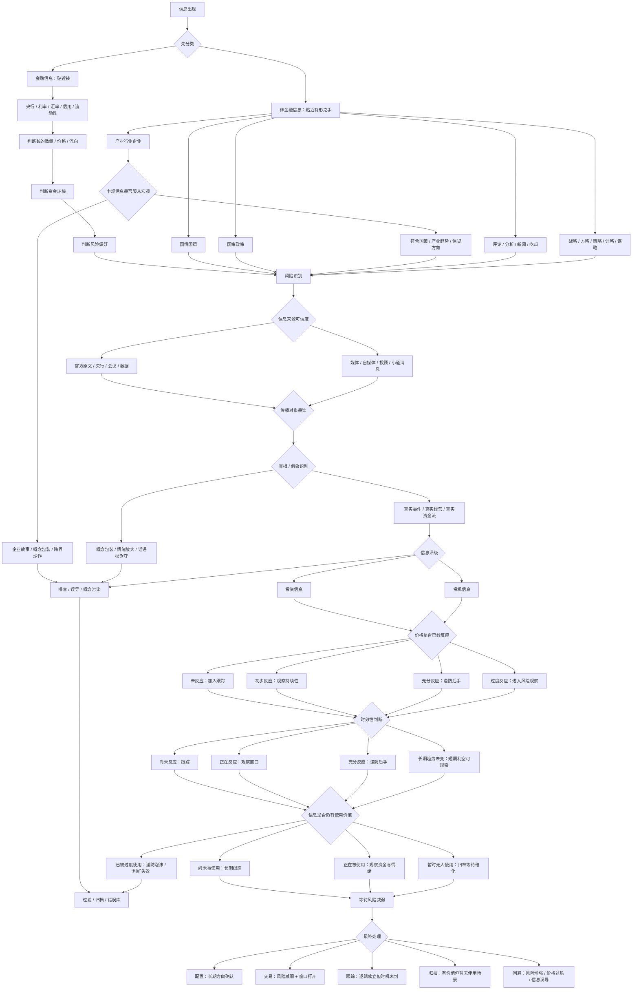

# 信息过滤流程 Skill

> 备注：本 skill 参考冰冰小美的《信息的金融意义》全系列。

## 1. Skill 目标

本 Skill 用于过滤、归纳、评级和处理金融市场中的各类信息，帮助判断一条信息是否具备金融意义，是否已经被市场反应，是否仍有使用价值，以及最终应进入交易、配置、跟踪、归档或回避。

核心目标：

> 先识别信息属性，再判断风险状态；先确认来源与动机，再判断价格反应；先等待风险减弱，再决定是否交易。

---

## 2. 适用场景

当用户提供以下内容时，启用本 Skill：

1. 一条新闻、政策、公告、研报、帖子或市场传闻。
2. 一篇文章中的核心观点或投资线索。
3. 某个板块、指数、产业、个股相关信息。
4. 央行、财政、五年规划、中央会议等官方信息。
5. 自媒体、大V、投顾、媒体、券商报告等二级信息。
6. 用户希望判断某条信息是否有用、是否过时、是否能交易。
7. 用户要求“用冰冰小美的信息金融意义框架分析”。

---

## 3. 核心原则

### 3.1 金融信息贴近钱

金融信息的优先判断对象是：

* 钱的数量；
* 钱的价格；
* 钱的流向；
* 信用环境；
* 流动性；
* 风险偏好。

优先关注：

* 央行；
* 利率；
* 汇率；
* 国债收益率；
* 信贷；
* 社融；
* M0、M1、M2；
* 准备金率；
* 公开市场操作；
* 财政与货币协调。

---

### 3.2 非金融信息贴近有形之手

非金融信息主要看：

* 国情国运；
* 国策政策；
* 产业行业企业；
* 评论、分析、新闻、吃瓜；
* 战略、方略、策略、计略、谋略。

非金融信息的价值在于判断：

* 国家想解决什么问题；
* 政策服务哪个长期方向；
* 产业如何承接；
* 企业是否真实受益；
* 舆论是否影响情绪；
* 战略是否改变长期资金流向。

---

### 3.3 风险在前，交易在后

所有信息必须先进入风险识别，再进入交易判断。

禁止单条信息直接导出买入结论。

---

### 3.4 信息正确不等于可交易

一条信息即使方向正确，也可能出现以下情况：

* 价格已经充分反应；
* 市场已经过度使用；
* 信息只适合长期跟踪；
* 只有投机价值；
* 只是概念包装；
* 传播对象就是后手接盘者；
* 当前风险状态不支持交易。

---

### 3.5 交易只是最终处理之一

信息过滤后的最终动作包括：

* 配置；
* 交易；
* 跟踪；
* 归档；
* 回避；
* 写入错误库。

---

## 4. 总体流程

```text
信息出现
→ 先分类
→ 金融 / 非金融分流
→ 风险识别
→ 来源可信度判断
→ 传播对象与动机判断
→ 真相 / 假象识别
→ 信息评级
→ 价格反应判断
→ 时效性判断
→ 信息使用价值判断
→ 等待风险减弱
→ 最终处理
```

---

## 5. Mermaid 流程图



---

## 6. 执行步骤

## Step 1：信息初始分类

判断信息属于哪一类。

| 分类    | 判断标准               | 重点问题        |
| ----- | ------------------ | ----------- |
| 金融信息  | 直接影响钱、信用、利率、汇率、流动性 | 是否改变资金环境    |
| 非金融信息 | 影响国情、政策、产业、舆论、战略   | 是否改变有形之手的方向 |
| 混合信息  | 同时影响资金和政策方向        | 先拆分，再分别判断   |

输出格式：

```markdown
## 1. 信息分类

- 信息内容：
- 信息类型：金融 / 非金融 / 混合
- 直接影响对象：
- 是否贴近钱：
- 是否贴近有形之手：
- 初步判断：
```

---

## Step 2：金融信息判断

如果属于金融信息，必须判断它影响钱的哪个维度。

| 维度   | 含义       | 观察对象                |
| ---- | -------- | ------------------- |
| 钱的数量 | 市场可用资金多少 | M2、社融、信贷、财政支出、央行投放  |
| 钱的价格 | 使用资金的成本  | 利率、国债收益率、信用利差、汇率    |
| 钱的流向 | 资金进入哪里   | 信贷结构、产业贷款、ETF流入、成交额 |

输出格式：

```markdown
## 2. 金融信息判断

- 影响钱的数量：
- 影响钱的价格：
- 影响钱的流向：
- 对流动性的影响：
- 对信用环境的影响：
- 对风险偏好的影响：
- 是否改变资金环境：
```

---

## Step 3：非金融信息判断

如果属于非金融信息，按五层拆解。

| 层级       | 内容                 | 判断重点      |
| -------- | ------------------ | --------- |
| 国情国运     | 国家发展阶段、人口、产业、教育、制度 | 长期底色      |
| 国策政策     | 顶层设计与阶段执行          | 长期方向与短期调节 |
| 产业行业企业   | 实体承接               | 是否真实经营变化  |
| 评论分析新闻吃瓜 | 传播层                | 是否制造情绪    |
| 五略       | 战略、方略、策略、计略、谋略     | 是否服务大局判断  |

输出格式：

```markdown
## 3. 非金融信息判断

- 对应国情国运：
- 对应国策政策：
- 对应产业行业企业：
- 是否属于评论 / 分析 / 新闻 / 吃瓜：
- 是否涉及五略：
- 对有形之手的影响：
- 对长期方向的影响：
```

---

## Step 4：中观信息服从宏观判断

产业、行业、企业信息必须先向上验证。

检查问题：

1. 是否符合国情国运？
2. 是否符合国策政策？
3. 是否符合信贷流向？
4. 是否符合产业周期？
5. 是否有真实经营变化？
6. 是否有业绩体现？
7. 是否只是跨界炒作？
8. 是否只是概念叠加？

输出格式：

```markdown
## 4. 中观信息是否服从宏观

- 产业方向：
- 行业阶段：
- 企业动作：
- 是否符合国策：
- 是否符合信贷方向：
- 是否有真实经营变化：
- 是否有业绩体现：
- 是否存在概念包装：
- 结论：通过 / 降权 / 过滤
```

---

## Step 5：风险识别

所有信息都必须进入风险判断。

| 风险状态      | 含义          | 处理方式      |
| --------- | ----------- | --------- |
| R3 强风险增强  | 多个风险因子共振上升  | 回避，禁止新增仓位 |
| R2 中风险增强  | 风险明显抬升      | 降低权重，等待   |
| R1 弱风险观察  | 出现风险苗头      | 加入观察      |
| N 中性      | 风险方向不明      | 继续跟踪      |
| W1 风险边际减弱 | 风险冲击放缓      | 观察候选      |
| W2 风险明显减弱 | 多个信号修复      | 进入交易评估    |
| W3 风险转机会  | 风险释放充分，资金回流 | 可进入执行层    |

输出格式：

```markdown
## 5. 风险识别

- 当前风险等级：
- 风险增强证据：
- 风险减弱证据：
- 是否存在风险释放：
- 是否进入风险减弱观察：
- 是否允许进入交易评估：
```

---

## Step 6：信息来源可信度判断

信息来源按可信度分层。

| 评级 | 来源                   | 权重 |
| -- | -------------------- | -- |
| S  | 央行、中央级会议、官方原文、统计数据   | 最高 |
| A  | 国务院、财政、发改、行业主管部门正式文件 | 高  |
| B  | 上市公司公告、财报、交易所文件      | 中高 |
| C  | 券商研报、机构调研、专业分析       | 中  |
| D  | 媒体、自媒体、大V、投顾         | 低  |
| E  | 小道消息、传闻、群聊、无法验证信息    | 极低 |

输出格式：

```markdown
## 6. 信息来源可信度

- 信息来源：
- 是否一手信息：
- 是否官方原文：
- 是否经过二次解读：
- 是否存在商业动机：
- 可信度评级：S / A / B / C / D / E
- 是否需要回到原文核验：
```

---

## Step 7：传播对象与发布动机判断

判断信息是说给谁听的。

传播对象类型：

| 类型     | 特征               | 风险     |
| ------ | ---------------- | ------ |
| 普遍对象   | 五年规划、重大政策、官方发布   | 需要长期跟踪 |
| 特定对象   | 投顾、收费社群、荐股、产业链信息 | 可能引导行动 |
| 情绪对象   | 新闻标题、自媒体热点、吃瓜信息  | 放大情绪   |
| 后手对象   | 热点尾声、利好刷屏、群体追涨   | 接盘风险   |
| 体系建设对象 | 深度文章、方法论、长期框架    | 适合归纳   |

输出格式：

```markdown
## 7. 传播对象与动机

- 发布者是谁：
- 发布者动机：
- 信息说给谁听：
- 我是否属于目标对象：
- 是否引导交易行为：
- 是否制造紧迫感：
- 是否存在收费、引流、荐股、知识变现：
- 结论：
```

---

## Step 8：真相 / 假象识别

判断这条信息更接近真实变化，还是概念包装。

| 类型  | 判断标准                        |
| --- | --------------------------- |
| 真相  | 真实事件、真实经营、真实订单、真实资金流、真实政策文件 |
| 半真相 | 方向正确，但价格已反应或兑现周期较长          |
| 假象  | 概念叠加、情绪放大、跨界蹭热点、话语权争夺       |
| 噪音  | 没有证据、无法验证、只制造情绪             |

输出格式：

```markdown
## 8. 真相 / 假象识别

- 是否有真实事件：
- 是否有真实经营变化：
- 是否有真实资金流：
- 是否有政策文件支撑：
- 是否存在概念包装：
- 是否存在情绪放大：
- 判断：真相 / 半真相 / 假象 / 噪音
```

---

## Step 9：信息评级

判断信息更偏投资、投机，还是噪音。

| 类型   | 特征                  | 处理方式     |
| ---- | ------------------- | -------- |
| 投资信息 | 长期方向、真实经营、资金支持、政策连续 | 可配置或跟踪   |
| 投机信息 | 题材、概念、情绪、波动率、短期胜率   | 只允许规则化交易 |
| 噪音信息 | 传闻、马后炮、标题党、情绪污染     | 过滤或归档    |
| 误导信息 | 引导接盘、逻辑偷换、虚假利好      | 回避并写入错误库 |

输出格式：

```markdown
## 9. 信息评级

- 信息属性：投资 / 投机 / 噪音 / 误导
- 评级理由：
- 是否适合配置：
- 是否适合交易：
- 是否只适合跟踪：
- 是否需要过滤：
```

---

## Step 10：价格是否已经反应

信息正确之后，还必须判断价格位置。

| 状态   | 含义        | 处理       |
| ---- | --------- | -------- |
| 未反应  | 市场尚未定价    | 加入跟踪     |
| 初步反应 | 价格刚开始表达   | 观察持续性    |
| 充分反应 | 信息已被市场消化  | 防止后手     |
| 过度反应 | 价格透支远期预期  | 进入风险观察   |
| 反向反应 | 利好不涨或利空不跌 | 重新评估信息含义 |

输出格式：

```markdown
## 10. 价格反应判断

- 信息最早出现时间：
- 价格首次反应时间：
- 当前价格反应程度：
- 是否已经充分反应：
- 是否已经过度反应：
- 是否存在利好不涨 / 利空不跌：
- 结论：
```

---

## Step 11：时效性判断

判断信息处于哪个时间阶段。

| 阶段   | 特征         | 处理   |
| ---- | ---------- | ---- |
| 预热期  | 信息出现但市场未重视 | 跟踪   |
| 启动期  | 资金开始反应     | 观察窗口 |
| 扩散期  | 媒体和大众开始关注  | 谨慎参与 |
| 高潮期  | 利好刷屏，价格大涨  | 防止后手 |
| 兑现期  | 事件落地或预期兑现  | 防止回落 |
| 失效期  | 信息无法再推动价格  | 过滤   |
| 再激活期 | 旧信息遇到新催化   | 重新评级 |

输出格式：

```markdown
## 11. 时效性判断

- 当前处于：预热 / 启动 / 扩散 / 高潮 / 兑现 / 失效 / 再激活
- 大众认知程度：
- 媒体报道强度：
- 是否接近事件落地：
- 是否存在催化节点：
- 是否还有交易窗口：
```

---

## Step 12：信息使用价值判断

判断信息是否仍有市场使用价值。

| 状态     | 含义         | 处理   |
| ------ | ---------- | ---- |
| 尚未被使用  | 有潜在价值但缺少催化 | 长期跟踪 |
| 正在被使用  | 资金和情绪正在反应  | 观察风险 |
| 过度使用   | 已经透支远期预期   | 回避   |
| 暂时无人使用 | 有价值但无资金关注  | 归档等待 |
| 已经失效   | 再次出现也无推动力  | 过滤   |

输出格式：

```markdown
## 12. 信息使用价值

- 市场是否正在使用：
- 是否有资金配合：
- 是否有情绪配合：
- 是否有宏观背景支持：
- 是否已经被上一轮行情使用过：
- 是否已经过度使用：
- 当前处理方式：
```

---

## Step 13：等待风险减弱

只有满足以下条件，才允许进入交易评估：

1. 风险等级至少达到 W1。
2. 价格没有明显过度反应。
3. 信息仍有使用价值。
4. 来源可信度不低于 C。
5. 非官方信息已经完成真相 / 假象识别。
6. 中观信息已经通过宏观服从检查。
7. 传播对象没有明显后手接盘特征。
8. 有明确资金、情绪或政策验证信号。

输出格式：

```markdown
## 13. 风险减弱确认

- 是否达到 W1：
- 是否达到 W2：
- 是否达到 W3：
- 验证信号：
- 是否允许交易评估：
- 是否只适合继续跟踪：
```

---

## Step 14：最终处理

最终处理必须分流，不能默认交易。

| 处理方式 | 条件                    |
| ---- | --------------------- |
| 配置   | 长期方向确认，政策连续，资金支持，价格合理 |
| 交易   | 风险减弱，窗口打开，情绪与流动性支持    |
| 跟踪   | 逻辑成立，时机未到             |
| 归档   | 有价值但暂无使用场景            |
| 回避   | 风险增强，价格过热，信息误导        |
| 错误库  | 信息明显诱导、重复误判、造成亏损      |

输出格式：

```markdown
## 14. 最终处理

- 最终动作：配置 / 交易 / 跟踪 / 归档 / 回避 / 错误库
- 核心理由：
- 后续观察条件：
- 失效条件：
- 风险提示：
```

---

## 7. 标准输出模板

执行本 Skill 时，默认输出以下结构：

```markdown
# 信息过滤报告：{{信息标题}}

## 1. 一句话结论

## 2. 信息分类

- 类型：
- 直接影响对象：
- 核心变量：

## 3. 金融 / 非金融拆解

- 金融维度：
- 非金融维度：
- 是否影响钱的数量 / 价格 / 流向：
- 是否影响有形之手：

## 4. 风险识别

- 风险等级：
- 风险增强证据：
- 风险减弱证据：

## 5. 来源可信度

- 来源：
- 信息层级：
- 可信度评级：
- 是否需要核验原文：

## 6. 传播对象与动机

- 发布者：
- 传播对象：
- 发布动机：
- 是否引导交易：

## 7. 真相 / 假象识别

- 真实证据：
- 概念包装：
- 情绪污染：
- 判断：

## 8. 信息评级

- 投资 / 投机 / 噪音 / 误导：
- 评级理由：

## 9. 价格反应与时效性

- 价格是否反应：
- 当前阶段：
- 是否还有窗口：

## 10. 信息使用价值

- 是否正在被市场使用：
- 是否已经过度使用：
- 是否需要归档等待：

## 11. 最终处理

- 配置 / 交易 / 跟踪 / 归档 / 回避：
- 理由：
- 后续观察：
- 失效条件：

## 12. 一句话复盘

用一句话说明这条信息真正的金融意义。
```

---

## 8. 快速输出模板

当用户只要求快速判断时，输出：

```markdown
## 信息过滤快速判断

- 信息类型：
- 核心影响：
- 来源可信度：
- 传播对象：
- 信息评级：
- 价格反应：
- 时效阶段：
- 使用价值：
- 风险等级：
- 最终处理：
- 一句话结论：
```

---

## 9. 禁止事项

执行本 Skill 时，禁止以下行为：

1. 单凭利好直接给出买入结论。
2. 单凭官方政策判断某个个股必然受益。
3. 把产业长期正确直接等同为当前可交易。
4. 忽略价格是否已经充分反应。
5. 忽略信息是否已经被上一轮行情使用过。
6. 忽略传播对象和发布动机。
7. 把媒体标题、自媒体热文、群聊传闻当成高权重信息。
8. 中观信息未经宏观验证直接进入交易评估。
9. 风险仍在增强时输出积极交易判断。
10. 把投机信息包装成投资信息。
11. 把噪音信息强行解释成机会。
12. 忽略归档、跟踪、回避等非交易处理方式。

---

## 10. 启用口令

用户出现以下表达时，自动启用本 Skill：

* “过滤这条信息”
* “判断这个消息有没有金融意义”
* “这个信息能不能交易”
* “这个新闻有用吗”
* “这个政策怎么影响市场”
* “这个产业信息是真相还是假象”
* “这个消息是不是已经反应完了”
* “用信息过滤流程分析”
* “用冰冰小美信息金融意义框架分析”
* “判断这个信息属于投资还是投机”
* “这个信息该跟踪、交易还是回避”

---

## 11. 最终原则

每次执行必须回答六个问题：

1. 这条信息影响钱，还是影响有形之手？
2. 它来自哪里，说给谁听，发布者有什么动机？
3. 它是真实变化，还是概念包装和情绪放大？
4. 它属于投资信息、投机信息、噪音信息，还是误导信息？
5. 价格是否已经反应，信息是否仍有使用价值？
6. 当前应配置、交易、跟踪、归档，还是回避？

核心准则：

> 信息先过滤，风险先识别，价格先确认，时效先判断，交易最后发生。
