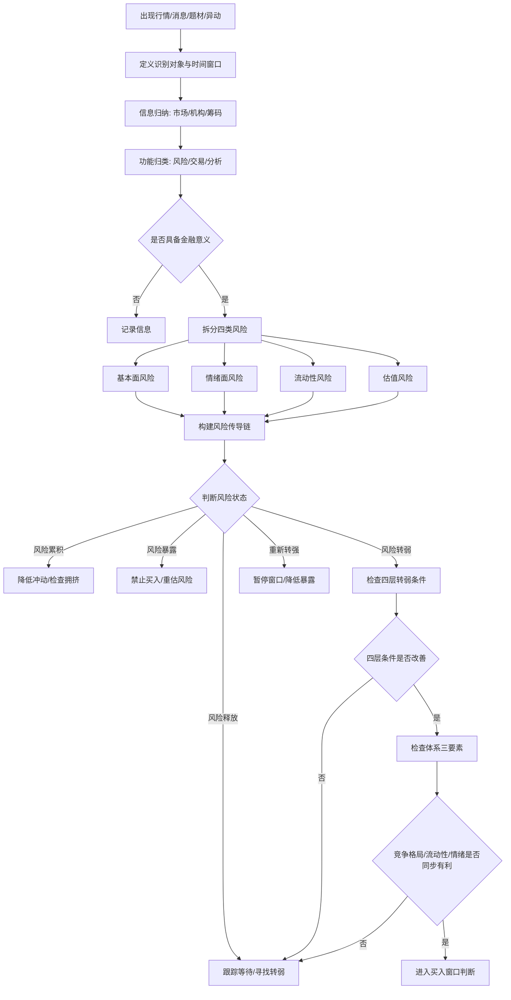

---

name: risk-identification
title: 冰冰小美-风险识别 Skill
type: skill
status: active
version: 0.2
updated: 2026-06-11
tags:

* strategy/risk-control
* strategy/timing
* strategy/valuation
* macro/liquidity
* function/skill
  sources:
* "[[sources/articles/2025-06-08-冰冰小美：信息的金融意义（二）]]"
* "[[sources/articles/2025-01-25-冰冰小美：行情不等于风险]]"
* "[[reasoning/冰冰小美如何判断风险转弱的节点]]"
  related:
* "[[people/冰冰小美]]"
* "[[reasoning/冰冰小美如何判断风险转弱的节点]]"
* "[[reasoning/冰冰小美-风险转弱节点如何形成买入窗口]]"

---

# 冰冰小美-风险识别 Skill

## 1. Skill 定位

本 skill 用于在买入、加仓、持仓复盘前，识别市场、板块、个股或事件中的风险状态。

核心任务：

> 先识别风险是否正在累积、暴露、释放或转弱，再决定是否进入买入窗口。

本 skill 输出四类结果：

1. **禁止进入**：风险仍在增强。
2. **防御观察**：风险已暴露，但仍未释放充分。
3. **跟踪等待**：风险正在释放，需要寻找转弱信号。
4. **进入买入窗口判断**：风险开始转弱，允许接入买入规则、仓位规则和退出规则。

---

## 2. 启用条件

遇到以下情况，必须启用本 skill：

* 某个板块、指数或个股突然大涨；
* 利好、政策、题材、会议、宏观事件集中出现；
* 市场讨论度快速升温；
* 自己产生追涨、抄底、补仓冲动；
* 持仓出现异常波动；
* 准备判断某个方向是否进入买入窗口；
* 需要判断“行情有利”是否对应“风险可承接”。

---

## 3. 核心原则

### 3.1 风险在前，交易在后

交易动作排在风险识别之后。

执行顺序：

```text
识别信息 → 拆分风险 → 判断风险状态 → 检查风险是否转弱 → 决定交易动作
```

### 3.2 行情需要放进时间窗口

行情、消息、题材、利好都要加上时间变量。

同一个信息，在不同时间窗口下，含义会变化：

| 时间位置  | 信息含义          |
| ----- | ------------- |
| 风险累积期 | 利好可能吸引追高资金    |
| 风险暴露期 | 利好可能成为出货窗口    |
| 风险释放期 | 利空可能加速筹码出清    |
| 风险转弱期 | 同样的利好才可能提高容错率 |

### 3.3 风险转弱提高容错率

风险转弱的意义在于：

* 做错后仍有修正空间；
* 仓位、状态、思考可以调整；
* 市场承接环境改善；
* 交易胜率和赔率同时改善。

风险转弱并非无波动，只代表负反馈减弱、承接能力增强。

---

## 4. 输入信息

每次运行 skill，先收集以下输入：

```text
识别对象：
识别层级：市场 / 指数 / 板块 / 个股 / 事件
当前行情：上涨 / 下跌 / 横盘 / 异常波动
触发信息：
信息发布时间：
当前价格位置：
当前情绪位置：
当前仓位：
计划动作：买入 / 加仓 / 持有 / 减仓 / 观察
```

---

## 5. 信息归纳入口

先把信息归为三类来源、三类功能。

### 5.1 按来源归类

| 来源        | 内容                    | 作用               |
| --------- | --------------------- | ---------------- |
| 市场数据      | 股价、成交量、汇率、利率、债市、期货    | 判断波动率、流动性、跨市场传导  |
| 机构数据      | 财报、监管报告、研报、行业数据       | 判断盈利、政策、基本面质量    |
| 用户 / 筹码数据 | 散户集中度、机构持仓、ETF 申赎、融资盘 | 判断拥挤交易、筹码断层、风格迁移 |

### 5.2 按功能归类

| 功能  | 内容                 | 作用          |
| --- | ------------------ | ----------- |
| 风险类 | 波动率、违约、减持、信用、估值锚缺失 | 判断风险是否暴露    |
| 交易类 | 流动性、订单流、成交额、换手、承接  | 判断能否进入、能否退出 |
| 分析类 | 行业趋势、政策解读、宏观叙事     | 判断风险传导方向    |

---

## 6. 风险识别主流程

## Step 1：判断信息是否具备金融意义

检查该信息是否会改变市场行为。

```text
是否引发价格快速波动：
是否引发成交量明显变化：
是否引发市场共识快速集中：
是否引发全民关注：
是否影响流动性：
是否影响估值锚：
是否影响盈利预期：
是否影响信用状态：
是否影响政策预期：
```

输出：

```text
信息级别：低 / 中 / 高
是否进入风险跟踪：是 / 否
理由：
```

判断规则：

* 低级别信息：只记录。
* 中级别信息：加入观察列表。
* 高级别信息：进入风险状态识别。

---

## Step 2：拆分四类风险

### 2.1 基本面风险

关注企业、行业、制度与盈利质量。

检查项：

```text
企业盈利是否改善：
改善是否可持续：
涨价是否有真实需求支撑：
供给侧是否改善：
库存周期是否转向：
行业竞争是否恶化：
公司治理是否存在瑕疵：
是否存在减持、质押、解禁、财务问题：
```

风险增强信号：

```text
产能过剩
价格上涨缺少需求支撑
利润改善只来自短期价格波动
行业同质化竞争加剧
管理层信用差
高位减持或解禁压力大
```

风险转弱信号：

```text
供给侧改善
库存周期转向
需求刺激出现
盈利预期修复
行业竞争格局改善
制度约束改善
```

---

### 2.2 情绪面风险

关注亏钱效应、羊群行为、量化游资放大、市场一致预期。

检查项：

```text
市场是否从担忧进入恐惧：
是否出现连续亏钱效应：
讨论热度是否过热：
投资者是否集中追逐同一方向：
板块是否进入冰点：
冰点后是否出现试错：
试错后是否形成接力：
高度压制是否被突破：
```

风险增强信号：

```text
赚钱效应过度集中
社交平台讨论度暴增
利好发布后抢跑
一致预期达到高位
亏钱效应扩散
高标断板带动板块退潮
```

风险转弱信号：

```text
市场讨论降温
杀跌动能减弱
坏消息对价格冲击变小
冰点后开始试错
试错方向出现持续承接
情绪从恐惧转为谨慎接力
```

---

### 2.3 流动性风险

关注能否进入、能否退出、承接是否真实。

检查项：

```text
成交额是否持续放大：
放量是否带来价格推进：
上涨是否依赖短期接力：
ETF 资金是否持续流入：
融资盘是否退散：
赎回压力是否减弱：
市场是否存在流动性踩踏：
```

风险增强信号：

```text
高位放量滞涨
缩量上涨
跟风股掉队
ETF 赎回加剧
融资盘被动平仓
好坏股票一起下跌
承接只集中在少数龙头
```

风险转弱信号：

```text
成交企稳
赎回压力下降
融资盘退散完成
下跌时承接增强
龙头先企稳
板块内部开始分化
资金从恐慌卖出转为选择性买入
```

---

### 2.4 估值风险

关注市场是否有可定价锚。

检查项：

```text
当前估值是否有锚：
估值锚来自股息、资源、现金流、政策定价还是产业趋势：
估值是否依赖纯情绪扩张：
PE 上升是否由流动性推动：
估值是否已经透支长期叙事：
```

风险增强信号：

```text
估值缺少锚
只靠概念和小作文定价
PE 快速扩张
基本面兑现慢于股价
板块内部冰火两重天
估值修复变成情绪投机
```

风险转弱信号：

```text
估值回到合理区间
股息率、资源价格、现金流形成锚
价格对利空钝化
盈利预期开始支撑估值
低估方向出现稳定承接
```

---

## Step 3：构建风险传导链

每一类风险都要写成传导链。

标准格式：

```text
信息源头：
核心变量：
传导机制：
影响对象：
市场行为变化：
风险状态：
验证指标：
失效条件：
```

示例：

```text
信息源头：输入性通胀预期
核心变量：涨价预期
传导机制：价格上涨预期推动周期板块估值修复
影响对象：化工、有色、资源类资产
市场行为变化：资金从低位破净方向寻找弹性
风险状态：若缺少需求支撑，后续存在盈利兑现风险
验证指标：产品价格、库存、产能利用率、企业利润
失效条件：涨价无法传导到利润，或需求继续收缩
```

---

## Step 4：判断风险状态

风险状态分为五档。

| 状态     | 含义             | 动作         |
| ------ | -------------- | ---------- |
| 风险累积   | 行情有利，风险在暗处堆积   | 降低冲动，检查拥挤度 |
| 风险暴露   | 利空显性化，价格开始剧烈反应 | 禁止追涨和盲目补仓  |
| 风险释放   | 价格和情绪正在消化风险    | 跟踪，不急于交易   |
| 风险转弱   | 负反馈减弱，承接能力修复   | 进入买入窗口判断   |
| 风险重新转强 | 新事件改变风险层级      | 降仓或退出观察    |

### 4.1 风险累积

识别标准：

```text
行情很热
利好很多
上涨速度快于理解速度
散户讨论度快速上升
估值开始脱离锚
基本面尚未兑现
交易拥挤度提高
```

动作：

```text
停止追涨
记录风险源
检查流动性出口
检查估值锚
降低仓位冲动
```

---

### 4.2 风险暴露

识别标准：

```text
重大利空出现
价格剧烈下跌
流动性突然变差
亏钱效应扩散
宏观、政策或信用变量恶化
板块由分化转为集体下跌
```

动作：

```text
禁止买入
禁止补仓
先判断风险层级
先写出传导链
等待风险释放
```

---

### 4.3 风险释放

识别标准：

```text
连续下跌后成交萎缩
高位筹码出清
坏消息冲击减弱
讨论热度下降
板块内部开始分化
龙头先于板块企稳
```

动作：

```text
建立跟踪表
标记关键节点
观察承接强弱
观察风险源是否缓和
准备但暂缓买入
```

---

### 4.4 风险转弱

识别标准：

```text
风险源头开始缓和
价格对坏消息反应钝化
流动性承接恢复
情绪从恐惧转向试错
估值锚重新出现
盈利预期开始改善
宏观、中观、微观、交易层面同步改善
```

动作：

```text
允许进入买入窗口判断
检查体系三要素
检查仓位规则
检查退出条件
小仓试错或分批进入
```

---

### 4.5 风险重新转强

识别标准：

```text
新事件改变风险层级
原有风险源再次扩散
流动性重新衰竭
情绪试错失败
估值锚失效
信用风险扩散
```

动作：

```text
暂停买入窗口
降低仓位暴露
重新构建风险传导链
等待新一轮风险释放
```

---

## Step 5：检查四层转弱条件

风险转弱不能只看单一利好，要检查四层条件是否同时改善。

| 层级 | 检查问题                    | 判断    |
| -- | ----------------------- | ----- |
| 宏观 | 流动性、信用、汇率、利率、政策环境是否边际改善 | 是 / 否 |
| 中观 | 经济周期、行业周期、供需结构是否改善      | 是 / 否 |
| 微观 | 企业盈利、库存、现金流、竞争格局是否改善    | 是 / 否 |
| 交易 | 情绪、成交、承接、筹码结构是否改善       | 是 / 否 |

输出：

```text
宏观层：改善 / 持平 / 恶化
中观层：改善 / 持平 / 恶化
微观层：改善 / 持平 / 恶化
交易层：改善 / 持平 / 恶化
综合判断：风险转弱成立 / 风险转弱待验证 / 风险仍在释放
```

---

## Step 6：检查体系三要素

只有风险转弱后，才进入三要素检查。

### 6.1 竞争格局

```text
是否符合安全与发展方向：
是否具备产业比较优势：
是否存在供给侧改善：
是否从恶性竞争转向格局修复：
是否有长期叙事支撑：
```

### 6.2 流动性辩证分析

```text
流动性来自真实增量还是短期接力：
ETF、融资盘、机构资金是否改善：
股票供给是否下降：
承接是否扩散到板块内部：
退出路径是否清晰：
```

### 6.3 情绪位置

```text
情绪是否处于冰点后：
是否从恐惧进入试错：
试错是否形成接力：
高度压制是否突破：
市场是否重新形成信心：
```

输出：

```text
竞争格局：有利 / 中性 / 不利
流动性：有利 / 中性 / 不利
情绪位置：有利 / 中性 / 不利
买入窗口：成立 / 待验证 / 不成立
```

---

## 7. 否决项

出现以下任一情况，直接否决买入：

```text
无法写出风险源头
无法写出风险传导链
风险仍在增强
流动性无法支持退出
估值缺少锚
上涨只由情绪接力推动
基本面兑现路径模糊
公司治理风险明显
政策预期已经高度透支
信用风险仍在扩散
交易动作只来自怕错过
当前时间窗口与策略不匹配
```

---

## 8. 输出模板

每次使用本 skill，输出以下结构：

```markdown
# 风险识别结果

## 1. 基本信息

- 识别对象：
- 识别层级：
- 识别日期：
- 当前行情：
- 触发信息：
- 计划动作：

## 2. 信息归纳

### 来源分类

- 市场数据：
- 机构数据：
- 用户 / 筹码数据：

### 功能分类

- 风险类信息：
- 交易类信息：
- 分析类信息：

## 3. 信息金融意义

- 是否改变市场行为：
- 是否影响流动性：
- 是否影响估值锚：
- 是否影响盈利预期：
- 是否引发情绪集中：
- 信息级别：低 / 中 / 高

## 4. 四类风险识别

| 风险类型 | 当前状态 | 证据 | 转弱信号 |
|---|---|---|---|
| 基本面风险 |  |  |  |
| 情绪面风险 |  |  |  |
| 流动性风险 |  |  |  |
| 估值风险 |  |  |  |

## 5. 风险传导链

- 信息源头：
- 核心变量：
- 传导机制：
- 影响对象：
- 市场行为变化：
- 风险状态：
- 验证指标：
- 失效条件：

## 6. 风险状态判断

当前风险状态：

- [ ] 风险累积
- [ ] 风险暴露
- [ ] 风险释放
- [ ] 风险转弱
- [ ] 风险重新转强

判断依据：

## 7. 四层转弱条件

| 层级 | 状态 | 证据 |
|---|---|---|
| 宏观 |  |  |
| 中观 |  |  |
| 微观 |  |  |
| 交易 |  |  |

综合结论：

## 8. 体系三要素

| 要素 | 状态 | 证据 |
|---|---|---|
| 竞争格局 |  |  |
| 流动性 |  |  |
| 情绪位置 |  |  |

## 9. 交易动作

- 结论：禁止进入 / 防御观察 / 跟踪等待 / 进入买入窗口判断
- 仓位建议：
- 退出条件：
- 下一次复盘时间：

## 10. 一句话结论

用一句话说明：当前风险处于什么阶段，为什么。
```

---

## 9. Mermaid 流程图



---

## 10. 使用口诀

```text
先看信息，
再归风险，
行情加时间，
利好查拥挤，
下跌查传导，
释放查承接，
转弱查四层，
买入查三要素。
```
