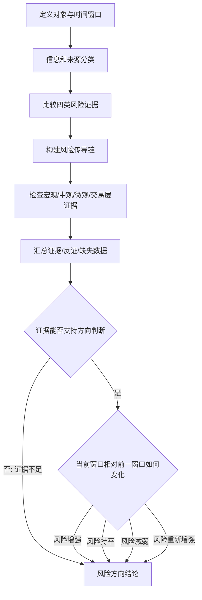

# 冰冰小美-风险识别 Skill

## 1. 定位与边界

本 skill 的唯一目的，是基于可核验信息和前后时间窗口对比，**只判断风险方向**。

最终状态只能从：风险增强 / 风险持平 / 风险减弱 / 风险重新增强 / 证据不足

### 非目标

- 不替代信息过滤流程，不判断信息是否值得配置、跟踪、归档或回避。
- 不分析竞争格局、流动性、情绪位置组成的其他决策框架。
- 仅输出风险方向与证据，不延伸到其他决策结论。

风险累积、暴露、释放等词，只能用来描述历史过程或当前证据，不得作为最终结果，也不得延伸为决策门槛。

## 2. 输入与比较基准

开始分析前必须明确：

```text
识别对象：市场 / 指数 / 板块 / 个股 / 事件
观察窗口（当前窗口）：起始时间至截止时间
比较窗口（前一窗口）：用于判断方向的前一可比时期
信息截止时间：
当前状态描述：
触发信息：
可用数据与缺失数据：
```

没有对象、时间窗口或可比基准时，不得把静态风险水平误写成方向变化；必要时输出`证据不足`。

## 3. 信息与来源分类

### 3.1 按来源分类

| 来源 | 典型内容 | 用途 |
|---|---|---|
| 市场数据 | 价格、成交量、利率、汇率、债券、期货 | 观察波动、流动性与跨市场传导 |
| 机构数据 | 财报、公告、监管文件、行业数据、可靠研报 | 观察盈利、信用、政策与供需变化 |
| 用户与筹码数据 | 持仓集中度、ETF 申赎、融资、讨论热度 | 观察拥挤、赎回压力与行为变化 |

记录来源、发布时间、统计口径和可信度。传闻、二手转述与未经验证推测必须单独标记，不能与一手数据等权。

### 3.2 按功能分类

| 功能 | 含义 |
|---|---|
| 风险事实 | 直接改变盈利、信用、流动性、估值锚或市场行为的事实 |
| 因果解释 | 解释风险如何从源头传导到对象的材料 |
| 背景上下文 | 帮助理解历史位置，但不能单独证明方向变化的材料 |

## 4. 四类风险证据

每类风险都必须同时记录当前窗口证据、前一窗口证据和反证。

### 4.1 基本面风险

关注盈利质量与持续性、供需、库存、产能、行业竞争、公司治理、信用、减持、质押和解禁。需求走弱、库存恶化、利润兑现低于预期或治理问题扩散，通常支持风险增强；供需改善、库存转向、现金流或盈利预期修复，通常支持风险减弱。

### 4.2 情绪风险

关注亏钱效应、讨论热度、一致预期、恐慌扩散、试错反馈和板块内部行为。拥挤升高、利好钝化、亏钱效应扩散，通常支持风险增强；热度降温、杀跌动能减弱、坏消息冲击变小，通常支持风险减弱。

### 4.3 流动性风险

关注成交、价格推进、ETF 申赎、融资压力、赎回压力、承接范围和踩踏迹象。放量滞涨、被动平仓、赎回加剧或承接收缩，通常支持风险增强；赎回压力下降、成交企稳、下跌承接改善或内部恢复分化，通常支持风险减弱。

### 4.4 估值风险

关注估值锚、盈利兑现、现金流、股息、资源价格、政策定价与叙事透支。估值脱锚、纯情绪扩张或价格远快于兑现，通常支持风险增强；估值回归可解释区间、锚重新有效或价格对利空钝化，通常支持风险减弱。

单一类别不能自动代表整体方向。必须说明它通过何种机制影响识别对象，并检查其他类别是否提供反证。

## 5. 风险传导链

对每条关键风险使用统一结构：

```text
信息源头 → 核心变量 → 传导机制 → 影响对象 → 可观察行为 → 方向支持证据 → 验证指标 → 失效条件
```

逐项填写：

```text
信息源头：
核心变量：
传导机制：
影响对象：
可观察行为：
方向支持证据：
验证指标：
失效条件：
```

如果中间环节只是推测，必须标明推测点；如果源头没有传到可观察行为，不得仅凭叙事确认方向。

## 6. 四层证据检查

四层检查用于交叉验证风险方向，不要求所有层级同向，但必须解释分歧。

| 层级 | 检查重点 | 当前窗口相对前一窗口 |
|---|---|---|
| 宏观 | 流动性、信用、汇率、利率、政策环境 | 边际改善 / 无明显变化 / 边际恶化 / 未获取到 |
| 中观 | 经济周期、行业周期、供需与竞争结构 | 边际改善 / 无明显变化 / 边际恶化 / 未获取到 |
| 微观 | 盈利、库存、现金流、治理与信用 | 边际改善 / 无明显变化 / 边际恶化 / 未获取到 |
| 交易层 | 情绪、成交、承接与筹码结构 | 边际改善 / 无明显变化 / 边际恶化 / 未获取到 |

交易层只能作为风险状态证据，不得越界产生执行建议。

## 7. 方向判断规则

1. **风险增强**：相对比较窗口，风险源、传导强度或可观察负反馈出现一致恶化，且反证不足以推翻。
2. **风险持平**：风险仍然存在，但强度、范围和传导没有可确认的边际变化。
3. **风险减弱**：风险源缓和、传导受阻或负反馈减弱，并有可观察数据验证；不等于风险消失。
4. **风险重新增强**：此前已经有可验证的风险减弱过程，随后新事件或旧风险复发，使传导和负反馈再次增强。没有“此前风险减弱”的基准时，不使用此状态。
5. **证据不足**：缺少可比窗口、关键数据、可靠来源或传导验证，或证据与反证冲突到无法区分方向。

判断纪律：

- 先写支持证据，再写反证，最后给方向。
- 区分风险水平与风险方向；高风险的方向可以是风险持平，低风险的方向也可能是风险增强。
- 区分事实、观点和推测，不用单条消息替代时间序列。
- 多层证据冲突时，降低置信度并列出缺失数据；无法解释冲突时输出`证据不足`。
- 每个结论都必须给出验证指标和失效条件，方便后续复核。

## 8. 执行流程

1. 定义识别对象、观察窗口、比较窗口和信息截止时间。
2. 按来源、功能整理信息，标记口径与可信度。
3. 比较前一窗口与当前窗口的基本面、情绪、流动性和估值风险证据。
4. 写出关键风险传导链，区分已验证环节与推测环节。
5. 用宏观、中观、微观、交易层证据交叉验证。
6. 汇总支持证据、反证、缺失数据和证据限制。
7. 从五种限定状态中选择且只选择一个风险方向。
8. 给出验证指标、失效条件、置信度和一句话结论。

## 9. 输出模板

```markdown
# 风险方向识别结果

## 1. 对象、窗口与截止时间

- 识别对象：
- 识别层级：
- 观察窗口（当前窗口）：
- 比较窗口（前一窗口）：
- 信息截止时间：

## 2. 信息与来源分类

| 信息 | 来源分类 | 功能分类 | 时间与口径 | 可信度 |
|---|---|---|---|---|
|  |  |  |  |  |

## 3. 四类风险证据

| 风险类别 | 前一窗口状态 | 当前窗口状态 | 方向证据 | 反证 |
|---|---|---|---|---|
| 基本面 |  |  |  |  |
| 情绪风险 |  |  |  |  |
| 流动性 |  |  |  |  |
| 估值 |  |  |  |  |

## 4. 风险传导链

- 信息源头：
- 核心变量：
- 传导机制：
- 影响对象：
- 可观察行为：
- 方向支持证据：
- 验证指标：
- 失效条件：

## 5. 前一窗口与当前窗口对比

- 风险范围变化：
- 风险强度变化：
- 传导速度变化：
- 四层证据及分歧：

## 6. 证据与反证

- 支持证据：
- 反证：
- 证据冲突与解释：

## 7. 风险方向结论

- 风险方向结论：风险增强 / 风险持平 / 风险减弱 / 风险重新增强 / 证据不足
- 判断理由：

## 8. 后续验证

- 验证指标：
- 失效条件：
- 建议复核时间：

## 9. 信息限制

- 未获取到：
- 未验证环节：
- 置信度：高 / 中 / 低

## 10. 一句话结论

用一句话说明识别对象在指定窗口内的风险方向、核心证据和主要限制。
```

## 10. Mermaid 流程图


