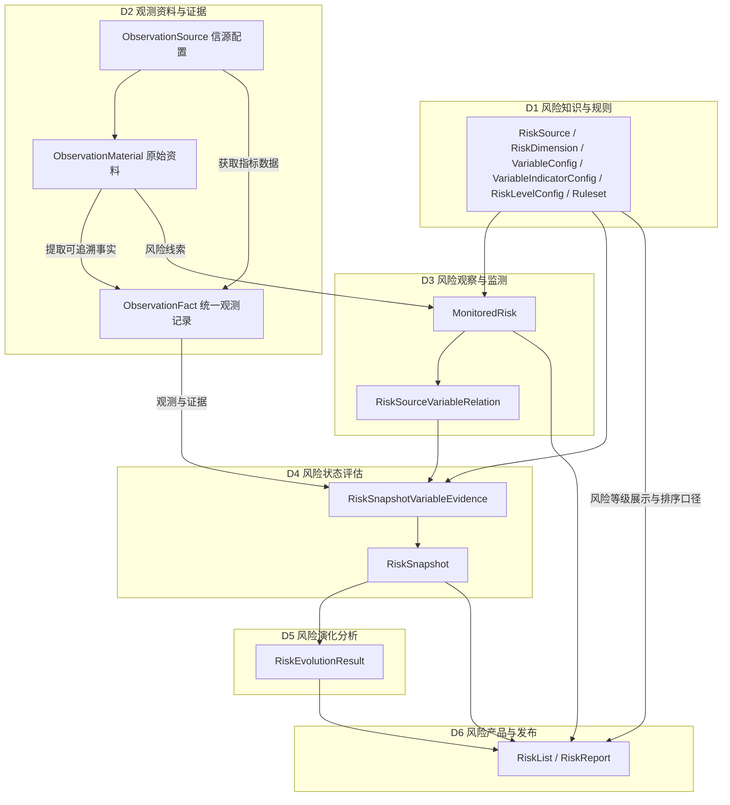
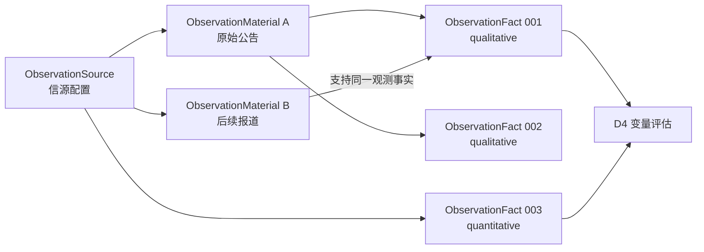
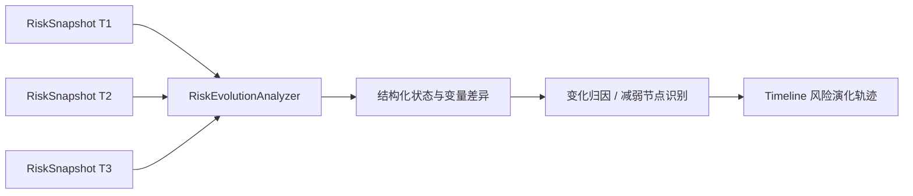
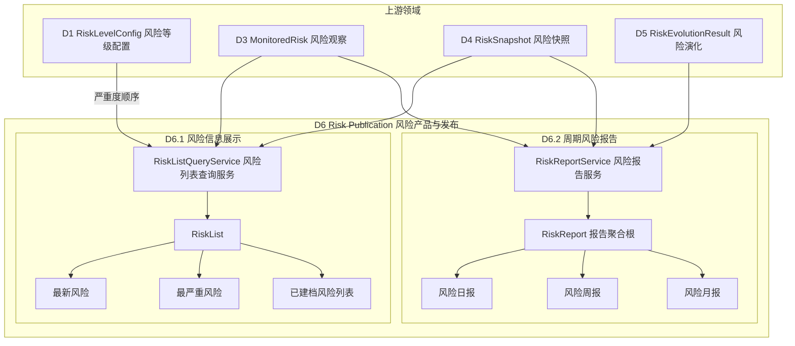
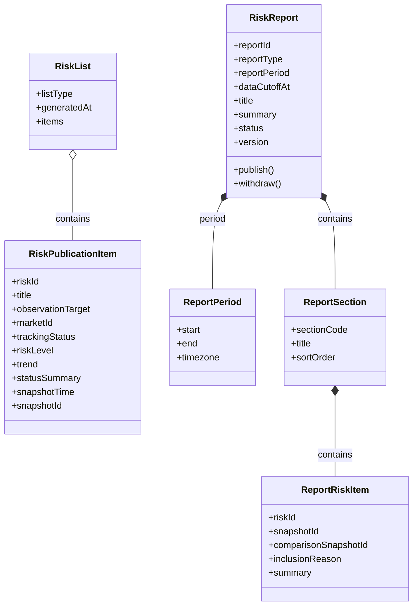
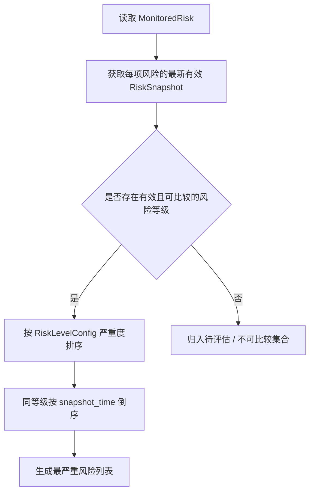
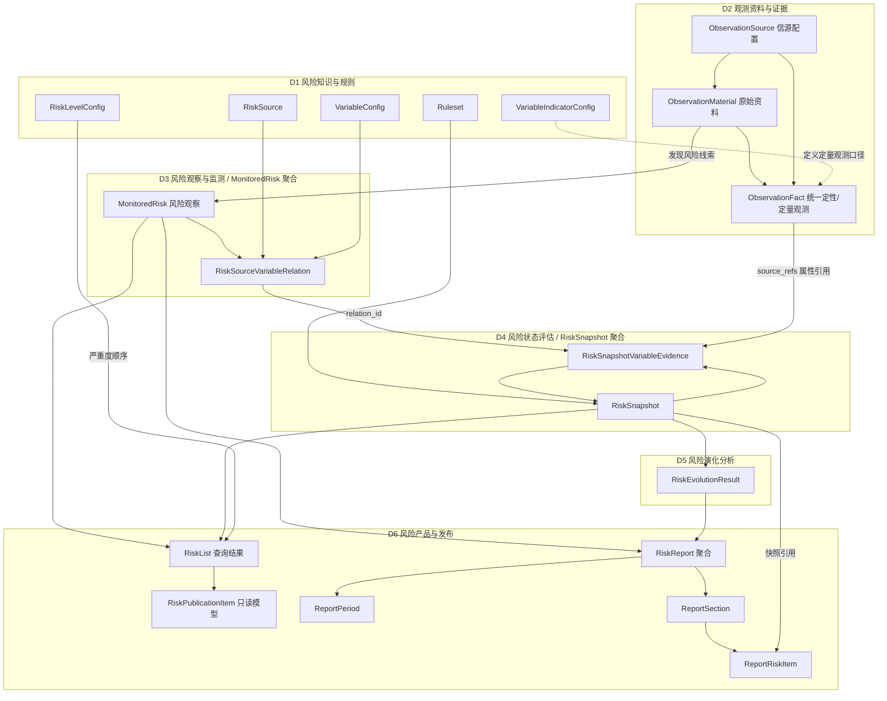
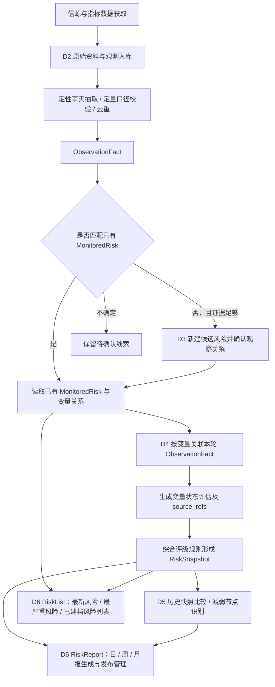

# RiskHot 业务领域设计

> **版本**：v2.2（纳入 D6 V1.0 风险产品与发布设计）  
> **日期**：2026-10-08  
> **依据**：用户提供的《冰冰小美-RiskHot架构设计.md》及后续设计讨论  
> **文档性质**：业务领域设计（Domain Design / DDD），用于指导后续模块设计与数据详细设计  
> **范围**：第一版宏观风险持续观察；数据表物理设计、详细字段类型、索引和存储拆分留待后续阶段。

---

## 1. 业务定位与边界

### 1.1 业务目标〔已确认〕

RiskHot 是宏观风险观察与演化监测系统，核心工作链为：

**认识风险 → 确定观察对象和传导机制 → 选择关键变量 → 收集观测证据 → 形成阶段性快照 → 对比演化与识别风险减弱节点。**

在“冰冰小美”的研究体系中，风险认识发生在方向判断、流动性分析和情绪位置判断之前。

### 1.2 第一版观察对象〔已确认〕

第一版仅建立以下四类宏观风险观察对象：

- 经济体
- 宏观主体（例如中央政府、中央银行）
- 市场
- 金融系统

行业、企业及单项资产可以成为宏观风险的证据或传导环节，第一版暂不独立建立为观察对象。

**需要区分的概念：**

- **风险观察对象**：风险判断针对哪个经济体、主体、市场或系统。
- **风险源**：风险来自哪些一级来源类别。
- **关键变量**：依靠哪些变量观察风险变化。
- **观测资料**：新闻、公告、研究材料等原始输入。
- **观测记录**：从原始资料提取的事实或取得的指标观测值。
- **风险快照**：针对确定风险和观察时点形成的整体判断。


### 1.3 第一版暂不覆盖〔已确认／边界归纳〕

- 对行业、个股、单一资产的独立风险实例建模。
- 将后续投资方向、仓位或交易执行判断并入风险快照。
- 在风险快照中输出未来走势预测；`next_observation` 只提出后续观察和验证重点。
- 为 RiskEvolutionResult 强制建立独立业务主表。

---


## 2. 领域全景与限界上下文


| 领域  | 名称                              | 核心职责                                      | 主要领域对象                                                                          |
| --- | ------------------------------- | ----------------------------------------- | ------------------------------------------------------------------------------- |
| D1  | 风险知识与规则（Risk Knowledge）         | 风险来源分类、风险性质、风险源核心观测变量配置、风险核心变量观测指标配置和评级规则 | `RiskSource`、`RiskDimension`、`VariableConfig`、`VariableIndicatorConfig`、`Ruleset` |
| D2  | 观测资料与证据（Observation & Evidence） | 管理信源、原始资料、结构化观测事实                         | `ObservationSource`、`ObservationMaterial`、`ObservationFact`                       |
| D3  | 风险观察与监测（Risk Monitoring）        | 建立具体风险、确定观察范围、风险源与关键变量的关联                 | `MonitoredRisk`、`RiskSourceVariableRelation`                                      |
| D4  | 风险状态评估（Risk Assessment）         | 依据观测记录评估变量，并形成当前整体风险快照                    | `RiskSnapshot`、`RiskSnapshotVariableEvidence`                                   |
| D5  | 风险演化分析（Risk Evolution）          | 比较历史快照，识别加剧、缓和、原因及减弱节点                    | `RiskEvolutionResult`（派生结果）                                                     |
| D6  | 风险产品与发布（Risk Publication） | 风险信息组织、风险列表排序、周期报告生成和内容发布管理 | `RiskPublicationItem`、`RiskList`、`RiskReport`、`ReportPeriod`、`ReportSection`、`ReportRiskItem` |


> **设计说明**：D1～D6 是业务边界和限界上下文，当前不要求对应六个独立服务。可先采用模块化单体实现。

> **命名约定**：全文领域名称与主要领域对象名称以本节表格为准。第 3.1 和 12.1 节保留当前设计采用的原有配置表、业务表名称；领域对象更名不直接确定物理表或字段更名。


### 2.1 领域上下文图




**说明**：D2 的来源到资料/记录路径表示业务能力关系。部分指标可直接由数据接口生成 ObservationFact，无须先形成新闻类资料；两类输入共用 ObservationFact 的领域概念。

---


## 3. D1：风险知识与规则领域

D1 定义**风险来源分类、风险性质、关键变量、观测指标和评级规则**。

### 3.1 配置对象〔已确认〕


| 领域对象 / 配置       | 原有配置名称              | 领域含义                         |
| --------------- | ------------------- | ---------------------------- |
| RiskSource      | `risk_source`       | 一级风险来源类别，同时可作为主题页入口          |
| RiskDimension   | `risk_dimension`    | 风险性质分类，如基本面、流动性、情绪、估值        |
| MarketConfig    | `market_config`     | 市场名称、代码和统一筛选口径               |
| VariableConfig  | `variable_config`   | 关键变量含义和解释边界                  |
| VariableIndicatorConfig | `indicator_config`  | 观测指标定义、统计口径、单位、频率、有效期、允许的数据源 |
| RiskLevelConfig | `risk_level_config` | 风险等级名称、顺序、颜色和展示说明，不承担评级判断    |
| Ruleset         | `ruleset`           | 判断风险等级、变化与解除的规则，包含适用范围和版本    |


**注意：** `RiskSource` 是风险来源分类；`ObservationSource` 是信息/指标的信源配置，职责不同。

---


## 4. D2：观测资料与证据领域（本轮重点调整）


### 4.1 领域职责〔已确认〕

D2 回答：

1. **信息从哪里来？**
2. **原始资料是什么？**
3. **从中观察到了什么定性事实，或取得了什么定量指标值？**
4. **观测记录能追溯到哪些原始来源、时间和口径？**

D2 提供可引用的事实和指标观测。**D2 不决定某项风险等级，也不在观测记录上固定“加剧某个风险”这样的风险专属判断。**

### 4.2 正式领域对象〔已确认〕


| 对象                    | 领域类型（建议）            | 含义                             | 示例                     |
| --------------------- | ------------------- | ------------------------------ | ---------------------- |
| `ObservationSource`   | 来源目录实体              | 信源配置；管理提供新闻、公告、研究材料及指标数据的机构或接口 | Reuters、FRED、美联储官网     |
| `ObservationMaterial` | 资料实体 / 可作为聚合根       | 原始新闻、公告、报告、研究材料；保留内容及出处        | 一份美联储政策声明              |
| `ObservationFact`         | **统一观测记录 / 可作为聚合根** | 一条可独立引用的定性事实或定量指标观测            | “美联储宣布维持利率”；某日国债收益率观测值 |


**统一领域对象边界：**

- 定性事实：由 `ObservationFact` 的 `qualitative` 类型承载。
- 定量指标观测：由 `ObservationFact` 的 `quantitative` 类型承载，不再单列独立领域对象。
- `EvidenceRef`：不单列领域对象，见 4.6。

> **重要边界**：领域概念合并，并不预先决定物理数据库必须采用单表。未来可按数据规模、修订规则和查询特性拆分存储。


### 4.3 ObservationFact 的统一领域语义〔已确认〕

**一条 ObservationFact 代表：带有明确内容或数值、时间上下文与可追溯出处、可供分析引用的一次观测。**

`observation_type`：


| 取值             | 中文名  | 内容举例                     | 常见输入来源          |
| -------------- | ---- | ------------------------ | --------------- |
| `qualitative`  | 定性观测 | “央行宣布维持政策利率”；“财政部上调发行计划” | 新闻、公告、政策文件、研究材料 |
| `quantitative` | 定量观测 | 某项国债收益率在某时点的观测数值         | 指标接口、统计数据、结构化公告 |


**共同属性（仅业务语义，不确定具体字段）**：唯一标识、观测类型、观测内容、发生/统计时点、资料/信源出处、统计或语义限定条件、记录及修订信息。

- 对定性观测，内容通常是主体、行为、对象、时间及限定条件，需区分“宣布计划”和“已经执行”。
- 对定量观测，内容通常是指标定义引用、观测值、单位、统计期、发布或修订批次。
- 可以从资料中提取多条 ObservationFact；同一个观测事实也可能被多份资料记载或支持。
- 事件和公告中的数字可以被结构化表示，具体划分为定性或定量观测应根据其是否构成可独立核对的指标观测决定；不为强行分类而丢失上下文。


### 4.4 ObservationMaterial、ObservationFact 的关联〔已确认原则／关系细节待细化〕




- 一份资料可以提取多条观测记录。
- 一条观测记录可以有多个来源支撑，需要保留可定位的出处。
- 定量观测可能从数据接口直接得到，保留指标定义及来源即可。
- 相似报道是否指向同一观测、何时需要新建观测，应在后续“事实同一性与修订”规则中细化。
- **此处只定义业务关联**，是否设置物理关联表留待数据详细设计。


### 4.5 D2 的领域行为〔建议〕


| 领域行为                          | 输入              | 输出                |
| ----------------------------- | --------------- | ----------------- |
| `RegisterSource`              | 信源信息            | 可用的信源配置           |
| `IngestMaterial`              | 新闻/公告/研究材料      | 原始资料记录            |
| `ExtractObservationFacts`         | 原始资料            | 多条定性观测候选          |
| `RecordQuantitativeObservationFact`  | 指标定义、数值、统计时间与来源 | 定量观测记录            |
| `ResolveDuplicateObservationFact` | 新观测与历史候选        | 复用已有记录或新增记录的建议    |
| `TraceObservationSource`      | 观测记录 ID         | 原始资料、原始位置、来源及相应版本 |


AI 可以帮助提取和归一化事实，数据校验、幂等控制、ID 分配、版本管理由程序负责。

### 4.6 关于证据引用的最终决定〔已确认〕

`EvidenceRef` **不作为独立领域对象建模。**

D4 中的 `RiskSnapshotVariableEvidence.source_refs` 直接保存对 D2 观测记录的引用及必要的版本/出处信息。

```text
ObservationFact（D2）
  └── OBS001：某个时点观察到的事实或指标值

RiskSnapshotVariableEvidence（D4）
  ├── observed_state：当前变量状态
  ├── interpretation：变量如何影响当前风险
  └── source_refs：引用 OBS001（及版本/来源定位）
```

**设计原则：** `ObservationFact` 存放观测本身；`source_refs` 是分析结果指向观测的属性。暂不新增 `evidence_ref` 领域实体或专用业务表。

### 4.7 D2 的聚合边界〔建议，暂不等同于建表〕

- `ObservationMaterial`：可独立管理原始资料、版本及来源定位。
- `ObservationFact`：可独立管理统一观测内容、状态和追溯关系。
- `ObservationSource`：由信源目录/配置管理能力维护。

是否进一步拆分、合并聚合，以及跨来源的同一事实如何归并，在应用流程和详细设计阶段确定。**当前先确认三个领域对象及其职责。**

---


## 5. D3：风险观察与监测领域


### 5.1 MonitoredRisk〔已确认〕

`MonitoredRisk` 表示**针对特定市场或主体，持续观察的一项具体宏观风险**，负责明确观察对象、观察边界和跟踪状态。

已有核心业务字段：


| 字段                          | 业务含义              |
| --------------------------- | ----------------- |
| `risk_id`                   | 风险观察唯一标识          |
| `title`                     | 风险名称，排除临时风险等级     |
| `slug`                      | 页面标识（可选）          |
| `summary`                   | 风险观察简介            |
| `market_id`                 | 关联市场字典            |
| `observation_target`        | 具体观察对象            |
| `scope_boundary`            | 研究对象边界与纳入范围       |
| `observation_reason`        | 为什么启动本项观察，关联可核验线索 |
| `tracking_status`           | 跟踪生命周期状态          |
| `tracking_status_reason`    | 暂停/结束等状态变更说明      |
| `first_observed_at`         | 首次发现风险线索时间        |
| `created_at` / `updated_at` | 创建/修改时间           |


`tracking_status` 既有取值：


| 取值           | 含义             |
| ------------ | -------------- |
| `observing`  | 观察中，建立观察基准     |
| `monitoring` | 监控中，持续更新       |
| `paused`     | 暂停跟踪，不代表风险减弱   |
| `closed`     | 结束跟踪，不自动代表风险解除 |


`scope_boundary` 负责定义研究范围，`RiskSourceVariableRelation` 将范围落实到具体需要观察的变量。

### 5.2 RiskSourceVariableRelation〔已确认〕

一条关系表示：**对某一 MonitoredRisk，在一个一级风险源下观察哪个变量、变量起什么作用、如何影响风险。**

已有字段：`relation_id`、`risk_id`、`source_id`、`variable_id`、`variable_role`、`variable_impact_on_risk`、`created_at`、`updated_at`。


| `variable_role`       | 角色   | 含义            |
| --------------------- | ---- | ------------- |
| `risk_driver`         | 风险驱动 | 什么产生或加大风险压力   |
| `risk_transmission`   | 风险传导 | 什么决定压力的传递程度   |
| `risk_buffer`         | 风险缓冲 | 什么能够吸收或减轻风险压力 |
| `damage_verification` | 损害验证 | 什么表明损害已发生     |


变量角色附着在特定风险下的关系上，同一变量在不同风险中可以担任不同角色。该关系**不保存本轮观测值或当前风险等级**。

### 5.3 主要约束〔已有原则 + 建议校验〕

- 观察对象第一版限定宏观四类。
- 优先匹配既有观察对象的身份和范围，避免按名称反复创建。
- 观察对象应具备能形成一致判断的边界，过宽时拆分。
- 新观测可触发既有 MonitoredRisk 的再次评估，无须重复创建 MonitoredRisk。
- 相同风险下，重复的风险源—变量有效关联应在业务上控制（具体唯一约束待数据设计）。

---


## 6. D4：风险状态评估领域


### 6.1 RiskSnapshotVariableEvidence〔已确认〕

每条记录表示：**某次风险快照中，一个已选关键变量当前是什么状态、有哪些事实支持、对风险判断有什么作用。**

已有字段及含义：


| 字段                   | 业务含义                               |
| -------------------- | ---------------------------------- |
| `evidence_id`        | 变量评估记录 ID                          |
| `snapshot_id`        | 所属快照                               |
| `relation_id`        | 指向 D3 的风险源—变量关系                    |
| `observed_state`     | 本次变量状态                             |
| `evidence_content`   | 本轮使用的事实和指标证据描述                     |
| `source_refs`        | 直接引用 D2 的 ObservationFact（必要时带版本和原始定位） |
| `change_description` | 相对对比快照的变化                          |
| `risk_effect`        | 当前证据体现风险压力、缓冲作用还是无法判断              |
| `interpretation`     | 在给定传导机制和条件下为何具有上述作用                |
| `uncertainty`        | 证据缺口、冲突和口径限制                       |
| `created_at`         | 评估记录创建时间                           |


**关键关系：** `relation_id` 已定位风险源和变量，无须在该评估对象上重新定义一套变量关系；`source_refs` 是属性，不单独建 EvidenceRef 对象。

### 6.2 RiskSnapshot〔已确认〕

一条 `RiskSnapshot` 表示**某项风险在明确截止时间的整体状态判断**，同一风险对应多次历史快照。

已有字段：


| 字段                       | 业务含义               |
| ------------------------ | ------------------ |
| `snapshot_id`            | 快照 ID              |
| `risk_id`                | 所属 MonitoredRisk            |
| `snapshot_time`          | 判断的信息截止时点          |
| `comparison_snapshot_id` | 对比历史快照；首轮可为空       |
| `status_summary`         | 当前风险状态及核心依据        |
| `risk_level`             | 依评级规则形成的风险等级；不足时可空 |
| `realization_degree`     | 已兑现与尚未证实的损害        |
| `trend`                  | 相对历史的变化方向          |
| `persistence_status`     | 当前持续条件是否仍存在        |
| `uncertainty`            | 数据缺口和不确定性          |
| `next_observation`       | 需要继续验证的事实或指标       |
| `created_at`             | 生成时间               |


`trend` 既有取值：

- `aggravating`：风险压力增强。
- `stable`：可比证据显示没有明显变化。
- `easing`：风险压力减轻。
- `undetermined`：首次评估、证据不足或不可比。

**重要规则〔已确认〕：**

1. `RiskLevelConfig` 只承担等级展示字典职责；等级判断来自分析与 `Ruleset`。
2. 风险等级、实际损害、变化趋势、持续条件分别判断。
3. 证据不足不等于低风险；无法比较不等于稳定。
4. 快照聚焦当前状态，不给出未来走势预测；`next_observation` 是后续观察重点。
5. 历史快照需要保留，供 D5 演化比较。


### 6.3 聚合建议〔建议〕

- `MonitoredRisk` 可作为风险观察聚合根，其下管理有效变量关系。
- `RiskSnapshot` 可作为独立评估聚合根，其下管理 `RiskSnapshotVariableEvidence` 集合。
- 采用独立快照聚合有利于长期积累历史，不要求一次加载某项风险所有历史快照。
- 快照发布、修订、作废和分析过程的具体状态机尚需进一步设计。

---


## 7. D5：风险演化分析领域


### 7.1 领域定义〔已确认〕

`RiskEvolutionResult` 表示多个 `RiskSnapshot` 连续变化轨迹的派生分析结果。

D5 通过快照比较回答：风险怎样从先前状态演化到当前状态、是什么变量推动变化、有没有出现风险减弱节点。

### 7.2 派生结果〔建议〕

第一版采用 `RiskEvolutionResult` 作为领域服务输出，不立即建立独立演化业务主表。

建议包含的语义：

- 起点快照、终点快照
- 整体风险等级变化、趋势变化
- 驱动、传导、缓冲与损害验证变量的关键变化
- 风险持续条件的变化
- 是否有可证据支持的减弱节点及其原因
- 对应的变量证据引用与不确定性




**待细化：** 什么条件构成“风险减弱节点”、连续缓和与单次波动如何区分、快照可比性与缺失证据如何处理。

---


## 8. D6：风险产品与发布领域（Risk Publication）

> **D6 设计版本**：V1.0，V1 设计范围已确认。  
> **依据**：[[sources/manual/RiskHot/2026-10-08-D6业务领域设计V1.0.txt|用户提供的 D6 业务领域设计 V1.0]]。本节将原稿转换为 Markdown，三张图依据原稿文字关系重建；图中未能从粘贴文本确定的关系基数不作补充。

### 8.1 领域定位

#### 8.1.1 领域定义

D6 负责将 RiskHot 已建立的风险观察对象、风险状态快照和风险演化分析结果，组织为面向用户的风险信息产品。

D6 的核心职责包括：**风险信息组织、风险列表排序、周期报告生成和内容发布管理**。

D6 直接使用 D1～D5 已形成的风险知识和分析结果，不重复承担风险识别、变量评估、风险等级判断等上游职责。

#### 8.1.2 V1 产品范围〔已确认〕

确定保留六种产品输出：

| 产品 | 英文名称 | 核心业务含义 |
| --- | --- | --- |
| 最新风险 | Latest Risks | 最近完成风险状态评估的风险 |
| 最严重风险 | Highest Severity Risks | 当前有效风险等级最高的风险 |
| 已建档风险列表 | Risk Catalog | 系统已建立的全部风险观察对象 |
| 风险日报 | Daily Risk Report | 汇总每日重要风险状态与变化 |
| 风险周报 | Weekly Risk Report | 总结一周内风险的持续演化 |
| 风险月报 | Monthly Risk Report | 总结一个月的整体风险格局及主要变化 |

V1 暂不包含市场影响力排名、传播热度计算、潜在市场冲击预测等能力。

#### 8.1.3 D6 领域业务架构



### 8.2 D6 领域划分〔建议〕

建议 D6 内部划分为两个业务能力模块：

| 业务模块 | 英文名称 | 负责解决的问题 |
| --- | --- | --- |
| D6.1 风险信息展示 | Risk Discovery | 用户如何找到最新、最严重及已建档风险？ |
| D6.2 周期风险报告 | Risk Reporting | 如何将多个风险的评估和演化结果汇总为日、周、月报？ |

两者共享风险数据读取能力，但数据管理方式不同：

- **风险列表**：基于 D3、D4 的最新有效数据动态生成，可使用缓存或查询投影。
- **风险报告**：每一期报告有独立的身份、周期、内容、版本和发布状态，需要建立完整领域聚合。

### 8.3 D6 核心领域对象

#### 8.3.1 领域对象清单

| 领域对象 | 中文名称 | 类型 | 作用 |
| --- | --- | --- | --- |
| `RiskPublicationItem` | 风险展示条目 | 只读模型 | 统一表示一条用于展示的风险信息 |
| `RiskList` | 风险列表 | 派生查询结果 | 根据查询规则生成三类风险列表 |
| `RiskReport` | 风险周期报告 | 聚合根 | 管理日报、周报、月报 |
| `ReportPeriod` | 报告周期 | 值对象 | 表示报告覆盖的时间区间 |
| `ReportSection` | 报告栏目 | 聚合内部实体 | 管理栏目分类和顺序 |
| `ReportRiskItem` | 报告风险条目 | 聚合内部实体 | 保存报告纳入的具体风险及判断引用 |

V1 不建立独立 `RiskRanking` 对象。最新风险、最严重风险均可根据时间和风险等级进行确定性排序，采用统一的 `RiskList` 查询结果模型即可。

#### 8.3.2 领域对象关系图



图中属性用于明确领域语义。是否对应数据库字段，以及各内部对象是否拆表，在数据详细设计阶段决定。

### 8.4 D6.1 风险信息展示详细设计

#### 8.4.1 RiskPublicationItem：风险展示条目

**定义：** 一条记录代表某个已建档风险在当前查询条件下的展示信息。

| 属性 | 业务含义 | 数据来源 |
| --- | --- | --- |
| `riskId` | 风险唯一标识 | D3 `MonitoredRisk` |
| `title` | 风险名称 | D3 |
| `observationTarget` | 风险观察对象 | D3 |
| `marketId` | 所属市场 | D3 |
| `trackingStatus` | 观察中、监控中、暂停、结束 | D3 |
| `riskLevel` | 最新有效风险等级 | D4 |
| `trend` | 加剧、稳定、缓和或待判断 | D4 |
| `statusSummary` | 当前风险状态说明 | D4 |
| `snapshotTime` | 最新有效评估的截止时间 | D4 |
| `snapshotId` | 对应快照 ID | D4 |

这些信息来自上游领域。D6 不另行维护风险等级和风险状态。展示模型使用原稿中的 camelCase 属性名；下文 `snapshot_time`、`risk_level` 对应上游 `RiskSnapshot` 的既有字段。

#### 8.4.2 三种风险列表业务规则

**A. 最新风险（Latest Risks）**

按最近一次有效评估的 `snapshot_time` 倒序，展示最近更新风险状态的观察对象。

一个风险只展示一条最新有效快照；尚无快照的风险不参与排序。这里的“最新”指风险评估更新，与首次建档时间区分。

**B. 最严重风险（Highest Severity Risks）**

根据风险当前有效快照的 `risk_level`，按 D1 `RiskLevelConfig`（原有配置名 `risk_level_config`）定义的严重程度顺序排列。

同等级按照 `snapshot_time` 倒序。等级为空或无法比较的风险单独标记为待评估，不参与严重程度排序。

**C. 已建档风险列表（Risk Catalog）**

展示系统全部已创建的 `MonitoredRisk`，包含观察中、监控中、暂停跟踪和结束跟踪的对象。

支持按市场、风险源、风险维度、跟踪状态、风险等级筛选。未产生快照的风险仍可出现在目录中。

#### 8.4.3 最严重风险排序规则



排序原则：

1. 风险等级以 D4 的研判结果为准。
2. 严重度顺序来自 D1 `RiskLevelConfig`，D6 不重新评分。
3. 相同等级按照最新快照时间排序，必要时使用风险 ID 保证顺序稳定。
4. `paused`、`closed` 等跟踪状态应显式处理。**V1 建议**默认榜单只纳入 `observing`、`monitoring`；暂停和结束跟踪的记录仍可在完整风险目录中查看。
5. 过于陈旧的快照需要标注评估时间和数据时效，不能仅因历史等级高就被展示为最新判断。

**重要前提：** 如果不同 `MonitoredRisk` 使用不同的 `Ruleset`，必须首先确保其风险等级具有统一、可比较的严重度口径。不能直接按照互不兼容的自定义等级排序。

---


## 9. 核心领域关系与聚合图




**聚合边界总结：**

- **已确认业务对象**：MonitoredRisk、RiskSourceVariableRelation、ObservationSource、ObservationMaterial、ObservationFact、RiskSnapshot、RiskSnapshotVariableEvidence。
- **建议聚合根**：MonitoredRisk、RiskSnapshot；D2 的 ObservationMaterial 与 ObservationFact 可独立作为聚合根。
- **不建立独立对象**：EvidenceRef；定性事实与定量指标观测在领域层由统一 ObservationFact 承担。
- **派生结果**：RiskEvolutionResult；第一版随快照比较计算。
- **D6 只读模型与查询结果**：RiskPublicationItem、RiskList；不建立独立 RiskRanking 对象。
- **D6 报告聚合**：RiskReport 为聚合根，ReportPeriod 为值对象，ReportSection、ReportRiskItem 为聚合内部实体。

---


## 10. 业务流程与 AI 能力映射


| 业务层级      | 主要领域    | 处理过程                        | AI 介入                                | 核心产出                            |
| --------- | ------- | --------------------------- | ------------------------------------ | ------------------------------- |
| L0 观测源接入  | D2      | 信源获取、资料整理、指标入库、定性事实抽取与观测归一化 | **AI-00〔新增建议〕**：定性事实提取与归一化；定量校验以程序为主 | ObservationMaterial、ObservationFact |
| L1 风险观察与监测 | D1 + D3 | 风险识别、已有风险匹配、观察边界与变量关系选择     | AI-01 风险识别与匹配                        | `MonitoredRisk`、RiskSourceVariableRelation |
| L2 变量状态评估 | D4      | 使用 D2 观测及历史结果评估变量状态、风险作用    | AI-02 变量证据与状态分析                      | RiskSnapshotVariableEvidence    |
| L3 整体风险判断 | D4      | 综合变量证据按规则形成当前判断             | AI-03 整体风险研判                         | RiskSnapshot                    |
| L4 风险演化分析 | D5      | 对比多次快照、变化归因、识别减弱节点          | AI-04 风险演化分析                         | RiskEvolutionResult             |
| L5 风险产品与发布 | D6 | 最新风险、最严重风险、已建档风险列表及日/周/月报生成与发布管理 | 列表采用确定性查询；AI-05 风险报告生成 | RiskList、RiskReport |
| 横向        | 全部分析域   | 来源校验、证据充分性、格式和一致性检查         | AI-06 分析结果校验 + 程序规则                  | 校验结果                            |


**说明：** AI-01～AI-06 沿用原文档的能力编号；AI-00 是为补足本次 D2 观测标准化流程新增的建议能力。

统一处理契约：

```text
输入数据 → 分析任务 → Prompt → 输出 Schema → 校验规则 → 数据持久化
```


### 10.1 主流程图




---


## 11. 领域规则与一致性约束


| 编号    | 规则                                                          | 状态     |
| ----- | ----------------------------------------------------------- | ------ |
| BR-01 | 第一版 MonitoredRisk 的观察对象限定经济体、宏观主体、市场、金融系统                            | 已确认    |
| BR-02 | `RiskSource` 与 `ObservationSource` 必须区分：前者为风险来源分类，后者为信源配置  | 已确认    |
| BR-03 | 一条 ObservationFact 支持定性或定量内容，均应具备可追溯来源及时间语义                     | 已确认原则  |
| BR-04 | 一篇资料可以产生多条观测，一条观测可以由多份资料支持                                  | 已确认原则  |
| BR-05 | D2 只维护观测记录，不固定跨风险通用的风险等级或风险作用结论                             | 设计确定   |
| BR-06 | D4 用 `source_refs` 属性引用 D2 的观测记录，不新增 EvidenceRef 独立领域对象     | 已确认    |
| BR-07 | 变量评估必须引用有效 `relation_id`，并与所属快照的 MonitoredRisk 对应                    | 建议程序校验 |
| BR-08 | `RiskSnapshot.trend` 按与对比快照的可比证据判断，首次或无法比较为 `undetermined` | 已确认    |
| BR-09 | 证据不足时允许风险等级留空，不用缺失证据推导“低风险”                                 | 已确认    |
| BR-10 | 风险快照记录当前风险状态，排除未来走势预测                                       | 已确认    |
| BR-11 | RiskEvolutionResult 第一版通过历史 RiskSnapshot 派生，专用存储视需求再设计            | 已确认    |
| BR-12 | 观测和快照的历史版本应可追溯，具体版本机制稍后确定                                   | 建议     |
| BR-13 | D6 使用上游风险状态与等级，不重复识别、评估或评级；严重度排序采用 D1 的统一可比较口径 | 已确认原则 |
| BR-14 | 最新风险按最新有效快照时间倒序，每项风险只展示一条；无快照风险仍可进入已建档风险列表 | 已确认 |
| BR-15 | 等级为空或无法比较的风险不参与严重度排序；建议默认榜单仅纳入 observing、monitoring，暂停和结束跟踪对象仍保留在目录中 | 排序原则已确认；默认状态过滤为建议 |
| BR-16 | RiskList 是派生查询结果；RiskReport 独立管理每期报告的身份、周期、内容、版本和发布状态 | 已确认 |


---


## 12. 领域模型与数据设计的阶段边界


### 12.1 当前已确认的既有业务表/配置名称

**核心业务表（原文档）**：

- `risk`
- `risk_source_variable_relation`
- `risk_snapshot_variable_evidence`
- `risk_snapshot`

**配置表（原文档）**：

- `risk_source`
- `risk_dimension`
- `market_config`
- `variable_config`
- `indicator_config`
- `risk_level_config`
- `ruleset`


### 12.2 D2 的当前结论

当前只确定这些**领域对象**：

1. `ObservationSource` —— 信源配置。
2. `ObservationMaterial` —— 原始资料。
3. `ObservationFact` —— 统一观测记录，覆盖定性与定量。

**不在本阶段确定的事项**：

- D2 应采用几张数据库表，以及如何命名。
- 统一 ObservationFact 采用单表、子表、JSON，还是其它存储模式。
- 资料与观测的多对多关系是否设中间表。
- 指标时间序列、版本修订和事实核验需要哪些单独索引/附表。
- `source_refs` 的具体 JSON Schema、外键策略与查询优化。


### 12.3 待办与未决设计问题


| 优先级 | 问题                                | 下一阶段要完成什么                                |
| --- | --------------------------------- | ---------------------------------------- |
| P0  | RiskSnapshot 等级判断规则尚未完成           | 完成 `Ruleset` 判断逻辑与等级规则                   |
| P0  | 风险兑现程度与持续性判断方法尚未完成                | 补充判断标准及输入证据要求                            |
| P0  | D2 ObservationFact 最小观测粒度             | 定义同一事实判重、声明与实施区分、观测时间语义                  |
| P0  | 数据来源的可信度、修订与冲突                    | 定义来源核验和历史追溯规则                            |
| P1  | VariableIndicatorConfig 与 ObservationFact 的映射 | 明确不同来源指标映射、频率、口径、有效期                     |
| P1  | D2 逻辑模型与存储模型                      | 确定是否拆表及字段/索引设计                           |
| P1  | RiskEvolutionResult 减弱节点识别              | 明确变量变化、压力缓解与转折条件                         |
| P1  | AI 分析详细设计                         | 为 AI-00～AI-06 定义 Prompt、输入输出 Schema、校验方式 |
| P2 | D6 周期报告生成与发布细则 | 细化报告周期划分、内容纳入、版本修订及发布/撤回状态规则；当前原稿尚未展开 |
| P2 | D6 查询与报告持久化 | 在已确定的只读模型、查询结果及报告聚合基础上，细化缓存/投影、字段、索引与存储拆分 |


---


## 13. 最终领域设计结论

RiskHot 的核心业务链条为：

```text
D1 风险知识与规则
       ↓
D2 观测资料与证据
  ObservationSource → ObservationMaterial → ObservationFact
                                     ↘ 定性 / 定量统一观测
       ↓
D3 风险观察与监测
  MonitoredRisk → RiskSourceVariableRelation
       ↓
D4 风险状态评估
  RiskSnapshotVariableEvidence（source_refs 引用 ObservationFact）
       ↓
  RiskSnapshot
       ↓
D5 风险演化分析
  连续快照比较 → RiskEvolutionResult
       ↓
D6 风险产品与发布（Risk Publication）
  RiskList → 最新风险 / 最严重风险 / 已建档风险列表
  RiskReport → 风险日报 / 风险周报 / 风险月报
```

**当前版本最重要的决定：**

> D2 在领域层使用统一的 `ObservationFact` 记录定性事实和定量指标值；原始资料保留为 `ObservationMaterial`；信源配置使用 `ObservationSource`；D4 通过原有 `source_refs` 属性引用 ObservationFact。物理数据表如何划分，留到详细设计阶段再决定。

这样能够在保留原有 MonitoredRisk → 变量关联 → 变量评估 → 风险快照 → 演化轨迹模型的基础上，补齐观测输入与证据追溯的领域边界。

D6 将上游结果组织为三类动态风险列表和三类周期报告：列表使用 `RiskPublicationItem`、`RiskList`，每期报告由 `RiskReport` 聚合管理。风险等级仍由 D4 判断，严重度顺序遵循 D1 的统一口径；报告生成、版本与发布细则留待后续细化。
