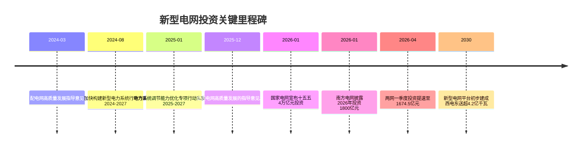
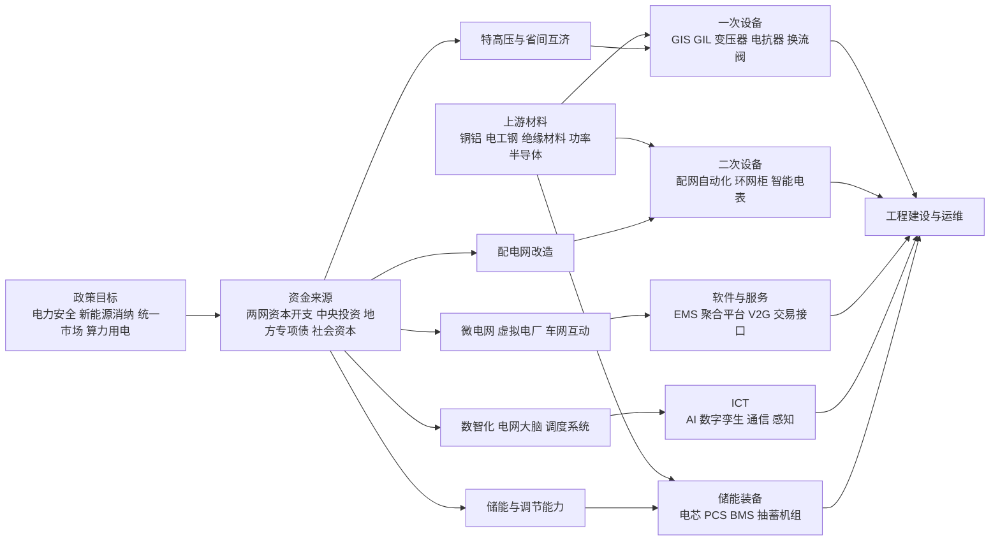

# 解读央视财经新型电网报道背后的投资机会

## 执行摘要

央视财经相关报道所引发市场关注的核心，不是单一年度的“稳增长”脉冲，而是中国电网体系从“十四五”收官向“十五五”开局切换后，围绕新能源消纳、电力安全、统一电力市场、充电设施接入和算力用电协同的一轮结构性资本开支上行。官方已明确国家电网“十五五”固定资产投资预计达 **4 万亿元**，较“十四五”增长 **40%**；南方电网则披露 **2026 年固定资产投资安排 1800 亿元**，连续五年创新高。媒体所说“**5 万亿元**”更接近“国家电网 4 万亿元 + 南方电网未来五年约 0.9 万亿至 1.0 万亿元 + 其他配套资本”的行业总量级推演，而不是某一部门已经公布的统一财政预算口径。换句话说，**“5 万亿元”是高可信的产业总量推算，但并非官方统一拆分口径**。citeturn10view0turn11search0turn9search4

从投资映射看，未来五年最值得重视的不是“电网行业整体平均受益”，而是**受益顺序和兑现节奏存在明显差异**。短期更偏特高压、高压开关、变压器、配网自动化等“可见招标—可见收入”的主设备环节；中期更偏配电网改造、源网荷储协同、储能与柔性直流等“建设密集—业绩弹性高”的方向；长期则会向数字化调度、电网大脑、虚拟电厂、微电网运营、运维服务与项目化资产回报迁移。官方政策已经把“主配微协同”“智慧化调度”“共享储能”“智能微电网”“车网互动”和“虚拟电厂”写入行动方案或指导意见，意味着投资机会将从传统一次设备逐步外扩至二次设备、软件平台和运营服务。citeturn13view4turn14view0turn38search0turn39view0

就资产选择而言，若以 1 年、3 年、5 年三个维度观察，**1 年看招标与开工，3 年看交付与利润兑现，5 年看市场机制和运营现金流**。这决定了配置层面不宜仅追逐高弹性小票，而应把组合分成四层：一是国电南瑞、平高电气、许继电气、中国西电等主网/配网核心设备龙头；二是思源电气一类兼具海外与储能弹性的成长型标的；三是国网信通等数字化/软件服务后周期标的；四是以电力设备或储能主题 ETF、高等级电力央企债券和符合准入要求的项目类私募作为波动缓冲和收益平滑工具。citeturn24search0turn27search4turn17search13turn34search3turn22search10turn31search1

## 政策背景与资金机制

“十五五”的明确年份范围是 **2026—2030 年**。从政策节奏看，2024 年开始，监管层先后推出《**关于新形势下配电网高质量发展的指导意见**》和《**加快构建新型电力系统行动方案（2024—2027 年）**》，把配电网承载能力、分布式新能源接入、主配微网协同、智慧调度、智能微电网、共享储能、虚拟电厂和车网互动纳入重点任务；2025 年又出台《**电力系统调节能力优化专项行动实施方案（2025—2027 年）**》；到 2025 年底，《**关于促进电网高质量发展的指导意见**》进一步把 2030 年新型电网平台目标定量化，标志着“十五五”电网投资从方向确认进入目标约束和项目执行阶段

上图之所以重要，在于它揭示了一个清晰逻辑：**先有政策框架，再有年度投资安排，随后才是招标、开工、交付和盈利兑现**。尤其值得注意的是，国家电网 2026 年一季度已完成固定资产投资 **近 1300 亿元**、同比增长 **约 37%**，南方电网一季度完成 **384.5 亿元**、同比增长 **49.5%**，两网合计达到 **1674.5 亿元**。这说明“十五五”并非停留在规划纸面，而是已经表现为实物工作量的前置释放。citeturn10view0turn11search0turn32search0turn32search1turn32search4

从资金来源看，**主体是两大电网企业资本开支，而不是中央财政直接全额拨付**。其中，国家电网 4 万亿元是已正式披露的固定资产投资口径；南方电网“十五五”总额官方**未明确**，但 2024 年投资约 **1730 亿元**、2025 年约 **1750 亿元**、2026 年 **1800 亿元** 的连续抬升，足以支持其五年总投资接近 **0.9 万亿至 1.0 万亿元** 的合理区间推算。除此之外，配电网政策还明确提出可使用既有资金渠道、中央投资引导、地方政府专项债券支持符合条件项目，并鼓励多元主体和民间资本参与；对直接接入配电网的新能源场站、储能电站接网工程，原则上由电网企业承担，若建设时序不匹配，相关主体可先行投资并在适当时机由电网企业依法依规回购。citeturn10view0turn11search0turn12search2turn13view1turn14view0

更关键的是，电网投资并非只有“投出去”，还要有“回得来”的机制。2025 年底的高质量发展指导意见提出，要完善输配电价监管规则，对以输送清洁能源电量或联网功能为主的工程，探索实行**两部制**或**单一容量制**电价；对新能源就近消纳等新业态实行单一容量制电价；同时研究建立电网企业准许收入清算制度。对于抽水蓄能和新型储能，近年的容量电价与市场收益分享机制也在逐步完善，这意味着未来五年投资收益会越来越依赖“**价格机制 + 调用小时 + 市场化收益**”的组合，而不是单独依赖行政投资。citeturn13view0turn16view1turn37search2

### 资金来源与分配机制概览

| 资金来源/机制 | 当前披露情况 | 是否官方明确 | 主要投向 | 回收与收益逻辑 |
|---|---:|---|---|---|
| 国家电网固定资产投资 | “十五五”预计 **4 万亿元** | 明确 | 特高压、跨区互济、配网、微电网、抽蓄与储能接入、充电设施接入 | 资产折旧 + 输配电价 + 允许收入监管 |
| 南方电网固定资产投资 | 2026 年 **1800 亿元**；五年总额 **未明确**，本文估 **0.9—1.0 万亿元** | 年度明确，五年总额未明确 | 新型电力系统、战略性新兴产业、优质供电服务、设备更新数智化 | 监管回报 + 区域项目收益 + 市场化机制 |
| 中央投资与既有资金渠道 | 农网、边远地区、设备更新技改等支持 | 明确 | 农村配电网、设备更新、薄弱区域保障 | 政策性资金/引导资金 |
| 地方政府专项债 | 配电网符合条件项目可支持 | 明确 | 配网改造、充电接入、市政协同改造 | 地方专项债资金 + 项目收益 |
| 民间资本/社会资本 | 鼓励符合条件资本参与电网投资建设 | 明确 | 增量配电网、智能微电网、储能、综合能源服务 | 项目收益权、容量收益、市场交易收益 |
| 新能源/储能开发商先投后回购 | 接网工程时序不匹配时可先行投资 | 明确 | 新能源、储能接网工程 | 后续依法依规回购 |

表中“南方电网五年总额”为本文根据 2024—2026 连续抬升的年度投资安排作出的研究性区间估算，不是公司已经正式公告的总额。相关政策与投资披露依据见国家发改委、国家能源局、新华社、人民日报等来源。citeturn10view0turn11search0turn12search2turn13view1turn13view0turn14view0turn32search7

## 市场规模与增长假设

从需求底层变量看，新型电网不是“供给侧自说自话”，而是被电力需求和新能源渗透率共同推着走。国家能源局数据显示，**2025 年全社会用电量达到 103682 亿千瓦时，同比增长 5.0%**；同年全国可再生能源装机达到 **23.4 亿千瓦**，约占全国电力总装机 **60%**，其中风电 **6.4 亿千瓦**、太阳能发电 **12 亿千瓦**，风光合计装机已接近总装机的一半。与此同时，国家电网在“十五五”投资说明中提出，其经营区风光新能源年均新增装机将达 **2 亿千瓦左右**；南方电网则明确 **2026 年** 支撑新能源新增装机 **4000 万千瓦**。这意味着无论从电量需求、装机结构还是新能源接入强度看，未来五年电网投资都具有很强的刚性。citeturn7search0turn7search11turn10view0turn11search0

更重要的是，2030 年的约束性目标已经把增量投资方向“锁死”了。《关于促进电网高质量发展的指导意见》明确，到 **2030 年**，“西电东送”规模要超过 **4.2 亿千瓦**，新增省间电力互济能力 **4000 万千瓦左右**，支撑新能源发电量占比达到 **30% 左右**，接纳分布式新能源能力达到 **9 亿千瓦**，支撑充电基础设施超过 **4000 万台**。由于这些目标同时覆盖主网、配网、分布式、新能源、储能和充电网络，未来五年电网投资绝不可能只体现为特高压单线条行情，**最大确定性反而在配电网和调节能力建设**。citeturn13view3turn13view4

### 五万亿元构成的研究性拆分

下表为本文对“5 万亿元”行业总量的**研究性拆分**。需要强调：**央视财经相关报道原文并未披露五大方向的精确比例，以下全部为“未明确”基础上的区间估算**，依据是官方政策优先级、2030 目标、两网已披露投资重点、储能与配网的政策密度，以及 2026 年初以来工程推进节奏。citeturn9search4turn10view0turn13view4turn38search0turn37search0

| 投资方向 | 原文是否明确 | 基准估算 | 合理区间 | 主要依据与逻辑 |
|---|---|---:|---:|---|
| 特高压与跨区互济 | 未明确 | **1.00 万亿元** | **0.90—1.10 万亿元** | 2030 年“西电东送”与省间互济能力继续抬升；国家电网重点抓输电通道、特高压和配套工程 |
| 配电网改造 | 未明确 | **2.05 万亿元** | **1.90—2.20 万亿元** | 2030 年接纳分布式新能源 **9 亿千瓦**、支撑 **4000 万台**充电设施；配网是最大承载层 |
| 分布式/微电网/虚拟电厂 | 未明确 | **0.45 万亿元** | **0.35—0.55 万亿元** | 智能微电网、VPP、车网互动、离网型和保供型微网被持续纳入行动方案 |
| 数智化/电网大脑/通信 | 未明确 | **0.45 万亿元** | **0.35—0.55 万亿元** | 智慧化调度、AI+电网、数字孪生、通信感知、云边协同是政策明确方向 |
| 储能与调节配套输电 | 未明确 | **1.05 万亿元** | **0.95—1.25 万亿元** | 共享储能、抽水蓄能、新型储能、柔性直流与调节能力提升是“十五五”刚需 |
| **合计** | **未明确** | **5.00 万亿元** | **4.45—5.65 万亿元** | 为研究性区间，不代表官方预算 |

上述拆分里，本文把**配电网改造**放在最大权重，不是因为它最“性感”，而是因为它最符合 2030 目标的约束结构：分布式新能源接纳、县乡充电设施接入、城中村/老旧小区改造、农村电网补短板、新增大功率充电桩和主配微网协同，都必须落在中低压网络和二次系统升级上。特高压仍然是高弹性赛道，但从总量占比看，**它不是唯一主线，而是高景气主线之一**。citeturn13view4turn13view0turn39view0turn40view0

### 敏感性分析

若未来两年出现三类变化，上述拆分会明显偏移。第一，若新能源装机继续维持 **2025—2027 年年均新增 2 亿千瓦以上** 的高位，则储能和配网两项占比有上行压力；第二，若车网互动和充电基础设施落地速度快于预期，配网和数字化两项可能再上修；第三，若特高压核准、廊道落地或受端消纳节奏超预期，则特高压与跨区互济项的实际金额可能向区间上沿靠拢。反过来，如果原材料价格上行、项目审批偏慢或“适度超前、不过度超前”的监管要求更严格，则部分投资会后移而不是消失。citeturn37search6turn13view4turn14view0turn32search0

## 关键技术与产业链重估

新型电网的本质不是“传统电网多花钱”，而是从“无源、单向、低波动”的电力网络，升级为“高比例新能源、高比例电力电子、高比例数字化控制”的复杂系统。因此，投资机会会从传统一次设备扩散到二次设备、功率电子、软件平台、储能系统和运维服务。2024—2025 年的多份官方文件已经把**新型交直流输电、构网型技术、主配微网协同、有源配电网调度、共享储能、智能微电网、虚拟电厂、AI+电网**明确为重点。citeturn39view0turn40view0turn40view1turn14view0

从成本驱动看，五个方向的盈利弹性并不一致。特高压和主网升级更依赖高端变压器、GIS/GIL、换流阀、断路器、控制保护和工程安装，成本端对**铜、铝、电工钢、绝缘材料及功率器件**较敏感；配网改造虽然单项目价值量较低，但项目数量大、标准化和模块化程度提升后，收入确认更平滑、抗单项目波动能力更强；微电网和虚拟电厂对软件、通信、计量和交易规则依赖更高，早期收入体量未必大，但一旦市场规则明确，毛利结构通常优于单纯设备销售。citeturn13view1turn39view0turn40view1

### 技术路径与成本驱动

| 方向 | 关键技术 | 成本/瓶颈 | 受益环节 |
|---|---|---|---|
| 特高压与跨区外送 | 柔性直流、GIL/GIS、1000kV 变压器、换流阀、构网型控制 | 廊道审批、送受端配套工程、铜铝与电工钢、功率器件供应 | 平高电气、中国西电、许继电气、思源电气等 |
| 配电网改造 | 有源配网、自愈控制、配网自动化、环网柜、配变扩容、智能电表 | 点多面广、交付管理、地方协同、标准化程度 | 国电南瑞、许继电气、国网信通等 |
| 分布式/微电网/VPP | EMS、聚合控制、V2G、市场接口、源网荷储协同 | 电力市场规则、计量结算、商业模式成熟度 | 国网信通、南网科技类软件服务商，及综合能源运营方 |
| 数智化/电网大脑 | 智慧调度、数字孪生、AI 辅助决策、量子通信/物联感知、云边协同 | IT 预算节奏、数据治理与安全、跨系统兼容 | 国电南瑞、国网信通、通信感知与工业软件提供商 |
| 储能与调节 | 锂电储能、液流/压缩空气/飞轮/钠电、抽水蓄能、PCS/BMS、容量补偿 | 安全性、利用小时、容量电价、市场化调用机制 | 电池/PCS/BMS/EMS、抽蓄设备与工程、运维服务 |

对应成本风险方面，2026 年铜价和部分有色金属仍处在高波动区间。路透评论指出，LME 三个月铜价在 2026 年一季度收于 **12335.5 美元/吨**，而分析师对 2026 年铜价的一致预期已上调到 **1.1 万美元/吨以上**；中国 2026 年前两个月铜进口同比下降 **25%**，显示高价已开始影响现货流向和下游采购节奏。铝价亦因供给扰动而波动加大。对设备企业而言，这意味着**强议价龙头更能把原材料波动转嫁给业主，弱议价企业毛利率更容易受压**。citeturn33search5turn33search7turn33search0turn33news40

储能方向则呈现“技术主导权已定、商业模式仍在演进”的特征。国家能源局披露，截至 **2025 年底**，全国新型储能装机达到 **1.36 亿千瓦 / 3.51 亿千瓦时**，同比较 2024 年底增长 **84%**，其中**锂离子电池占比 96.1%**；同时，全国新型储能等效利用小时达到 **1195 小时**，比上年提升近 **300 小时**。这意味着短中期最现实的受益仍是锂电储能链、PCS/BMS 和系统集成，而更长周期的超额收益则取决于长时储能商业化、容量价格机制和市场调用规则是否持续优化。citeturn16view0

抽水蓄能则更像“长期低波动 Beta”。官方信息显示，到 **2030 年** 我国抽水蓄能投产总规模目标约 **1.2 亿千瓦**，“十五五”规划纲要还提出新增投产装机 **1 亿千瓦左右**。与新型储能相比，抽蓄技术成熟、经济性更稳定、项目周期更长，适合工程建设、设备制造、国资平台和项目资金类投资者，但对二级市场而言，其利润兑现往往慢于设备订单兑现。citeturn16view1

## 代表性上市公司与盈利估值影响

若把“新型电网”拆成可投的 A 股映射，最核心的六家公司分别覆盖了主网设备、配网设备、储能与海外成长、以及数字化服务。它们共同特点是：主营业务与电网资本开支高度相关，但**业绩弹性和估值风险并不相同**。主网设备的确定性较高，成长股的想象空间更大，软件服务的兑现节奏更滞后。citeturn24search0turn17search13turn27search4turn34search3turn22search10turn31search1

### 代表性公司比较

| 公司 | 细分主线 | 营收占比或业务纯度 | 2023 营收/净利 | 2024 营收/净利 | 2025 营收/净利 | 当前估值快照 | 估值/盈利影响判断 |
|---|---|---|---:|---:|---:|---|---|
| 国电南瑞 | 电网自动化、调度、二次设备、柔性输电、数字化 | 2025 年电网智能 **50.46%**，能源低碳 **25.26%**，合计 **75.72%** | 515.73 / 71.84 | 574.17 / 76.10 | 662.29 / 82.79 | PE(TTM) 约 **26x** | 典型“核心资产”逻辑。盈利稳健、股息能力较强，最适合做新型电网核心仓。 |
| 许继电气 | 特高压、配网、智能电表、充换电 | 2025 年智能变配电 **27.39%**、智能电表 **26.32%**、智能中压供用电 **21.01%** | 170.61 / 10.05 | 170.89 / 11.17 | 149.92 / 11.67 | PE(TTM) 约 **28x** | 收入阶段性波动，但利润韧性较强，估值更依赖订单质量与产品结构改善。 |
| 平高电气 | 高压/超高压/特高压开关设备 | 2025 年高压板块 **61.89%**；配网板块按收入推算约 **26%** | 110.77 / 8.16 | 124.02 / 10.23 | 125.17 / 11.20 | PE(TTM) 约 **25x** | 受益特高压节奏最直接之一，业绩弹性强，估值仍在行业可接受区间。 |
| 中国西电 | 变压器、开关、电力电子、一次设备成套 | 2025 年细分占比**未明确**；参考 2024 年开关+变压器合计约 **79.5%** | 208.48 / 8.85 | 222.81 / 10.54 | 237.56 / 12.70 | PE(TTM) 约 **66x** | 业绩高增但市场预期也高，属于“高弹性、高估值、低容错”品种。 |
| 思源电气 | 高压设备、储能、超级电容、海外电网/AIDC 配套 | 2025 年海外收入占比 **26.94%**；2025H1 输配电设备收入占比 **99.47%** | 124.60 / 15.59 | 154.58 / 20.49 | 215.39 / 31.50 | PE(TTM) 约 **47x** | 海外+储能+AIDC 溢价显著，高成长属性最强，但对订单兑现和估值消化要求最高。 |
| 国网信通 | 电力数字化、云网基础设施、AI+能源 | 2025 年数字化基础设施收入 **53.78 亿元**，约为总营收 **50.6%** | 76.73 / 8.28 | 73.15 / 6.82 | 106.28 / 6.57 | PE(TTM) 约 **33x** | 软件服务后周期受益，营收扩张快于利润，后续看产品化和毛利率修复。 |

表中 2023—2025 财务数据主要来自公司年报、年报摘要和权威财经转载；当前 PE(TTM) 为 2026 年 5 月附近行情快照，不同终端口径可能存在轻微差异。思源电气、中国西电部分业务占比按公司公开披露口径或可计算收入数据推算；未公布的明细已明确标注“未明确”。citeturn25search0turn26search6turn26search10turn20search10turn25search5turn26search2turn26search8turn20search4turn25search10turn27search10turn27search9turn28search14turn34search3turn34search7turn35search7turn29search7turn41search7turn22search10turn41search2turn41search9turn22search1turn31search1turn30search1turn30search10turn30search3turn31search2

如果只讨论“谁最受益”，答案并不是单一公司。**主网强催化**阶段，平高电气、中国西电、许继电气的订单弹性更直接；**主配网均衡建设**阶段，国电南瑞的确定性与综合能力更强；**海外与新兴增长**阶段，思源电气弹性最大但估值要求也最高；**软件和平台**阶段，则国网信通此类公司更容易在 3—5 年维度体现收益。对于多数投资者而言，真正重要的不是“押中最牛股”，而是**让组合同时覆盖“高确定性龙头 + 高成长弹性 + 数字化后周期”三层收益**。citeturn24search0turn27search4turn34search3turn22search10turn31search1

## 投资时点 风险与情景回报

从时点判断看，2026 年已经进入“**项目启动明显快于收入确认**”的阶段。国家电网一季度完成固定资产投资近 1300 亿元，同比增长约 37%；其 110（66）千伏及以上项目开工 **393 项**、投产 **579 项**，开工增速明显快于投产。南方电网一季度投资同比增长 **49.5%**。这意味着**二级市场最常见的节奏是：先招标预期，再开工验证，再交付兑现，再业绩确认**。因此，现在到未来 12 个月，更偏“招标链与高压设备链”；12—36 个月，更偏“配网、储能、工程交付和数字化”；36—60 个月，更偏“市场化运营和软件服务”。citeturn32search0turn32search1turn32search5turn32search11

### 阶段性投资时钟

| 阶段 | 核心观察指标 | 优先受益方向 | 典型风险 |
|---|---|---|---|
| 现在至 1 年 | 两网季度投资同比、特高压核准/开工、国网/南网集招节奏 | 高压开关、变压器、换流阀、配网一次二次设备 | 估值先涨后业绩滞后，原材料上行挤压毛利 |
| 1 至 3 年 | 工程交付、配网改造铺开、共享储能和充电接入放量 | 配网自动化、智能电表、储能 PCS/BMS、工程/EPC | 地方协调、项目验收与回款周期、需求波动 |
| 3 至 5 年 | 电力市场规则、容量电价、VPP/微网运营成熟度 | 数字化平台、运维服务、虚拟电厂、项目运营资产 | 市场机制推进不及预期、商业模式不闭环 |

真正需要警惕的风险有五类。其一，**政策风险**：虽然方向明确，但监管也强调“适度超前、不过度超前”，意味着投资节奏可能后移。其二，**技术风险**：构网型技术、长时储能、VPP 和 AI 调度都处在“从示范到规模化”阶段，商业化速度未必线性。其三，**需求风险**：如果工业用电或新能源装机节奏阶段性放缓，电网投资也会做时序优化。其四，**原材料风险**：铜、铝高位波动会挤压中游制造利润。其五，**项目落地风险**：廊道审批、地方配套、征地和回款都可能使订单兑现后移。citeturn14view0turn39view0turn40view1turn33search5turn33search0

### 短中长期回报与风险情景

以下区间为**研究性估算**，不是对任何单一证券的收益承诺。估算基础是：一，国家电网 4 万亿元与两网投资提速构成的中长期订单背景；二，代表性公司当前约 **25x—66x** 的估值分布；三，近三年盈利增速与行业结构变化。区间的意义在于帮助识别**什么资产更适合哪个期限**，而不是做精确点位预测。citeturn10view0turn32search0turn32search1turn20search10turn20search4turn28search14turn29search7turn22search1turn30search3

| 资产篮子 | 1 年基准回报区间 | 3 年年化基准区间 | 5 年年化基准区间 | 更适合的情景 |
|---|---:|---:|---:|---|
| 电力设备/储能主题 ETF | **0%—15%** | **8%—12%** | **8%—10%** | 适合不愿意承担个股波动的投资者 |
| 主网/配网龙头组合 | **5%—20%** | **10%—16%** | **9%—14%** | 最适合“十五五”主线的核心仓位 |
| 中小成长与海外弹性股 | **-10%—25%** | **12%—20%** | **10%—18%** | 适合能承受估值波动、追求弹性者 |
| 高等级债券/可转债 | **2%—6%** | **3%—5%** | **3%—6%** | 适合回撤控制和流动性管理 |
| 项目类私募/产业基金 | **4%—8%** | **6%—9%** | **6%—8%** | 适合高净值/机构做现金流配置 |

若进入**乐观情景**，即两网资本开支高增延续、铜铝价格回落、特高压核准稳步推进、储能容量补偿机制持续完善，则主设备龙头和高成长股的收益区间都可能上修；若进入**谨慎情景**，即原材料继续高位、项目审批偏慢、VPP 和储能商业模式推进低于预期，则 1 年维度的股价回报可能大幅低于 3—5 年维度的盈利兑现速度。换言之，**短期看波动，中期看利润，长期看制度和现金流**。citeturn13view0turn16view0turn16view1turn33search5turn32search0

## 结论与可操作投资建议

结论很明确：**“十五五”新型电网不是单纯的宏观刺激题材，而是中国能源安全、双碳转型、统一电力市场和数字经济用电需求共同驱动的长期资本开支周期。** 从胜率角度看，真正值得重仓的不是“最会讲故事的公司”，而是那些在主网、配网、二次设备、调度控制和储能接入中拥有真实份额、真实盈利能力、真实现金流的龙头；从赔率角度看，才轮到海外成长、AI 配套和储能新技术。citeturn13view4turn10view0turn16view0turn32search0

### 可操作配置框架

| 风险偏好 | 建议配置框架 | 适用逻辑 |
|---|---|---|
| 稳健型 | **35%** 主配网核心龙头；**25%** 电力设备/储能 ETF；**20%** 高等级电力央企债/可转债；**10%** 红利型公用事业；**10%** 现金 | 追求跟住“十五五”主线，同时控制回撤 |
| 均衡型 | **30%** 主网设备龙头；**20%** 配网自动化/二次设备；**15%** 储能与 PCS/BMS；**15%** 数智化与软件服务；**10%** ETF；**10%** 债券/现金 | 兼顾确定性与成长性，是本文最推荐的组合 |
| 进取型 | **25%** 特高压高弹性设备；**20%** 配网和充电接入链；**20%** 海外+储能成长股；**15%** 数字化/AI 电网；**10%** ETF；**10%** 现金 | 适合高波动承受能力，重点做“开工—订单—业绩”弹性 |

如果需要把建议压缩成三句话：第一，**先配龙头，再配弹性，不要反过来**；第二，**把配网和数字化的仓位提高到至少与特高压同等重要的级别**，因为它们更符合 2030 目标约束；第三，**用债券、ETF 或现金管理工具覆盖回撤**，不要把全部赌注压在高估值成长股上。对大多数普通投资者，最优解并不是“梭哈单一电网设备股”，而是构建“**龙头 + ETF + 成长 + 防守**”四层结构。citeturn13view3turn14view0turn24search0turn27search4turn31search1

对机构和高净值投资者，如果具备准入条件，可以关注与抽水蓄能、新型储能、配网改造、综合能源服务相关的**项目类私募、产业基金、ABS/类 REITs** 模式，但应优先核查三类条款：一是并网与消纳约束，二是容量电价或市场化收益机制，三是回款与分配顺序。因为在新型电网时代，**项目收益率不只取决于建设成本，更取决于市场规则是否能把“调节价值”变成现金流**。citeturn13view0turn16view1turn37search2

仅供研究交流，不构成个性化投资建议。citeturn10view0turn13view4

## 主要信息来源

- 国家发展改革委、国家能源局：《关于促进电网高质量发展的指导意见》及国家能源局答记者问。citeturn13view4turn13view3  
- 国家发展改革委、国家能源局：《关于新形势下配电网高质量发展的指导意见》及政策解读。citeturn13view1turn13view2  
- 国家发展改革委、国家能源局、国家数据局：《加快构建新型电力系统行动方案（2024—2027 年）》。citeturn38search0turn39view0turn40view0turn40view1  
- 国家发展改革委、国家能源局：《电力系统调节能力优化专项行动实施方案（2025—2027 年）》。citeturn37search0turn37search6  
- 新华社/新华网：《4 万亿元投资发力！国家电网“十五五”锚定新型电力系统建设》《国家电网一季度固定资产投资近 1300 亿元》。citeturn10view0turn32search0  
- 人民日报/国资委/新华网等关于南方电网 2026 年投资安排及一季度投资信息。citeturn11search0turn32search1turn32search7  
- 国家能源局：2025 年全社会用电量、2025 年可再生能源并网运行情况、2025 年新型储能发展情况。citeturn7search0turn7search11turn16view0  
- 代表性上市公司近三年年报、年报摘要与权威转载：国电南瑞、许继电气、平高电气、中国西电、思源电气、国网信通。citeturn24search0turn26search6turn26search10turn17search13turn26search2turn26search8turn27search4turn27search10turn27search9turn34search3turn34search7turn35search7turn41search7turn22search10turn31search1turn30search1turn30search10

## 原文结构速览

### 第一部分

- 原文要点：本部分主要围绕风险、投资、交易、资产展开，核心线索是：从资金来源看，**主体是两大电网企业资本开支，而不是中央财政直接全额拨付**。其中，…。
- 关键段落：第 8 段集中承载风险、投资、交易、资产这组信息，是理解该部分原文结构的关键段落。

### 第二部分

- 原文要点：本部分主要围绕流动性、风险、仓位、投资展开，核心线索是：真正需要警惕的风险有五类。其一，**政策风险**：虽然方向明确，但监管也强调“适度超…。
- 关键段落：第 20 段集中承载流动性、风险、仓位、投资这组信息，是理解该部分原文结构的关键段落。

