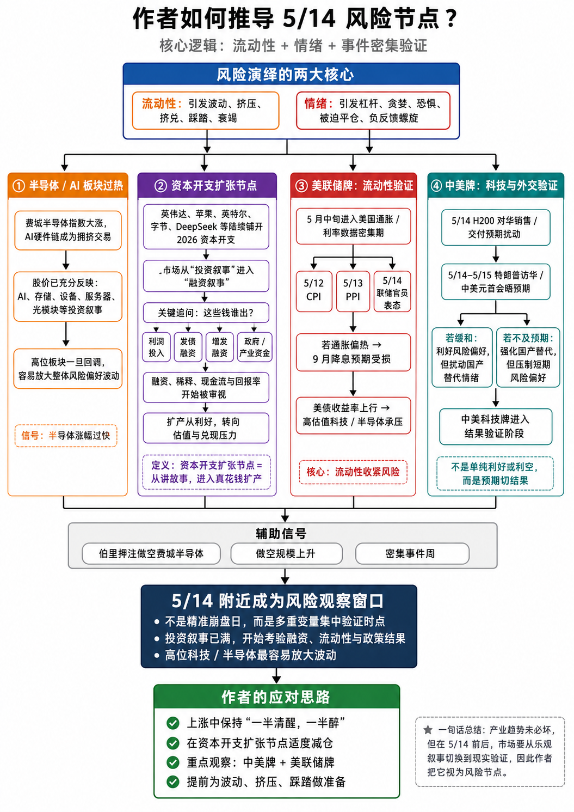

# 冰冰小美推导 5/14 风险节点流程图

## 来源信息

- 来源：用户提供截图
- 作者：冰冰小美观点体系整理，原始发言待验证
- 发布时间：待验证
- 抓取时间：2026-05-20
- 原始链接：待验证
- 资料类型：截图 / 流程图
- 原图路径：`sources/screenshots/2026-05-20-冰冰小美-5-14-风险节点推导.png`

## 图片



## 可见文字转写

标题：

```text
作者如何推导 5/14 风险节点？
核心逻辑：流动性 + 情绪 + 事件密集验证
```

风险演绎的两大核心：

```text
流动性：引发波动、挤压、挤兑、踩踏、衰竭
情绪：引发杠杆、贪婪、恐惧、被迫平仓、负反馈螺旋
```

半导体 / AI 板块过热：

```text
费城半导体指数大涨，AI硬件链成为拥挤交易
股价已充分反映：AI、存储、设备、服务器、光模块等投资叙事
高位板块一旦回调，容易放大整体风险偏好波动
信号：半导体涨幅过快
```

资本开支扩张节点：

```text
英伟达、苹果、英特尔、字节、DeepSeek 等陆续铺开 2026 资本开支
市场从“投资叙事”进入“融资叙事”
关键追问：这些钱谁出？
利润投入
发债融资
增发融资
政府 / 产业资金
融资、稀释、现金流与回报率开始被审视
扩产从利好，转向估值与兑现压力
定义：资本开支张节点 = 从讲故事，进入真花钱扩产
```

注：图中文字为“资本开支张节点”，结合上下文疑似“资本开支扩张节点”，需以原始发言核对。

美联储牌：流动性验证：

```text
5 月中旬进入美国通胀 / 利率数据密集期
5/12 CPI
5/13 PPI
5/14 联储官员表态
若通胀偏热 -> 9 月降息预期受损
美债收益率上行 -> 高估值科技 / 半导体承压
核心：流动性收紧风险
```

中美牌：科技与外交验证：

```text
5/14 H200 对华销售 / 交付预期扰动
5/14-5/15 特朗普访华 / 中美元首会晤预期
若缓和：利好风险偏好，但扰动国产替代情绪
若不及预期：强化国产替代，但压制短期风险偏好
中美科技牌进入结果验证阶段
不是单纯利好或利空，而是预期切结果
```

辅助信号：

```text
伯里押注做空费城半导体
做空规模上升
密集事件周
```

结论：

```text
5/14 附近成为风险观察窗口
不是精准崩盘日，而是多重变量集中验证时点
投资叙事已满，开始考验融资、流动性与政策结果
高位科技 / 半导体最容易放大波动
```

作者的应对思路：

```text
上涨中保持“一半清醒，一半醉”
在资本开支扩张节点适度减仓
重点观察：中美牌 + 美联储牌
提前为波动、挤压、踩踏做准备
```

一句话总结：

```text
产业趋势未必坏，但在 5/14 前后，市场要从乐观叙事切换到现实验证，因此作者把它视为风险节点。
```

## 图中节点与箭头结构

```text
风险演绎核心
  -> 流动性
  -> 情绪

风险演绎核心
  -> 半导体 / AI 板块过热
  -> 资本开支扩张节点
  -> 美联储牌：流动性验证
  -> 中美牌：科技与外交验证
  -> 辅助信号
  -> 5/14 附近成为风险观察窗口
  -> 作者的应对思路
```

## 原文结构速览

### 第一部分

- 原文要点：本部分主要围绕风险、AI、半导体、资本开支扩张节点展开，核心线索是：![冰冰小美推导5/14风险节点流程图](2026-05-20-冰冰小美-5-14-…。
- 关键段落：第 2 段集中承载风险、AI、半导体、资本开支扩张节点这组信息，是理解该部分原文结构的关键段落。

### 第二部分

- 原文要点：本部分主要围绕流动性、科技、不确定性、中美展开，核心线索是：图中涉及、、、、等金融与政治事件判断，均属于高变动信息，需在正式分析页中标注不确定性…。
- 关键段落：第 7 段集中承载流动性、科技、不确定性、中美这组信息，是理解该部分原文结构的关键段落。

## 备注
- 本页仅保存用户提供流程图的可见信息与必要来源说明，不展开深度分析。
- 图片未提供原始发言链接，具体出处、发布日期、人物原话和事件细节均待验证。
- 图中涉及 `5/12 CPI`、`5/13 PPI`、`5/14 联储官员表态`、`H200 对华销售 / 交付预期`、`特朗普访华 / 中美元首会晤预期` 等金融与政治事件判断，均属于高变动信息，需在正式分析页中标注不确定性。
