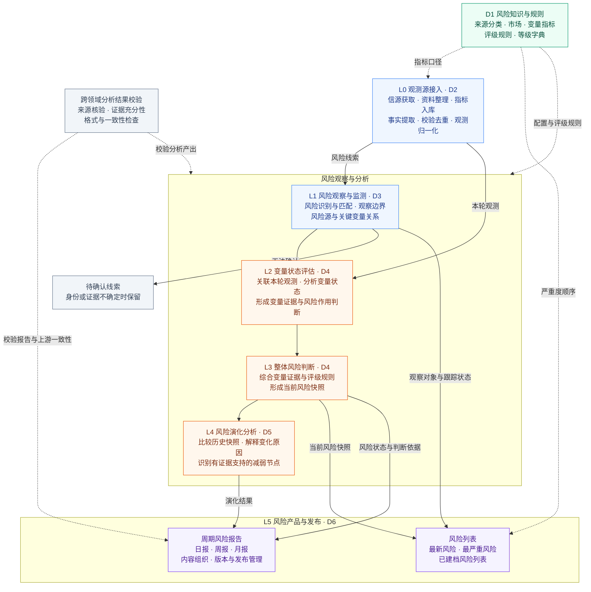
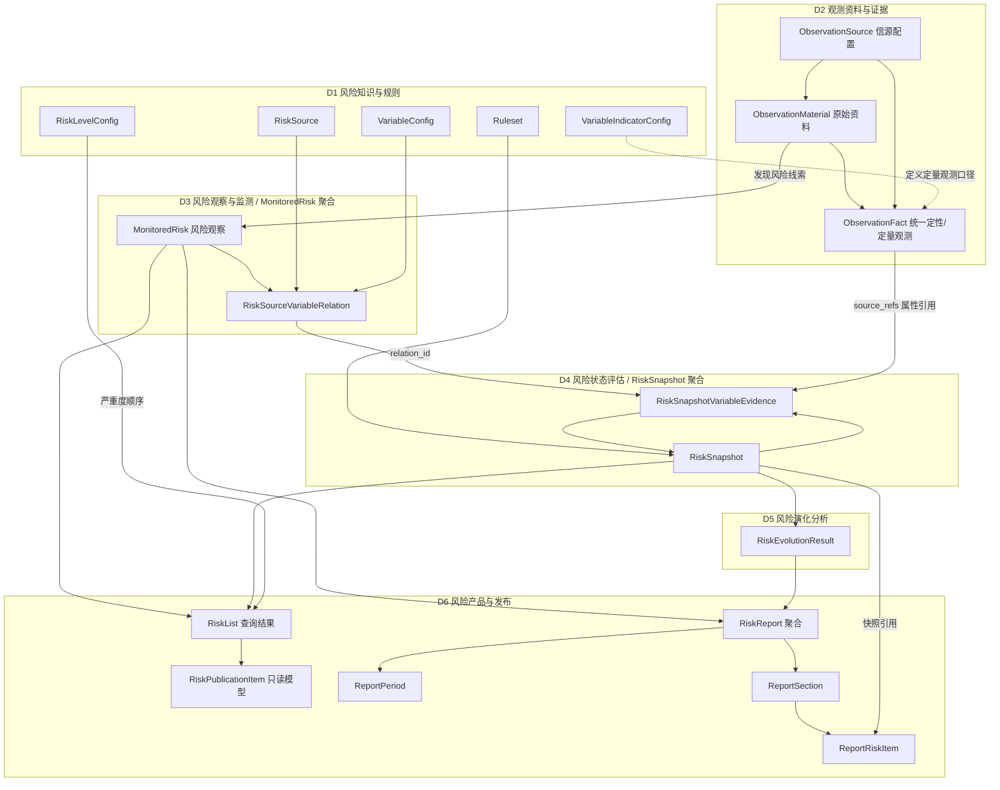
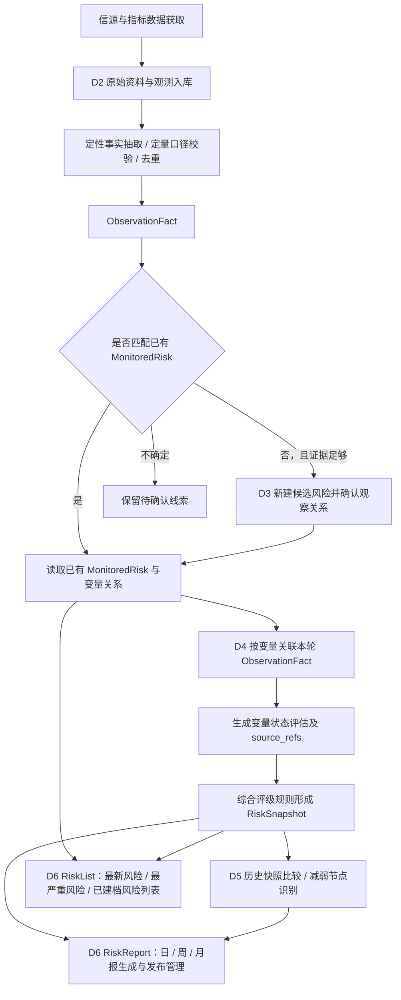

# RiskHot 业务领域设计总览

> **版本**：v3.0（总览与六领域分册）  
> **日期**：2026-10-08  
> **文档性质**：业务领域架构总览，用于导航、跨领域协作和全局约束。  
> **范围**：第一版宏观风险持续观察；模块化单体可先行，物理表、字段类型、索引及存储拆分留待详细设计。

本文件保留系统级设计，各领域细节以对应分册为准。分册统一采用“领域架构总览 → 领域能力 → 业务领域架构 → 核心领域模型”；D1～D6 是领域标识，分册正文只使用 1～3 章编号。未确认的事件、聚合细节和状态机保留待细化。

**设计依据：** [[tools/RiskHot/冰冰小美-RiskHot架构设计|原始架构设计]]、[[sources/manual/RiskHot/2026-10-08-业务领域设计拆分前v2.2|拆分前业务领域设计 v2.2]]及后续用户确认；D6 同时依据 [[sources/manual/RiskHot/2026-10-08-D6业务领域设计V1.0.txt|D6 设计原稿]]。

## 1. 业务定位与边界

### 1.1 业务目标〔已确认〕

RiskHot 是宏观风险观察与演化监测系统，核心工作链为：

**信息识别 → 确定观察对象和传导机制 → 选择关键变量 → 收集观测证据 → 形成阶段性快照 → 对比演化与识别风险减弱节点。**

### 1.2 第一版观察对象〔已确认〕

第一版仅建立以下四类宏观风险观察对象：

- 经济体
- 宏观主体（例如中央政府、中央银行）
- 市场
- 金融系统

行业、企业及单项资产可以成为宏观风险的证据或传导环节，第一版暂不独立建立为观察对象。

**需要区分的概念：**

- **风险观察对象**：风险判断针对哪个经济体、主体、市场或系统。
- **风险源**：风险来自哪些一级来源类别。
- **关键变量**：依靠哪些变量观察风险变化。
- **观测资料**：新闻、公告、研究材料等原始输入。
- **观测记录**：从原始资料提取的事实或取得的指标观测值。
- **风险快照**：针对确定风险和观察时点形成的整体判断。

### 1.3 第一版暂不覆盖〔已确认／边界归纳〕

- 对行业、个股、单一资产的独立风险实例建模。
- 将后续投资方向、仓位或交易执行判断并入风险快照。
- 在风险快照中输出未来走势预测；`next_observation` 只提出后续观察和验证重点。
- 为 RiskEvolutionResult 强制建立独立业务主表。

## 2. 领域全景与限界上下文


| 领域                                               | 名称                              | 核心职责                                      | 主要领域对象                                                                                                             |
| ------------------------------------------------ | ------------------------------- | ----------------------------------------- | ------------------------------------------------------------------------------------------------------------------ |
| [[tools/RiskHot/02-D1 风险知识与规则业务领域设计|D1 风险知识与规则]] | 风险知识与规则（Risk Knowledge）         | 风险来源分类、风险性质、风险源核心观测变量配置、风险核心变量观测指标配置和评级规则 | `RiskSource`、`RiskDimension`、`MarketConfig`、`VariableConfig`、`VariableIndicatorConfig`、`RiskLevelConfig`、`Ruleset` |
| [[tools/RiskHot/02-D2 观测资料与证据业务领域设计|D2 观测资料与证据]] | 观测资料与证据（Observation & Evidence） | 管理信源、原始资料、结构化观测事实                         | `ObservationSource`、`ObservationMaterial`、`ObservationFact`                                                        |
| [[tools/RiskHot/02-D3 风险观察与监测业务领域设计|D3 风险观察与监测]] | 风险观察与监测（Risk Monitoring）        | 建立具体风险、确定观察范围、风险源与关键变量的关联                 | `MonitoredRisk`、`RiskSourceVariableRelation`                                                                       |
| [[tools/RiskHot/02-D4 风险状态评估业务领域设计|D4 风险状态评估]]   | 风险状态评估（Risk Assessment）         | 依据观测记录评估变量，并形成当前整体风险快照                    | `RiskSnapshot`、`RiskSnapshotVariableEvidence`                                                                      |
| [[tools/RiskHot/02-D5 风险演化分析业务领域设计|D5 风险演化分析]]   | 风险演化分析（Risk Evolution）          | 比较历史快照，识别加剧、缓和、原因及减弱节点                    | `RiskEvolutionResult`（派生结果）                                                                                        |
| [[tools/RiskHot/02-D6 风险产品与发布业务领域设计|D6 风险产品与发布]] | 风险产品与发布（Risk Publication）       | 风险信息组织、风险列表排序、周期报告生成和内容发布管理               | `RiskPublicationItem`、`RiskList`、`RiskReport`、`ReportPeriod`、`ReportSection`、`ReportRiskItem`                      |


D1～D6 表示业务边界，不要求对应六个独立服务。领域名与对象名以本表和分册一致维护；领域更名不直接决定物理表或字段更名。

### 2.1 分层业务处理架构图

以 L0～L5 表示业务处理层级，D1～D6 表示各层所属领域。实线表示业务数据与产物流转，虚线表示配置、规则或校验支撑。



**处理边界：** 定量指标可以直接形成观测，不要求先生成新闻类资料；L1 先匹配已有风险，新建候选风险需证据足够并确认观察关系。后续观测可复用同一风险对象再次评估，逐步积累历史快照。

**产品边界：** 已建档风险列表允许尚无快照的对象；最新风险与最严重风险使用有效快照。D6 复用上游判断，列表采用确定性查询，周期报告独立管理内容、版本与发布状态。

## 3. 跨领域协作与业务流程

### 3.1 输入输出与职责边界

“输入”列表示该提供方传入的数据；使用方还需结合其他上游输入完成处理，多行可以共同形成同一产物。表中关系不表示调用时序或部署依赖。

**标记说明：** “AI-xx”表示 AI 介入的分析步骤，“程序处理”表示规则校验、查询、引用关联或数据管理。

| 提供方 | 使用方 | 输入 | 处理 | 主要产物 |
| --- | --- | --- | --- | --- |
| [[tools/RiskHot/02-D1 风险知识与规则业务领域设计\|D1]] | [[tools/RiskHot/02-D2 观测资料与证据业务领域设计\|D2]] | `VariableIndicatorConfig` | **程序处理**：结合已接入指标数据，按定义、统计口径、单位、频率及允许来源进行校验与标准化。 | 标准化定量观测 `ObservationFact` |
| [[tools/RiskHot/02-D1 风险知识与规则业务领域设计\|D1]] | [[tools/RiskHot/02-D3 风险观察与监测业务领域设计\|D3]] | `RiskSource`、`VariableConfig`、`MarketConfig` | **AI-01**：结合风险线索识别与匹配风险，确定观察边界，选择风险源与变量关系；程序校验配置引用。 | `MonitoredRisk`、`RiskSourceVariableRelation` |
| [[tools/RiskHot/02-D2 观测资料与证据业务领域设计\|D2]] | [[tools/RiskHot/02-D3 风险观察与监测业务领域设计\|D3]] | `ObservationMaterial`、`ObservationFact` | **AI-01**：从资料与事实识别风险，优先匹配已有观察对象；无匹配且证据足够时建立候选，不确定时保留待确认线索。 | 复用或新建的 `MonitoredRisk`、`RiskSourceVariableRelation`；待确认线索 |
| [[tools/RiskHot/02-D1 风险知识与规则业务领域设计\|D1]] | [[tools/RiskHot/02-D4 风险状态评估业务领域设计\|D4]] | `Ruleset`、`RiskLevelConfig` | **AI-03**：结合变量评估，依评级规则形成整体风险判断；**程序处理**：应用等级展示字典，字典不承担评级。 | 整体风险快照 `RiskSnapshot` |
| [[tools/RiskHot/02-D2 观测资料与证据业务领域设计\|D2]] | [[tools/RiskHot/02-D4 风险状态评估业务领域设计\|D4]] | `ObservationFact` | **AI-02**：结合已选变量关系分析观测证据、变量状态及风险作用；**程序处理**：通过 `source_refs` 保留观测及必要版本、出处引用。 | 变量评估 `RiskSnapshotVariableEvidence` |
| [[tools/RiskHot/02-D3 风险观察与监测业务领域设计\|D3]] | [[tools/RiskHot/02-D4 风险状态评估业务领域设计\|D4]] | `MonitoredRisk`、`RiskSourceVariableRelation` | **程序处理〔建议校验〕**：确认 `relation_id` 有效且与所属风险一致；**AI-02**：结合本轮观测，按有效关系完成变量证据与状态分析。 | 归属于该风险与变量关系的 `RiskSnapshotVariableEvidence` |
| [[tools/RiskHot/02-D4 风险状态评估业务领域设计\|D4]] | [[tools/RiskHot/02-D5 风险演化分析业务领域设计\|D5]] | 历史 `RiskSnapshot` 与变量评估 | **AI-04**：比较历史快照、分析变化原因和减弱节点，保留时间、证据与不确定性；可比性及缺失处理细则待明确。 | 风险演化结果 `RiskEvolutionResult` |
| [[tools/RiskHot/02-D1 风险知识与规则业务领域设计\|D1]] | [[tools/RiskHot/02-D6 风险产品与发布业务领域设计\|D6]] | 等级顺序（`RiskLevelConfig`） | **程序处理**：结合有效快照，按统一严重度顺序生成列表；D6 不重新评分。 | `RiskList`（最严重风险） |
| [[tools/RiskHot/02-D3 风险观察与监测业务领域设计\|D3]] | [[tools/RiskHot/02-D6 风险产品与发布业务领域设计\|D6]] | 风险身份（`MonitoredRisk`） | **程序处理**：读取 D3 维护的风险身份、观察对象与跟踪状态，组织展示条目及已建档目录。 | `RiskPublicationItem`、`RiskList`（已建档风险列表） |
| [[tools/RiskHot/02-D4 风险状态评估业务领域设计\|D4]] | [[tools/RiskHot/02-D6 风险产品与发布业务领域设计\|D6]] | 风险快照（`RiskSnapshot`） | **程序处理**：选择有效快照，形成最新风险、最严重风险列表；**AI-05**：结合报告周期等输入，组织周期报告内容。D6 复用上游判断，不重做评级。 | `RiskList`；周期报告 `RiskReport` |
| [[tools/RiskHot/02-D5 风险演化分析业务领域设计\|D5]] | [[tools/RiskHot/02-D6 风险产品与发布业务领域设计\|D6]] | `RiskEvolutionResult` | **AI-05**：将风险演化、变化原因及减弱节点组织为报告内容；**程序处理**：将内容纳入 `RiskReport` 管理。列表查询与报告聚合分别维护。 | 纳入演化分析的 `RiskReport`（日报／周报／月报） |

**D2 内部接入处理：** **AI-00〔新增建议〕**从原始资料提取定性事实并归一化，主要产物为 `ObservationFact`；定量校验以程序为主。此步骤发生在 D2 内部，未单列为一条跨领域输入关系。

**横向结果校验：** 各分析步骤的结果由 **AI-06** 辅助检查来源、证据充分性、格式和一致性，并结合程序规则校验。具体输入输出 Schema、校验规则及状态机制仍以领域分册的待细化设计为准。

### 3.2 核心领域关系与聚合




**聚合边界总结：**

- **已确认业务对象**：MonitoredRisk、RiskSourceVariableRelation、ObservationSource、ObservationMaterial、ObservationFact、RiskSnapshot、RiskSnapshotVariableEvidence。
- **建议聚合根**：MonitoredRisk、RiskSnapshot；D2 的 ObservationMaterial 与 ObservationFact 可独立作为聚合根。
- **不建立独立对象**：EvidenceRef；定性事实与定量指标观测在领域层由统一 ObservationFact 承担。
- **派生结果**：RiskEvolutionResult；第一版随快照比较计算。
- **D6 只读模型与查询结果**：RiskPublicationItem、RiskList；不建立独立 RiskRanking 对象。
- **D6 报告聚合**：RiskReport 为聚合根，ReportPeriod 为值对象，ReportSection、ReportRiskItem 为聚合内部实体。

### 3.3 端到端业务流程




## 4. AI 能力与分析任务


| 业务层级       | 主要领域    | 处理过程                             | AI 介入                                | 核心产出                                       |
| ---------- | ------- | -------------------------------- | ------------------------------------ | ------------------------------------------ |
| L0 观测源接入   | D2      | 信源获取、资料整理、指标入库、定性事实抽取与观测归一化      | **AI-00〔新增建议〕**：定性事实提取与归一化；定量校验以程序为主 | ObservationMaterial、ObservationFact        |
| L1 风险观察与监测 | D1 + D3 | 风险识别、已有风险匹配、观察边界与变量关系选择          | AI-01 风险识别与匹配                        | `MonitoredRisk`、RiskSourceVariableRelation |
| L2 变量状态评估  | D4      | 使用 D2 观测及历史结果评估变量状态、风险作用         | AI-02 变量证据与状态分析                      | RiskSnapshotVariableEvidence               |
| L3 整体风险判断  | D4      | 综合变量证据按规则形成当前判断                  | AI-03 整体风险研判                         | RiskSnapshot                               |
| L4 风险演化分析  | D5      | 对比多次快照、变化归因、识别减弱节点               | AI-04 风险演化分析                         | RiskEvolutionResult                        |
| L5 风险产品与发布 | D6      | 最新风险、最严重风险、已建档风险列表及日/周/月报生成与发布管理 | 列表采用确定性查询；AI-05 风险报告生成               | RiskList、RiskReport                        |
| 横向         | 全部分析域   | 来源校验、证据充分性、格式和一致性检查              | AI-06 分析结果校验 + 程序规则                  | 校验结果                                       |


**说明：** AI-01～AI-06 沿用原文档的能力编号；AI-00 是为补足本次 D2 观测标准化流程新增的建议能力。

统一处理契约：

```text
输入数据 → 分析任务 → Prompt → 输出 Schema → 校验规则 → 数据持久化
```

## 5. 全局业务规则与一致性约束


| 编号    | 规则                                                                   | 状态                |
| ----- | -------------------------------------------------------------------- | ----------------- |
| BR-01 | 第一版 MonitoredRisk 的观察对象限定经济体、宏观主体、市场、金融系统                            | 已确认               |
| BR-02 | `RiskSource` 与 `ObservationSource` 必须区分：前者为风险来源分类，后者为信源配置            | 已确认               |
| BR-03 | 一条 ObservationFact 支持定性或定量内容，均应具备可追溯来源及时间语义                          | 已确认原则             |
| BR-04 | 一篇资料可以产生多条观测，一条观测可以由多份资料支持                                           | 已确认原则             |
| BR-05 | D2 只维护观测记录，不固定跨风险通用的风险等级或风险作用结论                                      | 设计确定              |
| BR-06 | D4 用 `source_refs` 属性引用 D2 的观测记录，不新增 EvidenceRef 独立领域对象              | 已确认               |
| BR-07 | 变量评估必须引用有效 `relation_id`，并与所属快照的 MonitoredRisk 对应                    | 建议程序校验            |
| BR-08 | `RiskSnapshot.trend` 按与对比快照的可比证据判断，首次或无法比较为 `undetermined`           | 已确认               |
| BR-09 | 证据不足时允许风险等级留空，不用缺失证据推导“低风险”                                          | 已确认               |
| BR-10 | 风险快照记录当前风险状态，排除未来走势预测                                                | 已确认               |
| BR-11 | RiskEvolutionResult 第一版通过历史 RiskSnapshot 派生，专用存储视需求再设计               | 已确认               |
| BR-12 | 观测和快照的历史版本应可追溯，具体版本机制稍后确定                                            | 建议                |
| BR-13 | D6 使用上游风险状态与等级，不重复识别、评估或评级；严重度排序采用 D1 的统一可比较口径                       | 已确认原则             |
| BR-14 | 最新风险按最新有效快照时间倒序，每项风险只展示一条；无快照风险仍可进入已建档风险列表                           | 已确认               |
| BR-15 | 等级为空或无法比较的风险不参与严重度排序；建议默认榜单仅纳入 observing、monitoring，暂停和结束跟踪对象仍保留在目录中 | 排序原则已确认；默认状态过滤为建议 |
| BR-16 | RiskList 是派生查询结果；RiskReport 独立管理每期报告的身份、周期、内容、版本和发布状态                | 已确认               |


## 6. 数据归属与设计阶段边界


| 领域  | 已确认的模型/数据边界                                                                                          | 未决事项                        |
| --- | ---------------------------------------------------------------------------------------------------- | --------------------------- |
| D1  | RiskSource、RiskDimension、MarketConfig、VariableConfig、VariableIndicatorConfig、RiskLevelConfig、Ruleset | 评级规则、配置聚合及版本绑定              |
| D2  | ObservationSource、ObservationMaterial、ObservationFact；不建立 EvidenceRef                                | 单表/子表/JSON、多对多关联、时间序列、版本及索引 |
| D3  | MonitoredRisk 与 RiskSourceVariableRelation；原有表名和字段名见分册                                               | 关系唯一约束、状态迁移与关系历史            |
| D4  | RiskSnapshot 独立聚合建议及 RiskSnapshotVariableEvidence                                                    | 快照发布、修订、作废状态机与评级细则          |
| D5  | RiskEvolutionResult 派生结果；暂不建立独立业务主表                                                                  | 比较规则、节点识别与必要时的结果存储          |
| D6  | RiskPublicationItem、RiskList、RiskReport 及内部对象                                                        | 报告周期、内容、版本、发布/撤回和持久化细则      |


原有配置名与业务表名分别保留在 D1、D3、D4 的分册。D2、D5、D6 的领域对象不能直接视为已确认物理表。新分册不自动确认聚合边界、服务接口、事件载荷、状态机或版本实现。

## 7. 待办与未决设计问题


| 优先级 | 问题                                            | 下一阶段要完成什么                                 |
| --- | --------------------------------------------- | ----------------------------------------- |
| P0  | RiskSnapshot 等级判断规则尚未完成                       | 完成 `Ruleset` 判断逻辑与等级规则                    |
| P0  | 风险兑现程度与持续性判断方法尚未完成                            | 补充判断标准及输入证据要求                             |
| P0  | D2 ObservationFact 最小观测粒度                     | 定义同一事实判重、声明与实施区分、观测时间语义                   |
| P0  | 数据来源的可信度、修订与冲突                                | 定义来源核验和历史追溯规则                             |
| P1  | VariableIndicatorConfig 与 ObservationFact 的映射 | 明确不同来源指标映射、频率、口径、有效期                      |
| P1  | D2 逻辑模型与存储模型                                  | 确定是否拆表及字段/索引设计                            |
| P1  | RiskEvolutionResult 减弱节点识别                    | 明确变量变化、压力缓解与转折条件                          |
| P1  | AI 分析详细设计                                     | 为 AI-00～AI-06 定义 Prompt、输入输出 Schema、校验方式  |
| P2  | D6 周期报告生成与发布细则                                | 细化报告周期划分、内容纳入、版本修订及发布/撤回状态规则；当前原稿尚未展开     |
| P2  | D6 查询与报告持久化                                   | 在已确定的只读模型、查询结果及报告聚合基础上，细化缓存/投影、字段、索引与存储拆分 |


各分册第 3.3 节同时维护本领域的生命周期、领域事件与版本约束缺口；输入输出表描述业务契约，不等同于已经确定 API、事件或消息队列协议。