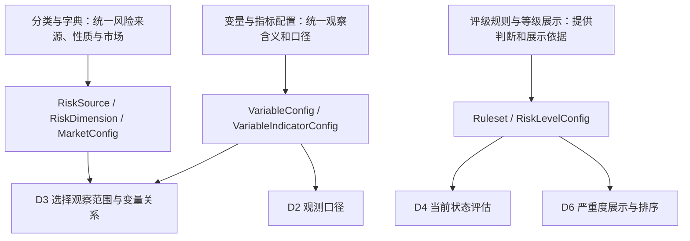
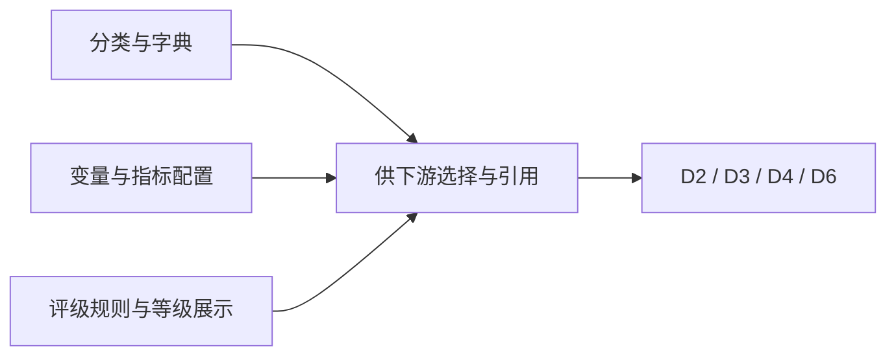
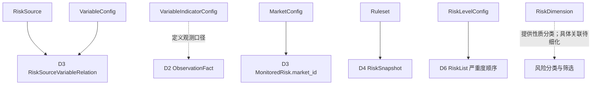

# D1 · 风险知识与规则 · 业务领域设计 V1.0

> **英文名称**：Risk Knowledge  
> **更新日期**：2026-10-08  
> **总览**：[[tools/RiskHot/02 RiskHot业务领域设计|RiskHot 业务领域总览]]  
> **整理依据**：[[sources/manual/RiskHot/2026-10-08-业务领域设计拆分前v2.2|拆分前业务领域设计 v2.2]]。V1.0 为独立分册版本；原有“已确认”“建议”“待细化”状态继续有效，模块与流程的结构归纳不代表新增设计已确认。

**领域架构总览**

**领域核心职责：** 为风险观察、观测、评估与发布提供统一的分类、变量指标配置及评级规则。

## 1. 领域能力

### 1.1 领域定位与目标

D1 定义风险来源分类、风险性质、关键变量、观测指标和评级规则，使下游使用统一业务含义与判断口径。

### 1.2 领域职责与边界

负责配置与规则的定义；不保存某项风险本轮观测值或替代 D4 形成风险等级。`RiskLevelConfig` 仅承担等级名称、顺序、颜色与展示说明，评级逻辑由 `Ruleset` 提供。

`RiskSource` 表示风险来源分类，与 D2 的信源配置 `ObservationSource` 不同。

### 1.3 核心业务能力

- 配置一级风险源、风险性质与市场字典。
- 配置关键变量及指标定义、单位、频率、有效期和允许数据源。
- 提供等级展示字典、评级规则、适用范围与版本。

### 1.4 典型业务场景

**按既有职责归纳：**

- 建立风险观察时，为 D3 提供市场、风险源与变量配置。
- 接入定量观测时，为 D2 提供指标口径。
- 形成风险快照时，为 D4 提供评级规则。
- 生成最严重风险列表时，为 D6 提供可比较的严重度顺序。

## 2. 业务领域架构

### 2.1 业务模块划分

| 业务模块〔结构归纳〕 | 主要职责 | 核心对象 |
| --- | --- | --- |
| 分类与字典 | 统一风险来源、性质、市场筛选口径 | RiskSource、RiskDimension、MarketConfig |
| 变量与指标配置 | 定义观察变量及指标口径 | VariableConfig、VariableIndicatorConfig |
| 评级规则与等级展示 | 提供判断规则与等级展示字典 | Ruleset、RiskLevelConfig |

模块划分用于组织既有职责，不预设独立服务或数据库表。

### 2.2 业务模块关系图

### 2.3 核心业务流程

**流程归纳：** 明确分类与观测口径 → 提供适用配置与规则 → 下游引用配置开展观察与评估 → 按统一等级字典展示。配置审核、发布与失效流程尚未定义。

### 2.4 跨领域协作与输入输出契约

| 协作领域 | 输入/输出 | 业务契约与待细化项 |
| --- | --- | --- |
| [[tools/RiskHot/02-D2 观测资料与证据业务领域设计\|D2 观测资料与证据]] | 输出 VariableIndicatorConfig | 提供定义、口径、频率、单位、有效期和允许来源；指标到观测映射待细化 |
| [[tools/RiskHot/02-D3 风险观察与监测业务领域设计\|D3 风险观察与监测]] | 输出 RiskSource、VariableConfig、MarketConfig | 由 D3 建立具体风险与变量关联；配置不等于观察实例 |
| [[tools/RiskHot/02-D4 风险状态评估业务领域设计\|D4 风险状态评估]] | 输出 Ruleset、RiskLevelConfig | D4 依规则形成判断，展示字典不承担评级 |
| [[tools/RiskHot/02-D6 风险产品与发布业务领域设计\|D6 风险产品与发布]] | 输出 RiskLevelConfig | 不同规则体系下的等级必须具备可比较严重度，D6 不自行评分 |

### 2.5 AI 介入与分析任务

当前未为 D1 配置维护单独定义 AI 任务。D1 为 D3 的 AI-01 风险识别与匹配、D4 的 AI-03 整体风险研判提供知识与规则；不能据此将规则自动修改或发布视为已确认能力。AI-06 可检查下游结果与配置的一致性，具体契约待细化。

## 3. 核心领域模型

### 3.1 领域对象设计

**统一领域语言**

风险源表示来源类别，风险性质表示分类维度，变量表示观察含义，指标表示可核对的口径，评级规则与等级展示字典分别承担判断和展示职责。

**领域对象清单与核心对象定义〔已确认〕**

| 领域对象 / 配置       | 原有配置名称              | 领域含义                         |
| --------------- | ------------------- | ---------------------------- |
| RiskSource      | `risk_source`       | 一级风险来源类别，同时可作为主题页入口          |
| RiskDimension   | `risk_dimension`    | 风险性质分类，如基本面、流动性、情绪、估值        |
| MarketConfig    | `market_config`     | 市场名称、代码和统一筛选口径               |
| VariableConfig  | `variable_config`   | 关键变量含义和解释边界                  |
| VariableIndicatorConfig | `indicator_config`  | 观测指标定义、统计口径、单位、频率、有效期、允许的数据源 |
| RiskLevelConfig | `risk_level_config` | 风险等级名称、顺序、颜色和展示说明，不承担评级判断    |
| Ruleset         | `ruleset`           | 判断风险等级、变化与解除的规则，包含适用范围和版本    |

**注意：** `RiskSource` 是风险来源分类；`ObservationSource` 是信息/指标的信源配置，职责不同。

**对象关系图〔既有引用关系归纳〕**

### 3.2 聚合与领域行为

**聚合根、实体、值对象〔待细化〕**

现有设计确认配置对象及职责，尚未确认各对象的聚合根、实体或值对象类型。

**聚合边界与关系**

D1 管理配置与规则，具体风险归 D3，观测归 D2，评估结果归 D4；不将下游结果纳入配置聚合。配置之间的绑定关系及一致性边界待细化。

**领域行为与领域服务〔职责归纳〕**

维护分类字典、变量与指标配置、评级规则及等级展示口径。正式命令、领域服务名称及配置变更流程尚未定义。

### 3.3 业务规则与生命周期

**业务规则与不变量**

- 风险来源分类与信源配置必须区分（BR-02）。
- 等级展示字典不承担评级逻辑。
- D6 严重度排序使用统一可比较口径（BR-13）。
- P0：`Ruleset` 的等级判断逻辑尚未完成；风险兑现程度与持续性标准需与 D4 共同细化。
- P1：不同来源指标与 ObservationFact 的映射、频率、口径及有效期需与 D2 细化。

**状态及生命周期**

配置对象的状态取值、启用/停用、审核及发布流程尚未定义，不能视为已实现的状态机。

**领域事件〔待细化〕**

当前设计尚未确认正式领域事件名称、载荷、触发时机与投递语义。业务行为不直接等同于已定义的领域事件。

**数据归属与版本约束**

七项配置及原有名称见第 3.1 节。`Ruleset` 具有适用范围与版本语义；版本绑定、历史配置追溯及规则切换策略待细化。物理字段、索引与约束留到数据详细设计。
