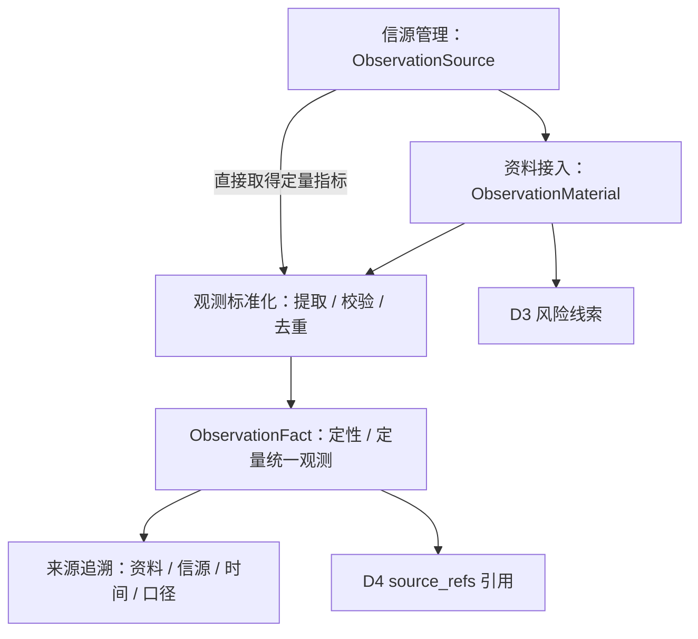
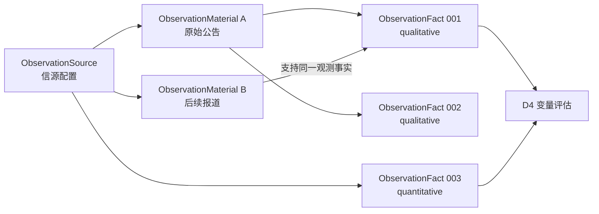

# D2 · 观测资料与证据 · 业务领域设计 V1.0

> **英文名称**：Observation & Evidence  
> **更新日期**：2026-10-08  
> **总览**：[[tools/RiskHot/02 RiskHot业务领域设计|RiskHot 业务领域总览]]  
> **整理依据**：[[sources/manual/RiskHot/2026-10-08-业务领域设计拆分前v2.2|拆分前业务领域设计 v2.2]]。V1.0 为独立分册版本；原有“已确认”“建议”“待细化”状态继续有效，模块与流程的结构归纳不代表新增设计已确认。

**领域架构总览**

**领域核心职责：** 将信源与原始资料整理为可独立引用、可追溯的统一观测事实。



## 1. 领域能力

### 1.1 领域定位与目标

D2 回答：

1. **信息从哪里来？**
2. **原始资料是什么？**
3. **从中观察到了什么定性事实，或取得了什么定量指标值？**
4. **观测记录能追溯到哪些原始来源、时间和口径？**

D2 提供可引用的事实和指标观测。**D2 不决定某项风险等级，也不在观测记录上固定“加剧某个风险”这样的风险专属判断。**

### 1.2 领域职责与边界

负责信源、资料、观测及追溯关系；不决定某项风险等级，也不在观测记录上固定跨风险通用的风险作用。领域概念统一不预先决定单表存储。

### 1.3 核心业务能力

- 信源登记与原始资料留存。
- 定性事实提取、定量指标记录和观测归一化。
- 重复观测候选处理及多来源支持。
- 时间、口径、出处与历史修订追溯。

### 1.4 典型业务场景

**沿用已有示例：**

- 从美联储政策声明提取“宣布维持利率”的定性观测。
- 从指标接口记录某日国债收益率，允许不先形成新闻资料。
- 后续报道支持同一事实时，保留多个可定位出处。
- 区分“宣布计划”和“已经执行”，避免把不同事实误归并。

## 2. 业务领域架构

### 2.1 业务模块划分

| 业务模块〔结构归纳〕 | 职责 | 核心对象/行为 |
| --- | --- | --- |
| 信源与资料管理 | 登记信源、保存资料及出处 | ObservationSource、ObservationMaterial |
| 观测提取与归一化 | 抽取事实、记录指标、处理重复候选 | ObservationFact |
| 来源追溯 | 追踪观测对应的资料、位置及版本 | TraceObservationSource |

### 2.2 业务模块关系图


### 2.3 核心业务流程

登记信源 → 接入资料或指标数据 → 提取定性事实 / 校验定量口径 → 判重与观测归一化 → 保存 ObservationFact 及来源定位 → 供下游引用。判重、修订与核验的详细规则待细化。

### 2.4 跨领域协作与输入输出契约

| 协作领域 | 输入/输出 | 业务契约 |
| --- | --- | --- |
| [[tools/RiskHot/02-D1 风险知识与规则业务领域设计\|D1 风险知识与规则]] | 输入 VariableIndicatorConfig | 按指标定义、单位、频率、来源与有效期理解定量观测 |
| [[tools/RiskHot/02-D3 风险观察与监测业务领域设计\|D3 风险观察与监测]] | 输出资料和观测线索 | 供风险匹配与范围确认使用，不直接替代风险建档判断 |
| [[tools/RiskHot/02-D4 风险状态评估业务领域设计\|D4 风险状态评估]] | 输出 ObservationFact 及追溯信息 | source_refs 直接引用观测及必要版本/出处信息 |

**证据引用〔已确认〕**

`EvidenceRef` **不作为独立领域对象建模。**

D4 中的 `RiskSnapshotVariableEvidence.source_refs` 直接保存对 D2 观测记录的引用及必要的版本/出处信息。

```text
ObservationFact（D2）
  └── OBS001：某个时点观察到的事实或指标值

RiskSnapshotVariableEvidence（D4）
  ├── observed_state：当前变量状态
  ├── interpretation：变量如何影响当前风险
  └── source_refs：引用 OBS001（及版本/来源定位）
```

**设计原则：** `ObservationFact` 存放观测本身；`source_refs` 是分析结果指向观测的属性。暂不新增 `evidence_ref` 领域实体或专用业务表。

### 2.5 AI 介入与分析任务

**AI-00〔新增建议〕**：提取定性事实并归一化；定量校验以程序为主。

**分析产出：** ObservationMaterial、ObservationFact。

**校验：** AI 可以帮助提取和归一化事实；数据校验、幂等控制、ID 分配、版本管理由程序负责；AI-06 负责分析结果校验，程序负责可确定的结构与关联检查。

统一处理契约为“输入数据 → 分析任务 → Prompt → 输出 Schema → 校验规则 → 数据持久化”。具体 Prompt、输入输出 Schema 和校验方式待详细设计。

## 3. 核心领域模型

### 3.1 领域对象设计

**统一领域语言**

信源说明信息来自哪里，资料保留原始输入，观测事实记录从中得到的定性事实或定量数值；证据引用是下游结果的属性。

**领域对象清单与核心对象定义**

| 对象                    | 领域类型（建议）            | 含义                             | 示例                     |
| --------------------- | ------------------- | ------------------------------ | ---------------------- |
| `ObservationSource`   | 来源目录实体              | 信源配置；管理提供新闻、公告、研究材料及指标数据的机构或接口 | Reuters、FRED、美联储官网     |
| `ObservationMaterial` | 资料实体 / 可作为聚合根       | 原始新闻、公告、报告、研究材料；保留内容及出处        | 一份美联储政策声明              |
| `ObservationFact`         | **统一观测记录 / 可作为聚合根** | 一条可独立引用的定性事实或定量指标观测            | “美联储宣布维持利率”；某日国债收益率观测值 |

**统一领域对象边界：**

- 定性事实：由 `ObservationFact` 的 `qualitative` 类型承载。
- 定量指标观测：由 `ObservationFact` 的 `quantitative` 类型承载，不再单列独立领域对象。
- `EvidenceRef`：不单列领域对象，见第 2.4 节。

> **重要边界**：领域概念合并，并不预先决定物理数据库必须采用单表。未来可按数据规模、修订规则和查询特性拆分存储。

**ObservationFact 的统一领域语义〔已确认〕**

**一条 ObservationFact 代表：带有明确内容或数值、时间上下文与可追溯出处、可供分析引用的一次观测。**

`observation_type`：

| 取值             | 中文名  | 内容举例                     | 常见输入来源          |
| -------------- | ---- | ------------------------ | --------------- |
| `qualitative`  | 定性观测 | “央行宣布维持政策利率”；“财政部上调发行计划” | 新闻、公告、政策文件、研究材料 |
| `quantitative` | 定量观测 | 某项国债收益率在某时点的观测数值         | 指标接口、统计数据、结构化公告 |

**共同属性（仅业务语义，不确定具体字段）**：唯一标识、观测类型、观测内容、发生/统计时点、资料/信源出处、统计或语义限定条件、记录及修订信息。

- 对定性观测，内容通常是主体、行为、对象、时间及限定条件，需区分“宣布计划”和“已经执行”。
- 对定量观测，内容通常是指标定义引用、观测值、单位、统计期、发布或修订批次。
- 可以从资料中提取多条 ObservationFact；同一个观测事实也可能被多份资料记载或支持。
- 事件和公告中的数字可以被结构化表示，具体划分为定性或定量观测应根据其是否构成可独立核对的指标观测决定；不为强行分类而丢失上下文。

**对象关系图〔已确认原则／关系细节待细化〕**



- 一份资料可以提取多条观测记录。
- 一条观测记录可以有多个来源支撑，需要保留可定位的出处。
- 定量观测可能从数据接口直接得到，保留指标定义及来源即可。
- 相似报道是否指向同一观测、何时需要新建观测，应在后续“事实同一性与修订”规则中细化。
- **此处只定义业务关联**，是否设置物理关联表留待数据详细设计。

### 3.2 聚合与领域行为

**聚合根、实体、值对象〔建议〕**

ObservationSource 为来源目录实体；ObservationMaterial、ObservationFact 可各自作为聚合根。值对象划分尚未确认。

**聚合边界与关系〔建议〕**

- `ObservationMaterial`：可独立管理原始资料、版本及来源定位。
- `ObservationFact`：可独立管理统一观测内容、状态和追溯关系。
- `ObservationSource`：由信源目录/配置管理能力维护。

是否进一步拆分、合并聚合，以及跨来源的同一事实如何归并，在应用流程和详细设计阶段确定。**当前先确认三个领域对象及其职责。**

值对象划分尚未确认，不能从暂定字段反推已确定的聚合模型。

**领域行为与领域服务〔建议〕**

| 领域行为                          | 输入              | 输出                |
| ----------------------------- | --------------- | ----------------- |
| `RegisterSource`              | 信源信息            | 可用的信源配置           |
| `IngestMaterial`              | 新闻/公告/研究材料      | 原始资料记录            |
| `ExtractObservationFacts`         | 原始资料            | 多条定性观测候选          |
| `RecordQuantitativeObservationFact`  | 指标定义、数值、统计时间与来源 | 定量观测记录            |
| `ResolveDuplicateObservationFact` | 新观测与历史候选        | 复用已有记录或新增记录的建议    |
| `TraceObservationSource`      | 观测记录 ID         | 原始资料、原始位置、来源及相应版本 |

AI 可以帮助提取和归一化事实，数据校验、幂等控制、ID 分配、版本管理由程序负责。

### 3.3 业务规则与生命周期

**业务规则与不变量**

- 定性与定量观测均需可追溯来源及时间语义（BR-03）。
- 资料与观测可形成多对多支持关系（BR-04）。
- D2 不固定风险等级或风险作用结论（BR-05）。
- 不新增 EvidenceRef 独立对象（BR-06）。
- P0：最小观测粒度、事实判重、声明与实施区分、来源可信度与冲突处理待细化。

**状态及生命周期**

观测需管理记录及修订信息；状态枚举、核验流程、作废与版本修订机制尚未确定。

**领域事件〔待细化〕**

当前设计尚未确认正式领域事件名称、载荷、触发时机与投递语义。业务行为不直接等同于已定义的领域事件。

**数据归属与版本约束**

D2 拥有 ObservationSource、ObservationMaterial、ObservationFact。历史观测应可追溯（BR-12，建议）。

**数据设计边界**

- D2 应采用几张数据库表，以及如何命名。
- 统一 ObservationFact 采用单表、子表、JSON，还是其它存储模式。
- 资料与观测的多对多关系是否设中间表。
- 指标时间序列、版本修订和事实核验需要哪些单独索引/附表。
- `source_refs` 的具体 JSON Schema、外键策略与查询优化。
