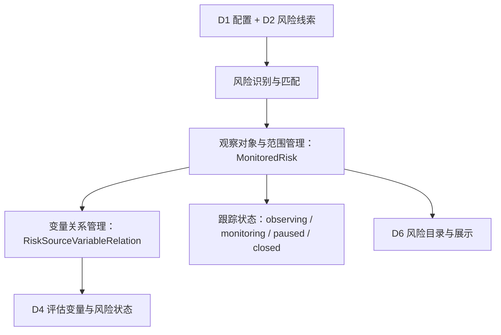
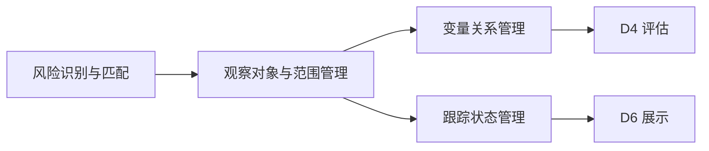
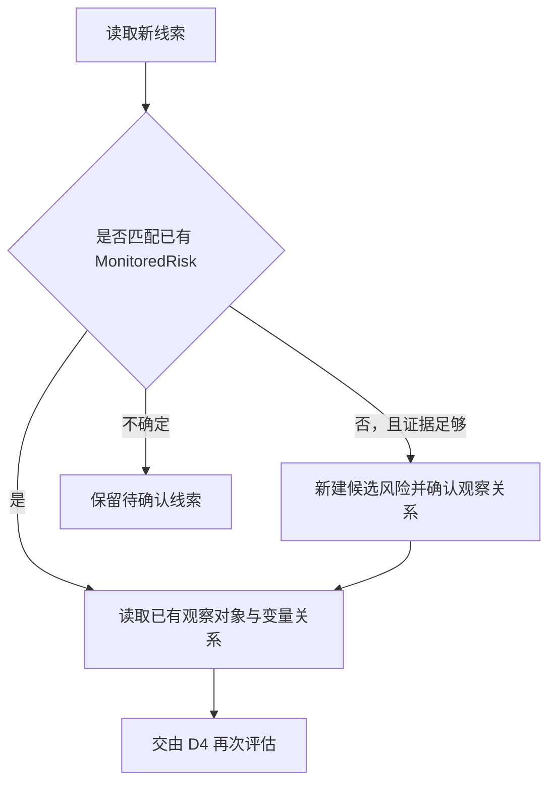
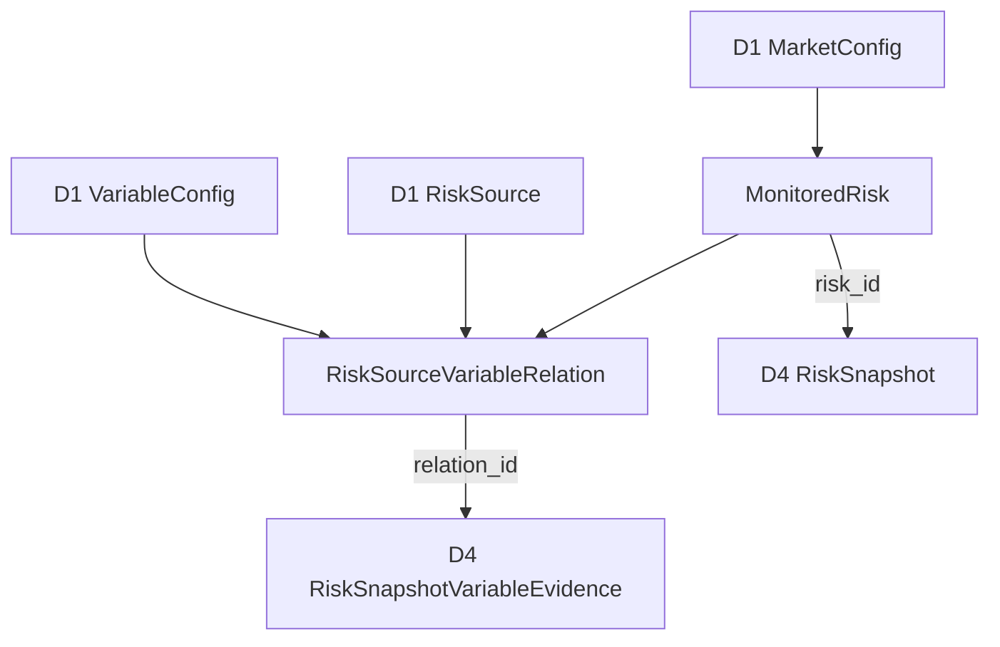

# D3 · 风险观察与监测 · 业务领域设计 V1.0

> **英文名称**：Risk Monitoring  
> **更新日期**：2026-10-08  
> **总览**：[[tools/RiskHot/02 RiskHot业务领域设计|RiskHot 业务领域总览]]  
> **整理依据**：[[sources/manual/RiskHot/2026-10-08-业务领域设计拆分前v2.2|拆分前业务领域设计 v2.2]]。V1.0 为独立分册版本；原有“已确认”“建议”“待细化”状态继续有效，模块与流程的结构归纳不代表新增设计已确认。

**领域架构总览**

**领域核心职责：** 建立并持续管理具体风险观察对象、观察边界、变量关系与跟踪状态。

## 1. 领域能力

### 1.1 领域定位与目标

`MonitoredRisk` 表示针对特定市场或主体持续观察的一项具体宏观风险；目标是保持观察对象身份稳定，并明确观察范围和关键变量关系。

### 1.2 领域职责与边界

第一版观察对象限定经济体、宏观主体、市场、金融系统。行业、企业与单项资产可以成为证据或传导环节，暂不独立建档。

D3 不保存本轮观测值或当前风险等级；D2 维护观测，D4 形成阶段性评估。

### 1.3 核心业务能力

- 风险识别、已有风险匹配与候选确认。
- 观察对象建档、范围与观察原因管理。
- 风险源—变量关系选择、变量角色与影响机制定义。
- 观察中、监控中、暂停或结束跟踪状态管理。

### 1.4 典型业务场景

**按既有流程归纳：**

- 新资料出现风险线索，先匹配已有观察对象。
- 新线索属于既有风险，复用对象并交由 D4 再次评估。
- 尚无匹配对象且证据足够，建立候选风险并确认观察关系。
- 观察范围过宽时拆分；暂停或结束跟踪时记录原因。

## 2. 业务领域架构

### 2.1 业务模块划分

| 业务模块〔结构归纳〕 | 职责 | 核心对象 |
| --- | --- | --- |
| 风险识别与匹配 | 判断复用对象、新建候选或保留待确认线索 | MonitoredRisk |
| 观察对象与范围管理 | 管理身份、观察原因和范围 | MonitoredRisk |
| 变量关系管理 | 选择风险源、变量、角色与影响机制 | RiskSourceVariableRelation |
| 跟踪状态管理 | 管理跟踪状态及变更原因 | MonitoredRisk |

### 2.2 业务模块关系图

### 2.3 核心业务流程

### 2.4 跨领域协作与输入输出契约

| 协作领域 | 输入/输出 | 业务契约 |
| --- | --- | --- |
| [[tools/RiskHot/02-D1 风险知识与规则业务领域设计\|D1 风险知识与规则]] | 输入风险源、变量及市场配置 | 引用统一字典，建立风险实例上的关系 |
| [[tools/RiskHot/02-D2 观测资料与证据业务领域设计\|D2 观测资料与证据]] | 输入资料与观测线索 | 按身份及范围匹配，不按名称反复创建 |
| [[tools/RiskHot/02-D4 风险状态评估业务领域设计\|D4 风险状态评估]] | 输出 MonitoredRisk、RiskSourceVariableRelation | 评估用有效 relation_id，且必须与快照所属风险一致 |
| [[tools/RiskHot/02-D6 风险产品与发布业务领域设计\|D6 风险产品与发布]] | 输出对象身份、范围及 tracking_status | 完整目录可包含无快照、暂停及结束跟踪的风险 |

### 2.5 AI 介入与分析任务

**AI-01 风险识别与匹配**：辅助识别线索、匹配已有风险、确认观察范围和变量关系。

**分析产出：** MonitoredRisk、RiskSourceVariableRelation。

**校验：** 验证观察对象边界与已有身份、关系有效性；不确定时保留待确认线索；AI-06 负责分析结果校验，程序负责可确定的结构与关联检查。

统一处理契约为“输入数据 → 分析任务 → Prompt → 输出 Schema → 校验规则 → 数据持久化”。具体 Prompt、输入输出 Schema 和校验方式待详细设计。

## 3. 核心领域模型

### 3.1 领域对象设计

**统一领域语言**

风险观察对象是持续跟踪的业务身份；观察边界限定研究范围；变量关系表达“某项风险在某一风险源下观察哪个变量、角色是什么、如何影响风险”。

**领域对象清单**

| 对象 | 类型〔建议〕 | 职责 |
| --- | --- | --- |
| MonitoredRisk | 聚合根 | 管理风险观察身份、范围与跟踪状态 |
| RiskSourceVariableRelation | 聚合内关系实体 | 管理风险源与变量的有效关系 |

**核心对象定义：MonitoredRisk〔已确认〕**

`MonitoredRisk` 表示**针对特定市场或主体，持续观察的一项具体宏观风险**，负责明确观察对象、观察边界和跟踪状态。

已有核心业务字段：

| 字段                          | 业务含义              |
| --------------------------- | ----------------- |
| `risk_id`                   | 风险观察唯一标识          |
| `title`                     | 风险名称，排除临时风险等级     |
| `slug`                      | 页面标识（可选）          |
| `summary`                   | 风险观察简介            |
| `market_id`                 | 关联市场字典            |
| `observation_target`        | 具体观察对象            |
| `scope_boundary`            | 研究对象边界与纳入范围       |
| `observation_reason`        | 为什么启动本项观察，关联可核验线索 |
| `tracking_status`           | 跟踪生命周期状态          |
| `tracking_status_reason`    | 暂停/结束等状态变更说明      |
| `first_observed_at`         | 首次发现风险线索时间        |
| `created_at` / `updated_at` | 创建/修改时间           |

`scope_boundary` 负责定义研究范围，`RiskSourceVariableRelation` 将范围落实到具体需要观察的变量。

**核心对象定义：RiskSourceVariableRelation〔已确认〕**

一条关系表示：**对某一 MonitoredRisk，在一个一级风险源下观察哪个变量、变量起什么作用、如何影响风险。**

已有字段：`relation_id`、`risk_id`、`source_id`、`variable_id`、`variable_role`、`variable_impact_on_risk`、`created_at`、`updated_at`。

| `variable_role`       | 角色   | 含义            |
| --------------------- | ---- | ------------- |
| `risk_driver`         | 风险驱动 | 什么产生或加大风险压力   |
| `risk_transmission`   | 风险传导 | 什么决定压力的传递程度   |
| `risk_buffer`         | 风险缓冲 | 什么能够吸收或减轻风险压力 |
| `damage_verification` | 损害验证 | 什么表明损害已发生     |

变量角色附着在特定风险下的关系上，同一变量在不同风险中可以担任不同角色。该关系**不保存本轮观测值或当前风险等级**。

**对象关系图**

### 3.2 聚合与领域行为

**聚合根、实体、值对象〔建议〕**

MonitoredRisk 可作为风险观察聚合根，其下管理有效变量关系；RiskSourceVariableRelation 为关系实体。尚未确认专门的值对象。

**聚合边界与关系**

风险源和变量定义属于 D1，当前观测属于 D2，评估证据与快照属于 D4；观察聚合只管理对象身份、范围和变量关系，不加载全部历史快照。

**领域行为与领域服务〔职责归纳〕**

匹配已有风险、建立候选风险、确认观察范围、维护变量关系及变更跟踪状态。正式命令名、状态迁移前置条件及关系唯一约束待细化。

### 3.3 业务规则与生命周期

**业务规则与不变量**

- 观察对象第一版限定宏观四类。
- 优先匹配既有观察对象的身份和范围，避免按名称反复创建。
- 观察对象应具备能形成一致判断的边界，过宽时拆分。
- 新观测可触发既有 MonitoredRisk 的再次评估，无须重复创建 MonitoredRisk。
- 相同风险下，重复的风险源—变量有效关联应在业务上控制（具体唯一约束待数据设计）。

BR-01 限定宏观四类观察对象；BR-07 的评估关系一致性由 D3 与 D4 协作保证。

**状态及生命周期**

`tracking_status` 既有取值：

| 取值           | 含义             |
| ------------ | -------------- |
| `observing`  | 观察中，建立观察基准     |
| `monitoring` | 监控中，持续更新       |
| `paused`     | 暂停跟踪，不代表风险减弱   |
| `closed`     | 结束跟踪，不自动代表风险解除 |

上述取值不表示所有状态间均可自由迁移；完整迁移规则尚未设计。

**领域事件〔待细化〕**

当前设计尚未确认正式领域事件名称、载荷、触发时机与投递语义。业务行为不直接等同于已定义的领域事件。

**数据归属与版本约束**

原有业务表名为 `risk`、`risk_source_variable_relation`。领域对象更名不直接更改物理表名与 risk_id、relation_id 等字段。关系有效期、变更历史及如何绑定历史快照待详细设计；不补写未经确认的版本字段。
