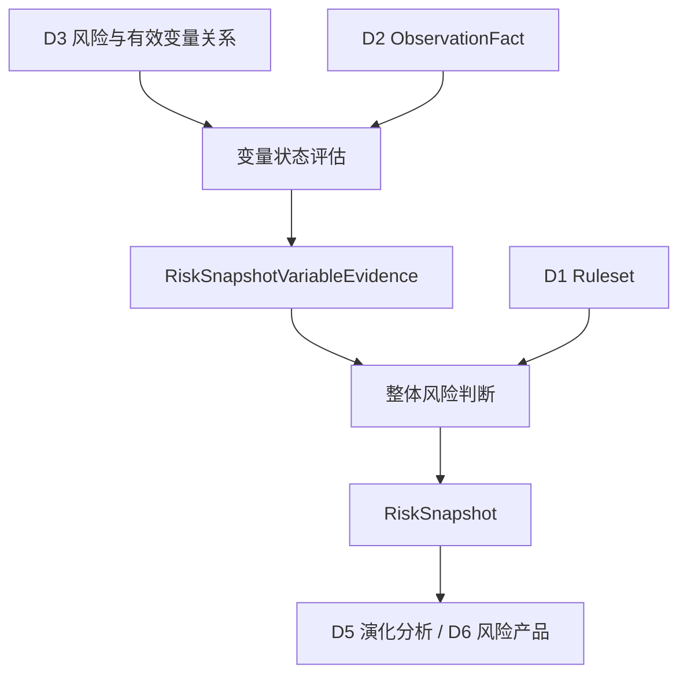
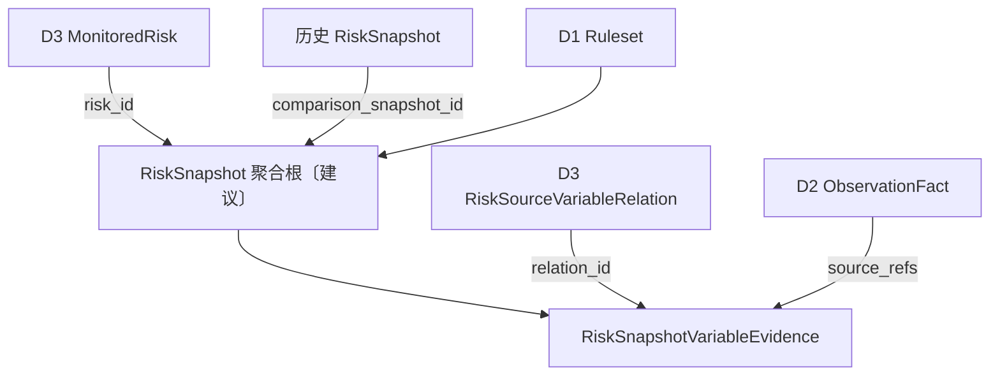

# D4 · 风险状态评估 · 业务领域设计 V1.0

> **英文名称**：Risk Assessment  
> **更新日期**：2026-10-08  
> **总览**：[[tools/RiskHot/02 RiskHot业务领域设计|RiskHot 业务领域总览]]  
> **整理依据**：[[sources/manual/RiskHot/2026-10-08-业务领域设计拆分前v2.2|拆分前业务领域设计 v2.2]]。V1.0 为独立分册版本；原有“已确认”“建议”“待细化”状态继续有效，模块与流程的结构归纳不代表新增设计已确认。

**领域架构总览**

**领域核心职责：** 依据可追溯观测评估关键变量，并形成明确截止时点的整体风险快照。

## 1. 领域能力

### 1.1 领域定位与目标

D4 把风险观察模型与本轮观测结合，分别判断变量状态、风险等级、实际损害、变化趋势和持续条件，形成可供后续演化比较的阶段性快照。

### 1.2 领域职责与边界

D4 使用 D1 的规则、D2 的观测和 D3 的有效变量关系；不重新定义一套变量关系，也不承担信源维护或风险观察对象建档。快照描述当前状态，不预测未来走势。

### 1.3 核心业务能力

- 解释变量状态、事实支持、风险作用与不确定性。
- 综合变量证据形成整体状态与风险等级。
- 区分实际损害、相对趋势与持续条件。
- 保留历史快照和证据引用，供演化比较与产品展示。

### 1.4 典型业务场景

**按既有规则归纳：**

- 首轮评估：无法进行历史比较时，trend 为 undetermined。
- 续评：结合对比快照判断变化方向。
- 证据不足：允许风险等级留空并说明缺口。
- 证据存在冲突：在 uncertainty 中保留口径与来源限制。

## 2. 业务领域架构

### 2.1 业务模块划分

| 业务模块〔结构归纳〕 | 主要职责 | 核心产出 |
| --- | --- | --- |
| 变量状态评估 | 解释变量当前状态、证据及风险作用 | RiskSnapshotVariableEvidence |
| 整体风险判断 | 按规则形成风险等级、兑现程度、趋势及持续性判断 | RiskSnapshot |
| 评估结果校验与历史管理 | 校验引用与判断边界、保留历史 | 可追溯的变量评估与快照；具体状态机待细化 |

### 2.2 业务模块关系图

### 2.3 核心业务流程

读取 MonitoredRisk 与有效变量关系 → 关联本轮 ObservationFact → 生成变量状态、解释和 source_refs → 按 Ruleset 综合判断 → 形成 RiskSnapshot → 校验并保留历史 → 供 D5、D6 使用。快照发布与修订的具体流程尚未确定。

### 2.4 跨领域协作与输入输出契约

| 协作领域 | 输入/输出 | 业务契约 |
| --- | --- | --- |
| [[tools/RiskHot/02-D1 风险知识与规则业务领域设计\|D1 风险知识与规则]] | 输入 Ruleset、RiskLevelConfig | 规则产生判断，展示字典不承担评级 |
| [[tools/RiskHot/02-D2 观测资料与证据业务领域设计\|D2 观测资料与证据]] | 输入 ObservationFact | source_refs 引用观测及必要版本/出处；不建 EvidenceRef |
| [[tools/RiskHot/02-D3 风险观察与监测业务领域设计\|D3 风险观察与监测]] | 输入 MonitoredRisk、RiskSourceVariableRelation | relation_id 有效并与所属快照的 risk_id 对应 |
| [[tools/RiskHot/02-D5 风险演化分析业务领域设计\|D5 风险演化分析]] | 输出历史 RiskSnapshot 及变量评估 | 保留 comparison_snapshot_id、时间与证据语义；可比性细则待明确 |
| [[tools/RiskHot/02-D6 风险产品与发布业务领域设计\|D6 风险产品与发布]] | 输出当前有效快照及历史判断引用 | D6 展示和报告不重新评级；有效性与修订状态机制待细化 |

### 2.5 AI 介入与分析任务

**AI-02 变量证据与状态分析**产出变量评估；**AI-03 整体风险研判**综合证据形成快照。

**分析产出：** RiskSnapshotVariableEvidence、RiskSnapshot。

**校验：** 校验 relation_id、risk_id、source_refs 关联与证据充分性；风险等级、损害、趋势、持续条件分别判断；AI-06 负责分析结果校验，程序负责可确定的结构与关联检查。

统一处理契约为“输入数据 → 分析任务 → Prompt → 输出 Schema → 校验规则 → 数据持久化”。具体 Prompt、输入输出 Schema 和校验方式待详细设计。

## 3. 核心领域模型

### 3.1 领域对象设计

**统一领域语言**

变量评估表示某轮已选变量的状态与依据；风险快照表示某项风险在明确信息截止时点的整体判断；对比快照提供变化判断基准。

**领域对象清单**

| 对象 | 类型〔建议〕 | 职责 |
| --- | --- | --- |
| RiskSnapshot | 独立评估聚合根 | 管理本轮整体风险判断 |
| RiskSnapshotVariableEvidence | 聚合内实体 | 管理本轮变量状态、证据与解释 |

**核心对象定义：RiskSnapshotVariableEvidence〔已确认〕**

每条记录表示：**某次风险快照中，一个已选关键变量当前是什么状态、有哪些事实支持、对风险判断有什么作用。**

已有字段及含义：

| 字段                   | 业务含义                               |
| -------------------- | ---------------------------------- |
| `evidence_id`        | 变量评估记录 ID                          |
| `snapshot_id`        | 所属快照                               |
| `relation_id`        | 指向 D3 的风险源—变量关系                    |
| `observed_state`     | 本次变量状态                             |
| `evidence_content`   | 本轮使用的事实和指标证据描述                     |
| `source_refs`        | 直接引用 D2 的 ObservationFact（必要时带版本和原始定位） |
| `change_description` | 相对对比快照的变化                          |
| `risk_effect`        | 当前证据体现风险压力、缓冲作用还是无法判断              |
| `interpretation`     | 在给定传导机制和条件下为何具有上述作用                |
| `uncertainty`        | 证据缺口、冲突和口径限制                       |
| `created_at`         | 评估记录创建时间                           |

**关键关系：** `relation_id` 已定位风险源和变量，无须在该评估对象上重新定义一套变量关系；`source_refs` 是属性，不单独建 EvidenceRef 对象。

**核心对象定义：RiskSnapshot〔已确认〕**

一条 `RiskSnapshot` 表示**某项风险在明确截止时间的整体状态判断**，同一风险对应多次历史快照。

已有字段：

| 字段                       | 业务含义               |
| ------------------------ | ------------------ |
| `snapshot_id`            | 快照 ID              |
| `risk_id`                | 所属 MonitoredRisk            |
| `snapshot_time`          | 判断的信息截止时点          |
| `comparison_snapshot_id` | 对比历史快照；首轮可为空       |
| `status_summary`         | 当前风险状态及核心依据        |
| `risk_level`             | 依评级规则形成的风险等级；不足时可空 |
| `realization_degree`     | 已兑现与尚未证实的损害        |
| `trend`                  | 相对历史的变化方向          |
| `persistence_status`     | 当前持续条件是否仍存在        |
| `uncertainty`            | 数据缺口和不确定性          |
| `next_observation`       | 需要继续验证的事实或指标       |
| `created_at`             | 生成时间               |

**对象关系图**

### 3.2 聚合与领域行为

**聚合根、实体、值对象〔建议〕**

RiskSnapshot 为独立评估聚合根，管理 RiskSnapshotVariableEvidence 集合；尚未确认专门的值对象。

**聚合边界与关系**

- `RiskSnapshot` 可作为独立评估聚合根，其下管理 `RiskSnapshotVariableEvidence` 集合。
- 采用独立快照聚合有利于长期积累历史，不要求一次加载某项风险所有历史快照。
- 快照发布、修订、作废和分析过程的具体状态机尚需进一步设计。

**领域行为与领域服务〔职责归纳〕**

评估变量状态、综合风险判断、对比历史快照、校验引用与保留评估历史。具体领域服务名称与快照发布、修订、作废行为的状态约束尚未定义。

### 3.3 业务规则与生命周期

**业务规则与不变量**

1. `RiskLevelConfig` 只承担等级展示字典职责；等级判断来自分析与 `Ruleset`。
2. 风险等级、实际损害、变化趋势、持续条件分别判断。
3. 证据不足不等于低风险；无法比较不等于稳定。
4. 快照聚焦当前状态，不给出未来走势预测；`next_observation` 是后续观察重点。
5. 历史快照需要保留，供 D5 演化比较。

变量评估须引用有效 relation_id 并与所属风险一致（BR-07，建议程序校验）；无新增 EvidenceRef 对象（BR-06）。

**待细化：** P0 评级逻辑、风险兑现程度及持续性标准；P1 AI-02、AI-03 与 AI-06 的详细输入输出和校验契约。

**状态及生命周期**

`trend` 既有取值：

- `aggravating`：风险压力增强。
- `stable`：可比证据显示没有明显变化。
- `easing`：风险压力减轻。
- `undetermined`：首次评估、证据不足或不可比。

趋势值描述相对历史的变化，不等同于快照发布状态。快照发布、修订、作废及分析过程的状态机尚需设计。

**领域事件〔待细化〕**

当前设计尚未确认正式领域事件名称、载荷、触发时机与投递语义。业务行为不直接等同于已定义的领域事件。

**数据归属与版本约束**

D4 拥有快照与变量评估，原有表名为 `risk_snapshot`、`risk_snapshot_variable_evidence`。D3 的风险与关系、D2 的观测通过引用关联。历史快照应保留供 D5 比较；版本修订、引用稳定性、物理字段及索引留待数据详细设计（BR-12 为建议）。
