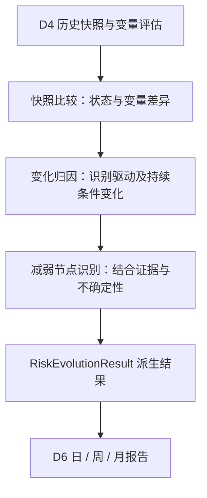
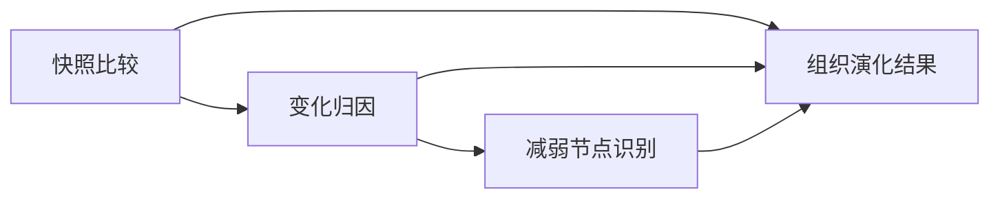
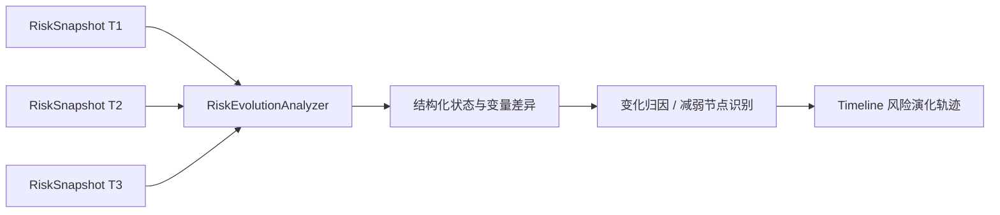
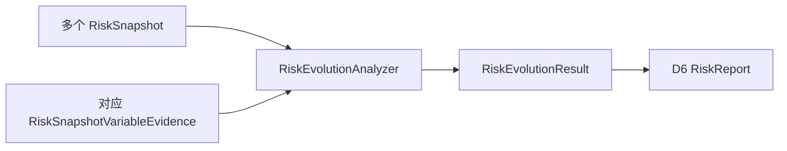

# D5 · 风险演化分析 · 业务领域设计 V1.0

> **英文名称**：Risk Evolution  
> **更新日期**：2026-10-08  
> **总览**：[[tools/RiskHot/02 RiskHot业务领域设计|RiskHot 业务领域总览]]  
> **整理依据**：[[sources/manual/RiskHot/2026-10-08-业务领域设计拆分前v2.2|拆分前业务领域设计 v2.2]]。V1.0 为独立分册版本；原有“已确认”“建议”“待细化”状态继续有效，模块与流程的结构归纳不代表新增设计已确认。

**领域架构总览**

**领域核心职责：** 比较风险历史快照，解释连续变化及原因，并识别有证据支持的风险减弱节点。

## 1. 领域能力

### 1.1 领域定位与目标

`RiskEvolutionResult` 表示多个 `RiskSnapshot` 连续变化轨迹的派生分析结果。

D5 通过快照比较回答：风险怎样从先前状态演化到当前状态、是什么变量推动变化、有没有出现风险减弱节点。

### 1.2 领域职责与边界

D5 使用 D4 已形成的快照与变量评估，不重新承担本轮整体风险评级。第一版采用派生分析结果，不立即建立独立演化业务主表；输出聚焦已有状态的连续变化。

### 1.3 核心业务能力

- 比较整体风险等级、趋势和关键变量。
- 解释驱动、传导、缓冲与损害验证变量的变化。
- 观察持续条件并识别可能的减弱节点。
- 汇总证据引用与不确定性，形成连续演化轨迹。

### 1.4 典型业务场景

**按既有职责归纳：**

- 比较 T1、T2、T3 快照解释风险如何变化。
- 判断缓冲变量变化是否支持风险减弱。
- 为周期报告提供一段时间内的风险演化分析。
- 缺少可比证据时保留限制，不把无法比较解释为稳定。

## 2. 业务领域架构

### 2.1 业务模块划分

| 业务模块〔结构归纳〕 | 职责 |
| --- | --- |
| 快照比较 | 形成状态与变量差异 |
| 变化归因 | 解释关键变量及持续条件变化 |
| 减弱节点识别 | 检查有证据支持的减弱节点 |
| 演化结果组织 | 组合结果、引用与不确定性 |

### 2.2 业务模块关系图

### 2.3 核心业务流程

该流程沿用原设计中的演化轨迹表达；面向 D6 的派生分析输出为 RiskEvolutionResult，Timeline 不另立业务主表。

### 2.4 跨领域协作与输入输出契约

| 协作领域 | 输入/输出 | 业务契约 |
| --- | --- | --- |
| [[tools/RiskHot/02-D4 风险状态评估业务领域设计\|D4 风险状态评估]] | 输入同一风险的历史快照与对应变量证据 | 包含起止快照、状态、变量变化及证据引用；可比性与缺失处理待细化 |
| [[tools/RiskHot/02-D6 风险产品与发布业务领域设计\|D6 风险产品与发布]] | 输出 RiskEvolutionResult | 供周期报告解释变化，需保留快照范围、依据与不确定性 |

### 2.5 AI 介入与分析任务

**AI-04 风险演化分析**：对比历史快照、解释变化原因并识别减弱节点。

**分析产出：** RiskEvolutionResult。

**校验：** 核对起止快照与对应证据、可比性、变化归因及减弱节点依据；AI-06 负责分析结果校验，程序负责可确定的结构与关联检查。

统一处理契约为“输入数据 → 分析任务 → Prompt → 输出 Schema → 校验规则 → 数据持久化”。具体 Prompt、输入输出 Schema 和校验方式待详细设计。

## 3. 核心领域模型

### 3.1 领域对象设计

**统一领域语言**

演化表示多个快照的连续变化；变化归因解释变量如何推动差异；减弱节点需有证据支持，识别条件待细化。

**领域对象清单**

| 对象/服务 | 类型 | 职责 |
| --- | --- | --- |
| RiskEvolutionResult | 派生领域服务输出〔建议〕 | 表达连续变化、原因、减弱节点与证据 |
| RiskEvolutionAnalyzer | 领域服务〔图示建议〕 | 比较快照并组织演化分析 |

**核心对象定义**

第一版采用 `RiskEvolutionResult` 作为领域服务输出，不立即建立独立演化业务主表。

建议包含的语义：

- 起点快照、终点快照
- 整体风险等级变化、趋势变化
- 驱动、传导、缓冲与损害验证变量的关键变化
- 风险持续条件的变化
- 是否有可证据支持的减弱节点及其原因
- 对应的变量证据引用与不确定性

**对象关系图**

### 3.2 聚合与领域行为

**聚合根、实体、值对象**

当前未建立独立演化聚合根，也未确定演化内部实体或值对象。RiskEvolutionResult 是派生结果，不由名称推导出必须持久化的实体。

**聚合边界与关系**

历史快照归 D4 管理，D5 比较读取并形成结果；结果持久化或专用存储视实际需求再设计（BR-11）。

**领域行为与领域服务**

RiskEvolutionAnalyzer 比较快照、提取差异、分析原因并识别减弱节点。具体服务签名、比较窗口、调用与重算机制待细化。

### 3.3 业务规则与生命周期

**业务规则与不变量**

- 第一版通过历史快照派生演化结果，不立即建立独立主表（BR-11）。
- 分析需保留变量证据引用与不确定性。
- 无法比较不能直接解释为稳定。

**待细化：** 什么条件构成“风险减弱节点”、连续缓和与单次波动如何区分、快照可比性与缺失证据如何处理。

**状态及生命周期**

当前未定义演化结果的独立生命周期状态。风险等级和趋势沿用输入快照语义，不能另造发布、确认或完成状态。

**领域事件〔待细化〕**

当前设计尚未确认正式领域事件名称、载荷、触发时机与投递语义。业务行为不直接等同于已定义的领域事件。

**数据归属与版本约束**

D4 拥有历史快照，D5 拥有演化分析输出语义。结果版本、重算后替代关系、比较配置及是否持久化尚未定义。需保留起止快照和对应变量证据引用。
