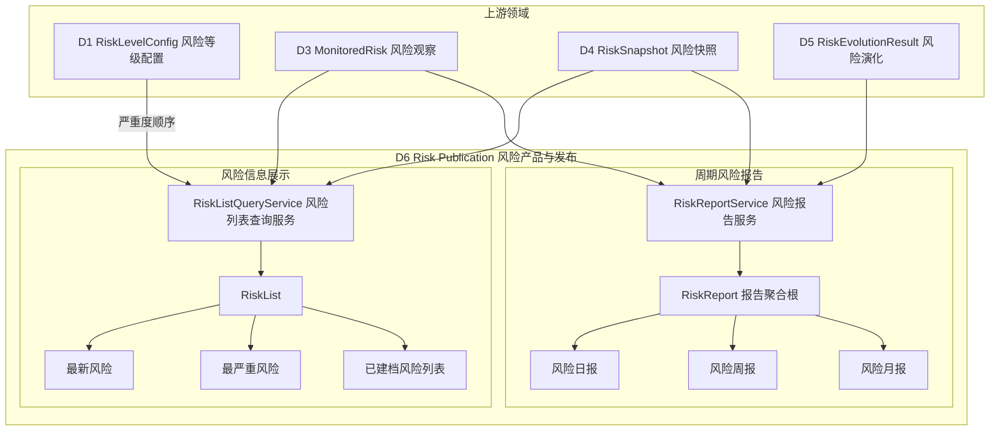
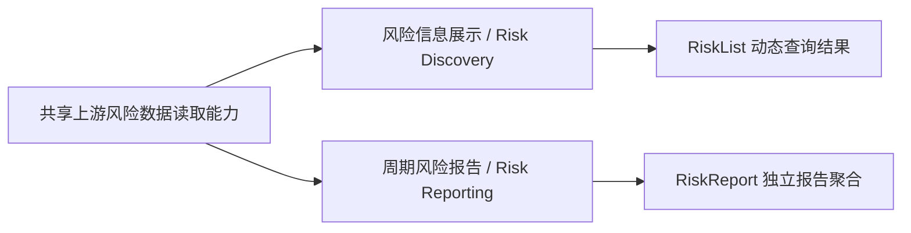
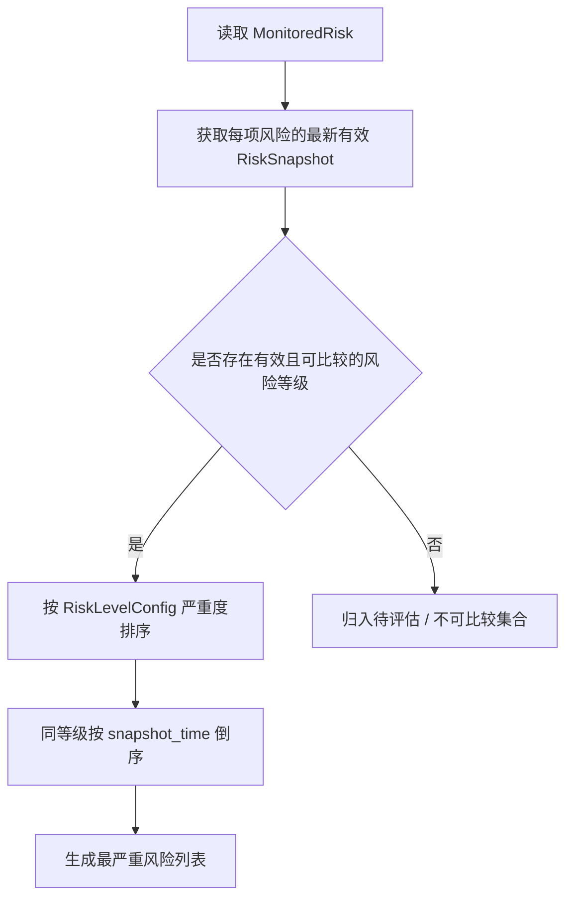
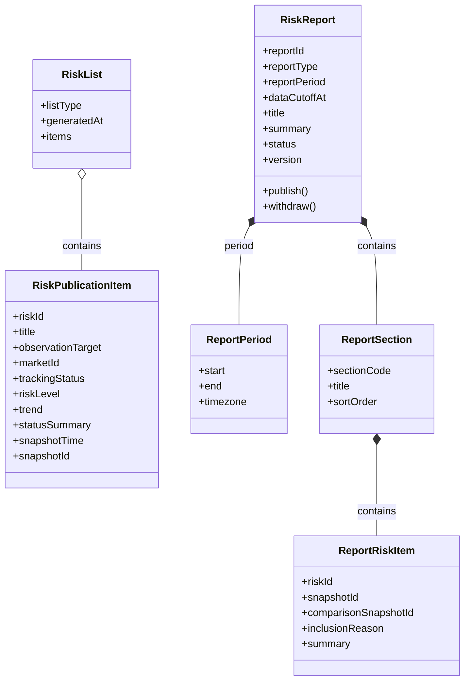

# D6 · 风险产品与发布 · 业务领域设计 V1.0

> **英文名称**：Risk Publication  
> **更新日期**：2026-10-08  
> **总览**：[[tools/RiskHot/02 RiskHot业务领域设计|RiskHot 业务领域总览]]  
> **整理依据**：[[sources/manual/RiskHot/2026-10-08-业务领域设计拆分前v2.2|拆分前业务领域设计 v2.2]]。V1.0 为独立分册版本；原有“已确认”“建议”“待细化”状态继续有效，模块与流程的结构归纳不代表新增设计已确认。
> **补充来源**：[[sources/manual/RiskHot/2026-10-08-D6业务领域设计V1.0.txt|用户提供的 D6 设计 V1.0]]。原稿图示按文字关系重建，无法确认的关系基数不补充。

**领域架构总览**

**领域核心职责：** 将风险观察、快照与演化结果组织为风险列表和周期报告，并管理报告内容发布。

## 1. 领域能力

### 1.1 领域定位与目标

D6 负责将 RiskHot 已建立的风险观察对象、风险状态快照和风险演化分析结果，组织为面向用户的风险信息产品。

D6 的核心职责包括：**风险信息组织、风险列表排序、周期报告生成和内容发布管理**。

D6 直接使用 D1～D5 已形成的风险知识和分析结果，不重复承担风险识别、变量评估、风险等级判断等上游职责。

### 1.2 领域职责与边界

D6 直接使用 D1～D5 已形成的知识和结果，不重复风险识别、变量评估和风险等级判断。V1 不包含市场影响力排名、传播热度计算或潜在市场冲击预测。风险列表动态查询，周期报告按独立身份与版本管理。

### 1.3 核心业务能力

确定保留六种产品输出：

| 产品 | 英文名称 | 核心业务含义 |
| --- | --- | --- |
| 最新风险 | Latest Risks | 最近完成风险状态评估的风险 |
| 最严重风险 | Highest Severity Risks | 当前有效风险等级最高的风险 |
| 已建档风险列表 | Risk Catalog | 系统已建立的全部风险观察对象 |
| 风险日报 | Daily Risk Report | 汇总每日重要风险状态与变化 |
| 风险周报 | Weekly Risk Report | 总结一周内风险的持续演化 |
| 风险月报 | Monthly Risk Report | 总结一个月的整体风险格局及主要变化 |

V1 暂不包含市场影响力排名、传播热度计算、潜在市场冲击预测等能力。

### 1.4 典型业务场景

**按已确认产品范围归纳：**

- 用户查看最近完成风险状态评估的风险。
- 用户按统一严重度比较当前风险，并识别待评估项。
- 用户查询全部已建档风险，包括无快照、暂停或结束跟踪对象。
- 用户阅读每日、每周、每月的风险状态与演化汇总。

## 2. 业务领域架构

### 2.1 业务模块划分

建议 D6 内部划分为两个业务能力模块：

| 业务模块 | 英文名称 | 负责解决的问题 |
| --- | --- | --- |
| 风险信息展示 | Risk Discovery | 用户如何找到最新、最严重及已建档风险？ |
| 周期风险报告 | Risk Reporting | 如何将多个风险的评估和演化结果汇总为日、周、月报？ |

两者共享风险数据读取能力，但数据管理方式不同：

- **风险列表**：基于 D3、D4 的最新有效数据动态生成，可使用缓存或查询投影。
- **风险报告**：每一期报告有独立的身份、周期、内容、版本和发布状态，需要建立完整领域聚合。

### 2.2 业务模块关系图

### 2.3 核心业务流程

**风险列表查询**

读取 MonitoredRisk 与最新有效 RiskSnapshot → 按列表类型筛选和排序 → 生成 RiskList 与 RiskPublicationItem；未产生快照的对象仍可出现在完整目录。

**最严重风险排序流程**

**周期报告〔流程归纳，细则待确认〕**

读取风险、快照及演化结果 → 组织报告周期、栏目和风险条目 → 形成 RiskReport → 管理版本及发布/撤回。具体周期划分、内容纳入与发布状态机尚未展开。

### 2.4 跨领域协作与输入输出契约

| 协作领域 | 输入/输出 | 业务契约 |
| --- | --- | --- |
| [[tools/RiskHot/02-D1 风险知识与规则业务领域设计\|D1 风险知识与规则]] | 输入 RiskLevelConfig | 严重度顺序统一可比较，D6 不重新评分 |
| [[tools/RiskHot/02-D3 风险观察与监测业务领域设计\|D3 风险观察与监测]] | 输入 MonitoredRisk | 读取风险身份、标题、观察对象、市场及跟踪状态 |
| [[tools/RiskHot/02-D4 风险状态评估业务领域设计\|D4 风险状态评估]] | 输入 RiskSnapshot 及历史判断引用 | 使用最新有效评估、截止时间及快照 ID；陈旧结果标记时效 |
| [[tools/RiskHot/02-D5 风险演化分析业务领域设计\|D5 风险演化分析]] | 输入 RiskEvolutionResult | 用于报告解释持续演化与变化原因 |
| 面向用户的产品输出 | RiskList、RiskReport | 三类列表及日/周/月报；报告条目保留风险与快照引用 |

### 2.5 AI 介入与分析任务

**AI-05 风险报告生成**：可用于组织周期报告内容；风险列表采用确定性查询与排序。

**分析产出：** 风险报告内容，纳入 RiskReport 聚合。

**校验：** 报告内容应与 D4、D5 的结论和证据一致；AI 不另行评定风险等级或自行定义发布规则；AI-06 负责分析结果校验，程序负责可确定的结构与关联检查。

统一处理契约为“输入数据 → 分析任务 → Prompt → 输出 Schema → 校验规则 → 数据持久化”。具体 Prompt、输入输出 Schema 和校验方式待详细设计。

## 3. 核心领域模型

### 3.1 领域对象设计

**统一领域语言**

风险展示条目是某项风险在当前查询条件下的只读信息；风险列表是派生查询结果；风险周期报告具有独立身份、周期、内容、版本和发布状态。

**领域对象清单与核心对象定义**

| 领域对象 | 中文名称 | 类型 | 作用 |
| --- | --- | --- | --- |
| `RiskPublicationItem` | 风险展示条目 | 只读模型 | 统一表示一条用于展示的风险信息 |
| `RiskList` | 风险列表 | 派生查询结果 | 根据查询规则生成三类风险列表 |
| `RiskReport` | 风险周期报告 | 聚合根 | 管理日报、周报、月报 |
| `ReportPeriod` | 报告周期 | 值对象 | 表示报告覆盖的时间区间 |
| `ReportSection` | 报告栏目 | 聚合内部实体 | 管理栏目分类和顺序 |
| `ReportRiskItem` | 报告风险条目 | 聚合内部实体 | 保存报告纳入的具体风险及判断引用 |

V1 不建立独立 `RiskRanking` 对象。最新风险、最严重风险均可根据时间和风险等级进行确定性排序，采用统一的 `RiskList` 查询结果模型即可。

**RiskPublicationItem：风险展示条目**

**定义：** 一条记录代表某个已建档风险在当前查询条件下的展示信息。

| 属性 | 业务含义 | 数据来源 |
| --- | --- | --- |
| `riskId` | 风险唯一标识 | D3 `MonitoredRisk` |
| `title` | 风险名称 | D3 |
| `observationTarget` | 风险观察对象 | D3 |
| `marketId` | 所属市场 | D3 |
| `trackingStatus` | 观察中、监控中、暂停、结束 | D3 |
| `riskLevel` | 最新有效风险等级 | D4 |
| `trend` | 加剧、稳定、缓和或待判断 | D4 |
| `statusSummary` | 当前风险状态说明 | D4 |
| `snapshotTime` | 最新有效评估的截止时间 | D4 |
| `snapshotId` | 对应快照 ID | D4 |

这些信息来自上游领域。D6 不另行维护风险等级和风险状态。展示模型使用原稿中的 camelCase 属性名；下文 `snapshot_time`、`risk_level` 对应上游 `RiskSnapshot` 的既有字段。

**对象关系图与其余核心对象属性**

图中属性用于明确领域语义。是否对应数据库字段，以及各内部对象是否拆表，在数据详细设计阶段决定。

### 3.2 聚合与领域行为

**聚合根、实体、值对象**

- RiskReport：报告聚合根，统一管理日报、周报、月报。
- ReportPeriod：表示时间范围与时区的值对象。
- ReportSection、ReportRiskItem：报告聚合内部实体。
- RiskPublicationItem：只读模型；RiskList：派生查询结果，不作为独立排名聚合。

**聚合边界与关系**

每期报告管理自己的身份、周期、内容、版本和发布状态。ReportRiskItem 保存 riskId、snapshotId、comparisonSnapshotId、纳入原因与摘要；风险与快照本体归上游领域，D6 不重复维护其状态。

**领域行为与领域服务**

- RiskListQueryService：按规则生成三类风险列表。
- RiskReportService：组织周期报告。
- RiskReport 的 publish()、withdraw() 表示发布与撤回行为；具体前置条件、状态迁移与版本规则待细化。

### 3.3 业务规则与生命周期

**业务规则与不变量**

**三种风险列表业务规则**

**A. 最新风险（Latest Risks）**

按最近一次有效评估的 `snapshot_time` 倒序，展示最近更新风险状态的观察对象。

一个风险只展示一条最新有效快照；尚无快照的风险不参与排序。这里的“最新”指风险评估更新，与首次建档时间区分。

**B. 最严重风险（Highest Severity Risks）**

根据风险当前有效快照的 `risk_level`，按 D1 `RiskLevelConfig`（原有配置名 `risk_level_config`）定义的严重程度顺序排列。

同等级按照 `snapshot_time` 倒序。等级为空或无法比较的风险单独标记为待评估，不参与严重程度排序。

**C. 已建档风险列表（Risk Catalog）**

展示系统全部已创建的 `MonitoredRisk`，包含观察中、监控中、暂停跟踪和结束跟踪的对象。

支持按市场、风险源、风险维度、跟踪状态、风险等级筛选。未产生快照的风险仍可出现在目录中。

**最严重风险排序原则**

排序原则：

1. 风险等级以 D4 的研判结果为准。
2. 严重度顺序来自 D1 `RiskLevelConfig`，D6 不重新评分。
3. 相同等级按照最新快照时间排序，必要时使用风险 ID 保证顺序稳定。
4. `paused`、`closed` 等跟踪状态应显式处理。**V1 建议**默认榜单只纳入 `observing`、`monitoring`；暂停和结束跟踪的记录仍可在完整风险目录中查看。
5. 过于陈旧的快照需要标注评估时间和数据时效，不能仅因历史等级高就被展示为最新判断。

**重要前提：** 如果不同 `MonitoredRisk` 使用不同的 `Ruleset`，必须首先确保其风险等级具有统一、可比较的严重度口径。不能直接按照互不兼容的自定义等级排序。

BR-13～BR-16 分别约束上游判断复用、最新快照选择、排序与状态过滤、列表与报告的数据管理边界。

**状态及生命周期**

RiskList 基于查询动态生成，可使用缓存或投影；RiskReport 具备 status、version、publish()、withdraw() 语义，但状态枚举、发布/撤回迁移、版本修订与报告生成细则尚未确认。原稿止于最严重风险排序规则，不据此补成完整报告状态机。

**领域事件〔待细化〕**

当前设计尚未确认正式领域事件名称、载荷、触发时机与投递语义。业务行为不直接等同于已定义的领域事件。

**数据归属与版本约束**

D3、D4 维护风险及判断；D6 维护报告身份、周期、dataCutoffAt、内容、版本和发布状态。图中属性用于明确领域语义，不直接确定数据库字段。缓存/投影、报告持久化、拆表、索引与版本引用策略均待数据详细设计。
