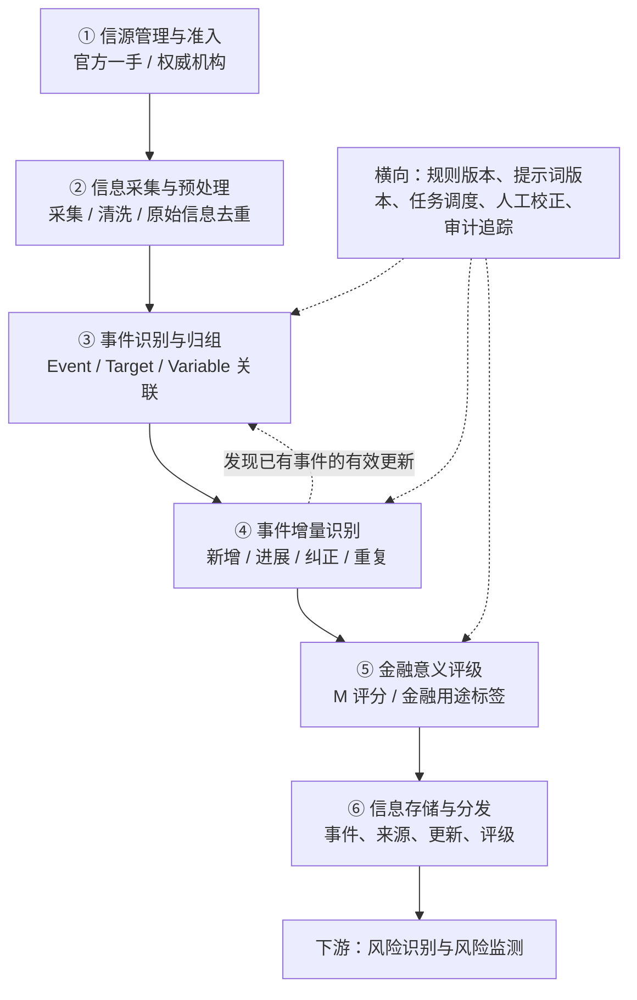
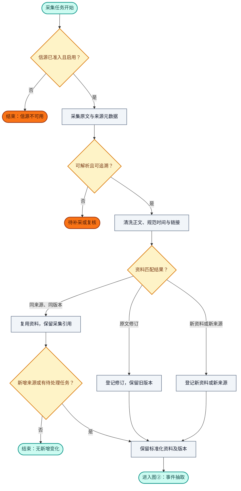
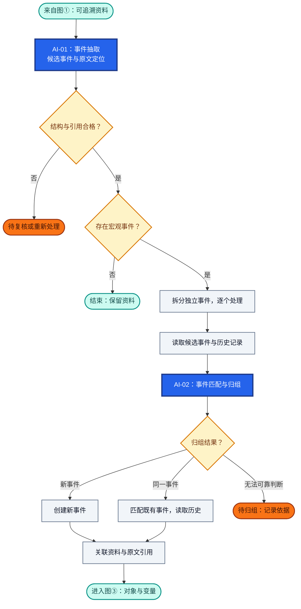
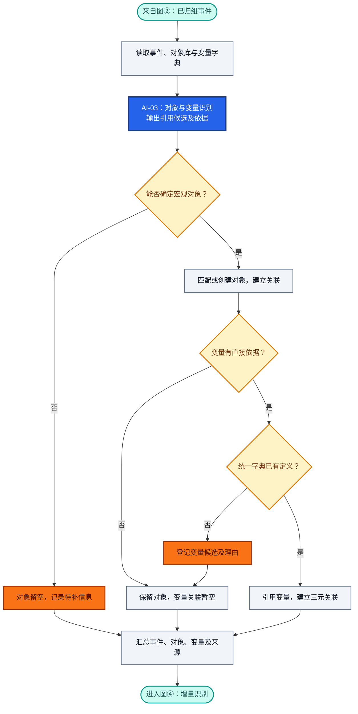
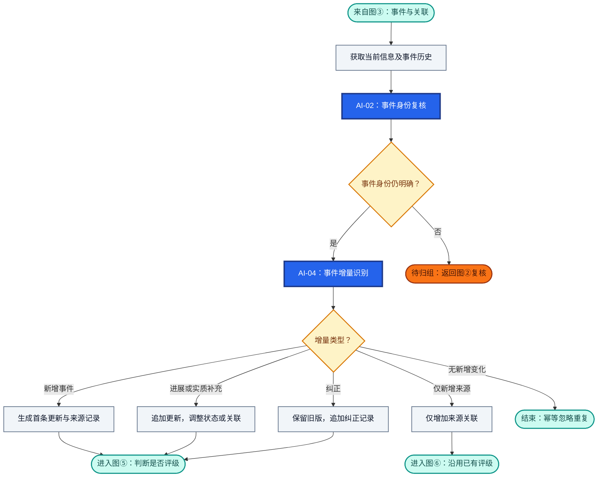
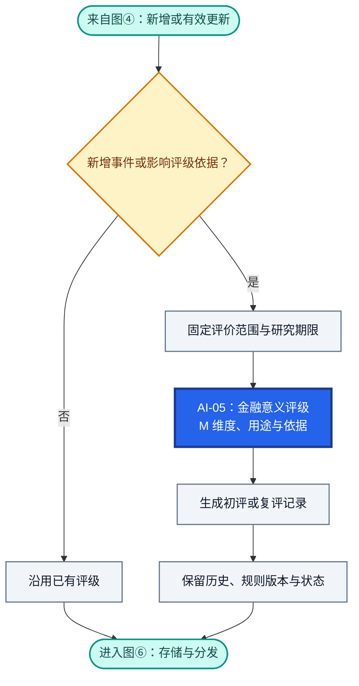
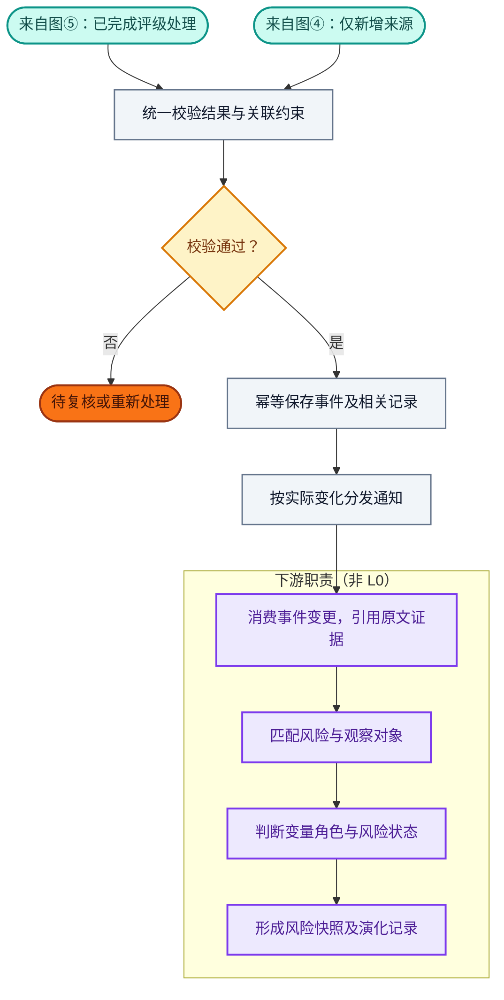
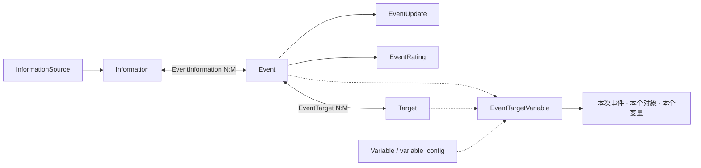

# RiskHot L0 信息处理层：业务架构与领域设计

> **文档版本**：V1.0（2026-10-09 讨论整合版）  
> **设计范围**：RiskHot / L0 信息处理层 / 宏观领域  
> **文档性质**：业务架构与领域设计草案，可用于后续详细设计  
> **设计基线**：以本轮确认的 Event、Target、Variable、`event_target_variable` 方案为准。  
> **说明**：评分模型中的具体权重尚待验证，不把方案性参数视为已经通过的业务决策。

## 1. 业务能力与职责设计

### 1.1 业务定位与总体职责

L0 将来自可信信源的宏观资讯转化为**可追溯、可归组、可更新、可评级、可供后续风险分析使用的事件（Event）**。

L0 对信息的来源可追溯、事件身份与阶段表达、作用对象和变量引用、事件变化记录及金融意义评价负责，并向下游交付稳定的事件、对象和变量标识以及原文引用链。

原始资料以 Information 管理，结构化事件以 Event 管理；同一资料可以包含多个事件，同一事件也可以持续关联多份资料。各项能力围绕事件持续积累来源、更新与评级，支撑后续风险识别和观测。

### 1.2 核心业务能力与责任

| 业务能力 | 回答的业务问题 | L0 承担的责任 | 主要交付结果 |
|---|---|---|---|
| 信源管理与准入 | 信息从哪里来，哪些来源可以使用？ | 管理官方与权威信源的准入、启停和采集范围；维护来源身份及可选信用 S，保留原始发布主体 | 可用信源及准入配置（InformationSource） |
| 信息采集与预处理 | 如何将不同来源的资料变为可追溯输入？ | 采集和清洗原文，规范链接与时间，处理资料重复与原文修订，保留来源元数据和正文版本 | 标准化原始资料及版本记录（Information） |
| 事件识别与归组 | 发生了什么，是否属于同一事件，作用于什么？ | 识别宏观事件的主体、行为、状态与时间；判断新事件或既有事件；关联宏观 Target 与有直接依据的统一 Variable，保留原文定位和待确认项 | Event、EventInformation、EventTarget、EventTargetVariable |
| 事件增量识别 | 相比既有记录，出现了什么新变化？ | 区分新增、进展、实质补充、来源增加、纠正与重复；维护事件状态和变化历史，避免重复生成业务进展 | 增量类型、EventUpdate 及来源变化记录 |
| 金融意义评级 | 事件对指定宏观观察范围有什么金融意义？ | 在明确评价范围和研究期限下给出 M 维度评价、金融用途标签与依据；按需复评，保留规则版本和历史评级 | 金融意义评价与用途标签（EventRating） |
| 信息存储与分发 | 下游怎样稳定引用和持续跟踪事件？ | 校验标识与关联约束，幂等保存事件及其来源、更新、评级；提供检索和变更通知，保留历史引用 | 可检索的结构化事件、稳定 ID、来源链和事件变更通知 |

**横向质量与追溯职责**：各项能力共同保留规则、提示词及模型版本、原文引用和处理记录；通过任务调度、结构校验、人工校正与审计追踪支持复核和重新处理。对象、变量或归组关系无法可靠判断时，保留空值或待确认状态，不编造引用或强行合并。

能力清单定义 L0 持续承担的业务责任；第 2 章进一步说明这些能力如何组成处理流程。

### 1.3 六个业务环节职责

| 编号 | 业务环节 | 输入 | 核心处理 | 输出 |
|---|---|---|---|---|
| 01 | 信源管理与准入 | 官方站点、机构清单、采集规则 | 来源资质与范围管理、准入、启停、信源信用 S（可选维护） | `InformationSource` |
| 02 | 信息采集与预处理 | 可用信源 | 增量采集、抽取正文、统一时间和链接、资料级去重 | `Information` |
| 03 | 事件识别与归组 | Information、已有 Event、Target、Variable 字典 | 提取事件、判断同事件、匹配／创建 Target、引用 Variable | Event、EventInformation、EventTarget、EventTargetVariable |
| 04 | 事件增量识别 | 当前信息、事件既有状态及更新历史 | 判断新事件、事件进展、新佐证、纠正或纯重复 | EventUpdate、增量类型 |
| 05 | 金融意义评级 | Event、作用对象、涉及变量、增量信息 | 识别金融关联、给出 M 维度评价、金融用途分类 | EventRating |
| 06 | 信息存储与分发 | 上述全部结构化结果 | 幂等入库、关联约束、版本保留、事件订阅与检索 | 持久化 Event 及对下游的事件变更通知 |

### 1.4 首版职责覆盖范围

| 维度 | L0 V1 范围 |
|---|---|
| 领域 | **宏观**：经济体、宏观政策主体、金融系统、主要金融市场、宏观经济部门 |
| 信源 | 第一手官方信息、官方公开数据、权威机构公开研究与报告 |
| 信息粒度 | Information（原始资料）与 Event（结构化事件）分别管理 |
| 事件形态 | 已发生、正在推进、已宣布、计划或预期的宏观事件；使用事件状态表达阶段 |
| 变量 | 共用全局 `variable_config`，按具体事件建立事件—对象—变量关联 |
| 评级 | 金融意义 M；投资／融资／投机等金融用途标签，可多选 |
| 演进 | 同一事件的新增报道、进展、实施、纠正与状态变化 |
| 交付 | 向后续风险识别、风险变量分析、风险快照与演化分析提供结构化输入 |

### 1.5 上下游职责分工

上游信源提供原始公告、数据、研究与报告；L0 负责来源准入、资料接入及结构化处理。下游以 L0 交付的事件、对象、变量和原文证据为输入，承担风险识别、风险判断与持续观测职责。

| 层次 | 关注点 | 核心产物 |
|---|---|---|
| L0 信息处理层 | 可信信息、事件、作用对象、变量引用、增量、金融意义 | Event、EventUpdate、EventRating、关联关系 |
| 下游风险识别层 | 哪项风险受到新事件触发或影响，为什么 | 风险匹配、风险源与变量关系 |
| 下游风险观测层 | 哪些观测值变化，风险现处于何种状态 | 变量证据、风险快照、风险演化轨迹 |

> 重要区分：Event 的 Target 是**事件所作用的宏观对象**；`risk.observation_target` 是**某项风险判断针对的观察对象**。两者在含义和范围一致时可映射，但不自动视为同一个业务身份。

### 1.6 职责边界与暂不承担事项

- 不对每条资料进行独立的事实可信度 C 打分，不开展逐条事实核验工作流；原文定位和来源关联仍须保留。
- 不强制将原始信息拆成“事实”和“预测”两条业务流水线；通过事件状态、时间类型和描述保留阶段差异。
- 不设置独立处理优先级 P 评分。首版展示或研究排序可先参考 M 和是否存在有效增量。
- 不在 L0 形成风险等级、风险方向、风险传导结论、投资建议或交易决策。
- 不创建企业、行业和单项资产的独立微观 Target；这类内容只有在服务宏观事件描述时作为文本上下文保留。
- 不为 Target 预配置固定 Variable 集合；仅记录**某次 Event 在某个 Target 上关联的 Variable**。
- 不单独创建通用 Entity 领域模型；事件主体在 Event 中表达，跨事件作用对象由 Target 独立管理。

## 2. 业务架构设计

### 2.1 L0 总体业务流程



> 六个环节是业务职责划分，部署时允许通过不同任务、异步队列或同一服务执行；流程不要求每个环节对应独立微服务。

### 2.2 业务流程图（详细版，带阶段）

全局处理顺序见第 2.1 节。以下拆成六张详图，图内圆角节点标明入口、出口或暂停状态；“图①—图⑥”为阅读编号，与第 1.3 节的业务环节对应关系如下。

| 详图 | 处理内容 | 对应业务环节 |
|---|---|---|
| 图① | 信源准入与信息预处理 | 01 信源管理与准入、02 信息采集与预处理 |
| 图② | 事件抽取与归组 | 03 事件识别与归组：确定事件身份 |
| 图③ | 对象与变量关联 | 03 事件识别与归组：关联 Target、Variable |
| 图④ | 事件增量识别 | 04 事件增量识别 |
| 图⑤ | 金融意义评级 | 05 金融意义评级 |
| 图⑥ | 存储分发与下游衔接 | 06 信息存储与分发，并标明下游职责 |

**颜色图例**：蓝底白字＝AI 分析任务；灰色＝程序处理；浅黄＝规则校验与结果分支；橙色＝不可用、待补采、待复核或待审核；青绿＝入口、出口与正常结束；紫色＝下游职责。

**AI 编号口径**：沿用第 5.1 节的统一任务编号。同一任务跨图复用时保持编号一致；图④中的事件身份复核复用 AI-02，事件增量识别使用 AI-04。图①和图⑥的 L0 步骤属于程序处理，不新增 AI 任务；下游 AI 任务不在本节定义。

#### 2.2.1 图①：信源准入与信息预处理



**处理口径**：准入检查读取白名单、来源资质与采集配置，引用 InformationSource 的准入档位和可选 S 分。采集保留正文、附件、原始出处、发布时间与抓取时间；按来源标识、URL 与内容指纹判重。不同来源的同内容材料仍保留来源关系，形成可追溯的 Information 及版本记录。

#### 2.2.2 图②：事件抽取与归组



**AI 与程序分工**：AI-01 输出事件候选和原文定位，AI-02 输出归组建议及理由；程序检查字段、引用、ID 和归组阈值，再按结果分支创建或匹配事件，不合格结果进入复核。

**处理口径**：抽取保留主体、行为、事件状态和时间语义。归组同时比较主体、行为、作用对象、时间范围及政策或行动标识；新事件标记 `NEW_EVENT`，既有事件读取状态、来源与更新历史，无法判断时记录 `UNRESOLVED` 并保留待归组任务，禁止强行合并。资料关系使用 EventInformation，保存原文位置。

**多事件处理**：一份 Information 可以关联多个 Event。自本图拆分后，各事件独立完成图③—图⑥；某个事件待复核或无增量，不阻断其他事件。

#### 2.2.3 图③：对象与变量关联



**AI 与程序分工**：AI-03 输出对象、变量候选与直接引用依据；程序检查对象范围、变量定义是否存在及关系约束，再建立关联或登记待审核项。

**处理口径**：Target 按宏观对象范围规则匹配或创建，关系记为 EventTarget；无法确定对象时仍保留 Event 与来源。变量引用全局 `variable_config`，三元关系使用 `event_target_variable(event_id, target_id, variable_id)`。变量候选未经审核不填写虚假 ID；缺少直接依据时保留 EventTarget、允许三元关联为空，不推测后续传导变量。

#### 2.2.4 图④：事件增量识别



**AI 与程序分工**：AI-02 根据本轮信息复核事件身份；身份明确后，AI-04 对比事件历史，输出增量类型、变更说明与状态变化。程序校验结果并按类型生成更新或来源记录；身份无法确认时返回图②待归组。

**增量与动作**：

| 增量类型 | 记录要求 |
|---|---|
| `NEW_EVENT` | 生成首条 EventUpdate 与来源记录 |
| `EVENT_PROGRESS` / `MATERIAL_ADDITION` | 追加 EventUpdate，按需更新事件状态和对象、变量关联 |
| `CORRECTION` | 保留旧版本，追加纠正记录并更新事件描述 |
| `SOURCE_ADDITION` | 仅增加来源关联，不记为实质业务进展，沿用已有评级 |
| `DUPLICATE` | 幂等忽略，不重复生成更新或发布通知 |
| `UNRESOLVED` | 新证据使事件身份存疑时，记录判断依据，保留待归组任务并返回图②复核 |

#### 2.2.5 图⑤：金融意义评级



**AI 与程序分工**：程序结合新增事件标记、增量结果及评级规则判断是否初评或复评，准备评价范围和期限；AI-05 输出 M 维度判断、用途标签与依据，程序保留评级记录与版本，并在图⑥完成统一校验。

**评级口径**：评价范围使用 `assessment_scope`，金融用途包括投资、融资、投机／情绪，允许多标签及无法判断状态，结果记录为 EventRating。M 权重尚待验证，规则未定时总分允许为空，保留维度评价与草案状态。纯来源增加由图④直接进入图⑥；M 不代表风险等级、风险方向或投资收益概率。

#### 2.2.6 图⑥：存储分发与下游衔接



**校验与存储**：检查结构化结果、ID、关联约束、时间语义、状态及更新幂等性；保存 Event、来源关系、对象与变量关联、EventUpdate、EventRating，并保留原文版本、规则／提示词／模型版本及审计轨迹。前述图中的事件创建、关系变更和更新记录在此统一校验并持久化，Information 原文及版本在图①预处理时保留。

**通知按实际变化产生**：

| 业务通知 | 适用变化 |
|---|---|
| `event_created` | 新增事件 |
| `event_updated` | 事件进展、作用变量或状态发生有效变化 |
| `event_rating_updated` | 金融意义评价或用途标签更新 |
| `event_source_attached` | 仅新增来源关联，不发布为实质事件进展 |

**复核与下游边界**：复核完成后回到对应处理步骤；归组调整保留合并／拆分审计。下游引用 Event、Target、Variable 与原文证据，自行判断风险方向、传导关系和变量角色，并形成风险判断、快照与演化记录。

## 3. 业务规则设计

### 3.1 信源准入与原文可追溯

1. 首版建立信源白名单：中央银行、财政与统计部门、监管机构、正式政府公告和权威国际／研究机构等。
2. 信源可信程度在**信源管理**中维护，可使用准入档位及可选 S 分；每次事件分析引用既有信源标识，不重复计算发布者的长期信用。
3. 采集必须记录来源 ID、原始 URL／资料标识、标题、发布时间、抓取时间及正文版本。
4. 对转载材料记录原始发文主体和转载主体；能识别原始出处时优先引用原始文本。
5. 对 AI 抽取或概述的具体结论保存其对应的原始信息 ID 与证据片段位置。此规则属于**溯源与结构化质量保障**，不构成逐条事实核验评级。

### 3.2 Event 定义与识别边界

**Event 定义**：在明确时间语境下，由特定宏观主体发起或体现、包含相对完整的行为、决定或状态变化，并能被持续追踪的事件单元。

基础判断要素：**主体 Subject + 行为／变化 Action + 时间 Time**；Target 与 Variable 为后续归组、分析提供稳定引用。

- 同一核心行为在不同报道中的描述，应归入同一 Event。
- 同一主体于不同时点做出的相互独立决定，通常建立不同 Event。
- “宣布—推进—实施—完成”等属于同一政策或行动生命周期的连续进展时，以 EventUpdate 体现；发生明确独立决定或新的政策措施时，建立新 Event 并可记录关联。
- Event 允许描述预期或计划中的具体变化；必须保留 `event_status` 与时间语义，以免把预计日期解释为已经执行的日期。
- 一篇汇总材料可能识别多个 Event；仅凭标题主题、发布机构相同、关键词相似，不能直接合并事件。

### 3.3 Target 定义与边界

**Target 定义**：能够被多个宏观 Event 共同作用、具有稳定身份和范围边界的经济金融对象。

首版支持的 Target 类型：

| `target_type` | 范围 | 示例 |
|---|---|---|
| `economy` | 经济体 | 中国经济、美国经济 |
| `macro_institution` | 宏观政策主体 | 中国人民银行、美国联邦政府 |
| `financial_system` | 金融体系 | 中国银行体系 |
| `financial_market` | 金融市场 | 中国银行间货币市场、中国国债市场 |
| `economic_sector` | 宏观经济部门 | 中国居民部门、中国政府部门 |

稳定身份至少由**名称／代码、国家或辖区、对象类型、范围说明**共同确定。不同口径或不同辖区应分别建 Target。

Target 可以出现在多个事件中；同一事件也可作用于多个 Target。事件发起主体保存在 Event 的 `subject_name` 等字段中，只有当它同时构成作用对象时，才将其纳入 EventTarget。

### 3.4 Variable 定义与事件关联

Variable 使用全局变量定义库 `variable_config`，沿用统一的 `variable_id`、名称、定义、单位和解释口径。**不设置 `variable_config.target_id` 归属字段**。

事件涉及的变量由 `event_target_variable(event_id, target_id, variable_id)` 记录：

- `event_id`：哪次事件。
- `target_id`：事件对哪个宏观对象起作用。
- `variable_id`：此次事件具体涉及哪个统一变量。

L0 优先提取**事件直接涉及、宣布改变或有来源记录发生变化的变量**；融资成本、信用扩张、资产估值等后续传导变量由下游风险分析判断。缺少直接依据时可留空。

### 3.5 事件归组与增量规则

事件归组须同时比较**主体、行为、作用对象、时间范围、政策或行动标识**。建议输出下列判断：

| 分类 | 定义 | 系统动作 |
|---|---|---|
| `NEW_EVENT` | 可独立识别的新事件 | 创建 Event |
| `EVENT_PROGRESS` | 同一事件出现实施、结果或状态推进 | 追加 EventUpdate，必要时调整 Event |
| `MATERIAL_ADDITION` | 同一事件新增关键数字、范围或影响条件 | 追加 EventUpdate，必要时复评 M |
| `SOURCE_ADDITION` | 同一事件出现新来源，无实质业务内容变化 | 增加来源关联，通常无需复评 |
| `DUPLICATE` | 已有相同资料或重复内容 | 幂等忽略重复输入 |
| `CORRECTION` | 原来源更新或纠正先前内容 | 保留旧版本，写入纠正记录并更新事件描述 |
| `UNRESOLVED` | 不能可靠区分新事件与既有事件 | 保留待归组任务，禁止强行合并 |

归组与增量之间存在双向反馈：归组确定事件身份，增量判定负责更新事件历史；出现新证据时可重新归组，并记录合并／拆分审计。

### 3.6 金融意义 M 及金融用途

**金融意义 M 的目标**：衡量 Event 在指定宏观观察范围内，对关键金融变量、资源配置、经济运行约束或资产定价条件的潜在重要程度。评价时须固定 `assessment_scope` 和研究期限。

目前已确认：**保留 M 为 L0 的核心评分，并保留金融用途标签**。五维权重尚未由历史数据或文章原文提供直接量化依据，以下仅为**候选评分方案**：

| 候选维度 | 候选权重 | 判断内容 |
|---|---:|---|
| B：底层变量关联 | 30% | 是否涉及重要货币、信用、财政、供需或其他基础约束 |
| D：影响程度 | 25% | 对所观察宏观对象的作用可能有多大 |
| T：持续时间 | 20% | 影响预计持续多久 |
| W：影响范围 | 15% | 覆盖多少关键市场、部门或金融环节 |
| L：作用落地 | 10% | 从计划、宣布、执行到可观察结果推进到何种阶段 |

若以上候选方案被确认，0—5 分的计算表达式为：

`M = 6×B + 5×D + 4×T + 3×W + 2×L`（总分 0—100）。

在权重确认前，系统应支持存储各维度评价、评分规则版本与说明；正式等级门槛继续留为配置项。**原文强调重视底层信息及投资／融资／投机区分；这五个维度和比例属于后续工程化提案。**

金融用途标签：`investment`（投资判断）、`financing`（融资活动）、`speculation_sentiment`（投机／情绪观察）；允许多标签及无法判断状态。**金融用途类别不自动决定 M 的高低。**

L0 的 M 是信息研究重要性，不能直接理解为风险严重程度、行情涨跌幅或投资收益概率。

## 4. 核心领域模型

### 4.1 领域关系总览



### 4.2 领域对象说明

| 领域对象 | 角色 | 主要业务责任 | 生命周期特征 |
|---|---|---|---|
| `InformationSource` | 信源实体 | 维护可靠来源、准入、分类与采集设置 | 跨多条 Information 复用 |
| `Information` | 原始资料实体 | 保存原文、出处和版本 | 一份材料可关联多个 Event |
| **`Event`** | **核心事件实体／聚合根** | 描述宏观变化、管理事件身份、状态与更新 | 被多次信息采集持续更新 |
| **`Target`** | **独立领域实体** | 提供跨事件复用的宏观作用对象身份与边界 | 与具体 Event 独立存在 |
| **`Variable`** | **全局变量定义** | 提供共享变量 ID、定义及口径 | 可被多个事件和下游风险模型引用 |
| `EventInformation` | 关联对象 | 记录材料与事件的对应关系、引用方式 | 跨事件多对多 |
| `EventTarget` | 关联对象 | 记录事件直接作用的宏观对象 | 跨事件多对多 |
| **`EventTargetVariable`** | **三元关联对象** | 记录本次事件涉及的具体对象与变量 | 随事件识别／更新而变化 |
| `EventUpdate` | 事件更新记录 | 保存新增变化、阶段推进和纠正历史 | 同一 Event 可产生多条 |
| `EventRating` | 评级记录 | 保存 M、用途标签、评估范围与规则版本 | 允许随着事件进展复评并留历史 |

### 4.3 核心关系基数

- 一条 Information 可以关联 **0..N** 个 Event；一个 Event 可以关联 **1..N** 条 Information（建事件时至少需要一个可追溯来源）。
- 一个 Event 可以关联 **0..N** 个 Target；一个 Target 可被 **0..N** 个 Event 引用。
- 一条 `event_target_variable` 唯一指明 **一组 Event + Target + Variable**；同一个 Variable 可出现在不同 Event、不同 Target 的关系中。
- Event 与 Variable 之间**没有固定直接归属**，Target 与 Variable 之间**没有固定静态归属**。
- EventUpdate、EventRating 由 Event 关联；修改 Event 的状态或说明不应删除历史更新与既有评级。

### 4.4 为什么保留 EventTarget

`event_target` 表示“该事件作用于这个宏观对象”；`event_target_variable` 进一步表示“本次事件在该对象上涉及哪个变量”。

当能够确定影响对象、暂时无法确定具体变量时，前者仍具有独立业务价值；后者允许为空。若将来数据稳定证明每个 EventTarget 都必定有变量，可评估合并存储，当前版本保留二者。

### 4.5 建议逻辑数据结构

> 下表为**建议的逻辑存储结构**。字段长度、数据类型和索引以数据库详细设计为准；既有 RiskHot 变量定义表沿用 `variable_config`，避免另建等价字典。

#### 4.5.1 `information_source`：信源

| 字段 | 建议类型 | 说明 |
|---|---|---|
| `source_id` | UUID / PK | 信源唯一标识 |
| `source_code` | VARCHAR / UNIQUE | 稳定编码 |
| `source_name` | VARCHAR | 发布机构或站点名称 |
| `source_type` | ENUM | 官方一手、权威机构等 |
| `official_url` | TEXT | 来源定位地址 |
| `admission_status` | ENUM | 已准入、暂停、停用 |
| `source_credit_score` | NUMERIC / NULL | 可选 S 信用分，仅由信源管理维护 |
| `created_at`, `updated_at` | TIMESTAMPTZ | 审计时间 |

#### 4.5.2 `information`：原始资料

| 字段 | 建议类型 | 说明 |
|---|---|---|
| `information_id` | UUID / PK | 信息 ID |
| `source_id` | FK | 来源信源 |
| `external_id` | VARCHAR / NULL | 来源侧原文 ID |
| `canonical_url` | TEXT / NULL | 规范原始链接 |
| `title` | TEXT | 原始标题 |
| `content` | TEXT | 清洗后正文或结构化原文 |
| `published_at` | TIMESTAMPTZ / NULL | 原始发布时间 |
| `collected_at` | TIMESTAMPTZ | 采集时间 |
| `content_hash` | VARCHAR | 内容指纹 |
| `raw_metadata` | JSONB | 来源特殊字段与原始资料版本定位 |

**唯一性建议**：优先按 `(source_id, external_id)`，其次使用规范 URL 和内容指纹识别资料级重复；发布时间未知应保持空值，不以抓取时间代替。

#### 4.5.3 `event`：事件主表

| 字段 | 建议类型 | 说明 |
|---|---|---|
| `event_id` | UUID / PK | 事件稳定 ID |
| `title` | VARCHAR(300) | 简明事件标题 |
| `description` | TEXT | 事件核心变化与范围 |
| `event_type` | VARCHAR | 货币政策、财政政策、宏观经济指标、金融市场变化等 |
| `subject_name` | VARCHAR | 行为发起者／变化主体名称 |
| `subject_type` | VARCHAR / NULL | 央行、政府、统计部门、市场整体等 |
| `action_code` | VARCHAR | 下调、上调、发布、实施、变化、违约等 |
| `event_status` | ENUM | `expected` / `announced` / `in_progress` / `effective` / `completed` / `cancelled` / `unknown` |
| `event_time` | TIMESTAMPTZ / NULL | 事件主要时间（精度不足允许空或附加年月值） |
| `event_time_kind` | ENUM | 实际发生、宣布、预计、实施等时间语义 |
| `event_time_precision` | ENUM | 日、月、季度、年或未知 |
| `first_seen_at` | TIMESTAMPTZ | 首次识别时间 |
| `updated_at` | TIMESTAMPTZ | 最近资料修改时间 |

`event_time` 只表示主要时间轴定位；公告日、预期生效日和真实执行日可以记录于更新记录或扩展时间字段，防止混为同一天。

#### 4.5.4 `target`：宏观作用对象

| 字段 | 建议类型 | 说明 |
|---|---|---|
| `target_id` | UUID / PK | 对象稳定 ID |
| `target_code` | VARCHAR / UNIQUE | 稳定业务编码，例如 `CN_INTERBANK_MARKET` |
| `target_name` | VARCHAR | 对象名称 |
| `target_type` | ENUM | 经济体、宏观机构、金融系统、金融市场、经济部门 |
| `jurisdiction` | VARCHAR | 国家／辖区 |
| `scope_definition` | TEXT | 明确包含范围与边界 |
| `parent_target_id` | FK / NULL | 可选层级关联，当前不要求建立完整树 |
| `is_active` | BOOLEAN | 是否可被新增事件引用 |

**没有 `target.variable_ids` 或静态 TargetVariable 表**。对象与变量的对应关系在具体 Event 的上下文中解释。

#### 4.5.5 `variable_config`：统一变量字典（沿用既有配置）

| 字段 | 说明 |
|---|---|
| `variable_id` | 全局稳定变量 ID，既有配置主键 |
| `variable_code` | 稳定语义编码（建议保留） |
| `variable_name` | 变量名称 |
| `definition` | 变量定义、观测边界与解释口径 |
| `unit` | 量纲或单位，若变量为状态项可以为空 |
| `status` | 启用状态，必要时维护 |

L0 对变量的处理为**优先匹配现有定义 → 未匹配时生成候选 → 审核后入库**，避免 AI 自动制造大量近义变量。

#### 4.5.6 `event_information`：事件与信息关联

| 字段 | 建议类型 | 说明 |
|---|---|---|
| `event_id` | FK | 事件 |
| `information_id` | FK | 原始资料 |
| `information_role` | ENUM | 初始来源、补充信息、进展来源、纠正来源 |
| `evidence_locator` | TEXT / JSONB / NULL | 原文段落、页码或数据区块定位 |

建议联合主键 `(event_id, information_id)`。

#### 4.5.7 `event_target`：事件与作用对象关联

| 字段 | 建议类型 | 说明 |
|---|---|---|
| `event_id` | FK | 事件 |
| `target_id` | FK | 宏观对象 |
| `relation_note` | TEXT / NULL | 事件如何作用于该对象的简述 |

**联合主键**：`(event_id, target_id)`。

#### 4.5.8 `event_target_variable`：事件—对象—变量三元关联

| 字段 | 建议类型 | 说明 |
|---|---|---|
| **`event_id`** | **FK** | **具体事件** |
| **`target_id`** | **FK** | **该事件的具体作用对象** |
| **`variable_id`** | **FK** | **本次事件涉及的统一变量** |
| `relation_type` | ENUM / NULL | 直接改变、宣布调整、已观察变化等 |
| `change_direction` | ENUM / NULL | 上升、下降、不变、未知；只记录有依据的方向 |
| `impact_status` | ENUM / NULL | 预计、已宣布、执行中、已有观测结果 |
| `description` | TEXT / NULL | 变量关联及具体变化说明 |
| `information_id` | FK / NULL | 对应支持本条关联的原始材料 |
| `created_at` | TIMESTAMPTZ | 建立时间 |

**联合主键**：`(event_id, target_id, variable_id)`。

**一致性约束**：

1. 外键 `(event_id, target_id)` 引用 `event_target(event_id, target_id)`。
2. `variable_id` 引用全局 `variable_config(variable_id)`。
3. `information_id` 如填写，应已关联此 Event；可用应用层校验，或通过复合外键实现。
4. 不要求 `(target_id, variable_id)` 在单独配置表中存在；这是本轮设计的明确结论。
5. 事件影响的具体数值与未来风险作用可在后续证据、指标或风险分析模型中管理，避免在本表反复创建派生判断。

#### 4.5.9 `event_update`：事件增量与历史

| 字段 | 建议类型 | 说明 |
|---|---|---|
| `event_update_id` | UUID / PK | 更新 ID |
| `event_id` | FK | 所属事件 |
| `information_id` | FK / NULL | 引发更新的资料 |
| `update_type` | ENUM | 进展、实质补充、纠正、状态变化等 |
| `summary` | TEXT | 相比前次的新增信息 |
| `previous_status` | ENUM / NULL | 更新前状态 |
| `current_status` | ENUM / NULL | 更新后状态 |
| `effective_at` | TIMESTAMPTZ / NULL | 此次变化的实际或适用时间 |
| `recorded_at` | TIMESTAMPTZ | 入库记录时间 |

同一 Event 的更新按照变化时间与记录时间双轴保存；重复采集不能生成重复更新。

#### 4.5.10 `event_rating`：金融意义评级

| 字段 | 建议类型 | 说明 |
|---|---|---|
| `rating_id` | UUID / PK | 评级记录 ID |
| `event_id` | FK | 被评价的事件 |
| `assessment_scope` | VARCHAR | 评价所针对的宏观观察范围 |
| `financial_significance_m` | NUMERIC / NULL | 金融意义 0—100；规则未定时允许空 |
| `dimension_scores` | JSONB / NULL | 各维度 0—5 分或业务要求的结构化结果 |
| `financial_usages` | JSONB / ARRAY | 投资、融资、投机／情绪等用途标签 |
| `reasoning_summary` | TEXT | 为什么具有相关金融意义 |
| `method_version` | VARCHAR | 本次规则／权重版本 |
| `rating_status` | ENUM | 草案、已确认、待复评 |
| `evaluated_at` | TIMESTAMPTZ | 评价时间 |

同一事件允许多次评价，通过时间与规则版本保留历史；新增事件进展仅在影响评级依据时触发复评。

## 5. AI 处理设计

### 5.1 统一 AI 任务契约

**统一模式**：输入数据 → 分析任务 → Prompt 版本 → 输出 Schema → 规则校验 → 持久化／人工复核。

| 任务 | 输入 | AI 输出 | 系统校验 |
|---|---|---|---|
| AI-01 事件抽取 | Information、事件类型字典 | Event 候选、主体、行为、时间、初步作用对象 | 必填字段、时间语义、原文定位 |
| AI-02 事件匹配与归组 | Event 候选、已有候选事件 | 新事件／同事件／待判定及理由 | ID 有效性、归组阈值、幂等与人工兜底 |
| AI-03 Target 与 Variable 识别 | Event、Target 库、`variable_config` | Target 引用、变量候选、三元关联、引用依据 | Target 类型范围、变量存在性、复合关系约束 |
| AI-04 增量判定 | 当前信息、事件历史、历史信息 | 增量类型、变更说明、状态变化 | 同一更新去重、时间序列、状态合法性 |
| AI-05 金融意义评级 | Event、Target、关联 Variable、评分规则 | M 各维判断、金融用途标签、说明 | 分值范围、权重版本、范围一致性 |

为减少返工，AI-02、AI-03、AI-04 可以按实际依赖适度往返处理；最终持久化时由规则引擎进行统一事务性校验。

### 5.2 AI 输出要求

- **引用优先**：AI 输出对象和变量 ID 时先引用现有库；缺失时标记“候选新增”，不编造主键。
- **标明时间**：区分信息发布时间、事件发生／预计发生时间、系统采集时间。
- **状态明确**：不要求先将材料拆成事实与预测，但必须保留事件状态、发生阶段及依据。
- **只提取有来源的变量关系**：没有原文或数据支撑的推演，不进入 L0 直接变量关联。
- **允许不确定**：对象、变量和同事件关系判不准时，可为空或进入人工复核，不强行补齐。
- **可复现**：保存提示词版本、规则版本、模型版本、原文引用、生成时间与必要的原始结构化结果。

### 5.3 建议的 Event 输出示例（假设情境）

以下为模型结构示意，不代表某次真实政策事件已经发生。

```json
{
  "event": {
    "event_id": "EVT-001",
    "title": "央行宣布下调7天逆回购操作利率",
    "event_type": "monetary_policy",
    "subject_name": "中国人民银行",
    "action_code": "rate_cut",
    "event_status": "announced",
    "event_time_kind": "announcement",
    "event_time": null
  },
  "targets": [
    {"target_id": "T-CN-INTERBANK", "target_name": "中国银行间货币市场"}
  ],
  "event_target_variables": [
    {
      "event_id": "EVT-001",
      "target_id": "T-CN-INTERBANK",
      "variable_id": "V-7D-REVERSE-REPO-RATE",
      "relation_type": "announced_adjustment",
      "change_direction": "down",
      "impact_status": "announced"
    }
  ],
  "information_ids": ["INFO-001"],
  "financial_rating": {
    "assessment_scope": "CN_MACRO",
    "financial_usages": ["investment"],
    "financial_significance_m": null,
    "rating_status": "draft"
  }
}
```

注：本示例仅将公告**直接涉及的政策利率**关联到事件。DR007、融资成本、信用扩张等传导关系留给后续分析层依据数据与风险机制判断。

## 6. 上下游协作及可验收规则

### 6.1 L0 的输入与输出契约

**输入**：已准入 Source + 原始 Information + Target 字典 + 全局 Variable 字典 + 已有 Event 历史 + 评级规则配置。

**输出**：

- `event_created`：新增事件、首次来源、Target 与变量关联。
- `event_updated`：事件进展、作用变量或状态发生有效变化。
- `event_rating_updated`：金融意义评价或用途标签更新。
- `event_source_attached`：同事件新增可信资料来源，但尚无实质事件进展。

以上为**业务事件名称建议**，并不预设必须采用消息总线；首版可以通过数据库变更记录和任务调度完成下游消费。

### 6.2 与风险域共享的数据

| L0 产物 | 下游使用方式 | 边界 |
|---|---|---|
| `event_id` / `event_update_id` | 引用影响风险的新事件及进展 | 风险层不得修改 L0 原始历史 |
| `target_id` | 辅助匹配风险观察对象的范围 | 与 `risk.observation_target` 映射须确认范围一致 |
| `variable_id` | 与 `risk_source_variable_relation` 等风险配置复用 | 下游自行判断变量在风险中的驱动、传导、缓冲或验证角色 |
| `information_id` / 来源定位 | 风险分析引用对应原文 | 原始出处不能由 AI 概述替代 |
| `financial_significance_m` | 作为信息阅读／研究重要性的参考 | 不直接等于风险等级、损害程度或风险方向 |

### 6.3 核心验收场景

| 场景 | 预期行为 |
|---|---|
| 同一公告重复抓取 3 次 | 保留一个 Information 版本或幂等记录，不重复生成事件更新 |
| 两家官方机构材料描述同一宏观事件 | 两条 Information 归组至同一 Event，维护两个来源关系 |
| 一份报告包括两个独立的政策决定 | 一个 Information 关联两个 Event |
| 两项宏观政策共同作用中国银行间货币市场 | 两个 Event 共用同一个 `target_id` |
| 同一 Target 在不同事件关联不同 Variable | 通过不同三元关联记录表达，未预先配置 TargetVariable |
| Event 能确认 Target，但 Variable 尚未确定 | 允许 EventTarget 有效存在、三元关联为空 |
| 央行公告政策将来实施，之后正式落地 | 状态由已宣布推进，EventUpdate 留痕，并按需复评 M |
| 变量在统一定义库中不存在 | 生成变量候选及理由，未审核前不填虚假的 `variable_id` |
| 同一来源修订关键数字 | 保留原文版本，追加 CORRECTION 更新并修改展示状态 |
| 发生事件后，下游认为风险上升 | 风险层维护风险判断，L0 仅保存事件与来源关联 |

## 7. 设计决策、风险与待定事项

### 7.1 本轮确认的设计决策

| 决策项 | 当前结论 | 状态 |
|---|---|---|
| 业务范围 | 首版仅处理宏观领域 | 已确认 |
| 信源策略 | 优先官方第一手与权威机构 | 已确认 |
| 逐条事实核验及 C | 首版暂不建设 | 已确认 |
| 事件命名 | 使用 Event 作为事件单元 | 已确认 |
| 事实／预测拆分 | 不强制拆分；保留事件状态和时间语义 | 已确认 |
| 领域实体 | Event、Target、Variable 分别独立维护 | 已确认 |
| Entity | 暂不作为独立模型引入 | 已确认 |
| Target—Variable 固定归属 | 取消 | 已确认 |
| 事件所涉变量 | 使用 `event_target_variable` 三元关联 | 已确认 |
| EventTarget | 保留事件与作用对象关系，允许暂无变量 | 本文补充建议 |
| 金融意义 M | 保留 | 已确认 |
| 金融用途 | 投资、融资、投机／情绪，可多标签 | 已确认 |
| 处理优先级 P | 首版暂不设计独立评分 | 已确认 |

### 7.2 尚待确认或验证

1. **M 评分方法论**：五个候选维度、权重、量化锚点和等级门槛需要后续专题确认与历史样本校准。
2. **宏观 Target 字典边界**：各市场、部门、宏观政策主体的标准编码及同义名称合并规则。
3. **Event 合并粒度**：长期政策主题与单次政策决定的边界，以及合并／拆分后 ID、历史引用如何迁移。
4. **Variable 字典治理**：`variable_config` 既有字段与 L0 候选变量审批、同义去重机制。
5. **来源信用 S 的实现形式**：首版仅使用信源准入等级，或额外维护定量分值，由信源管理确定。
6. **跨事件关系**：是否需要事件之间的前因后果、同主题关系，可在后续需求明确后增加 `event_relation`。
7. **评分粒度**：同一事件涉及多个宏观 Target 时，M 的评价口径是全局固定观察范围还是分 Target 评级；需结合展示与分析目标确认。

### 7.3 建议实施顺序

**第一阶段：先建立数据骨架。** InformationSource、Information、Event、Target、`variable_config` 引用、EventInformation、EventTarget、EventTargetVariable。

**第二阶段：完善连续事件处理。** 事件归组、EventUpdate、信息增量分类、纠正记录及回放。

**第三阶段：接入金融意义。** EventRating、金融用途标签、可配置评分模型、版本管理和复评触发。

**第四阶段：打通风险层。** 稳定事件消息、风险观察对象映射、统一变量 ID 与原文引用链。

---

## 附录 A：术语对照

| 术语 | 统一含义 |
|---|---|
| Source / InformationSource | 信息发布来源及其准入配置；与风险源 RiskSource 区分 |
| Information | 一条原始文章、政策公告、报告或数据发布材料 |
| Event | 一个可追踪的宏观行为、决定或状态变化单元 |
| Subject | Event 中的行为／变化主体，首版作为事件属性 |
| Target | 可被多个 Event 共同作用的稳定宏观对象 |
| Variable | 全局可复用的经济金融变量定义 |
| EventTargetVariable | 本次 Event 针对某 Target 涉及某 Variable 的三元关系 |
| EventUpdate | 同一事件的增量、进展、修正和状态变化 |
| M | 事件在指定宏观观察范围内的金融意义分 |

## 附录 B：最小模型总结

```text
InformationSource 1 ── N Information
Information      N ── N Event            [event_information]
Event            N ── N Target           [event_target]
Event + Target   ── N Variable           [event_target_variable]
Event            1 ── N EventUpdate
Event            1 ── N EventRating

Variable          = 共享 variable_config
Target ─ Variable = 无固定预配置关系
L0 Event          → 下游 Risk / RiskSource / RiskSnapshot
```

**最终设计结论**：RiskHot L0 以 Event 为信息组织中心，通过 Target 明确事件的宏观作用对象，通过 `event_target_variable` 精确记录该事件涉及的全局变量，再以 EventUpdate 承载变化，以 EventRating 承载金融意义，最终形成可长期追踪的宏观事件信息底座。
