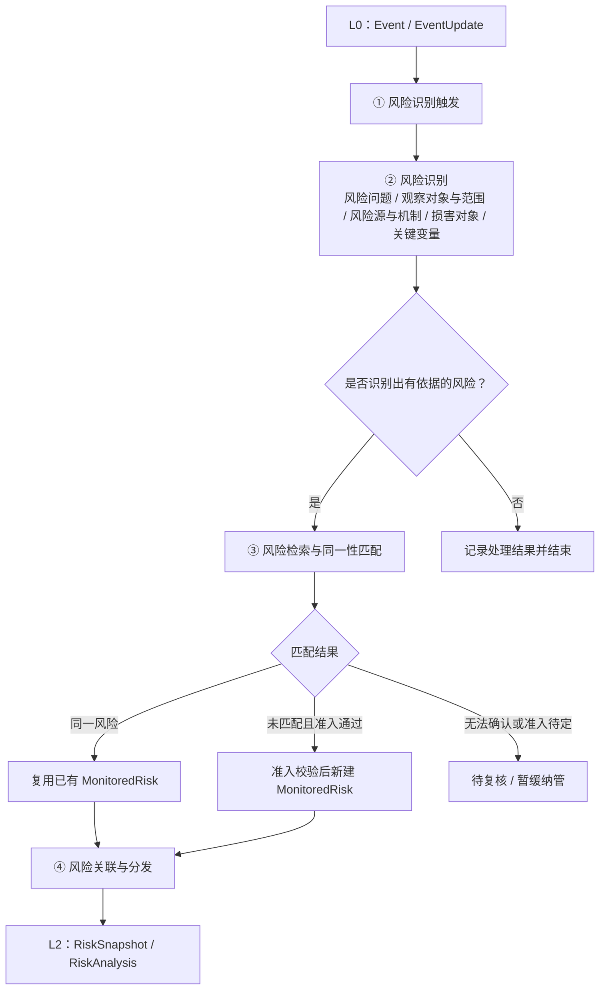
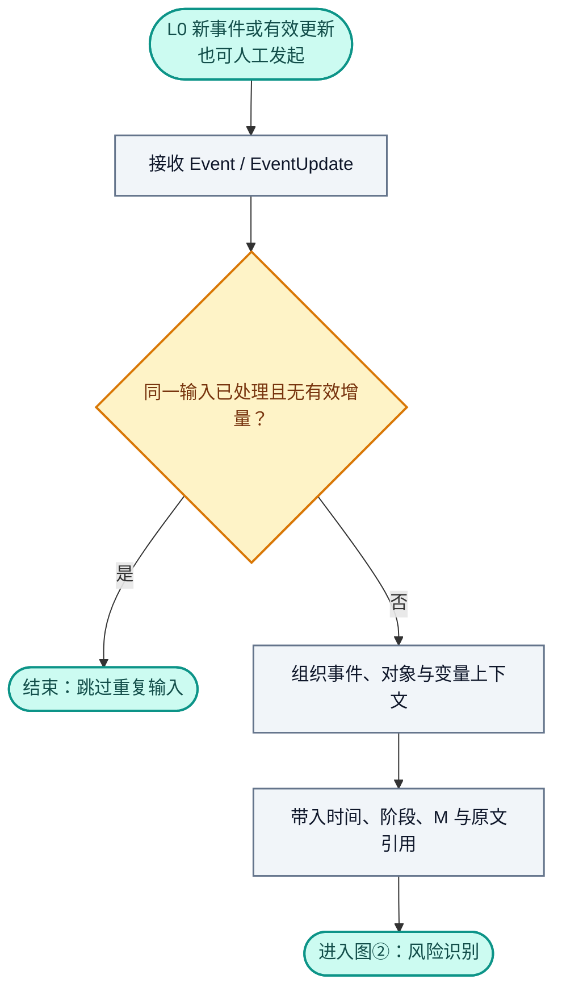
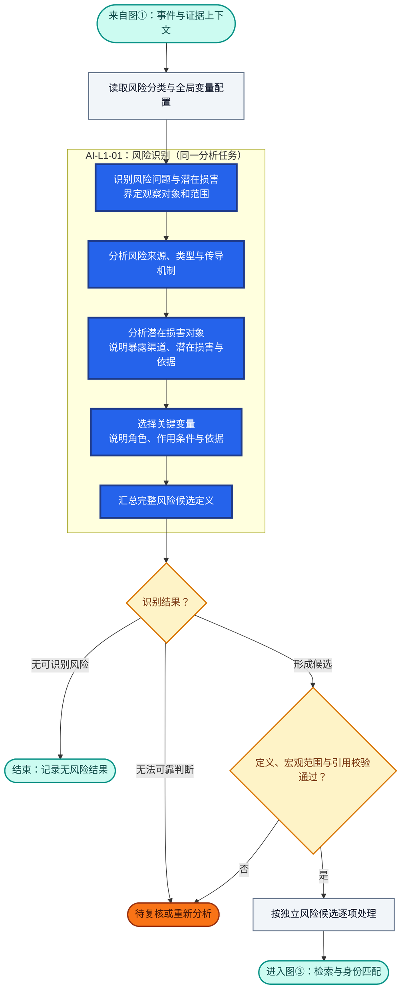
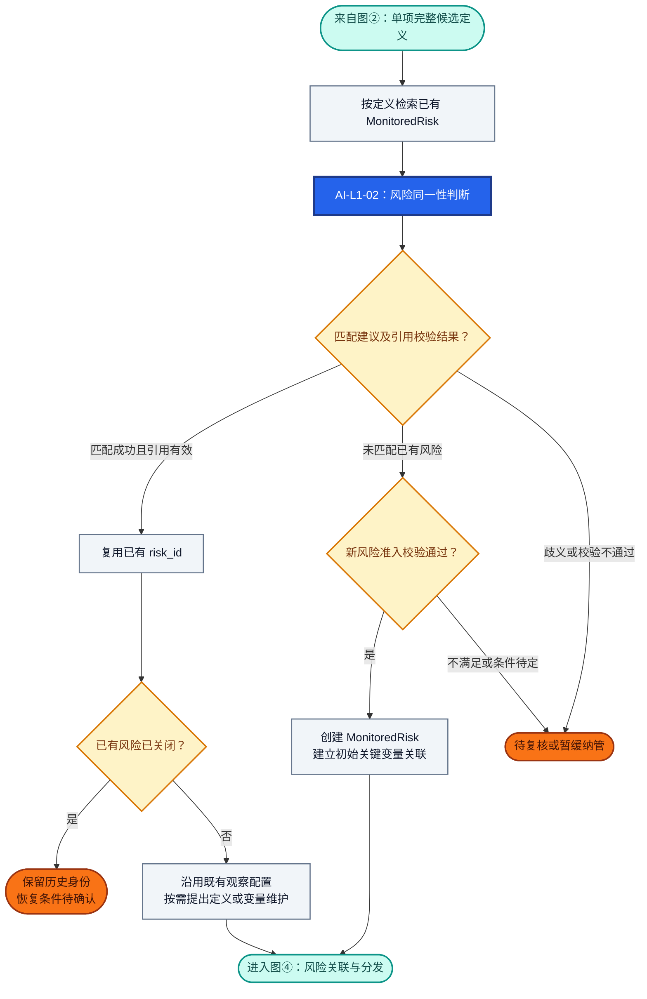
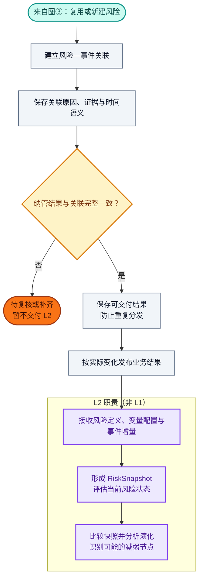
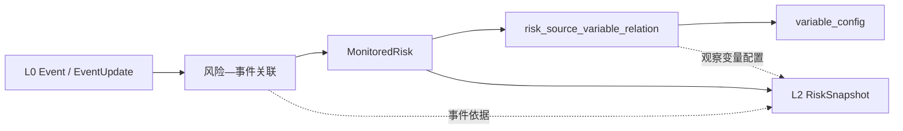

# RiskHot L1 风险识别与纳管层：业务架构与领域设计

> **文档版本**：V1.0（讨论整理稿）  
> **编制日期**：2026-10-09  
> **设计范围**：RiskHot / L1 风险识别与纳管层 / 首版宏观领域  
> **设计基线**：L0 Event / EventUpdate / Target / Variable；L1 MonitoredRisk；L2 RiskSnapshot / RiskAnalysis  
> **内容约定**：本文件归纳已经讨论的业务设计；尚未确定的规则、字段、算法、Prompt 或接口规范统一标注「待讨论」，不预设具体实现。

## 1. 业务能力与职责设计

### 1.1 业务定位与总体职责

L1 将 L0 提供的结构化事件与有效更新转化为**定义清晰、身份稳定、证据可追溯、观察变量明确的风险观察对象（MonitoredRisk）**，交付 L2 持续观察。

本层主要回答三个问题：**存在什么值得观察的风险？是否已经纳管？应当跟踪哪些关键变量？** L1 对风险定义的完整性、风险身份的复用与准入、长期观察配置、事件关联和下游交付负责。

L1 先从事件中一次性识别并定义具体风险，包括风险问题、观察对象与范围、风险损害对象、潜在损害、风险来源、主要传导机制和关键变量，再检索、匹配已有 MonitoredRisk。匹配成功时复用既有身份；确属新风险且通过准入校验时正式纳管；无法判断时保留待复核结果。

### 1.2 核心业务能力与责任

| 业务能力        | 回答的业务问题                  | L1 承担的责任                                                                               | 主要交付结果                                                          |
| ----------- | ------------------------ | -------------------------------------------------------------------------------------- | --------------------------------------------------------------- |
| 事件承接与识别触发   | 哪些事件或有效更新需要进入风险识别？       | 接收 L0 的 Event / EventUpdate，准备对象、变量与原文证据上下文，识别重复输入并保留事件时间和阶段语义                         | 待识别的事件上下文、输入处理记录                                                |
| 风险识别        | 存在什么风险，影响谁，为什么需要观察，跟踪什么？ | 一次性明确风险问题、观察对象与范围、潜在损害；分析风险来源、类型及形成和传导机制；从机制中选择关键变量，优先引用全局变量 ID，并说明驱动、传导、缓冲或损害验证作用     | 完整风险候选定义、关键变量候选及作用说明、事件证据引用；此时尚未形成正式风险身份                        |
| 风险检索与身份匹配   | 候选风险是否已经纳管，能否复用既有身份？     | 使用完整候选定义检索已有 MonitoredRisk，比较风险问题、观察对象、范围与潜在损害；给出匹配、未匹配或待复核结果，避免以名称或关键词相同代替同一性判断       | 已有风险匹配结果、可复用的 `risk_id` 或待复核说明                                  |
| 风险纳管与跟踪配置维护 | 哪项风险进入持续观察，如何维持其身份和观察配置？ | 对未匹配风险执行准入校验，创建 MonitoredRisk 与初始关键变量关系；对已有风险复用身份，按需维护定义与变量配置；管理跟踪状态，具体审批、版本和状态迁移条件待讨论 | 已有或新增 MonitoredRisk、`risk_source_variable_relation`、纳管与跟踪状态管理结果 |
| 风险关联与分发     | 本次事件与哪些风险有关，下游据此观察什么？    | 建立风险—事件关联，保存关联原因和证据定位；区分新风险纳管、已有风险关联新事件和跟踪状态变化，向 L2 交付风险定义、关键变量及事件增量                   | 风险—事件关联、可追溯的证据引用、L2 观察输入与业务结果通知                                 |

**横向质量与追溯职责**：各项能力共同保证事件依据可回溯、对象与变量引用有效、重复输入不重复创建或分发。风险识别允许无结果，同一事件允许形成多项候选，无法可靠判断时进入待复核。新风险创建、初始关键变量配置与初始事件关联应一致完成，避免向 L2 交付尚未完成纳管的对象；具体事务和消息协议待设计。

上述能力对应第 1.3 节的四个业务环节，处理流程见第 2 章：事件承接对应①，风险识别对应②，身份匹配及纳管维护对应③，风险关联与分发对应④。关键变量选择在②完成，③消费完整候选定义并建立或维护正式关联；跟踪状态管理还承担持续的生命周期维护职责。

### 1.3 业务能力划分

| 环节  | 业务能力           | 核心处理                                  | 主要输出                      |
| --- | -------------- | ------------------------------------- | ------------------------- |
| ①   | 风险识别触发         | 接收事件及有效更新，准备识别上下文                     | 待识别的 Event / EventUpdate  |
| ②   | **风险识别**       | 识别风险问题、观察对象、潜在损害、风险源、传导机制与关键变量        | 完整的风险候选定义（暂未纳管）           |
| ③   | **风险检索、匹配与纳管** | 按完整定义检索 MonitoredRisk；判定同一性；复用、创建或待复核 | 已有或新增的 MonitoredRisk、纳管结果 |
| ④   | 风险关联与分发        | 建立事件关联，引用证据，向 L2 提交观察输入               | 风险—事件关联、下游观察通知            |

### 1.4 首版职责覆盖范围

| 维度    | L1 首版范围与责任                                                                        |
| ----- | --------------------------------------------------------------------------------- |
| 研究领域  | 仅针对宏观经济金融风险；行业、企业和单项资产可作为背景或证据，暂不独立纳管为微观风险观察对象                                    |
| 风险身份  | 以 MonitoredRisk 为稳定的风险观察实体；多个事件和多个观察周期可以引用同一 `risk_id`                            |
| 事件使用  | 复用 L0 的 Event / EventUpdate 及原文引用；已宣布、预计实施或尚未兑现的事件也可提供风险线索，须保留时间与阶段语义             |
| 风险定义  | 表达稳定的风险问题、观察对象与范围、潜在损害、风险来源及机制，不写入当期风险等级或涨跌判断                                     |
| 变量体系  | 使用全局 `variable_config`；L1 选择具体风险需要持续跟踪的变量，维护角色、作用条件与观察理由，不记录本次变量数值                |
| 跟踪管理  | 管理 `observing`、`monitoring`、`paused`、`closed` 等跟踪状态；暂停、关闭及恢复条件待讨论，已关闭风险优先考虑复用历史身份 |
| 处理与结果 | 先完整识别与定义，再检索匹配，最后决定复用或新建；允许无风险、已有风险、新风险、待复核，不强行生成风险或虚构 ID                         |
| 下游交付  | 交付风险定义、长期观察配置和相关事件增量，为 L2 首次观察与持续观察提供输入                                           |

### 1.5 上下游职责分工

| 业务层             | 承担的业务职责                                   | 核心业务产物                                                   | 与 L1 的协作                       |
| --------------- | ----------------------------------------- | -------------------------------------------------------- | ------------------------------ |
| L0 信息处理层        | 信息采集、原始资料去重、事件归组、事件直接作用对象与变量识别、金融意义 M 评价  | Event、EventUpdate、Target、EventTargetVariable、EventRating | 提供结构化事件和可追溯信息，作为 L1 风险识别的依据    |
| **L1 风险识别与纳管层** | 定义具体风险、确定关键变量、匹配风险身份、纳管和维护观察配置、关联事件并分发    | **MonitoredRisk**、风险—事件关联、风险—关键变量关联                      | 承接 L0 的事件，将正式纳管的风险及观察输入交付 L2   |
| L2 风险观察与监测层     | 评估变量当前状态、风险大小、兑现程度和持续条件；比较快照并识别演化及可能的减弱节点 | RiskSnapshot、RiskAnalysisResult                          | 消费 L1 的风险定义、关键变量配置与事件证据，形成观察判断 |

L0 的 Event Target 表示事件直接作用对象；L1 的观察对象表示某项风险判断针对的对象。两者只在身份及范围一致时建立映射，不自动视为相同。风险损害对象则表示沿传导路径可能承受损害的主体或系统，可以与观察对象重合，也可以不同，不能直接复制 Event Target 或观察对象作为结果。L0 的事件直接变量关联提供识别线索，L1 仍须依据风险机制独立确定长期观察变量。

### 1.6 职责边界与暂不承担事项

- L1 复用 L0 的信息和事件产物，不承担信息抓取、原始资料去重、事件归组及金融意义 M 评分；M 仅辅助信息筛选和研究排序，不等同于风险大小。
- L1 的风险定义及变量配置描述“观察什么、为什么观察”；变量当前状态、风险等级、兑现程度、趋势和风险减弱节点由 L2 判断。
- L1 的跟踪状态表示是否及如何继续跟踪，不代替 L2 对风险当前状态的评估。事件与风险建立关联，也不直接构成风险加剧或缓和的结论。
- 风险候选定义属于识别过程结果，尚未纳管；AI 提供识别与匹配建议，正式风险 ID 创建、准入校验和持久化由系统业务流程执行。候选是否独立持久化、自动准入条件及人工复核权限待讨论。
- L1 不承担投资交易与风险应对决策；首版不独立纳管行业、企业和单项资产的微观风险。

## 2. 业务架构设计

### 2.1 总体业务流程

**流程关键约束：** 风险定义只在②形成一次，③直接消费②输出的完整候选定义；③在匹配成功时复用既有风险身份，在未匹配且符合准入要求时新建。一个 Event 可以识别多项风险，每项风险分别匹配。

### 2.2 详细业务流程

以下四张详图与①—④业务环节一一对应。圆角节点标明入口、出口、正常结束或暂停处理；图内保留主要动作，字段与业务口径见各图下方步骤表。

**颜色图例**：蓝底白字＝AI 分析任务；灰色＝程序处理；浅黄＝规则校验与结果分支；橙色＝待复核、暂缓纳管或条件待确认；青绿＝入口、出口与正常结束；紫色＝下游职责。

**AI 编号口径**：沿用第 6.1 节的 `AI-L1-01`（风险识别）与 `AI-L1-02`（风险同一性判断）。图②内的分析步骤归属同一个 AI 任务；图①和图④不新增 L1 AI 任务。尚未确定的准入、配置维护及恢复条件继续保留待讨论，不由流程图补定。

#### 2.2.1 ① 风险识别触发

**图①处理口径**：本图为程序承接与上下文准备，不新增 AI 任务。重复输入直接结束；人工发起与 L0 通知进入相同的重复检查和上下文准备步骤。具体触发阈值、调度及重新处理策略仍待讨论。

| 步骤          | 处理内容                                       | 输入与输出                           |
| ----------- | ------------------------------------------ | ------------------------------- |
| 1.1 接收事件输入  | 接收 L0 的新 Event 或有效 EventUpdate，也允许人工发起风险识别 | 输入：Event / EventUpdate；输出：待处理事件 |
| 1.2 增量与重复检查 | 识别是否已处理同一事件及版本，避免重复执行                      | 输出：有效识别请求或跳过结果                  |
| 1.3 组织识别上下文 | 获取事件基本内容、时间语义、作用对象、直接涉及变量、金融意义及原始证据引用      | 输出：②的分析输入                       |

**边界：** 这一环节不重新采集原文、不重新抽取 Event。事件金融意义 M 可供辅助筛选，但不直接决定风险等级或风险存在与否。具体触发阈值与调度策略待讨论。

#### 2.2.2 ② 风险识别

**AI 与程序分工**：蓝色节点是同一个 `AI-L1-01` 的分析步骤，对应下表 2.1—2.6，不代表拆分为多个独立 AI 任务。程序校验候选定义、宏观范围、变量引用与证据；未匹配到全局变量时保留候选和待确认信息，不虚构变量 ID，是否满足纳管要求在图③判断。

**多风险处理**：同一事件可输出 0..N 项候选。通过校验的候选分别进入图③和图④，某项待复核不妨碍其他候选继续处理；此时尚未创建正式 `risk_id`。

此环节一次性完成候选风险的业务定义；在此之后才开展存量风险检索。

| 步骤              | 业务工作                           | 应形成的内容                                              |
| --------------- | ------------------------------ | --------------------------------------------------- |
| 2.1 风险问题识别      | 从事件中识别可能发生的不利变化及潜在损害           | 风险问题、潜在损害、依据                                        |
| 2.2 观察对象与范围界定   | 明确本项风险持续观察的经济金融对象及研究边界，不直接等同于损害对象 | 观察对象、观察范围 `scope_boundary` |
| 2.3 风险来源与传导分析 | 识别主要风险源与风险性质，引用已有分类配置；解释风险驱动、传导、缓冲和损害验证条件 | `risk_source_config`、`risk_dimension_config` 的引用或候选，以及简要、可解释的风险机制 |
| 2.4 潜在损害对象分析 | 沿传导路径识别可能受损的主体或系统，说明其暴露渠道、潜在损害与证据依据，区分观察对象与损害对象 | 风险损害对象集合 `damage_targets`；对象对应的传导与损害说明，证据不足项标为待验证 |
| 2.5 关键变量选择      | 从机制中提取需要持续跟踪的变量，匹配全局变量库，说明变量作用 | 关键变量候选、角色、作用条件及原因                                   |
| 2.6 汇总完整候选定义    | 对上述要素去重整理，建立可用于同一性匹配的完整候选定义    | 完整风险候选定义及事件证据引用                                     |

**本环节规则：**

- 同一事件可以形成 0..N 项风险候选；无法说明具体风险问题及潜在损害时不强行生成。
- 已宣布、预计实施或尚未兑现的事件，可构成风险线索；必须保留事件的时间与阶段语义。
- 风险定义描述稳定的风险问题，不写入当期风险等级或涨跌判断。
- 风险损害对象在本环节初步确定，不以损害已经发生为前提。应有可解释的暴露渠道与传导依据；尚无法确定的对象或关系写入 `uncertainty`，不能无依据扩列对象。`damage_targets` 不代表损害已经兑现，也不为其中每个对象自动建立独立 MonitoredRisk。
- 关键变量来自风险机制，优先引用 `variable_config`，并解释其驱动、传导、缓冲或损害验证作用。
- 当前变量值、风险影响程度及减弱节点由 L2 分析。
- 「完整风险候选定义」属于②的处理输出，尚未形成正式 MonitoredRisk 身份；是否持久化候选待讨论。

#### 2.2.3 ③ 风险检索、匹配与纳管

**AI 与程序分工**：程序按完整定义检索既有风险，`AI-L1-02` 输出同一性建议与理由；程序校验引用和匹配结果，再执行复用、准入与创建。检索没有召回结果也须经过准入校验，不能直接创建新风险；本图不重新开展一轮完整风险定义。

**维护与恢复边界**：既有风险按需提出配置维护，审批与版本规则仍待讨论，未确认的建议不直接覆盖既有配置。已关闭风险保留历史身份，恢复条件确认后再衔接关联与分发；图中不预设自动恢复。新建分支须与图④初始事件关联一致完成后才可向 L2 交付，具体事务边界待设计。

| 步骤            | 业务工作                                          | 输出                         |
| ------------- | --------------------------------------------- | -------------------------- |
| 3.1 按候选定义检索   | 使用②生成的风险问题、观察对象、范围、潜在损害等检索已有 MonitoredRisk    | 已有风险候选集合                   |
| 3.2 风险同一性匹配   | 判断既有风险是否完整覆盖当前风险定义；主要机制辅助解释差异                 | 匹配成功 / 未匹配 / 待复核           |
| 3.3 复用或创建决策   | 匹配成功复用原 `risk_id`；未匹配时执行新风险准入校验；不确定时暂停自动纳管    | 匹配或纳管决策                    |
| 3.4 正式纳管或配置维护 | 对新风险创建 MonitoredRisk 与变量关联；对既有风险按需提出定义或变量配置维护 | 已有或新增 MonitoredRisk、关键变量关系 |

**同一性判定重点：** 风险问题、观察对象、观察范围、潜在损害。风险来源或具体触发事件不同，并不必然需要创建新风险。

**匹配分支：**

- **已有风险：** 复用 `risk_id`；保留已有观察定义。新候选的风险机制或变量有实质差异时，可提出配置维护，变更规则待细化。
- **全新风险：** 在同一性检查和准入校验通过后创建 MonitoredRisk，并建立其关键变量关联。
- **无法判断：** 标记待复核，不自动重复创建风险。
- **已有风险已关闭：** 优先考虑复用历史身份并恢复跟踪；具体恢复条件待讨论。

**纳管准入条件（已讨论的方向）：** 有明确风险问题、观察对象与范围、潜在损害、可追溯的事件依据及必要的观察条件。关键变量最低配置数量及自动准入条件尚未确认，见第 3 章待定事项。

#### 2.2.4 ④ 风险关联与分发

**校验与交付**：本图属于程序处理，不新增 L1 AI 任务。检查有效风险身份、关键变量配置及事件证据关联，未完成纳管时暂不交付；补齐或复核后回到对应步骤。图③与本图表达业务上的一致完成要求，不预设事务、重试或补偿协议。

**分发与下游边界**：按实际变化区分新风险纳管、已有风险关联新事件与跟踪状态变化，候选通知名称见第 5.3 节。L2 引用同一 `risk_id` 开展观察；是否触发新快照及暂停状态的处理条件待讨论。事件关联本身不代表风险加剧或缓和，紫色节点仅说明 L2 的职责。

| 步骤            | 业务工作                                            | 输出         |
| ------------- | ----------------------------------------------- | ---------- |
| 4.1 建立风险—事件关联 | 记录本次 Event / EventUpdate 对应的一个或多个 MonitoredRisk | 风险—事件关联关系  |
| 4.2 保存关联依据    | 保留事件与风险关联的原因、来源定位及必要的时间语义                       | 可追溯的风险证据引用 |
| 4.3 发布业务结果    | 区分新风险纳管、已有风险关联新事件和跟踪状态变化                        | 业务结果通知     |
| 4.4 交付下游      | 为 L2 提供 `risk_id`、风险定义、关键变量及相关事件增量              | L2 观察输入    |

新风险的创建、初始关键变量配置与初始风险—事件关联应一致地完成，避免向 L2 交付尚未完成纳管的对象。具体事务和消息协议待设计。

### 2.3 主要业务处理分支

| 场景                     | L1 处理路径           | 结果                           |
| ---------------------- | ----------------- | ---------------------------- |
| 新事件揭示已有风险              | ①→②→③匹配成功→④       | 复用 MonitoredRisk、关联事件        |
| 新事件揭示全新风险              | ①→②→③未匹配并准入通过→④   | 新建 MonitoredRisk、配置关键变量、关联事件 |
| 事件包含多项风险               | ①→②得到多个定义→③逐项匹配→④ | 可同时复用与新建多个风险                 |
| 有风险线索但匹配歧义             | ①→②→③待复核          | 暂不自动纳管                       |
| 无法识别具体风险               | ①→②结束             | 无 MonitoredRisk 新增           |
| 已有风险出现可能缓和风险的事件        | ①→②→③复用→④         | 关联已有风险；是否缓和由 L2 判断           |
| 同一 Event / Update 重复通知 | ①判定重复             | 不重复创建或分发                     |
| 已有风险定义或关键变量需要调整        | ①→②→③匹配成功并提出维护→④  | 复用风险身份，维护观察配置的具体规则待定         |

## 3. 业务规则设计

### 3.1 业务规则索引

本章列出已经讨论的业务判断原则；尚未讨论的阈值、枚举细节及审批策略保留空白。

| 编号       | 规则名称    | 适用步骤       | 已讨论的规则原则                                                       |
| -------- | ------- | ---------- | -------------------------------------------------------------- |
|          |         |            |                                                                |
|          |         |            |                                                                |
|          |         |            |                                                                |
|          |         |            |                                                                |
| BR-L1-05 | 风险同一性匹配 | ③ 3.1–3.2  | 比较风险问题、观察对象、范围、潜在损害，优先复用既有身份                                   |
| BR-L1-06 | 新风险准入   | ③ 3.3–3.4  | 新风险在未匹配且满足纳管要求后创建；不明确时待复核                                      |
| BR-L1-07 | 已有风险维护  | ③ 3.4      | 新事件通常沿用现有定义；机制或变量需要调整时进行维护                                     |
| BR-L1-08 | 风险—事件关联 | ④ 4.1–4.2  | Event 与 MonitoredRisk 多对多；保存可解释的关联依据                           |
| BR-L1-09 | 下游分发    | ④ 4.3–4.4  | 新风险及已有风险的有效更新可以通知 L2；风险状态判断由 L2 完成                             |
| BR-L1-10 | 跟踪状态管理  | ③ / 生命周期维护 | `observing` / `monitoring` / `paused` / `closed`；关闭后可考虑复用并恢复跟踪 |

#### 3.2  风险同一性判断依据字段

本表细化 BR-L1-05，用于比较完整风险候选 `RiskIdentificationResult` 与已有 `MonitoredRisk`，判断是否复用同一风险身份。

| 优先级 | RiskIdentificationResult 字段 | MonitoredRisk 字段                | 判断内容             |
| --- | --------------------------- | ------------------------------- | ---------------- |
| 核心  | `definition`                | `definition`                    | 风险问题及潜在损害是否实质相同  |
| 核心  | `observation_target`        | `observation_target`            | 是否针对同一个经济金融对象    |
| 核心  | `scope_boundary`            | `scope_boundary`                | 风险观察范围是否一致或等价    |
| 辅助  | `title`                     | `title`                         | 风险名称是否相同或语义相近    |
| 辅助  | `mechanism_summary`         | `mechanism_summary`             | 风险形成与传导机制是否一致或相容 |
| 辅助  | `dimension_code`            | `dimension_id`                  | 是否属于相同风险维度       |
| 辅助  | `risk_source_codes`         | 关联的风险源配置                        | 风险来源是否相同或相关      |
| 辅助  | `key_variables`             | `risk_source_variable_relation` | 关键观察变量是否相同或相关    |

**字段比较口径：**

- 优先核对三项核心依据是否实质一致；名称、维度、来源或变量相同只能作为辅助依据，不能覆盖核心差异。范围仅部分重叠、证据不足或机制存在无法解释的冲突时，保留待复核结果，不以简单相似度直接判定同一风险。
- 比较 `definition` 时，同时读取 `damage_targets` 及 `mechanism_summary` 中的潜在损害说明，核对谁可能受损及其传导依据；损害对象扩大、收缩或转移不单独决定风险身份，应结合原有三项核心依据判断。
- 表中的 `dimension_id` 指配置解析后的风险维度标识；MonitoredRisk 当前实际字段是 `risk_dimension_ids` 数组。先通过 `risk_dimension_config` 将 `dimension_code` 解析为 `dimension_id`，再与数组中的维度比较，不新增同名标量字段，也不直接比较代码与 ID。
- `risk_source_codes` 通过 `risk_source_config` 解析为来源 ID，与 MonitoredRisk 的 `risk_source_ids` 及关联配置比较；来源相关不等于风险身份相同。
- `key_variables` 与 `risk_source_variable_relation` 比较时，同时核对变量身份、所属来源、角色及作用机制；未匹配到变量 ID 的候选名称只能作为待核线索，不据此虚构正式变量身份。

|     |     |
| --- | --- |
|     |     |
|     |     |
|     |     |
|     |     |
|     |     |
|     |     |
|     |     |
|     |     |
|     |     |

### 3.3 观察对象的定义与第一版范围

#### 3.3.1 观察对象的定义

观察对象，是一项具体风险判断所针对的、具有明确身份和范围边界的经济或金融对象。

它回答：

> “我们正在判断谁、哪个市场或哪套经济金融系统的风险状况？”

对风险大小、影响程度、持续性及是否缓和的判断，都必须针对这个对象成立。

观察对象不限定为企业或机构，也可以是经济体、行业、资产、市场或金融系统。

#### 3.3.2 第一版范围

本系统第一版只建立宏观层面的风险观察对象，允许的类型为：

- 经济体
- 宏观主体，例如中央政府、中央银行
- 市场
- 金融系统

行业、企业和单项资产可以作为宏观风险的证据或传导环节，本阶段不单独建立为观察对象。

## 4. 领域模型设计

### 4.1 核心领域模型

L1 以 **MonitoredRisk 为核心领域实体**。关键变量关系与风险—事件关系作为业务关联对象；风险识别中间结果不必提升为独立聚合根。

### 4.2 领域对象汇总说明

下表汇总 L1 自身管理的核心实体、业务关联和处理结果，以及模型涉及的上游、共享配置与下游对象。对象在表中出现不代表由 L1 创建或维护；具体字段和约束在后续小节展开。

| 领域对象／业务结果                       | 类型与归属           | 业务含义                               | 核心职责                               | 主要关联对象与关系                                                 | 讨论状态                      |
| ------------------------------- | --------------- | ---------------------------------- | ---------------------------------- | --------------------------------------------------------- | ------------------------- |
| **MonitoredRisk**               | L1 核心领域实体       | 正式纳入持续观察的一项具体宏观风险                  | 维护稳定 `risk_id`、风险定义、观察对象与范围及跟踪状态   | 关联多个事件和关键变量配置；被 L2 RiskSnapshot 引用                        | 已讨论；聚合边界、物理映射及状态迁移条件待定    |
| `risk_source_variable_relation` | L1 业务关联对象       | 某项风险在特定风险源之下的关键变量观察配置              | 记录变量角色、作用条件与观察理由，支持长期跟踪            | 连接 MonitoredRisk、`risk_source_config` 与 `variable_config` | 已讨论；重复关联约束及版本策略待定         |
| `monitored_risk_event_relation` | L1 业务关联表        | 某个 Event 与正式纳管 MonitoredRisk 的业务关联 | 保存关联原因、首次关联依据及有效状态                 | 连接 MonitoredRisk 与 L0 Event，首次依据可引用 EventUpdate；风险与事件为多对多 | 八字段表结构见第 4.5 节；联合唯一约束待定   |
| 完整风险候选定义                        | L1 识别过程结果       | 尚未正式纳管的风险定义、关键变量候选及事件依据            | 为存量检索、同一性匹配与准入判断提供完整输入             | 由 Event / EventUpdate 识别形成；经匹配后可能对应已有或新增 MonitoredRisk    | 已讨论；是否独立持久化待定，不作为核心实体     |
| 匹配与纳管结果                         | L1 处理结果         | 复用、新建或待复核的处理结论                     | 说明风险身份处理结果，衔接正式纳管和事件关联             | 消费完整候选定义；匹配或新建成功时指向 MonitoredRisk                         | 已讨论；是否独立持久化待定，不作为核心实体     |
| Event / EventUpdate             | L0 上游对象，L1 引用   | 结构化事件及其有效进展、补充或纠正                  | 提供风险识别输入及可追溯的事件依据；事件身份和原始记录由 L0 管理 | 通过风险—事件关联连接 MonitoredRisk                                 | 沿用 L0；输入契约见第 5.1 节        |
| `variable_config`               | 共享变量配置，L1 引用    | 跨事件、跨风险复用的全局变量定义与标识                | 为关键变量选择提供统一引用；不在风险关联中重复定义变量        | 被 `risk_source_variable_relation` 引用，同一变量可供多项风险使用         | 沿用全局配置；具体风险的长期观察配置由 L1 维护 |
| `risk_source_config`            | 共享风险源配置，L1 引用   | 风险来源的分类依据                          | 维护分析层次、分类定义、识别依据与边界                | 被 MonitoredRisk.risk_source_ids 及关键变量关联引用                 | 表结构见第 4.9 节；尚未实施数据库变更     |
| `risk_dimension_config`         | 共享风险类型配置，L1 引用  | 基本面、流动性、估值、情绪等风险维度的分类依据            | 维护定义、识别依据和分类边界                     | 被 MonitoredRisk.risk_dimension_ids 引用                     | 表结构见第 4.8 节；尚未实施数据库变更     |
| RiskSnapshot                    | L2 下游对象，非 L1 管理 | 某项风险在一个观察时点的状态评估                   | 由 L2 评估风险大小、当前状态、兑现程度及持续条件         | 引用同一 `risk_id`，使用 L1 交付的定义、变量配置及事件证据                      | 沿用 L2 边界；跨层版本引用策略待定       |

**汇总边界**：L1 的稳定风险身份、长期观察配置与事件关联分别承担不同职责；候选定义和匹配结果属于处理过程，不因列入本表而成为独立聚合根。上游对象、共享配置与下游快照用于说明协作关系，不扩展 L1 的管理职责。`risk_def` 与 MonitoredRisk 的引用和复用方式尚未确定，本表不预设其领域定位。风险类型配置表结构见第 4.8 节，风险源配置表结构见第 4.9 节。

### 4.3 MonitoredRisk：风险观察对象

**领域定义：** 一条 MonitoredRisk 表示针对特定宏观观察对象与范围，被正式纳入持续观察的一项具体风险。它具有稳定 `risk_id`，可以跨多个事件和多个观察周期持续存在。

| 逻辑属性 / 候选字段                 | 业务含义                                                        | AI负责                    |
| --------------------------- | ----------------------------------------------------------- | ----------------------- |
| `risk_id`                   | 风险稳定身份                                                      | 否；系统在纳管时创建或复用           |
| `title`                     | 风险名称，不包含当前风险等级                                              | 是；拟定具体风险名称              |
| `definition`                | 风险问题与潜在损害的定义性一句话描述                                          | 是；归纳风险问题与潜在损害           |
| `mechanism_summary`         | TEXT；建议保留，提供完整的风险形成、传导、持续与缓冲逻辑                              | 是；归纳机制、成立条件与缓冲路径        |
| `observation_target`        | 风险判断针对的经济金融对象                                               | 是；识别观察对象，系统校验已有对象引用     |
| `damage_targets`            | STRING[]；风险损害对象集合，记录沿本项风险传导路径可能受损的主体或系统，不等同于观察对象 | 是；识别潜在损害对象并说明传导依据，系统校验候选与纳管定义的一致性 |
| `scope_boundary`            | 地域、市场与研究环节的观察边界                                             | 是；界定观察范围，系统校验首版宏观范围     |
| `risk_source_ids`           | 风险源配置 ID 数组，引用 `risk_source_config.source_id`，允许多个来源        | 是；建议来源分类，系统校验配置 ID 与可用性 |
| `risk_dimension_ids`        | 风险类型配置 ID 数组，引用 `risk_dimension_config.dimension_id`，允许多个维度 | 是；建议风险类型，系统校验配置 ID 与可用性 |
| `tracking_status`           | 观察、监控、暂停或结束跟踪                                               | 否；系统按跟踪管理流程维护           |
| `admitted_at`               | 正式纳入观察时间；用于今日新增风险展示                                         | 否；系统在正式纳管时记录            |
| `created_at` / `updated_at` | 记录创建与修改时间                                                   | 否；系统记录创建与修改时间           |

MonitoredRisk 的表名在本设计中采用 `monitored_risk`，供第 4.5 节关联表引用；既有 `risk` 表的迁移映射及最终字段集合，留待详细数据设计确定。

`damage_targets` 的逻辑结构沿用第 4.6.1 节。正式纳管时保留该集合及对应的潜在损害、传导与证据说明；对象身份引用和物理存储映射待详细数据设计确定，不因本字段自动创建对象表或扩大首版宏观观察对象的纳管范围。

### 4.4 risk_source_variable_relation：风险—风险源—关键变量关联

**领域定义：** 针对某个 MonitoredRisk，在某类风险源之下选择一个关键变量，说明其在风险形成与传导中的作用及观察理由。该关系保存长期观察配置，不记录本次变量数值或最新风险判断。

| 属性                          | 业务含义                                        |
| --------------------------- | ------------------------------------------- |
| `relation_id`               | 关键变量关联记录身份                                  |
| `risk_id`                   | 属于哪个 MonitoredRisk                          |
| risk_source_code            | 引用 `risk_source_config.source_id`，保留现有关系字段名 |
| `variable_id`               | 引用共享的 `variable_config`                     |
| `variable_role`             | 驱动 / 传导 / 缓冲 / 损害验证                         |
| `variable_impact_on_risk`   | 变量为何重要，以及在什么条件下加大或减小风险                      |
| `created_at` / `updated_at` | 关联创建和更新时间                                   |

变量角色沿用：`risk_driver`、`risk_transmission`、`risk_buffer`、`damage_verification`。具体是否允许同一风险—变量在多个风险源或角色下重复关联、历史版本如何保留，待讨论。

### 4.5 monitored_risk_event_relation：风险与事件关联表

- **中文名称：** 风险与事件关联表。
- **英文表名：** `monitored_risk_event_relation`。
- **表性质：** 业务关联表。
- **所属层级：** L1 风险识别与纳管层。

**一条记录表示：** 某个 Event 与某项正式纳管的 MonitoredRisk 存在业务关联，并记录关联原因。一个 Event 可以关联多项风险，一项 MonitoredRisk 可以关联多个 Event。

#### 4.5.1 表结构

| 字段名               | 类型          | 约束               | 业务含义                                              |
| ----------------- | ----------- | ---------------- | ------------------------------------------------- |
| `relation_id`     | UUID        | PK               | 关联记录唯一 ID                                         |
| `risk_id`         | UUID        | FK、NOT NULL      | 关联的风险，引用 `monitored_risk.risk_id`                 |
| `event_id`        | UUID        | FK、NOT NULL      | 关联的事件，引用 `event.event_id`                         |
| `event_update_id` | UUID        | FK、可空            | 首次建立该关联所依据的事件更新，引用 `event_update.event_update_id` |
| `relation_reason` | TEXT        | NOT NULL         | 为什么该事件与这项风险有关                                     |
| `is_active`       | BOOLEAN     | NOT NULL，默认 TRUE | 当前关联是否仍然有效                                        |
| `created_at`      | TIMESTAMPTZ | NOT NULL         | 关联创建时间                                            |
| `updated_at`      | TIMESTAMPTZ | NOT NULL         | 关联记录更新时间                                          |

#### 4.5.2 关联语义与引用边界

- `risk_id` 只能引用正式纳管的风险，不引用尚未纳管的 RiskIdentificationResult。
- `event_update_id` 非空时，所引用更新必须属于本行 `event_id` 对应的事件；它记录首次建立关联的依据，不作为“最新事件更新”指针。后续事件进展不覆盖此字段。
- 证据通过 Event、首次关联依据的 EventUpdate 及其上游 Information 追溯；本表不另加原文或证据正文存储字段。
- `is_active` 表示关联是否有效，不代表风险是否增强、减弱或解除，也不代替 MonitoredRisk 的跟踪状态。
- 表结构按上述八个字段设计；联合唯一约束、关联失效与重新启用的具体规则另行确定，现阶段不擅自增加复合唯一键。重复输入不得重复建立同一业务关联，沿用现有幂等处理要求。

### 4.6 风险识别过程结果

②输出「完整风险候选定义」，③输出「已匹配 / 新建 / 待复核」结果。它们首先作为业务处理结果使用，尚未确定需要独立持久化为领域实体。

| 业务结果          | 含义                  | 是否为核心实体 |
| ------------- | ------------------- | ------- |
| 完整风险候选定义      | ②完成的待匹配风险定义、变量及事件依据 | 否（处理结果） |
| 匹配与纳管结果       | ③确定的复用、新建或待复核结果     | 否（处理结果） |
| MonitoredRisk | 正式纳管的风险观察对象         | 是       |

#### 4.6.1 RiskIdentificationResult：完整风险候选定义

`RiskIdentificationResult` 表示风险识别环节形成的一项完整风险候选，供后续风险检索、同一性匹配与纳管使用。一轮识别可以形成 0..N 项结果；每项结果对应一项具体风险候选，尚未分配正式 `risk_id`，是否独立持久化仍沿用本节边界。

| 字段名                     | 类型       | 中文名称      | 业务含义                         |
| ----------------------- | -------- | --------- | ---------------------------- |
| `title`                 | STRING   | 风险名称      | 识别到了什么风险                     |
| `definition`            | TEXT     | 风险定义      | 风险是什么，可能出现什么不利变化             |
| `observation_target`    | STRING   | 观察对象      | 本项风险持续观察所针对的经济金融对象，不自动等同于受损主体 |
| `damage_targets`        | STRING[] | 风险损害对象    | 沿风险传导路径可能承受损害的主体或系统集合，允许多个；在风险识别阶段初步确定 |
| `scope_boundary`        | TEXT     | 观察范围      | 本项风险观察覆盖哪些范围                 |
| `dimension_code`        | STRING   | 风险维度      | 引用 `risk_dimension_config`   |
| `risk_source_codes`     | STRING[] | 风险源       | 引用 `risk_source_config`，允许多个 |
| `mechanism_summary`     | TEXT     | 风险形成与传导机制 | 风险如何形成、传导、持续或缓和              |
| `key_variables`         | OBJECT[] | 关键变量集合    | 从风险形成及传导机制中提取的观察变量           |
| `identification_reason` | TEXT     | 识别依据      | 为什么根据当前事件识别出这项风险             |
| `evidence_refs`         | OBJECT[] | 事件证据引用    | 对应的 Event、EventUpdate 等      |
| `uncertainty`           | TEXT     | 不确定性      | 哪些判断尚缺乏证据或需要验证               |

其中，`key_variables` 是嵌套结构，字段定义见下节。上述类型描述处理结果的逻辑结构，不代表创建同名数据库表。

**风险损害对象字段口径：**

- `damage_targets` 每项写明可辨识的对象名称或主体群体及必要范围，例如某经济体内需要再融资的企业群体；只描述有机制和证据支持的损害对象，不以“所有市场”等无边界概括替代分析。
- 对象对应的暴露渠道、传导条件与潜在损害写入 `mechanism_summary`，并与 `evidence_refs` 中的依据建立可追溯对应；候选关系及证据缺口写入 `uncertainty`。本次不额外定义未经讨论的对象 ID 或嵌套对象字段。
- 与 `observation_target` 身份和范围一致时，两者可以重合；行业、企业或资产出现在损害对象分析中，只用于描述宏观风险的受损范围，不自动将其纳入首版独立观察对象。
- 损害对象尚不能确定时允许空集合并明确不确定性，不得编造；是否具备纳管条件在③校验或复核。L2 后续核实暴露、脆弱性、缓冲与损害兑现程度，出现新的损害对象或机制时反馈 L1 维护或补充识别。

#### 4.6.2 key_variables：关键变量结构

每个元素直接对齐 `risk_source_variable_relation` 的业务含义；候选阶段用风险源代码引用配置，正式纳管时解析为对应 ID。

| 字段名                       | 类型        | 中文名称     | 业务含义                 |
| ------------------------- | --------- | -------- | -------------------- |
| `risk_source_code`        | STRING    | 所属风险源    | 变量对应哪个风险来源           |
| `variable_id`             | UUID，可空   | 变量 ID    | 匹配 `variable_config` |
| `candidate_variable_name` | STRING，可空 | 候选变量名称   | 变量库不存在匹配项时使用         |
| `variable_role`           | ENUM      | 变量角色     | 驱动、传导、缓冲、损害验证        |
| `variable_impact_on_risk` | TEXT      | 对风险的影响机制 | 为什么观察这个变量，什么条件下影响风险  |

`variable_role` 沿用四个值：

- `risk_driver`：驱动。
- `risk_transmission`：传导。
- `risk_buffer`：缓冲。
- `damage_verification`：损害验证。

#### 4.6.3 配置引用与纳管衔接

- `dimension_code` 对应 `risk_dimension_config.dimension_code`，按本结构以单个字符串输出；系统解析为 `dimension_id` 后写入 MonitoredRisk 的 `risk_dimension_ids` 数组，保留正式对象允许多个维度的设计。本次不将候选字段自行扩为数组，也不因分类维度不同重复创建同一风险。
- `risk_source_codes` 对应 `risk_source_config.source_code`，系统解析为 `source_id` 集合后关联具体风险；`key_variables[].risk_source_code` 必须属于该候选的 `risk_source_codes`。
- `variable_id` 有匹配项时引用真实的 `variable_config` 标识；没有匹配项时置空并填写 `candidate_variable_name`，不得两者均空或虚构 UUID。候选变量经确认并获得有效 ID 后，才建立正式关键变量关联。
- `key_variables` 中的风险源、变量角色和影响机制分别用于正式关系的 `source_id`、`variable_role`、`variable_impact_on_risk`；`relation_id` 和 `risk_id` 由系统在对应纳管流程中确定，不由 AI 生成正式身份。
- `evidence_refs` 保留可定位的 Event、EventUpdate 及原始证据引用，具体引用对象字段沿用上游证据契约，本次不另加未经确定的嵌套字段。
- `mechanism_summary` 说明持续或缓和的条件机制，并承载各损害对象的暴露与潜在损害说明，不代替 L2 对当前方向、风险等级及持续性的评估。`damage_targets` 随候选定义转入正式 MonitoredRisk；纳管时不得仅取标题或一句摘要而丢失对象、机制及证据依据，具体存储映射在数据设计中确定。

### 4.8 risk_dimension_config：风险类型配置表

**表名：** `risk_dimension_config`。每条配置定义一种风险类型（风险维度），回答“哪一方面可能受损，以及凭什么归入这一类”。该表是共享分类配置，L1 引用；不承载具体风险的当前等级、变化方向、变量观测值或评级阈值。

#### 4.8.1 表结构

以下为表结构设计，字段类型为建议类型，尚未实施数据库变更。

| 字段               | 建议类型         | 必填  | 默认值／约束          | 业务说明                 |
| ---------------- | ------------ | --- | --------------- | -------------------- |
| `dimension_id`   | VARCHAR(64)  | 是   | 主键，不可变          | 风险类型的稳定标识，供具体风险引用    |
| `dimension_code` | VARCHAR(50)  | 是   | 唯一，不可变，小写英文及下划线 | 稳定业务编码，如 `liquidity` |
| `dimension_name` | VARCHAR(100) | 是   | 非空              | 展示名称，如“流动性风险”        |
| `definition`     | TEXT         | 是   | 非空              | 风险类型的定义与核心损害性质       |
| `core_question`  | TEXT         | 是   | 非空              | 使用者识别此类风险时应回答的核心问题   |
| `created_at`     | TIMESTAMP    | 是   | 创建时写入，不随修改重置    | 配置创建时间               |
| `updated_at`     | TIMESTAMP    | 是   | 创建及每次修改时写入      | 配置最近修改时间             |

#### 4.8.3 四类初始配置

下表给出初始配置内容，正式 `dimension_id` 在配置初始化时分配；不伪造已经存在的配置 ID。四项均设为 `enabled`，展示顺序依次为 10、20、30、40。

| dimension_code | dimension_name | definition                               | core_question           | recognition_criteria                        | classification_boundary                   |
| -------------- | -------------- | ---------------------------------------- | ----------------------- | ------------------------------------------- | ----------------------------------------- |
| `fundamental`  | 基本面风险          | 经济、行业或企业的经营、盈利、现金创造能力或权利基础受损的可能性         | 经营与价值基础是否受到不利影响？        | 需求、成本、竞争、治理或信用基础的变化，对盈利、现金创造能力或权利形成有依据的不利作用 | 价格下跌不等于基本面恶化；短期资金缺口不能单独证明长期经营或偿债基础受损      |
| `liquidity`    | 流动性风险          | 融资、支付或交易退出所需资金与承接能力不足，导致资金链中断或被迫处置资产的可能性 | 能否及时获得资金、履行支付义务或完成交易退出？ | 融资续接受阻、现金缓冲不足以覆盖支付需求，或资产退出面临明显承接约束          | 区分融资流动性与市场交易流动性；股价下跌或成交量下降本身不足以确认         |
| `valuation`    | 估值风险           | 当前价格所依赖的盈利、增长、折现或风险补偿假设失去支撑，引发重定价损失的可能性  | 当前价格是否仍有合理的价值与定价假设支撑？   | 价格隐含预期与可验证的增长、盈利、折现率或风险补偿要求出现不利偏离           | 高估值是线索，不能仅凭 PE 高就认定；与基本面风险可同时存在，但需要分别说明机制 |
| `sentiment`    | 情绪风险           | 群体预期、风险偏好及一致性交易行为放大价格冲击或损失的可能性           | 群体预期和交易行为是否形成放大损失的机制？   | 持续亏钱效应、预期反转、拥挤交易或恐慌行为形成有证据支持的相互强化           | 单条负面消息或单日下跌不足以认定；不能仅用情绪标签替代资金约束或基本面机制分析   |

各项 `typical_paths` 的初始参考内容：

| dimension_code | typical_paths 中的一条参考路径      |
| -------------- | --------------------------- |
| `fundamental`  | 需求下降 → 订单减少 → 盈利与现金创造能力承压   |
| `liquidity`    | 续贷受阻 → 支付资金缺口 → 被迫处置资产      |
| `valuation`    | 要求回报率提高 → 原定价假设失去支撑 → 估值重定价 |
| `sentiment`    | 预期转差 → 恐慌与一致性卖出 → 价格冲击进一步放大 |

四项 `knowledge_refs` 均引用 [[wiki/concepts/冰冰小美-indacator-风险类型|风险类型与二级市场风险维度]]；来源和传导的区分参照 [[wiki/concepts/冰冰小美-indacator-风险源与传导路径|风险源与传导路径]]。上表是面向 RiskHot 的配置定义整理，不宣称为作者逐字定义；路径属于示例，不代表现实风险已发生。

### 4.9 risk_source_config：风险源配置表

**表名：** `risk_source_config`。每条配置定义一种可能引起损害的风险来源类别，回答“发生了哪一类变化，为什么需要进一步检查其损害路径”。具体事件、变化方向、发生时间及证据状态由风险识别结果和事件关联承载，不作为分类字典的当期属性。

本表为共享配置，L1 引用。风险源与信息信源不同：前者解释风险可能从哪里产生，后者说明事实或指标来自哪里。

#### 4.9.1 表结构

以下为表结构设计，字段类型为建议类型，尚未实施数据库变更。字段风格与 `risk_dimension_config` 保持一致。

| 字段                 | 建议类型         | 必填  | 默认值／约束                          | 业务说明                             |
| ------------------ | ------------ | --- | ------------------------------- | -------------------------------- |
| `source_id`        | VARCHAR(64)  | 是   | 主键，不可变                          | 风险源的稳定标识，供具体风险与关键变量关联引用          |
| `source_code`      | VARCHAR(64)  | 是   | 全局唯一，不可变，小写英文及下划线               | 稳定业务编码，如 `macro_monetary_policy` |
| `source_name`      | VARCHAR(100) | 是   | 非空                              | 风险来源类别名称，沿用知识库分类                 |
| `analysis_level`   | VARCHAR(16)  | 是   | 无默认值；仅允许 `macro`／`meso`／`micro` | 宏观、中观、微观分析层次；不是分类树深度             |
| `parent_source_id` | VARCHAR(64)  | 否   | 默认 NULL；自引用 `source_id`         | 同一分析层次内的父分类；一级分类为空，首版八类均为空       |
| `definition`       | TEXT         | 是   | 非空                              | 此类风险源包含的变化和致险来源范围                |
| `core_question`    | TEXT         | 是   | 非空                              | 识别此类来源时要回答的核心问题                  |
| `created_at`       | TIMESTAMP    | 是   | 创建时写入，不随修改重置                    | 配置创建时间                           |
| `updated_at`       | TIMESTAMP    | 是   | 创建及每次修改时写入                      | 配置最近修改时间                         |

#### 4.9.3 八类宏观初始配置

分类名称与核心问题沿用 [[wiki/concepts/冰冰小美-indacator-风险源与传导路径|风险源与传导路径]] 的宏观八类表；英文编码和简要定义是本轮配置设计。以下各项 `analysis_level=macro`、`parent_source_id=NULL`、`status=enabled`，`sort_order` 按表顺序为 10—80。正式 `source_id` 在初始化时分配，不伪造已经存在的配置 ID。

| source_code                       | source_name | definition                                         | core_question              |
| --------------------------------- | ----------- | -------------------------------------------------- | -------------------------- |
| `macro_economic_growth`           | 经济增长风险      | 总量需求、就业收入、投资回报与产能利用等经济运行条件发生不利变化，可能影响增长和盈利基础       | 经济是否在减速或衰退？                |
| `macro_inflation_supply`          | 通胀与供给风险     | 供需缺口、供给中断、成本传导和通胀预期变化，可能损害生产、需求或购买力                | 成本和物价是否出现异常？               |
| `macro_monetary_policy`           | 货币政策风险      | 央行政策或其预期变化影响资金价格、数量及流动性条件，可能形成融资和定价压力              | 央行是否改变资金价格、数量及流动性条件？       |
| `macro_fiscal_sovereign_debt`     | 财政与主权债务风险   | 政府收支、债务期限、利息负担及再融资条件变化，可能形成财政与主权偿付压力               | 政府财政和债务是否形成压力？             |
| `macro_credit_financial_system`   | 信用与金融体系风险   | 企业居民及金融体系的偿债现金流、再融资、杠杆、期限错配和损失吸收能力变化，可能造成信用收缩或金融传染 | 银行、非银与信用体系是否出现问题？          |
| `macro_fx_cross_border_capital`   | 汇率与跨境资本风险   | 汇率预期、相对回报、跨境资本流动及外币债务匹配变化，可能形成外部资金与偿付压力            | 全球资金是否发生异常流动？              |
| `macro_market_structure_funding`  | 市场结构与资金供需风险 | 市场资金供需、跨资产配置、持仓集中、杠杆和赎回约束变化，可能削弱市场承接能力             | 市场资金供需、跨资产配置与风险偏好是否发生不利变化？ |
| `macro_geopolitical_policy_event` | 地缘政治与政策事件风险 | 地缘冲突、贸易限制、供应链阻断或监管政策事件变化，可能造成外生冲击及政策约束             | 是否存在突发外生冲击？                |

|     |
| --- |

## 5. 业务接口与协作

### 5.1 L0 → L1：输入契约

| 上游对象 / 事件               | L1 用途             | 边界说明                |
| ----------------------- | ----------------- | ------------------- |
| `Event`                 | 作为风险识别和定义的基本输入    | L1 不修改 L0 事件身份与原始记录 |
| `EventUpdate`           | 提供事件新增事实、阶段进展或纠正  | 保留事件时间与更新记录时间的区别    |
| `Target`                | 辅助识别作用对象、映射风险观察对象 | 不能直接等同于风险观察对象       |
| `event_target_variable` | 提供事件直接涉及的变量线索     | L1 仍须独立确定风险长期观察变量   |
| `EventRating` / M       | 辅助事件研究优先顺序        | M 与风险等级保持独立         |
| `Information` / 原文定位    | 提供可追溯的证据来源        | 不以 AI 概述代替原始依据      |

L0 曾约定的事件通知候选名称包括 `event_created`、`event_updated`、`event_rating_updated`、`event_source_attached`。L1 如何订阅、哪些情况触发完整识别：**待讨论**。

### 5.2 L1 → L2：输出契约

| L1 输出                           | L2 使用方式              |
| ------------------------------- | -------------------- |
| `risk_id` / MonitoredRisk 定义    | 确定具体风险及观察范围          |
| `damage_targets` 与对应传导、损害说明 | 确定潜在受损对象，核实暴露、脆弱性、缓冲及损害兑现；与观察对象分开使用 |
| 风险源与传导机制                        | 解释风险形成及持续条件          |
| `risk_source_variable_relation` | 获取持续观察的关键变量及作用说明     |
| 关联 Event / EventUpdate          | 获取本轮新增事件证据及历史联系      |
| 跟踪状态与纳管时间                       | 决定是否进入首次观察、持续观察或暂停状态 |

下游 RiskSnapshot 负责评估风险大小、当前状态、兑现程度与持续条件；RiskAnalysis 负责比较快照、识别可能的减弱节点。

### 5.3 业务事件与协作形式

| 候选业务事件                  | 业务含义        | 讨论状态       |
| ----------------------- | ----------- | ---------- |
| `risk_registered`       | 新风险完成纳管     | 已讨论；正式命名待定 |
| `risk_event_linked`     | 有效事件与风险建立关联 | 已讨论；正式命名待定 |
| `risk_tracking_changed` | 风险跟踪状态发生变化  | 已讨论；正式命名待定 |

业务事件不要求一定采用消息总线，具体服务调用或异步事件的选择留待技术架构设计。

### 5.4 展示端数据边界

| 展示场景      | 主数据来源                                |
| --------- | ------------------------------------ |
| 今日新增风险    | MonitoredRisk；依据正式纳管时间 `admitted_at` |
| 已纳管风险列表   | MonitoredRisk 及跟踪状态                  |
| 当前风险等级与状态 | L2 最新 RiskSnapshot                   |
| 风险减弱节点    | L2 RiskAnalysisResult                |

### 5.5 未讨论的接口细节（保留空白）

| 设计项                       | 具体设计 |
| ------------------------- | ---- |
| L0 → L1 API / 消息主题 / 版本规范 |      |
| L1 → L2 API / 消息主题 / 版本规范 |      |
| 请求、响应字段与 JSON Schema      |      |
| 幂等键、重试及异常补偿策略             |      |
| 观察配置的跨层版本引用与变更通知          |      |
| 权限、安全与人工复核入口              |      |

## 6. AI 任务设计

### 6.1 AI 任务边界

沿用既有处理原则：**输入数据 → 分析任务 → Prompt → 结构化输出 → 业务规则校验 → 写入或复核**。

本层首先围绕两项已经讨论的 AI 分析工作组织任务，不将每个业务步骤机械地拆成独立 AI 任务。

| AI 任务（建议名称）      | 关联环节 | 主要输入                                              | 主要分析输出                                |
| ---------------- | ---- | ------------------------------------------------- | ------------------------------------- |
| AI-L1-01 风险识别    | ②    | Event / EventUpdate、Target、Variable、风险源与类型配置、原始证据 | 完整风险候选定义：风险问题、观察对象与范围、风险损害对象、潜在损害、风险来源、机制、关键变量 |
| AI-L1-02 风险同一性判断 | ③    | 完整风险候选定义、检索召回的已有 MonitoredRisk                    | 既有风险匹配建议、关联依据、未匹配或待复核说明               |

正式风险 ID 创建、准入校验和持久化由系统业务流程执行。其他 AI 任务是否需要单独拆分：**待讨论**。

### 6.2 任务输入、输出与业务校验

| 任务       | 已讨论的校验要求                                                          |
| -------- | ----------------------------------------------------------------- |
| AI-L1-01 | 风险问题及潜在损害有证据依据；观察对象与范围属于宏观领域；风险损害对象与观察对象分开识别，具备暴露渠道和传导依据，缺口写入不确定性；变量 ID 引用全局字典；关键变量作用需要可解释；允许输出空结果或待复核 |
| AI-L1-02 | 复用有效且真实存在的 `risk_id`；比较风险问题、观察对象、范围及潜在损害；无法确认同一性时进入待复核            |
| 系统纳管动作   | 新建前执行同一性与准入检查；已有风险应复用身份；结果须保留事件引用与业务处理记录                          |

### 6.3 Prompt 设计（待讨论）

| 项目                    | 内容  |
| --------------------- | --- |
| AI-L1-01 系统提示词与分析步骤   |     |
| AI-L1-02 系统提示词与匹配方法   |     |
| Prompt 版本管理规则         |     |
| 风险研究方法论 / Skill 的引用方式 |     |

### 6.4 结构化输出 Schema（待讨论）

| 项目                 | 内容  |
| ------------------ | --- |
| AI-L1-01 输入 Schema |     |
| AI-L1-01 输出 Schema |     |
| AI-L1-02 输入 Schema |     |
| AI-L1-02 输出 Schema |     |
| 模型输出枚举、容错与校验失败处理   |     |

### 6.5 AI 执行与质量保障（待讨论）

| 项目             | 内容  |
| -------------- | --- |
| 模型选择与任务编排方式    |     |
| 置信度表示及触发人工复核条件 |     |
| 结果缓存、增量分析与重用策略 |     |
| 重试、超时及失败降级策略   |     |
| 评测样本与质量验收指标    |     |

---

**文档结论：** L1 采用四个业务环节与一个核心实体 MonitoredRisk。风险识别在②一次完成，关键变量选择归属②；③依据完整定义进行检索与身份判定，再决定复用或纳管；④保存事件关联并向 L2 交付。后续按本文件留空事项逐项补充规则与 AI 任务细节。
