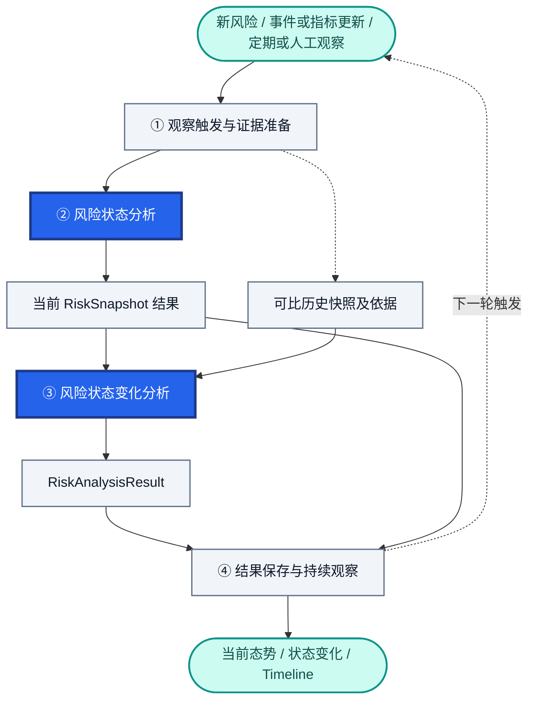
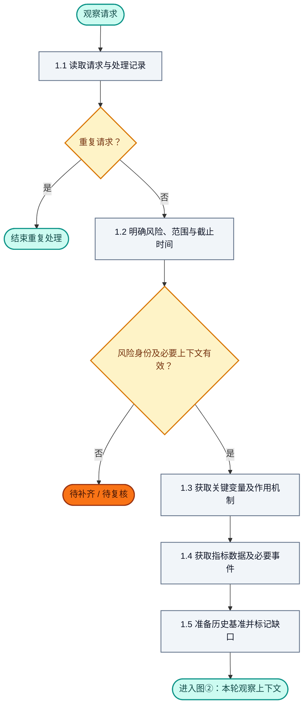
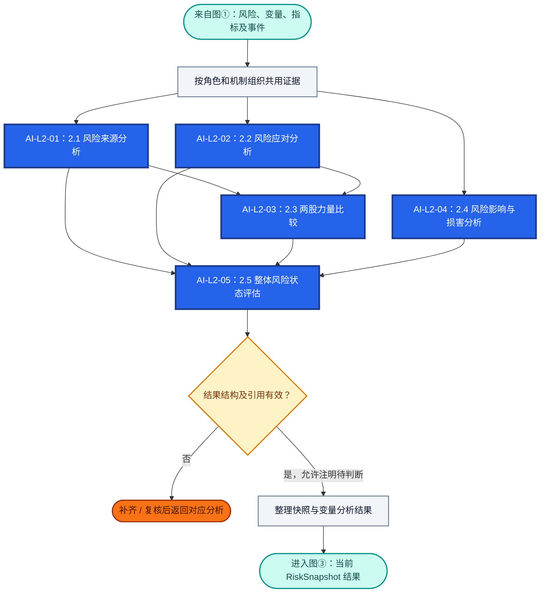
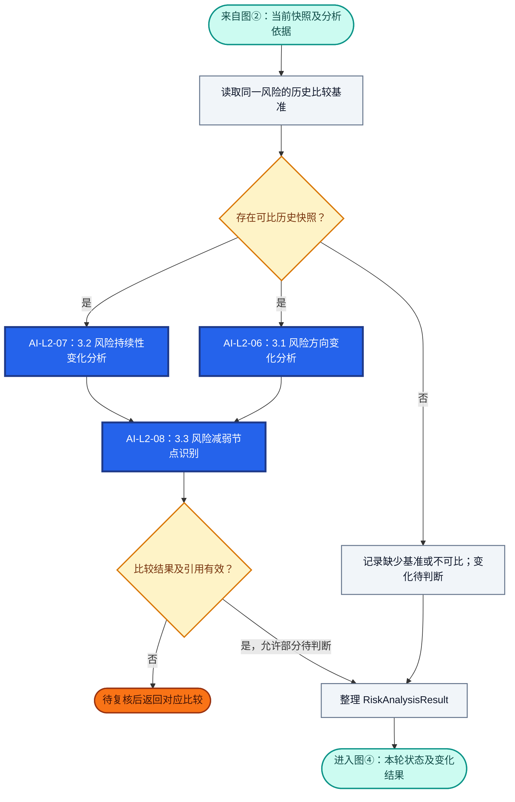
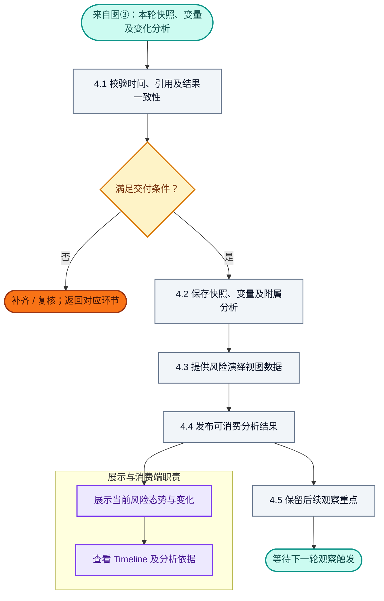
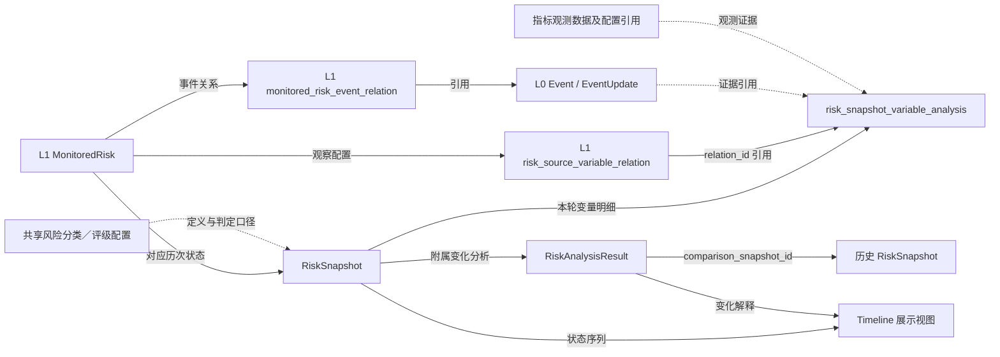

# RiskHot L2 风险态势分析层：业务架构与领域设计

> **文档版本**：V1.0（讨论整合稿）  
> **编制日期**：2026-10-10  
> **设计范围**：RiskHot / L2 风险态势分析层 / 首版宏观经济金融风险  
> **设计基线**：L0 Event / EventUpdate；L1 MonitoredRisk、风险—风险源—关键变量关联、风险—事件关联；L2 RiskSnapshot、变量分析记录、RiskAnalysisResult。  
> **设计依据**：本轮关于 L2 的业务流程、字段与边界讨论；用户提供的《业务架构与领域设计模板.md》。  
> **内容约定**：以本轮最后确定的口径整理；区分已确认设计、已讨论方案与待讨论项。未确定的规则、字段、算法、Prompt、接口及审批条件标注“待讨论”，不补设具体值。

**本版口径摘要**：RiskSnapshot 用“程度、阶段、范围、持续性”描述当前状态；持续性包含基于当前证据的条件性展望；方向变化和持续性变化由后续风险状态变化分析完成。损害兑现结论并入 `status_summary`，取消独立的 `realization_degree` 和可信度维度。

## 1. 业务能力与职责设计

### 1.1 业务定位与总体职责

L2 接收 L1 已纳管风险的观察定义、关键变量及事件关联，结合截至指定时间可获得的指标数据和事件事实，分析风险来源、风险应对、实际影响与损害，形成当前风险快照；随后比较当前与历史快照，判断风险方向与持续性预期的变化，并分析是否出现风险减弱节点。

本层主要回答：**风险当前有多严重、处于什么阶段、影响了谁及哪些范围、可能持续到何时或什么条件改变；相比此前，风险方向和持续性发生了什么变化？**

L2 对风险态势分析结果及其证据追溯负责。风险身份、长期观察定义和关键变量作用机制由 L1 管理。

### 1.2 核心业务能力与责任

| 业务能力 | 回答的业务问题 | 本模块承担的责任 | 主要交付结果 |
| --- | --- | --- | --- |
| 观察上下文准备 | 本轮观察什么风险、截至何时、依据什么？ | 获取风险定义、变量作用机制、指标数据及必要事件，明确时间和范围 | 本轮风险观察上下文 |
| 风险状态分析 | 当前风险的程度、阶段、范围及持续性如何？ | 分析风险来源、应对力量、两股力量对比、影响主体及损害，综合形成当前状态 | RiskSnapshot；本轮关键变量分析结果 |
| 风险状态变化分析 | 相比历史，风险方向及持续性判断有何变化？ | 比较可比快照，解释变化原因，分析减弱节点 | RiskAnalysisResult |
| 结果管理与持续观察 | 如何保存、展示并继续跟踪？ | 校验引用和状态口径，保存历史结果，提供 Timeline 和下一轮观察重点 | 可追溯的快照、变化分析及展示数据 |

**横向质量与追溯职责**：保留指标及事件来源、数据时间、分析截止时间和必要的配置／规则版本引用；处理重复输入；保留证据缺口、反证和判断限制；不以新结果覆盖当时的历史判断。具体版本结构、复核权限及重试策略待讨论。

**能力与环节的对应**：上述能力对应第 1.3 节四个环节。关键变量分析是风险来源、风险应对、影响与损害分析的共用内部处理，不额外增加主业务环节。

### 1.3 业务能力划分

| 环节 | 业务能力／环节名称 | 输入 | 核心处理 | 主要输出 |
| --- | --- | --- | --- | --- |
| ① | 观察触发与证据准备 | 观察触发、L1 风险及变量、L0 事件、指标数据 | 确定风险、时间和范围，组织证据，准备可比历史记录 | 本轮观察上下文 |
| ② | 风险状态分析 | 本轮上下文 | 来源分析、应对分析、力量比较、影响与损害分析、整体状态评估 | 待保存的 RiskSnapshot 及变量分析结果 |
| ③ | 风险状态变化分析 | 当前快照结果、可比历史快照及其依据 | 方向变化、持续性变化、减弱节点分析 | RiskAnalysisResult |
| ④ | 结果保存与持续观察 | 当前快照、变量分析、变化分析 | 校验、保存、提供展示、保留下次观察重点 | 正式分析记录及下游可消费结果 |

### 1.4 首版职责覆盖范围

| 维度 | 首版范围与责任 | 讨论状态 |
| --- | --- | --- |
| 业务领域与服务对象 | 分析已由 L1 纳管的宏观经济金融风险；个别主体可作为影响证据，不据此自动新增微观风险对象 | 沿用讨论基线 |
| 输入与触发 | 新风险纳管、有效事件更新、指标更新、定期观察、人工发起 | 触发类型已讨论；具体条件待讨论 |
| 核心业务对象 | RiskSnapshot 为核心实体；变量分析为快照明细；RiskAnalysisResult 为快照附属分析结果 | 沿用讨论方案 |
| 当前状态维度 | 程度、阶段、范围、持续性；不单列可信度 | 已确认 |
| 持续性 | 根据当前证据，风险可能持续到何时，或什么条件改变 | 已确认 |
| 历史变化 | 重点分析风险方向变化和持续性变化；进一步分析减弱节点 | 两项变化维度已确认；节点细则待讨论 |
| 配置与共享资源 | 复用风险、变量、指标及等级配置；不在 L2 重建同义字典 | 已讨论；变量—指标关系待讨论 |
| 生命周期与历史 | 保留快照及依据；不由 L2 直接修改 L1 风险身份或跟踪状态 | 已讨论；修订及反馈协议待讨论 |
| 下游交付 | 当前风险态势、历史变化、Timeline、下一轮观察重点 | 已讨论；接口与发布条件待讨论 |

### 1.5 上下游职责分工

| 业务层／模块 | 承担的业务职责 | 核心业务产物 | 与本模块的协作 |
| --- | --- | --- | --- |
| L0 信息处理层 | 维护结构化事件、事件更新及原始信息引用 | Event、EventUpdate、Information、事件直接变量关联 | 提供事件事实与更新；L2 只引用 |
| L1 风险识别与纳管层 | 管理风险身份、观察对象和范围、风险机制、关键变量及事件关系 | MonitoredRisk、risk_source_variable_relation、monitored_risk_event_relation | 提供观察定义及配置；接收需要维护定义或变量的反馈 |
| 指标数据及共享配置 | 提供指标定义、统计口径和实际观测值 | variable_config、indicator_config、指标数据 | 根据变量获取观测证据；具体接入归属待讨论 |
| L2 风险态势分析层 | 当前状态分析与历史变化分析 | RiskSnapshot、risk_snapshot_variable_analysis、RiskAnalysisResult | 本文设计范围 |
| 展示／消费端 | 展示已发布结果并支持查看依据 | 当前态势、变化卡片、Timeline | 消费 L2 结果；不在展示端另行生成风险结论 |

**对象与语义边界**：

| 概念 | 统一含义 | 责任归属 |
| --- | --- | --- |
| `observation_target` | 这项风险判断所针对的观察对象／系统 | L1；不能直接据此认定其为损害主体 |
| `scope_boundary` | 针对观察对象，本项风险研究和评估覆盖哪些方面及边界 | L1；不表达当前实际影响 |
| 潜在损害主体 | 根据风险机制，可能承受不利后果的主体或系统 | 优先引用 L1 定义和机制；L2 必要时补充分析并保留依据 |
| 实际受影响主体 | 截至本次观察，有证据支持其承受风险压力的主体 | L2 风险影响与损害分析 |
| 已发生损害的主体 | 实际受影响主体中，已有具体损害事实支持的主体 | L2；受到压力与损害兑现分别判断 |
| `affected_scope` | 本次实际影响的主体、范围及环节 | L2；首版用文字统一描述 |

### 1.6 职责边界与暂不承担事项

L2 复用 L0 的采集、事件归组和原文引用，不重复建设信息获取流程；复用 L1 的风险定义、`variable_role` 和 `impact_mechanism`，不在每次快照中重新定义整套风险机制。

本层不执行风险新增纳管、正式风险合并、风险观察范围的自动扩张，也不直接执行暂停或关闭 MonitoredRisk。分析发现定义、机制或变量配置问题时，交由 L1 维护，具体协作方式待讨论。

本层不输出交易执行、持仓调整或投资应对决策。风险应对分析观察的是治理措施及缓冲效果，不承担为用户制定应对行动的职责。

首版不额外建立独立指标证据明细表、风险传导图谱实体或 RiskEvolution 核心实体；Timeline 由已有快照及变化分析构建。正式物理存储和扩展条件见第 4 章。

## 2. 业务架构设计

### 2.1 总体业务流程

**流程关键约束**：②先形成当前状态结果，③再与历史比较，④统一处理正式保存与交付；图中“形成快照”不表示必须在②提前完成数据库提交。无历史基准时，③形成待判断说明，不阻止保留首次当前状态。③技术执行失败时是否允许②独立发布，待讨论。

风险状态分析可以利用指标自身的历史数据解释当前水平、同比或环比；整项风险相对于历史快照的方向变化及持续性变化归③。当前两股力量的相对作用归②，两者的前后变化归③。

### 2.2 详细业务流程

各图对应第 1.3 节四个环节。圆角节点表示入口、出口、正常结束或暂停；详细字段和口径位于图下。

| 详图 | 对应业务环节 | 入口 | 出口及衔接 |
| --- | --- | --- | --- |
| 图① | 观察触发与证据准备 | 观察请求及风险引用 | 图②；重复结束或等待补齐 |
| 图② | 风险状态分析 | 有效观察上下文 | 当前快照与变量分析结果，进入图③ |
| 图③ | 风险状态变化分析 | 当前快照及历史基准 | 变化分析结果或待判断说明，进入图④ |
| 图④ | 结果保存与持续观察 | 本轮各项分析结果 | 正式结果交付，等待下一轮；或返回相关环节复核 |

**颜色图例**：蓝底白字＝AI 分析；灰色＝程序处理；浅黄＝规则校验与结果分支；橙色＝待复核或条件待确认；青绿＝入口、出口与正常结束；紫色＝下游职责。

**AI 编号口径**：图中编号与第 6.1 节一致，用于追溯已讨论的分析职责。编号属于本文件的逻辑编排标识；一次调用完成哪些任务、是否并行及是否合并，待讨论，不据此划分独立服务。

#### 2.2.1 图①：观察触发与证据准备

| 步骤 | 业务工作 | 输入与输出 | 规则引用 |
| --- | --- | --- | --- |
| 1.1 | 接收触发并检查重复 | 读取新风险、事件、指标、周期或人工请求；区分重复通知和本轮有效观察 | BR-L2-01 |
| 1.2 | 明确观察对象定义、范围与时间 | 获取 MonitoredRisk，确定 `risk_id`、`snapshot_time` 和本轮适用定义 | BR-L2-02 |
| 1.3 | 获取观察变量与机制 | 读取本风险的 `risk_source_variable_relation`、变量定义、角色及 `impact_mechanism` | BR-L2-03 |
| 1.4 | 准备观测证据 | 根据变量获取指标实际值及必要历史数据，按需补充相关 Event / EventUpdate | BR-L2-04 |
| 1.5 | 准备比较基准和缺口说明 | 读取同一风险的历史快照及其依据，标记时间、口径、覆盖与可比性限制 | BR-L2-02、12 |

**处理口径与边界**：`indicator_config` 提供指标定义和口径，指标实际观测值来自对应数据存储；变量与指标的关联方式仍待讨论。无须对每个变量强制补充事件，量化指标充分时可直接使用。

通过 `monitored_risk_event_relation` 获取相关事件后，按本轮变量、观察范围和截止时间筛选。该关联中的 `event_update_id` 记录首次建立关联的依据；后续进展应通过 L0 的事件更新记录获取，不能只读取首次更新。

缺少部分指标时，应携带缺口进入分析并限制结论。风险身份无效、引用失效等问题需先修复；必需输入集合、暂停／关闭风险的触发规则及补齐责任待讨论。复核或补齐后回到本图相应的数据准备步骤。

#### 2.2.2 图②：风险状态分析

| 步骤 | 业务工作 | 应形成的内容 | 规则引用 |
| --- | --- | --- | --- |
| 2.1 | 风险来源分析 | 当前推动风险形成、扩大的力量，以及传导条件是否成立 | BR-L2-03、04、05、06 |
| 2.2 | 风险应对分析 | 治理措施及缓冲条件是否出现、是否落实、效果是否体现 | BR-L2-03、04、05、06 |
| 2.3 | 两股力量比较 | 当前风险压力与缓解力量哪方占优势，或是否无法判断 | BR-L2-06 |
| 2.4 | 风险影响与损害分析 | 潜在损害主体的引用／补充、实际受影响主体与范围、损害兑现及限制 | BR-L2-07 |
| 2.5 | 整体风险状态评估 | 程度、阶段、范围、持续性及综合状态说明 | BR-L2-08、09、10、11 |

**2.1 风险来源分析的内部处理**：按 `risk_id` 从 `risk_source_variable_relation` 获取 `risk_driver`、`risk_transmission` 变量；读取变量定义与作用机制；使用本轮指标及必要事件判断当前状态和作用；按风险来源汇总驱动与传导压力。具体风险源分类由 `risk_source_config` 维护，本层不重新定义分类。

**2.2 风险应对分析的内部处理**：主要使用 `risk_buffer` 变量及相关治理事件，分别判断措施出现、实施及效果。已宣布措施可以作为后续持续性展望的条件，不能直接计作已经发生的缓解效果。角色用于组织证据，当前作用需要独立分析。

**2.3 两股力量比较的内部处理**：综合风险来源与实际应对效果，形成来源占优势、应对占优势、大致均衡或无法判断的定性结论。上述分类为已讨论方案，正式枚举待讨论。不以某一方占优势直接确定风险等级，也不据此直接产生 `trend`。

**2.4 风险影响与损害分析的内部步骤**：

| 内部步骤 | 处理 | 边界 |
| --- | --- | --- |
| 2.4.1 | 引用风险定义与机制中的潜在损害主体；必要时补充分析 | 不把 `observation_target` 自动等同于损害主体；补充内容说明依据 |
| 2.4.2 | 获取损害验证变量及相关指标、事件 | 优先使用 `damage_verification` 变量，同时复用已有相关证据 |
| 2.4.3 | 识别实际受影响主体、范围和环节 | 当前有证据支持的影响与潜在影响分开表述 |
| 2.4.4 | 判断哪些损害已经发生、哪些尚未证实 | 从 `definition` 中识别待验证损害；结论汇入 `status_summary` |

**共用的关键变量分析**：2.1、2.2、2.4 内部均采用“观测指标及实际值／必要事件 → 变量当前状态 → 按 `impact_mechanism` 判断当前作用”的逻辑。产生的明细使用 `risk_snapshot_variable_analysis` 承载，具体字段见第 4.4 节。已得到的同一证据或变量状态可以复用，汇总阶段不重复计算同一压力。

**2.5 的四个状态维度**：

| 状态维度 | 字段 | 本轮要回答的问题 |
| --- | --- | --- |
| 程度 | `risk_level` | 当前风险压力和实际损害有多严重？ |
| 阶段 | `risk_stage` | 当前主要处于积累、传导、兑现还是修复阶段？ |
| 范围 | `affected_scope` | 当前实际影响了哪些主体、市场和环节？ |
| 持续性 | `persistence_outlook` | 根据当前证据，风险可能持续到何时，或什么条件改变？ |

`status_summary` 综合保留风险来源、应对、力量比较、损害兑现及判断限制。取消独立的可信度维度，不取消证据引用、反证与缺口说明。风险等级规则尚未确定时，不强制赋予等级。

**AI、程序与人工分工**：AI 负责分析及解释；程序负责读取数据、引用映射、结构约束、数值计算及保存；歧义、引用错误或规则不足按需复核，权限与条件待讨论。2.1、2.2、2.4 在逻辑上可并行；2.3 依赖前两项，2.5 汇总全部结果。具体调用合并和并行策略待讨论。

**本环节规则**：指标历史比较可以辅助判断当前状态；整项风险的历史方向留给③。阶段标签不能替代风险程度，治理措施出现不能替代实际效果，损害未得到证实不能写成确定没有损害。

**复核衔接**：数据或引用问题返回①，分析解释或范围问题返回相应的 2.1—2.5，L1 机制与配置问题交由 L1 维护。未决规则不自动视为通过。

#### 2.2.3 图③：风险状态变化分析

| 步骤 | 业务工作 | 应形成的内容 | 规则引用 |
| --- | --- | --- | --- |
| 3.1 | 风险方向变化分析 | 比较前后风险程度、阶段、影响范围及来源与应对证据，判断加剧、维持或减弱 | BR-L2-12 |
| 3.2 | 风险持续性变化分析 | 比较预计持续时间、持续条件及改变条件，说明预期延长、缩短、无实质变化或无法判断 | BR-L2-13 |
| 3.3 | 风险减弱节点识别 | 综合方向和持续性变化，判断是否出现减弱信号、候选节点及后续验证需求 | BR-L2-14 |

**比较输入**：当前和历史快照的四个维度、`status_summary` 及相关变量分析明细。来源、应对和损害信息暂未单独建成快照字段，应从状态说明和明细中读取，不能假定系统已有独立评分或分类记录。

**方向与持续性的区别**：当前风险仍处于高等级，也可能相较此前减弱；当前压力减轻，同时风险持续条件可能仍然存在。方向和持续性变化分别分析，不能相互替代。

**持续性比较口径**：比较持续预期是否被新证据实质修订，以及条件是否改变。时间自然过去、预计剩余天数变少，不足以说明持续预期缩短。条件型展望缺少明确日期时，可以解释条件变化；无法可靠判断延长或缩短时保留待判断。

**首次及不可比处理**：没有历史基准时保留当前快照，方向和持续性变化均待判断，减弱节点不作确定结论。风险范围、配置或分析口径发生实质变化时，需说明可比性限制，不能强行给出变化方向。主比较快照选择规则待讨论。

**复核衔接**：基准选择问题返回①／本图读取步骤；比较问题返回 3.1 或 3.2；节点判断问题返回 3.3。结果结构错误与业务上允许的待判断应分别处理。

#### 2.2.4 图④：结果保存与持续观察

| 步骤 | 业务工作 | 输出 | 规则引用 |
| --- | --- | --- | --- |
| 4.1 | 结果一致性校验 | 风险身份、截止时间、证据引用、比较基准及字段归属检查结果 | BR-L2-02、08、12、15 |
| 4.2 | 保存本轮分析 | RiskSnapshot、变量分析记录、附属 RiskAnalysisResult | BR-L2-15 |
| 4.3 | 提供风险演绎视图数据 | 历次快照与变化说明组成的 Timeline 数据 | BR-L2-15 |
| 4.4 | 发布分析结果 | 当前状态、方向变化、持续性变化和减弱节点信息 | BR-L2-15 |
| 4.5 | 持续观察及必要反馈 | 下一轮观察重点；需要调整 L1 观察定义或变量的反馈 | BR-L2-16 |

**一致性与分发口径**：本轮快照、变量明细和附属变化结果应保持引用一致；正式保存成功后提供下游消费。首次观察可以有快照和待判断的变化结果。数据库事务、异步交付、重复执行标识及部分失败发布策略待讨论。

**下游边界**：展示端根据已发布结果展示四个当前状态维度、两项变化维度及 Timeline。治理行动、投资操作和交易决策不由此步骤生成。L2 对 L1 的维护反馈不能直接更改风险身份或跟踪状态。

### 2.3 主要业务处理分支

| 场景 | 处理路径 | 业务结果 | 未决条件 |
| --- | --- | --- | --- |
| 新纳管风险首次观察 | ①→②→③无基准→④ | 首次快照及变化待判断结果 | 首次启动及发布细则待讨论 |
| 有效新证据与可比历史 | ①→②→③正常比较→④ | 新快照、方向与持续性变化、节点判断 | 触发阈值及基准选择待讨论 |
| 相同通知重复到达 | ①重复结束 | 不重复生成或发布同一次处理结果 | 幂等标识待讨论 |
| 周期到达但无新数据 | ①判断是否开展本轮观察 | 可以记录观察完成或继续分析；不凭无新闻断言风险维持 | 快照生成规则待讨论 |
| 指标缺失、过期或存在反证 | ①标记→②限制结论→③按可比性处理 | 有依据的部分结论及缺口说明 | 证据充分性门槛待讨论 |
| 应对措施仅已宣布 | ②分别记录措施与效果 | 不直接认定缓解已生效；可作为持续性条件 | 效果判据待讨论 |
| 发现局部主体受影响 | ②2.4→2.5 | 明确局部范围及已验证损害 | 不自动扩展为整体损害 |
| 当前等级未变但内部压力改善 | ②评估当前→③比较 | 允许等级相同而方向为减弱 | 方向判定细则待讨论 |
| 预计结束时间未修订，仅时间经过 | ③3.2 | 不仅因剩余时间减少判为缩短 | 时间和条件型比较细则待讨论 |
| L1 范围或机制变更 | ①读取适用配置→③检查可比性 | 说明不可比或部分可比；必要时复核 | 定义及配置版本策略待讨论 |
| 原始数据纠正 | ①读取纠正→按修订策略处理 | 保留旧判断，形成可追溯修订 | 修订结构待讨论 |
| ③运行失败，②已有有效结果 | 保留可用分析结果，进入异常处理 | 不将技术失败伪装成稳定或无风险 | 是否独立发布②待讨论 |

## 3. 业务规则设计

### 3.1 业务规则索引

| 编号 | 规则名称 | 适用业务步骤 | 规则原则 | 依据与状态 |
| --- | --- | --- | --- | --- |
| BR-L2-01 | 观察触发与重复处理 | 1.1 | 对有效观察需求处理，避免同一次输入重复产生结果 | 已讨论；阈值待讨论 |
| BR-L2-02 | 时间、范围与配置口径 | 1.2—1.5、4.1 | 固定观察截止时间及范围，保留适用口径和引用 | 已讨论；版本实现待讨论 |
| BR-L2-03 | 变量与作用机制复用 | 1.3、2.1、2.2、2.4 | L1 定义一般机制，L2 判断当前条件与作用 | 已讨论 |
| BR-L2-04 | 指标及事件证据 | 1.4、2.1、2.2、2.4 | 指标数据为主要依据，事件按需补充，来源与时间可追溯 | 已讨论；匹配和充分性门槛待讨论 |
| BR-L2-05 | 变量状态与当前影响 | 2.1、2.2、2.4 | 状态明确不等于实际风险作用已确认；缺口需保留 | 已讨论；枚举待讨论 |
| BR-L2-06 | 来源、应对与力量比较 | 2.1—2.3 | 分开判断压力、措施、效果，比较当前两股力量 | 已确认的方法论方向；具体判据待讨论 |
| BR-L2-07 | 影响主体与损害兑现 | 2.4 | 观察对象、潜在损害主体、实际受影响及已损害主体分别判断 | 已确认 |
| BR-L2-08 | 当前状态维度及职责 | 2.5 | 当前状态采用程度、阶段、范围、持续性；方向留给③ | 已确认 |
| BR-L2-09 | 风险程度评估 | 2.5 | 综合压力、应对效果、损害及范围，不能简单加减变量数量 | 原则已讨论；分级方法待讨论 |
| BR-L2-10 | 阶段与当前影响范围 | 2.4、2.5 | 依据证据判断主要阶段和实际影响，不将标签当成等级或方向 | 已讨论；阶段枚举待讨论 |
| BR-L2-11 | 持续性展望 | 2.5 | 根据当前证据，判断可能持续到何时或什么条件改变 | 已确认 |
| BR-L2-12 | 比较基准与方向变化 | 1.5、3.1 | 同一风险的可比快照比较；首次或不可比时待判断 | 已确认的边界；基准策略待讨论 |
| BR-L2-13 | 持续性变化 | 3.2 | 比较时间预期与持续／改变条件，不将时间流逝等同预期修订 | 已确认的分析目标；枚举细则待讨论 |
| BR-L2-14 | 风险减弱节点 | 3.3 | 综合变化证据，减弱方向不能单独确认节点 | 已讨论；确认及失效规则待讨论 |
| BR-L2-15 | 保存、历史与交付 | 4.1—4.4 | 引用一致、保留历史、保存成功后交付 | 已讨论；协议待讨论 |
| BR-L2-16 | 后续观察与 L1 反馈 | 4.5 | 保存观察重点；观察定义及纳管状态仍由 L1 维护 | 已讨论；反馈协议待讨论 |

### 3.2 核心规则的业务判定口径

#### BR-L2-01 观察触发与重复处理

**适用条件**：新风险、有效事件或指标更新、定期观察及人工发起。  
**判定依据**：输入标识、事件／数据版本、已有处理记录及观察计划。  
**判定与动作**：重复请求不重复生成同一次结果；有效需求进入上下文准备。  
**边界情况**：无新信息不能直接得出风险稳定；周期观察是否生成内容近似的新快照需要单独决定。  
**未决部分**：触发阈值、周期、幂等键及暂停／关闭风险的触发权限待讨论。

#### BR-L2-02 时间、范围与配置口径

**适用条件**：所有本轮证据、状态判断及历史比较。  
**判定依据**：`risk_id`、`snapshot_time`、L1 定义与范围、指标观测和发布时间、事件状态。  
**判定与动作**：使用截止时间内可获得的材料；区分实际发生、宣布、预计发生及系统记录时间；保留本轮适用的定义和配置引用。  
**边界情况**：未来计划可以用于条件性持续展望，不能写作当前已兑现事实；后续修订数据不得无痕替换过去依据。  
**未决部分**：窗口长度、时间精度、历史版本字段及修订策略待讨论。

#### BR-L2-03 变量与作用机制复用

**适用条件**：来源、应对和损害分析。  
**判定依据**：L1 的 `relation_id`、`variable_id`、`variable_role`、`impact_mechanism` 和整体机制摘要。  
**判定与动作**：驱动与传导变量主要支持来源分析；缓冲变量主要支持应对分析；损害验证变量主要支持损害分析。按证据判断变量当前状态和机制条件。  
**边界情况**：角色不能直接决定当前影响方向；同一变量或证据可供多个分析问题引用，不重复计算。  
**未决部分**：一变量多角色／多风险源的正式关系约束、配置维护流程待讨论。

#### BR-L2-04 指标及事件证据

**适用条件**：为关键变量准备和使用观测证据。  
**判定依据**：指标定义、实际值、单位、统计对象、期限、来源及相关事件事实。  
**判定与动作**：一个变量允许使用多个指标；数据足以解释变量时不强制引入事件；事件补充解释原因、政策措施及难量化条件。  
**边界情况**：时间接近不自动证明因果；不同口径数据不可直接比较；缺少融资、主体暴露等证据时保留局限。  
**未决部分**：变量与指标的映射、数据源、时效阈值、证据充分性判据待讨论。

#### BR-L2-05 变量状态与当前影响

**适用条件**：每项关键变量的本轮分析。  
**判定依据**：有效观测值及事件、L1 作用机制。  
**判定与动作**：分别描述 `observed_state`、事实依据、当前风险作用和解释。分析结果以快照变量明细承载。  
**边界情况**：指标上涨可以成立，而上涨是否造成当前风险压力仍需机制和范围支持；缺失或冲突不自动视为中性。  
**未决部分**：`risk_effect` 的正式枚举、充分性门槛及独立发布约束待讨论。

#### BR-L2-06 来源、应对与力量比较

**适用条件**：2.1—2.3。  
**判定依据**：风险来源压力、传导状态、治理措施、缓冲条件及可验证效果。  
**判定与动作**：对当前两股力量分别说明依据，再给出相对作用结论。应对出现、应对实施及应对生效分别表述。  
**边界情况**：应对力度大可能伴随风险压力大；措施尚未显效时无法直接认定无效或充分有效；当前来源占优势不能直接推出风险较此前加剧。  
**未决部分**：力量比较的正式枚举与评估方法待讨论；不设未经确认的抵减公式。

#### BR-L2-07 影响主体与损害兑现

**适用条件**：2.4。  
**判定依据**：`definition` 中的不利后果、`mechanism_summary` 中的传导、损害验证变量及具体主体证据。  
**判定与动作**：先明确可能承受损害的主体，再依据证据识别当前受影响主体和范围，检查其中哪些损害已经兑现。结果分别体现在 `affected_scope` 与 `status_summary`。  
**边界情况**：观察对象不自动等于损害主体；受到压力与实际损害不相互替代；局部证据不扩大成全部主体的损害；没有证据不能断言损害未发生。  
**未决部分**：主体标准标识、逐项损害分类与量化口径待讨论；当前不恢复独立 `realization_degree` 字段。

#### BR-L2-08 当前状态维度及职责

**适用条件**：2.5 形成 RiskSnapshot。  
**判定依据**：来源、应对、力量对比及影响损害的分析结果。  
**判定与动作**：输出程度、阶段、范围、持续性和综合状态说明。方向及持续性变化只交给③。  
**边界情况**：取消可信度维度后，证据缺口、反证和条件限制仍需保留；字段没有可靠依据时不能强制赋值。  
**未决部分**：各字段正式类型、必填及待判断表示方式待讨论。

#### BR-L2-09 风险程度评估

**适用条件**：`risk_level` 判断。  
**判定依据**：当前驱动与传导压力、已经体现的应对效果、实际损害及其范围。  
**判定与动作**：依据适用于该风险的分级规则形成等级；规则未定或证据不足时保留待判断及文字说明。  
**边界情况**：未出现损害不自动等于低风险；已经有治理措施不自动降低等级；不以多条变量重复引用的同一证据累加风险。  
**未决部分**：等级数量、名称、阈值、权重、风险间可比性及分类型锚点待讨论。此前试算公式未被确认为正式方法，本版不纳入执行规则。

#### BR-L2-10 阶段与当前影响范围

**适用条件**：`risk_stage` 和 `affected_scope` 判断。  
**判定依据**：驱动形成、传导、损害兑现及修复证据，实际受影响主体和环节。  
**判定与动作**：可以描述当前主要阶段并说明混合状态；按已支持证据记录影响范围。  
**边界情况**：阶段不构成风险严重性排序；修复阶段需要修复证据，不能只依据应对公告；“是否扩散”涉及前后比较，应在③中解释。  
**未决部分**：阶段枚举、主阶段选择及混合阶段存储方式待讨论。

#### BR-L2-11 持续性展望

**适用条件**：`persistence_outlook`。  
**判定依据**：当前风险来源、应对进度、传导与损害，以及已知事件和关键条件。  
**判定与动作**：说明支撑风险持续的条件，提出有依据的可能持续时间或窗口，并说明哪些条件改变会使风险缓和、解除或延长。  
**边界情况**：不能合理估计日期时说明“持续时间暂无法判断”，仍可列出条件；预期落地时间与实际效果出现时间分别判断。  
**未决部分**：时间单位、预测窗口、条件的结构化字段及相关规则待讨论；首版以 TEXT 方案承载。

#### BR-L2-12 比较基准与方向变化

**适用条件**：3.1。  
**判定依据**：同一风险当前与历史快照的程度、阶段、范围、状态说明和变量依据。  
**判定与动作**：判断风险加剧、维持、减弱或待判断，解释核心变化，引用比较快照。  
**边界情况**：风险等级未跨档仍可出现方向变化；首次观察、定义范围改变或证据不可比时保留限制，不强制比较。  
**未决部分**：主比较快照选择、多基准支持和变化显著性门槛待讨论。

#### BR-L2-13 持续性变化

**适用条件**：3.2。  
**判定依据**：前后 `persistence_outlook`，预计结束时间／窗口、持续条件及改变条件的依据。  
**判定与动作**：说明预期延长、缩短、没有实质变化或无法判断，并记录时间或条件修订的原因。  
**边界情况**：时间自然经过不自动构成缩短；仅有条件变化而无法换算时间时，在 `change_reason` 解释，持续性变化可待判断。  
**未决部分**：条件型展望的比较、冲突条件处理及枚举细则待讨论。

#### BR-L2-14 风险减弱节点

**适用条件**：3.3。  
**判定依据**：方向变化、持续性变化、驱动条件、应对效果及支持／反向证据。  
**判定与动作**：分析是否出现减弱信号或候选节点，列出后续观察重点；后续证据用于验证此前候选。  
**边界情况**：单次 `easing` 不足以自动确认减弱节点；首次无基准不作确定节点判断。  
**未决部分**：候选／确认／失效的具体规则、时间要求、节点引用字段及正式枚举待讨论。

#### BR-L2-15 保存、历史与交付

**适用条件**：④。  
**判定依据**：当前快照、变量分析、变化分析及其引用。  
**判定与动作**：保持本轮风险、时间和关联一致；保存后交付；保留分析依据与必要版本，后续纠正不无痕覆盖历史。  
**边界情况**：当前状态有结果且变化待判断属于可表达的业务结果；技术失败、引用错误需单独处理。  
**未决部分**：事务边界、修订标识、重复结果、仅状态发布和附属分析物理存储待讨论。

#### BR-L2-16 后续观察与 L1 反馈

**适用条件**：4.5。  
**判定依据**：本轮尚未验证的关键条件、证据缺口和风险机制变动线索。  
**判定与动作**：记录后续观察重点；发现需要调整观察定义、变量或跟踪状态时，由 L1 接收并决定。  
**边界情况**：发现风险减弱节点不自动关闭风险；应对分析不生成交易动作。  
**未决部分**：反馈协议、权限、审核和调度规则待讨论。

### 3.3 尚未确认的规则

| 待定规则项 | 当前已知原则 | 待确认条件／规则值 | 影响范围 |
| --- | --- | --- | --- |
| 变量与指标匹配 | 已有变量定义、指标定义和实际值三层语义 | 待讨论：配置关联或动态匹配方式 | ①、2.1／2.2／2.4 |
| 指标数据时效及充分性 | 保留来源、时间、口径和缺口 | 待讨论：各变量的证据门槛 | ①、② |
| 风险程度分级 | 结合压力、有效应对、损害与范围 | 待讨论：等级、锚点、权重及计算方式 | 2.5、risk_level |
| 阶段分类 | 已讨论积累、传导、兑现、修复及待判断 | 待讨论：主阶段和混合阶段规则 | 2.5、risk_stage |
| 力量比较与变量作用枚举 | 允许定性判断及证据不足 | 待讨论：取值及判定条件 | 2.1—2.3 |
| 持续性展望 | 可以用时间或条件表达 | 待讨论：时间精度、条件结构与边界 | 2.5 |
| 持续性变化 | 比较预期修订和条件改变 | 待讨论：条件型、冲突及不可比处理 | 3.2 |
| 历史基准 | 同一风险且可比较 | 待讨论：上一条、固定窗口或其他基准 | ①、③ |
| 减弱节点验证 | 候选与后续确认区分 | 待讨论：确认／失效条件及引用方式 | 3.3 |
| 正式结果发布 | 保存与引用一致；首次变化可以待判断 | 待讨论：部分缺失、技术失败时的发布条件 | ④ |
| 配置版本与历史修订 | 历史依据应可追溯 | 待讨论：版本字段、回放和修订存储 | 全流程 |
| AI 编排与复核 | 逻辑职责已经列明 | 待讨论：合并调用、权限、重试及评测 | 第 6 章 |

### 3.4 核心验收场景

以下场景均为业务验收示意，不描述真实市场状态。对未确定的阈值只验证处理边界。

| 场景 | 前置条件与输入 | 期望业务结果 | 不应发生的结果 | 对应规则 |
| --- | --- | --- | --- | --- |
| 首次观察 | 风险有效、没有历史快照 | 当前状态可形成；两项变化待判断 | 自动填写“维持”或确认减弱节点 | 08、12、14 |
| 来源压力存在，应对仅已宣布 | 有压力证据，无治理效果数据 | 分别说明压力、措施与效果缺口 | 按公告规模直接降低风险等级 | 06、09 |
| 指标明确，作用不明 | 指标发生变化，关键机制条件未证实 | 变量状态可确定，当前影响待判断 | 把指标方向直接变为风险方向 | 05、12 |
| 存在局部实际损害 | 只有部分主体的可追溯证据 | 范围限定于已支持主体及环节 | 认定整个观察系统普遍受损 | 07、10 |
| 定义已包含潜在损害 | 当前证据可验证其中部分后果 | 损害结论写入 status_summary | 重新要求独立 potential_harm 或 realization_degree | 07、08 |
| 无可信度维度 | 证据存在缺口或反证 | 在说明与变量明细保留限制 | 删除限制或强行生成可信度分数 | 04、08 |
| 无法估计结束日期 | 有持续条件及可能改变条件 | 条件性 persistence_outlook | 编造精确风险结束时间 | 11 |
| 仅时间流逝 | 结束时间预期未变，无新证据 | 不仅因剩余天数下降判定 shortening | 自动判断持续性缩短 | 13 |
| 当前等级相同，压力与应对已有可比变化 | 前后快照及变量证据可比 | 方向可与等级跨档变化独立判断 | 仅因等级相同填写 stable | 12 |
| L1 定义版本改变 | 观察范围或机制实质调整 | 明确可比性限制，必要时待判断 | 无说明地产生方向结论 | 02、12 |
| 关联事件已多次更新 | 风险关系保留首次更新引用 | 读取截止时间内相关后续 EventUpdate | 只用首次更新作为当前证据 | 02、04 |
| 重复运行同一输入 | 已有处理结果 | 依据幂等规则避免重复结果 | 生成多条不可区分的同轮快照 | 01、15 |
| 发现风险机制需维护 | L2 证据与 L1 长期定义出现冲突 | 留痕并向 L1 反馈 | L2 自动重定义或关闭 MonitoredRisk | 03、16 |

规则列中的数字均指 `BR-L2-` 后缀编号。

## 4. 领域模型设计

### 4.1 核心领域模型

**RiskSnapshot 是 L2 的核心领域实体。** 每条快照表达一项 MonitoredRisk 在指定观察截止时间的当前状态与持续性展望。

变量分析记录是本轮快照的明细，RiskAnalysisResult 是基于当前及历史快照形成的附属分析结果。来源、应对、力量比较和损害分析首先作为处理结果使用，不据此增加四张独立业务表。RiskAnalysis 表示变化分析能力，暂不单独作为核心实体。

图中的“历史 RiskSnapshot”与 RiskSnapshot 是同一种领域对象的不同时间记录。图中实线表示业务关联或视图依赖，虚线表示证据引用；指标观测数据的物理存储尚未确定。

### 4.2 领域对象汇总说明

| 领域对象 | 对象类型与归属 | 业务含义 | 核心职责 | 主要关联对象与关系 | 讨论状态 |
| --- | --- | --- | --- | --- | --- |
| MonitoredRisk | 外部核心实体；L1 维护 | 已正式纳管的风险观察对象 | 提供稳定身份、定义、观察范围及机制 | 一个风险对应多次 RiskSnapshot | 已讨论，L2 只引用 |
| risk_source_variable_relation | 外部业务关联；L1 维护 | 本风险在某类风险源下需要观察的变量、角色与机制 | 提供长期观察清单及作用依据 | 被快照变量分析记录引用 | 已讨论 |
| monitored_risk_event_relation | 外部业务关联；L1 维护 | 风险与事件之间的正式关联 | 提供相关事件及关联原因 | 连接 MonitoredRisk 与 Event | 已讨论 |
| Event / EventUpdate | 外部事件及更新；L0 维护 | 可追溯事件事实与进展 | 为变量、措施和损害判断提供依据 | 经风险事件关系及证据引用使用 | 已讨论 |
| 变量／指标配置及观测数据 | 共享资源；配置与数据接入归属见第 5 章 | 变量含义、指标口径及实际数值 | 支持证据获取和变量状态判断 | 被变量分析使用 | 含义已讨论，映射与存储待讨论 |
| 风险分类／评级配置 | 共享配置；具体维护及规则表设计见第 4.6 节 | 风险源、维度、等级及判定口径 | 统一术语并提供适用的评估规则 | 被当前状态分析引用 | 命名与职责已讨论；等级规则待讨论 |
| RiskSnapshot | 核心领域实体；L2 维护 | 指定时间的风险当前状态及持续性展望 | 保存程度、阶段、范围、持续性和状态说明 | 引用风险；包含变量明细和附属变化结果 | 核心维度已确认 |
| risk_snapshot_variable_analysis | 快照分析明细；L2 维护 | 本次快照中一个风险—风险源—变量关联的状态与作用分析 | 保存指标／事件依据、状态、解释及局限 | 引用 snapshot_id 和 relation_id | 沿用已讨论命名；最终字段约束待讨论 |
| RiskAnalysisResult | 附属业务分析结果；L2 维护 | 当前与历史快照的方向、持续性变化和节点分析 | 记录比较基准、变化及原因 | 依附当前快照，引用历史快照 | 分析目标已确认；物理结构待讨论 |
| RiskAnalysis | 领域分析能力；L2 | 风险状态变化分析的执行能力 | 消费快照并形成 RiskAnalysisResult | 不据此设置独立风险分析主实体 | 沿用讨论方案 |
| Timeline | 派生展示视图 | 风险随时间的状态与变化轨迹 | 汇总历次快照与变化分析用于展示 | 消费 RiskSnapshot 和 RiskAnalysisResult | 不单独增加核心实体 |

**汇总口径**：中间分析结果和 AI 任务编号均不等同于领域实体或物理表。实体、明细、附属结果和视图按各自业务责任区分。

### 4.3 RiskSnapshot：风险状态快照

**领域定义**：一条记录表示某项已纳管风险在一个明确观察截止时间的状态判断，并根据当时证据给出持续时间或改变条件的展望。它同时保留当前状态与有条件的持续性预期，不直接保存整项风险的历史变化方向。

**建议物理表名**：`risk_snapshot`。以下为逻辑字段，不构成已完成的数据库 DDL。

| 逻辑属性／候选字段 | 建议类型 | 业务含义 | 约束与引用 | 讨论状态 |
| --- | --- | --- | --- | --- |
| `snapshot_id` | UUID | 本条风险快照身份 | 系统生成；具体生成时点待讨论 | 沿用已讨论字段 |
| `risk_id` | UUID | 所观察的正式风险 | 引用 `monitored_risk.risk_id` | 已讨论 |
| `snapshot_time` | TIMESTAMPTZ | 本次判断的信息截止时间 | 与数据观测／发布时间、记录生成时间区分 | 已讨论 |
| `risk_level` | ENUM／配置引用，待定 | 程度：当前风险压力与损害的严重性 | 规则或证据不足时允许待判断；数据库表达方式待定 | 状态维度已确认；分级待讨论 |
| `risk_stage` | ENUM，待定 | 阶段：当前主要发展阶段 | 依据阶段证据，不按阶段直接推断等级 | 状态维度已确认；取值待讨论 |
| `affected_scope` | TEXT | 范围：实际受影响主体、范围与环节 | 限于当前有依据的影响；与 L1 观察范围区分 | 已确认；结构化扩展待讨论 |
| `persistence_outlook` | TEXT | 持续性：可能持续到何时或什么条件改变 | 允许条件性表述和无法估时；注明依据与限制 | 已确认，替代 `persistence_status` |
| `status_summary` | TEXT | 当前风险状态综合说明 | 包含来源、应对、力量比较、损害兑现及必要反证／限制 | 已确认的整合口径 |
| `created_at` | TIMESTAMPTZ | 本记录生成时间 | 系统记录，与 `snapshot_time` 区分 | 沿用已讨论字段 |

**`status_summary` 的内容约定**：说明当前来源压力、应对措施与有效程度、两股力量对比、实际影响与损害，以及四个维度判断的重要依据。损害兑现仍参与分析，结果汇入该字段；取消独立字段不取消分析责任。

**`persistence_outlook` 的内容约定**：同时考虑支撑风险持续的条件、证据支持的可能时间／窗口及改变条件。有明确日期时说明条件；没有日期依据时按条件表达，不要求填写精确时长。

**阶段取值的已讨论方案**：

| 候选取值 | 中文含义 | 说明 |
| --- | --- | --- |
| `accumulation` | 积累 | 风险条件形成或聚集，尚未明显向后续环节传导 |
| `transmission` | 传导 | 压力已经沿机制影响后续环节 |
| `realization` | 兑现／释放 | 定义中的不利后果已得到实际证据支持 |
| `recovery` | 修复 | 受影响环节已有可观察的修复证据 |
| `undetermined` | 待判断 | 缺少足够证据确定主要阶段 |

以上取值为方案，正式枚举、混合状态及主阶段规则待讨论；不预设所有风险必须按同一线性顺序发展。

**行为与不变量**：基于指定风险和截止时间形成状态；关键结论能回溯到证据；分析可以存在缺口，但不能虚构确定性；历史记录和后续修订应可区分；风险身份与当前快照状态分别管理。

**生命周期**：已经讨论“形成当前状态结果 → 校验 → 保存／交付 → 后续持续观察”的处理过程，以及保留历史修订的要求。快照是否需要草稿、已发布、已修订等正式状态字段，迁移权限与条件待讨论，不在本版预设状态机。

### 4.4 关联对象与处理结果

| 对象／结果 | 业务含义 | 分类与身份 | 生命周期／持久化 | 与核心对象的关系 |
| --- | --- | --- | --- | --- |
| 快照变量分析 | 某一风险源—变量关联在本轮的状态、作用与证据 | 分析明细；引用 `relation_id` | 使用 `risk_snapshot_variable_analysis` 承载 | 归属本次 RiskSnapshot |
| 来源、应对与力量比较结果 | 风险来源压力、应对效果和当前相对作用 | 业务处理结果 | 关键结论进入 `status_summary`，相关依据保留在变量明细 | 作为当前快照形成依据 |
| 风险影响与损害分析结果 | 潜在及实际影响主体、范围、损害兑现与限制 | 业务处理结果 | 实际范围进入 `affected_scope`，损害说明进入 `status_summary` | 作为当前快照形成依据 |
| RiskAnalysisResult | 方向变化、持续性变化及减弱节点分析 | 附属结果；当前快照关联明确 | 作为快照附属结构保存；物理字段／附属结构待讨论 | 引用当前及历史快照 |
| 下一轮观察重点 | 尚需验证的变量、事件与条件 | 分析结果中的内容 | 由 `next_observation` 承载 | 依附 RiskAnalysisResult |

#### 4.4.1 risk_snapshot_variable_analysis：风险快照变量分析记录

**记录含义**：某次风险快照中，一个已选风险源—关键变量关联的当前状态、证据与作用分析。引用 `relation_id` 可以保持与 L1 的风险源、变量角色及作用机制对应。

| 逻辑属性／候选字段 | 建议类型 | 业务含义 | 约束与状态 |
| --- | --- | --- | --- |
| 记录 ID | UUID | 本条变量分析记录身份 | 正式字段名称待讨论 |
| `snapshot_id` | UUID | 属于哪次风险快照 | 引用 `risk_snapshot.snapshot_id` |
| `relation_id` | UUID | 正在分析哪项风险源—变量关联 | 引用 L1 关联；应属于快照对应的风险 |
| `observed_state` | TEXT | 变量当前状态 | 根据指标及必要事件归纳 |
| `evidence_content` | TEXT／JSONB，待定 | 本轮指标实际值、时间、口径及事件事实 | 内容已讨论；最终结构待讨论 |
| `source_refs` | JSONB，建议 | 指标记录、Event / EventUpdate 或原始信息的定位 | 引用结构待讨论 |
| `risk_effect` | ENUM，待定 | 变量当前体现的风险压力、缓解或无法判断 | 不能由 `variable_role` 自动决定 |
| `interpretation` | TEXT | 当前状态为何支持上述作用判断 | 引用 L1 `impact_mechanism` 并说明条件是否成立 |
| `uncertainty` | TEXT，可空 | 变量证据缺口、反证和适用限制 | 保留；不作为独立可信度评分 |
| `created_at` | TIMESTAMPTZ | 明细生成时间 | 系统记录 |

`risk_effect` 曾讨论 `pressure`、`relief`、`neutral`、`undetermined` 四个候选值，正式枚举及门槛待讨论。`neutral` 需要有效证据支持“未显示明确作用”，不能用于代替缺少证据。

此前提及的 `change_description` 可以描述指标或变量相对于自身历史数据的变化。当前是否保留独立字段待讨论；无论如何，整项风险的变化方向由 RiskAnalysisResult 表达。

**持久化口径**：沿用本轮方案，将有效变量分析及必要依据随本次快照保存，供汇总和历史追溯。正式主键、重复分析的版本、同一变量多角色记录及最小明细集合待讨论；不额外设计指标证据明细表。

#### 4.4.2 RiskAnalysisResult：风险状态变化分析结果

**结果含义**：基于当前与历史风险快照，重点分析风险方向变化、持续性变化，进一步形成减弱节点判断和后续观察重点。保持为当前快照的附属结果，暂不独立建立核心分析实体。

| 逻辑属性／候选字段 | 建议类型 | 业务含义 | 约束与状态 |
| --- | --- | --- | --- |
| `comparison_snapshot_id` | UUID，可空 | 本轮主要比较的历史快照 | 属于同一风险；无基准时可空；基准选择待讨论 |
| `trend` | ENUM | 风险方向：加剧、维持、减弱或待判断 | 输入来自前后可比状态和证据 |
| `persistence_change` | ENUM，待定 | 持续预期延长、缩短、无实质变化或待判断 | 同时考虑预计时间和条件变化 |
| `change_reason` | TEXT | 方向及持续性变化的主要原因 | 指出相关变量、来源、应对及条件变化，保留限制 |
| `weakening_node_status` | ENUM，待定 | 减弱节点判断状态 | 不由 `trend` 单独推导；确认和失效规则待讨论 |
| `next_observation` | TEXT | 下一步应关注的变量、事件、改变条件 | 不输出交易执行建议 |

当前快照身份由附属关系提供。是否在序列化结构中显式增加当前快照 ID、分析时间、版本及候选节点引用字段，待讨论。

| 字段 | 已讨论的候选取值 | 口径与状态 |
| --- | --- | --- |
| `trend` | `aggravating` / `stable` / `easing` / `undetermined` | 加剧／维持／减弱／待判断；沿用讨论方案 |
| `persistence_change` | `lengthening` / `shortening` / `unchanged` / `undetermined` | 延长／缩短／未实质变化／待判断；具体判据待讨论 |
| `weakening_node_status` | `none` / `candidate` / `confirmed` / `undetermined` | 未发现／候选／确认／待判断；确认及失效规则、历史节点引用待讨论 |

当持续条件变化但无法换算成时间延长或缩短时，仍需在 `change_reason` 记录，不能丢弃该部分分析。

### 4.5 领域关系与生命周期约束

| 对象 A | 关系 | 对象 B | 基数与可选性 | 一致性／历史约束 | 讨论状态 |
| --- | --- | --- | --- | --- | --- |
| MonitoredRisk | 被多次评估 | RiskSnapshot | 1 : 0..N；每个快照对应一个风险 | 风险身份保持稳定 | 已讨论 |
| RiskSnapshot | 包含变量明细 | risk_snapshot_variable_analysis | 1 : 0..N；正式发布最小集合待讨论 | 本轮明细与风险、时间及配置一致 | 关系已讨论；约束待定 |
| risk_source_variable_relation | 被历次分析引用 | risk_snapshot_variable_analysis | 1 : 0..N；每条明细对应一个关联 | L1 关系变更需可追溯，避免历史失去依据 | 已讨论；版本实现待定 |
| RiskSnapshot | 具有附属变化结果 | RiskAnalysisResult | 初始方案为 1 : 0..1 份当前附属结果 | 首次可保存待判断结果；多版本结构待讨论 | 建议方案 |
| RiskAnalysisResult | 引用主要历史基准 | RiskSnapshot | 0..1 个主要历史快照 | 同一风险且可比；多基准扩展待讨论 | 已讨论；选择规则待定 |
| Event / EventUpdate、指标数据 | 被引用为依据 | 变量分析及状态分析 | 允许多条证据，证据可复用 | 同一证据复用不重复计量；保留时间和来源 | 已讨论 |
| RiskSnapshot、RiskAnalysisResult | 构成 | Timeline | 多条记录形成视图 | 不增加独立 RiskEvolution 核心实体 | 已讨论 |

**生命周期边界**：L1 的 `tracking_status` 与 L2 的风险阶段、等级相互独立。风险阶段为修复或发现减弱节点，均不自动触发 L1 的暂停、关闭或重新纳管。

### 4.6 建议逻辑数据结构与待定设计

| 领域对象 | 逻辑结构／现有表映射 | 关键字段与约束 | 设计状态 |
| --- | --- | --- | --- |
| RiskSnapshot | `risk_snapshot` | 风险引用、截止时间、四个状态维度、综合说明 | 核心结构已讨论；DDL 待讨论 |
| 快照变量分析 | `risk_snapshot_variable_analysis` | `snapshot_id`、`relation_id`、状态、证据、作用及解释 | 沿用当前命名；字段类型与约束待定 |
| RiskAnalysisResult | 快照附属结构化结果 | 历史基准、方向、持续性变化、原因、节点、后续观察 | 逻辑属性已讨论；物理承载方式待定 |
| 变量／指标／风险来源配置 | `variable_config`、`indicator_config`、`risk_source_config` | 复用稳定编码和定义 | 已有命名；变量—指标映射待讨论 |
| 风险等级及评级规则 | `risk_level_config`；评级规则配置表名待讨论 | 等级名称与判定规则分工 | 等级及判定规则尚未定稿 |
| 风险分类 | `risk_dimension_config` | 用于风险类型及规则适用范围的引用 | L1 维护，L2 复用 |

**字段调整对照**：

| 早期内容 | 本版处理 | 当前归属 |
| --- | --- | --- |
| `realization_degree` | 取消独立字段 | 损害兑现仍分析，结论进入 `status_summary` |
| `evidence_confidence` | 取消可信度维度 | 证据缺口／反证进入变量 `uncertainty` 与综合说明 |
| `persistence_status` | 替换为 `persistence_outlook` | 当前证据下的持续时间或改变条件展望 |
| 快照核心字段中的 `trend` | 不作为当前状态属性 | 进入 RiskAnalysisResult |
| `comparison_snapshot_id`、`change_reason` | 作为比较分析内容 | 进入 RiskAnalysisResult |
| `risk_snapshot_variable_evidence`／`risk_snapshot_variable_indicator` | 本版采用变量分析命名 | `risk_snapshot_variable_analysis` |
| L1 `variable_impact_on_risk` | 本文按已讨论的新名称引用 | `risk_source_variable_relation.impact_mechanism` |
| 独立潜在损害字段 | 不新增 | 从 L1 `definition` 及机制中识别分析目标 |

| 待定设计项 | 需解决的问题 | 当前设计 |
| --- | --- | --- |
| 附属分析结果存储 | 使用快照内结构化字段还是其他附属存储 | 待讨论，暂不独立为核心实体 |
| 风险来源／应对／力量比较的结构化保存 | 是否需要独立展示和跨快照直接比较 | 当前进入说明与明细；扩展待讨论 |
| 实际影响主体与范围结构化 | 是否需要主体 ID、多项对象和范围分别统计 | 当前 `affected_scope` TEXT；扩展待讨论 |
| 持续性结构化 | 时间窗口、改变条件是否拆分字段 | 当前 `persistence_outlook` TEXT；扩展待讨论 |
| 快照级不确定性字段 | 是否恢复独立 `uncertainty` | 当前不作为必需字段；限制保留在说明与变量明细 |
| 变量明细主键、唯一性及版本 | 同一快照同一关联多次分析如何保存 | 待讨论 |
| 历史依据与修订 | 如何引用配置和规则版本、纠正旧快照 | 待讨论 |
| 物理字段和索引 | 数据类型、约束、索引、发布状态 | 待讨论 |

## 5. 业务接口与协作

### 5.1 上游 → 本模块：输入契约

| 上游对象／业务事件 | 本模块用途 | 必需语义与引用 | 边界说明 |
| --- | --- | --- | --- |
| L1 MonitoredRisk | 确定观察风险与边界 | `risk_id`、定义、观察对象、范围、机制；适用版本方式待讨论 | L2 不改写稳定身份 |
| L1 risk_source_variable_relation | 获取关键变量及一般作用逻辑 | `relation_id`、`risk_id`、`risk_source_id`、`variable_id`、`variable_role`、`impact_mechanism` | 当前变量状态由 L2 分析 |
| L1 monitored_risk_event_relation | 查找相关事件 | `risk_id`、`event_id`、关联原因，及可选首次依据 `event_update_id` | 不以首次更新引用代替全部相关后续进展 |
| L0 Event / EventUpdate | 补充当前事实和政策进展 | 事件和更新标识、内容、阶段、发生及记录时间、原始出处 | 按变量与范围选择；计划不作为已发生事实 |
| variable_config | 理解变量定义 | 变量身份、含义和解释口径 | 共享引用 |
| indicator_config | 理解指标和数据要求 | 指标身份、口径、单位、频率及允许来源 | 变量与指标关系待讨论 |
| 指标实际观测数据 | 分析变量当前状态 | 实际值、数据时点、发布时间、来源及必要历史值 | 接口、表名与同步方式待讨论 |
| risk_level_config 与评级规则 | 形成统一等级 | 等级定义、适用规则及版本 | 具体分级未确认时不强制评级 |
| 本模块历史快照及明细 | 为③准备可比历史基准 | 快照身份、时间、定义口径、状态与变量依据 | 只在整项变化分析中形成方向结论 |

本轮准备流程需明确 `risk_id` 和 `snapshot_time`。上述表中的业务要素已讨论，正式请求字段、必填结构及序列化格式待讨论。

### 5.2 本模块 → 下游：输出契约

| 输出 | 下游使用方式 | 交付条件 | 状态与版本约束 |
| --- | --- | --- | --- |
| RiskSnapshot | 展示程度、阶段、范围、持续性与状态说明 | 完成当前状态分析及有效引用校验 | 标明观察截止时间；保留适用规则／依据 |
| risk_snapshot_variable_analysis | 查看变量当前状态和分析依据 | 归属明确的本轮快照及 L1 关联 | 证据时间、来源、口径可追溯 |
| RiskAnalysisResult | 展示方向、持续性变化、原因及减弱节点 | 当前与历史基准关系明确；允许首次待判断 | 比较基准不混入当前状态维度 |
| Timeline 数据 | 展示历次风险演变 | 使用可消费的快照与变化记录 | 不独立编造新的风险结论 |
| 后续观察重点 | 指导后续信息收集与观察 | 来自尚需验证的变量、事件和条件 | 具体调度及任务生成方式待讨论 |
| 面向 L1 的维护反馈 | 提示定义、变量或跟踪状态维护需求 | 明确问题和证据 | L1 决定变更；反馈接口待讨论 |

### 5.3 业务事件与协作形式

L2 已讨论“保存后发布分析结果”，尚未确定正式事件名称或消息主题。本节仅登记协作语义。

| 业务事件／候选名称 | 业务含义 | 触发变化 | 讨论状态 |
| --- | --- | --- | --- |
| 当前风险状态可用；名称待讨论 | 本轮快照完成，可被消费 | 当前状态保存并通过交付校验 | 语义已讨论；事件定义待讨论 |
| 风险状态变化分析可用；名称待讨论 | 本轮比较结果可以查看 | 方向、持续性及节点分析保存 | 语义已讨论；是否单独分发待讨论 |
| 观察配置维护反馈；名称待讨论 | 本轮发现需要 L1 处理的问题 | 定义、变量或纳管相关问题出现 | 反馈原则已讨论；协议待讨论 |

业务层之间可以通过程序调用或异步方式协作，具体形式待讨论。本版不指定 HTTP 路径、队列主题或技术事件枚举，也不预设②和③必须分别发布。

### 5.4 展示与消费端数据边界

| 展示／消费场景 | 主数据来源 | 加工与判断责任 |
| --- | --- | --- |
| 当前风险态势卡片 | MonitoredRisk + 最新可用 RiskSnapshot | L1 提供身份与定义；L2 提供四个状态维度及说明 |
| 关键变量明细 | risk_snapshot_variable_analysis | 展示证据、变量状态及当前作用，支持回溯 |
| 风险变化卡片 | RiskAnalysisResult + 前后快照 | L2 判断方向及持续性变化；展示端使用现成结果 |
| 风险减弱节点 | RiskAnalysisResult | 节点确认规则由 L2 业务规则确定，当前细则待讨论 |
| 风险演绎 Timeline | 历次 RiskSnapshot + 附属变化结果 | 按时间组织，可查看比较基准和依据 |
| 今日新增风险 | L1 MonitoredRisk 的正式纳管时间 | 属于 L1 新增口径；L2 新快照不代表新增风险 |
| 观察对象与损害主体展示 | L1 observation_target + L2 affected_scope | 分别展示观察对象与当前实际影响，避免混用 |

### 5.5 未讨论的接口细节

| 设计项 | 当前约定／待确认内容 |
| --- | --- |
| API／消息主题／版本 | 待讨论 |
| 请求响应结构及错误语义 | 业务输入输出已列明；正式契约待讨论 |
| 幂等、重试与补偿 | 保留重复处理原则；技术机制待讨论 |
| 权限与人工复核入口 | 待讨论 |
| 指标数据接入和事件检索 | 来源语义已明确；接口及查询策略待讨论 |
| 分析结果的部分成功发布 | 待讨论 |
| 历史修订及配置版本获取 | 需可追溯；接口与存储待讨论 |
| L1 维护反馈与观察调度 | 责任边界已明确；协作流程待讨论 |

## 6. AI 任务设计

### 6.1 AI 任务边界与统一编号

AI 负责对观测证据进行变量及风险分析、解释当前状态和历史变化；程序负责数据读取、时间过滤、结构校验、引用验证、可复算数值处理和持久化。需要复核的业务判断由后续确定的人工流程承接。

以下编号对已讨论的分析工作进行统一引用，**属于逻辑任务编号方案**。不要求八次独立模型调用；一个任务内部可以复用变量分析结果，多个任务可以在合适的调用中合并。调用边界、并行程度及模型选择待讨论。

| AI 任务编号与名称 | 关联环节 | 主要输入 | 主要分析输出 | 后续执行责任 |
| --- | --- | --- | --- | --- |
| AI-L2-01 风险来源分析 | 图② 2.1 | 驱动／传导变量、指标、必要事件、L1 机制 | 来源变量状态与当前作用、风险来源摘要 | 程序校验和组织明细 |
| AI-L2-02 风险应对分析 | 图② 2.2 | 缓冲变量、治理措施、实施及效果证据 | 应对出现、实施、效果及限制，相关变量分析 | 程序保留措施与效果证据 |
| AI-L2-03 两股力量比较 | 图② 2.3 | 来源、应对分析及关键依据 | 当前相对作用结论及解释 | 交给整体状态评估，不能直接映射趋势 |
| AI-L2-04 风险影响与损害分析 | 图② 2.4 | 风险定义／机制、损害验证变量及主体证据 | 实际受影响主体与范围、损害兑现说明 | 交给 affected_scope 和 status_summary 汇总 |
| AI-L2-05 整体风险状态评估 | 图② 2.5 | 来源、应对、力量对比、影响损害及评级规则 | 四个状态维度与 status_summary | 程序校验后进入变化分析及保存 |
| AI-L2-06 风险方向变化分析 | 图③ 3.1 | 当前及可比历史快照、状态说明和明细 | trend 及方向变化依据 | 与持续性变化汇总 |
| AI-L2-07 风险持续性变化分析 | 图③ 3.2 | 前后 persistence_outlook 及相关证据 | persistence_change、时间／条件修订原因 | 与方向变化汇总 |
| AI-L2-08 风险减弱节点识别 | 图③ 3.3 | 方向与持续性变化、相关状态和证据 | weakening_node_status、节点依据、后续观察重点 | 形成附属 RiskAnalysisResult；规则不足时待判断 |

**共用变量分析契约**：AI-L2-01、02、04 可以使用同一类变量分析结构，包含 `relation_id`、`observed_state`、证据引用、`risk_effect`、`interpretation` 和 `uncertainty`。该共用方法不单独增加主业务环节，实际任务封装待讨论。

### 6.2 任务输入、输出与业务校验

| 任务 | 输出校验要求 | 无结果／不确定结果 | 校验失败后的处理 |
| --- | --- | --- | --- |
| AI-L2-01 | 变量关联属于本风险；指标与时间有效；依据与作用机制对应 | 来源压力或部分变量可以待判断 | 数据问题返回①；分析问题返回2.1 |
| AI-L2-02 | 区分措施宣布、实施、效果；不虚构治理力量 | 未见措施、效果未证实、证据缺口分别说明 | 返回①或2.2；必要时复核 |
| AI-L2-03 | 明确比较依据，不把优势关系直接变为等级或趋势 | 可以无法判断两股力量优势 | 返回来源／应对分析或2.3 |
| AI-L2-04 | 观察对象与损害主体分开；影响范围有证据；潜在与实际区分 | 可以尚未证实实际损害 | 返回①、L1补充机制或2.4 |
| AI-L2-05 | 四个状态字段口径一致；损害并入说明；持续性包含时间或条件 | 未定等级、阶段或时间允许注明待判断 | 返回对应分析；不强制生成虚假完整结果 |
| AI-L2-06 | 比较同一风险且基准可比；引用有效历史快照 | 首次或不可比使用待判断 | 返回基准准备或3.1 |
| AI-L2-07 | 比较预期实质修订，保留条件变化 | 无时间可比或条件冲突时允许待判断 | 返回3.2或复核 |
| AI-L2-08 | 不能只凭一次减弱认定确认节点；说明后续验证 | 无基准或规则不足时待判断 | 返回3.3或复核，规则待定不自动通过 |

结构、引用和枚举的程序校验不能替代语义证据审查。校验成功只说明结果满足已配置的要求，不证明全部因果判断已经得到现实验证。

### 6.3 Prompt 设计

目前仅整理已经讨论的分析目标和约束，不生成尚未确认的完整 Prompt。

| 任务 | 分析目标与步骤 | 约束与证据要求 | Prompt／版本状态 |
| --- | --- | --- | --- |
| AI-L2-01 | 读取驱动与传导变量 → 状态与作用判断 → 按来源汇总 | 复用 impact_mechanism；不输出整项风险前后方向 | 待讨论 |
| AI-L2-02 | 识别治理及缓冲 → 实施检查 → 效果判断 | 宣布、实施、效果分别表述 | 待讨论 |
| AI-L2-03 | 比较来源压力与实际缓解作用 | 只判断当前相对作用，不使用未确认计分公式 | 待讨论 |
| AI-L2-04 | 引用潜在主体 → 检查当前影响 → 验证损害 | 不混淆观察对象、受影响主体与已损害主体 | 待讨论 |
| AI-L2-05 | 综合四个状态维度 → 生成状态说明 | 保留条件性持续展望，取消可信度维度和独立损害字段 | 待讨论 |
| AI-L2-06 | 比较前后程度、阶段、范围及依据 → 形成方向 | 等级未变不自动等于方向维持 | 待讨论 |
| AI-L2-07 | 比较时间预期与条件 → 说明持续性修订 | 不将时间经过当作预期缩短 | 待讨论 |
| AI-L2-08 | 综合两类变化 → 分析候选节点 → 后续观察 | 不自动确认减弱节点，不生成交易决策 | 待讨论 |

### 6.4 结构化输出 Schema

第 4 章列明的是逻辑业务属性。JSON Schema、字段必填、枚举、容错与版本格式尚未定稿，本节保留待讨论状态。

| 任务 | 输入 Schema | 输出 Schema | 枚举与容错规则 | 讨论状态 |
| --- | --- | --- | --- | --- |
| AI-L2-01／02／04 的共用变量分析 | 风险、关系、指标及事件上下文；正式 Schema 待讨论 | 变量状态、证据、作用、解释、缺口；正式 Schema 待讨论 | risk_effect 候选值见4.4.1；正式约束待讨论 | 逻辑内容已讨论 |
| AI-L2-01 来源汇总 | 同上 | 来源当前状态摘要；结构待讨论 | 不足时允许限制性结论 | 待讨论 |
| AI-L2-02 应对汇总 | 同上及治理措施 | 应对状态、效果及限制；结构待讨论 | 实施阶段和效果枚举待讨论 | 待讨论 |
| AI-L2-03 | 来源与应对结果；正式 Schema 待讨论 | 当前力量对比与理由；结构待讨论 | 定性分类已讨论，正式取值待定 | 待讨论 |
| AI-L2-04 影响损害汇总 | 风险定义及损害证据；正式 Schema 待讨论 | 实际主体、范围、损害说明；结构待讨论 | 不新增独立 realization_degree 输出持久字段 | 逻辑内容已讨论 |
| AI-L2-05 | 各项当前分析与规则；正式 Schema 待讨论 | RiskSnapshot 的分析字段，见4.3 | 四个维度已确认；系统身份字段由程序提供 | Schema 待讨论 |
| AI-L2-06／07／08 | 当前及历史快照；正式 Schema 待讨论 | RiskAnalysisResult，见4.4.2 | 变化取值沿用方案，节点细则待讨论 | Schema 待讨论 |

### 6.5 AI 执行与质量保障

| 设计项 | 当前方案 | 未决内容 |
| --- | --- | --- |
| 模型选择与编排 | 以逻辑分析职责为边界，变量分析可复用 | 模型、合并调用、并行和成本策略待讨论 |
| 配置输入 | 程序读取有效定义、作用机制和指标配置供 AI 使用 | 版本获取、上下文裁剪和缓存待讨论 |
| 人工复核条件 | 证据冲突、引用错误、范围或规则无法确定时允许复核 | 具体权限、责任和时限待讨论 |
| 超时、重试及失败降级 | 技术失败与业务待判断分开处理 | 重试次数、补偿及部分发布待讨论 |
| 历史追溯 | 保留输入依据、规则／配置及必要模型版本 | 审计记录结构和保存期限待讨论 |
| 结果可比性 | 前后范围和口径检查 | 自动检查范围、重算与修订策略待讨论 |
| 评测样本与验收指标 | 第3.4节提供业务场景 | 样本集、量化指标及达标门槛待讨论 |

## 附录 A：设计决策与待定事项

| 编号 | 决策／待定问题 | 依据与讨论状态 | 影响章节 | 后续处理 |
| --- | --- | --- | --- | --- |
| D-01 | L2 名称采用“风险态势分析层” | 本轮已接受命名 | 全文 | 沿用 |
| D-02 | 主流程为准备、状态分析、状态变化分析、保存与持续观察 | 多轮讨论形成的流程基线 | 1、2 | 具体触发和发布细则待讨论 |
| D-03 | 风险状态分析采用来源、应对、力量比较、影响损害、整体评估五步 | 已讨论并调整后的基线 | 2、3、6 | 保持逻辑依赖 |
| D-04 | 当前状态采用程度、阶段、范围、持续性四个维度 | 用户最新明确要求 | 2—6 | 沿用 |
| D-05 | 移除可信度状态维度 | 用户明确要求 | 2—4、6 | 保留证据及反证说明，不恢复评分 |
| D-06 | 持续性包含可能持续时间或改变条件 | 用户明确重新定义 | 2—4、6 | 使用 persistence_outlook |
| D-07 | 风险方向变化与持续性变化归③ | 用户明确分析目标 | 1—6 | 不混入当前状态字段 |
| D-08 | 损害兑现结论并入 status_summary | 本轮字段简化方案 | 2—4 | 不保留独立 realization_degree |
| D-09 | 风险观察对象与损害主体区分 | 用户明确纠正 | 1—4 | L2 单独分析实际主体和损害 |
| D-10 | affected_scope 暂承载实际主体、范围和环节 | 本轮已讨论方案 | 2、4、5 | 是否拆分结构化字段待讨论 |
| D-11 | L1 机制用 impact_mechanism，L2 判断当前实际作用 | 本轮已讨论的边界与命名 | 2—6 | 不重复推导一般机制 |
| D-12 | 变量分析使用 risk_snapshot_variable_analysis | 本轮沿用方案 | 2、4—6 | 主键、类型、唯一性及版本待讨论 |
| D-13 | 不额外建立指标证据明细表 | 本轮精简方案 | 1、4 | 指标与事件引用在分析中保留 |
| D-14 | RiskAnalysisResult 作为快照附属结果 | 沿用已讨论方案 | 1、4、5 | 物理承载方式待讨论 |
| D-15 | Timeline 由快照和变化结果形成 | 沿用已讨论方案 | 2、4、5 | 不设独立 RiskEvolution 核心实体 |
| D-16 | 配置表统一使用 _config 后缀 | 用户明确命名规范 | 1、4—6 | 未定评级规则表名不擅自补设 |
| D-17 | 风险等级公式和阈值未确认 | 本轮仅讨论原则和试算方向 | 3、4、6 | 不把试验公式当成正式业务规则 |
| D-18 | 变量—指标关联及数据接入未确定 | 前序讨论明确的缺口 | 1—3、5 | 待讨论 |
| D-19 | 历史比较基准及不可比处理细则 | 原则已讨论，算法未定 | 2、3、6 | 待讨论 |
| D-20 | 时间流逝与持续预期修订区分 | 本轮持续性变化讨论 | 2、3、6 | 在变化原因中解释条件修订 |
| D-21 | 减弱节点确认和失效 | 仅有候选、后续验证原则 | 2—4、6 | 待讨论 |
| D-22 | 任务编号仅用于职责追溯 | 按模板统一编号，未确认调用粒度 | 2、6 | 编排和模型待讨论 |
| D-23 | 已发布历史及后续纠正应可追溯 | 沿用讨论要求 | 2—6 | 修订／配置／规则版本结构待讨论 |
| D-24 | 快照与变化分析能否分开发布 | 尚未形成正式结论 | 2、3、5、6 | 待讨论 |

## 附录 B：术语对照

| 术语 | 业务定义 | 易混淆概念与区别 |
| --- | --- | --- |
| 风险态势分析 | L2 对风险当前状态及其变化的分析 | L1 同样包含分析，但侧重风险识别与纳管 |
| 风险状态分析 | 依据当前证据形成快照及持续性展望 | 不判断整项风险相对于历史的方向 |
| 风险状态变化分析 | 比较当前与历史快照，重点判断方向和持续性变化 | 本文对原“风险演绎分析”采用的统一业务名称 |
| MonitoredRisk | L1 正式纳管的风险观察对象 | 与单次事件、某次快照和实际损害主体区分 |
| RiskSnapshot | 某一截止时间的风险状态及条件性持续展望 | 同一风险可以形成多次记录 |
| risk_source_config | 风险来源分类配置 | 与 L0 信息发布来源区分 |
| risk_source_variable_relation | 风险、风险源与观察变量的长期业务关联 | 不保存当前指标值 |
| variable_role | 变量在风险中的主要作用位置 | 不能直接确定当前作用方向 |
| impact_mechanism | 变量在什么条件下通过什么机制影响风险 | L1 的稳定机制；当前效果由 L2 判断 |
| indicator_config | 指标定义、单位和统计口径配置 | 实际数值由观测数据提供 |
| 变量证据 | 指标实际值及相关事件事实 | 与对这些事实的状态和影响解释区分 |
| 风险来源力量 | 当前推动风险形成与扩大的压力 | 与用于分类的 risk_source_config 区分 |
| 风险应对力量 | 针对风险的治理措施及缓冲作用 | 已宣布、已实施与已见效分别观察 |
| 损害兑现 | 风险定义中的不利后果已实际发生的情况 | 参与分析并进入状态说明，不独立设置字段 |
| observation_target | 风险判断针对的观察对象／系统 | 不能自动等同于潜在或实际损害主体 |
| scope_boundary | 观察及研究的范围边界 | 不表达当前实际影响 |
| affected_scope | 当前实际受影响主体、范围和环节 | “是否扩散”需要前后比较 |
| persistence_outlook | 根据当前证据，风险可能持续到何时或什么条件改变 | 包含有条件的前瞻判断 |
| trend | 相比历史的风险方向变化 | 当前等级相同也可能发生方向变化 |
| persistence_change | 相比历史的持续性预期修订 | 时间自然过去不自动构成预期缩短 |
| RiskAnalysisResult | 当前与历史快照的附属比较分析结果 | 暂不单独提升为核心业务实体 |
| Timeline | 基于历史快照与变化分析构建的时间视图 | 不据此新增独立风险演绎实体 |
