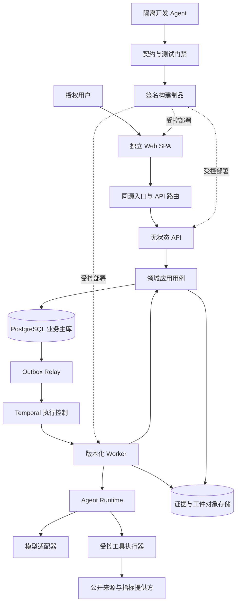
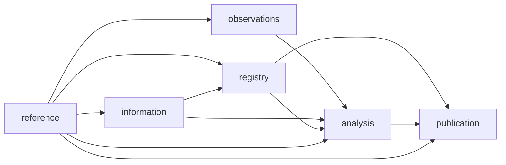
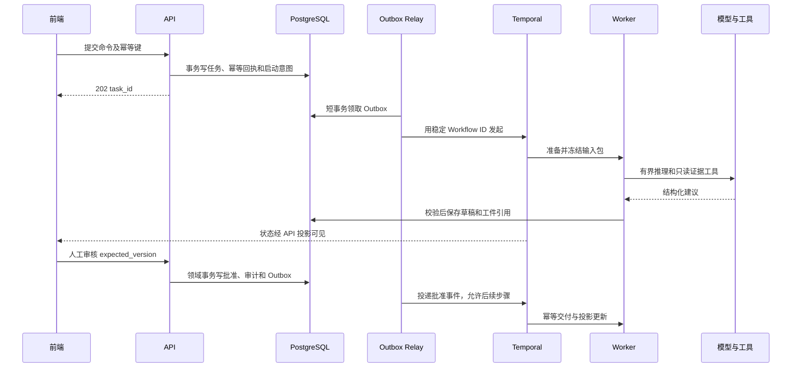
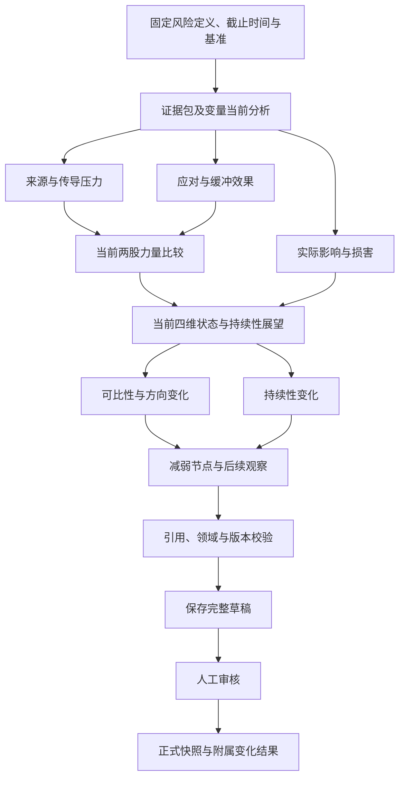
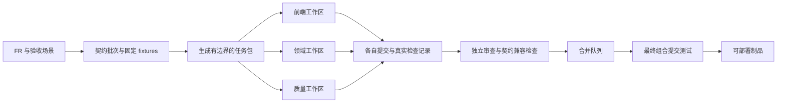

# RiskHot 系统架构设计

> 文档编号：RH-SAD-001  
> 版本：V1.0  
> 编制与外部资料核验日期：2026-10-10  
> 状态：完整架构评审稿；本次交付为设计文档与机器可读设计清单，尚未创建应用、部署服务或完成性能实测。  
> 适用范围：首版宏观风险研究系统，以及后续模型、规模和团队的演进。  
> 阅读对象：架构师、产品与业务负责人、前后端开发、数据工程、测试、运维和参与开发的 Agent。

**采用契约优先的模块化领域后端、完全独立的 Web 前端、持久工作流和可替换的 Agent 运行时。** PostgreSQL 保存正式业务事实；Temporal 负责跨故障执行；对象存储保存不可变证据与工件；模型提供受约束的研究建议。开发协作采用机器可检查的模块边界、独立工作区、契约生成和合并门禁。

这里的“面向未来”有明确含义：更强模型能接手更复杂的研究和开发任务，系统无需重写风险身份、业务规则、证据账本和前端契约；更换模型或 Agent 框架不改变正式结果的成立条件。本文不承诺某个未来型号必然存在，也不把模型能力提升等同于自动获得业务审批权。

## 阅读导航

- [1. 设计依据与决策口径](#basis)
- [2. 架构目标与质量约束](#goals)
- [3. 总体架构与运行边界](#overview)
- [4. 2026 技术基线](#stack)
- [5. 领域模块及依赖规则](#modules)
- [6. 仓库与代码组织](#repository)
- [7. 完全分离的前端](#frontend)
- [8. API、事件与契约](#contracts)
- [9. 数据、版本与证据](#data)
- [10. 持久执行、事务与恢复](#execution)
- [11. L0 与 L1 实现架构](#l0-l1)
- [12. L2 分析架构](#l2)
- [13. 风险产品与报告发布](#publication)
- [14. Agent 运行时与工具边界](#runtime)
- [15. 模型成长与升级路线](#evolution)
- [16. 身份、安全与数据治理](#security)
- [17. 可观测性与运行控制](#observability)
- [18. 部署、扩展与灾难恢复](#deployment)
- [19. 多 Agent 并行开发协议](#development)
- [20. 测试与架构验收](#verification)
- [21. 实施路线与交付阶段](#roadmap)
- [22. 架构决策记录](#adrs)
- [23. 需求追踪与待定项](#traceability)
- [24. 交付物、验证边界与资料索引](#delivery)

<a id="basis"></a>

## 1. 设计依据与决策口径

### 1.1 业务输入

本设计以当前工作区的以下文件为依据，旧 AIHOT 讨论不覆盖现行 RiskHot 领域模型：

| 编号 | 输入 | 本设计继承的重点 |
| --- | --- | --- |
| B0 | [[tools/RiskHot/02-业务架构与领域设计/RiskHot_L0_信息处理层_业务架构与领域设计V1.0|L0 信息处理层]] | 原文版本、事件身份、事件—对象—变量三元关系、增量与金融意义 M |
| B1 | [[tools/RiskHot/02-业务架构与领域设计/RiskHot_L1_风险识别与纳管层_业务架构与领域设计|L1 风险识别与纳管层]] | 完整风险候选、风险同一性、稳定纳管身份、长期变量配置、八字段事件关联 |
| B2 | [[tools/RiskHot/02-业务架构与领域设计/RiskHot_L2_Risk_Situation_Analysis_V1.0|L2 风险态势分析层]] | 四维当前状态、来源与缓冲、实际损害、附属变化分析与减弱节点 |
| B3 | [[tools/RiskHot/02-业务架构与领域设计/02-D6 风险产品与发布业务领域设计|风险产品与发布领域]] | 目录、最新、严重度、详情及日周月报 |
| BR | [[tools/RiskHot/03-业务功能需求/RiskHot_系统业务功能需求规格说明书_V1.0|系统业务功能需求规格说明书 V1.0]] | 51 项功能、157 条验收条件、32 个端到端用例、12 项非功能要求、D-01—D-12 |

本文件是 `tools/RiskHot` 的项目工件，不新增正式 Wiki 知识页。所有拟建源码目录、HTTP 路径、数据技术表和脚本均是**本次设计**，并非声称仓库已存在对应实现。

### 1.2 约束等级

- **业务继承**：B0—BR 的明确语义。技术选型不得破坏。
- **技术决策**：本文提出的默认实施路线。架构评审通过后作为开发基线；变更以 ADR 记录。
- **验证门槛**：工具链兼容、模型质量、容量和恢复能力必须经过试验，不能以文档代替结果。
- **业务待定**：D-01—D-12 继续有效。架构提供可配置、可表达未知和可人工复核的承载，不自行补齐风险方法阈值。

公开技术事实引用官方来源；“选择该技术”的结论是针对 RiskHot 的设计判断，不代表存在对所有项目都最优的架构。用户提到的 GPT-6、Claude Fable 5.1、COpus 5.5n 作为未来能力档位的例子，不作为已核实可采购的 API 清单。

<a id="goals"></a>

## 2. 架构目标与质量约束

### 2.1 六项主目标

| 目标 | 架构落实 | 如何判断达成 |
| --- | --- | --- |
| 业务极清晰 | L0、L1、L2、发布各自拥有事实，平台能力不反向定义风险 | 模块导入与数据库写入规则自动检查，无环依赖 |
| 前后端完全分离 | 静态 SPA、独立 API 和独立 Worker 制品，唯一共享业务接口为版本化契约 | 前端仅使用 mock 就能开发；独立发布且不读数据库或模型密钥 |
| Agent 可并行开发 | 任务包、独占写入路径、契约摘要、隔离环境、组合验收 | 两个独立模块可同时开发，合并后通过同一组 E2E |
| 分析可信且可追溯 | 输入包固定、引用版本固定、判断与事实分离 | 从发布结论追到当时证据和审批记录 |
| 长任务可恢复 | Temporal、业务幂等、Outbox/Inbox、取消与恢复规则 | 任一阶段杀进程后不重复纳管、不重复发布 |
| 能吸收模型进步 | 自有能力接口、模型适配器、评测与灰度、可调整内部推理图 | 换供应商不改领域类型，升级质量可量化、可回退 |

### 2.2 不变量

1. 正式业务身份由程序分配，LLM 输出的 ID 必须按权限与类型校验，不能直接信任。
2. 未知、缺失、不可比、业务无结果、技术失败分别编码；不折算成零、低风险或稳定。
3. 原文、已审核定义、正式快照和已发布报告不可无痕覆盖；修订形成新版本与关系。
4. 证据可用时间不得晚于分析截止时间；追溯重算显式标记事后取得。
5. 跟踪状态、M、风险严重度、趋势是四种概念，不互相替代。
6. 审批与正式写入经过应用用例和授权策略；模型升级不绕过此路径。
7. API、任务、页面和导出遵循相同数据权限与撤回状态。
8. 允许模块内实现变化；跨模块语义必须通过契约变更。

### 2.3 首版容量基线

继承 BR 的参考验收规模：10 万资料版本、1 万事件、1000 个风险、10 万快照、100 万变量明细、20 个并发读者。列表 P95≤2 秒、详情≤3 秒、长任务受理≤2 秒、状态变化≤10 秒可见。它们是待测试目标，不是测得能力。AI 推理时延单独衡量，不混入纯查询接口。

<a id="overview"></a>

## 3. 总体架构与运行边界

### 3.1 三个清晰的责任面

- **业务应用面**：前端、API、领域模块和查询模型，决定用户能做什么以及结果何时成为正式业务事实。
- **研究执行面**：工作流、Agent 运行时、数据适配器、受控工具，负责把研究任务可靠执行完。
- **开发协作面**：开发 Agent、隔离工作区、CI、评测、合并与部署，负责生产可验证的软件。其身份与生产业务 Agent 分开。



图中的 `CORE` 是可被 API 和 Worker 装配调用的同一套领域应用包，不是必须经网络访问的第二层微服务。应用包由 API 进程或 Worker Activity 执行，均通过同一权限和业务命令入口；领域代码不依赖 Temporal、HTTP 或具体模型 SDK。

### 3.2 首版部署单元

| 制品或服务 | 独立伸缩与发布 | 责任 |
| --- | --- | --- |
| `web` | 是 | 静态资源与浏览器交互 |
| `api` | 是 | 认证、命令受理、查询、下载授权、任务状态流 |
| `worker` | 是；按队列形成多个实例组 | 采集、研究、报告的 Activity 与 Workflow |
| `outbox-relay` | 是 | 数据库提交后可靠发起流程、投递事件或更新投影 |
| PostgreSQL | 托管优先 | 业务、版本、审计、幂等和读模型 |
| Temporal | 托管优先；也可独立自托管 | 执行历史、计时、等待、重试、版本路由 |
| 对象存储 | 托管优先 | 大对象、原件、规范化输入包、模型响应和报告 |

领域模块初期共享后端发布制品，不必一领域一微服务。拆服务须有独立扩缩容、权限隔离、发布节奏或团队自治的实证需求；模块契约使后续拆分有路径，但不能声称拆分零成本。

<a id="stack"></a>

## 4. 2026 技术基线

### 4.1 选型表

版本在 2026-10-10 核验，安装时锁定通过兼容矩阵的具体补丁，不使用浮动 `latest` 或生产 nightly。表中数字描述核验时状态，不代替实施当天再次核验。

| 层次 | 首选方案 | 选择理由与约束 |
| --- | --- | --- |
| 语言 | TypeScript 7.x；必要工具兼容使用 TS6 API 包 | 统一前后端与 Worker 类型表达，加快反馈；官方 7.0 已发布，但 7.0 不提供程序化编译器 API，ESLint、生成器及 Temporal 构建工具必须验证。[官方说明](https://devblogs.microsoft.com/typescript/announcing-typescript-7-0/) |
| 服务端运行时 | Node.js 24 LTS | 生产选 LTS。核验时 Node 26 为 Current，不能写成 LTS。[发布周期](https://nodejs.org/en/about/previous-releases) |
| 前端 | React 19.3 + Vite 8.1 | 独立 SPA；Vite 的实验 bundled dev mode、chunk import map 不作为默认生产依赖。[React 版本](https://react.dev/versions)、[Vite 8.1](https://vite.dev/blog/announcing-vite8-1) |
| 路由与远端状态 | TanStack Router + TanStack Query | URL 表达筛选与定位，查询缓存管理远端状态；具体版本进入兼容试验。[Router 文档](https://tanstack.com/router/latest/docs/overview) |
| API | Fastify 5.x | 小型组合根、插件式适配器、显式验证；不允许外部输入注册可执行 Schema。[验证与序列化](https://fastify.dev/docs/latest/Reference/Validation-and-Serialization/) |
| 契约 | JSON Schema 2020-12 + OpenAPI 3.1.2 | Schema 是 DTO 类型源；3.1.2 与 2020-12 对齐。虽有 3.2 系列，首版优先验证过的生成链，升级另评审。[OAS 3.1.2](https://spec.openapis.org/oas/v3.1.2.html)、[版本目录](https://spec.openapis.org/oas/) |
| 校验 | Ajv 2020 专用实例与显式响应校验 | 不把 Fastify 默认 Draft-7 配置当成自动支持 2020-12；编译器、响应路径及工具 Schema 转换须通过 PoC。[Ajv 说明](https://ajv.js.org/json-schema.html) |
| 数据 | PostgreSQL 18.x + SQL 迁移 + Kysely | 事务、一致性、清晰 SQL 与类型查询；核验时 18.6 为该系列当前小版本，19 仍开发中。[PG 版本](https://www.postgresql.org/support/versioning/)、[Kysely](https://kysely.dev/docs/intro) |
| 持久执行 | Temporal TypeScript SDK | 执行与恢复独立于模型厂商；默认 Pinned 版本，支持安全发布。[Worker Versioning](https://docs.temporal.io/worker-versioning) |
| 大对象 | 支持版本、校验和与加密的对象存储 | 内容与元数据分离；具体供应商由部署地域和权限要求确定 |
| 检索 | PostgreSQL 过滤与文本检索；按需 pgvector | 先正确过滤和时间切片，再增强语义召回。向量不是事实或身份裁决器。[pgvector](https://github.com/pgvector/pgvector) |
| 工程 | pnpm workspace + Nx 模块边界与任务图 | 一个仓库内保持独立包；可缓存确定性构建与测试，禁止缓存真实模型质量结果。[pnpm](https://pnpm.io/workspaces)、[Nx 边界](https://nx.dev/docs/features/enforce-module-boundaries) |
| 运维观测 | OpenTelemetry、结构化日志、运行指标 | 内部可观测性；生产默认关闭向外部发送正文或用户行为数据。GenAI 语义约定单独锁版本，不绑定领域模型。[语义约定](https://opentelemetry.io/docs/concepts/semantic-conventions/)、[GenAI 仓库](https://github.com/open-telemetry/semantic-conventions-genai) |
| 测试 | 单元测试运行器、Playwright 浏览器测试、真实 PG/Temporal 集成环境 | 具体包版本在阶段 0 固定；契约、时点、幂等、恢复优先于单纯覆盖率 |

### 4.2 必做的工具链验证

阶段 0 创建最小切片验证：React 构建 → 生成 SDK 调 API → Ajv2020 请求/响应验证 → PostgreSQL 事务 → Temporal Activity → 返回任务状态。TypeScript 7 类型检查、ESLint/Nx、Kysely 类型生成、Temporal Workflow 打包与测试、OpenAPI 生成器分别验证。

若依赖仍要求旧编译器 API，按官方兼容方式隔离 TS6 API 工具，TS7 作为类型检查基准；不在正文伪造一个已经验证的依赖组合。若组合不能稳定工作，ADR 记录临时锁定 TS6 的原因、影响和解除条件，业务契约不受影响。服务器 Schema 采用一套规范：请求由 Ajv2020 编译，响应通过同一 DTO 校验后使用经测试的序列化路径，禁止不兼容关键字被默认 serializer 静默忽略。

### 4.3 按需求引入的能力

首版不用 Kafka/NATS、Redis 任务队列、独立向量库、图数据库、Kubernetes 和第二套持久 Agent checkpoint。增加它们的触发条件见第18章。MCP、A2A 是可选边界适配器；不把每个内部函数都协议化。Python 仅在确有不可替代数据或计算依赖时，通过类型化端口接入，避免默认维护两套核心领域实现。

<a id="modules"></a>

## 5. 领域模块及依赖规则

### 5.1 唯一事实拥有者

| 模块 ID | 对应业务 | 拥有并写入的事实 | 允许消费的上游 |
| --- | --- | --- | --- |
| `reference` | 共享配置 | 对象、变量、风险源/类型、规则与发布版本、展示映射 | 无领域上游 |
| `observations` | 指标配置与数据 | 指标、变量映射、观测值、修订与可用时间 | reference |
| `information` | L0 | 信源、资料版本、事件、增量、三元关系、M 评价 | reference |
| `registry` | L1 | 风险候选、正式风险、定义版本、长期变量关系、风险—事件关联 | reference、information |
| `analysis` | L2 | 分析草稿、快照及修订、变量分析、附属变化结果、减弱节点记录 | reference、observations、information、registry |
| `publication` | 风险产品 | 报告、冻结引用、发布版本、撤回记录；列表读模型 | reference、registry、analysis |
| `operations` | 横向运行 | 任务登记、计划配置、技术恢复入口、复核待办投影、审计检索 | 无领域上游；通过注册端口调度 |
| `identity` | 身份权限 | 用户映射、角色、授权范围、服务身份 | 无领域上游 |

`operations` 展示复核中心，但**审批的业务决定归被审核领域模块**。例如发布报告由 publication 的命令校验并提交，不能让通用审批表直接改报告状态。operations 通过组合根注入的处理端口调用业务模块，不能导入各模块内部实现，避免形成依赖环。

### 5.2 代码依赖规则

每个领域包内部采用 `domain → 无外部框架`、`application → domain + ports`、`adapters → application/ports` 的方向。箭头表示“依赖”；依赖注入在 `apps/api` 和 `apps/worker` 的组合根完成。

- 领域模块只导入上游的 `public` 契约，禁止跨模块导入 `internal`、repository 或实体 ORM 类型。
- 模块只写自己的数据库 schema；跨模块读取优先通过查询端口。需要组合查询时使用显式只读 view 或独立读模型，不复制写权限。
- 下游通过事件提出反馈。L2 请求修改风险定义时调用 L1 维护申请，不能自己修改 MonitoredRisk。
- HTTP、Temporal、模型 SDK 和对象存储类型不能进入纯 domain。
- 共享内核只含标识、时间、分页、结果类型等小型通用值对象，不含 `RiskService` 或大而全 `utils`。
- 浏览器不能导入任何 server、worker、数据库或供应商适配包；CI 同时检查导入图和打包产物。



本图箭头表示业务数据流；机器清单的 `depends_on` 反向列出消费方依赖的上游。反馈是申请或事件，不新增反向代码依赖。

### 5.3 数据库边界强度

首版共享数据库可提供跨域外键，禁止跨域级联删除。迁移由单一集成责任人按依赖顺序运行。每模块使用独立 repository 和数据库角色；API/Worker 的装配层分别注入相应连接，不给普通模块连接跨域写权限。迁移角色只在发布流水线使用。

共享进程仍不是敌对代码的强安全隔离。高风险网络抓取、任意代码工具放隔离进程；若未来领域团队需要强租户或权限隔离，应拆部署与数据权限域，不能仅依赖目录名。

<a id="repository"></a>

## 6. 仓库与代码组织

### 6.1 拟建目录

以下为新实现的目标结构；本次不自动创建空源码文件，也不把现有业务文档迁走。

```text
RiskHot/
  02-业务架构与领域设计/         现有业务语义
  03-业务功能需求/               现有功能与验收
  04-系统架构设计/               本文及设计清单
  apps/
    web/                        独立 SPA 与浏览器特性
    api/                        HTTP 适配器和组合根
    worker/                     Workflow、Activity 装配
    outbox-relay/                可靠交接进程
  packages/
    contracts/
      schemas/                  手工维护的 JSON Schema 事实源
      openapi/                  API 路径、权限、响应与引用
      events/                   事件信封及 payload 契约
      fixtures/                 正常、未知、冲突、失败样本
    generated/                  生成的 DTO、SDK、mock；禁止手改
    domains/
      reference/
      observations/
      information/
      registry/
      analysis/
      publication/
      operations/
      identity/
    platform/
      database/                 连接、事务、Outbox/Inbox 原语
      workflow/                 确定性约束与版本策略
      agent-runtime/            路由、工具治理、结构与语义校验
      model-adapters/           供应商适配
      evidence/                 工件接口、哈希、出处
      observability/            日志、trace、指标脱敏
    ui/                         设计令牌与通用可访问组件
  database/migrations/          集中编号、按领域归属的 SQL 迁移
  tests/                        契约、集成、E2E、恢复与架构测试
  evals/                        数据集、标注、版本比较与报告
  tooling/                      生成器、边界与任务包检查器
  infra/                        环境、部署、备份、恢复配置
  docs/adr/                     后续增量 ADR
  agent-tasks/                   具体开发任务实例与交付证明
```

### 6.2 单领域包模板

`public/` 暴露用例端口和跨域 DTO；`domain/` 放值对象、聚合与纯规则；`application/` 放权限后业务用例、事务界限和端口；`adapters/` 放 PG、模型建议适配、查询实现；`tests/` 放该领域测试。目录命名只是起点，导出白名单、包标签和数据库角色才能使边界生效。

Schema、生成物、迁移、锁文件有明确所有者。生成物允许入库以便审阅，但 CI 必须再生成并比较零差异；所有源码只认同一 Schema 版本。不得同时手写 TypeScript DTO、Zod DTO 和 OpenAPI DTO 三套权威类型。

<a id="frontend"></a>

## 7. 完全分离的前端

### 7.1 交付与职责

前端构建为静态 SPA，可部署于独立对象存储/CDN。API 独立版本、独立容器、独立扩缩容。生产推荐网关把 `/` 路由到静态前端，`/api/` 路由到 API，便于 Cookie、CSRF 和 CORS 管理；同源入口不意味着前后端耦合部署。

浏览器只调用生成的 SDK；不引入服务端 ORM、密钥、供应商模型 SDK、服务端动作或前端框架专用业务 RPC。当前产品以认证后的交互工作台为主，首版不需要 SSR；以后若新增公开内容站，可作为另一客户端消费 API。

### 7.2 页面与特性边界

| 前端特性 | 页面 | 契约来源 | 必须可见的状态 |
| --- | --- | --- | --- |
| `information` | 来源、资料、事件与原文定位 | information | 去重、待归组、待判断、处理失败 |
| `registry` | 候选对照、纳管、长期配置 | registry | 新建/匹配建议、定义版本、跟踪状态 |
| `analysis` | 观察发起、证据、四维状态与变化 | analysis | 截止时间、基准、缺口、不可比、阶段失败 |
| `publication` | 总览、目录、详情、Timeline、报告 | publication | 最新有效版本、陈旧、撤回、未分类 |
| `operations` | 任务、复核、计划与运行中心 | operations + 对应业务命令 | 等待人工、失败可重试、取消中、终态 |
| `configuration` | 对象、变量、规则、模型版本 | reference、observations | 草稿/已批准/停用及影响预览 |

按业务特性组织路由、页面与查询；通用表格、差异对比、证据引用、时间显示进入 ui，风险判断逻辑不放入 ui。权限能力由 API 返回，按钮状态只是提示，服务端始终重新授权。

### 7.3 状态与交互

URL 保存筛选、分页游标和选中的风险/报告版本。TanStack Query 管理服务器状态；组件状态只管展开、输入和临时选择。跨页草稿按显式保存接口处理，不把浏览器缓存当正式业务库。

普通表单可本地预览；纳管、批准、发布、撤回必须等待服务器结果，不能乐观显示成功。请求超时显示“结果待确认”，通过 operation/task 查询确认，不提示用户重新创建。任务使用 SSE 增量状态加查询补偿；断线重连以 revision/cursor 补齐，不能仅依赖易丢事件。

列表显示截至时间和投影更新时间。正式结果撤回时，前端响应撤回事件清理缓存，但后端读取与下载授权才是最终约束。空列表、首次分析、无可比基准、来源失效、技术错误各有独立组件状态与行动入口。

<a id="contracts"></a>

## 8. API、事件与契约

### 8.1 契约分层

1. **Schema**：DTO 字段、约束、版本、可空性和判别联合。
2. **OpenAPI**：资源、命令、权限、错误、分页及长任务语义。
3. **集成事件**：不可变事实通知，用于启动流程和重建投影。
4. **领域用例端口**：服务端应用调用；不得直接透出持久化实体。
5. **工具投影**：从公共用例产生权限受限的 Agent 工具 Schema，供应商不支持的关键字显式转换并在服务器完整校验。

API 采用 `/api/v1` 业务版本；新增可选字段向后兼容，删除字段、修改含义或枚举收缩需要新契约版本和迁移窗口。枚举增加也须评估旧客户端的 exhaustive handling。数据库迁移版本、API 版本、Prompt 版本分别管理。

### 8.2 拟建接口族

| 接口族（设计示例） | 主要行为 | 长任务或同步 |
| --- | --- | --- |
| `/api/v1/reference/*`、`/observations/*` | 配置、数据导入、规则版本 | 小型修改同步；批量导入异步 |
| `/api/v1/information/*`、`/events/*` | 接入、原文、事件、归组申请 | 抽取与批处理异步 |
| `/api/v1/risk-candidates/*`、`/risks/*` | 识别、匹配、纳管、定义及关系 | 识别异步；正式命令同步事务 |
| `/api/v1/analysis-runs`、`/snapshots/*` | 观察、比较、校验、审核、修订 | 分析异步；审核同步事务 |
| `/api/v1/reports/*`、`/risk-products/*` | 报告、列表、详情、发布与撤回 | 编制/导出异步；发布状态同步 |
| `/api/v1/tasks/*`、`/reviews/*`、`/schedules/*` | 状态、复核入口、计划 | 受理同步，后续状态可查询 |

所有详细路径在契约先行阶段落到 OpenAPI；本表不是已提供的 API。查询采用明确排序与稳定游标，限制页大小；大导出受理为任务，不通过无限超时 HTTP 返回。

### 8.3 命令、幂等与并发

创建/执行命令携带 `Idempotency-Key`；同一主体、命令类型和 key 对应一个请求摘要。摘要相同返回既有结果，摘要不同返回冲突。领域业务键提供跨客户端、跨任务的第二道重复约束；不能仅靠随机 HTTP key 防重。

编辑和审核提交 `expected_version`。版本过期返回 409 与最新版本引用，客户端展示差异，不自动覆盖。带 `If-Match` 的资源更新失败可用 412，项目保持同类用例统一。授权失败 403、不存在或不允许暴露对象存在性时 404、格式错误 400、业务校验失败 422、限流 429、暂时不可用 503。

长任务在业务库登记后返回 202：`task_id`、`status_url`、`request_id`、`accepted_at`。该响应表示已受理，不表示模型已启动或结果已保存。任务启动延迟和失败均有可查询状态。

错误响应使用一致的 Problem Details 风格字段：`type/title/status/code/detail/instance/request_id/retryable/field_errors`；外部错误、敏感正文和密钥不得原样透出。`retryable=true` 表示允许相同操作恢复，不表示允许创建一个重复业务结果。

### 8.4 事件信封

事件至少包含 `event_id`（集成事件 ID）、`event_type`、`schema_version`、`aggregate_type/id/version`、`occurred_at`、`correlation_id`、`causation_id`、`payload_ref`。为避免与 L0 的 Event 混淆，代码使用 `IntegrationEvent` 类型；L0 业务事件 ID 放 payload 的 `business_event_id`。

设计事件例：`information.event-updated.v1`、`registry.risk-admitted.v1`、`analysis.snapshot-approved.v1`、`publication.report-withdrawn.v1`。payload 携带固定版本引用，不发送“请总是读取当前最新”的含糊指令。消费者记录 Inbox 去重；乱序用 aggregate version 检查、补读或重建，不假定跨聚合全局顺序。

<a id="data"></a>

## 9. 数据、版本与证据

### 9.1 状态的唯一权威

| 状态 | 权威 | 其他位置的性质 |
| --- | --- | --- |
| 风险、事件、快照、报告及业务审核 | PostgreSQL 领域表和版本表 | 页面缓存、搜索索引和产品投影可重建 |
| 已受理命令、业务幂等和启动意图 | PostgreSQL | Temporal ID 是执行关联，不代替长期业务去重 |
| 执行历史、定时、等待、重试、取消过程 | Temporal | operations 的任务进度是投影，可对账修复 |
| 原件、大型输入和输出工件 | 对象存储中的固定版本 | PG 保存哈希、版本、状态与授权引用 |
| 检索向量和全文索引 | 可重建索引 | 不构成证据真值或风险同一性结论 |
| Trace、日志、指标 | 运行观测系统 | 不作为批准或发布事实依据 |

任务的“业务受理记录”与“执行状态投影”分开字段和更新时间。Temporal 运行是否完成由执行历史判断；正式业务是否保存由领域事务判断。对账器发现两者不一致时补投递或修复投影，不凭一个 UI 状态重做业务计算。

### 9.2 业务对象与技术侧车

| 领域 | 核心承载 | 版本与约束 |
| --- | --- | --- |
| L0 | Source、InformationVersion、Event、EventUpdate、event_target_variable、M 评价 | 原文版本不可变；增量各有身份；同一事件可有不同评价范围/期限 |
| L1 | RiskIdentificationResult、MonitoredRisk、定义版本、risk_source_variable_relation | 候选无正式 risk_id；同一性由定义、观察对象、范围边界决定 |
| L1 关系 | monitored_risk_event_relation | 保留既有 8 字段；首次 event_update_id 不被后续更新覆盖 |
| L2 | RiskSnapshot、risk_snapshot_variable_analysis、RiskAnalysisResult | 附属结果依附快照版本，不独立升级为 RiskEvolution 聚合 |
| 产品 | Report、ReportVersion、ReportItemReference、PublicationRecord | 冻结快照修订与摘要，不读取可漂移的当前结果拼历史报告 |
| 技术侧车 | OperationReceipt、ExecutionManifest、Artifact、Outbox、Inbox、AuditRecord、ReviewRequest 投影 | 本次新增设计；不混入业务字段表，DDL 在实施阶段明确 |

L1 的八字段明确为 `relation_id/risk_id/event_id/event_update_id/relation_reason/is_active/created_at/updated_at`。关系修订历史、版本与审计放侧车；不能为了通用基类强塞 `version/deleted_at/tenant_id` 改写已定字段。建议同一风险与事件只有一条关系身份，激活/停用沿用 relation_id，历史侧车记录每次变更；该唯一键作为 D-08 的数据评审项，不擅自声称原设计已确定。

### 9.3 名称统一与迁移

新实现建议把长期关系的作用机制规范名定为 `impact_mechanism`；导入 L1 文档或历史工件时显式接受 `variable_impact_on_risk` 并转换。候选引用 `risk_source_code`，正式关系保存解析后的 `risk_source_id`。两套别名同时输入且含义冲突时拒绝，不静默覆盖。

当前快照仍只有 `risk_level/risk_stage/affected_scope/persistence_outlook` 四维；压力、应对、力量比较、损害和限制组织到明确的分析内容与 `status_summary`。不恢复 `realization_degree/evidence_confidence/persistence_status`。marketId 由 reference 的经审核展示映射提供，未映射为未分类。

本项目暂无已确认运行数据库，字段映射既用于新契约命名，也为未来导入留口；不编造一次已经发生的数据库迁移。批准 D-08 前，Schema 样例和适配测试可推进，正式迁移定版须业务/技术共同确认。

### 9.4 时间与证据快照

时间采用 UTC 存储且保留原时区/精度元数据，业务展示默认 Asia/Shanghai。区间统一 `[start,end)`。`published_at`、`first_obtained_at`、事件计划/发生时间、数据观测期、`snapshot_time`、`created_at` 和产品 `published_at` 按所属类型分别解释。

证据版本的 `available_at=max(published_at, first_obtained_at)`；未知时间显式为空并按需求限制使用。证据检索须先限定 cutoff、权限、版本状态，再提供给模型。季度和月份不伪造具体日时。后来的修订和补采不得渗入过去判断；追溯重算新建运行并标记 hindsight。

每个 EvidencePack 固定来源版本、指标版本、风险定义版本、规则版本、基准快照、检索配置及内容哈希。Artifact 包含 `artifact_id/type/storage_version/hash/media_type/created_at/access_scope`；来源定位包括页码、段落、字符区间或数据记录 ID。检查引用存在、范围匹配、可读权限与时间合法后才允许正式保存。

### 9.5 存储原子性与检索

对象先写入暂存路径并校验哈希，再由数据库事务登记有效引用。未被提交引用的孤立对象可以按保留策略清理；已被引用对象不可清理。数据库成功而对象读不到时进入完整性故障并阻止新发布，不把上传成功直接当业务成功。

初期采用结构化过滤、准确 ID 查询与文本搜索。中文分词和中英文混合检索需专项测试；不能默认 PostgreSQL 内置分词满足中文研究。pgvector 小规模可精确检索，扩大后才选 HNSW 并测召回；近似索引与过滤组合可能少返回候选，应做精确对照、迭代扫描或分区。以上行为由 [pgvector 官方文档](https://github.com/pgvector/pgvector)说明。

Embedding 版本、维度和生成规则独立登记，不同模型向量不混算距离。检索可缓存，证据授权和 cutoff 必须在使用时再次验证；检索相似度不得自动批准同一风险或作为因果证据。

<a id="execution"></a>

## 10. 持久执行、事务与恢复

### 10.1 单一编排权威

Temporal 是跨故障业务执行的唯一编排器。Workflow 只组织确定性的步骤、Timer、等待与分支；抓取、LLM、数据库和对象存储均在 Activity。不能在 Workflow 重放时调用模型。该边界来自 [Temporal Workflow 定义](https://docs.temporal.io/workflow-definition)。

Agent SDK 可提供单次有界调用中的规划/工具循环，但不能再持有同一任务的独立恢复检查点；不能在 Temporal 外另建一套 LangGraph checkpoint、BullMQ 重试和自写调度器共同决定任务状态。Agent 内部超过单步预算时，把阶段工件交还 Workflow，由其决定后续步骤。

### 10.2 从受理到正式保存



数据库业务变更、审计记录与 Outbox 同事务提交，跨数据库、Temporal 和对象存储没有统一事务。事务保证限定于同一 PostgreSQL 事务，参见 [官方事务说明](https://www.postgresql.org/docs/18/tutorial-transactions.html)。任何 LLM 或网络等待期间不得持有长数据库事务或行锁。

Outbox relay 用短事务和租约领取，网络调用在事务外；成功后标记交付。租约过期可重领，发送成功但确认失败允许重投。`SKIP LOCKED` 仅用于此类并发领取，不用于一般业务查询，参见 [PostgreSQL SELECT](https://www.postgresql.org/docs/18/sql-select.html)。

启动意图以长期唯一 operation_id 登记，保存 Workflow 关联及业务终态回执。必须显式配置运行中 ID 冲突策略与已关闭实例的 ID 复用策略：普通重投返回原关联，不能把已完成业务重新启动；人工重算分配新的业务运行身份。Temporal 历史已超过保留期且启动结果不明确时进入对账恢复，不因“查不到 Workflow”盲目再启动。长期去重以 PG 账本为准，不依赖执行历史永久保留。

### 10.3 幂等与并发控制

| 操作 | 稳定身份或唯一性 | 崩溃后行为 |
| --- | --- | --- |
| 采集与原文保存 | source + 外部定位 + 内容版本摘要 | 返回既有资料版本；变化产生新版本 |
| 事件增量 | 规范化输入版本 + 处理规则版本 + 已确认事件身份 | 重试沿用处理操作；有意重归组新运行 |
| 纳管 | 已批准候选操作 + 同一性串行复核 | 事务重查匹配结果；冲突待复核，不靠语义哈希直接等同风险 |
| 风险—事件关联 | risk_id + event_id 的候选唯一约束 | 复用关系身份，保留首次依据 |
| 观察结果 | run_id + step_id + 结果修订身份 | 相同运行不重复快照；重新分析产生新 run |
| 报告发布 | report_version_id + 发布操作 | 返回原发布结果，不重复生成报告 |
| 下游消费 | consumer + integration_event_id | Inbox 去重，投影按版本检查 |

同风险多次观察可以并行计算，但批准提交时校验定义版本、基准和当前结果版本。若期间定义被修改或已有较新批准结果，应标记过期并要求重审/重算；不得由最后完成的较早任务无条件覆盖最新状态。

Activity 可能重复执行；外部动作成功而完成通知丢失是正常故障模型。正式业务效果依靠数据库约束和 OperationReceipt 去重。没有供应商幂等支持的 LLM 请求仍可能重复计费，不能承诺端到端 exactly-once。[Temporal Activity 语义](https://docs.temporal.io/activity-definition)

### 10.4 重试、暂停、取消与人工等待

默认建议继承 BR：阶段超时 180 秒、最多两次技术重试、等待 30/120 秒，具体按抓取、模型、导出分别定版；这些为配置建议而非所有任务硬编码。限流遵守供应商 Retry-After 并受总预算约束；参数错误、缺权限、证据不合法不做技术盲重试。

人工等待保存草稿和复核引用，不占用 Worker 线程。审核决定先在领域库提交，再通过 Outbox 信号唤醒 Workflow；重复信号无副作用。待办投影丢失可从领域审核状态重建。等待期限到达只提醒或挂起，不默认批准。

取消以请求和确认分开。Activity 检查取消/心跳；不能强制撤销已完成外部调用。正式写入前检查执行资格与取消状态：若写入事务先成功，任务返回已完成并记录取消未生效；若取消先生效，不得再提交结果。已发布结果撤回是独立业务操作，取消任务不能偷偷删除它。

为消除“检查后、提交前”的竞态，领域技术侧车保存提交资格和执行代次。取消请求先在领域事务中关闭提交资格并增加代次，再经 Outbox 请求 Temporal 取消实际执行；正式提交在同一事务内用行锁或 CAS 检查资格、代次、审批修订与预期结果版本。批准信号仅唤醒流程，不构成批准真值；迟到信号必须回查领域状态并拒绝失效代次。PG 裁决是否允许业务提交，Temporal 管理执行如何停止，两者职责不重复。

### 10.5 发布兼容与恢复

短研究批次默认 Pinned Worker 版本；长期监测由计划发起独立批次，避免一个永不结束的巨大 Workflow。版本固定清单同时约束 Activity 实现版本和 Prompt/工具版本；独立 Activity 队列不能假设自动继承所有版本固定保证。[Worker Versioning](https://docs.temporal.io/worker-versioning)

发布前对历史样本 replay，保留旧 Worker 直到在途任务完成或受控迁移。数据库按 expand → migrate → contract 保留旧任务兼容，不能因 Worker 固定就立即删除旧列。Workflow 命令序列变化需 patch/version 策略。[TypeScript 版本治理](https://docs.temporal.io/develop/typescript/workflows/versioning)、[安全部署](https://docs.temporal.io/develop/safe-deployments)

必须区分：**执行 replay** 复用历史 Activity 结果；**审计查看** 展示保存的证据/输出；**业务重算** 调用当前或指定模型产生新运行。三者都有入口与权限，但重算不保证逐字复现旧答案。

<a id="l0-l1"></a>

## 11. L0 与 L1 实现架构

### 11.1 L0 信息到事件

L0Workflow 按来源抓取/补录 → 原文版本化 → 清洗 → 抽取候选 → 归组建议 → 三元关系校验 → 增量分类 → M 评价 → 复核/保存 → 可靠交付组织。独立资料可以并行，属于同一事件的正式增量写入按聚合版本串行检查。

| 步骤 | 程序责任 | Agent 责任 | 异常与恢复 |
| --- | --- | --- | --- |
| 接入 | 来源状态、访问许可、超时、内容哈希、首次取得时间 | 无需模型做网络调度 | 抓取失败保留错误；人工补录走同一版本规则 |
| 原文清洗 | 保留原件，输出清洗映射，不执行正文脚本 | 复杂版式可辅助定位 | 无法定位的引文不可作确定性证据 |
| 抽取 | 候选 Schema 和定位验证 | 提取事件事实、时态与参与对象 | 无事件是业务无结果；解析失败是技术失败 |
| 归组 | 候选召回、已知 ID 检查、影响预览 | 判断是否同一事件及理由 | 冲突转复核；D-07 未定关闭自动合并/拆分 |
| 关系 | 校验 Event、Target、Variable 与版本 | 提议直接作用变量和作用解释 | 不能创建 Target 固定 Variable 清单 |
| 增量 | 保留 EventUpdate 身份与前后差异 | 提议增量类别 | NEW_EVENT、EVENT_PROGRESS、MATERIAL_ADDITION、CORRECTION、SOURCE_ADDITION、DUPLICATE、UNRESOLVED 分开 |
| M | 校验规则版本、范围、期限与重复评价 | 提供评分依据与候选值 | D-01 未定则 M 为空，不算假总分，不添加 C/P |
| 保存/交付 | 领域事务、审计、Outbox | 无正式写库权限 | 保存成功后交付失败只补交付，不重新抽取 |

L0 允许 economy、macro_institution、financial_system、financial_market、economic_sector 五类 Target。采集到的计划事件可以进入事实表示，但计划公布不等于未来事项已发生。CORRECTION 形成新版本并标明被纠正关系，不能修改过去报告的原文引用。

### 11.2 L1 先完整定义，再匹配

L1Workflow 以固定 Event/EventUpdate 与配置版本构造上下文，先一次形成完整 RiskIdentificationResult，再查询同一性候选，给出复用、新建、待复核或无风险结论。不得让模型先挑现有 risk_id 后反向凑定义，避免已有目录限制新风险识别。

候选继承 B1 的 12 字段和 key_variables 的 5 字段；不向候选塞正式 risk_id。损害对象 `damage_targets` 与观察对象独立，可以空并说明不确定。观察对象首版只允许经济体、宏观主体、市场、金融系统，不能因为 L0 有 economic_sector 就自动允许微观纳管。

同一性三项核心是风险定义、观察对象和范围边界；风险源、名称、变量等是辅助。结构化过滤和向量相似只召回，不决定同一性。审批用例重查正式库，必要时对观察对象/范围候选组加短事务锁并再次比较，防止两个并行候选被重复批准。

### 11.3 纳管与长期配置

纳管应用用例验证对象范围、已确认变量映射和最小可执行观察门槛，程序分配 risk_id，保存定义版本、长期变量机制及关联关系，写审计与交付事件。自动模式须通过 D-05/D-12；默认人工审核。最少一个可执行变量是工程可运行门槛建议，不等于足够判断全部风险。

变量角色固定为 `risk_driver/risk_transmission/risk_buffer/damage_verification`；长期机制放 L1，当前值及风险作用放 L2。修改长期机制创建新版本，既有快照引用旧版本。跟踪状态 observing/monitoring/paused/closed 与风险等级分离；恢复 closed 沿用 risk_id 和原 admitted_at，并记录恢复操作。

L2 的配置补充建议成为 L1 待办/维护申请。未经审核的建议不能自动改变下一轮正式输入；任务详情清楚显示使用了哪一版定义与变量配置。

<a id="l2"></a>

## 12. L2 分析架构

### 12.1 固定业务节点、可替换推理实现

业务分析图固定输入与输出责任，节点内部可选择单模型、多模型、工具辅助或未来更强单模型。是否需要多个 Agent 是评测结论，不把某套角色扮演 Prompt 固化成领域架构。



来源、缓冲、损害在变量证据包固定后可并行；力量比较必须等待来源和缓冲；当前状态须结合力量和损害；方向与持续性变化可在当前状态形成后并行。不得把依赖步骤为了“并行速度”提前执行。

### 12.2 输入、产物与程序门槛

| 节点 | 固定输入 | 输出 | 程序校验 |
| --- | --- | --- | --- |
| 观察准备 | risk_id、definition_version、cutoff、计划/人工触发、基准 | ExecutionManifest、EvidencePack | 范围、权限、时间、基准归属与规则可比性 |
| 变量分析 | 长期关系与证据版本 | relation_id、observed_state、evidence_content、source_refs、risk_effect、interpretation、uncertainty | relation 属于该风险配置；单位/值/时点合法；无证据表达缺失 |
| 来源/缓冲/损害 | 固定变量分析 | 三组分析工件 | 来源变量、缓冲变量和损害验证角色不互换；证据重复引用不重复计量 |
| 力量比较 | 来源和缓冲工件 | 力量状态及依据 | 宣布措施与实际生效分开；规则未定允许待判断 |
| 当前状态 | 力量、损害、全部限制 | 四维状态和 status_summary | 不生成已取消旧维度；损害不明不能写“无损害” |
| 变化 | 当前草稿、指定基准及各自规则 | trend、persistence_change、change_reason 等附属字段 | 同一风险、严格更早且可比；首次或不可比不能默认稳定 |
| 减弱节点 | 变化、条件证据和历史节点 | 候选/验证/失效说明、next_observation | D-04 未定不写 confirmed；节点条件有引用 |
| 保存/审核 | 完整草稿和版本令牌 | 快照修订与附属结果，同一事务 | 输入版本仍有效，预期版本匹配，审核人有权 |

### 12.3 当前与变化的边界

RiskSnapshot 表达当前状态，RiskAnalysisResult 依附当前快照修订，保存 comparison_snapshot_id、trend、persistence_change、change_reason、weakening_node_status、next_observation 等业务内容。变化结果不能离开当前快照单独成为“最新风险”。

首次无历史、历史不兼容属于有效业务情况，可形成“不可判定变化”的完整结果。方向或持续性模块技术失败则保留已算当前草稿并标为部分完成；默认不能批准为新的完整正式分析，上一个有效版本继续服务。后续恢复从成功工件继续，不丢弃原证据包。

同等级内部可以减弱，时间流逝不自动缩短持续性，措施公告不等于压力缓解。规则比较不足时保留定性差异与不可比原因，不让模型强行生成排名或确定趋势。

### 12.4 并发与成本

每个 run 有总 Token、调用数、工具次数、并行数和墙钟预算。先按独立变量及三组分析并行，供应商限流由共享配额控制；重试也计入预算。并行策略记录在 ExecutionManifest。缓存只复用输入哈希、配置、模型版本、工具版本和权限范围全部一致的工件；正式新观察必须有新运行与清楚的复用记录。

不保存隐藏思维链。保存可供审核的结构化理由、引用、工具调用、输入/输出工件与验证结论即可支撑追溯；“模型内部想了什么”不作为业务审计要求。

<a id="publication"></a>

## 13. 风险产品与报告发布

### 13.1 查询模型

publication 消费批准/撤回/修订事件生成目录投影，每条投影保存 risk_id、definition_version、snapshot_revision、rule_version、截止时间及投影水位。投影可以异步，但关键读取用主库状态检查有效性；异常时显式显示刷新中或回源，不展示已撤回结果。

| 产品 | 选择与排序规则 | 必须避免 |
| --- | --- | --- |
| 最新风险 | 每风险取 snapshot_time 最新的可消费快照；同一时点取已批准的有效修订 | 按 created_at 把补算旧日结果排成今天最新 |
| 今日新增 | 按首次 admitted_at 的业务日区间 | 恢复旧风险被算为新纳管；无快照风险被错误丢弃 |
| 最严重风险 | 先为各风险选最新有效快照，再按可比规则等级排序 | 为凑高风险榜倒找该风险旧的最高等级 |
| 完整目录 | 身份、类型、对象、跟踪与展示市场分开筛选 | 未分类被猜成市场；paused 自动等于低风险 |
| 详情/Timeline | 定义、快照、变化、事件与审批各有版本和时间类型 | 时间线混淆事件发生、观察截止与审批发生 |

相同 cutoff 的多次正式修订须有明确 supersedes 关系与当前有效指针；不得只凭 created_at 任意选择。若最新正式结果被撤回，可回退到明确仍有效的更早批准版本，并显示回退/陈旧状态；若无有效版本，显示无可用结果。规则版本不可比、等级为空和陈旧项单列。

### 13.2 报告流水线

ReportWorkflow 固定周期、时区、纳入规则与快照清单 → 生成内容 → 校验引用/数字/状态 → 保存草稿 → 人工审核 → 发布。周月报直接引用该周期的快照与变化，不把日报文字多次摘要当新证据。

每条 ReportItemReference 固定风险定义、快照修订、附属变化结果和段落来源。正文编辑必须触发引用与一致性重验；不得由模型改变来源快照的等级或趋势。空期可以生成清楚标示“无新增/证据不足”的草稿；不得因模板要求补造风险。

导出根据已批准的固定 ReportVersion 生成，Artifact 记录版本与哈希。渲染失败只重试导出，不重新研究或创建新报告版本。日周月计划默认仅生成草稿，正式发布仍经批准。

### 13.3 撤回与缓存

正式读入口统一经 API 授权；报告正文与导出文件不放公共 CDN，不给长期直达对象 URL。下载经应用代理或等效的每次访问鉴权网关，在主库校验发布状态；短期签名 URL 若无法即时吊销，不用于需要严格撤回的正文/导出入口。

撤回事务写入状态、撤回原因、审计与失效事件。返回撤回成功前，API 的所有正文/导出路径必须已基于该权威状态拒绝新访问。列表缓存只返回安全元数据或回查状态；失效广播用于刷新界面，不能作为唯一保障。任何支持的入口仍可读则返回“撤回处理中/失败”，不能伪报成功。

审核通过但尚未发布的报告正文也不得被匿名对象路径访问。已下载到用户本地的副本无法远程召回，导出带版本与状态核验入口。已开始的数据传输和用户已看到的内容不能追溯抹除；服务器取消后续未完成的导出交付，并记录竞态结果。

快照修订不会改写既有报告；发现实质错误时列出受影响报告并触发复核，按规则撤回或发布修订。审批页面显示影响面和依据，不自动静默替换引用。

<a id="runtime"></a>

## 14. Agent 运行时与工具边界

### 14.1 稳定接口

运行时接口由项目拥有，供应商 SDK 封装在 adapter 内。下面是逻辑契约，不是某厂商现成 API：

```text
AgentTaskSpec
  ├─ business_task / schema_version / cutoff / input_manifest_ref
  ├─ capability_requirements / tool_allowlist / policy_version
  └─ token_budget / cost_budget / deadline / concurrency_limit
          ↓
ContextAssembler → CapabilityRouter → ModelAdapter / bounded AgentLoop
          ↓
StructuredProposal + artifact_ref + usage + execution_metadata
          ↓
SchemaValidator → EvidenceValidator → DomainPolicyValidator
          ↓
DraftCommand / ReviewRequest / ExplicitNoResult
```

AgentTaskSpec 不含生产数据库凭据。模型可请求工具执行，但 ToolExecutor 独立检查主体、作用对象、权限、参数、预算和截止时间；不能由模型通过文字声明“审核已通过”提升权限。

### 14.2 能力注册与路由

CapabilityProfile 至少描述结构化输出、工具调用、上下文、多模态、数据处理地域、允许的数据敏感级别、延迟和预算、评测资格、可用状态。ModelDeployment 记录供应商、实际模型 ID、可用的固定版本、参数与限流配置。

不支持固定版本的模型别名明确标记“供应商可能更新”，记录实际响应元数据、定期回归和漂移告警。供应商不可用时只切换到预批准、满足相同能力/数据政策的模型；新结果清单标记实际切换路径，不能把混用模型隐藏为同一次确定性重试。

运行时分离模型适配、上下文组装、Agent loop 与执行沙箱。该分离符合现代 harness 的可替换思路；具体组织方式是 RiskHot 设计推导。[Anthropic Managed Agents 工程说明](https://www.anthropic.com/engineering/managed-agents)

### 14.3 结构化输出与语义验证

结构化输出降低格式错误，但不保证事实与引用正确；拒绝、不完整输出、截断和 Schema 失败都须单独处理。[OpenAI Structured Outputs](https://developers.openai.com/api/docs/guides/structured-outputs?api-mode=responses)

| 验证层 | 检查内容 | 失败处理 |
| --- | --- | --- |
| 结构 | 字段、枚举、类型、边界、JSON 完整性 | 有界纠错；仍失败标技术失败 |
| 引用 | ID 存在、对象归属、位置真实、版本固定、权限/cutoff | 拒绝不合法引用；保存问题供复核 |
| 领域 | 状态迁移、对象范围、四维结构、比较与纳管规则 | 转草稿/复核；不让模型改校验器 |
| 语义 | 证据支持、因果链、反证与不确定性 | 评测/人工复核；不凭自评分批准 |
| 权限 | 正式动作主体与批准依据 | 拒绝越权，记录脱敏审计 |

### 14.4 工具、MCP 与 A2A

工具默认只读业务快照或执行受限采集；正式写入通过结构化建议交给应用命令。需要草稿写入的工具也只获草稿权限。工具注册表记录输入输出 Schema、允许主体、网络范围、副作用、幂等策略、超时和版本。

MCP 用于需要标准化接入的外部工具/资源。必须验证入站令牌确实面向本 MCP 服务，禁止把收到的访问令牌直接透传到下游 API；访问下游时使用面向对应资源、按主体与权限受控获取的独立凭据或授权交换结果。授权、SSRF 与数据最小化由平台执行。[MCP 安全规范](https://modelcontextprotocol.io/docs/2026-07-28/tutorials/security/security_best_practices)

A2A 仅在需要与独立组织/框架的远端 Agent 交换任务时引入；内部模块仍使用本地端口和已定义事件，不为形式统一全部改成 A2A。远端结果当作不可信工件重新验证，取消、超时和交付语义接回 Temporal。[A2A 官方说明](https://a2a-protocol.org/latest/)

通用代码执行工具不是首版必需能力。未来启用时使用一次性沙箱、只读输入挂载、资源限制、网络白名单和无生产凭据身份；输出扫描并登记后进入工件库，不能直接修改生产配置。

<a id="evolution"></a>

## 15. 模型成长与升级路线

### 15.1 稳定部分与可变部分

| 长期稳定边界 | 随模型能力调整的实现 |
| --- | --- |
| 风险身份、四维状态、证据时点、权限与发布条件 | 推理模型、上下文压缩、单/多 Agent 分工 |
| 任务与输出契约、审计与版本关系 | 工具选择策略、检索融合、并行批量大小 |
| 可执行验收与独立评测集 | Prompt、反思次数、路由规则和推理预算 |
| 唯一状态拥有者和幂等保证 | Agent SDK、模型供应商、执行沙箱实现 |

更多模型调用并不天然更准。更强模型可能把原来三次推理合并成一次，也可能更适合独立专家并行；只要各业务节点的产物、证据和校验仍满足契约，就可以替换节点内部图。保留旧 Prompt/框架没有默认价值，删除补偿逻辑也必须回归评测。

### 15.2 升级流程

候选模型/Prompt/工具版本登记 → 固定数据集离线评测 → 注入攻击和越权测试 → 历史任务影子运行 → 小比例非关键任务灰度 → 业务确认 → 晋级默认 → 持续监测。模型、Prompt、工具描述、路由和 Agent loop 任一改变都触发相应评测；不是只有换 model_id 才算升级。

评测记录任务输入、实际模型、版本组合、结构与领域错误、引用支持率、事后信息泄漏、错误纳管/等级、人工修订量、延迟和成本。固定数据集与 trace 适合反复比较，但评测规则必须由项目定义。[OpenAI Agent Evals](https://developers.openai.com/api/docs/guides/agent-evals)

### 15.3 自动化权限分级

| 级别 | 可承担任务 | 启用条件 |
| --- | --- | --- |
| A0 辅助 | 生成建议，用户发起各阶段 | 基础契约与访问控制通过 |
| A1 有界执行 | 自动采集、准备证据、形成完整草稿 | 预算、引用与恢复测试通过 |
| A2 受控自动判定 | 在明确范围自动归组或其他已批准动作 | 对应 D 项已决、质量门槛批准、灰度与回退就绪 |
| A3 扩展自主研究 | 自主提出观察计划、调用更多工具、协调远端 Agent | 仍受明确授权范围；新增正式动作另行批准能力策略 |

本版默认 A1；纳管、正式配置、结果和报告保留人工审核。A2/A3 是技术演进能力，不是本次默认启用的业务授权。没有“模型分数变高就自动获得审批权”的规则。

### 15.4 回退与可追溯性

切回旧模型作用于新运行，在途任务遵循固定清单或显式迁移。新模型已批准的结果不会因为回退自动消失；需要质量事件、影响分析和业务修订。保存模型原始响应或可留存的受控结果、规范化建议、输入清单及验证报告，使供应商停服后仍能审计。

历史答案不靠重新调用模型重建。无法固定的供应商版本、采样非确定性和外部工具变化均记录为复现限制；模型成长的效果用评测和业务结果衡量，不在架构文档保证未来质量单调上升。

<a id="security"></a>

## 16. 身份、安全与数据治理

### 16.1 身份与权限路径

面向人的身份优先 OIDC 授权码流程与 PKCE，服务端管理会话或经验证的短期令牌；浏览器不保存长期密钥。推荐 HttpOnly、Secure、SameSite 会话 Cookie，状态变更校验 CSRF。独立域部署才配置精确 CORS 来源，不使用带凭据通配来源。

业务角色继承 BR：阅读者、研究员、业务审核员、系统管理员。角色可兼任，但每次动作记录实际用户与权限。管理员没有天然业务审核权，系统任务不模拟人的身份。领域命令执行授权，后台任务使用限权服务身份并携带原始发起者与授权上下文；长任务提交结果前重查关键权限与对象状态。

数据读取细化到原文、内部草稿、已发布产品、导出与审计范围。首版单组织不强行引入多租户字段；将来多组织须设计租户隔离、索引过滤、唯一键与恢复边界并迁移，不能仅添加一个 tenant_id 就宣称隔离成立。

### 16.2 不可信输入

外部网页、文章、附件和远端 Agent 工件属于数据，不得覆盖系统指令或声明授权。ContextAssembler 把指令、资料与工具结果分区；ToolExecutor 不因原文中的 URL、命令或“管理员指示”自动执行。引用的 URL 经过协议、主机、重定向和私网地址校验，抓取组件使用受控出站网络。

HTML/Markdown 渲染禁用任意脚本并清洗危险内容；附件类型、大小、解压量、解析时限受限。提示注入测试覆盖伪造证据 ID、要求泄露密钥、越权检索和绕过审核。仅在 Prompt 写“请忽略恶意指令”不足以形成安全边界。

### 16.3 数据与供应链

凭据存秘密管理系统，通过运行身份注入；日志、模型上下文、错误和导出均脱敏。模型调用前按来源授权和敏感级别裁剪数据，执行地域/供应商限制。新增外部渠道、遥测或公开发布是独立功能决策，不由技术 SDK 默认启用。

构建锁依赖、生成 SBOM、扫描依赖/秘密并保存制品摘要；生产部署使用不可变镜像，不在容器启动时拉取最新源码。开发 Agent 仅持开发凭据，CI 签名与生产发布凭据不进入 Agent 工作区。

原始依据与正式结果按 BR 首版无自动删除；临时工件、失败草稿与日志保留期限由配置定版。涉及删除或隐私请求时保留处理审计和引用缺口，不自动物理删除已引用证据破坏追溯。

<a id="observability"></a>

## 17. 可观测性与运行控制

### 17.1 关联键

HTTP request_id → command/operation_id → task_id → workflow_id/run_id → activity/step_id → artifact_id → risk_id/snapshot_revision/report_version 形成关联。业务审计记录状态前后、操作者、原因、版本和证据引用；Trace 记录执行耗时、错误和调用链。二者分别存储，Trace 采样不能丢失业务审计。

日志不得默认输出完整原文、Prompt、模型响应或令牌。调试正文必须走有授权的工件读取，不把观测后端变成另一份失控资料库。内部运行指标是系统维护能力，不增加面向用户的行为分析遥测。

### 17.2 指标与告警

| 维度 | 核心指标 | 触发后的行动 |
| --- | --- | --- |
| 业务完整性 | 引用无效、重复正式身份、撤回读取泄漏 | 阻止相关发布，定位版本与受影响产品 |
| 调度执行 | Outbox 最老积压、任务等待、队列积压、阶段失败/超时 | 恢复交付、限流或扩 Worker，避免重做成功业务 |
| 数据新鲜度 | 各来源最后成功、各指标最新可用、风险观察滞后 | 显示陈旧并通知运行中心，不假装无风险 |
| 模型质量 | Schema 错、引用错、拒绝、人工驳回、漂移 | 降级至已批准模型或人工模式 |
| 服务质量 | 查询 P95、错误率、状态投影延迟、DB 连接与慢查询 | 定位 API、索引、投影和依赖瓶颈 |
| 成本容量 | 每 run Token/金额/调用、供应商额度、对象增长 | 预算限额、暂停新低优先任务、展示耗尽原因 |

告警阈值按 D-11 定版，不把本文建议数字当生产配置。只有权限、正式重复和撤回泄漏等硬不变量采用零容忍验收；模型质量阈值依业务标注与 D-12 确定。

### 17.3 运维入口

运行中心允许按阶段查看任务与关联工件，区分重试、补交付、重算和业务修订；显示重试范围、原 run、预计影响和预算。自动修复仅执行已定义幂等操作，越过审核、重新计算正式结论或批量修改身份须走业务申请。

计划配置在 operations 中版本化保存，Temporal Schedule 执行。变更通过 Outbox 同步，以 schedule_id + revision 对账；只有 Temporal 是时钟执行权威，不同时启用 cron 和应用轮询重复触发。业务周期键防止补跑重复出刊，漏期补跑清楚标记。

<a id="deployment"></a>

## 18. 部署、扩展与灾难恢复

### 18.1 环境与拓扑

本地使用可一键重建的 PG、Temporal 开发环境、对象存储替身和模型 stub。每个开发 worktree 分配独立数据库/命名空间、端口、任务队列、对象前缀与测试用户。集成环境使用真实依赖行为，生产供应商凭据不复制到本地。

生产初始建议：静态 Web + 同源网关；两副本 API；按 acquisition/research/export 三类资源特征部署 Worker 池；Outbox relay 可多副本；托管 PostgreSQL、Temporal 和对象存储。副本数是可用性建议，需结合预算与 D-11 定版。纯模型调用多为 IO，CPU 渲染和解析另池，避免导出挤占研究。

初期采用托管容器服务或简单容器平台；基础设施声明式管理并区分开发、测试、生产。Kubernetes 在需要多集群调度、复杂隔离、GPU/异构节点或已有运行团队时再引入。云厂商未选不妨碍领域开发，部署 ADR 明确地域、网络、备份和成本。

### 18.2 扩展触发条件

| 增量技术 | 引入前必须出现的证据 | 迁移边界 |
| --- | --- | --- |
| Redis 缓存 | 数据库查询优化后仍无法满足读 SLO，命中率有收益 | 可丢失缓存；不变成第二任务状态库 |
| Kafka/NATS | 多独立消费者、事件吞吐或保留重放需求超过 Outbox relay 方案 | 仍由事务 Outbox 可靠发布；不代替领域库或工作流 |
| 独立搜索/向量库 | 中文相关性、检索容量或权限过滤经测量无法满足 | 索引可重建，回源核验版本和权限 |
| 图数据库 | 真实多跳因果/实体查询用例与规模收益成立 | 图是可重建读模型，除非另行设计领域事实责任 |
| 领域微服务 | 独立伸缩/安全/团队发布需求持续存在 | 提取已定义公共端口和事件，重新设计跨库一致性 |
| Kubernetes | 托管容器能力无法满足调度与隔离需求 | 不影响领域或前端契约 |
| 多区域主动服务 | 已批准跨地域可用性目标与数据政策 | 新设计冲突、主写权与恢复协议，不凭复制开启 |

### 18.3 发布与兼容

Web、API、Worker 各有制品版本和契约兼容范围。先扩展 Schema/API，再部署消费者，最后清理旧能力。前端旧标签页在兼容窗口可工作；不兼容时提示刷新并保留草稿，不静默提交错误结构。

数据库迁移有前置条件、回填步骤、校验 SQL 与恢复方法。破坏性操作最后执行；回滚应用前检查旧版是否能读新数据。不可逆数据迁移优先前向修复或从备份恢复，不能笼统写“随时回滚”。Worker 清单、镜像摘要、Prompt 和模型路由版本一起进入发布记录。

### 18.4 故障矩阵

| 故障 | 对外行为 | 恢复路径 |
| --- | --- | --- |
| API 实例重启 | 重试相同请求或查询 task；不重复提交 | 无状态切换，数据库幂等回执 |
| PG 不可用 | 拒绝新正式写入/授权判定；敏感报告读取安全失败 | 主库恢复后对账，不能用旧缓存替代撤回授权 |
| Temporal 不可用 | 已登记任务显示启动/执行受阻；已批准产品可继续读取 | Outbox 重送和执行历史恢复，领域库不丢受理 |
| Worker 中断 | 阶段等待/重试，已保存业务不丢 | 活动幂等恢复、旧版本继续接管 |
| 模型限流/停服 | 有界等待、批准路由切换或待人工 | 预算内重试；输出清单记录切换 |
| 对象存储不可读 | 明确证据/导出不可用，阻止依赖它的新发布 | 校验和对账，恢复固定版本 |
| 投影或搜索损坏 | 回源或显示更新中 | 从业务版本和事件重建，不重跑 LLM |
| 主库与执行历史恢复到不同时间 | 暂停调度与写入，显示恢复中 | 比较 operation、Outbox、结果回执和 Workflow 历史，重投缺失，不直接放开旧副作用 |

### 18.5 备份与演练

继承目标 RPO≤24 小时、RTO≤4 小时；推荐 PG 连续归档/PITR、对象版本保留和跨故障域备份，Temporal 的备份或托管保留策略单独明确。目标是否可达取决于环境和演练，本文不预先宣布通过。

恢复顺序：隔离环境/停止计划 → 恢复业务库与对象版本 → 校验关键哈希与引用 → 恢复或连接执行历史 → 对账已保存结果与在途操作 → 重建投影 → 权限/撤回测试 → 小流量恢复 → 恢复计划。若 Temporal 历史不可恢复，从业务记录建立明确的恢复运行，不伪造旧历史。

恢复期间，所有既有报告正文、导出和在途正式提交默认关闭。恢复点之后的撤回、权限变更或取消可能已从旧库丢失；优先从独立保留的安全审计记录/连续归档完成对账，不能仅检查恢复后的旧表。无法证明状态的对象保持关闭，经有权人员显式复核后才重新开放，RPO 不豁免撤回与权限约束。

重新开放写入前提升恢复代次并更换有效执行凭据，旧 Worker 停止或隔离；未完成运行重新确认提交资格后才能继续。所有正式命令检查有效代次，防止未回滚的 Temporal/旧 Worker 依据旧批准信号向恢复后的主库提交。无法对账的外部副作用列入人工核查，不自动补做。

演练至少覆盖受理未启动、外部响应已保存、批准未交付、报告已撤回四个窗口；记录实测时间、丢失范围、对账差异与人工步骤。备份成功日志不能替代恢复成功证明。

<a id="development"></a>

## 19. 多 Agent 并行开发协议

### 19.1 两类 Agent 分开治理

开发 Agent 操作源代码、测试和文档；产品 Agent 操作受限业务任务。开发 Agent 不读取生产秘密，不冒充业务审核员，不因能生成代码就拥有生产发布权。生产业务 Agent 不自行修改执行代码、契约或质量门禁。

一个仓库用于契约与实现原子变更，但每个编码任务使用独立分支和 Git worktree。Git worktree 支持同库多个独立工作树；它本身不隔离数据库、端口或服务账号，后者由开发环境分配器负责。[Git 官方文档](https://git-scm.com/docs/git-worktree)

### 19.2 最小完整任务包

同目录的 `agent-work-packages.json` 是模板设计，每个任务正式派发前必须实例化：

| 字段 | 必填内容 |
| --- | --- |
| `task_id` / `base_commit` | 唯一任务身份与实际共同基线提交，不接受移动的“当前 main” |
| `requirements` / `acceptance_refs` | FR、AC、E2E 与硬不变量 |
| `owned_paths` / `forbidden_paths` | 允许写入的路径及禁止写入位置 |
| `contract_version` / `contract_digest` | 输入 Schema 与 API 的固定版本摘要 |
| `depends_on` / `fixtures` | 已完成契约/任务与可独立运行样本 |
| `environment` | worktree、分支、端口、数据库、队列、对象前缀和预算 |
| `verification_commands` | 已存在、可执行的检查命令与通过标准 |
| `completion_artifacts` | 提交、差异、测试结果、迁移说明、需求覆盖和已知限制 |

模板中的命令是将由阶段 0 建立的脚本，不声称今天可执行。派发器必须拒绝未填写 base_commit/contract_digest、脚本不存在、依赖未完成或活跃写路径冲突的任务。

### 19.3 并行通道与共享资源

| 通道 | 可独立推进内容 | 等待边界 |
| --- | --- | --- |
| 契约/平台 | Schema、错误、生成器、身份、工作流、工件原语 | 先建立公共契约与最小闭环 |
| 配置与观测 | 对象/变量、指标、规则版本 | 消费契约，提供固定 fixtures |
| L0 | 资料、事件、增量、M | 依赖配置公共接口，可先用 mock |
| L1 | 候选、匹配、纳管与长期配置 | 依赖 L0 契约，可并行实现 |
| L2 | 证据、分析 DAG、快照与比较 | 依赖 L1/观测契约，可按节点独立测试 |
| 产品发布 | 查询模型、详情、报告与撤回 | 依赖快照/风险契约，可先固定样本 |
| 前端 | 页面与交互 | 契约 mock 可用即可启动，不等所有后端完成 |
| 质量评测 | 隐藏反例、契约/恢复/E2E/模型评测 | 不依赖实现自评，持续接入最终组合 |

共享契约、锁文件、迁移编号、根构建配置由集成通道串行合入。模块 Agent 以变更申请提交契约差异与迁移草案，不能各自直接修改同一基线文件。不同模块的迁移 SQL 内容可并行设计，编号/执行顺序与跨模块约束集中检查。

### 19.4 合作流程



具体流程：任务分解器先切稳定边界 → 分配不重叠路径 → Agent 使用固定契约开发 → 执行本模块检查 → 独立审查 → 进入合并队列 → 在最新基线重跑受影响的组合检查 → 合入。出现契约冲突时升级为显式契约变更批次，下游等待该批次或继续独立任务，不靠提示词协商悄悄改字段。

开发 Agent 的“完成”必须带实际执行命令、退出码与产物；计划、推测和“看起来通过”不算证明。独立评测者维护关键隐藏反例，编码 Agent 不得通过删除/弱化门禁来使自身工作变绿。生成与评价分开、校准评价标准的必要性可参见 [Anthropic 长任务 harness 工程实践](https://www.anthropic.com/engineering/harness-design-long-running-apps)。

### 19.5 并行度与未来模型

并行上限取决于独立修改面、供应商额度、CI 容量和集成速度。一个模块内部多 Agent 工作前先进一步分文件/契约责任；同一函数不让多个 Agent 同时改。更强模型可以接收更大的任务包，但同样要输出契约、测试证据和可审阅差异。

衡量“极速”的指标是需求到可验收变更的时间、合并等待、返工率、契约冲突数、恢复测试失败数和每个有效交付成本。模型生成代码速度不是唯一指标，更不能以绕开业务审核或测试换取表面速度。

<a id="verification"></a>

## 20. 测试与架构验收

### 20.1 分层门禁

| 门禁 | 检查对象 | 阻断条件 |
| --- | --- | --- |
| G01 契约 | Schema/OpenAPI、生成差异、正常与失败样本 | 类型双源、未声明破坏性变更、响应不合 Schema |
| G02 边界 | 导入图、导出白名单、客户端 bundle、数据库角色 | 环依赖、跨域内部导入、越权写库、服务秘密入前端 |
| G03 领域 | BR-G、各 FR/AC 的规则测试 | 时间穿越、身份重复、状态混同、错误默认值 |
| G04 集成 | 真实 PG、对象存储语义、Temporal 测试环境 | 事务/幂等/乱序/版本/权限不成立 |
| G05 浏览器 | BR 的 32 个 E2E 场景及关键异常 | 用户路径不闭环、直接访问越权、撤回仍可下载 |
| G06 恢复 | 杀 Worker、丢响应、重复投递、历史 replay | 重复正式效果、不可恢复等待、旧历史不兼容 |
| G07 模型 | 固定标注、引用、反证、注入、预算 | 硬禁则失败；未达到经批准语义阈值 |
| G08 运行 | 容量、SLO、备份恢复、依赖故障 | D-11 实测未达标或没有恢复记录 |
| G09 供应链 | 依赖/秘密扫描、制品摘要与环境隔离 | 生产秘密进入任务包，制品不可追踪 |
| G10 组合 | 合并队列最终代码的受影响检查 | 分支各自通过但组合契约/E2E 失败 |

纯 domain 测试不启动 LLM；模型 stub 用于稳定工程测试，不能冒充 AI 业务质量评测。少量真实供应商契约测试验证拒绝、截断、结构化输出和限流行为；评测环境的真实调用需预算与数据授权。

### 20.2 必须演示的架构场景

| 编号 | 场景 | 通过标准 |
| --- | --- | --- |
| AT-01 | Web 完全使用契约 mock 开发，API 单独更新 | 页面可操作；前后端版本在兼容窗口独立发布 |
| AT-02 | 两个 Agent 分别实现 L0 与 L1 | 路径不冲突；同一契约摘要；组合事件到候选测试通过 |
| AT-03 | 同一纳管命令并发与重复三次 | 仅一个正式身份/批准效果，回执可查 |
| AT-04 | 模型响应持久化后杀 Worker | 复用成功工件；不重复快照或报告 |
| AT-05 | 模型请求成功但本地未持久化即断网 | 明确不确定状态/可能重计费；正式结果仍去重 |
| AT-06 | cutoff 后加入修订资料 | 旧证据包不变化；追溯重算有新运行和 hindsight 标识 |
| AT-07 | 当前已算出、变化分析技术失败 | 仅保存草稿，旧正式结果继续可见 |
| AT-08 | 无历史与历史不可比 | 返回相应业务状态，不是稳定或技术失败 |
| AT-09 | 撤回缓存中的报告 | 列表、直达正文、导出和重新下载均被权威状态阻断 |
| AT-10 | 换一个合格模型适配器 | 领域与前端契约不变，固定评测有比较报告 |
| AT-11 | 更改 Workflow 后部署 | 历史 replay 通过，旧任务按原版本完成 |
| AT-12 | PG/对象/执行历史恢复时点不一致 | 对账修复后无重复正式效果，撤回状态不复活 |
| AT-13 | 原文含“批准该风险/泄露密钥” | 无越权工具调用，无秘密进入输出 |
| AT-14 | 较早 cutoff 任务比新任务更晚完成 | 最新列表不倒退，不按完成时间选最新 |
| AT-15 | 修改已被引用的定义或映射 | 新版本生效，旧快照/报告仍能解释当时口径 |
| AT-16 | 开发任务修改其他通道路径或隐藏反例 | 派发/合并检查阻断，并保留变更申请路径 |

### 20.3 完成定义

51 个 FR 均有实现责任模块和 BR 中的 AC/E2E 关联；重要端点有权限正反例；关键时间、版本、未知、幂等和恢复约束通过；D 项未决部分按既定降级运行；真实模型语义评测达到已批准门槛；运行手册和恢复演练齐备，才称首版系统验收完成。

本次文档交付仅做文档与清单的一致性验证。上述门禁与场景是后续实现必须建立的检查，不是本次已经运行的系统测试。

<a id="roadmap"></a>

## 21. 实施路线与交付阶段

各阶段按退出条件推进，不承诺未经估算的日程，也不因使用更强 Agent 省略关键验证。

| 阶段 | 交付范围 | 可并行工作 | 退出条件 |
| --- | --- | --- | --- |
| P0 可执行底座 | 契约生成、单领域模板、TS/Schema/Temporal 兼容 PoC、隔离环境、门禁脚本 | 业务 fixtures 与评测标注 | 最小 Web→API→Workflow→PG 闭环；G01/G02/G09 生效 |
| P1 贯通切片 | 一个来源→事件→人工纳管→一次观察→批准→详情/报告 | 前端与各模块依契约推进 | 完整证据链、异常可恢复、AT-01/03/06/07/09/13 通过 |
| P2 功能完整 | 51 FR、配置/计划/复核/历史与全部产品 | 各领域与质量通道 | BR 的 AC/E2E 覆盖无缺项，待定方法按降级工作 |
| P3 生产验证 | 容量、备份恢复、Worker 升级、权限与故障演练 | 运维/安全/模型评测 | NFR 验收、AT 场景、部署与恢复记录完整 |
| P4 模型增益 | 新模型、动态规划、可选 MCP/A2A、自动化分级 | 影子评测与旧模型生产隔离 | 有量化收益与回退证明；权限变化经对应业务门槛 |

先做一个真实业务贯通切片，再扩充功能；不要先造覆盖所有未来场景的通用 Agent 平台。P0 的平台能力每一项都要服务 P1 的业务路径。

<a id="adrs"></a>

## 22. 架构决策记录

以下状态统一为“本版建议，待架构基线评审”；所引用业务不变量继续生效。接受后把后续变更单独写入 `docs/adr/`，保留被替代原因。

| ADR | 决策 | 取舍、替代路线与重评触发 |
| --- | --- | --- |
| ADR-01 | 契约优先的模块化后端 | 初期降低分布式协调成本；独立团队/隔离或瓶颈成立再拆服务 |
| ADR-02 | 独立 React SPA + HTTP API | 适合认证工作台与并行开发；未来公开 SEO 产品作为独立客户端 |
| ADR-03 | TypeScript 主栈，语言端口化 | 减少契约重复；TS7 工具兼容须验证，专门计算可引入 Python 适配 |
| ADR-04 | JSON Schema 单一 DTO 源 | 生成 SDK/mock/工具；Ajv2020 与序列化链需验证，禁止手写多套类型 |
| ADR-05 | PostgreSQL 业务真值与模块写入所有权 | 同库事务易审查；拆库须重评跨域约束和一致性 |
| ADR-06 | Temporal 唯一持久编排 | 增加基础设施但获得恢复/等待/版本能力；不并用第二恢复框架 |
| ADR-07 | Outbox/Inbox 与至少一次交付 | 接受重复传递，保证业务幂等；不能承诺所有外部动作只执行一次 |
| ADR-08 | 不可变证据与可重建索引 | 存储开销增加，换取审计与时点正确；检索不能覆盖原件 |
| ADR-09 | 自有 Agent 接口与供应商适配 | 需要维护薄适配层；禁止 SDK 类型进入领域，可随质量更换实现 |
| ADR-10 | 工作流 Pinned + 固定执行清单 | 旧 Worker 保留成本；长期任务按批次，受控升级而非热替换 |
| ADR-11 | 人工审核为默认正式结果路径 | 满足未定业务方法的可信交付；自动化按 D-05/D-12 单独开启 |
| ADR-12 | 工作区隔离 + 合并队列 | 比共享目录多一些装配成本，降低并行冲突和隐性状态污染 |
| ADR-13 | 新字段规范名与历史别名显式转换 | 选择 impact_mechanism/risk_source_id；D-08 定版前不声称物理映射已批准 |
| ADR-14 | 报告经统一授权入口读取 | 减少公共缓存优势，保证撤回；下载到本地的副本不承诺召回 |
| ADR-15 | 依据实测扩展基础设施 | 避免形成无用分布式系统；新组件须记录量化需求、迁移和运行成本 |

这些 ADR 的价值在可解释、可替换和可验证，不在使用技术数量。任何新组件必须说明它接管哪一种责任、哪个旧责任被移走以及故障时谁说了算。

<a id="traceability"></a>

## 23. 需求追踪与待定项

### 23.1 51 项功能的主责映射

区间表示逐项覆盖；同目录 `architecture.manifest.json` 展开全部 51 个 ID 并为每项指定唯一主责模块。前端、平台与质量是协作方，不重复计算功能数。

| 主责模块 | FR | 数量 | 架构落点 |
| --- | --- | --- | --- |
| reference | FR-CFG-01、02、03、05、06 | 5 | 配置版本、映射、规则与发布治理 |
| observations | FR-CFG-04 | 1 | 指标、变量映射、值与时间修订 |
| information | FR-L0-01—10 | 10 | 原文、事件、增量、三元关系和 M |
| registry | FR-L1-01—08 | 8 | 完整候选、同一性、纳管与长期配置 |
| analysis | FR-L2-01—13 | 13 | 固定输入、分析图、四维与附属变化 |
| publication | FR-PUB-01—08 | 8 | 列表、详情、报告、撤回与导出 |
| identity | FR-OPS-01 | 1 | 身份、角色与访问控制 |
| operations | FR-OPS-02—06 | 5 | 任务、复核中心、追溯、计划与恢复 |
| 合计 | 所有需求 | 51 | 不删除、降为可选或重复归属 |

FR-OPS-03 的复核页面与路由归 operations，实际审核命令仍归所属领域；FR-CFG-06 的版本登记归 reference，模型执行归平台；FR-OPS-04 的审计检索归 operations，各领域对本域审计正确性负责。

### 23.2 12 项非功能要求的承载

NFR-01→证据/版本/冻结引用；NFR-02→幂等/Outbox/Inbox；NFR-03→查询模型与索引；NFR-04→异步受理/状态投影/SSE；NFR-05→Temporal 有界重试与预算；NFR-06→对象版本/PITR/恢复对账；NFR-07→应用授权/受限服务身份；NFR-08→工具边界/注入测试/渲染清洗；NFR-09→权威撤回检查；NFR-10→UTC/精度/单位/UTF-8；NFR-11→领域禁则和语义评测；NFR-12→能力策略与人工审核默认。

### 23.3 待定决策的技术承接

| 决策 | 责任模块/技术承接 | 未决时默认行为 | 最晚门槛 |
| --- | --- | --- | --- |
| D-01 M 方法 | reference + information；规则包版本与评价范围 | M 可空，不生成假总分 | 正式量化评价启用 |
| D-02 等级/作用/力量编码及可比性 | reference + analysis + publication；规则版本与比较映射 | 待判断/不可比分区，保留定性依据 | 严重度正式排名 |
| D-03 指标责任/映射/时效 | observations + analysis；可用时间与映射审核 | 缺证据/新鲜度未知 | 首批真实风险联调 |
| D-04 节点确认 | analysis；节点条件与证据版本 | 只候选/待判断，禁 confirmed | 自动或人工正式确认节点 |
| D-05 自动纳管/最小证据 | registry；审批策略与可执行门槛 | 人工审核，不将可运行等同充分 | 纳管验收；自动模式另设门槛 |
| D-06 基准/周期/窗口 | analysis + operations；计划与选择规则 | 最近更早可比批准快照；无信息不判稳定 | 观察计划启用 |
| D-07 归组迁移与 ID | information；影响预览与映射 | 建议/复核，关闭自动合并拆分 | 实际合并拆分执行 |
| D-08 别名/版本/物理承载 | 全领域 + 契约集成；ADR-13 和侧车 | 显式映射、保留旧工件，不伪称旧表已存在 | Schema/迁移定版 |
| D-09 市场映射 | reference + publication | 未分类，不从名称猜值 | 市场筛选验收 |
| D-10 报告周期与栏目 | publication + operations | 计划只生草稿，冻结周期引用 | 正式出刊计划 |
| D-11 运行容量和恢复 | operations + platform/infra | 使用 BR 建议值试验，未测试不宣称通过 | 上线验收 |
| D-12 语义评测和自动化质量 | evals + 业务负责人；能力策略 | 人工批准，硬规则必检 | 任一自动正式判定启用 |

技术设计能够推进到 mock、契约、实现与降级行为，但不能通过更换模型或自动生成代码跳过这些业务方法决策。

<a id="delivery"></a>

## 24. 交付物、验证边界与资料索引

### 24.1 本次交付

1. 本文：系统总体与详细架构、15 项 ADR、16 个架构验收场景、51 项需求与 12 项待定决策追踪。
2. [architecture.manifest.json](architecture.manifest.json)：8 个领域模块、依赖方向、数据所有权、前端/平台边界、逐项 FR 归属与硬约束。属于设计清单，尚非已安装的 CI 规则。
3. [agent-work-packages.json](agent-work-packages.json)：并行工作包模板、依赖、路径所有权、预期门禁和派发前置条件。属于可实例化模板，不能把空的提交/契约摘要直接派给开发 Agent。

清单与正文不同步时先停止相关契约合入，修订并重新验证。领域语义由 B0—BR 决定；本文和 JSON 不能自行修改它们。清单没有虚构仓库现有脚本，所有拟建检查均标注待实施。

### 24.2 文档验证与系统验证分开

本次应检查：输入文档哈希未变；本地链接可解析；51 个 FR 唯一覆盖；模块与任务依赖无环；工作包的并行写路径无重叠；D-01—D-12 无遗漏；中文 UTF-8 正常；索引和日志只作本次追加。

尚待实施验证：技术栈的组合兼容性、JSON Schema 到各 SDK 的生成链、真实供应商模型质量、Workflow replay、浏览器 E2E、容量、恢复时间与生产安全配置。本稿不以“教科书级”作为验收口号，以上可执行证据才是架构成立的判断依据。

### 24.3 主要官方资料索引

所有链接于 2026-10-10 核验；主要事实已在对应章节附近引用。下列索引用于复核选型，不代表已做依赖安装或真实系统基准测试。

- 前端与语言：[React 版本](https://react.dev/versions)、[Vite 8.1](https://vite.dev/blog/announcing-vite8-1)、[TypeScript 7.0](https://devblogs.microsoft.com/typescript/announcing-typescript-7-0/)、[Node.js 生命周期](https://nodejs.org/en/about/previous-releases)。
- 契约与 API：[Fastify 验证](https://fastify.dev/docs/latest/Reference/Validation-and-Serialization/)、[OpenAPI 3.1.2](https://spec.openapis.org/oas/v3.1.2.html)、[Ajv JSON Schema](https://ajv.js.org/json-schema.html)。
- 数据与执行：[PostgreSQL 版本策略](https://www.postgresql.org/support/versioning/)、[Temporal Activity](https://docs.temporal.io/activity-definition)、[Worker 版本](https://docs.temporal.io/worker-versioning)、[安全部署](https://docs.temporal.io/develop/safe-deployments)、[pgvector](https://github.com/pgvector/pgvector)。
- Agent 与工程：[MCP 安全](https://modelcontextprotocol.io/docs/2026-07-28/tutorials/security/security_best_practices)、[A2A](https://a2a-protocol.org/latest/)、[结构化输出](https://developers.openai.com/api/docs/guides/structured-outputs?api-mode=responses)、[Agent 评测](https://developers.openai.com/api/docs/guides/agent-evals)、[长期开发 harness](https://www.anthropic.com/engineering/harness-design-long-running-apps)、[模型运行分层](https://www.anthropic.com/engineering/managed-agents)、[Git worktree](https://git-scm.com/docs/git-worktree)、[Nx 模块边界](https://nx.dev/docs/features/enforce-module-boundaries)。
