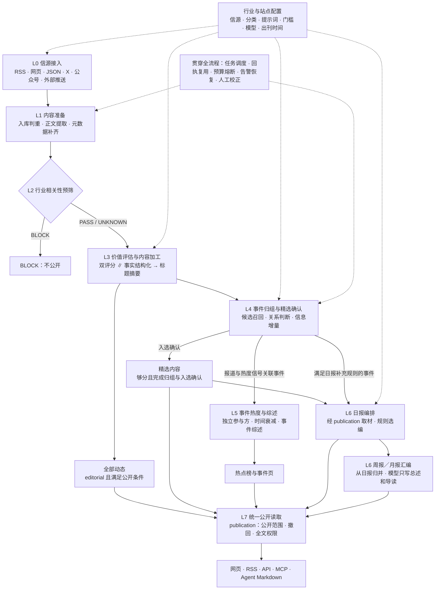
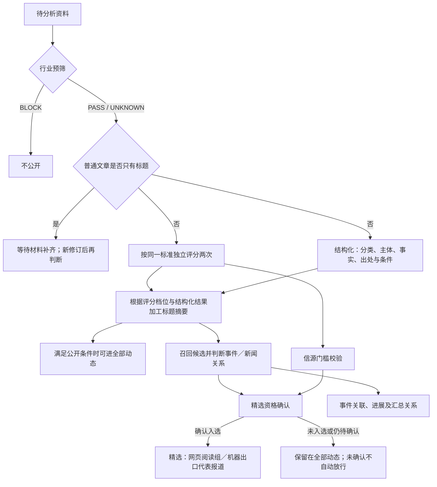

# AIHOT 业务处理架构

## 1. 依据与范围

- 仓库：`KKKKhazix/AIHOT`，`main` 分支。
- 查阅日期：2026-10-08。
- 本次依据：README，以及架构、信源、精选、归组、行业定制和事件综述评测文档。
- 源码页面访问受限，未逐行核验实现、数据库迁移或运行项目。以下代码位置采用仓库文档明确给出的映射。
- L0—L7 为本次整理的业务处理阶段；同一阶段可有并行任务，多个阶段也可以由同一代码模块承担。产物名称采用业务描述，不代表已核验的表名或类名。

## 2. 业务处理总图

图中实线表示业务数据依赖，虚线表示配置与运行支持。报告取材和最终交付均受 publication 的公开规则约束；图中省略重复的读取层回路。[1][2]

## 3. 分阶段职责

下列目录均以 `packages/backend/src/` 为前缀；L2、L3 共用 editorial，L4、L5 共用 events。[2]

| 阶段 | 名称 | 输入 → 处理 → 主要产物 | 文档给出的代码位置 |
|---|---|---|---|
| L0 | 信源接入 | 外部内容 → 按信源读取或接收推送 → 原始资料 | `sources/`、`sources/collect.ts` |
| L1 | 内容准备 | 原始资料 → 判重、正文提取与清洗、元数据补齐 → 待分析资料 | `content/` |
| L2 | 行业相关性预筛 | 待分析资料 → 判断行业相关性 → 继续处理或阻断公开 | `editorial/analyze.ts` |
| L3 | 价值评估与内容加工 | 有效材料 → 双评分、结构化和写作 → 评分、事实、分类标签、标题摘要 | `editorial/` |
| L4 | 事件归组与精选确认 | 加工结果和候选事件 → 判断关系及信息增量 → 事件关联、精选资格 | `events/relate.ts`、`events/group.ts` |
| L5 | 事件热度与综述 | 事件及其报道、讨论证据 → 热度聚合和综述生成 → 热点与事件页面内容 | `events/` |
| L6 | 报告编排 | 合规候选、事件和历史刊期 → 日报编排、周期汇编 → 日报／周报／月报 | `reports/` |
| L7 | 统一公开与交付 | 已处理内容与报告 → 统一公开规则 → 多渠道读取结果 | `publication/`、`publication/scope.ts` |

信源与准备阶段参见 [3]；评估与入选参见 [4]；事件关联参见 [5]；综述参见 [7]。

## 4. 内容处理的内部依赖

双评分与结构化可以并行；写作使用结构化结果。归组完成前，够分资料仍需等待入选确认。普通文章只有标题时等待补材料；无文字或纯链接 X 原帖有独立的原样展示规则，省去写作与翻译调用。上图主要描述普通文章路径。[4]

## 5. 必须保留的业务边界

### 5.1 内容资格与热度证据分开

`editorial` 参与内容展示与精选；`hot_signal` 只提供事件热度证据；`isolated` 不公开。未知可信发布时间的资料也暂不公开。旧材料按原文时间归档，避免历史回灌进入当天内容。[3]

### 5.2 文章、一次发生、持续事件各有粒度

一篇材料可与另一篇材料对应同一次发生，也可属于同一持续事件的后续。归组关系包括 `SAME_OCCURRENCE`、`SAME_STORY`、`UNRELATED`、`ROUNDUP`。因此，“相同主体”不足以直接合并事件。[5]

同一新闻的多篇入选报道可以在网页折叠为阅读组，机器出口则选择代表报道。精选确认同时考虑关系与信息增量。[4]

### 5.3 热点按事件计算

事件热度聚合独立来源或参与方，并随时间衰减。README 描述的窗口为 48 小时、半衰期为 24 小时；重复抓取与同一来源多次报道不会按条数重复累计。[1]

### 5.4 报告有独立编排规则

日报以规则选编；周报、月报以日报为输入进行汇编，模型负责总述与栏目导读。图中保留“符合补充规则的事件”输入，避免将日报候选完全等同于精选文章列表。[4]

### 5.5 公开层同时管输入范围和输出权限

网页、RSS、API、MCP 等共用 publication。撤回、公开范围和全文许可需要统一生效；页面读取预先计算好的结果，模型调用由 worker 执行。[2]

## 6. 横向支撑

行业判断与站点配置由 `industry/`、`site/` 提供：信源、分类、提示词、门槛、模型选择和刊期安排。[6]

队列调度、付费回执、预算限制、告警与人工纠正贯穿处理流程。运行载体为 Web、API、Worker；业务代码主要集中在 backend 包。[2]

## 7. 来源

[1] [README](https://github.com/KKKKhazix/AIHOT/blob/main/README.md)

[2] [架构文档](https://github.com/KKKKhazix/AIHOT/blob/main/docs/architecture.md)

[3] [信源文档](https://github.com/KKKKhazix/AIHOT/blob/main/docs/sources.md)

[4] [精选与校准](https://github.com/KKKKhazix/AIHOT/blob/main/docs/selection.md)

[5] [事件归组与关系评测](https://github.com/KKKKhazix/AIHOT/blob/main/docs/grouping.md)

[6] [行业定制](https://github.com/KKKKhazix/AIHOT/blob/main/docs/customize.md)

[7] [事件综述评测](https://github.com/KKKKhazix/AIHOT/blob/main/docs/story-digest-evaluation.md)

这些链接指向可变的 main 分支；本次未取得可用于固定版本的提交哈希。
