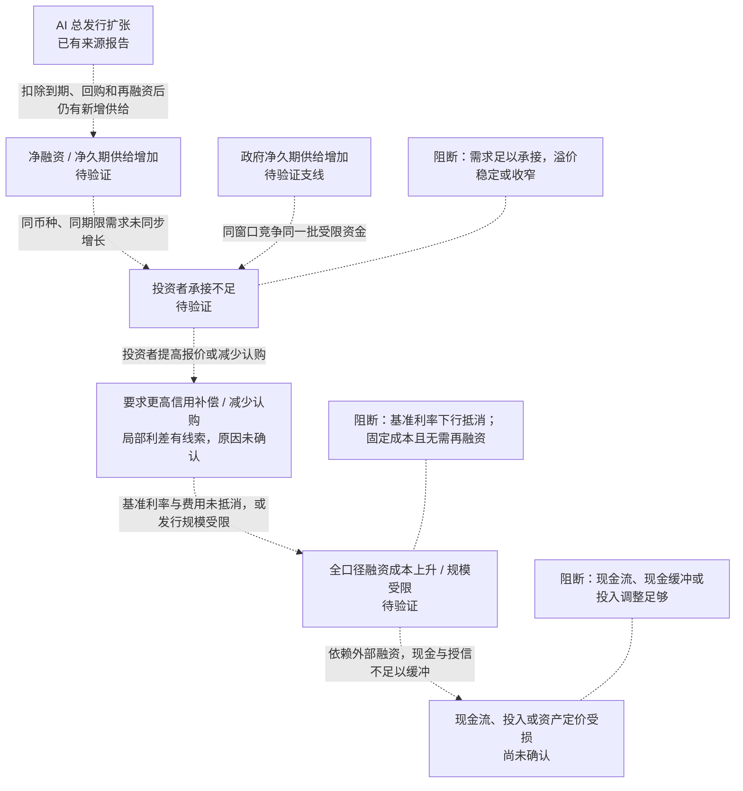

# 风险模型：AI融资需求与债券市场吸收能力错配

## 识别结论

> **当前关注的是：AI 企业融资需求增加后，债券市场能否充分承接。重点看新券溢价、认购与发行完成情况，再判断融资压力是否传导到企业现金流。目前尚未确认承接不足或实际融资损害。**

*资料说明：主要依据[高盛信用市场访谈](https://www.goldmansachs.com/insights/goldman-sachs-exchanges/how-ai-debt-is-reshaping-the-credit-market)（2026-08-03录制、08-05发布）；发行统计窗口仍有缺口，结论为候选判断，不代表9月28日实时状况。*

## 风险分析

### 1. 风险类型：谁面临什么损害？

主类别为**估值风险中的信用补偿重定价**。融资流动性、现金流与偿债损害是待验证延伸，不能当作已经发生的独立风险。分类参照[[wiki/concepts/冰冰小美-indacator-风险类型|项目风险类型]]；“融资需求与吸收错配”是本次候选机制归纳，不是作者固定分类。

- **发行人：** 需要滚动融资、现金缓冲不足的主体，可能更容易受到融资成本提高或融资规模受限的影响。是否存在这种暴露，须由财报、现金和到期债务证据确认。
- **债券持有者：** 长久期、集中持有相关债券者可能承受定价暴露；现有证据没有确认同券价格损失，也没有确认杠杆清算风险（相关价格与持仓证据仍缺失）。

这些是暴露筛选条件，不代表所有 AI 企业或所有债券持有者面临相同风险。利差变化、再融资约束与经营压力属于同一候选路径的不同环节，不另列为独立风险。

### 2. 风险表现：现在实际观察到了什么？

**已观察线索：** 高盛访谈报告，特定 AI 债券篮子的信用利差在此前 12 个月从 74bp 低位接近翻倍（精确终值未知）。这是来源报告的局部风险补偿调整，篮子定义及连续序列仍缺失。参见[高盛访谈](https://www.goldmansachs.com/insights/goldman-sachs-exchanges/how-ai-debt-is-reshaping-the-credit-market)。

**背景事实与观点边界：** 高盛访谈报告了发行规模扩张，它本身不是不利结果。用户材料将公共与私人发债并列解释为资本竞争；国债与公司债发行统计的底表、统计窗口及共同资金池尚未验证，不能把这段观点当作已确认的因果关系。

**尚未确认的损害：** 全口径融资成本提高、融资可得性下降、发行失败、同券价格损失、现金流损害或违约均缺充分证据。信用利差扩大不能单独证明这些后果已经发生。

### 3. 风险来源：发生了什么变化？

按[[wiki/topics/冰冰小美-风险来源与传导路径|知识库的风险来源定义]]，这一节回答：**发生了什么？什么变化可能带来损害？**

本材料涉及以下三类宏观风险来源。分类名称和核心问题沿用知识库；右侧列出本材料的对应变化及其证据状态。

| 层次 | 知识库风险来源 | 知识库核心问题 | 本材料中的具体变化 | 证据状态 |
|---|---|---|---|---|
| 宏观 | **市场结构与资金供需风险** | 证券市场自身资金结构是否恶化？ | AI相关企业发债增加，需要债券投资者提供更多资金；需要核实新增供给是否超出承接能力。 | 主要关注来源。高盛访谈报告了发行扩张，但净供给及承接不足尚未确认。 |
| 宏观 | **财政与主权债务风险** | 政府财政和债务是否形成压力？ | 用户材料称美国国债发行增加，可能与企业争取同一批资金。 | 相关来源待验证。发行统计窗口、净发行和共同投资者资料缺失，尚不能确认挤出或主权偿债压力。 |
| 宏观 | **信用与金融体系风险** | 银行和信用体系是否出现问题？ | 高盛访谈报告特定AI债券篮子的信用利差扩大，需核实企业信用与融资条件是否发生变化。 | 局部信用定价线索。尚不能确认银行体系问题、融资受限或企业违约。 |

*来源时点：高盛访谈录制于2026-08-03；用户材料中滚动发行统计的截止日未知。上述分类是知识库整理口径，不代表三类风险均已发生，也不作为三个独立风险计数。*

### 4. 风险关键变量：什么变化最能改变判断？

**首先看投资者承接条件，并与新增净供给匹配。** 这是“发行多”转成“融资压力”的关键缺口。其次确认融资成本或可得性是否改变，再看企业现金流与偿债缓冲能否承受；政府供给和持有者结构用于区分原因及暴露。

| 关键变量 / 主次 | 为什么决定风险 / 作用环节 | 当前已知状态 / 证据引用 | 什么变化支持机制 / 什么变化削弱或否定机制 |
|---|---|---|---|
| 核心：债市吸收条件，结合净融资与净久期供给 | 决定供给扩张是否真正遇到需求约束 | 发行统计仅报告总发行扩张；净供给、认购、发行溢价与完成率待验证 | 同窗口净供给增加且认购/完成情况转差支持机制；需求同步吸收、新券溢价稳定或收窄削弱机制 |
| 传导验证：信用补偿与全口径成本 | 决定局部定价线索是否转成实际融资负担 | 高盛访谈报告了局部篮子的利差变化；匹配期限基准、费用及连续序列缺失 | 匹配期限全口径成本增加支持成本渠道；无风险利率下降抵消利差则阻断该渠道 |
| 损害验证：外部资金缺口、再融资窗口与承受力 | 决定企业是否依赖近期外部融资以及缓冲是否足够 | 现有材料无同主体现金流、到期债务和授信资料 | 近期偿还/投入需求超出可用现金与承诺融资支持脆弱性；内生现金流和缓冲充足削弱损害推断 |
| 辅助解释：主权供给与利率分解、持有者脆弱性 | 区分政府竞争、政策预期、企业信用因素与集中度影响 | 国债与公司债发行统计待核；无持仓、杠杆或被动卖出证据 | 共同投资者与同期限承接约束证据支持竞争支线；资金池分离或其他因素解释更强则削弱该支线 |

各变量的完整口径、基准与观察频率见附录。

### 5. 风险传导关系：如何逐步造成损害？

**传导路径仍是候选机制。** 节点标注已知状态；虚线箭头表示尚未完成因果验证，箭头旁写明成立条件。蓝色节点表示有来源线索，不能据此把后续损害视为事实。

**最关键的一步是“新增供给能否被承接”。** 总发行增加不等于净供给增加，净供给增加也不等于需求不足。需要同窗口的净发行、认购、新券溢价与发行完成情况，才能验证中间环节。

**局部利差扩大不等于企业已受损。** [高盛访谈](https://www.goldmansachs.com/insights/goldman-sachs-exchanges/how-ai-debt-is-reshaping-the-credit-market)提供了总发行及局部利差线索；全口径成本、融资可得性和企业现金缓冲仍待验证。政府竞争只是待验证支线，政策预期和企业信用变化可能提供其他解释。

图中的阻断条件均为待检验条件，不能视为已经实施或已经见效。当前也无证据支持“价格下跌—追保—被迫卖出”反馈环。完整逐环节依据见[附录：传导证据与阻断条件](#transmission-evidence)。

## 验证重点与模型边界

**最优先验证净供给与投资者承接是否匹配：** 补齐同样本、同币种、同期限的净供给、认购、新券溢价及发行完成情况。若供给扩张且承接受限，候选机制获得支持；若新增需求顺畅吸收供给，则应削弱“吸收错配”解释，而不是仅凭发行总额继续确认风险。两种情况仍需结合替代解释检验。

**随后验证实际损害：** 结合全口径融资成本、企业现金流、到期债务和缓冲条件，区分“融资更贵”与“融资不可得”。政府挤出解释必须另外补齐主权供给与共同投资者证据。

- **模型失效条件：** 统一样本和窗口后，净供给扩张前提被推翻；或者融资需求可被新增需求和现金流吸收，且同期限融资条件不支持吸收约束解释。若信用定价主要由经营恶化、政策冲击或主体事件解释，应改用相应来源重新识别，不固守“资本竞争”叙事。

### 需要排除的其他解释

1. 企业提前融资、置换到期债务或保留现金，会抬高总发行，却不必然构成融资困难。
2. 信用利差变化也可能来自企业经营预期、行业集中、期限结构或交易流动性；政府融资不是唯一解释。
3. 国债长端收益率可以随政策利率预期和期限溢价变化；供给因素的贡献需要控制这些变量，不能用宏观叙事代替识别。
4. 债券投资者新增需求、海外资金或渠道分流可能吸收供给。信用补偿提高也可能是正常风险定价，不能直接当作危机。

**当前结论边界：** 现有材料支持建立局部信用补偿重定价的候选模型，尚不能确认融资受限、主权债务危机、系统性流动性危机或 AI 企业违约潮。未有独立验证的反证数据不等于模型成立。

## 附录：身份与依据

| 字段 | 内容 |
|---|---|
| risk_id / model_version | US-AI-DEBT-ABSORPTION / 1 |
| 观察对象 / 核心问题 | AI相关债券发行人及债券持有者；债务融资需求扩张，是否超过同期限、同币种投资者愿意承接的供给，从而抬高风险补偿并约束融资？ |
| identification_status | 候选；观察到局部定价线索，来源归因及融资损害尚未验证 |
| model_as_of / 信息截止时间 / 时区 | 2026-09-28T15:41:39+08:00 / 上游材料核验于2026-09-28T14:50:49+08:00；本轮同源复核未增加市场事件 / Asia/Shanghai |
| 上游信息窗口 / result_id / 结果位置 | 无统一可比窗口；IP-US-AI-CAPITAL-FEED-20260928-01；[[tools/a-share-market-dashboard/data/Risk/inputs/IP-US-AI-CAPITAL-FEED-20260928-01.json\|完整上游快照]]、[[tools/a-share-market-dashboard/data/Risk/inputs/IP-US-AI-CAPITAL-FEED-20260928-01-run\|运行说明]] |
| 来源覆盖 / 失败与缺口 | 用户原文、一份主要机构访谈、转载溯源线索；发行底表、篮子定义、同期限净供给、需求、现金流和当前行情缺失；不把单一来源的多个观察视为多源共振 |
| previous_model_ref / 变更原因 | 首次识别；没有同对象既有模型。本轮响应用户明确请求，不初始化演绎观察T0 |

**时点边界：** 模型建立于9月28日，关键机构观察来自8月3日录制、8月5日发布的访谈；不是对9月28日市场状态的实时确认。原文“过去12个月”的截止日仍未知。

**本次修订说明：** 按风险识别 1.0.7 输出模板将传导正文改为关系图与简短解释，逐环节证据表移入附录；风险来源仍沿用知识库分类；不新增市场证据，不改变 risk_id、model_version、model_as_of、信息窗口或候选状态。

### 证据编号与运行记录

- 运行统计：1个候选模型、0个已支持的完整因果模型；仅调整呈现，未新增市场观测。
- 证据映射：E3/E4/S1对应发行扩张线索，E5/S2对应信用利差线索，E1/E2对应待核的国债与公司债统计，C2对应AI融资与信用定价材料簇。
- [[outputs/information-processing/2026-09-28-us-ai-capital/summary|信息处理结果]]与[[tools/a-share-market-dashboard/data/Risk/inputs/IP-US-AI-CAPITAL-FEED-20260928-01.json|完整上游快照]]保留可追溯引用；变量编号及基准见后续附录。

## 附录：关键变量与模型基准

下表区分上游共同变量与本层决定损害能否发生的变量。无经校准阈值，本轮不设主观红线，也不将建议频率理解为已经启动监控。

| 风险关键变量 | 与上游共同变量的联系或差异 | 观测指标 / 口径 / 单位 | 基准值或状态 / 观测时点 | 来源引用 | 建议频率 / 验证条件 |
|---|---|---|---|---|---|
| V1 净融资与净久期供给 | 从S1总发行扩张转向真正需被吸收的新增供给 | 同样本总发行、到期偿还、净发行，按币种/评级/期限分组；美元、年或一致口径久期暴露 | 待验证；上游金额仅为源报告的总额，不能代入净融资 | E3/E4/S1；回源发行与偿还清单 | 月度、每次大发行；观察净供给与需求是否匹配 |
| V2 债市吸收条件 | 上游缺需求端，是供给转成风险的必要环节 | 新券发行溢价bp、认购倍数、最终发行额/计划额、撤回/延期及基金流入 | 待验证；不能从利差倒推出认购不足 | C2为线索；需新券与资金需求资料 | 每次发行/周度；同评级同期限比较 |
| V3 信用补偿与全口径成本 | S2只是特定篮子信用利差；不等同融资总成本 | 匹配期限信用利差、债券收益率、无风险基准与必要对冲费用；bp/% | 来源称其篮子此前12个月从74bp低位接近翻倍；精确终值未知，不写成148bp。访谈录制日8月3日 | E5/S2及[高盛访谈](https://www.goldmansachs.com/insights/goldman-sachs-exchanges/how-ai-debt-is-reshaping-the-credit-market) | 日/周及发行时；先补篮子定义与连续序列 |
| V4 企业外部资金缺口 | 上游没有现金流和资金用途；决定对发债的依赖 | 资本开支、经营现金流、其他必须支付、可用现金、已承诺融资；美元 | 待验证；不能假定每一美元发债都投入AI或反映现金短缺 | 需同主体财报与融资用途 | 季度、指引更新；检查融资需求的经济用途与缓冲 |
| V5 再融资窗口与偿债承受力 | 从市场定价转到主体损害；不可仅用行业总额判断 | 一年内到期债务、非受限现金、已承诺授信、利息覆盖；美元/倍 | 待验证；无资料表明资金链断裂或违约 | 需债务期限表、财报和授信资料 | 季度及融资公告；识别实际近期续接压力 |
| V6 主权供给与利率分解 | E1公共发行主张尚未证实；分开政府供给和政策路径 | 国债同窗口净发行/久期、拍卖表现、预期短端利率与期限溢价；美元/bp/% | 本轮均待验证；5.06万亿美元不是已核实净发行；7.70万亿仅为两主张的合计 | E1/E2；[纽约联储方法资料](https://www.newyorkfed.org/research/data_indicators/term-premia-tabs)；需财政部同窗口统计 | 拍卖/周/月；不能仅凭长端收益率变化判定挤出 |
| V7 持有者脆弱性 | 上游未包含持仓结构，不假定杠杆或被动卖出 | 同行业集中度、久期、赎回条款和杠杆；具体口径依账户/基金 | 待验证；仅为暴露筛选条件 | 需投资者/基金公开资料 | 月/季；无证据不增加杠杆清算分支 |

### 风险应对基线及宣布 / 执行 / 见效阶段

当前上游未提供可验证的专门应对措施、规模及效果。现金流改善、调整资本开支节奏、延长债务期限或融资渠道分流，只能列为可能阻断路径的条件；其“宣布、执行、见效”状态均未验证。观察这些力量是后续工作，不由本轮代做方向判断。

### 数据缺口与上游补充需求

| 优先补充 | 上游需要交付什么 | 对模型判断的用途 |
|---|---|---|
| 统一统计窗口与对象 | 5.06/2.64万亿美元的原图、截止日、总额/净额、样本；AI债逐发行人清单与用途 | 确定两类供给是否真的进入同一可比较资金池 |
| 修正增长率与时间口径 | 同样本2024、2025全年及2025/2026上半年数据 | 541%缺核验基数；194/109−1约78%是部分年度与全年比较，不能标成上半年同比；保留1080/1090亿美元来源差异 |
| 验证融资损害而非仅定价 | 同期限新券溢价、认购、发行完成、到期债务及现金缓冲 | 区分可以付更高价格融资与融资不可得 |
| 验证公共融资竞争 | 国债净久期供给、对应投资者需求、政策预期与期限溢价 | 公共挤出只在同窗口多项证据可关联后进入支持链 |

材料底稿：[[sources/manual/2026-09-28-用户提供-AI企业与美国政府资本竞争|原文与来源登记]]。后续识别可按主动补证规则查找这些关键数据；本次为来源分类与呈现修订，未新增市场数据。

## 附录：传导证据与阻断条件

此表用于核对主链图的条件与依据；所有原有证据边界保留。

| 传导环节 | 成立条件与作用机制 | 证据引用 / 事实或推断 | 阻断条件 / 反证 |
|---|---|---|---|
| AI债务发行扩张 → 净融资/净久期供给增加 | 扣除到期、回购和再融资后，仍有需新增承接的供给 | 高盛访谈中的发行统计为总发行线索；净量待验证 | 净发行没有明显变化，或期限缩短抵消久期供给增加 |
| 净供给增加 → 投资者吸收约束形成 | 同币种、同期限资金需求未同步增长，认购或发行承接受约束 | 推断；现有材料缺同窗口基金流入、认购和集中度资料 | 新增需求足以吸收供给，新券溢价不变或收窄 |
| 吸收约束 → 更高信用补偿/融资受限 | 投资者提高报价要求或减少认购，发行人接受更高成本或减少发行 | 高盛访谈中的利差观察仅为局部利差线索，原因未识别 | 控制信用基本面、期限和流动性后供给因素解释力弱；发行仍顺畅 |
| 信用补偿增加 → 全口径融资成本上升 | 匹配期限无风险利率、对冲成本和费用未抵消利差增加 | 条件推断；缺完整成本资料 | 无风险利率下行抵消利差变化；企业已有固定成本融资且无需近期再融资 |
| 融资成本上升/规模受限 → 现金流、投入与定价受损 | 企业依赖外部融资，且现金、授信或投入调整不足以缓冲 | 待验证；缺少企业现金流、债务期限、融资计划与预期修订资料 | 内生现金流与现金缓冲足够，项目回报改善或投入安排可调整 |
| 政府净久期供给 → 同一资金池竞争 → AI融资压力 | 两类供给竞争相同投资者的受限资金，且政策/信用因素不能充分解释变化 | 待验证支线；国债与公司债发行统计无原表、截止日或共同投资者证据 | 投资者群体、币种、期限分离；需求扩张；变化由其他因素解释 |

## 附录：模型交接

- **观察结束条件：** 将来启动观察后，在约定的完整可比窗口中验证关键缺口已闭合、条件链不成立或原融资需求已经消退，方可结束；本轮未启动观察，不能宣告风险已解除。
- **重新开启条件：** 出现同样本净发行扩张且需求跟不上、发行延期/撤回，或企业近期再融资与现金覆盖出现新的实证缺口；重新交给上游核验。
- **交接：** 仅交付候选风险模型。上游H1的eligible=false保持原样；本次用户明确调用风险识别，允许基于该证据建立候选模型，不等于自动移交门槛已满足或风险升级为已支持。
- **保存位置：** [HTML阅读版](US-AI-DEBT-ABSORPTION-v1.html)、本Markdown母稿、[[tools/a-share-market-dashboard/data/Risk/inputs/IP-US-AI-CAPITAL-FEED-20260928-01.json|上游快照]]与[[tools/a-share-market-dashboard/data/Risk/inputs/IP-US-AI-CAPITAL-FEED-20260928-01-run|运行说明]]。
- **范围限制：** 本模型不输出风险方向、持续性、概率评分、仓位或买卖判断；T0由后续用户明确要求的演绎观察初始化。

## 附录：方法与交付验证

- 按[[冰冰小美-framework-风险观察|风险观察与演绎第一层]]执行表现、类型、来源、关键变量、传导五步；分类使用[[wiki/concepts/冰冰小美-indacator-风险类型|风险类型]]，来源按[[wiki/topics/冰冰小美-风险来源与传导路径|来源与传导框架]]组织，不把本模型写回正式Wiki。
- 标准上游快照与原结果字节一致，并通过当前信息处理Schema校验；源报告与本模型的区别、候选状态、时间窗口和每段推断边界均保留。
- HTML由同一Markdown转换，完整保留表格和来源；风险传导正文使用 HTML+CSS 纵向关系图，Markdown 保留对应 Mermaid；关键变量与证据覆盖继续使用内联 SVG。三张图均不包含新增数据、概率或权重，无外部脚本或图表依赖；传导证据表保留在附录。结构、章节、锚点和本地链接在交付前校验。
- 视觉验收限制：本次刷新报告被浏览器本地文件 URL 策略阻止；桌面/窄屏实际渲染验收未完成。HTML 结构检查通过，主链已设窄屏纵向样式；不将静态检查当作视觉通过。
