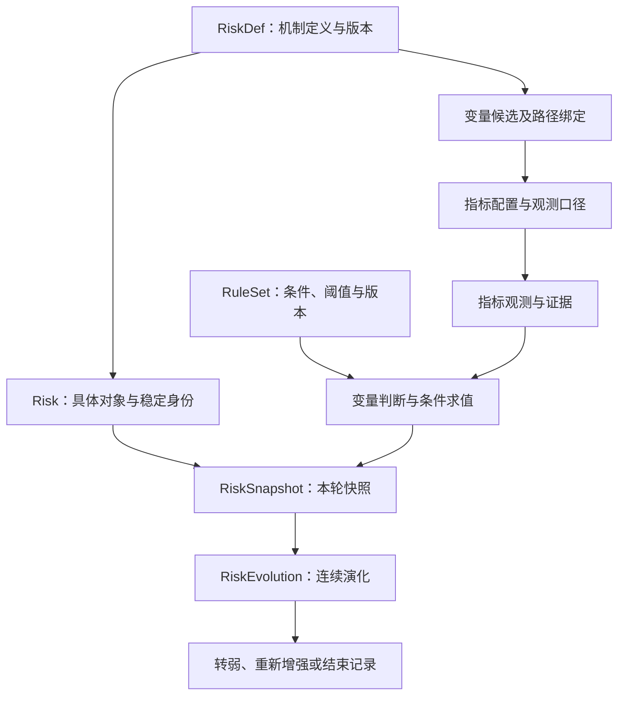

# 风险监控模块：业务模型与自动评级规则

## 1. 设计结论与依据

监控以**市场中的具体风险**为对象，通过“指标观测 → 关键变量状态 → 条件组合判级 → 风险快照 → 演化与转弱节点”形成可解释记录。沿用 RiskDef → RiskSnapshot → RiskEvolution，补充具体风险身份和独立版本的评级规则。

本文件是经用户确认方案的业务设计产物，不是当前市场研判，也不是已运行的评级引擎。首个样例为“市场资金供需失衡”；所有样例状态均为虚构验收输入。第一版不计算加权总分，不开发界面，不取实时数据，不创建调度，不改写现有风险模型、技能或正式 Wiki 草稿。

| 依据 | 继承内容 | 本文新增的工程约定 |
|---|---|---|
| [[wiki/topics/冰冰小美-风险体系|风险体系]] | 定义、变量证据、快照与连续演化的分工；强度、兑现、方向、速度和持续性分列 | 具体风险身份、规则版本、三值条件和可比性约束 |
| [[wiki/topics/冰冰小美-风险来源与传导路径|风险来源与传导路径]] | 八类来源、条件传导、暴露对象、支持证据与反证 | 来源分类不作为独立风险实例；按路径判断阻断 |
| [[wiki/concepts/冰冰小美-framework-风险观察与演绎|风险观察与演绎]] | 同时观察风险来源与风险应对；保存T0；检验持续性与模型有效性 | 周度比较、转弱候选与确认、结束和重开记录 |
| [[wiki/concepts/冰冰小美-indacator-风险类型|二级市场风险维度]] | 基本面、流动性、估值、情绪四类影响 | 同一风险可以多维归因，但只按一个身份计数 |
| [[wiki/reasoning/冰冰小美如何判断风险转弱的节点|风险转弱节点框架]] | 行情修复不能独立证明风险减弱；转弱与交易窗口分开 | 不输出买卖指令，不把转弱自动解释为风险解除 |

本文的等级名称、三值运算、历史第80/95百分位、连续两期确认等均为**工程设计与待校准默认值**，不是作者原文规定或经历史验证的金融定律。风险来源页的“异常程度＋变化速度＋持续性＋影响范围”在此作为观察维度，不直接解释成可相加的公式。

## 2. 对象关系与职责



### 2.1 稳定定义、具体风险与观察轮次

| 对象 | 业务主键及必要内容 | 约束 |
|---|---|---|
| `RiskDef` | `risk_def_id`、`definition_version`、机制、候选变量、路径及失效条件 | 定义可被多个市场实例复用；修改机制保留旧版本 |
| `Risk` | `risk_id`、名称、观察市场、影响对象、引用定义、`source_ids`、`dimension_ids`、首次跟踪时间 | 身份代表“对象＋机制”；普通升降不换身份 |
| `RiskEpisode` | `episode_id`、`risk_id`、开始时间、结束时间、结束依据、重开来源 | 同一风险结束后重新出现，新增观察轮次，保留原轮次 |
| `VariableConfig` | `variable_id`、名称、含义、指标组合 | 变量定义可复用；不在此固定对所有风险的利害方向 |
| `RiskVariableBinding` | 风险定义版本、`path_id`、`variable_id`、角色、作用方向、组合条件、比较容差 | 角色为来源、传导、缓冲、严重化或损害验证；允许同一变量在不同路径有不同作用 |
| `IndicatorConfig` | `indicator_id`、`metric_version`、对象、单位、频率、采样规则、聚合方法、有效期、允许来源 | 禁止把同名不同口径指标视为同一序列 |
| `RuleSet` | `ruleset_id`、`ruleset_version`、适用范围、阈值及参考集、条件表达式、方向变量、转弱及结束条件 | 不在运行中临时改权重、换阈值或删去缺失项 |
| `RiskSnapshot` | 唯一快照、观察窗口、版本、输入引用、条件结果、评级与缺口 | 只追加；同一事实和输入重复执行不增加业务观察期 |
| `RiskEvolution` | 有序快照引用、比较结论、节点记录 | 是快照派生视图，不独立改写历史评级 |

八类风险源是分类，不是八个预先存在的风险。四大维度是影响归因，不要求每个风险凑齐四类。风险总数按 `risk_id` 去重；一个风险关联多个来源或多个维度时，各分组计数不可直接相加。不同市场、范围或观察时点的等级不直接合成“市场总分”。

模型版本变化但对象与核心机制延续时保留 `risk_id`、开启新基准段；对象或机制实质不同则新建风险并记录承接关系。原机制被推翻记为模型失效，不能写成风险已解除。

### 2.2 指标事实与变量分析分离

`IndicatorObservation` 保存事实或上游提供的估算，不夹带风险结论：

| 字段 | 含义 |
|---|---|
| `observation_id / indicator_id / metric_version` | 观测身份及口径版本 |
| `value / unit / value_kind` | 数值或状态；区分实际、估算、预测、计划 |
| `period_start / period_end / observed_at` | 数据覆盖区间及实际观测时点 |
| `published_at / known_at / collected_at` | 来源发布、系统获知及采集时点；未知保留空值及原因 |
| `source_ref / evidence_ref / revision_of` | 来源、证据定位、所修订的旧观测 |
| `quality_status / reason` | 可用、缺失、过期、冲突、不可比、样本不足或示例隔离 |

`risk_snapshot_variable_evidence` 延续现有草稿，补充 `path_id`、输入观测列表、阈值版本、参考集、条件结果和原因。保留 `observed_state`、变化方向与幅度、`risk_effect`、解释和证据；`risk_effect` 扩展为 `AGGRAVATE / NEUTRAL / MITIGATE / UNKNOWN`。指标上涨并不自动等于 `AGGRAVATE`。

每次判定同时保留支持证据、反证、替代解释和缺口。解释只能描述命中规则，LLM文字不能覆盖规则结果。第一版 `analysis_method=RULE`；原有数值 `confidence` 保留为空，以证据质量与规则可判定性表达边界，不伪造概率。

## 3. 阈值、条件与评级

### 3.1 阈值契约

依次采用机制阈值、历史分位；均无依据时为 `RULE_UNCONFIGURED`。机制阈值必须保存经济、合同或制度依据及适用范围。历史阈值必须保存不利方向、样本范围、频率、参考窗口、最小有效样本数、参考数据版本和计算方法。

历史分位第一版约定：

- 将原读数转成“不利程度”：越高越不利用原值，越低越不利用相反数；双侧异常必须配置两条条件，不能临时选择方向。
- 相对历史参考集 `H`，使用中位秩百分位 `p = 100 × (小于本期不利程度的个数 + 0.5 × 等于本期的个数) / N`。全序列相同时为50，不会仅因同值被判严重异常。
- `p >= 80` 为异常，`p >= 95` 为严重异常，边界包含等号。百分位不表示损失概率。
- 参考集排除本期和截止时点之后才获知的数据。一个基准段固定参考集；刷新参考集也是阈值版本变化，建立新基准，防止分布漂移制造虚假改善。
- 样例采用T0之前156个完整日历周范围，至少104个同口径有效周；假期无交易周不造零。样本不够则相关条件未知，不缩短历史或借用其他市场填充。
- 样本名单、统计口径、采样时间或阈值方法变更均须版本化。生产启用前需要校准误报、漏报、阈值稳定性及资料可得性；本次不声称已完成校准。

### 3.2 三值逻辑

条件结果仅有 `TRUE`（成立）、`FALSE`（不成立）、`UNKNOWN`（未知）。没有发现缓冲证据不等于缓冲不存在；只有按该条件的必要输入完成核验后，才能输出 `FALSE`。

| 运算 | 结果规则 |
|---|---|
| `AND` | 任一项FALSE则FALSE；全部TRUE则TRUE；其余UNKNOWN |
| `OR` | 任一项TRUE则TRUE；全部FALSE则FALSE；其余UNKNOWN |
| `NOT` | TRUE与FALSE互换；UNKNOWN保持UNKNOWN |

每个风险路径定义 `S`来源压力、`T`传导确认、`B`足以阻断该路径的缓冲、`H`严重化条件。各条件可嵌套指标条件，但必须事先固定表达式和依赖。`H`不能绕过传导验证直接把来源异常升级为高压。

对完全已知的输入，单路径判级顺序为：

```text
S = FALSE                         → 未触发（L0）
S = TRUE 且 (T = FALSE 或 B = TRUE) → 关注（L1）
S = TRUE 且 T = TRUE 且 B = FALSE：
    H = TRUE                      → 高压（L3）
    H = FALSE                     → 承压（L2）
```

“未触发”只说明本规则未触发，不等于市场无风险。来源异常但路径被阻断仍保留关注；损害事实在另一字段保留。等级代表该具体风险的规则压力档位，不是危机发生概率或损失金额。

对未知输入，求所有与已知事实、原子条件依赖相容的可能等级，保存 `possible_levels`。同一原子条件不能在不同分支同时取相反值；严重异常必须蕴含异常。

- 只有一个可能等级且等级大于L0时，可输出确定等级，同时披露不影响判级的未知项。
- 存在多个可能等级时，`risk_level=PENDING`；保存 `confirmed_floor` 为所有可能等级的最低档。最低档L0只显示“尚无已确认压力”，不显示“已确认正常”。
- 即使短路运算得到L0，预设的必要观测集合不完整时仍输出待评估，防止缺数据生成正常结论。
- 某一确定高压路径已经决定同一风险的最高档时，其他路径缺失不降低该高压结论，但整体覆盖仍标为不完整，不能用于解除判断。

多路径风险取适用且启用路径中的最高等级；未知路径可能抬高结果时维持待评估。路径只能在版本发布前标记启用或不适用，不能因当轮缺数据临时关闭。一个路径的缓冲不能抵消其他路径。

### 3.3 输出解释要求

每个条件记录 `condition_id`、三值结果、输入观测引用、运算、阈值及参考集、命中值、反证和缺口。评级记录命中路径和决定等级的条件，不只输出“高风险”。

示例输出：“来源S成立；传导T因盘口深度缺失为未知；B不成立；可能等级为关注至高压；本轮待评估，已确认最低压力为关注。”这是虚构格式示例，不是市场结论。

## 4. 风险快照与演化契约

### 4.1 快照最小字段

| 字段组 | 必要字段与业务含义 |
|---|---|
| 身份 | `snapshot_id`、`risk_id`、`episode_id`、`baseline_id`、`definition_version`、`ruleset_version`、阈值/参考集版本 |
| 时间与范围 | `snapshot_time`、本期起止、比较期起止、`information_cutoff`、时区、样本/范围版本、`created_at` |
| 输入与证据 | 观测引用、变量证据、条件结果、支持/反证、缺口、上游结果引用、输入指纹 |
| 风险强度 | `risk_level`、`possible_levels`、`confirmed_floor`、等级依据 |
| 兑现程度 | `path_realization[]`：各环节的事实状态、发生时间、证据；不换算百分比 |
| 方向 | `trend_previous`、`trend_t0`、对应比较快照及原因 |
| 速度 | 各数值变量的单位时间变化率及时间单位；整体 `momentum=UNKNOWN`，原因“第一版未合成” |
| 持续性 | 已观察有效期数、当前连续期数、缺口期数；未来期限及条件，证据不足为待验证 |
| 管理状态 | `model_validity`、`task_status`、转弱节点引用、下一观察条件；与等级分列 |
| 修订 | `revision_of`、更正原因、实际获知时间；旧快照不覆盖 |

草稿中的 `risk_snapshot_variable` 作为变量证据集合入口，不再与 `risk_snapshot_variable_evidence` 重复保存同一判断。`risk_source_id` 改为绑定层的来源列表，避免一条变量证据被多个来源重复写入。

兑现程度逐环节记录“有证据支持／有反证／未知”，环节为来源变化、传导发生、损害出现。后端环节已有事实而前端归因缺失时，显示“损害已观察、归因待验证”，不能反推整条链已成立。历史发生过的损害另存 `damage_history`；风险减弱不会抹掉已发生损害。

### 4.2 可比性与方向

比较前要求同一风险、观察轮次、定义与规则版本、参考集、样本范围和指标口径；两期数据截至各自截止时点可知且有效。方向只使用确定等级，不比较待评估的最低档或区间端点。

1. 首次没有可比历史时建立T0，两项方向均为证据不足。
2. 有可比历史时先比较等级，升档为增加、降档为减弱。
3. 等级相同，比较预设方向变量的不利程度变化；只有恶化判增加，只有改善判减弱，全部在变化容差内判维持。
4. 改善与恶化并存，只有已配置的支配规则才能裁定；没有支配规则输出证据不足。缺少必要方向变量也输出证据不足。
5. 相对上一快照与相对T0分别计算。上一轮缺数时可另列“相对最近有效快照”的跨缺口比较，但不能冒称上一期趋势连续。

不同指标不可混合相减。变化率用同口径数值差除以实际时间间隔；比例差注明百分点或bp。参考分位变化与数值变化分开存储，第一版不自动生成总体加速度。

### 4.3 持续、转弱与结束

同一输入指纹、同一观察窗口的重复运行复用原结果；源请求失败记录运行失败，可产生缺口记录，但不伪造新市场观测。

`valid_period_count` 计有效完整观察期；`pressure_streak` 计连续有效且L1以上的期数；UNKNOWN打断连续计数并保留“缺口”标记，不解释为风险中断。日内事件可更新事件证据，不能增加周度计数。未来短、中、长期持续性必须给出具体日期范围或事件周期、持续条件及证据，未配置或无依据时为待验证。

转弱节点状态为 `NONE / CANDIDATE / CONFIRMED / INVALIDATED`：

- 首次有证据支持的减弱记录候选，保存比较基准、首次改善时间和本轮获知时间。
- 连续两个完整且互不重叠的观察窗口满足本风险缓解条件，并且没有严重化、没有增加方向、没有关键缺口，确认节点。第二期可以维持已改善状态，不强制继续降档。
- 周度 `[W1,W2]` 与 `[W2,W3]` 两个变化区间共用端点快照是允许的；被计数的观测区间W2、W3必须互不重叠。滚动20日窗口的两次刷新不能当作两个独立确认期。
- 中途条件不成立、增加或缺口打断候选序列，保留原因；已确认节点始终留在历史中，后来再次增加另记 `REINTENSIFIED`，不删除确认记录。
- 确认记录同时保存 `first_improvement_at`、`confirmed_at` 和证据引用。晚到证据不得把原来未知的时点回写成当时已确认。

转弱不自动结束。解除需要独立的结束条件、残余风险说明和重开条件；未满足时继续观察。模型失效进入“需要重识别”，数据不足进入“等待证据”，两者都不等于结束。

## 5. 完整样例：市场资金供需失衡

### 5.1 身份、范围与路径

样例身份为 `EXAMPLE-CN-EQUITY-FUNDING-IMBALANCE`，仅供规则验收，不登记为正在发生的风险。观察范围为预先登记的A股股票及股票ETF固定样本，必须展示覆盖市场和样本边界，结论不得外推为全市场资金净额。

定义：证券供给或卖出需求增加，而可验证的增量资金与交易承接不足，导致目标市场退出成本和定价压力上升。

样例启用“实际发行融资压力进入交易承接”一条路径：

```text
实际融资供给偏高 → 观察资金渠道承接不足 → 价差和深度恶化 → 退出成本/定价压力
                                        ↑
                 新增资金实际进入且承接恢复，可阻断后续路径
```

“实际减持或被迫卖出”作为候选扩展路径保存，样例版本未启用，不能据本样例评级宣称已覆盖该风险的全部路径。启用该路径前须新增实际交易证据、主体范围和规则版本；解禁计划、减持计划不计为实际卖出。主归因为流动性，估值和情绪影响只有存在相应证据才添加。

### 5.2 周度指标与配置

观察窗口为北京时间每个自然周内的完整交易周；截止时间为该周周日23:59:59。仅使用截止前已获知的资料，缺失时记录待评估，不等数据补齐后假装当时已知。无交易周不生成新的有效观察期。

样本清单及其版本是必填输入，不在本文编造名单。逐股盘口按连续竞价每5分钟采样，排除集合竞价；先取各股日内中位数，再取周内中位数，最后对固定样本取等权中位数。某股票停牌记不适用，不能静默剔除后重新归一；若必要采样不完整，本周相关聚合指标未知。实际接入可建立其他采样方案，但须换指标版本与基准。

| 指标ID | 口径及不利方向 | 角色 |
|---|---|---|
| I1 发行融资强度 | 固定范围内本周实际募集金额／上周末该范围流通市值；募集金额按唯一发行记录去重，缺到款口径不可拿发行计划替代；高为不利 | 来源 |
| I2 ETF净申购估算 | 固定股票ETF样本逐日份额净变化×前一日单位净值后周度求和，处理份额拆分；低为不利；明确是估算，实物申赎不等于现金入市 | 资金条件代理 |
| I3 融资净流量 | 同范围本周融资买入额－偿还额；低为不利；不能用融资余额的简单变化自动替代 | 资金条件代理 |
| I4 相对买卖价差 | `(卖一价－买一价)/买卖中间价`，使用有效双边报价；高为不利 | 直接承接证据 |
| I5 买方盘口深度 | 中间价下方20bp范围内可见买盘金额，使用足够档位；低为不利；档位未覆盖20bp则未知 | 直接承接证据 |
| I6 承接恶化广度 | 固定股票样本中，个股价差和深度同时达到各自不利80分位的股票占比；高为不利；样本或历史不完整则未知 | 扩散验证 |
| I7 实际新增承接 | 已执行资金进入目标样本的可核验交易/资金记录与时间；仅份额估算、政策宣布或额度批准不满足 | 缓冲事实 |
| I8 损害记录 | 已发生退出成本上升或实现损失的独立记录，注明主体、时点和口径 | 兑现验证，不是自动触发高压的捷径 |

I1— I6均按3.1节的固定历史参考集计算不利百分位 `p1`—`p6`。I2、I3不得相加称为“市场净资金”，因为渠道交叉且覆盖不完整；它们必须与直接承接证据配合使用。

### 5.3 样例条件表

以下为验收用默认规则，未经市场校准。必要评级观测为I1— I7，I8只影响兑现字段。I7的FALSE必须有完整核验记录，不能由“未收到消息”产生。

| 条件 | 表达式／判断要求 |
|---|---|
| `S` 来源压力 | `p1 >= 80` |
| `D` 资金条件收缩 | `(I2 < 0 AND p2 >= 80) AND (I3 < 0 AND p3 >= 80)`；本样例选择双渠道确认，不宣称覆盖所有资金来源 |
| `K` 承接恶化 | `p4 >= 80 AND p5 >= 80` |
| `T` 传导确认 | `D AND K`；是规则支持的传导状态，不能单凭同时发生证明唯一因果解释 |
| `B` 有效缓冲 | I7已执行事实成立，且其后本周价差与深度均相对前一可比周改善超过容差；仅宣布、仅执行但承接未改善均不满足 |
| `H` 严重化 | `p2 >= 95 AND p3 >= 95 AND p4 >= 95 AND p5 >= 95 AND p6 >= 95`；仅在承压前提成立时升级 |

样例方向变量固定为I1— I6在冻结参考集中的不利百分位；变化容差为5个百分点，严格超过才记改善或恶化，恰好5按容差内处理。该容差同样为待校准工程默认值。没有支配规则，混合变化输出证据不足。

样例缓解条件 `W`：I4和I5较候选节点的前一有效周均改善超过5个百分点，I2、I3较该周均未恶化超过5个百分点，`H=FALSE`。候选确认期间固定这一比较锚；第二周维持修复也可满足W，不要求不断刷新低点。I7可以解释改善原因，但自行发生的资金与承接修复也可支持风险减弱，不强求政策介入。

样例结束条件 `E`：连续两个完整有效周同时满足 `S=FALSE`、`D=FALSE`、`K=FALSE`、`H=FALSE`，且损害记录中的残余影响已逐项说明；存在未消除的本风险路径后续义务则不结束。转弱确认与E分别求值，不以已确认转弱替代E。

结束后重开条件：新完整有效周重新满足 `S=TRUE`。重开同一风险的新 `episode_id`，建立新T0；若是未覆盖卖压或不同机制引起压力，交回识别流程而不是套用发行融资路径。

### 5.4 合成输入推演

下表为完全虚构、只验证业务逻辑的状态序列，不对应日期或真实市场。W0—W8是连续且不重叠的完整观察周；未标UNKNOWN的必要输入均假设完整有效。B涉及前周比较，在首次W0已由完整核验确认“无实际新增承接”，故可为FALSE，不依赖虚构前期走势。

为使同档方向与确认过程可复算，设不利分位向量顺序固定为 `(p1,p2,p3,p4,p5,p6)`：W0=`(90,75,75,70,70,70)`，W1=`(90,85,85,85,85,85)`，W2=`(98,98,98,98,98,98)`，W3与W4均为`(90,88,88,88,88,88)`，W5=`(98,98,98,98,98,98)`，W6=`(82,60,60,60,60,60)`，W7与W8均为`(70,50,50,50,50,50)`。I2与I3的原始读数在W1—W5均为负，其余周均为正；I7实际新增承接事实仅在W6、W7成立。以上是假设的已求值输入，未提供或声称存在相应历史市场数据。

| 观察周 | S / T / B / H | 变量／缓解条件 | 等级 | 相对上周 / 相对T0 | 节点与任务 |
|---|---|---|---|---|---|
| W0 | 真 / 假 / 假 / 假 | 建立初始向量V0 | 关注 | 证据不足 / 证据不足 | 建T0；继续观察 |
| W1 | 真 / 真 / 假 / 假 | 传导确认 | 承压 | 增加 / 增加 | 继续观察 |
| W2 | 真 / 真 / 假 / 真 | 严重化；I8出现损害事实 | 高压 | 增加 / 增加 | 保存损害记录 |
| W3 | 真 / 真 / 假 / 假 | W成立，比较锚固定为W2 | 承压 | 减弱 / 增加 | 转弱候选；损害历史保留 |
| W4 | 真 / 真 / 假 / 假 | 与W3变量变化均在容差内；相对W2仍满足W | 承压 | 维持 / 增加 | 确认转弱；首次改善W3、确认W4 |
| W5 | 真 / 真 / 假 / 真 | 严重化再次出现 | 高压 | 增加 / 增加 | 重新增强，保留W4确认记录 |
| W6 | 真 / 假 / 真 / 假 | 资金与承接修复，全部方向变量较V0改善超过容差 | 关注 | 减弱 / 减弱 | 新转弱候选，比较锚W5 |
| W7 | 假 / 假 / 真 / 假 | W仍成立；D、K为假；残余清单已核对 | 未触发 | 减弱 / 减弱 | 新转弱确认；结束条件连续期1 |
| W8 | 假 / 假 / 假 / 假 | 与W7变量在容差内；D、K仍假；没有新一轮满足B的增量修复，无未消除后续义务 | 未触发 | 维持 / 减弱 | 结束条件连续期2，结束本轮 |

独立分支：W1若I5缺失、D成立、B已核验不成立、其他严重化输入均成立，则T与H可能成立，可能等级为L1/L2/L3，输出待评估、最低压力关注。不能把该周当成维持；它会打断转弱候选和连续期计数。

上述推演只证明条件与状态机的逻辑用途。真实配置还需固定样本清单、可靠盘口与融资数据、I7核验输入及历史参考集，缺一项就按质量规则降级，不能把合成状态接入监测模式。

## 6. 版本、修订与现有系统衔接

现有 [[tools/a-share-market-dashboard/data/Risk/risk-records|风险记录定位表]] 保存已有模型和观察的入口；现有记录不自动迁成已校准的规则评级，不反推缺失历史。后续对接时保留其 `risk_id`、模型版本、T0与上一轮引用，新增规则版本、基准段和观测证据引用。

| 情形 | 处理方式 |
|---|---|
| 相同窗口和相同输入再次运行 | 不新增业务快照或持续期；运行日志可以记录重复调用 |
| 同周获得新证据 | 追加快照修订并标旧版引用；同一周只计一次，不增加确认期 |
| 晚到证据／历史数据修订 | 保存实际获知时间；可生成明确标为事后重算的结果，原时点判断与原节点记录保留 |
| 原节点关键证据被纠正 | 追加更正／撤销说明并更新当前派生视图，保留原确认时间及其当时依据 |
| 模型、阈值、参考集或样本版本变化 | 建立新基准段，跨段方向不可比；可并排展示，不连成同口径连续趋势 |
| 来源失败或冲突 | 输出缺口，不推进有效期，不撤销已经发生的损害事实 |
| 原机制失效 | 需要重识别；旧记录归档保留，不以低风险或已结束代替 |

对政策应对，分别记录 `ANNOUNCED / IMPLEMENTED / EFFECT_OBSERVED / UNKNOWN`；只有满足路径缓冲条件时才令B成立。上游信息处理负责获取和归纳，风险层负责相关性、规则求值和机制核验；本文件不新增网络调用。

截至2026-10-07，本地风险技能引用的 `.agents/skills/bbxm-risk-identification/references/handoff-contract.md` 缺失。后续接入前应恢复或明确新的共享交接契约，并核对身份、版本与历史保存约束；本轮仅登记依赖，不修改技能或冒充已完成对接。

具体标的研究和业务观测继续遵循Wiki／Workbench路由。本文作为工具业务设计保存在prototypes目录，不增加正式Wiki页面数量，不迁移已有Risk目录产物。

## 7. 验收清单

以下是未来实现必须通过的行为场景；本轮交付文档，静态一致性检查不等于评级系统已实现。

| 编号 | 输入／场景 | 预期结果 |
|---|---|---|
| A01 | 首次完整观察、无历史基准 | 可以判当期等级，两个趋势均为证据不足；创建T0 |
| A02 | S真、T真、B真，全部输入有效 | 关注；不升为承压；保存缓冲事实 |
| A03 | S真、T未知、B假，H可能为真或假 | 待评估；可能L1/L2/L3，最低压力关注 |
| A04 | S真、T真、B假、H未知 | 待评估；可能L2/L3，最低压力承压 |
| A05 | S假但必要观测缺失；或口径过期／冲突 | 待评估，不能输出正常或维持 |
| A06 | S真、T假，其余未知不影响等级 | 关注，同时披露不影响等级的缺项；不能据此结束风险 |
| A07 | TRUE AND UNKNOWN；FALSE AND UNKNOWN；NOT UNKNOWN | 分别UNKNOWN、FALSE、UNKNOWN |
| A08 | 两条启用路径，一条被阻断，另一条明确高压 | 风险仍高压；按一个risk_id计数，保留路径差异 |
| A09 | 重复输入或同周修订 | 不增加观察期、冲击次数或转弱确认期 |
| A10 | 已发生损害、随后降档 | 方向减弱，历史损害继续保留，不回退为“未发生” |
| A11 | 只宣布；已执行但未见效；执行且满足B | 前两者不能令B成立；第三者可成立；缺结果数据为UNKNOWN |
| A12 | W3候选，W4维持改善状态且W成立 | 确认转弱，分别保存首次改善与确认时间 |
| A13 | 两次更新使用重叠滚动窗口，或第二周关键缺数 | 不满足连续两期确认；缺数打断候选，重复调用不推进 |
| A14 | 确认转弱后增加；减弱但E未满足 | 前者追加重新增强；后者继续观察，不自动结束 |
| A15 | 同等级，部分变量改善、部分恶化，无支配规则 | 方向证据不足，不能强行抵消为维持 |
| A16 | 同等级，全部方向变量在容差内且有新完整观测 | 维持；与没有新消息严格区分 |
| A17 | 规则、阈值参考集或样本换版 | 新基准段；跨段趋势证据不足，旧版本不覆盖 |
| A18 | 晚到或修订证据改变历史节点 | 追加更正和事后视图，保留原判断与获知时间，不回写当时已确认 |
| A19 | 历史不足、阈值未配、所有历史值相同 | 前两者UNKNOWN；同值百分位50，不误报严重异常 |
| A20 | p恰好80或95；变化恰好5个百分点 | 分别命中异常或严重异常；变化仍在容差内 |
| A21 | 只有股价下跌、成交额下降或解禁计划 | 不能单独确认传导、损害或实际卖出 |
| A22 | 连续两期E成立且残余检查完成；后续重新S真 | 先结束原轮次，再开启新轮次和T0，不续接旧连续计数 |
| A23 | 展示任何评级 | 可定位到原值、观察与比较窗口、规则及阈值版本、参考集、命中条件、反证与缺口 |

### 交付检查与后续入口

本轮只新增本设计文件，并在总索引增加入口、维护日志追加记录。验收先检查链接和UTF-8，再核对分档、未知传播、样例序列和边界场景的一致性；无需构建看板。

后续开发前置项为数据可得性、样本与口径配置、阈值校准、共享交接契约。未完成这些项时可实现规则验收环境，但不能将待校准示例宣称为实际市场评级。
