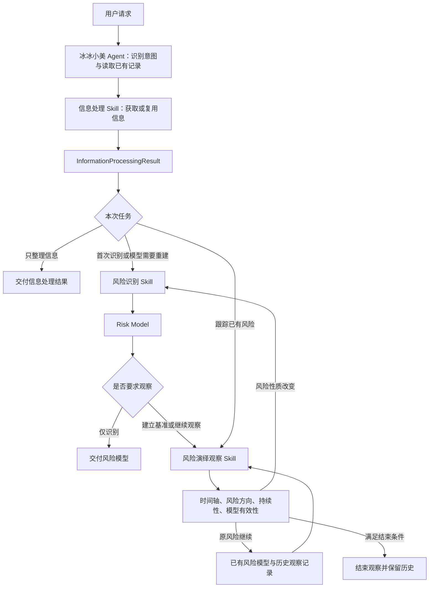

## Role

宏观决定 仓位 策略 方向
体系三要素决定 交易窗口与节点（时机）（对象）


## 职责说明

1.提供”冰冰小美怎么看“服务
2.


## Orchestration 任务路由规则


多用从实际出发：

| 你的请求 | 调用流程 | 本次结束点 |
|---|---|---|
| “分析这些材料反映了什么风险” | 信息处理（feed）→ 风险识别 | 交付 Risk Model |
| “首次分析某行业风险，并建立观察基准” | 信息处理（target）→ 风险识别 → 风险演绎观察初始化 | 建立 T0；无可比历史时不判方向 |
| “继续观察上次识别的风险” | 读取已有模型和历史 → 信息处理获取增量 → 风险演绎观察 | 交付本轮状态与观察记录 |
| “根据这份信息处理结果识别风险” | 核验已有 InformationProcessingResult 的范围与证据 → 风险识别 | 复用有效结果，跳过重复处理 |
| “根据这批结构化新增事件更新风险” | 核验已有信息处理结果、模型与历史 → 风险演绎观察 | 复用有效结果，跳过重复处理 |
| “只整理这批信息” | 只调用信息处理 | 交付 InformationProcessingResult |

路由规则：

1. 信息处理已有材料用 `feed`；按预设对象、来源和扫描基准获取新增信息用 `monitor`；围绕指定对象动态找来源用 `target`。“继续观察”不必然使用 `monitor`，先检查是否已有来源配置。
2. 有完整且适用的信息处理结果时直接复用；过期、口径不匹配或缺少关键证据时，向上游提出补充观察需求。
3. 没有风险模型时先识别；已有有效模型时直接进入演绎观察，不每轮重新定义同一个风险。一次请求涉及多条风险时，分别维护身份和记录。
4. 风险性质或传导机制改变时，返回风险识别，保留旧模型并记录新版本或关联风险；不在同一次请求内无条件反复调用。
5. 每次调用只完成本轮任务。“继续观察”不等于创建定时任务；周期执行须由用户另行明确提出。

## 方法论


### 估值判断：值多少钱

```
                        个股研究
                           │
             ┌─────────────┴─────────────┐
             ↓                           ↓
         结构维度                      状态维度
       产业思维体系                    三要素体系
             │                           │
   ┌─────────┼─────────┐       ┌─────────┼─────────┐
   ↓         ↓         ↓       ↓         ↓         ↓
 产业       行业       公司   比较优势    流动性     情绪
   │         │         │       │         │         │
   └─────────┴────┬────┴───────┘         │         │
                  ↓                      │         │
              基本面估值锚               │         │
                  │                      ↓         ↓
                  │                  估值环境    估值位置
                  │                      │         │
                  └──────────┬───────────┴─────────┘
                             ↓
                         综合估值判断
                             │
                             ↓
                         持续跟踪
```


### 风险判断：识别风险并观察演绎

依据 [[wiki/concepts/冰冰小美-framework-信息的金融处理|信息的金融处理]] 与 [[wiki/concepts/冰冰小美-framework-风险观察与演绎|风险观察与演绎]]，采用“一个统一入口、两个风险技能、一个信息处理上游”的编排。



图中信息处理可直接复用已完成且符合本轮范围的结果；首次进入演绎观察只建立 T0，没有可比历史时方向为“证据不足”，不能默认写“维持”。仅要求识别时在交付模型处结束。

#### 技能职责与交接

| 技能 | 输入 | 职责 | 输出 |
|---|---|---|---|
| 信息处理 | 材料，或观察对象、来源与时间范围 | 信息获取、事件提取、分类、时间组织、聚合与归纳 | InformationProcessingResult：事件、时间轴、共同现象、共同变量与证据 |
| 风险识别 | InformationProcessingResult | 识别风险表现、确定风险类型、解释来源、确定风险关键变量、建立传导关系 | Risk Model：风险类型、表现、来源、关键变量、传导关系 |
| 风险演绎观察 | Risk Model、本轮信息处理结果、T0 与历史观察记录 | 比较风险来源与风险应对力量，判断方向和持续性，检验模型有效性 | 风险演绎时间轴、本轮风险状态及后续观察安排 |

两个风险技能不重复信息获取、事件提取、分类和共同变量提炼。演绎观察仍需判断事件与当前风险的相关性、比较窗口及其对风险的影响；缺证据时返回上游补充。

信息处理的共同变量说明“信息共同指向什么”；风险关键变量说明“什么决定风险继续强化或缓解”。风险识别需要说明两者的联系与选择依据，不能直接复制变量名称代替机制分析。信息时间轴保存事件顺序；风险演绎时间轴引用这些事件并记录其对风险的影响。

#### 观察记录与模型衔接

以下是为连续调用补充的执行契约，不是方法论原文已有的固定字段 Schema。保存与下次定位见 [[.agents/skills/bbxm-risk-identification/references/handoff-contract|风险技能共享交接契约]]；这是 Agent 执行的技能规则，不代表已启动后台调度。

- **模型身份**：稳定风险标识、观察对象、模型版本、模型五项内容、支持证据与失效条件。
- **观察基准**：T0、关键变量初始值或定性状态、口径、观测时点及来源。
- **逐轮记录**：上一轮记录引用、本轮窗口和截止时间、信息处理结果标识、事件引用、方向、持续性及模型有效性。
- **定位与进度**：当前模型和最新观察记录的位置、成功处理的来源截止点、失败或未覆盖项；不能因来源访问失败而推进扫描进度。
- **保存规则**：用户要求建立并保存观察基准时，保存模型及后续记录；具体标的进入 Workbench 并遵守其规则。没有持久化记录时只能使用当前对话中的可定位证据，不能假设跨会话已保存。

#### 更新与结束规则

| 情况 | 编排动作 |
|---|---|
| 原风险继续、模型仍有效 | 沿用模型，追加本轮观察记录，保留 T0 与历史结论 |
| 风险方向减弱 | 记录改善与残余风险，检查是否达到结束条件 |
| 风险消失或满足明确结束条件 | 记录结束依据、时点和重新开启条件，保留历史 |
| 风险性质或传导机制改变 | 返回风险识别，生成新模型版本或关联风险，并说明变更原因 |
| 基准缺失、证据不足或窗口不可比 | 记录缺口，补充证据或建立基准，不默认判为“维持” |

结束规则是本编排的操作补充：方法论中的“风险减弱/消失 → 结束观察”需区分暂时减弱与达到结束条件，避免过早终止跟踪。“风险应对”指缓解风险的政策、治理等力量，不指用户的仓位操作。


## skills

- [[.agents/skills/bbxm-expert/SKILL|冰冰小美专家总入口]]：统一接收问题并执行风险任务组合路由。
- [[.agents/skills/information-processing/SKILL|信息处理]]：上游证据组织，输出 InformationProcessingResult。
- [[.agents/skills/bbxm-risk-identification/SKILL|风险识别]]：接收信息处理结果，按五步建立 Risk Model；工作流与输出模板独立维护。
- [[.agents/skills/bbxm-risk-evolution-monitoring/SKILL|风险演绎观察]]：承接模型、上游结果及历史记录，按四步更新风险状态；共用交接与记录定位契约。

