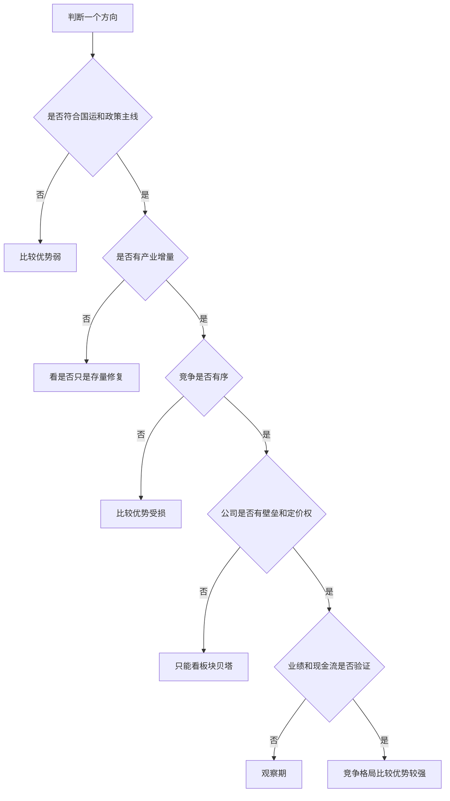

# 冰冰小美-concept-竞争格局的比较优势

## 1. 一句话定义

竞争格局的比较优势=
     在当前国情、产业阶段、供需结构、政策方向和市场定位下，
	 哪个行业、公司、资产方向，相对其他方向
	 更容易获得政策、需求、利润、资金、市场信心支持的位置。
 
---

## 2. 概念来源

- 原始资料：[[sources/articles/2024-06-20-冰冰小美-投资体系|2024-06-20《冰冰小美投资体系》]]。
- 早期体系来源：[[sources/articles/2023-07-21-冰冰小美：体系三要素|2023-07-21《体系三要素》]] 中，作者把“竞争格局的比较优势”列为体系三要素的第一项。
- 相关来源：[[sources/articles/2026-05-18-冰冰小美：竞争格局的比较优势|2024-05-27《竞争格局的比较优势》]]。
- 补充来源：[[sources/manual/372290338/四、投资认知与感悟类/1、国运与长期投资理念/252_价值投资笔记一|2023-02-22《价值投资笔记一》手动来源]] 将“护城河与核心竞争力”的讨论引向“竞争格局的比较优势”，并用消费品企业案例说明品牌、专利、供应链话语权、用户转换成本和应用场景差异如何共同影响企业比较优势。
- 原文概念：作者直接使用“竞争格局的比较优势”，并说明它在于理解国情与市场定位。

---

## 3. 概念要解决的问题

由于世界局势复杂多变，锚定长期清晰，锚定短期不确定性强。

1.在宏观方向的竞争格局比较优势下确认产业趋势

2.产业趋势确认之后，对产业链各环节、各公司、各标的进行横向比较，找出最贴近需求增量、最具供给壁垒、最有业绩弹性、最容易被资金重新定价的对象。

---

## 宏观方向

### 国家战略维度

国家长期发展原则是什么？
哪些资产符合国家战略安全？
哪些产业会获得长期政策优先级？

 关键词:
国产替代
中美

###  国家经济增长模式切换维度

再问：它是在接替旧增长，还是困在旧增长里？

国家经济增长的主导模式发生变化后,符合新增长模式的产业可获得长期竞争格局改善.

原文把竞争视为事物发展的必然规律。竞争不是静态比较，而是长期与短期判断、实践和斗争共同展开的过程；社会经济轨迹、产业链变化和个人命运都会被竞争改写。

### 国家战略金融资源维度

国家金融体系、资本市场制度和长期资金导向服务

### 大国战略关系维度

当前的大国之间的战略关系是什么?战略关系利好的产业是什么?

中美关系:
和平与发展→安全与发展→竞争与合作发展。

比如中日关系恶化利好的产业?  中日关系与国产替代的 电子化学品
比如中韩合作关系利好的产业?
比如中美竞争关系 利好的产业?

## 中观方向
### 中观产业维度

: 看行业处于增量、存量，还是天花板阶段
同质化竞争既可能扩张生产力，也可能走向天花板

这是产业层判断。

冰冰小美讲同质化竞争时，说前期规模效应会降低成本、推动就业、利于出口；但当产能快速达到天花板后，价格低迷、原材料涨价、利润下降、消费能力减弱，副作用会出现，所以同质化竞争要看总量、存量、天花板。

所以要问：

|问题|含义|
|---|---|
|行业还有没有总量增长？|需求还能不能扩张|
|是增量市场还是存量市场？|增量更容易出大机会|
|是否接近天花板？|接近天花板后内卷加剧|
|供给是否过剩？|过剩会压利润|
|价格是否还在下降？|价格战会破坏盈利|
|成本优势是否还有效？|原材料涨价会侵蚀成本优势|

判断结果：
增量需求 + 供给可控 + 成本下降 + 利润改善 = 比较优势增强存量竞争 + 产能过剩 + 价格战 + 利润下滑 = 比较优势减弱

### 差异化竞争的核心是壁垒和定价权

原文强调，差异化竞争不是多业务扩张，而是企业继续做强技术、做优服务、形成不同于同行的优点或市场卖点。技术、服务、商业模式、毛利率、客户粘性和品牌，都可能形成短期难以撼动的壁垒。

当市场选择逐渐集中，差异化优势可能形成一定垄断格局和定价权。困境中塑造出的品牌，反而可能因为低价、质量或服务优势更受欢迎，并给投资者带来长期回报。

### 护城河必须拆到核心竞争力和受制环节

[[sources/manual/372290338/四、投资认知与感悟类/1、国运与长期投资理念/252_价值投资笔记一|2023-02-22《价值投资笔记一》]] 把价值投资中的“护城河”进一步拆成品牌、专利、特许使用权、地理位置或资源、网络效应、高转换成本、低成本优势，以及直面消费者的产品或服务能力。作者随后强调，这组护城河判断会引出体系中更重要的支撑：竞争格局的比较优势。

这补充了本页的企业层判断：一个企业即使有品牌或专利，也不必然具备牢不可破的比较优势。仍要继续检查：

| 检查项 | 要判断的问题 | 对比较优势的含义 |
|---|---|---|
| 供应链话语权 | 核心传感器、芯片、原材料或关键部件是否受制于人？ | 受制环节越多，企业越难把品牌优势转化为利润优势 |
| 用户必要性 | 消费者是否“非买不可”，还是只是阶段性可选消费？ | 需求刚性和用户习惯决定优势能否穿越周期 |
| 转换成本 | 放弃产品或服务的成本是否高于继续使用？ | 转换成本越高，客户粘性越能支撑定价权 |
| 网络效应 | 使用者增加是否会提升产品或服务价值？ | 网络效应能把单点产品优势放大为平台优势 |
| 成本与流程 | 是否有规模、流程或低成本优势？ | 成本优势能在同质化竞争中提高生存能力 |
| 场景差异 | 企业是否占据不同应用场景，而不是和同行正面同质化竞争？ | 场景分化能降低直接价格战风险 |

原文用科沃斯、传统家电和海外市场空间作案例，重点不是给出当前买卖结论，而是说明：护城河要被拆开看，品牌、专利、成长空间、供应链话语权、用户习惯和应用场景都要分别检查。整理者归纳：企业比较优势不是“有一个亮点”就成立，而是多个护城河要素能否共同支撑长期定价权、利润空间和竞争秩序。^[inferred]

### 有序与无序竞争决定优势是否可持续

这是风险判断。

冰冰小美讲“有序到无序竞争”时，提到价格战、现金流压力、补贴变化、金融杠杆、劣币驱逐良币，并强调要定义此时竞争是有序还是无序。

判断方式：

|竞争状态|表现|结论|
|---|---|---|
|有序竞争|龙头份额提升，价格稳定，利润可持续|比较优势增强|
|良性同质化|规模效应降本，需求仍然旺盛|阶段性有优势|
|无序竞争|价格战、亏损扩张、现金流恶化|比较优势下降|
|劣币驱逐良币|坏公司靠低价破坏行业生态|高风险|
|政策补贴退潮|扶持离开后企业无法独立生存|高风险|

一句话判断：

> **竞争带来效率提升，是优势；竞争变成互相伤害，就是风险。**

### 竞争最终落到人

竞争最终是人与人之间展开，落到企业文化与掌门人对企业未来的驾驭和创造。因此，“投资就是投人”是这个概念的重要延伸。

在长线选择里，竞争格局的比较优势偏向国情与市场定位，选股则进一步落到人和企业经营；在短线选择里，它也可能表现为人心所向的情绪标投机。前者偏长期，后者偏短期，不能混用。

### 市场信心的载体

冰冰小美在核心观念里说，与国策相关的个股，要找到能够提振市场信心、提升情绪位置、情绪有利的个股；她也说竞争格局要看国家的比较优势，强弱是相对的，是对现阶段经济社会变化的理解。

所以投资里还要看市场是否认可：

|观察点|含义|
|---|---|
|龙头是否持续走强|市场是否愿意给核心资产溢价|
|板块是否扩散|是否从个股逻辑变成产业共识|
|回调后是否有人承接|是否有真实资金信仰|
|利好后是否兑现业绩|是否从情绪进入基本面验证|
|资金是否反复回流|是否成为阶段主线|

这里不是单纯看涨跌，而是看：

> **这个方向能不能承载市场信心。**

### 在体系三要素中的方向资格

[[sources/articles/2023-07-21-冰冰小美：体系三要素|2023-07-21《体系三要素》]] 中，作者把竞争格局的比较优势落到当时的“内需”方向：央行报告、重大文件和市场标杆，被她用来说明政策和经济形式正在让某条主线变得更清晰。

整理为长期概念时，不能把“内需”这个具体案例机械外推，而应保留背后的判断顺序：

1. 先看当前国情、政策市特征和经济形式是否指向某些方向。
2. 再看该方向是否具备产业、企业或资产层面的相对有利位置。
3. 最后才交给 [[冰冰小美-concept-流动性辩证分析|流动性辩证分析]] 和 [[concepts/冰冰小美-concept-情绪位置的变化|情绪位置的变化]] 判断资金和人心是否跟上。

这就是“阻力最小方向”的第一层：方向本身先要有资格，否则后续流动性和情绪即使短暂有利，也容易变成题材轮动或套利卖点。

### 交易中的定位与立场

[[sources/manual/372290338/一、核心体系/5、仓位管理与交易策略/114_情绪体系交易篇第十五期：竞争格局的比较优势之定位与立场|2024-05-05《情绪体系交易篇第十五期：竞争格局的比较优势之定位与立场》]] 把“比较优势”进一步放回交易定位：投资美股要立足美国历史和经济发展，投资 A 股要立足中国国情、融资市场定位、交易制度、投资与投机之间的反复，以及不同参与者的利益立场。

在这个语境里，定位回答“这个市场为什么这样运转”，立场回答“不同参与者为什么这样行动”。散户希望上涨，大股东、融资方、量化、题材链条和长期资金的行为并不一致；交易体系要先理解这些立场差异，再决定哪些方向能进入买入范围。

这补强了本概念的交易用途：竞争格局的比较优势不是只看行业强弱，而是先判断市场角色、制度约束和长期共识如何共同改变方向资格。只有上涨方向、持续承接、市场信心和多数参与者利益更一致时，比较优势才可能从“上层判断”落成交易窗口。

---

## 5. 判断标准 / 使用检查表

| 维度   | 判断问题       | 强势信号              | 弱势信号         |
| ---- | ---------- | ----------------- | ------------ |
| 国运方向 | 是否符合国家发展路线 | 安全、科技、工业化、出海、自主可控 | 旧模式、旧杠杆、政策退潮 |
| 产业阶段 | 是否处于增量阶段   | 需求扩张、渗透率提升        | 存量内卷、需求见顶    |
| 供需格局 | 供给是否可控     | 供不应求、价格稳定         | 产能过剩、价格战     |
| 竞争状态 | 是否有序竞争     | 龙头集中、份额提升         | 无序竞争、劣币驱逐良币  |
| 差异化  | 是否有壁垒      | 技术、品牌、成本、渠道、服务    | 同质化严重        |
| 护城河质量 | 品牌、专利、转换成本、网络效应和供应链话语权是否共同成立 | 多个护城河要素互相强化 | 只有单一亮点，核心环节受制于人 |
| 盈利能力 | 是否能赚钱      | 毛利稳定、现金流好         | 利润下滑、现金流恶化   |
| 人和组织 | 管理层是否可靠    | 战略清楚、执行强          | 乱扩张、高杠杆、品行差  |
| 市场信心 | 是否被市场认可    | 资金回流、龙头走强         | 利好不涨、反弹无承接   |

---
## Mermaid流程图

## 6. 概念边界
- 它不是：单个企业静态排名、短期热门题材、或“强者恒强”的口号。
- 它不等于：看到龙头、低价、产能扩张、政策支持就直接买入。
- 它主要适用于：判断方向资格、长期观察池、产业竞争位置和长线选股前置条件。
- 它不适用于：脱离流动性、情绪位置、估值和仓位承受力，直接给出买卖动作。

在 [[topics/冰冰小美-情绪体系理论篇|体系三要素]] 中，竞争的比较优势只是第一层。它回答“方向有没有资格”，不回答“资金是否承接”和“情绪是否合力”。后两者仍要交给 [[冰冰小美-concept-流动性辩证分析|流动性辩证分析]] 与 [[concepts/冰冰小美-concept-情绪位置的变化|情绪位置变化]] 校验。

---

## 7. 与相近概念的区别

- [[topics/冰冰小美-情绪体系理论篇|冰冰小美-体系三要素]]：体系三要素是完整交易窗口检查框架；竞争的比较优势只是其中的方向资格层。
- [[concepts/冰冰小美-framework-长线四大选股体系|长线四大选股体系]]：长线四大选股体系把方向资格进一步落到具体企业经营、壁垒、盈利模式、定价权和周期共振。
- [[冰冰小美-concept-流动性辩证分析|流动性辩证分析]]：流动性辩证分析判断资金是否围绕方向形成承接；竞争的比较优势判断方向本身是否值得承接。
- [[concepts/冰冰小美-concept-情绪位置的变化|情绪位置变化]]：情绪位置判断人心和亏钱/挣钱效应；竞争的比较优势判断方向资格与产业位置。

---

## 8. 在当前知识库中的作用

- 作为三要素第一层：为 [[topics/冰冰小美-情绪体系理论篇|体系三要素]] 提供“方向资格”的概念解释。
- 作为长线选股前置：连接 [[concepts/冰冰小美-framework-长线四大选股体系|长线四大选股体系]] 中“国家竞争比较优势主导”和“企业经营壁垒”的判断。
- 作为宏观主题支撑：解释 [[topics/冰冰小美-宏观经济|宏观经济]] 中为什么房地产阶段结束、高端制造、央国企使命和金融改革会改变资产相对位置。
- 作为地缘重估支撑：解释 [[topics/冰冰小美-地缘重估与资源-货币秩序|地缘重估与资源-货币秩序]] 中供应链重构、产业安全和全球利润分配如何进入资产判断。
- 作为人物理念组成部分：补充 [[people/冰冰小美|冰冰小美]] 对“投资就是投人”“竞争格局决定方向资格”的长期框架。

---

## 9. 原文依据

原文摘录：

> 竞争是事物发展的必然规律。

> 竞争格局的比较优势，就是基于这种影响力，在不同国家国情下，相对有利的地位。

> 竞争格局的比较优势在于理解国情与市场定位，选股则是投人，或者人心所向的情绪标投机。

> 同质化竞争未必不是好事。

> 差异化竞争的核心在于壁垒的形成。

> 劣币驱逐良币是毁灭之路。

补充来源明确提出：

- [[sources/manual/372290338/四、投资认知与感悟类/1、国运与长期投资理念/252_价值投资笔记一|2023-02-22《价值投资笔记一》]] 将护城河拆为品牌、专利、特许使用权、独特地理位置或资源、网络效应、高转换成本、低成本优势和直面消费者的产品服务能力，并明确把“护城河与核心竞争力”引申到“竞争格局的比较优势”。
- 同一来源用科沃斯案例说明：品牌和专利只是局部优势，若核心部件、原材料、用户必要性和转换成本不强，仍不能直接写成牢不可破的护城河。

整理说明：

本页合并了原 View Page 中“安全与发展再平衡”的内容，但不再把它作为独立观点页维护。该宏观展开保留为“比较优势在国情、产业竞争和金融制度重估中的应用场景”。原文评论区内容只作为辅助背景，不写成确定事实或当前投资建议。

## 不确定性

- 本页整理的是冰冰小美个人投资体系中的概念，不等于通用经济学定义。
- 原文中的行业和公司示例具有发布时间语境，不能直接迁移为当前买卖结论。
- [[sources/manual/372290338/四、投资认知与感悟类/1、国运与长期投资理念/252_价值投资笔记一|2023-02-22《价值投资笔记一》]] 中的科沃斯、传统家电、海外空间等案例属于 2023-02-22 语境下的作者观察，本页只提炼护城河检查方法，不更新这些公司的当前经营事实或估值。
- 判断某个方向是否具备比较优势，还需要结合最新产业数据、政策环境、估值、流动性和账户承受力。

## 相关页面

- [[people/冰冰小美|冰冰小美]]：该概念属于作者交易和选股体系中的方向资格层。
- [[topics/冰冰小美-情绪体系理论篇|冰冰小美-体系三要素]]：竞争的比较优势是三要素中的第一层。
- [[concepts/冰冰小美-framework-长线四大选股体系|冰冰小美-framework-长线四大选股体系]]：长线选股需要把比较优势落到企业经营和长期壁垒。
- [[冰冰小美-concept-流动性辩证分析|冰冰小美-concept-流动性辩证分析]]：方向具备比较优势后，还要检查资金是否形成承接。
- [[concepts/冰冰小美-concept-情绪位置的变化|冰冰小美-concept-情绪位置的变化]]：方向与资金之外，还要检查市场参与者是否形成情绪合力。
- [[topics/冰冰小美-宏观经济|宏观经济]]：该概念解释宏观阶段切换如何改变产业与资产相对位置。
- [[topics/冰冰小美-地缘重估与资源-货币秩序|地缘重估与资源-货币秩序]]：该概念解释全球产业竞争和供应链重构如何影响比较优势。

## 来源

- [[sources/articles/2024-06-20-冰冰小美-投资体系|2024-06-20《冰冰小美投资体系》]]
- [[sources/articles/2023-07-21-冰冰小美：体系三要素|2023-07-21《体系三要素》]]
- [[sources/articles/2026-05-18-冰冰小美：竞争格局的比较优势|2024-05-27《竞争格局的比较优势》]]
- [[sources/manual/372290338/一、核心体系/5、仓位管理与交易策略/114_情绪体系交易篇第十五期：竞争格局的比较优势之定位与立场|2024-05-05《情绪体系交易篇第十五期：竞争格局的比较优势之定位与立场》手动来源]]
- [[sources/manual/372290338/四、投资认知与感悟类/1、国运与长期投资理念/252_价值投资笔记一|2023-02-22《价值投资笔记一》手动来源]]
