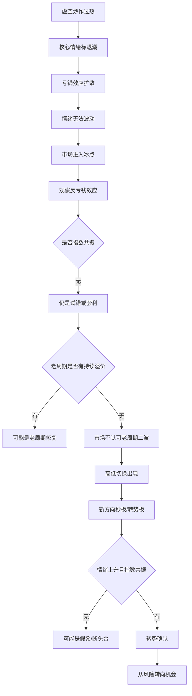

# 冰冰小美-冰点转势

## 1. 一句话定义

[[concepts/冰冰小美-冰点转势|冰点转势]] 是 [[people/冰冰小美|冰冰小美]] 在 [[concepts/冰冰小美-情绪体系|情绪体系]] 中用于描述“风险向机会转换”的概念：先识别冰点为何产生、亏钱效应由哪个情绪标触发，再观察是否出现指数共振、题材高低切换、虚空炒作向实体支撑切换，以及 [[concepts/冰冰小美-体系三要素|体系三要素]] 是否重新有利。

市场在极端亏钱效应导致情绪无法继续波动后，从情绪止点开始向上修复，并与指数信心共振，同时由更有利的新方向承接风险偏好，完成从恐慌到机会的阴阳转换过程。

---

## 2. 概念来源

- 早期来源：[[sources/manual/372290338/一、核心体系/4、情绪位置变化/075_情绪位置转折的理解|2022-11-03《情绪位置转折的理解》]] 已经提出“情绪不能波动”为冰点止点，并把冰点后情绪上升与指数共振合在一起称为转势板。
- 后续来源：[[sources/articles/2024-04-11-冰冰小美：情绪体系交易篇第十二期冰点转势|2024-04-11《情绪体系交易篇 第十二期 冰点的冰点发展美，转势》]]。
- 用户整理：[[sources/manual/2026-06-13-用户整理：冰点转势|2026-06-13 用户整理《冰点转势》]] 将两篇来源压成“冰点、转折、转势”三层结构，并补出真/假转势、一冰/二冰和判断模板。
- 原文概念：作者明确提出“转势是一种基于亏钱效应认知，以及面对风险，交易风险的行为”，并强调“冰点转折并不一定是转势板”。
- 整理者归纳：本页把原始来源和用户整理稿中的定义、案例和流程抽象为“冰点转势”概念，重点保留冰点止点、亏钱效应来源、指数共振、虚实切换、真假转势和体系三要素确认，而不把文中个股复盘扩写成交易建议。

---

## 3. 概念要解决的问题

```
什么时候市场情绪已经跌到无法继续波动？
什么时候冰点开始解除？
什么时候只是日内反弹？
什么时候才是真正转势？
什么时候冰点转折会变成假象或断头台？
```

在交易体系中，冰点转势服务于买入时机判断。

它不是单纯看跌多了就买，也不是看到某个票翘板就买，而是要同时识别：

```
亏钱效应来自哪里；
冰点是否真正形成；
情绪是否开始从止点上升；
指数是否同步共振；
新方向是否完成切换；
竞争格局、流动性、情绪位置是否共同有利。
```

---

## 4. 核心内涵

## 概念核心：冰点、转折、转势

冰点转势需要拆成三个层次：

```
冰点：情绪被打到无法继续波动
转折：情绪从止点开始向上
转势：情绪上升与指数共振，并由新方向承接市场信心
```

三者不能混在一起。

### 冰点

冰点的核心标志是：

```
情绪无法继续波动
```

典型表现包括：

```
核心股全部跌停
中军持续下跌
指数持续下跌
题材全面退潮
恐慌情绪蔓延
核按钮满天飞
高位人气标跌停
接力资金失去信心
```

当市场已经没有正常情绪波动，情绪进入近似“封死”的状态，才可以理解为冰点。

### 转折

转折从情绪止点开始。

当冰点后，情绪开始从无法波动转向向上修复，就进入冰点转折。

转折的表现可能包括：

```
核心亏钱标企稳
跌停标的翘板
恐慌开始缓和
反亏钱效应个股出现
多头开始买入止跌
局部题材开始试错
```

但转折只能说明冰点开始松动，还不能直接等同于转势。

### 转势

转势要求更高。

转势需要同时具备：

```
情绪从冰点向上
指数同步共振向上
新方向能够提振市场信心
旧亏钱效应被切断
新主线或新价值锚开始形成
```

作者将“情绪上升 + 指数共振上升”的关键板称为转势板。

如果缺少指数共振，或者只是局部翘板、老周期反抽、题材热度穿越，就容易变成假转势。

### 冰点形成的原因
冰点通常由亏钱效应不断扩散形成。

亏钱效应来源可能包括：

```
虚空炒作崩塌
核心情绪标连续下跌
题材过度炒作后退潮
连板高度崩溃
指数持续下跌
外围利空
流动性不足
制度变化
熔断式恐慌
老周期二波失败
```

冰点分析的第一步，是追溯：

```
这轮亏钱效应是谁制造的？
谁是引发恐慌的核心情绪标？
哪条主线造成了市场风险偏好坍塌？
```

例如在 2024 年案例中，作者将冰点的源头归结为 Kimi/Ai 虚空炒作引发的一地鸡毛，高新发展是其中的核心情绪标。因此，高新发展以及 Ai 传媒的企稳，就成为冰点解除的重要观察信号。


### 情绪止点：冰点判断的关键

很多人按天数划分情绪周期，作者认为这种方式存在问题。

情绪周期不应机械按天数切割，应以“情绪不能波动”为止点。

也就是说，判断冰点不看：

```
已经跌了几天
已经调整几天
已经杀到第几阶段
```

重点看：

```
情绪还能不能继续波动；
市场还有没有继续杀跌空间；
核心情绪标是否被封死；
中军和指数是否同步下跌；
恐慌是否已经扩散到无法正常交易。
```

当核心股、题材、中军、指数共同压制情绪，市场情绪进入无法波动状态，才接近冰点。

### 冰点转折的识别

冰点转折的核心是：

```
情绪从止点开始上升
```

观察指标包括：

```
核心亏钱情绪标是否企稳
跌停板是否开始翘板
高度人气标是否止跌
连板梯队是否停止继续坍塌
中军是否停止下跌
指数是否开始企稳
新的题材或方向是否开始试错
反亏钱效应个股是否出现
```

但冰点转折有多种质量。
但冰点转折有多种质量。

#### 低质量转折

低质量转折通常表现为：

```
老周期题材反抽
高位情绪标翘板
局部题材日内拉升
尾盘抢筹
没有指数共振
次日没有溢价
持续性不足
```

这种转折容易迷惑人，可能只是情绪自救。

#### 高质量转折

高质量转折通常表现为：

```
亏钱效应源头企稳
新方向切换明确
指数同步走强
反亏钱效应变成赚钱效应
流动性开始向新方向聚焦
市场认可新方向而非老周期二波
```

高质量转折才有进一步发展为转势的基础。

冰点转折不等于转势板

原文明确提醒，冰点转折可能是迷惑假象，也可能是断头台。也就是说，冰点后的第一个修复动作不自动具备交易价值。

这和 [[concepts/冰冰小美-等|等]] 的关系很近：冰点只是可能出现变化的地方，真正的交易还要等变化被市场行为证明，而不是为了证明自己看懂冰点而提前下场。

### 转势板
转势板是冰点转势中的关键观察对象。

它不是普通涨停板，也不是简单的首板。

转势板需要承担三重功能：

```
第一，确认冰点后的情绪上升；
第二，与指数信心共振；
第三，引导市场从亏钱效应切换到新的有利方向。
```

作者给出的核心条件是：

```
情绪上升
+ 指数共振上升
= 转势板
```

缺少其中任一条件，容易变成假转势。

作者引用《孙子兵法》中“兵无常势，水无常形”的意思，强调转势的交易含义是识别变化：识别原有方向的不利，识别新方向的有利，最后选择更有利的交易。

这与 [[concepts/冰冰小美-迂直|迂直]] 相互补充：迂直强调在不利条件中寻找阻力最小方向，冰点转势则强调在风险释放后识别风险向机会变化的过程。


---

## 5. 执行逻辑图

这张图把冰点转势压成一条观察链：先从核心股、中军和指数持续下跌中识别情绪是否已经无法波动，再从虚空炒作过热、核心情绪标退潮和亏钱效应扩散中识别冰点来源；随后判断试错期的反亏钱效应能否延续为挣钱效应、指数是否共振，最后区分真正转势与假象/断头台。



---

## 6. 判断标准 / 识别信号

- 亏钱效应来源：上一轮冰点由哪个情绪标、题材或拥挤交易触发，亏钱效应是否已经被市场识别。
- 冰点止点：核心股、中军和指数持续下跌后，情绪是否已经无法继续有效波动，而不是只按日期或跌幅认定冰点。
- 反亏钱效应：冰点后是否出现“不让人亏钱”的个股，显示多头开始买入止跌，而不是只有短暂套利火花。
- 试错期风险：题材活跃但主线不明时，是否仍在快速轮动和争夺流动性；此时情绪仍可能突然向下，再次奔向冰点。
- 老周期失效：老周期方向的翘板、回封或二波尝试是否没有溢价、没有持续性，说明市场不认可旧方向继续承担情绪修复。
- 高低切换：高位人气标继续杀跌或破板，低位新方向开始承接，显示情绪梯队下降和题材切换。
- 指数共振：新的方向不只是局部涨停，而是情绪上升同时带动指数信心、板块扩散和市场承接改善。
- 虚实切换：炒作从缺少实体支撑的虚空题材，转向更能连接实体经济、制造业、新质生产力或可验证竞争格局的方向。
- 体系三要素：竞争格局、流动性和情绪位置在新节点上形成相对有利，而不是只靠短时流动性翘板。

---


---

## 8. 判断流程

将冰点转势用于复盘时，可以按七步压缩判断：

1. 识别亏钱效应源头：本轮风险来自虚空炒作崩塌、核心情绪标下跌、老周期退潮、指数下跌、流动性不足，还是外部利空。
2. 判断是否进入冰点：核心股、中军、指数、接力梯队和核按钮是否共同显示市场失去正常波动。
3. 观察冰点是否解除：亏钱效应源头是否企稳，核心情绪标是否翘板或止跌，是否出现反亏钱效应个股。
4. 判断是否只是老周期反抽：上涨方向是否来自老周期，是否有次日溢价，是否能带动指数信心和新梯队。
5. 判断是否与指数共振：指数是否同步企稳或上涨，中军和权重是否配合，市场信心是否恢复。
6. 判断新方向质量：是否有实体经济支撑、新质生产力或制造业逻辑，是否有竞争格局比较优势、价值锚和流动性承接。
7. 给出结论：非转势、假转势、日内转折、转势板，或高质量转势板。

这个流程的输出不是“买入指令”，而是把市场状态分层：未到冰点、冰点预期、冰点形成、日内转折、假转势、真转势；再决定观察、试错、参与或回避。

---

## 9. 概念边界

- 它不是：任何冰点后的反弹都叫转势。
- 它不等于：第一个翘板、回封或涨停板自动成为转势板。
- 它也不等于：试错期题材活跃、轮动变快或局部套利变多。
- 它主要适用于：短线情绪冰点后，判断风险是否正在向机会转换。
- 它不适用于：脱离当日市场结构、指数共振、流动性承接和竞争格局，只用个股形态机械判断买点。

---

## 10. 与相近概念的区别

- [[concepts/冰冰小美-情绪冰点判断|情绪冰点判断]]：情绪冰点判断回答“恐慌是否接近日内情绪底”；冰点转势回答“冰点之后是否真正从风险切到机会”。
- [[concepts/冰冰小美-情绪周期|情绪周期]]：情绪周期关注情绪位置、情绪标和流动性溢价如何螺旋变化；冰点转势关注冰点之后的新旧方向切换和指数共振确认。
- [[concepts/冰冰小美-迂直|迂直]]：迂直强调在不利局面中顺应变化、选择阻力最小方向；冰点转势强调亏钱效应释放后，如何识别新方向是否已经更有利。
- [[concepts/冰冰小美-体系三要素|体系三要素]]：体系三要素是总体筛选条件；冰点转势是三要素在冰点后重新形成有利状态的一种交易场景。

---

## 11. 在当前知识库中的作用

- 作为 [[concepts/冰冰小美-情绪冰点判断|情绪冰点判断]] 的下游概念，说明冰点之后为什么还要继续验证。
- 作为 [[concepts/冰冰小美-情绪体系|情绪体系]] 的执行层补充，把亏钱效应、指数共振、题材切换和实体支撑连成一个转势判断框架。
- 作为 [[people/冰冰小美|冰冰小美]] 判断风格的一部分，体现她并不满足于看见情绪修复，而是继续追问修复是否有实体支撑、指数信心和三要素有利。

---

## 12. 原文依据

原文摘录：

> 转势是一种基于亏钱效应认知，以及面对风险，交易风险的行为。

> 冰点转折并不一定是转势板，有可能是迷惑的假象，有可能是断头台。

> 冰点的转势，一定是指数共振。

> 情绪不能波动为止点。

> 冰点开始上升情绪，同时与指数共振上升，称为转势板。

整理说明：

本页只沉淀“冰点转势”作为情绪体系中的交易判断概念。原文中的个股和板块案例用于说明冰点止点、亏钱效应来源、题材切换、指数共振和虚实变化，不应扩写为个股推荐或确定性交易规则。

## 不确定性

- 原文中的盘面案例和个股表现未在本次整理中独立核验。
- “转势板”“二冰”“指数共振”等属于作者交易语境，具体判断必须结合当时市场结构、成交承接、涨跌家数、指数状态和板块扩散。
- 2022-11-03 原文强调的试错期和转势板，依赖当时短线生态、涨停板制度和流动性环境，不能机械迁移为固定买点。
- 用户整理稿中的判断流程是二次归纳，本页将其作为复盘口径保留，不替代原文案例和实时市场验证。
- 本页记录的是作者框架中的判断变量，不构成机械买入规则。

## 相关页面

- [[people/冰冰小美|冰冰小美]]：该概念属于作者情绪体系交易篇的一部分。
- [[concepts/冰冰小美-情绪体系|冰冰小美-情绪体系]]：冰点转势把亏钱效应、风险识别和交易风险纳入情绪体系。
- [[concepts/冰冰小美-情绪周期|冰冰小美-情绪周期]]：冰点转势是情绪周期中从冰点到新方向扩散的一个交易场景。
- [[concepts/冰冰小美-情绪冰点判断|冰冰小美-情绪冰点判断]]：冰点转势发生在冰点识别之后，要求进一步确认是否真正转势。
- [[concepts/冰冰小美-体系三要素|冰冰小美-体系三要素]]：冰点转势需要竞争格局、流动性和情绪位置形成有利。
- [[concepts/冰冰小美-迂直|冰冰小美-迂直]]：两者都强调识别变化并选择更有利的交易方向。

## 来源

- [[sources/manual/372290338/一、核心体系/4、情绪位置变化/075_情绪位置转折的理解|2022-11-03《情绪位置转折的理解》]]
- [[sources/articles/2024-04-11-冰冰小美：情绪体系交易篇第十二期冰点转势|情绪体系交易篇第十二期：冰点转势]]
- [[sources/manual/2026-06-13-用户整理：冰点转势|2026-06-13 用户整理《冰点转势》]]
