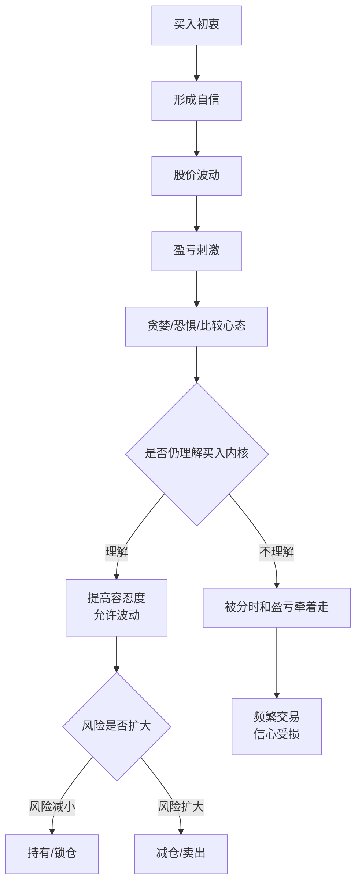

---
title: "冰冰小美-容忍度"
page_type: concept
type: "concept"
status: active
aliases:
  - "容忍度"
  - "交易容忍度"
  - "情绪体系容忍度"
  - "情绪体系交易篇容忍度"
tags:
  - "strategy/discipline"
  - "strategy/risk-control"
  - "strategy/position-sizing"
  - "learning/decision-style"
created: 2026-05-28
updated: 2026-06-09
source:
  - "[[sources/articles/2023-05-06-冰冰小美：情绪对自身的影响与人生豁达|情绪对自身的影响与人生豁达]]"
  - "[[sources/articles/2024-04-02-冰冰小美：情绪体系交易篇容忍度|情绪体系交易篇：容忍度]]"
  - "[[sources/articles/2025-12-17-冰冰小美：收益率与平常心|收益率与平常心]]"
related:
  - "[[concepts/冰冰小美-情绪体系|冰冰小美-情绪体系]]"
  - "[[concepts/冰冰小美-情绪体系的心理前置篇|冰冰小美-交易豁达]]"
  - "[[concepts/冰冰小美-性格匹配|冰冰小美-性格匹配]]"
  - "[[concepts/冰冰小美-买卖|冰冰小美-买卖]]"
  - "[[concepts/冰冰小美-分仓|冰冰小美-分仓]]"
  - "[[concepts/冰冰小美-相信|冰冰小美-相信]]"
  - "[[concepts/冰冰小美-空仓|冰冰小美-空仓]]"
  - "[[concepts/冰冰小美-交割单认知|冰冰小美-交割单认知]]"
  - "[[views/冰冰小美：收益率与平常心服务本金保护和逆周期持有的判断框架|收益率与平常心服务本金保护和逆周期持有]]"
  - "[[people/冰冰小美|冰冰小美]]"
summary: "冰冰小美情绪体系中的交易心理与仓位纪律概念：容忍度衡量交易者面对得失、成败、比较心态和分时波动时，能否回到买入初心、自信来源、时间评价和风险约束。"
---

# 冰冰小美-容忍度

## 1. 一句话定义

[[concepts/冰冰小美-容忍度|容忍度]] 是 [[people/冰冰小美|冰冰小美]] 情绪体系中的交易心理与仓位纪律概念：它衡量交易者面对得失、成败、比较心态和分时波动时，能否回到买入初心、自信来源、时间评价和风险约束，而不是被短期涨跌直接驱动买卖。

在这套框架里，容忍度不是“忍住不动”的美德，而是买卖动作背后的心理承受结构。买包括买入，也包括不卖；卖包括卖出，也包括不买。真正的问题是：当前动作来自体系内的自信和风险判断，还是来自贪婪、恐惧、比较和焦躁。

---

## 2. 概念来源

- 原文来源：[[sources/articles/2024-04-02-冰冰小美：情绪体系交易篇容忍度|2024-04-02《情绪体系交易篇，容忍度》]]。
- 原文定义：作者把容忍度定义为一个人对待得失、成败时表现出的“动静”问题，并把这种动静映射到交易市场中的买卖。
- 整理者归纳：本页把原文中关于自信、买入初心、比较心态、时间评价、控仓和做 T 风险的内容，整理为情绪体系中的“容忍度”概念。

---

## 3. 概念要解决的问题

- 解释为什么同样的浮盈、回撤或横盘，对不同交易者会触发完全不同的买卖动作。
- 解释为什么只盯股价波动，会让交易者忽略买入初衷、市场行为和卖出的不利。
- 解释为什么交易表现不能脱离时间评价：一个月 40% 和四个月 30% 对心理的冲击不同，但不能只用结果绝对值判断好坏。
- 解释为什么控仓可以提高容忍度：降低本金受伤概率后，交易者才有余地谈继续持有、做 T 或参与其他机会。

---

## 4. 核心内涵

### 4.1 容忍度体现得失面前的动静

原文把容忍度放在“得失、成败、动静”之间理解。交易中的动静就是买卖：买入和不卖都属于买，卖出和不买都属于卖。

这意味着，容忍度不是被动承受，而是决定交易者在波动中如何选择动作。一个人看似没有动，其实可能是在执行“不卖”；一个人看似卖出，也可能是在执行“不买”的风险纪律。

### 4.2 股价波动会把注意力从市场行为拉回自我情绪

原文强调，盈亏会放大贪婪、恐惧和比较心态。尤其当别的方向上涨、自己持仓下跌时，交易者容易产生“损失一个亿”的错觉。

这种状态下，人会极度关注股价波动，忽略 [[concepts/冰冰小美-买卖|买入的初衷]]、卖出的不利和真实市场行为。容忍度的作用，就是把注意力从短期情绪重新拉回交易理由。

### 4.3 自信来自买入内核，不来自短期盈亏

原文用长期持仓案例说明：短期盈亏代表不了太多，可能只是更会博弈、踩中热点或运气更好；长期持仓形成的盈利和验证，才更容易建立不被波动击倒的自信。

因此，容忍度的核心来源不是盲目乐观，而是买入时是否已经想清楚核心内核。买入节点和自信来源，往往已经决定后续交易能否经受波动。

### 4.4 卖不卖不是只看波动，而是看买后是否后悔

原文讨论铜和西部矿业时提出：如果买入后并没有亏损，也没有后悔，卖就不那么重要。卖出不能只因为“阶段顶”或价格波动，而要回到为什么买、何时卖、为什么卖。

这与 [[concepts/冰冰小美-相信|相信]] 和 [[concepts/冰冰小美-买卖|买卖]] 相连：当买入来自经过验证的信心和体系判断，短期波动不应直接推翻原始理由；但如果买入理由本身不足，容忍度也不能用来包装硬扛。

### 4.5 比较心态会放大对回撤和时间的痛苦

同样一笔交易，持有一个月赚 40%，和持有四个月后只剩 30%，心理体验完全不同。原文认为，是否能接受这种评价，取决于交易者能否容忍得失，也取决于是否把时间纳入评价。

这说明容忍度不是只看盈利百分比，而要把时间、风险、机会成本和当时市场环境一起看。脱离时间的好坏评价，很容易把交易者推向焦躁和反复无常。

[[sources/articles/2023-05-06-冰冰小美：情绪对自身的影响与人生豁达|2023-05-06《情绪对自身的影响与人生豁达》]] 把这种比较心态提前到“卖飞、错过、看着曾经放弃的标的创新高”的场景：这些折磨几乎月月都有，做交易前就应该有所准备。能否看淡错过，是对贪婪的拒绝，也是容忍度在机会成本上的表现。

[[sources/articles/2025-12-17-冰冰小美：收益率与平常心|2025-12-17《收益率与平常心》]] 又把容忍度推进到“收益率比较”的场景：与自己无关的妖股暴利，只会像邻居中奖一样刺激不必要的痛苦。真正需要被评价的是自身账户、试错成本、本金保护、买入理由和能否承受逆周期持有的时间成本。

### 4.6 控仓能把容忍度具体化

原文提出，若盈利 40% 后卖出 60% 仓位，剩余仓位即使腰斩也不会亏钱，腾出的仓位还可以在有利节点做 T 或参与其他机会。

这说明容忍度并不只靠心理建设，也可以通过 [[concepts/冰冰小美-分仓|控仓和分仓]] 具体实现。仓位结构降低本金受伤概率后，交易者面对波动的心理压力会明显下降。

### 4.7 做 T 对容忍度要求更高

做 T 本质上是短线交易。短线分时波动更大，核按钮、昨日盈利今日亏损、日内快速决策都会迅速打击信心。

原文认为，短线交易更需要回到买的内核：只有把握住买入的各种有利，才可能在短暂不利时继续观察风险是否减小。若风险在减小，分时情绪波动反而可能变得有利，哪些可以锁仓、哪些必须卖出才会更清楚。

---

## 5. 执行逻辑图

这张图把容忍度从“心理状态”压成一条交易动作链：买入初衷先形成自信，随后股价波动和盈亏刺激会放大贪婪、恐惧和比较心态；交易者能否继续理解买入内核，决定后续是提高容忍度、按风险变化调整动作，还是被分时和盈亏牵引。

---

## 6. 判断标准 / 识别信号

- 如果看到其他方向上涨就焦躁，说明比较心态正在侵蚀容忍度。
- 如果只因短期浮盈回撤就想证明或否定自己，说明交易评价没有纳入时间和风险。
- 如果买入后一直盯分时，却想不起买入初衷，说明买卖动作已经被波动牵引。
- 如果仓位结构使回撤不会伤到本金，容忍度通常更容易维持。
- 如果做 T 需要日内快速决策，却没有清楚的买入内核和风险减小证据，容忍度会被短线波动迅速击穿。
- 如果仍能说清楚为什么买、为什么不卖、什么风险会触发卖出，说明容忍度更接近体系内动作。
- 如果收益率评价来自自身账户、买点、仓位和持有周期，而不是来自妖股榜单或他人暴利，说明容忍度更接近平常心。

---

## 7. 概念边界

- 它不是：亏损后无条件死扛，也不是用“长期”掩盖买入理由失效。
- 它不是：卖出越少越高级；卖出和不买也可以是体系内动作。
- 它主要适用于：处理浮盈、回撤、比较心态、持有周期、控仓和短线做 T 决策。
- 它不适用于：脱离买入内核、风险变化和仓位结构，机械要求交易者忍耐一切波动。

---

## 8. 与相近概念的区别

- [[concepts/冰冰小美-性格匹配|性格匹配]]：性格匹配强调执行者状态要适配体系；容忍度进一步解释得失和比较心态如何影响买卖动作。
- [[concepts/冰冰小美-情绪体系的心理前置篇|交易豁达]]：交易豁达聚焦卖飞和错过机会后的心理处理；容忍度聚焦持仓波动、时间评价和得失承受。
- [[concepts/冰冰小美-买卖|买卖]]：买卖解释交易动作如何服从信心、情绪标和国运方向；容忍度解释交易者为何能或不能承受这些动作后的波动。
- [[concepts/冰冰小美-分仓|分仓]]：分仓回答如何调整仓位暴露；容忍度说明仓位结构为什么能降低心理压力并保留后续选择。
- [[concepts/冰冰小美-相信|相信]]：相信强调做多信念来自竞争格局、常识和体系三要素；容忍度强调这种信念如何在盈亏和比较中维持。
- [[concepts/冰冰小美-空仓|空仓]]：空仓强调市场行为不利时主动不参与；容忍度强调持有、不卖、不买或卖出时能否承受得失评价。
- [[concepts/冰冰小美-交割单认知|交割单认知]]：交割单认知从历史成交中识别失败模式；容忍度可用于复盘交易者在波动中为什么动作变形。

---

## 9. 在当前知识库中的作用

- 作为心理纪律节点：补足 [[concepts/冰冰小美-情绪体系|情绪体系]] 中“执行者如何承受波动”的部分。
- 作为人物理念证据：说明 [[people/冰冰小美|冰冰小美]] 会把买卖动作放回自信、初心、时间评价和风险约束中，而不是只看分时涨跌。
- 作为复盘入口：后续整理具体交易心理、收益率与平常心、做 T 风险时，本页可作为回链。

---

## 10. 原文依据

原文摘录：

> 容忍度是体现一个人对待得失，成败，

> 这种动静对应交易市场就是买卖。

> 其实就是自信。

整理说明：

本页只整理“容忍度”作为情绪体系交易篇中的交易心理概念。原文涉及铜、西部矿业、沪电股份和宁科生物的案例，仅作为作者解释买入初心、自信、控仓和短线风险的材料，不应扩写为个股建议。

## 不确定性

- 原文中的个股价格、交易节点和收益描述未在本次整理中独立核验。
- “阶段顶但不卖”等表述属于作者在特定交易体系和仓位条件下的判断，不能直接迁移为普遍持仓规则。
- 容忍度依赖买入内核、仓位结构和风险变化；如果这些前提不存在，忍耐波动可能变成错误坚持。

## 相关页面

- [[people/冰冰小美|冰冰小美]]：该概念属于作者情绪体系交易篇的一部分。
- [[concepts/冰冰小美-情绪体系|冰冰小美-情绪体系]]：容忍度说明情绪体系如何约束执行者面对得失和波动。
- [[concepts/冰冰小美-情绪体系的心理前置篇|冰冰小美-交易豁达]]：说明卖飞、错过和比较心态如何影响容忍度。
- [[concepts/冰冰小美-性格匹配|冰冰小美-性格匹配]]：容忍度是性格与交易体系匹配后的交易习惯表现。
- [[concepts/冰冰小美-买卖|冰冰小美-买卖]]：容忍度解释买入、不卖、卖出和不买背后的心态承受。
- [[concepts/冰冰小美-分仓|冰冰小美-分仓]]：控仓能降低本金受伤概率，从而提高容忍度。
- [[concepts/冰冰小美-相信|冰冰小美-相信]]：自信和相信是容忍度的重要来源，但需要回到体系依据。
- [[concepts/冰冰小美-空仓|冰冰小美-空仓]]：不买和卖出也可能是容忍度下的体系动作。
- [[concepts/冰冰小美-交割单认知|冰冰小美-交割单认知]]：交割单可用于复盘容忍度被击穿时的动作变形。
- [[views/冰冰小美：收益率与平常心服务本金保护和逆周期持有的判断框架|收益率与平常心服务本金保护和逆周期持有]]：说明收益率比较、他人暴利和逆周期持有如何考验容忍度。

## 来源

- [[sources/articles/2023-05-06-冰冰小美：情绪对自身的影响与人生豁达|情绪对自身的影响与人生豁达]]
- [[sources/articles/2024-04-02-冰冰小美：情绪体系交易篇容忍度|情绪体系交易篇：容忍度]]
- [[sources/articles/2025-12-17-冰冰小美：收益率与平常心|收益率与平常心]]
