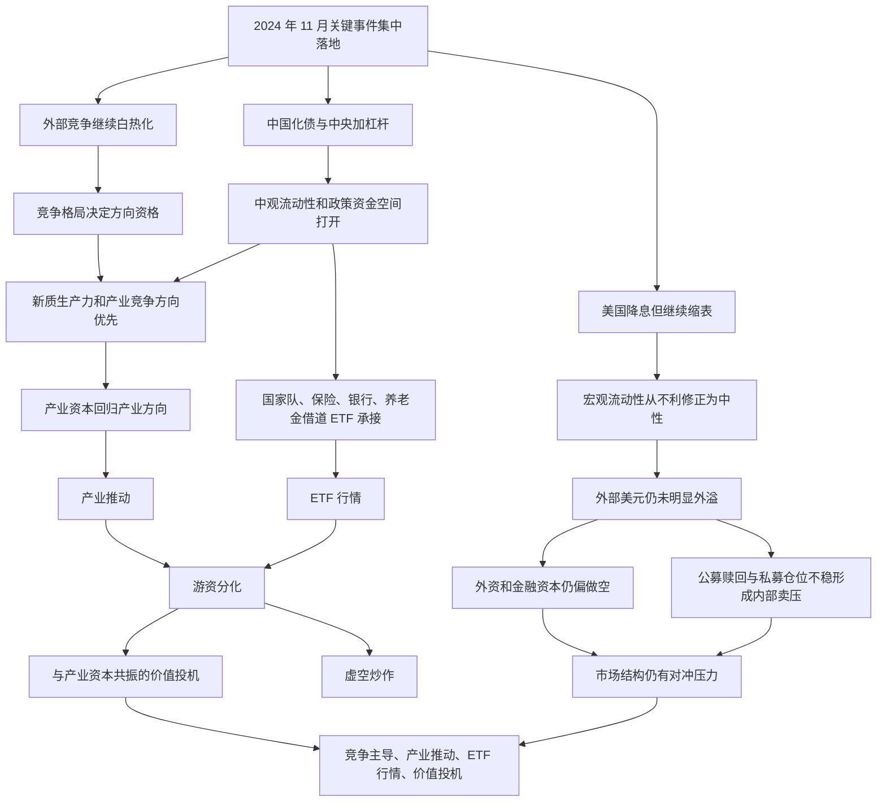

# 冰冰小美-2024大事件如何传导为产业ETF行情

## 核心结论

[[people/冰冰小美|冰冰小美]] 在 [[sources/articles/2024-11-09-冰冰小美：2024大事件落地|2024-11-09《2024大事件落地，未来行情演绎》]] 中的推导可以压成一句话：

外部竞争继续白热化，国内用 [[concepts/冰冰小美-中央加杠杆|中央加杠杆]]、人民币国际化和产业资本回归应对；在 [[concepts/冰冰小美-framework-体系三要素|体系三要素]] 下，竞争格局给出方向，中观流动性改善提供政策资金空间，微观 ETF 与产业资本承接形成行情结构，因此作者推导出“竞争主导、产业推动、ETF 行情、价值投机”仍是更可能的演绎路径。

对应观点页见：[[views/冰冰小美：2024大事件落地后未来行情演绎的阶段判断|冰冰小美：2024大事件落地后未来行情演绎的阶段判断]]。

## 推导前提

- 前提一：川普胜选和美国降息并不自动改善中国外部环境，因为美国继续缩表，美股与比特币仍可能虹吸全球流动性。
- 前提二：中国政策开始借美国降息窗口反击，重点是中央加杠杆、化债、人民币国际化和金融支持实体。
- 前提三：房地产驱动经济的边际效用减弱后，高质量发展和新质生产力方向更能代表竞争格局变化。
- 前提四：国内流动性不能只看宏观总量，还要分成宏观、中观、微观三个层级观察。
- 前提五：市场参与者结构发生变化，国家队和散户 ETF 行为、产业资本回归，与公募私募赎回压力、外资做空形成对冲。

## 关键变量

| 变量 | 含义 | 影响 |
|---|---|---|
| 竞争格局 | 中美金融、科技、贸易、产业竞争进入白热化 | 决定哪些产业方向具有比较优势和政策优先级 |
| 宏观流动性 | 美元流动性是否外溢，中国外部流动性环境是否改善 | 作者认为从不利转中性，但仍未真正有利 |
| 中观流动性 | 央行工具、QE 预期管理、赤字率财政空间 | 作者认为这是国内最有利的一层 |
| 微观承接 | 二级市场中产业资本、国家队、保险、银行、养老金、游资、散户等资金行为 | 决定行情能否被真实承接 |
| 产业资本 | 一级市场和产业资本回归新质生产力方向 | 支撑鸿蒙、低空、手机、新能源汽车、芯片等方向的延续性 |
| 国家队 ETF | 国家队、保险、银行、养老金借道 ETF 持续买入 | 支撑宽基和权重类方向的市场承接 |
| 公募私募压力 | 公募信任危机、赎回压力和私募仓位不稳定 | 构成市场内部空头和砸盘来源 |
| 游资分化 | 游资分成化债虚空炒作和产业资本共振两类 | 决定短线情绪是消耗流动性还是推动价值投机 |

## 推导链

1. 川普胜选、美联储降息缩表、中国化债规模公布和驻美大使表态，同一周集中改变市场对外部竞争与国内政策的理解。
2. 作者先把外部环境定义为“金融的决斗没有结束”，因为美国虽降息，但仍继续缩表，美股和比特币仍吸引资金留在美国本土。
3. 因此，宏观流动性只能从“不利”修正到“中性”，还不能直接写成全面有利。
4. 中国借美国降息节点反击，通过中央加杠杆、化债、人民币国际化、金融支持实体和后续内需刺激预期，打开国内政策空间。
5. 这使中观流动性明显强于宏观流动性：央行工具、QE 预期管理和赤字率空间给国内资金调度提供更多余地。
6. 竞争格局从房地产驱动转向高质量发展和新质生产力，芯片、航空航天、北斗、新能源汽车、清洁能源、人工智能、机器人、鸿蒙、服务器、数据中心和信息安全等方向被作者归为竞争前线。
7. 微观层面，产业资本开始回归并推动产业方向；国家队、保险、银行、养老金等借道 ETF 长期买入，构成更稳定的市场承接。
8. 同时，外资和金融资本仍偏做空，公募和私募受到信任危机、赎回压力和仓位不稳定约束，构成内部卖压。
9. 游资推动情绪高潮，但作者进一步区分虚空炒作和与产业资本共振的价值投机，后者才更贴近她认可的行情路径。
10. 散户行为中，绕开公募重仓旧赛道、参与国家队支持 ETF 的部分，被作者视为更理性的市场变化。
11. 当竞争方向、中观流动性和 ETF/产业资本承接共同出现时，作者据此推导出未来行情更可能表现为竞争主导、产业推动、ETF 行情和价值投机。

## 流程图

## 传导机制

### 1. 外部竞争先决定方向资格

作者不是从单一行业涨跌出发，而是先判断时代背景是否改变。川普胜选、关税和保护主义压力、美国降息缩表、人民币信用和国运之争，共同构成她所谓“竞争白热化”的背景。

在这个背景里，真正有方向资格的，不是所有短期热门板块，而是那些能服务国家竞争、高质量发展和新质生产力的产业方向。

### 2. 中央加杠杆打开中观流动性

[[concepts/冰冰小美-中央加杠杆|中央加杠杆]] 在这条推导中不是单独政策名词，而是国内反击外部竞争的财政金融手段。作者认为化债规模、赤字率空间和央行创新工具，使中观层面的政策资金空间打开。

这也是她为什么把宏观流动性定为中性，却把中观流动性定为史无前例有利：外部美元仍未明显外溢，但国内政策工具正在强化。

### 3. 微观承接决定行情形态

[[concepts/冰冰小美-流动性辩证分析|流动性辩证分析]] 的关键，是不只看“钱多不多”，还要看钱从哪里来、流向哪里、谁在卖、谁在买。

本篇材料中，作者把微观资金拆成多组：

- 产业资本：推动产业方向；
- 国家队、保险、银行、养老金：借道 ETF 承接；
- 外资和金融资本：仍在做空；
- 公募和私募：受信任危机、赎回和仓位不稳定约束；
- 游资：分成虚空炒作和产业资本共振；
- 散户：部分通过 ETF 绕开旧基金重仓方向。

这套拆法说明，行情不是“总流动性变好”直接得来，而是由不同资金行为互相抵消后形成的结构性结果。

### 4. ETF 行情是方向表达，不是单纯被动买入

作者把国家队支持 ETF、散户参与 ETF、公募重仓旧赛道承压放在一起看。这里的 ETF 不只是工具，而是市场在不完全信任主动基金、又希望承接国家方向时的一种表达。

因此，本推导中的 ETF 行情更接近“竞争格局和政策承接的低摩擦表达”，而不是单纯指数基金配置建议。

[[sources/articles/2024-11-12-冰冰小美：ETF基金与行情特征|2024-11-12《ETF基金与行情特征》]] 对这一步做了补充定义：ETF 同时具备流动性和指数/行业两个交易因素，规模扩容会扩大资金蓄水池，权重编辑会把行业龙头和市值地位组织进组合，散户通过 ETF 参与可以降低个股选择错误。对应概念见 [[concepts/冰冰小美-ETF行情|ETF行情]]。

### 5. 价值投机区别于虚空炒作

作者承认游资推动情绪高潮，但进一步区分两类：

- 化债方向的虚空炒作；
- 与产业资本共振的价值投机。

这一区分很关键：她并不是把所有短线情绪都视为有效行情，而是要求短线资金最好能和产业资本、竞争格局、政策方向共振。

## 时间节点

| 日期 | 事件 | 影响 |
|---|---|---|
| 2024-11-07 | 川普再次当选后相关文章发布 | 外部竞争、关税、美元信用和美国再工业化进入作者框架 |
| 2024-11-08 | 《中央加杠杆》发布 | 国内化债和财政空间成为国内反击线索 |
| 2024-11-09 | 《2024大事件落地，未来行情演绎》发布 | 作者把外部竞争、国内政策和资金结构合并成未来行情推导 |
| 2025-01 | 作者提到川普入主白宫 | 外部政策压力进入后续验证窗口 |

## 风险触发条件

- 美国缩表、资本留美和美股/比特币虹吸继续强化，使宏观流动性重新转弱。
- 国内中央加杠杆和内需刺激未能形成实际增量，中观流动性只停留在预期。
- ETF 承接被市场理解为托底而非主线表达，导致风险偏好无法扩散。
- 产业资本回归无法转化为业绩、订单或技术兑现。
- 公募赎回、私募不稳定和外资做空压力强于国家队与产业资本承接。
- 游资从产业资本共振转向虚空炒作，放大情绪高潮后的亏钱效应。

## 反例与不确定性

- 反例一：竞争格局有利不等于所有新质生产力方向都会上涨，产业兑现、估值和资金承接仍可能分化。
- 反例二：ETF 行情可能降低个股风险，但也可能掩盖指数和个股之间的结构性背离。
- 不确定性一：作者关于各类资金主体行为的判断未在本次入库中逐项外部核验。
- 不确定性二：宏观、中观和微观流动性之间的传导有时间差，不应把中观有利直接写成短期必涨。
- 不确定性三：本文涉及未来行情演绎，应作为作者阶段性推导保存，而不是确定预测。

## 相关观点

- [[views/冰冰小美：2024大事件落地后未来行情演绎的阶段判断|冰冰小美：2024大事件落地后未来行情演绎的阶段判断]]：本推导对应的观点页。
- [[views/冰冰小美：川普再次当选后的美国霸权重塑判断框架|川普再次当选后的美国霸权重塑判断框架]]：提供外部竞争和美国政策路径背景。
- [[views/冰冰小美：中央加杠杆确认化债与资产重估的判断框架|中央加杠杆确认化债与资产重估的判断框架]]：提供国内财政政策和资产重估背景。
- [[views/冰冰小美：做多中国先用指数基金承接主线的阶段判断|做多中国先用指数基金承接主线]]：后续更偏执行表达地说明 ETF 如何承接方向判断。

## 相关事件

- 暂未单独建立事件页；川普胜选、美联储降息缩表和中国化债规模公布若后续材料继续变厚，可拆成事件页或时间线。

## 相关时间线

- 暂无专门时间线；若继续整理 2024 年 11 月至 2025 年一季度政策与市场演绎，可考虑建立“2024 年末政策与市场结构时间线”。

## 相关概念

- [[concepts/冰冰小美-framework-体系三要素|体系三要素]]：本推导的总检查框架。
- [[concepts/冰冰小美-流动性辩证分析|流动性辩证分析]]：支撑宏观、中观、微观流动性分层。
- [[concepts/冰冰小美-ETF行情|ETF行情]]：补充 ETF 如何成为资金蓄水池、指数行业承接和普通投资者低摩擦表达工具。
- [[concepts/冰冰小美-中央加杠杆|中央加杠杆]]：支撑国内政策反击和中观流动性改善。
- [[concepts/冰冰小美-三大配置|三大配置]]：可与本文中的产业方向和 ETF 承接互相参照。

## 相关人物

- [[people/冰冰小美|冰冰小美]]：本推导来源人物。

## 相关页面

- [[topics/冰冰小美-宏观经济|宏观经济]]：承接财政、流动性、产业竞争和市场结构判断。
- [[topics/冰冰小美-AI产业趋势|AI产业趋势]]：承接本文中人工智能、服务器、数据中心等新质生产力方向。
- [[topics/冰冰小美-地缘重估与资源-货币秩序|地缘重估与资源-货币秩序]]：承接人民币信用、国运之争和外部竞争背景。

## 来源

- [[sources/articles/2024-11-09-冰冰小美：2024大事件落地|2024-11-09《2024大事件落地，未来行情演绎》]]
- [[sources/articles/2024-11-12-冰冰小美：ETF基金与行情特征|2024-11-12《ETF基金与行情特征》]]
