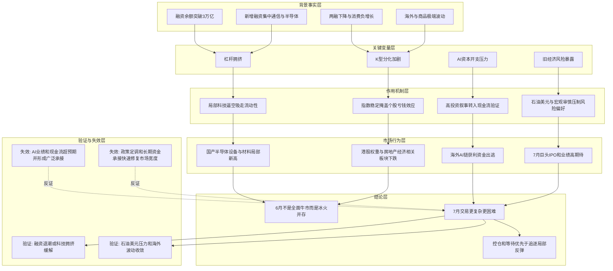

# 冰冰小美-6月末风险如何传导为7月交易困难

## 核心结论

核心命题：[[people/冰冰小美|冰冰小美]] 试图证明「6 月市场不是简单的科技强、指数稳，而是融资拥挤、K 型分化、波动性风险、AI 资本开支压力和旧经济衰退预期共同暴露；进入 7 月后，石油危机、巨头 IPO、业绩高期待和重要会议前谨慎会让交易更困难」。

这条推导属于 [[topics/冰冰小美-风险提示系列|风险提示系列]] 中的月报型风险提示：它不是单点突发风险，而是把 6 月整月的市场结构压成 7 月风险观察框架。

## 推导前提

- 前提一：作者称 6 月融资余额突破 3 万亿，新增融资基本集中在通信与半导体行业，并将其视为过热信号。
- 前提二：作者把两融下降、消费负增长、K 型分化、个股波动加剧、港股权重下跌和海外做空力量放在同一个困难交易环境中。
- 前提三：作者认为韩国、费城半导体、黄金白银原油等资产的极端波动，说明市场正在同时经历分化、衰竭、踩踏和流动性挤压。
- 前提四：国产半导体设备与材料仍能创新高，但作者认为这是定向信贷和地方科技投资推动的局部强势，不代表整体市场风险解除。
- 前提五：海外 AI 链开始暴露资本开支、自由现金流、零部件涨价和技术路线分歧，获利资金开始出逃。
- 前提六：7 月还要面对石油危机反复、巨头 IPO、业绩报高期待和 7 月末会议前谨慎。

## 关键变量

| 变量 | 含义 | 影响 |
|---|---|---|
| 融资余额与行业集中度 | 作者称融资余额突破 3 万亿且新增融资集中在通信和半导体 | 说明科技方向上涨可能夹杂杠杆拥挤，连接 [[concepts/冰冰小美-杠杆拥挤交易风险|杠杆拥挤交易风险]] |
| K 型分化 | 科技局部新高与房地产、消费、电商互联网等方向下跌并存 | 指数稳定不能代表赚钱效应全面恢复 |
| 波动性风险 | 韩国、费城半导体、贵金属和原油出现极端波动 | 提示风险从单一市场扩散到跨资产波动 |
| AI资本开支与自由现金流 | 甲骨文、微软、谷歌、苹果、美光等被作者用于观察 AI 链压力 | 高投资叙事开始进入现金流、融资和成本验证 |
| 旧经济风险 | 作者称新经济未成气候前，旧经济暴露的风险不可小觑 | 说明非科技方向下跌不只是轮动，也可能是经济转型阵痛 |
| 7月事件窗口 | 石油危机、巨头 IPO、业绩高期待、7月末会议前谨慎 | 形成作者对 7 月交易困难的直接判断 |

## 推导链

| 层级 | 内容 | 推导关系 | 可信度 | 观察指标 |
|---|---|---|---|---|
| 背景事实 | 6 月融资余额和通信、半导体新增融资集中，被作者视为过热 | 作为风险推导起点 | 中 | 融资余额、行业融资买入额、通信/半导体成交占比 |
| 关键变量 | K 型分化与个股波动加剧 | 说明指数稳定不能覆盖结构性亏钱效应 | 高 | 上涨家数、跌破 924 基准点个股、港股权重表现 |
| 作用机制 | 局部科技逼空吸走流动性，其他方向因社融和需求压力下探 | 解释为什么局部新高会与整体交易困难并存 | 中 | 科技成交集中度、社融、消费数据、ETF承接 |
| 中介环节 | AI海外链从资本开支故事转向现金流、融资、零部件涨价和技术路线分歧 | 连接高估值叙事与获利资金出逃 | 中 | AI巨头自由现金流、债券融资、毛利率、PCB/光模块表现 |
| 结论 | 7 月交易仍困难，且可能出现中上证与纳指年线收绿的风险判断 | 推导结果 | 中 | 石油价格、巨头 IPO 节奏、7 月财报、7 月末会议定调 |

## Mermaid 推导图

## 传导机制

### 1. 科技局部强势不等于风险解除

作者承认 6 月仍有国产半导体设备与材料方向创新高，但她把这一强势解释为地方政府科技投资和定向信贷扩张的结果，而不是整体市场风险解除。换句话说，强势方向可能只是局部流动性承接，不能替代市场宽度恢复。^[inferred]

### 2. 融资拥挤会提高回撤脆弱性

当新增融资集中在通信和半导体行业时，行情上涨会更依赖杠杆和一致预期。作者没有在本文展开完整“多杀多”链条，但该判断与 [[concepts/冰冰小美-杠杆拥挤交易风险|杠杆拥挤交易风险]] 相通：拥挤方向一旦预期反转，回撤容易从普通调整变成流动性踩踏。^[inferred]

### 3. 海外 AI 链从想象空间进入现金流验证

作者用甲骨文自由现金流、巨额融资、微软和谷歌股价受挫、苹果零部件涨价、美光毛利率争议等例子说明，AI 链条不再只交易需求想象，而开始面对资本开支、融资成本、利润分配和终端需求承接的验证。

### 4. 7 月风险来自多因素叠加

作者对 7 月的风险判断，不是只来自一个变量，而是石油危机反复、巨头 IPO、业绩报高期待、7 月末会议前谨慎共同叠加。这个框架延续了 [[冰冰小美-trigger-宏观信号表|宏观风险信号表]] 的思路：风险敞口通常来自多组变量同时不利，而不是单一消息。

## 时间节点

| 日期 | 事件 | 影响 |
|---|---|---|
| 2026-05-14 | 作者在文中回溯称从 5/14 节点开始，三倍做空富时中国 ETF 持续攀升 | 作为 6 月风险演绎的前置节点，需结合 [[reasoning/冰冰小美-5月14日风险节点推导|5月14日风险节点推导]] 复看 |
| 2026-06 | 作者总结本月 K 型分化、波动性风险、流动性挤压、分化、衰竭和踩踏 | 构成 7 月困难交易判断的直接背景 |
| 2026-06-27 | 《2026年6月月报（二）》发布 | 明确提出 7 月交易依旧困难 |
| 2026-07 | 作者提示石油危机反复、巨头 IPO、业绩报高期待和 7 月末会议前谨慎 | 进入后续验证窗口 |

## 风险触发条件

- 融资余额继续上升，且新增融资继续集中在通信、半导体和 AI 相关方向。
- 科技方向成交占比过高，但市场宽度、上涨家数和非科技方向承接继续恶化。
- 海外 AI 巨头资本开支、融资需求、自由现金流或零部件涨价继续引发分歧。
- 石油、美元、美债和海外指数波动继续放大。
- 7 月财报无法匹配前期透支行情，或巨头 IPO 继续抽走流动性。

## 反例与不确定性

- 原文中的融资余额、消费负增长、海外指数波动、公司现金流和灵活就业数据，本文按作者观点保存，尚未逐项外部核验。
- 如果 AI 相关业绩和自由现金流显著超预期，且科技成交拥挤得到消化，作者对 7 月交易困难的判断可能被削弱。
- 如果 7 月末会议释放强政策承接，且市场宽度明显恢复，K 型分化带来的风险可能阶段性缓和。
- “中上证、米纳指年线收绿”属于作者风险判断，不应写成已发生事实。

## 相关观点

- [[views/冰冰小美：流动性挤压风险提前演绎的判断框架|流动性挤压风险提前演绎]]：承接 6 月初风险提前演绎，与本文的 6 月末月报判断前后相连。
- [[views/冰冰小美：历史危机经验提示AI高位风险边界的判断框架|历史危机经验提示 AI 高位风险边界]]：提供 AI 高位、自由现金流、杠杆和政策错配的历史参照。

## 相关时间线

- [[timelines/冰冰小美-风险节点记录|冰冰小美-风险节点记录]]：用于把 2026-06-27 月报放回 5 月至 7 月风险提示链条中。

## 相关概念

- [[concepts/冰冰小美-杠杆拥挤交易风险|杠杆拥挤交易风险]]：解释融资集中和 AI 拥挤为什么会放大下跌脆弱性。
- [[concepts/冰冰小美-波动风险|波动风险]]：解释极端波动、事件集合和流动性不利如何让好坏资产一起承压。
- [[冰冰小美-trigger-宏观信号表|宏观风险信号表]]：用于继续观察石油、美元、美债、AI 现金流和海外波动。
- [[冰冰小美-rule-卖|冰冰小美减仓规则]]：把风险提示转译为仓位暴露管理。

## 相关人物

- [[people/冰冰小美|冰冰小美]]：本推导的观点来源。

## 相关页面

- [[topics/冰冰小美-风险提示系列|冰冰小美-风险提示系列]]：本页所属的风险提示主题入口。
- [[topics/冰冰小美-月报地图|冰冰小美-月报地图]]：本来源属于 2026 年 6 月月报系列，后续可纳入月报总览。
- [[reasoning/冰冰小美-6月8日风险如何由流动性挤压扩散为宏观危机|6月8日风险如何由流动性挤压扩散为宏观危机]]：前序 6 月风险扩散链条。

## 来源

- [[sources/articles/2026-06-27-冰冰小美：2026年6月月报（二）|2026-06-27《2026年6月月报（二）》]]
