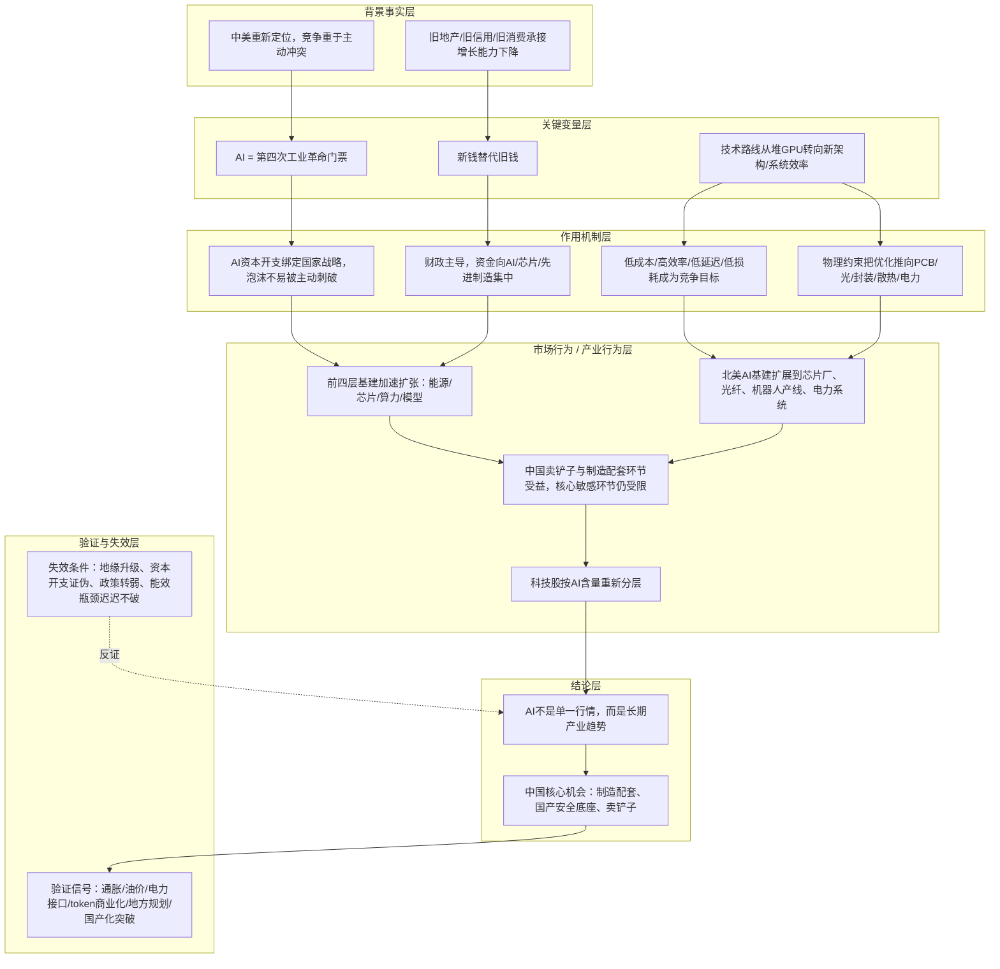
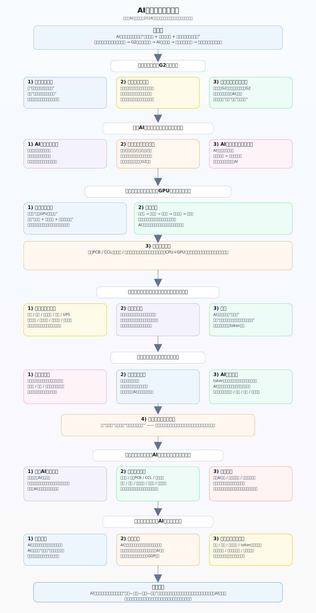

# 冰冰小美 AI 产业趋势推导链

## 核心结论

核心命题：作者试图证明「AI 不是一次短线题材，而是一条会重塑国家竞争、资本流向、城市建设、全球制造分工和科技股估值体系的长期产业趋势」。

按这张 [[sources/assets/ai_industry_trend_logic.svg|AI产业趋势推导总图]] 的表达，AI 在作者框架里至少同时承担三种角色：

1. 国家级竞争门票。
2. 承接新钱与新基建的新容器。
3. 资本市场从旧增长模式切向新增长模式的估值主线。

这条推导与 [[reasoning/冰冰小美-人工智能与国家中美两强推导链|冰冰小美 AI 与国家 G2 推导链]] 的分工是：

- 后者重点解释“为什么 AI 会被抬升到国家竞争层面”。
- 本页在其基础上继续往下拆“国家门票如何进一步传导到技术路线、能源层、财政新钱、全球供应链和科技股估值分层”。

## 推导前提

- 前提一：中美关系被理解为长期竞争但不主动冲突，地缘主线从战争恐慌转向产业升级竞赛。
- 前提二：AI 已经不只是公司或行业机会，而是第四次工业革命门票，战略地位高于普通题材。
- 前提三：AI 泡沫虽然存在，但中美都缺少主动刺破泡沫的动机，因为泡沫与 AI 战略投入绑定。
- 前提四：旧信用扩张、地产和传统消费承接新增资金的能力走弱，必须出现新的资本承接器。
- 前提五：AI 基建是一场重资产的新型基础设施建设，真正的瓶颈不止在芯片，也在电力、散热、互联和系统效率。

## 关键变量

| 变量 | 含义 | 影响 |
|---|---|---|
| 中美重新定位 | 从高冲突预期转向长期产业竞争 | 降低战争风险溢价，让 AI 竞赛成为更稳定主线 |
| AI 国家门票 | AI 被视为第四次工业革命的核心资格 | 解释为什么资本开支、政策和产业资源持续向 AI 集中 |
| 路线切换 | AI 脱离“单一 GPU 纯堆算力”阶段，切向“新架构 + 系统思维 + 物理极限突破” | 胜负手从单芯片性能转向整机、集群与系统级最优，单点 GPU 不再足以解释整条产业链 |
| 物理约束 | 新架构开始直接诉求高速、低延迟、低损耗、高带宽等物理极限 | 瓶颈不再只在芯片本身，也在互联、封装、供电、散热和材料可靠性，因此高端 PCB / CCL、光模块 / 光通信、先进封装、液冷、电源的重要性上升 |
| 效率目标 | 核心产量逐步倾向低成本与高效率，本质是以更低成本、更稳定吞吐产出有效 token | 资本开支更愿意流向单位 token 成本更低、效率更高的链条，系统能效开始主导受益方向 |
| 创造性破坏 | “效率是创造性破坏的核心要义”，旧路线、旧设备、旧架构会被更高效率的新组合替代 | 受益会从单点 GPU 扩散到系统级替代链条，科技股内部的卡位和估值排序也会随之重写 |
| 五层架构 | 能源层、芯片层、算力层、大模型层、应用层 | 说明 AI 基建的真正主战场主要在前四层，而应用层兑现更慢 |
| 新钱替代旧钱 | 财政主导、货币辅助，新债替旧债 | 解释资金为何从旧地产/旧信用切向 AI、芯片和先进制造 |
| 北美 AI 基建扩张 | 美国 AI 投入扩展到芯片厂、光纤、机器人产线和电力系统 | 决定中国供应链哪些环节会被需求映射带动 |
| 估值分层 | AI 含量高低决定估值和资金偏好 | 导致科技股内部出现更强马太效应 |
| 跟踪变量 | 通胀、油价、电力接口、token 商业化、美联储路径、国产化突破 | 决定产业趋势能否继续推进，以及行情节奏如何波动 |

## 推导链

| 层级 | 内容 | 推导关系 | 可信度 | 观察指标 |
|---|---|---|---|---|
| 背景事实 | 中美竞争从主动冲突预期切向长期产业竞争 | 作为推导起点 | 中 | 地缘摩擦强度、亚太风险溢价 |
| 背景事实 | 旧地产、旧信用和传统消费承接新增增长的能力走弱 | 作为推导起点 | 中 | 社融结构、地产销售、传统核心资产表现 |
| 关键变量 | AI 被抬升为第四次工业革命门票，只剩 G2 拥有完整主导资格 | 受到背景事实影响 | 中 | 政策表述、资本开支、全球算力与模型竞争格局 |
| 关键变量 | 技术路线从“堆 GPU”转向“新架构 + 系统思维 + 物理极限突破” | 受到背景事实影响 | 中 | 芯片路线、互联带宽、液冷、电源、能效指标 |
| 关键变量 | 竞争目标从堆算力规模切向“低成本 + 高效率 + 低延迟 + 低损耗” | 受到技术路线变化约束 | 中 | 单位 token 成本、PUE、时延、封装功耗、带宽密度 |
| 作用机制 | AI 资本开支绑定国家战略，新泡沫不易被主动刺破 | 解释变量如何传导 | 中 | 资本开支延续性、AI 基建订单、融资环境 |
| 作用机制 | 物理约束把优化重心从单芯片推向 PCB、光、封装、散热和电力等系统级协同 | 解释变量如何传导 | 中 | 高速板材、光模块、先进封装、液冷、电源景气度 |
| 作用机制 | 财政主导、新债替旧债、新钱流向 AI 和先进制造 | 解释变量如何传导 | 中 | 财政投向、地方规划、产业基金、设备投资 |
| 中介环节 | AI 基建沿能源层、芯片层、算力层、大模型层爆炸扩张，应用层相对慢 | 连接机制与结果 | 中 | 电力接入、数据中心建设、芯片与光模块需求 |
| 中介环节 | 北美 AI 基建外溢到中国供应链，带动卖铲子与制造配套环节重估 | 连接机制与结果 | 中 | 光模块、PCB、CCL、存储封测、液冷、电源等景气度 |
| 中介环节 | 科技股按 AI 含量重新分层，伪科技被边缘化 | 连接机制与结果 | 中 | 细分行业估值分化、资金集中度、成交结构 |
| 结论 | AI 产业趋势不可逆，主战场在“能源-芯片-算力-模型”四层基建，中国较优机会在制造配套、国产安全底座和卖铲子环节 | 推导结果 | 中 | 订单兑现、国产替代、政策延续性、全球资本开支周期 |

## Mermaid 推导图

## svg 推导图

## 传导机制

### 1. 从 G2 竞争到 AI 门票

这张图延续了 [[views/冰冰小美：AI成为国家级竞争门槛的核心判断|冰冰小美：AI成为国家级竞争门槛的核心判断]] 与 [[reasoning/冰冰小美-人工智能与国家中美两强推导链|冰冰小美 AI 与国家 G2 推导链]] 的基础判断：中美重新定位后，市场主线会从“高烈度冲突风险”切到“谁能持续推进产业升级”。

于是，AI 不再只是某个景气板块，而是国家能力、产业体系、融资能力和技术路线共同决定的门票。门票逻辑一旦成立，AI 资本开支就很难被当作普通泡沫简单处理。

### 2. 从单点算力到系统效率革命

这张图相比现有 AI 页面最重要的新意，是把技术路线进一步从“GPU 很重要”推进到“系统能效才决定最终竞争力”。

图中的逻辑是：

- 第一层：路线切换。AI 正在脱离“单一 GPU 纯堆算力”的阶段，开始进入“新架构 + 系统思维”主导的新阶段。
- 第二层：约束切换。真正需要突破的，不再只是单芯片性能，而是高速互联、低延迟传输、低损耗封装、供电和散热这些物理约束。
- 第三层：目标切换。市场比拼的不只是总算力，而是能否以更低成本、更高效率、更稳定吞吐产出有效 token。
- 第四层：产业迁移。谁能解决这些系统级约束，谁就更容易承接下一轮资本开支。

这使 AI 受益环节从单点芯片扩展到：

- 高端 PCB / CCL
- 光模块 / 光通信
- 高端封装与存储
- 电源、电力电子、液冷与散热

把这四层合在一起看，作者要强调的不是“GPU 不重要了”，而是“单点 GPU 不再足以解释整条 AI 产业链”。她给出的原话重心，其实是效率优先级上升，因而系统级协同会触发新一轮创造性破坏。

### 3. 从旧钱退潮到新钱承接

图中第五部分把 AI 放进了更明确的资金与政策框架：旧地产、旧消费和旧信用扩张走弱后，新债替旧债、新钱替旧钱，财政主导的新一轮资金必须找到新的高确定性承接器。

在这个框架里，AI 基建不是普通行业投资，而被当作：

- 新型基础设施建设；
- 地方产业规划的抓手；
- 城市竞争从地产转向人才、产业和配套集群的支点。

因此资本市场的角色也被重新定义为“为新产业扩张和国家竞争服务”，而不再只是围绕旧周期资产做博弈。

### 4. 从北美 AI 基建到中国产业链映射

这张图第六部分把全球分工说得更具体：美国 AI 基建扩张不只是在建数据中心，而是在重建芯片厂、光纤网络、机器人产线和电力系统。

这会让中国的相对受益环节更集中在：

- 光模块
- 高端 PCB 与 CCL
- 存储封测
- 液冷、电源、功率器件、连接器
- 铜铝材料
- 通过海外产能切入美国供应链的制造公司

相对受限的，则是核心 AI 芯片、整机服务器、核心网络设备以及安全敏感软硬件。

### 5. 从产业趋势到估值重构

最后一层不是“产业好所以股价涨”这么简单，而是“AI 含量”本身开始成为估值分层变量：

- AI 含量高、卡位深、受益路径清晰的公司，享受更高增长预期和估值；
- AI 含量低但披着科技标签的公司，会被重新边缘化；
- 机器人、无人驾驶、脑机接口、太空探索、生物蛋白等更前沿主题，也会继续被 AI 外溢重塑。

所以这条推导最终落回到一个更大的判断：AI 不只是新增一个板块，而是在重构科技股内部的层级秩序。

## 时间节点

| 日期 | 事件 | 影响 |
|---|---|---|
| 2026-04-22 至 2026-04-27 | 一组 AI 相关观点被整理为正式 `view` 页面 | 提供全球协同、系统级竞争、产业链卡位和交易节点的分层证据 |
| 2026-05-17 | 《Ai与国家》发布 | 明确把 AI 上升为国家级门票和 G2 长期竞争问题 |
| 2026-05-22 | 《2026年五月月报（一）》发布 | 补齐 AI 技术路线、五层架构、token 收费、算电协同、城市竞争和资本市场角色重估的原文来源 |
| 2026-05-23 | 《2026年五月月报（二）》发布 | 补齐新钱替代旧钱、财政主导、AI 基建承接、旧产业沉没资本和全球成本分摊的原文来源 |
| 2026-05-23 | `ai_industry_trend_logic.svg` 被整理入正式知识层 | 使 AI 趋势从分散观点进一步收束为系统推导链 |

## 验证信号

- 通胀与油价是否继续可控，避免压断风险资产的估值链条。
- 电力接口、供电系统、液冷与散热等基础设施约束是否持续被打通。
- token 收费、模型商业化与 AI 基建回报路径是否逐步清晰。
- 地方产业规划、财政投向与新型基建项目是否继续推进。
- 国产化突破是否从口号走向稳定产品力与供应链能力。
- 北美 AI 基建扩张是否继续向芯片厂、光纤、电力系统和机器人产线外溢。

## 风险触发条件

- 中美竞争重新转向高冲突甚至军事风险，打断 AI 作为长期主线的风险偏好基础。
- 通胀、油价或利率路径恶化，导致高估值科技与重资产 AI 基建同时承压。
- AI 资本开支回报率被集中证伪，token 商业化迟迟无法支撑投入。
- 新钱替代旧钱不及预期，财政与地方规划无法真正把资金传导到产业层。
- 电力、散热、互联和材料可靠性的瓶颈迟迟无法突破，系统效率改善停滞。
- 出口管制、关税、原产地审查和安全限制显著加码，压缩中国受益环节。

## 反例与不确定性

- `ai_industry_trend_logic.svg` 本身是整理图，不是逐字原文；它应被视为二次归纳材料，而不是一手原帖全文。
- 本页“AI 自身变量”一节，已补入 [[sources/articles/2026-05-22-冰冰小美：2026年五月月报（一）|2026年五月月报（一）]]，原先的 [[sources/manual/2026-05-23-冰冰小美-AI产业自身变量补充|用户提供的雪球原文摘录]] 可视为该原文的局部摘录。
- 图中写明“基于《AI与国家》《2026年五月月报（一）（二）》及延伸讨论整理”，当前已补齐《2026年五月月报（一）》和《2026年五月月报（二）》两篇来源；后续如整理延伸讨论，可继续补充具体事件和评论来源。
- “只剩 G2 拥有完整门票”“AI 基建接棒地产基建部分功能”“资本市场从投机史切向国运红利分配史”等，属于强判断，应保留为待验证框架，不写成已完成事实。
- 中国受益环节的名单更接近方向性框架，不应被当作静态推荐列表；实际受益还要受供给、估值、政策、审查与订单兑现影响。
- 应用层“相对更慢”是当前阶段判断，若模型商业化或终端爆发速度超预期，这一结构可能需要修正。

## 相关观点

- [[views/冰冰小美：AI成为国家级竞争门槛的核心判断|冰冰小美：AI成为国家级竞争门槛的核心判断]]
- [[views/冰冰小美：AI进入新阶段并成为新型基建与城市竞争抓手的判断框架|冰冰小美：AI进入新阶段并成为新型基建与城市竞争抓手的判断框架]]

## 相关时间线

- [[timelines/冰冰小美-2026一季度宏观阶段时间线|冰冰小美 2026Q1 宏观阶段时间线]]

## 相关页面

- [[people/冰冰小美|冰冰小美]]
- [[topics/冰冰小美-AI产业趋势|AI产业趋势]]
- [[topics/冰冰小美-宏观经济|宏观经济]]
- [[topics/冰冰小美-地缘重估与资源-货币秩序|地缘重估与资源-货币秩序]]
- [[reasoning/冰冰小美-人工智能与国家中美两强推导链|冰冰小美 AI 与国家 G2 推导链]]

## 来源

- [[sources/assets/ai_industry_trend_logic.svg|AI产业趋势推导总图]]
- [[sources/articles/2026-05-17-冰冰小美：Ai与国家|冰冰小美：Ai与国家]]
- [[sources/articles/2026-05-22-冰冰小美：2026年五月月报（一）|冰冰小美：2026年五月月报（一）]]
- [[sources/articles/2026-05-23-冰冰小美：2026年五月月报（二）|冰冰小美：2026年五月月报（二）]]
