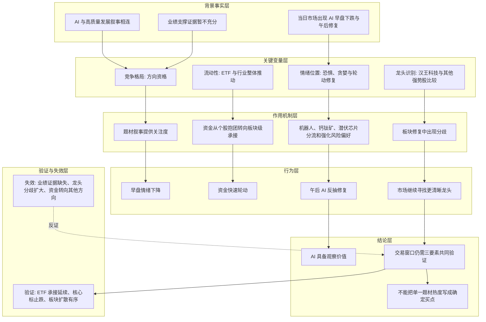

# 冰冰小美-AI板块三要素如何传导为交易窗口判断

## 核心命题

核心命题：[[people/冰冰小美|冰冰小美]] 试图说明，2023-02-07 的 AI 板块不能只按题材热度或单只龙头连板来理解，而要放回 [[concepts/冰冰小美-framework-体系三要素|体系三要素]]：先看 AI 是否具备竞争格局上的方向资格，再看流动性是否形成板块级承接，最后看情绪是否从恐慌和分歧中修复为可持续合力。

本页是对单篇雪球资料的 reasoning 整理，不等同于对 AI 板块的长期确定结论，也不构成交易建议。

## 核心结论

在这篇材料中，作者对 AI 板块的判断是偏谨慎的：AI 的竞争格局叙事容易理解，流动性可能来自 ETF 持续流入，情绪也出现了早盘下跌后的轮动修复；但龙头归属、业绩支撑和板块内部分化仍不清晰。因此，AI 板块当时更像是一个需要用三要素继续验证的交易窗口，而不是可以仅凭题材热度直接确认的稳定主线。

## 推导前提

- 前提一：AI 与高质量发展、安全与发展、产业升级等宏观叙事相关，但原文明确提示“找不到业绩支撑证据”的问题。
- 前提二：流动性可能来自 ETF 持续上涨流入，说明资金承接不一定以个股抱团形式出现。
- 前提三：当日早盘情绪下跌后，资金立刻轮动到机器人，随后钙钛矿启动，午后 AI 反抽修复加强，显示情绪并非单线推进。
- 前提四：汉王科技一字板较容易被视作情绪龙头，但作者认为市场对竞业达、南天信息等个股的炒作同样强，说明“谁是龙头”并不容易判断。
- 前提五：作者把机器人、钙钛矿、潜伏芯片等方向放在同一市场环境里观察，说明她关心的是板块之间的资金轮动和情绪位置，而不是孤立判断 AI。

## 关键变量

| 变量 | 含义 | 影响 |
|---|---|---|
| 竞争格局 | AI 是否能和高质量发展、安全与发展、产业升级等大方向相连 | 决定 AI 是否有方向资格，但不能替代业绩和市场验证 |
| 业绩支撑 | AI 板块是否已经出现可验证的企业利润或订单证据 | 若缺失，题材热度容易停留在叙事和情绪层 |
| ETF 流入 | 板块流动性是否来自 ETF 等持续资金承接 | 说明流动性可能表现为行业整体推动，而非单一个股抱团 |
| 情绪轮动 | AI、机器人、钙钛矿、潜伏芯片之间的资金切换 | 反映市场风险偏好恢复，但也提示主线仍可能分散 |
| 龙头识别 | 汉王科技等个股是否真正代表板块核心地位 | 决定短线交易是否有明确锚；若龙头不清，容易形成追涨和卡位风险 |
| 板块分化 | 云从科技等核心个股分时表现与板块修复是否一致 | 若修复中出现分歧，说明情绪合力仍需验证 |

## 推导链表

| 层级 | 内容 | 推导关系 | 可信度 | 观察指标 |
|---|---|---|---|---|
| 背景事实 | 2023-02-07 AI 板块处于题材升温阶段，并与高质量发展叙事相连 | 作为判断 AI 方向资格的起点 | 中 | AI 相关政策、产业消息、板块涨跌和媒体关注度 |
| 关键变量 | 业绩支撑证据不足 | 限制竞争格局叙事直接升级为长期确定性 | 中 | 订单、收入、利润、商业化落地 |
| 关键变量 | ETF 或行业资金持续流入 | 使流动性可能从单一个股抱团转向板块整体推动 | 中 | AI/科技 ETF 规模、成交、申赎和行业权重表现 |
| 作用机制 | 资金不只买单一龙头，而是在 AI、机器人、钙钛矿、潜伏芯片之间轮动 | 说明流动性承接存在，但市场仍在寻找阻力更小方向 | 中 | 领涨板块切换、涨停扩散、核心个股分时 |
| 中介环节 | 早盘下跌后快速轮动，午后 AI 反抽修复 | 情绪从恐惧向修复切换，但仍有分歧 | 中 | 情绪标止跌、板块回流、亏钱效应是否减弱 |
| 结论 | AI 板块需要三要素继续共同验证 | 不能只凭题材热度或一字板龙头确认交易窗口 | 中 | 竞争格局、流动性承接、情绪合力是否同步改善 |

## 推导图

## 传导机制

### 1. 竞争格局先给方向资格，但不自动给买点

原文把 AI 放在高质量发展、安全与发展等大方向下理解，这对应 [[concepts/冰冰小美-framework-体系三要素|体系三要素]] 中的竞争格局：一个方向需要先有时代、政策、产业或社会需求层面的合理性，才值得进入观察池。

但作者同时指出业绩支撑证据不足。这说明竞争格局只能给“为什么值得看”的资格，不能直接给“为什么现在买”的结论。如果没有业绩、订单或商业化落地验证，AI 仍可能停留在题材炒新和情绪扩散阶段。

### 2. 流动性可能从个股抱团转向板块整体推动

原文判断流动性可能来自 ETF 持续上涨流入，并指出这一次流动性没有以个股抱团的模式形成，而更像行业整体推动。这正好对应 [[concepts/冰冰小美-流动性辩证分析|流动性辩证分析]]：流动性不是只看成交额或某个龙头强度，而要看资金来源、承接结构和是否围绕同一方向组织。

若 ETF 承接持续，AI 板块可能形成更广的行业性机会；若 ETF 承接只是短期情绪流入，则容易在板块分化时退潮。

### 3. 情绪位置通过轮动和修复表现出来

作者记录了当日早盘情绪下降、资金立刻轮动到机器人、随后钙钛矿发动、午后 AI 反抽修复加强的过程。这里的重点不是“哪个板块涨”，而是情绪如何在不同方向之间寻找承接。

当情绪从恐惧转向修复时，AI 有机会重新获得资金回流；但若资金持续分流到机器人、钙钛矿或其他方向，则 AI 的情绪合力仍不稳。

### 4. 龙头不清会削弱短线交易锚

原文对汉王科技、竞业达、南天信息等个股的比较，说明作者并不把“一字板”直接等同于真正龙头。她关心的是市场是否形成名副其实的龙头战法：龙头不仅要强，还要能代表板块地位、带动情绪和承载资金。

如果龙头识别不清，短线交易很容易滑向卡位、补涨和追高，进而脱离三要素验证。

## 时间节点

| 日期 | 事件 | 影响 |
|---|---|---|
| 2023-02-07 | 雪球原帖《AI 板块的三要素分析》发布 | 作者用竞争格局、流动性和情绪位置拆解当日 AI 板块行情 |
| 2026-06-11 | 源资料被导出到本地雪球资料库 | 成为本次 reasoning 页面整理的原始材料 |
| 2026-06-12 | 本页整理入 `llmwiki` | 将单篇资料沉淀为 AI 板块三要素推导链 |

## 风险触发条件

- 如果 AI 业绩、订单或商业化证据长期无法补上，竞争格局叙事可能被证伪或阶段性降温。
- 如果 ETF 流入停止，或者行业资金从 AI 转向其他题材，流动性承接会失效。
- 如果核心标的修复不强，板块只是支线轮动，情绪位置就不能确认进入合力阶段。
- 如果市场只围绕一字板或补涨股炒作，而没有板块整体扩散，龙头战法可能变成短线卡位风险。
- 如果机器人、钙钛矿、芯片等方向持续分流资金，AI 的主线地位需要重新验证。

## 反例与不确定性

- 原始 Markdown 存在编码显示问题，本页只采用可以从标题、日期、原文链接和正文上下文中确认的语义；个别细节仍需回查原网页或更干净的抓取版本。
- 原文是 2023-02-07 的阶段性市场观察，不能直接外推到 2026 年或更长期的 AI 产业判断。
- “ETF 持续流入”在原文中是作者对流动性来源的判断，本页未额外核验当日 ETF 申赎和成交数据。
- 机器人、钙钛矿和潜伏芯片的具体个股受益路径主要来自原文表述，本页不把它们写成确定产业事实。
- 本页整理的是作者的推导方式，不是对 AI 板块涨跌的事实预测。

## 相关观点

- [[views/冰冰小美：AI成为国家级竞争门槛的核心判断|冰冰小美：AI成为国家级竞争门槛的核心判断]]：后续更宏观地把 AI 提升到国家级竞争门槛，本页则记录早期 AI 板块交易层面的三要素检查。

## 相关概念

- [[concepts/冰冰小美-framework-体系三要素|冰冰小美-体系三要素]]：本页直接应用竞争格局、流动性和情绪位置三项共同验证交易窗口。
- [[concepts/冰冰小美-流动性辩证分析|冰冰小美-流动性辩证分析]]：用于解释 ETF 流入、行业整体推动和非个股抱团式资金承接。
- [[concepts/冰冰小美-短线情绪标|冰冰小美-短线情绪标]]：用于理解龙头、情绪标和板块修复之间的关系。
- [[concepts/冰冰小美-情绪周期|冰冰小美-情绪周期]]：用于理解早盘恐惧、盘中轮动和午后修复的情绪位置变化。

## 相关人物

- [[people/冰冰小美|冰冰小美]]：本页整理其对 AI 板块行情的三要素推导方式。

## 相关页面

- [[冰冰小美-情绪体系理论篇|冰冰小美-情绪体系]]：本页属于该体系的具体行情应用案例。
- [[topics/冰冰小美-AI产业趋势|AI产业趋势]]：本页可作为 AI 主题中早期交易层面的推导样本。
- [[reasoning/冰冰小美-AI产业趋势推导链|冰冰小美 AI 产业趋势推导链]]：后者偏中长期 AI 产业趋势，本页偏单日板块三要素验证。

## 来源

- `E:/caojingwen/obsidian/source/xueqiu_exports/372290338/一、核心体系/1、体系三要素（竞争格局＞流动性辩证分析＞情绪位置变化）/006_AI 板块的三要素分析.md`
- 雪球原文：https://xueqiu.com/7143769715/241479694
