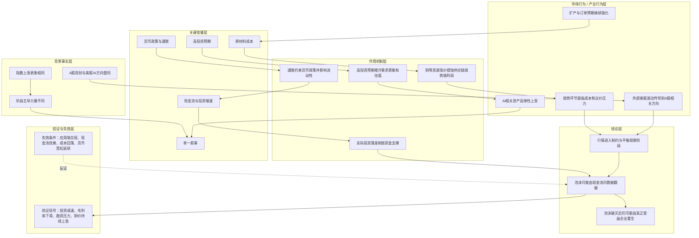

# 冰冰小美-AI高投资泡沫如何由现金流与成本压力传导为周期风波

## 核心结论

核心命题：[[people/冰冰小美|冰冰小美]] 试图证明「AI 行情即使处在技术革命和慢牛进程中，也必须被放回经济周期、资金链、成本传导和资源争夺中观察；真正戳破泡沫的往往不是技术本身，而是现金流和制衡因素」。

她的推导不是“AI 没有未来”，而是“AI 行情不能只用单一信仰解释”。泡沫破灭后仍可能有重生，但承载重生的企业未必是当下最热门的个股。

## 推导前提

- 前提一：2025 年指数上涨表象相似，但 5-6 月银行、7-8 月双创、9 月权重 50 的主导力量不同。
- 前提二：双创加速后，A 股与美股 AI / 科技方向高度雷同，意味着外部波动风险可能传导到 A 股相关个股。
- 前提三：AI 相关新高来自高投资带来的需求预期，若实际投资与叙事落差扩大，盈亏同源会显现。
- 前提四：数据中心和硬件设备先行会拉动原材料需求，铜等资源上涨会侵蚀供应链弱势端利润。
- 前提五：价格因子与通胀、货币政策相关，若货币政策取向变化，行情演绎可能更极端。

## 关键变量

| 变量 | 含义 | 影响 |
|---|---|---|
| 现金流 | 实际投资、融资和回报率能否承接高估值故事 | 决定泡沫能否继续获得资金支撑 |
| 投资增速 | AI 数据中心、硬件、产业链资本开支是否继续扩张 | 增速放缓会压缩订单预期和估值空间 |
| 原材料成本 | 铜、半导体、新能源相关金属价格 | 上涨会侵蚀制造端和供应链弱势端利润 |
| 供应链定价权 | 企业能否把成本转嫁给下游或客户 | 定价权弱会导致订单危机和被迫降价 |
| 货币政策 | 通胀、就业和利率路径对流动性的约束 | 决定高估值资产是否继续获得资金环境 |
| 单一叙事 | 市场是否只相信 AI 一个故事 | 叙事越单一，情绪信仰和集中抛售风险越高 |

## 推导链

| 层级 | 内容 | 推导关系 | 可信度 | 观察指标 |
|---|---|---|---|---|
| 背景事实 | 2025 年指数阶段性上涨，但主导力量从银行、双创到权重 50 变化 | 作为判断“表象相同、内涵不同”的起点 | 中 | 指数贡献、行业涨幅结构 |
| 背景事实 | A 股双创与美股 AI / 科技方向高度雷同 | 说明外部科技股波动可能影响 A 股相关方向 | 中 | 纳指、AI 权重股、A 股双创联动 |
| 关键变量 | 高投资预期推高需求想象和估值 | 让 AI 相关资产进入高弹性上涨 | 中 | 数据中心投资、资本开支、订单预期 |
| 作用机制 | 现金流与实际投资若无法承接故事，资金支撑会减弱 | 解释泡沫可能被现金流问题戳破 | 中 | 融资、发债、资本开支兑现、回报率 |
| 关键变量 | 原材料涨价侵蚀供应链弱势端利润 | 成本端开始制约高增长叙事 | 中 | 铜价、PCB 成本、毛利率 |
| 中介环节 | 企业扩张叠加高物价原材料，可能导致新产能失去成本优势 | 连接成本压力和产业周期风险 | 中 | 新建工厂成本、产能利用率、订单议价 |
| 关键变量 | 通胀与货币政策约束流动性 | 货币周期影响投资增速和估值承受力 | 中 | CPI/PPI、利率路径、联储表态 |
| 结论 | 单一叙事越强，越容易从情绪信仰转为被动风波 | 推导结果 | 中 | 拥挤度、回撤幅度、资金流出、外部冲击 |

## Mermaid 推导图



## 传导机制

### 1. 从高投资预期到现金流压力

作者认为，AI 相关资产的新高来自高投资带来的需求预期。只要投资故事能继续被资金支撑，行情就可能延续；但如果“画大饼”与实际投资形成落差，资金链就会成为第一风险点。

这条机制可以写成：

```text
高投资叙事 -> 需求预期上升 -> 估值扩张 -> 实际投资和回报率被验证 -> 若不及预期 -> 集中抛售
```

### 2. 从原材料上涨到供应链利润侵蚀

数据中心和硬件设备先行，会推升对铜、PCB、半导体与新能源金属等材料的需求。原材料商因订单压力和需求旺盛涨价后，供应链弱势环节如果订单单一、定价权不足，就可能被成本和议价两头挤压。

这条机制不是说所有 AI 产业链企业都会受损，而是说明：同一技术革命内部，强势端与弱势端的利润分配会出现差异。作者用英伟达和部分供应链环节的对比，强调强弱端不能混为一谈。

### 3. 从资源争夺到制造端成本波动

作者认为，各方为应对大宗上涨对制造端利润的侵蚀，会进行资源战略准备。资源争夺有必然性，因为不争夺可能在未来暴涨中受损；但争夺本身又会间接推动价格上涨，从而继续伤害制造业大国和供应链弱势端。

这是一条双面传导：

```text
资源争夺 -> 保障未来供给安全
资源争夺 -> 推动价格上涨 -> 侵蚀制造利润
```

### 4. 从单一叙事到情绪信仰

当市场趋近于单一叙事时，参与者容易把行情理解成“只要 AI 就成立”。作者认为这正是陷阱所在：单一叙事会让风险被后置，等外围风波、资金链或成本压力出现时，交易节奏会变得被动。

## 时间节点

| 日期 / 阶段 | 事件 | 影响 |
|---|---|---|
| 2025 年 2-4 月 | 作者称相关科技个股出现过大幅下跌 | 提供同类资产波动风险的历史参照 |
| 2025 年 5-6 月 | 银行推动指数 | 说明指数上涨阶段内涵不同 |
| 2025 年 7-8 月 | 双创推动指数 | AI / 科技主线加速，外部联动风险增强 |
| 2025 年 9 月 | 权重 50 推动指数 | 小牛表象下继续发生主导力量切换 |
| 2025-10-06 | 作者发布《陷阱与风波》 | 将 AI 行情推进到制约因素与周期风险观察阶段 |

## 风险触发条件

- AI 投资计划减速、中途退出或融资条件收紧；
- 关键企业资本开支不及预期；
- 铜、PCB、能源等成本持续上涨并侵蚀毛利率；
- 美股 AI / 科技方向大幅波动并传导至 A 股相关方向；
- 市场越来越依赖单一叙事，而缺少基本面和现金流兑现；
- 货币政策因通胀或就业变量出现超预期变化。

## 反例与不确定性

- 如果 AI 应用端快速兑现商业价值，高投资可能被真实现金流承接。
- 如果资源价格回落或企业具备强定价权，成本压力可能被吸收。
- 如果货币环境继续宽松，泡沫周期可能被显著拉长。
- 作者关于“未来必然发生均值回归”的表达属于历史周期观点，具体时间和幅度不能从单篇文章直接推断。
- 本页未独立核验个股涨幅、星际之门投资兑现、铜价与 PCB 利润率数据，只按作者观点整理。

## 相关观点

- [[views/冰冰小美：AI泡沫需要用制约因素与周期视角观察的判断框架|AI泡沫需要用制约因素与周期视角观察]]：本推导链对应的观点页。
- [[views/冰冰小美：长期主义通过路径演绎连接宏观与微观交易的判断框架|长期主义通过路径演绎连接宏观与微观交易]]：同样强调从长期路径观察短期事件。
- [[views/冰冰小美：国家资本推动金融中心重塑的判断框架|国家资本推动金融中心重塑]]：前文将战略资源、金融国际化和时代牛市相连，本页补充资源价格对制造端利润的反向制约。

## 相关事件

- 当前暂无单独事件页；“2025 年 2-4 月科技方向大幅波动”“2025 年 7-8 月双创加速行情”暂时作为本文时间节点处理。

## 相关时间线

- [[timelines/冰冰小美-近年来更新脉络时间线|冰冰小美-近年来更新脉络时间线]]：可作为后续补入 AI 风险观察节点的时间线入口。

## 相关概念

- [[concepts/冰冰小美-汇率、长期利率与流动性|汇率、长期利率与流动性]]：货币周期、通胀和流动性会影响高估值资产。
- [[concepts/产业思维|产业思维]]：本页需要从产业链强弱端、成本和利润分配看 AI 行情。

## 相关人物

- [[people/冰冰小美|冰冰小美]]：本推导链的观点来源。

## 相关页面

- [[topics/冰冰小美-AI产业趋势|AI产业趋势]]：承接 AI 行情与产业链主线。
- [[topics/宏观经济|宏观经济]]：承接通胀、货币政策、流动性和周期变量。
- [[topics/冰冰小美-地缘重估与资源-货币秩序|地缘重估与资源-货币秩序]]：承接资源争夺与大宗商品价格波动。

## 来源

- [[sources/articles/2025-10-06-冰冰小美：陷阱与风波|2025-10-06《陷阱与风波》]]
