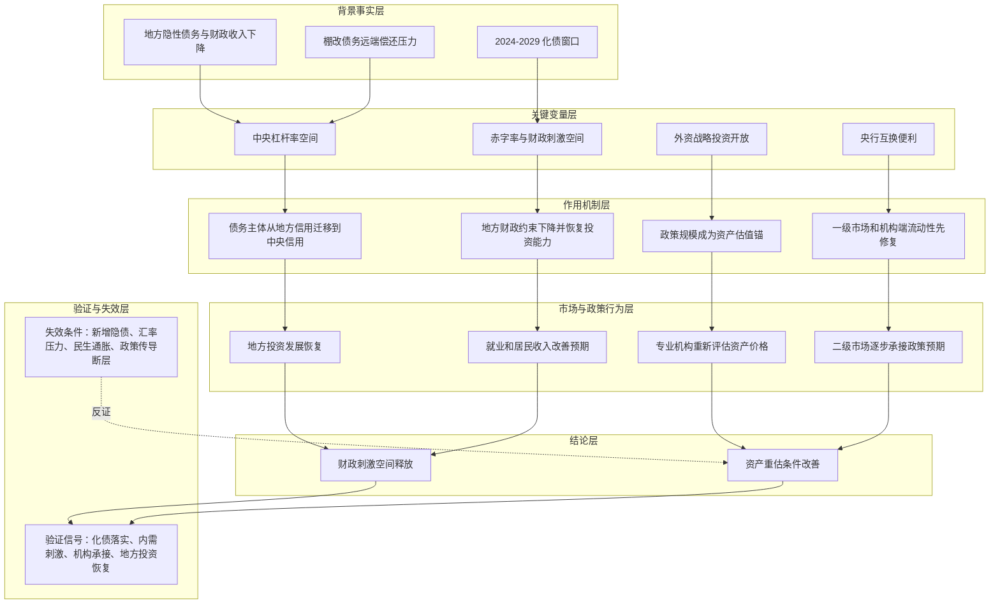

---
title: "冰冰小美-中央加杠杆如何传导为财政刺激与资产重估"
aliases:
  - "中央加杠杆传导链"
  - "中央加杠杆与资产重估推导"
created: 2026-05-28
updated: 2026-06-17
type: reasoning
status: active
tags:
  - macro/fiscal
  - macro/credit
  - macro/liquidity
  - strategy/allocation
  - learning/reasoning
sources:
  - "[[sources/articles/2024-11-08-冰冰小美：中央加杠杆|2024-11-08《中央加杠杆》]]"
related:
  - "[[people/冰冰小美|冰冰小美]]"
  - "[[views/冰冰小美-政策解读-中央加杠杆|冰冰小美-政策解读-中央加杠杆]]"
  - "[[concepts/冰冰小美-债务、分配与增长约束|债务、分配与增长约束]]"
  - "[[concepts/冰冰小美-汇率、长期利率与流动性|汇率、长期利率与流动性]]"
  - "[[冰冰小美-concept-流动性辩证分析|流动性辩证分析]]"
  - "[[topics/冰冰小美-宏观经济|宏观经济]]"
summary: "这条推导拆解冰冰小美如何从地方隐性债务、中央杠杆空间、赤字率、央行工具和外资战略投资，推到财政刺激空间、地方投资恢复、资产定价锚和资产重估。"
conclusion: "作者认为中央加杠杆会把地方债务压力迁移到中央信用下处理，并通过化债、财政刺激、央行工具、外资估值锚和地方投资恢复，逐步传导为资产重估；但传导受新增隐债、汇率和民生通胀约束。"
premises:
  - "地方隐性债务、土地出让金下降、税收下降和棚改债务需要统一处理"
  - "中央杠杆率仍有空间，中央信用可以承担更大债务管理责任"
  - "2024-2029 是作者定义的化债与外部竞争重叠窗口"
  - "央行工具和外资战略投资开放可以先影响一级市场和机构定价"
key_variables:
  - "化债规模"
  - "中央杠杆率"
  - "赤字率"
  - "央行互换便利"
  - "外资战略投资开放"
  - "汇率压力"
  - "民生通胀"
confidence: medium
---

# 冰冰小美-中央加杠杆如何传导为财政刺激与资产重估

## 核心结论

核心命题：[[people/冰冰小美|冰冰小美]] 试图证明「[[views/冰冰小美-政策解读-中央加杠杆|中央加杠杆]] 不只是债务置换，而是通过中央信用承接地方债务压力，打开财政空间、修复机构流动性和资产定价锚，最终改善地方投资、就业收入和资产重估条件」。

这个推导来自 [[sources/articles/2024-11-08-冰冰小美：中央加杠杆|2024-11-08《中央加杠杆》]]。原文先列出化债规模、赤字率空间、中央杠杆率和时间窗口，再把这些变量连接到央行工具、外资战略投资、地方投资恢复和资产价格评估。

一句话压缩：

```text
地方债务压力
-> 中央加杠杆承接
-> 化债与赤字率空间释放
-> 央行工具和外资定价锚改善机构端承接
-> 地方投资、就业、收入和资产估值修复
```

对应观点页见 [[views/冰冰小美-政策解读-中央加杠杆|中央加杠杆确认化债与资产重估的判断框架]]。

## 推导前提

- 背景事实一：作者列出 `6 万亿` 2024-2026 年一致性置换地方隐性债务、`4 万亿` 补充税收和土地出让金下降带来的债务、`2 万亿` 2029 年棚改债务偿还。
- 背景事实二：作者引用隐性债务规模从 `14.3 万亿` 降到 `2.3 万亿` 的目标，并把 `2024-2029` 视为化债窗口。
- 背景事实三：作者认为中央杠杆率约 `25%`，仍有较大空间，因此化债主要方式是中央加杠杆。
- 背景事实四：作者提到若 2025 年赤字率推到 `4%`，预计释放 `5.3 万亿` 财政刺激空间。
- 背景事实五：作者把央行互换便利、外资战略投资开放和川普入主白宫放入同一时间窗口，认为政策会面对外部竞争压力。

## 关键变量

| 变量 | 含义 | 影响 |
|---|---|---|
| 化债规模 | 作者口径中的 `6 万亿 + 4 万亿 + 2 万亿` | 决定地方债务压力能被置换和承接的程度 |
| 中央杠杆率 | 作者认为约 `25%` 且仍有空间 | 决定中央信用承接债务的余地 |
| 赤字率 | 作者假设 2025 年赤字率若到 `4%` | 可能释放额外财政刺激空间 |
| 央行互换便利 | 面向机构和一级市场的创新工具 | 先改善一级市场，再向二级市场传导 |
| 外资战略投资开放 | 作者提到 `2024-12-01` 起正式实施 | 给专业机构评估资产价格提供政策锚 |
| 汇率压力 | 川普关税和外部制裁下的汇率选择 | 影响出口、资产估值和外资定价 |
| 民生通胀 | 蔬菜、肉、蛋、奶等生活成本 | 决定财政货币扩张的社会承受边界 |

## 推导链表

| 层级 | 内容 | 推导关系 | 可信度 | 观察指标 |
|---|---|---|---|---|
| 背景事实 | 地方隐性债务、税收下降、土地出让金下降和棚改债务共同构成旧债务压力 | 作为推导起点 | 高 | 化债额度、地方债务余额、棚改债偿还安排 |
| 关键变量 | 中央杠杆率仍有空间，中央信用可以承接更大债务管理责任 | 受到地方债务压力影响，成为政策承接主体 | 中 | 国债发行、赤字率、中央财政支出强度 |
| 作用机制 | 债务从地方信用迁移到中央信用后，地方财政约束下降 | 解释化债如何释放地方投资和财政空间 | 中 | 地方财政支出、基建投资、专项债使用、城投风险变化 |
| 中介环节 | 赤字率、央行互换便利、外资战略投资开放共同改变机构端定价和市场承接 | 连接财政空间与资产价格评估 | 中 | 央行工具规模、ETF/机构资金流、外资战略投资案例 |
| 结论 | 如果新增隐债、汇率和民生通胀可控，中央加杠杆更容易传导为财政刺激、地方投资恢复和资产重估 | 推导结果 | 中 | 资产估值、就业收入、内需刺激规模、人民币汇率、CPI |

## 推导链

1. 地方隐性债务、税收下降、土地出让金下降和棚改债务，使地方财政端承压。
2. 如果继续由地方端独自承接，地方投资、就业和居民收入恢复都会受约束。
3. 中央加杠杆把旧债压力放到更高信用主体下管理，降低地方债务风险外溢。
4. 旧债压力缓释后，地方政府才有空间恢复投资发展。
5. 投资发展恢复后，才可能进一步带动就业率和居民总体收入。
6. 赤字率如果上调，会形成额外财政刺激空间；消费与内需刺激则是后续尚未落地的增量变量。
7. 央行互换便利等工具先利好一级市场和机构端，二级市场传导存在时间差。
8. 外资战略投资开放后，专业机构可以根据财政和化债规模重新评估资产价格，高估低估出现更明确的政策锚。
9. 如果汇率压力、民生通胀和地方新增隐债可控，中央加杠杆更容易从化债政策传导为资产重估。
10. 如果这些约束失控，中央加杠杆仍可能处理旧债务，但对市场、就业和居民收入的正向传导会变慢或打折。

## Mermaid 推导图



## 传导机制

### 1. 债务主体迁移：从地方信用到中央信用

作者最核心的判断，是把化债视为债务主体和信用支撑方式的变化。地方债务压力如果继续留在地方端，会压制投资和就业；中央加杠杆则把旧压力放到国家信用下统筹处理。

这与 [[concepts/冰冰小美-债务、分配与增长约束|债务、分配与增长约束]] 相连：债务不是凭空消失，而是通过更高信用主体、更长时间表和更强财政能力重新安排。

### 2. 财政空间释放：化债不是内需刺激本身

原文明确区分化债和消费内需刺激：化债规模已经可见，消费和内需刺激“没说，规模未知”。这意味着中央加杠杆的第一层作用是解除旧债务包袱，第二层才是为后续赤字率、内需和财政投资留下空间。

因此，不能把“化债规模”直接等同为“二级市场马上上涨”。它更像是先修复财政和信用约束，再等待资金拨付、项目投向和资产定价重估。

### 3. 市场传导：一级市场先动，二级市场有时间差

作者认为央行互换便利创新工具“对一级市场的有利只会加强不会削弱”，向二级市场传递“只有快慢之分”。这说明她并不把政策公布等同于二级市场立刻兑现，而是强调工具会先修复机构端和一级市场，再逐步影响二级市场定价。

这与 [[冰冰小美-concept-流动性辩证分析|流动性辩证分析]] 一致：成交额和情绪不是唯一指标，真正要看资金来源、机构承接、政策工具和市场阻力。

### 4. 资产定价锚：政策规模让专业机构可以重新估值

作者把外资战略投资开放放进同一窗口，说明她关注的是专业机构如何根据财政规模、化债进度和政策确定性重新评估资产。所谓“高估低估有确定性的锚”，不是说资产必然上涨，而是政策规模改变了估值讨论的参照。

### 5. 风险边界：汇率、通胀和地方新增隐债

原文把不确定性压成三类：

- 地方隐性债务是否继续新增，能否落实到既定目标；
- 汇率是否承压，是否主动破 `7.3`，以及这会如何影响出口和资产估值；
- 通胀，尤其民生产品价格能否控制。

这些变量决定中央加杠杆能否顺畅传导，而不是简单决定政策本身是否存在。

## 时间节点

| 日期 | 事件 | 影响 |
|---|---|---|
| 2024-11-08 | [[sources/articles/2024-11-08-冰冰小美：中央加杠杆|《中央加杠杆》]] 发布 | 作者形成中央加杠杆确认、化债窗口清晰的判断 |
| 2024-2026 | 作者提到 `6 万亿` 一致性置换地方隐性债务 | 化债第一阶段的关键规模 |
| 2024-2029 | 作者定义的化债窗口 | 与川普任期和棚改债务偿还节点重叠 |
| 2024-12-01 | 作者提到外资战略投资开放正式实施 | 外资和专业机构可根据政策规模重新评估资产 |
| 2025-01 | 作者提到川普正式入驻白宫 | 外部关税、制裁和竞争压力进入政策节奏判断 |
| 2025 | 作者假设赤字率若推到 `4%` | 可能释放额外财政刺激空间 |
| 2028 前 | 作者判断“2028 年之前都是化债” | 化债仍是主要政策线索，产业和资产重估需要等待传导验证 |
| 2029 | 作者提到按原合同偿还 `2 万亿` 棚改债务 | 化债时间表的远端节点 |

## 风险触发条件

- 地方新增隐性债务没有被控制，导致化债目标无法落实。
- 汇率压力超过政策承受范围，引发资产估值和外资定价变化。
- 民生通胀抬升，使财政和货币扩张空间被迫收缩。
- 内需刺激规模迟迟不明确，市场只交易预期而缺少基本面兑现。
- 一级市场工具无法传到二级市场，机构端修复和居民端风险偏好断层。
- 外部关税和制裁压力强于预期，出口企业和汇率承压。

## 反例与不确定性

- 反例一：中央加杠杆可能成功降低地方债务风险，但未必自动带来居民收入和就业恢复。
- 反例二：二级市场第一轮上涨可能主要由游资散户和预期交易主导，而不是财政资金真实落地。
- 反例三：政策规模能形成估值锚，但如果企业利润、分红、融资制度和资金承接没有改善，资产重估可能只停留在短期预期。
- 不确定性一：原文规模、隐债目标和赤字率空间属于作者归纳口径，需要后续按官方公告复核。
- 不确定性二：作者用美国 `2008` 救市和 `1932-1936` 罗斯福新政作历史类比，但中国当下财政、产业和资本市场结构不同，不能机械外推。
- 不确定性三：“中央加杠杆 -> 20 年长牛”属于强历史类比，应作为待验证推测保存。

## 相关观点

- [[views/冰冰小美-政策解读-中央加杠杆|冰冰小美-政策解读-中央加杠杆]]：本推导对应的政策解读型观点页。
- [[views/冰冰小美：宏观服务风险识别与仓位调整的判断框架|冰冰小美：宏观服务风险识别与仓位调整的判断框架]]：说明宏观判断最后仍要落到仓位和风险性价比。
- [[views/冰冰小美：川普再次当选后的美国霸权重塑判断框架|冰冰小美：川普再次当选后的美国霸权重塑判断框架]]：提供外部川普任期和竞争压力背景。

## 相关事件

- 暂未单独建立事件页；若后续继续整理具体化债政策、赤字率调整或外资战略投资开放实施细则，可再拆事件页。

## 相关时间线

- [[timelines/冰冰小美-2024年11月竞争白热化时间线|冰冰小美-2024年11月竞争白热化时间线]]：记录该文在 2024 年 11 月连续判断中的位置。
- 后续若围绕 `2024-2029` 化债窗口持续积累材料，可建立“中央加杠杆与化债时间线”。

## 相关概念

- [[concepts/冰冰小美-债务、分配与增长约束|债务、分配与增长约束]]：解释旧债务压力和增长约束。
- [[concepts/冰冰小美-汇率、长期利率与流动性|汇率、长期利率与流动性]]：解释汇率和流动性如何进入资产定价。
- [[冰冰小美-concept-流动性辩证分析|流动性辩证分析]]：解释央行工具、一级市场和二级市场传导的时间差。

## 相关人物

- [[people/冰冰小美|冰冰小美]]：本推导来源人物。

## 相关页面

- [[topics/冰冰小美-宏观经济|宏观经济]]：承接财政、债务、通胀、汇率和资产重估的总主题。
- [[queries/冰冰小美为什么反复提到2028年|冰冰小美为什么反复提到2028年]]：解释“2028 年之前都是化债”如何进入作者的时间节点体系。

## 来源

- [[sources/articles/2024-11-08-冰冰小美：中央加杠杆|2024-11-08《中央加杠杆》]]
