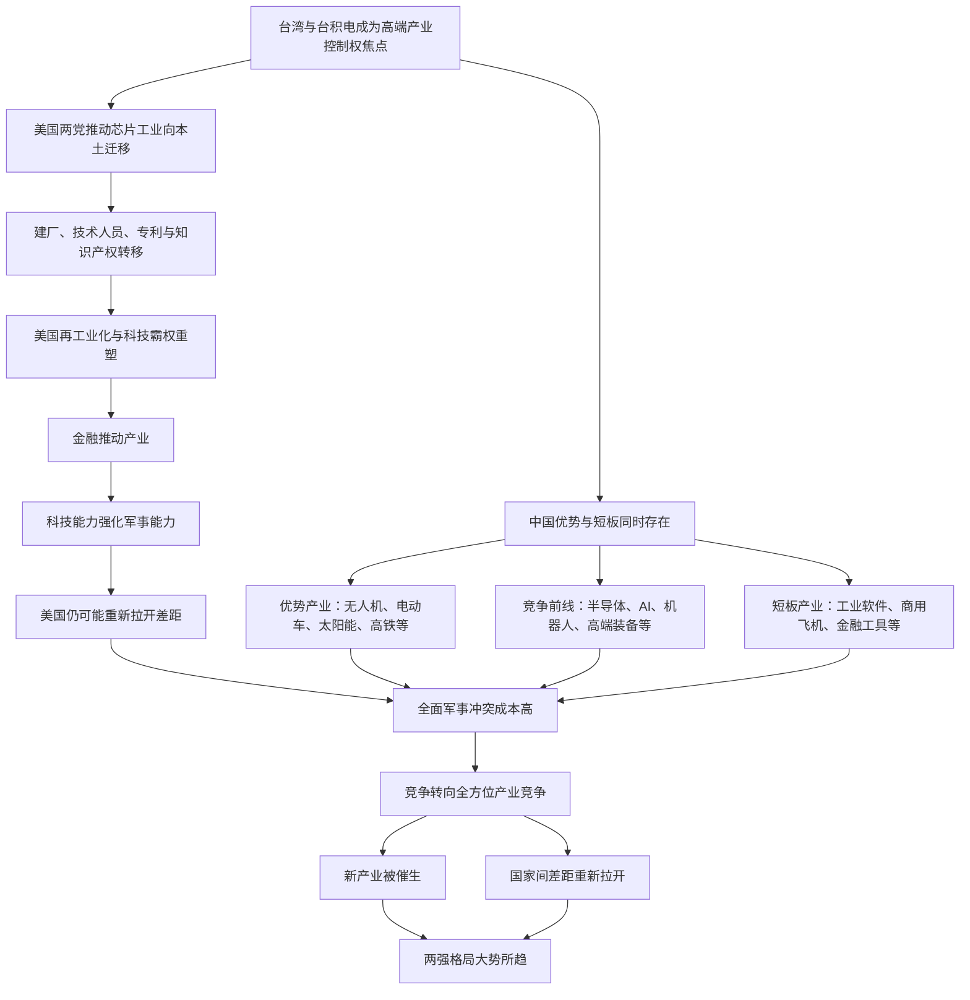

# 冰冰小美-中美产业竞争如何传导为两强格局

## 核心结论

[[people/冰冰小美|冰冰小美]] 在 [[sources/articles/2024-11-10-冰冰小美：竞争白热化|2024-11-10《竞争白热化》]] 中的推导可以压成一句话：

台湾与台积电代表的芯片工业，是中美争夺高端产业控制权的关键节点；美国正在通过建厂、技术人员、专利、金融和科技平台重组本土产业能力，中国也在优势产业和短板产业之间加速追赶；由于全面军事冲突成本过高，竞争更可能长期转向全方位产业战，并推动两强格局成为主线。

对应观点页见：[[views/冰冰小美：中美产业竞争白热化推动两强格局的判断框架|冰冰小美：中美产业竞争白热化推动两强格局的判断框架]]。

## 推导前提

- 前提一：作者把台湾问题视为中美关系核心问题之一，同时把台积电和芯片工业视为高端产业控制权的具体抓手。
- 前提二：不论民主党还是共和党，美国都在推动芯片相关产业向美国本土迁移；区别在于民主党更强调建厂，共和党和川普更强调专利、技术和知识产权转移。
- 前提三：作者认为美国仍然强大，不应简单按“走下坡路的帝国”理解；金融、科技和军事重新结合后，仍可能形成新的领先。
- 前提四：中国已经在无人机、电动车、石墨烯、太阳能、高铁等领域取得优势，但在工业软件、商用飞机、金融工具等领域仍有短板。
- 前提五：中美在军事工业上都没有完全全面胜利的把握，核威胁也压低全面战争概率，因此产业竞争更可能成为主要形态。

## 关键变量

| 变量 | 含义 | 影响 |
|---|---|---|
| 芯片控制权 | 台积电、英伟达和半导体产业链所代表的高端制造控制权 | 决定科技产业革命高地归属 |
| 技术与专利迁移 | 工厂、工程师、技术、专利和知识产权向美国本土迁移 | 是美国再工业化比单纯建厂更深的一层 |
| 美国再工业化 | 作者对川普和美国科技平台合流后的产业路径判断 | 可能让美国重新用金融推动科技和军事能力 |
| 金融推动产业 | 金融资本、互联网平台与实体科技产业结合 | 使产业竞争不只是制造业竞争，也包含资本组织能力 |
| 中国优势产业 | 无人机、电动车、石墨烯、太阳能、高铁等 | 说明中国不是被动追赶，而是已有部分竞争优势 |
| 中国短板产业 | 工业软件、商用飞机、金融工具等 | 决定后续竞争中仍需补课的方向 |
| 军事冲突约束 | 双方军事冲突升级成本和核威慑 | 推动竞争从军事冲突转向全方位产业竞争 |
| 两强格局 | 作者对未来国际竞争结构的判断 | 说明竞争白热化不是短期事件，而是长期格局 |

## 推导链

1. 作者先把台湾问题放在中美关系核心位置，但没有停留在主权表态，而是继续观察美国如何围绕台积电和芯片工业布局。
2. 美国两党在手段上不同：民主党推动台积电在美国建厂和技术人员迁移；共和党和川普进一步把专利、技术和知识产权转移看得更重。
3. 这种差异说明，产业竞争并不只是“有没有工厂”，而是控制技术、人才、专利和产业链组织能力。
4. 作者进一步把川普、马斯克、微软、谷歌、脸书、亚马逊和美国金融力量放在一起，认为金融落地产业、金融推动产业会成为美国未来几年的重要手段。
5. 在“金融与科技 -> 军事”的路径下，美国有可能通过科技产业革命重新拉开与其他国家的差距。
6. 因此，作者反向修正“美国走下坡路”的简单叙事，强调美国仍是强大的帝国。
7. 中国并非只有劣势：无人机、电动车、石墨烯、太阳能、高铁等领域已经形成领先；半导体、AI、机器人、高端装备、船舶、航天通信等方向处在激烈竞争中。
8. 但中国也存在工业软件、商用飞机、金融工具等短板，这些优势和劣势短期都难以彻底扭转。
9. 因为双方都难以在军事工业上取得完全全面胜利，且核威胁压低全面战争概率，所以竞争更可能从军事冲突转向全方位产业竞争。
10. 全方位产业竞争会催生新产业、推动经济发展，并拉开不同国家之间的差距。
11. 由此，作者推导出“两强格局大势所趋”：中美长期产业竞争会成为未来经济、科技和资产定价的重要背景。

## 流程图

## 传导机制

### 1. 芯片控制权把地缘问题转化为产业问题

作者没有只把台湾问题写成政治议题，而是把它继续压到台积电和芯片工业。她的理解是：真正需要观察的，是谁能控制高端产业链、技术人员、专利和知识产权。

这使得地缘竞争不只是军事或外交表态，而会通过半导体产业链重组进入资本市场和产业政策。

### 2. 美国再工业化不是单纯制造业回流

在作者框架里，建厂只是起点，专利、技术和知识产权迁移才更深。也就是说，美国想要的不是低端产能回流，而是重新拿回科技产业革命的高地。

这与 [[views/冰冰小美：川普再次当选后的美国霸权重塑判断框架|川普再次当选后的美国霸权重塑判断框架]] 相连：关税、货币信用、再工业化和科技平台合流，都是美国重组霸权的一部分。

### 3. 金融、科技和军事形成复合竞争

作者把马斯克和美国互联网、金融公司对川普的态度放在一起看，认为未来美国可能通过金融落地产业、金融推动产业，并最终形成“金融与科技 -> 军事”的复合路径。

这条传导说明，产业竞争不是一个孤立制造业问题，而是资本组织能力、平台能力、科技能力和军事能力的组合。

### 4. 中国优势与短板共同决定竞争前线

作者没有把中国写成单向弱势。她同时列出优势、竞争激烈和短板领域：

- 优势领域包括无人机、电动车、石墨烯、太阳能、高铁等；
- 竞争激烈领域包括半导体芯片、人工智能、机器人、高端设备与机床、大型船舶与舰艇、航天卫星通信等；
- 短板领域包括工业软件、商用飞机、金融工具等。

这种分类的价值在于，它把“做多中国”从口号拆成不同产业位置：有些领域已领先，有些领域在前线争夺，有些领域仍需要补课。

### 5. 军事约束使产业战成为主要形态

作者认为双方在军事工业上都没有底气完全全面胜利，核威胁也让全面战争概率较低。因此，竞争更可能表现为全方位产业竞争。

这也是她为什么把“两强格局”放在最后：不是因为冲突消失，而是因为冲突被转译成产业、科技、金融和供应链的长期竞争。

## 时间节点

| 日期 | 事件 | 影响 |
|---|---|---|
| 2024-11-10 | 《竞争白热化》发布 | 作者单独展开中美产业竞争白热化判断 |
| 2024-11-10 | 作者评论“识时务者为俊杰” | 强化她对阶段变化和顺势判断的态度 |
| 2024-11-10 | 作者在评论中回应“没有退路” | 将产业竞争进一步压到国家战略和经济命脉层面 |

## 风险触发条件

- 美国技术回流、台积电美国厂和产业政策执行不及预期，使美国再工业化链条变弱。
- 中国在关键短板领域突破超预期，使“两强格局”的产业分工比作者当时判断更快变化。
- 地缘冲突升级，导致产业竞争逻辑被更直接的军事或制裁逻辑覆盖。
- AI 和半导体资本开支泡沫破裂，使产业趋势和资本市场表达短期脱节。
- 金融工具、工业软件、商用飞机等短板长期无法改善，拖累中国竞争位置。

## 反例与不确定性

- 反例一：美国强大不等于美国所有再工业化尝试都会成功，建厂、成本、工人、供应链和政策连续性都可能成为反向约束。
- 反例二：中国已有优势不等于对应资产都会上涨，产业能力、利润分配和市场估值仍可能分离。
- 不确定性一：原文列举的美国控制三星股权、美国多次保护主义未失败、台湾股市上涨原因等说法未在本次入库中外部核验。
- 不确定性二：战争概率和两强格局都属于作者推测，需要随地缘事件和产业兑现继续修正。
- 不确定性三：本推导涉及政治、军事、产业和金融市场，属于高变动领域，应保留较低置信度。

## 相关观点

- [[views/冰冰小美：中美产业竞争白热化推动两强格局的判断框架|冰冰小美：中美产业竞争白热化推动两强格局的判断框架]]：本推导对应的观点页。
- [[views/冰冰小美：川普再次当选后的美国霸权重塑判断框架|川普再次当选后的美国霸权重塑判断框架]]：提供美国再工业化、关税保护和霸权重塑背景。
- [[views/冰冰小美：2024大事件落地后未来行情演绎的阶段判断|2024大事件落地后未来行情演绎的阶段判断]]：说明竞争白热化如何进入后续行情判断。
- [[views/冰冰小美：AI成为国家级竞争门槛的核心判断|AI成为国家级竞争门槛的核心判断]]：承接 AI 作为国家级竞争门槛的后续判断。

## 相关事件

- 暂未单独建立事件页；台积电美国建厂、川普关于芯片产业的表态、美国科技平台站队等若后续材料变厚，可拆成事件页或时间线。

## 相关时间线

- 暂无专门时间线；若继续整理 2024 年 11 月以后中美产业竞争材料，可考虑建立“中美产业竞争白热化时间线”。

## 相关概念

- [[concepts/冰冰小美-三大配置|三大配置]]：可与本文中的优势产业、竞争前线和短板产业互相参照。
- [[concepts/冰冰小美-体系三要素|体系三要素]]：竞争格局的比较优势是后续行情和交易窗口判断的第一层。

## 相关人物

- [[people/冰冰小美|冰冰小美]]：本推导来源人物。

## 相关页面

- [[topics/宏观经济|宏观经济]]：承接产业竞争对白热化阶段宏观环境的影响。
- [[topics/冰冰小美-地缘重估与资源-货币秩序|地缘重估与资源-货币秩序]]：承接地缘、货币和科技霸权重塑。
- [[topics/冰冰小美-AI产业趋势|AI产业趋势]]：承接 AI、芯片和新质生产力方向。
- [[views/冰冰小美：定位与立场下的中美两超与资产分类判断框架|定位与立场下的中美两超与资产分类判断框架]]：后续补充中美两超和资产分类判断。
- [[reasoning/冰冰小美-美国金融军事困境如何传导为中美两超与资产分类|美国金融军事困境如何传导为中美两超与资产分类]]：后续补充美国金融军事困境与资产方向之间的传导。
- [[reasoning/冰冰小美-川普再次当选后的美国霸权重塑推导链|川普再次当选后的美国霸权重塑推导链]]：拆解美国侧的霸权重塑逻辑。
- [[reasoning/冰冰小美-2024大事件如何传导为产业ETF行情|2024大事件如何传导为产业ETF行情]]：拆解竞争白热化如何进入市场表达。

## 来源

- [[sources/articles/2024-11-10-冰冰小美：竞争白热化|2024-11-10《竞争白热化》]]
