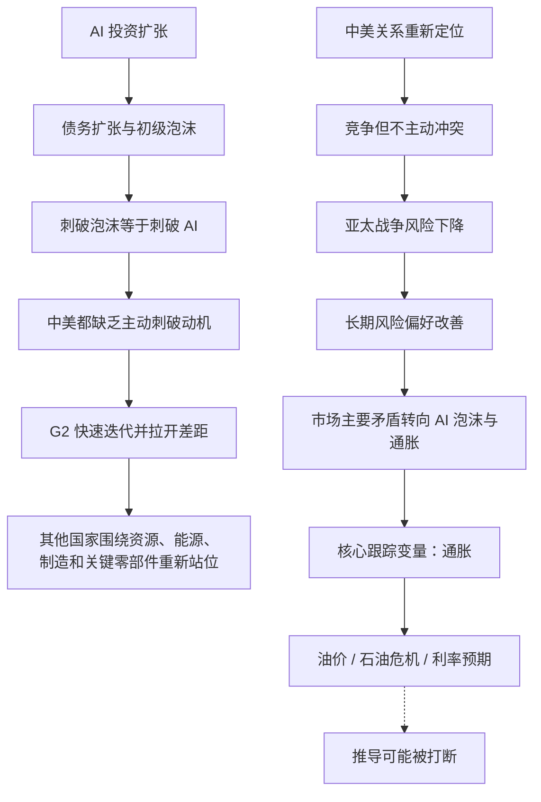
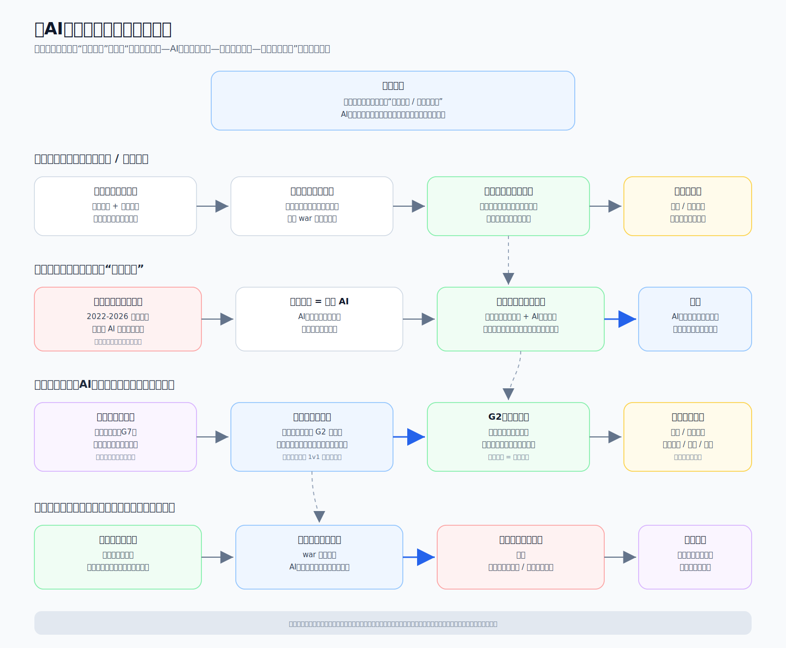

# 冰冰小美 AI 与国家 G2 推导链

## 核心结论

[[people/冰冰小美|冰冰小美]] 在《Ai与国家》中的推导核心是：如果中美关系被重新定位为竞争但不主动冲突，那么亚太战争风险会下降；而 AI 投资扩张已经和 2022-2026 年的债务扩张、市场初级泡沫绑定，中美都没有主动刺破 AI 的动机。由此，AI 从产业题材上升为国家级门槛，全球其他国家必须围绕 G2 的 AI 竞赛重新选择位置。

投资层面的落点不是“无风险上涨”，而是跟踪变量被压缩：只要战争风险没有重新升温，最关键的可观察变量转向通胀，尤其是油价和石油危机对美国政策、选票和利率预期的影响。

## 推导前提

1. 中美关系存在阶段性重新定位，作者将其理解为“不主动冲突、竞争中发展”。
2. 亚太地缘风险会随中美克制而下降，周边国家也更难主动打破克制。
3. 2022-2026 年的债务扩张与 AI 投资扩张高度相关。
4. AI 是国家竞争的核心门票，中美都需要继续投入。
5. 美国制造业回流与中国新产业推进都需要时间，双方都不愿牺牲当前战略窗口。
6. 其他国家缺少完整 AI 门票，只能在资源、能源、制造下游或关键零部件位置上承接。

## 关键变量

| 变量 | 含义 | 推导作用 |
|---|---|---|
| 中美关系重新定位 | 作者认为中美竞争被重新定性，短中期不主动冲突 | 降低亚太战争风险，改善风险偏好 |
| 亚太安全溢价 | 作者将亚太对比欧洲、中东、南美等区域，视为相对安全港 | 使长期看多有更强地缘基础 |
| AI 投资扩张 | 算力、芯片、数据中心、机器人、云端等资本开支 | 推动债务扩张，也支撑泡沫延续 |
| AI 泡沫 | 市场初级泡沫与 AI 投资绑定 | 若主动刺破泡沫，等于刺破 AI 战略 |
| G2 门槛 | 作者认为第四次工业革命只剩中美拥有完整门票 | 解释为什么其他国家更多是被动承接 |
| 通胀 | 特别是油价和石油危机对美国政策与选票的影响 | 成为后续最重要的跟踪变量 |

## 推导链

1. 中美竞争被作者理解为重新定位，不再以主动冲突为主线。
2. 中美都保持克制时，亚太周边国家主动破坏稳定的空间下降。
3. 亚太战争风险下降，市场最担心的系统性风险之一被压低。
4. 在这个背景下，全球风险资产的核心矛盾从战争风险转向 AI 投资泡沫与通胀约束。
5. 2022-2026 年债务扩张大量来自 AI 投资扩张，AI 资本开支支撑了市场初级泡沫。
6. 如果主动刺破泡沫，就会伤及 AI 投资和国家竞争能力。
7. 中美都需要 AI 作为第四次工业革命门票，因此都没有主动刺破 AI 的动机。
8. 竞争中的共同发展会推动技术快速迭代，继续拉开中美与其他国家的差距。
9. 其他国家只能围绕 G2 AI 竞赛寻找位置：资源、能源、制造下游、材料、存储、半导体等。
10. 后续投资跟踪变量收束为通胀：若通胀和油价可控，风险偏好更容易维持；若通胀重新失控，推导会被打断。

## Mermaid 推导图



## SVG 推导图



## 传导机制

### 1. 从地缘克制到市场安全感

作者首先把中美重新定位解释为一种地缘约束：只要中美都不主动挑起冲突，亚太的主要外部风险就会下降。她进一步认为，周边国家在中美都克制时也难以主动扩大冲突。

这条机制的市场含义是：战争风险不再作为最大雷点压在亚太资产上，长期风险偏好可以重新回到产业、政策和流动性。

### 2. 从 AI 资本开支到泡沫延长

作者承认市场存在初级泡沫，但她不把泡沫简单视为必须立刻破灭的坏事，而是把它和 AI 资本开支绑定。

这条机制是：

```text
AI 资本开支上升 -> 债务扩张 -> 初级泡沫形成 -> 刺破泡沫会伤害 AI 投资 -> 中美都不愿主动刺破
```

因此，泡沫在她这里不是被否认，而是被国家竞争框架重新解释：它更可能被政策、时间和产业兑现管理，而不是被主动终结。

### 3. 从 G2 门槛到全球再分工

文章把第四次工业革命理解为门票极其昂贵的竞赛。与第三次工业革命还有 G7 多国参与不同，作者认为 AI 时代真正拥有完整投入能力、市场规模、产业链和战略意愿的只剩中美。

这会迫使其他国家重新站位：

- 资源国家提供矿产与能源。
- 制造国家承接劳动密集型电子产业。
- 技术环节国家或地区依靠材料、存储、半导体位置受益。
- 置身事外的国家仍会被石油美元潮汐和旧能源冲击波及。

### 4. 从通胀到风险节奏

作者最后把可跟踪变量压缩为“通胀”。这与她此前关于有色金属和 `5/14` 风险节点的判断相连：真正会改变风险资产节奏的，不只是 AI 叙事本身，而是油价、通胀、降息预期和美元流动性。

如果石油危机可控、通胀预期下降，AI 资本开支泡沫更容易延续；如果通胀再次压制降息预期，则高估值科技资产和资源资产都会重新承压。

## 时间节点

| 日期 | 事件 | 推导中的作用 |
|---|---|---|
| 2022-2026 | 作者认为债务增长多由 AI 投资扩张推动 | 形成“AI 资本开支 -> 债务扩张 -> 初级泡沫”的背景 |
| 2026-05-17 | 雪球文章《Ai与国家》发布 | 将 AI 明确上升到国家竞争与 G2 门槛层面 |
| 未来三年 | 作者认为中美不冲突则市场最大雷点下降 | 属于作者预测，需要持续验证 |

## 风险触发条件

- 中美关系重新恶化，竞争框架从克制转向主动冲突。
- 亚太出现不可控军事摩擦，战争风险重新进入资产定价。
- 美国通胀或油价重新走高，压制降息预期和风险偏好。
- AI 资本开支回报率被证伪，融资、债务或现金流压力集中暴露。
- 中国新产业推进低于预期，市场不再相信长期产业兑现。
- 其他国家或地区的脆弱性暴露，引发外部流动性收缩和风险传染。

## 反例与不确定性

- 作者对中美关系、亚太安全、三战风险和 G2 格局的判断较强，当前资料未提供完整外部证据。
- “AI 门票只剩 G2”是战略判断，不应写成已被验证的事实。
- AI 投资是否足以持续支撑债务扩张和市场泡沫，需要后续数据验证。
- 通胀并非唯一变量；就业、财政、美元流动性、资本开支回报率和政策监管都可能改变市场节奏。
- 其他国家并非只能被动承接，若技术路线或政策联盟变化，G2 判断可能被削弱。

## 相关观点

- [[views/冰冰小美：AI成为国家级竞争门槛的核心判断|冰冰小美：AI成为国家级竞争门槛的核心判断]]
- [[views/冰冰小美：有色拐点取决于通胀预期回落的阶段判断|冰冰小美：有色拐点取决于通胀预期回落的阶段判断]]

## 相关页面

- 人物页：[[people/冰冰小美|冰冰小美]]
- 主题页：[[topics/宏观经济|宏观经济]]
- 主题页：[[topics/冰冰小美-地缘重估与资源-货币秩序|地缘重估与资源-货币秩序]]
- 原始资料：[[sources/articles/2026-05-17-冰冰小美：Ai与国家|冰冰小美：Ai与国家]]
