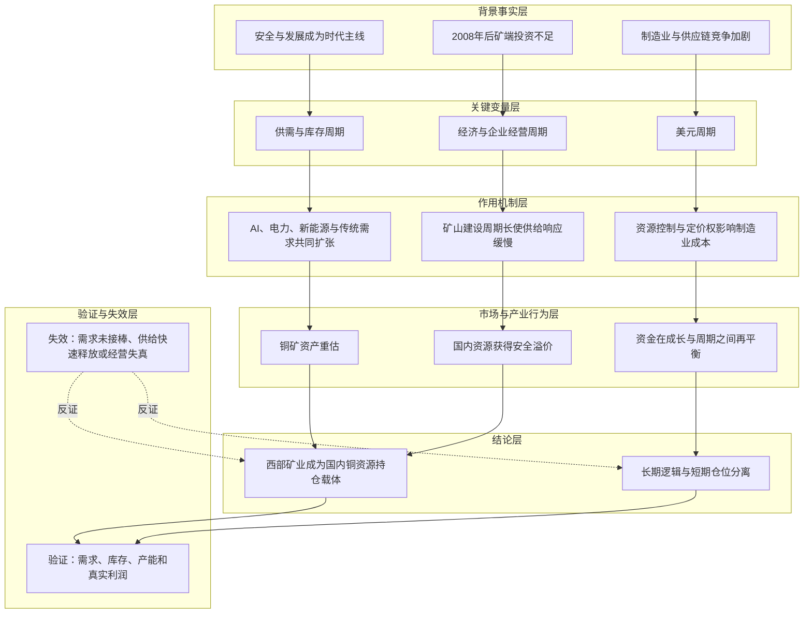

# 冰冰小美-对铜的分析

> 本文不是标准公司基本面研报，也不回答西部矿业当前值多少钱。它只还原 `铜与西部矿业合集` 当前可见 69 篇帖子中的核心逻辑：作者为何选择铜、为何用西部矿业承载这条逻辑，以及如何根据估值、流动性与情绪调整仓位。

## 第一章 结论与分析框架

### 1.1 核心结论

目录中的西部矿业逻辑，可以压缩成一条连续推导：

> **安全与发展成为时代主线 → 制造业竞争转向资源竞争 → 铜同时具备工业属性、金融属性和战略属性 → 2008 年后矿端投资不足，而 AI、电力、新能源与制造业再工业化创造新需求 → 铜的供给弹性与定价权成为约束 → 国内铜矿资产获得安全溢价 → 西部矿业因国内矿山、国企责任、真实产能与分红，被选为中长期资源配置载体 → 但周期股不能脱离 PB、资产价格、需求兑现与市场情绪定价，所以持仓需要通过减仓、加回、做 T、锁仓和跨资产再平衡控制风险。** ^[inferred]

这套逻辑最容易被误读的地方有三个：

1. 作者长期看多的不是“铜价每天上涨”，而是铜在未来产业竞争中的约束地位。
2. 作者选择西部矿业，不是因为它被论证为经营效率最高的铜企，而是因为它同时满足国内资源安全、国企使命和真实资产落地。
3. 长期看多不等于任何价格都可以买。帖子反复强调：估值偏贵、投机资金扎堆、情绪亢奋时应减仓；逻辑未变且估值回到可承受区间时再加回。

### 1.2 整套逻辑的四层结构

| 层次 | 核心问题 | 目录中的回答 |
|---|---|---|
| 时代层 | 为什么要研究铜？ | 安全优先、制造业竞争、美元信用变化和全球供应链重构，使战略资源重新成为国家竞争的底层约束。 |
| 产业层 | 为什么铜可能重估？ | 2008 年后矿端投资不足，新增矿山周期长；AI、电网、新能源、设备更新和全球制造业重复建设扩大需求。 |
| 标的层 | 为什么是西部矿业？ | 国内矿山降低海外供应链风险；玉龙项目代表产能落地；国企经营、分红和责任使命提供持仓安全感。 |
| 交易层 | 为什么还要反复调仓？ | 铜有金融属性，股价同时受美元、期货、库存、估值、流动性和情绪影响；长期逻辑与短期价格必须分开处理。 |

#### 1.2.1 推导链表

| 层级 | 内容 | 推导关系 | 可信度 | 观察指标 |
|---|---|---|---|---|
| 背景事实 | 安全优先、制造业竞争、2008 年后矿端投资不足 | 作为推导起点 | 中 | 国家战略储备、全球矿端投资、制造业政策 |
| 关键变量 | 美元、供需、经济、企业经营与库存五周期 | 受到背景事实影响 | 中 | 美元方向、进口与库存、开工率、项目投产 |
| 作用机制 | 新旧需求扩张，而矿山建设周期长，铜的供给弹性与定价权成为约束 | 解释变量如何传导 | 中 | AI与电力投资、传统需求、矿产增量 |
| 中介环节 | 国内资源安全溢价、铜矿资产重估、资金由高估成长向油矿再配置 | 连接机制与结果 | 中 | 资源资产估值、资金拥挤度、企业经营验证 |
| 结论 | 保留铜与国内铜矿的中长期配置逻辑，同时用估值、流动性和情绪管理仓位 | 推导结果 | 中 | PB压力、需求兑现、项目与利润真实性 |

#### 1.2.2 推导图

## 第二章 铜的时代与产业逻辑

### 2.1 起点不是铜价，而是“安全与发展”

作者的起点不是某一年的铜供需缺口，而是国家发展模式的变化。

[[sources/automations/BBXM每日汇总/铜与西部矿业合集/091_2024-03-14_铜的战略储备与周期突破信号|2024-03-14《铜的战略储备与周期突破信号》]]把 2017 年后的政策主线概括为：经济从高速增长转向高质量发展，贸易冲突、供应链破坏、能源结构和金融风险使“安全”逐渐被置于更高位置。煤炭、石油、铜、磷、钾与粮食储备因此不是普通商品库存，而是应对极端环境的战略准备。

这一步决定了作者观察资源品的方式：

- 资源不只是商品，也是制造业和国家安全的基础投入；
- 金融与房地产应服务实体经济，制造业是经济根基；
- 新旧动能转换会压低旧资产、扶持新质生产力，同时重新评估上游资源的重要性；
- 当全球化退潮、保护主义抬头时，资源可得性比短期利润率更重要。

因此，铜在这套框架里首先是一个政治经济学问题，其次才是商品价格问题。

### 2.2 为什么铜是制造业竞争的关键约束

#### 2.2.1 铜同时连接旧需求与新需求

目录中的铜需求不是单一的房地产叙事，而是三类需求叠加：

- 传统基本盘：房地产、家电、基础设施；
- 转型需求：新能源车、储能、电网、设备更新；
- 新技术需求：5G、数据中心、算力中心、AI 电力系统与电子产业。

[[sources/automations/BBXM每日汇总/铜与西部矿业合集/073_2024-03-31_铜：从周期拐点到国运之争的坚守|2024-03-31《铜：从周期拐点到国运之争的坚守》]]把通信网络、机器、应用场景和能源系统串成“万物互联”的底层结构。它的关键判断是：AI 并不只需要芯片，还需要电力、储能、设备和传输材料；铜是这些系统共同依赖的基础金属。

#### 2.2.2 资源争夺的本质是制造业话语权

作者认为，中国是铜消费和加工大国，但国内铜资源相对不足，缺少上游定价权。铜价及铜矿控制权因此会影响中国制造业成本。

[[sources/automations/BBXM每日汇总/铜与西部矿业合集/049_2024-05-15_铜价战略与制造业竞争力重塑|2024-05-15《铜价战略与制造业竞争力重塑》]]与[[sources/automations/BBXM每日汇总/铜与西部矿业合集/009_2025-03-12_铜：产业竞争下的资源定价权争夺|2025-03-12《铜：产业竞争下的资源定价权争夺》]]进一步把关税、制造业回流、港口和矿产控制放进同一张图里：当主要经济体都试图增强本国产业链，资源需求不再只是全球总量增长，还来自各国重复建设和战略备份。

所以，作者所谓“中美争铜”，并不是简单判断某国要囤多少铜，而是认为第四次工业革命的竞争最终会传导到电力、矿产和物流等底层要素。

### 2.3 铜为什么可能进入重估周期

[[sources/automations/BBXM每日汇总/铜与西部矿业合集/082_2024-03-16_铜价突破背后的多周期共振逻辑|2024-03-16《铜价突破背后的多周期共振逻辑》]]给出了目录中最完整的铜周期框架：

1. **美元周期**：降息、美元信用和全球流动性影响铜的金融属性。
2. **供需周期**：矿端供给增长缓慢，新旧产业共同增加需求。
3. **经济周期**：中国复苏、美国制造业回流和全球投资决定总需求。
4. **企业经营周期**：矿山、技改和扩产需要较长建设时间，价格上涨不能马上带来供给。
5. **库存周期**：港口库存、进口、回收企业备货和主动补库存决定价格变化能否从预期进入现实。

这五个周期不是同时、同速变化。作者真正看重的是它们出现阶段性共振：

> 2008 年金融危机压制矿产投资 → 十多年后供给弹性仍不足 → AI、电力、新能源和制造业再投资创造新需求 → 美元周期可能转向 → 库存由消耗走向补库 → 铜从传统周期品转为产业竞争中的稀缺投入。

这里最重要的不是某个铜价预测，而是“新增供给慢、需求结构变宽”。玉龙项目需要较长时间才能投产，在作者笔下正是矿业供给无法快速响应价格的例子。

## 第三章 西部矿业的标的逻辑

### 3.1 为什么用西部矿业承载铜逻辑

#### 3.1.1 第一优先级是资源安全，不是利润最大化

作者选择西部矿业的第一理由，是矿山主要位于国内。与海外矿山相比，国内资源在供应链中断、地缘冲突和矿权争夺中具有更高确定性。

[[sources/automations/BBXM每日汇总/铜与西部矿业合集/073_2024-03-31_铜：从周期拐点到国运之争的坚守|2024-03-31 原帖]]明确把西部矿业的“安定因素”归为采掘安全性，并把玉龙项目的快速落地理解为国家资源战略和企业使命的体现。作者甚至认为，短期业绩波动并不足以推翻这种资源安全判断。

#### 3.1.2 第二优先级是“真实经营”

[[sources/automations/BBXM每日汇总/铜与西部矿业合集/053_2024-05-04_西部矿业投资逻辑与风险规避思考|2024-05-04《西部矿业投资逻辑与风险规避思考》]]没有把公司分析停在财务指标，而是用以下旁证判断企业是否正常经营：

- 利润是否真实，而不是只追求报表数字漂亮；
- 扩产项目是否真正落地生产；
- 是否持续分红；
- 管理层是否有经营目标与市值管理意识；
- 企业是否拥有真实矿产，而不是借资源概念融资炒作。

作者从锂业切换到西部矿业，也体现了同一条规则：同属有色，优先选择有矿、持续盈利、能在未来继续经营的企业，而不是只有概念或亏损的公司。

#### 3.1.3 第三优先级是国企责任与新的价值锚

[[sources/automations/BBXM每日汇总/铜与西部矿业合集/051_2024-05-13_铜：新估值体系下的稀缺锚点|2024-05-13《铜：新估值体系下的稀缺锚点》]]认为，赛道基金抱团破裂后，市场需要新的价值锚。这个锚不是再次追逐高毛利成长，而是国企经营目标、分红约束、真实资产和维护市场信心的责任。

在这一层，西部矿业与中国石油共同组成作者的“左手油矿”：不是追求最高弹性，而是用实业资产、资源安全与现金回报对冲市场生态和美元信用的不确定性。

### 3.2 估值方法：周期股看资产价格，但不能脱离 PB

目录中的估值观与标准 PE 估值明显不同。

[[sources/automations/BBXM每日汇总/铜与西部矿业合集/084_2024-03-15_西部矿业业绩背后的周期资产重估|2024-03-15《西部矿业业绩背后的周期资产重估》]]提出“周期股不只看利润，更要看资产价格”。铜价、矿山价值和技改投产会改变资产的定价区间，因此静态利润不能完整反映周期上行阶段。

但“看资产价格”并不等于无限抬估值。帖子同时设置了三道约束：

1. **PB 分水岭**：[[sources/automations/BBXM每日汇总/铜与西部矿业合集/071_2024-04-02_西部矿业估值突破前的关键观察|2024-04-02 原帖]]与[[sources/automations/BBXM每日汇总/铜与西部矿业合集/080_2024-03-18_铜价突破后的仓位与信心管理|2024-03-18 原帖]]把约 4 倍 PB 视为周期股的重要压力区。若没有重大供需改善或盈利加速，突破后容易进入泡沫和强分歧。
2. **长短周期并看**：十年分位可能已经偏高，但从 2008 年之后的更长周期看仍可能处在中低位。短周期估值压力与长周期资源重估可以同时成立。
3. **价格必须由需求接力**：流动性可以先推升估值，但中高估值要继续上行，必须由真实需求、库存变化与企业盈利兑现接棒。

2024 年 6—7 月，作者把 17.5 元作为当时一季度指引对应的阶段性估值锚，反复强调不鼓励在其上方追买；这只是作者当时的交易纪律，不是可跨时间复用的永恒目标价。

## 第四章 仓位管理与逻辑演化

### 4.1 交易方法：长期逻辑与短期仓位分离

#### 4.1.1 持有不是静止，而是每天重新承担风险

[[sources/automations/BBXM每日汇总/铜与西部矿业合集/053_2024-05-04_西部矿业投资逻辑与风险规避思考|2024-05-04 原帖]]把“持仓”视为持续买入，把买入视为承担风险。因此，企业没有暴雷不代表账户没有风险；周期向下、估值过高或亏钱效应扩散，都可能造成持仓层面的“暴雷”。

由此形成一条核心纪律：

> 长期逻辑决定是否保留底仓，估值和情绪决定保留多少仓位。

#### 4.1.2 流动性有利、情绪不利时减仓

2024 年 4 月铜和有色加速上涨后，作者并没有把上涨当成继续追买的理由。[[sources/automations/BBXM每日汇总/铜与西部矿业合集/065_2024-04-08_铜价亢奋期的交易风险与应对|2024-04-08《铜价亢奋期的交易风险与应对》]]指出：投机资金扎堆、情绪亢奋、估值进入中高区间时，机构卖出压力会增加；即使流动性仍有利，也应该降低仓位。

[[sources/automations/BBXM每日汇总/铜与西部矿业合集/045_2024-05-16_西部矿业：从估值回归到仓位取舍|2024-05-16《西部矿业：从估值回归到仓位取舍》]]进一步说明，减仓并不是推翻美元信用、国运或铜需求逻辑，而是因为有色黄金突然拥挤、十年估值分位偏贵。

#### 4.1.3 估值回落、逻辑未坏时加回

作者后续回顾称，西部矿业在高位减仓后，于阶段估值锚附近重新加回。[[sources/automations/BBXM每日汇总/铜与西部矿业合集/036_2024-07-05_西部矿业持仓半年的核心审视|2024-07-05 原帖]]与[[sources/automations/BBXM每日汇总/铜与西部矿业合集/031_2024-07-12_西部矿业仓位调整与交易策略回顾|2024-07-12 原帖]]体现了这种做法：油矿仍是核心配置，但仓位会根据估值压力和其他资产的比较优势被动调整。

#### 4.1.4 用周线和月线抵抗日内噪声

目录中多次出现“日线万箭穿心、月线云淡风轻”式表达。其实际含义是：

- 铜期货、美元消息和交易所政策会放大日内波动；
- 中期需求和企业经营不会按日变化；
- 中长线仓位应以周线、月线和季度经营验证为主；
- 如果波动已经破坏心态，应主动减仓，而不是用长期主义掩盖仓位过重。

[[sources/automations/BBXM每日汇总/铜与西部矿业合集/032_2024-07-12_铜股震荡期的价值坚守与策略|2024-07-12《铜股震荡期的价值坚守与策略》]]把这种关系总结得最完整：只有先理解估值、需求和可能持续数月的震荡，才可能真正长期持有。

### 4.2 逻辑如何随时间演化

| 阶段 | 时间 | 认识变化 | 对应动作 |
|---|---|---|---|
| 战略框架成形 | 2024-03-14—03-16 | 从安全、战略储备和制造业竞争出发，建立美元、供需、经济、经营、库存五周期框架。 | 把铜和西部矿业纳入中长线观察与配置。 |
| 价格突破与共识形成 | 2024-03-18—04-03 | 铜价突破，西部矿业从业绩股被重新解释为资源资产；同时观察 4 倍 PB 压力。 | 管理仓位，等待情绪稳定与行业龙头确认。 |
| 亢奋与风险控制 | 2024-04-08—05-16 | 流动性推动有色上涨，但投机资金扎堆、估值进入中高区间。 | 减仓、做 T，不在情绪加速段追高。 |
| 横盘与逻辑复核 | 2024-06—07 | 期货利空与股价逐渐脱敏；短周期估值高、长周期资源逻辑仍在，预期数月震荡。 | 在阶段估值锚附近加回，以周线和仓位承受力持有。 |
| 长期配置确认 | 2024-10—12 | 美元贬值、保护主义、AI与房地产等需求共同支撑长期铜逻辑；买入初衷未变。 | 从高频交易逐渐转向一年以上的资产配置。 |
| 周期与成长再平衡 | 2025-03 | H 股由低估进入中估，AI 投机升温、外溢风险增大；铜矿产估值相对合理且能对冲不确定性。 | 减 H 股，逐步加回铜矿；短线配置成长，中长线坚守周期。 |

这条时间线说明，作者的逻辑不是从“看多”一路直线推到“永远满仓”，而是在长期方向不变的情况下不断做三件事：验证需求、校正估值、调整仓位。

### 4.3 帖子中的三要素如何落到西部矿业

#### 4.3.1 竞争格局

- 国内铜资源不足，铜是产业链约束；
- 全球制造业竞争会加剧矿产争夺；
- 国内矿山相对海外矿山具有供应链安全优势；
- 西部矿业以真实矿产、国企属性和项目落地形成比较优势。

#### 4.3.2 流动性

- 美元信用、降息预期和全球资金流影响铜的金融属性；
- 资源资产可承接部分从高估成长、美元资产或 H 股撤出的资金；
- 流动性只能先推估值，不能替代需求和盈利。

#### 4.3.3 情绪

- 铜期货上涨容易吸引短线资金，形成“价值投机”；
- 关注人数激增、投机资金扎堆和板块一致乐观，是减仓信号而非加仓信号；
- 期货利空、股价回调和市场恐慌不自动等于逻辑失效，需观察股价是否对利空脱敏、需求是否恶化。

三要素在这里不是一个静态打分表，而是仓位开关：竞争格局决定能不能长期看，流动性决定估值扩张速度，情绪决定何时不能追。

### 4.4 目录内部已经给出的反证与风险

这批帖子并非单向唱多，也留下了多项反证条件：

1. **短缺尚未真正发生**：作者承认铜仍有战略储备和库存，真正的供需紧张需要进口、港口库存、回收企业备货和开工率验证。
2. **房地产旧需求仍是变量**：房地产风险曾压制 2020 年铜周期，新需求能否完全接棒不能只靠叙事。
3. **美元强势会延后金融属性兑现**：延迟降息、美元走强和宏观流动性收紧会造成长期逻辑未变、短期价格先跌。
4. **高估值会制造自身风险**：周期股接近历史 PB 压力区，而盈利和供需没有倍增时，横盘或回撤是正常结果。
5. **铜价过高也会损害需求**：[[sources/automations/BBXM每日汇总/铜与西部矿业合集/010_2025-03-12_铜：周期与成长的仓位再平衡|2025-03-12《铜：周期与成长的仓位再平衡》]]指出，铜涨价会抬高 AI 建设成本；若投资放缓，成本最终会反噬产业利润。
6. **国企使命不是经营免责**：作者认可盐湖锂等战略投入，但同时强调真实利润、项目落地、分红和管理者能力必须持续观察。

因此，这套逻辑的失效不应由某一天股价下跌确认，而应由以下组合确认：需求没有接棒、库存重新累积、供给快速释放、企业项目与利润失真，或估值长期脱离资产和盈利支撑。

### 4.5 从目录中提炼出的交易规则

| 场景 | 帖子逻辑对应的动作 |
|---|---|
| 资源安全与长期需求逻辑成立，估值处于低位 | 建立或保留中长期仓位。 |
| 铜价上涨，但市场尚未形成拥挤，企业资产价格开始重估 | 持有，重点验证龙头、库存和产能。 |
| PB 进入周期压力区，投机资金扎堆，情绪加速 | 减仓或做 T，不因上涨追高。 |
| 股价回到阶段估值锚，长期逻辑与经营证据未坏 | 分批加回，而不是一次性押注。 |
| 日线剧烈波动但周线、需求和经营未变 | 降低观察频率；仓位过重导致失衡时先减仓。 |
| 成长资产估值过高、外溢风险增加，而资源资产回到合理区间 | 从成长或 H 股向铜矿产再平衡。 |
| 需求、库存、企业项目或真实利润出现系统性反证 | 重新审视底仓，不能用“国运”替代事实验证。 |

## 第五章 结论与来源

### 5.1 这份目录真正想表达什么

这批帖子表面上在讨论铜价和西部矿业，实质上是在展示一种从时代主线到仓位行为的完整路径：

1. 先判断国家与全球经济正在争夺什么；
2. 再找到产业链中供给最慢、最难替代的约束；
3. 再选择拥有真实资产、能持续经营且符合战略方向的企业；
4. 最后用估值、流动性和情绪决定买多少、何时减、何时加回。

所以，西部矿业在目录中不是一张静态财务报表，而是三个角色的叠加：

- 国内资源安全的载体；
- 铜供需与资产价格重估的载体；
- 作者“左手油矿、右手新质”资产配置方法的实践样本。

目录能够支持的最终结论不是“西部矿业今天应该买或卖”，而是：

> **只要资源安全、制造业竞争、铜的新旧需求和公司的真实经营仍在验证，西部矿业就保留中长期配置价值；但仓位必须服从估值和情绪，长期相信不能替代阶段减仓，阶段回调也不能自动推翻长期逻辑。**

### 5.2 来源边界

- 本文覆盖目录在 2026-07-22 当前可见的 69 篇 Markdown 帖子，时间范围为 2024-03-14 至 2025-03-12。
- 文件编号并不连续，且部分帖子引用了 2020、2023 年的早期关注和交易，因此本目录不是完整交割单，也不能还原所有买卖价格与仓位比例。
- 帖子中的宏观、产业、库存、进口依赖度和价格判断均按作者观点整理，本文未使用目录外数据验证。
- 本文不使用公司年报、实时行情、卖方预测、DCF、相对估值或当前目标价，不能据此直接推出 2026 年的买卖建议。

### 5.3 来源

- [[sources/automations/BBXM每日汇总/铜与西部矿业合集/091_2024-03-14_铜的战略储备与周期突破信号|安全、战略储备与时代起点]]
- [[sources/automations/BBXM每日汇总/铜与西部矿业合集/082_2024-03-16_铜价突破背后的多周期共振逻辑|美元、供需、经济、经营、库存五周期]]
- [[sources/automations/BBXM每日汇总/铜与西部矿业合集/073_2024-03-31_铜：从周期拐点到国运之争的坚守|从铜产业推导到西部矿业的十步逻辑]]
- [[sources/automations/BBXM每日汇总/铜与西部矿业合集/071_2024-04-02_西部矿业估值突破前的关键观察|周期股 4 倍 PB 压力与盈利接力]]
- [[sources/automations/BBXM每日汇总/铜与西部矿业合集/065_2024-04-08_铜价亢奋期的交易风险与应对|流动性有利、情绪不利时的减仓规则]]
- [[sources/automations/BBXM每日汇总/铜与西部矿业合集/053_2024-05-04_西部矿业投资逻辑与风险规避思考|真实经营、企业负责人和持仓风险]]
- [[sources/automations/BBXM每日汇总/铜与西部矿业合集/051_2024-05-13_铜：新估值体系下的稀缺锚点|赛道退潮后的国企与资源价值锚]]
- [[sources/automations/BBXM每日汇总/铜与西部矿业合集/045_2024-05-16_西部矿业：从估值回归到仓位取舍|长期看多与阶段减仓如何兼容]]
- [[sources/automations/BBXM每日汇总/铜与西部矿业合集/032_2024-07-12_铜股震荡期的价值坚守与策略|长短周期估值、需求验证与持仓承受力]]
- [[sources/automations/BBXM每日汇总/铜与西部矿业合集/020_2024-12-24_西部矿业持仓逻辑的长期坚守|从交易转向一年以上资产配置]]
- [[sources/automations/BBXM每日汇总/铜与西部矿业合集/009_2025-03-12_铜：产业竞争下的资源定价权争夺|制造业回流与资源定价权]]
- [[sources/automations/BBXM每日汇总/铜与西部矿业合集/010_2025-03-12_铜：周期与成长的仓位再平衡|成长与周期之间的仓位再平衡]]

### 5.4 相关页面

#### 相关观点

- [[views/冰冰小美：时代变局推动有色金属与通胀重估的判断框架|时代变局推动有色金属与通胀重估]]：承接有色金属供给约束、资源竞争和通胀重估的阶段判断。
- [[views/冰冰小美：有色拐点取决于通胀预期回落的阶段判断|有色拐点取决于通胀预期回落]]：补充铜的金融属性、美元与通胀预期变量。

#### 相关事件

- 暂无适合关联的独立 Event Page；本文时间节点主要来自连续原帖，应通过时间线承接。

#### 相关时间线

- [[timelines/冰冰小美-铜与西部矿业投资跟踪|冰冰小美-铜与西部矿业投资跟踪]]：记录铜与西部矿业从周期观察到长期配置的阶段演化。

#### 相关概念

- [[concepts/冰冰小美-framework-产业思维|产业思维]]：提供时代主线、产业链约束、企业载体和验证信号的分析框架。
- [[concepts/冰冰小美-铜铝差异框架|铜铝差异框架]]：用于区分铜的矿端供给约束与其他有色品种的不同逻辑。

#### 相关人物

- [[people/冰冰小美|冰冰小美]]：本文推导与交易纪律的观点来源。

#### 相关主题与推导

- [[topics/冰冰小美-地缘重估与资源-货币秩序|地缘重估与资源-货币秩序]]：承接资源、货币信用与地缘竞争的主题关系。
- [[topics/冰冰小美-产业思维下案例集合|产业思维下案例集合]]：把本页作为产业思维落到铜与西部矿业的案例。
- [[reasoning/冰冰小美-有色金属二十年供需周期如何传导为全球通胀与产业转型|有色金属二十年供需周期如何传导为全球通胀与产业转型]]：与本页共享矿端投资不足和新需求扩张的长期背景。
