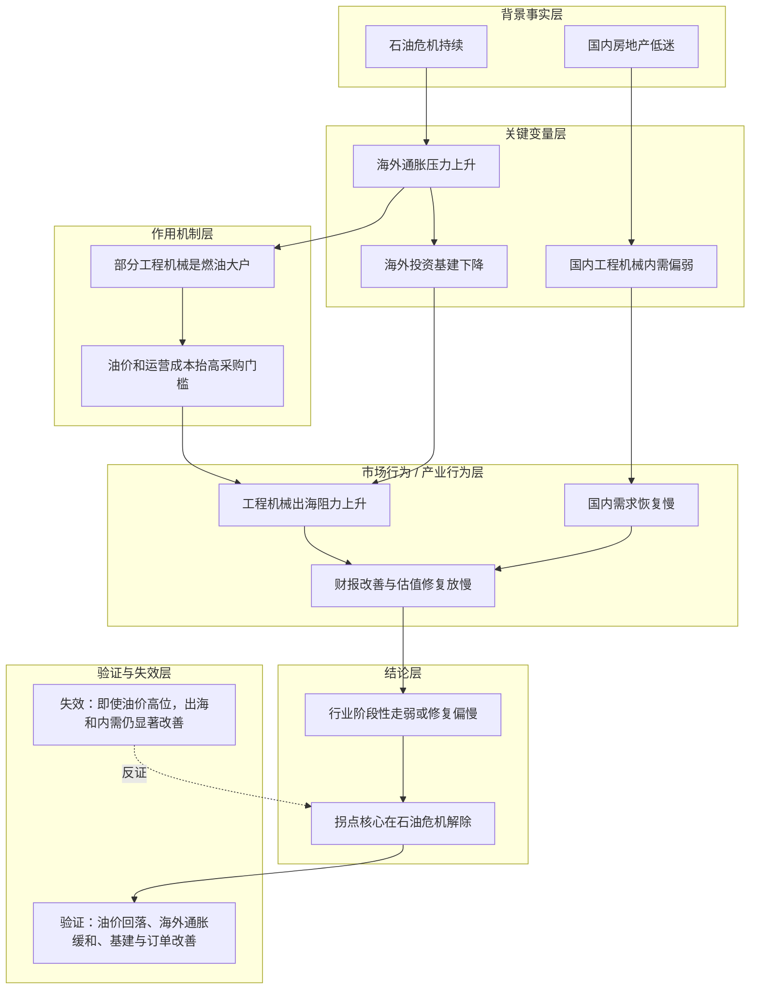

# 工程机械拐点取决于石油危机何时解除

## 核心命题

> 核心命题：作者试图证明「工程机械当前受压不是单一行业问题，而是海外石油危机推高通胀、压低海外基建投资，叠加设备燃油属性带来的出海阻力和国内地产低迷拖累；因此阶段性拐点更取决于石油危机是否解除」。

## 背景事实

- `2026-01-08`：[[people/冰冰小美|冰冰小美]] 在结构性调仓帖里把工程机械列为“没变”的既有配置线。
- `2026-01-19`：她写到工程机械 ETF 在 `2025-12` 已开始建仓，并计划分批低吸，柳工预计在年报后再加仓。
- `2026-01-30`：她把工程机械短期走弱归因为“大宗成本挤压”，并强调要看财报变化、战略布局持续性以及转型、出口兑现节奏。
- `2026-05-23`：用户补充她关于工程机械的因果链摘要，明确提出“石油危机引发海外通胀、压低海外基建投资，部分工程机械是燃油大户而形成出海阻力，国内地产低迷又拖累内需，因此核心在石油危机解除”。

## 关键变量

- 石油危机是否持续
- 海外通胀压力
- 海外投资基建景气
- 工程机械使用成本与出海阻力
- 国内房地产景气
- 工程机械财报改善是否兑现

## 推导链表

| 层级 | 内容 | 推导关系 | 可信度 | 观察指标 |
|---|---|---|---|---|
| 背景事实 | 石油危机抬高海外通胀压力 | 作为推导起点 | 中 | 油价、地缘冲突是否缓和 |
| 背景事实 | 国内房地产低迷 | 作为内需拖累起点 | 中 | 地产销售、新开工、投资景气 |
| 关键变量 | 海外投资基建下降 | 受到海外通胀与不确定性影响 | 中 | 海外基建投资节奏、工程机械外需订单 |
| 作用机制 | 部分工程机械属于燃油大户，使用与运营成本受油价影响 | 解释为何油价冲击会放大出海阻力 | 中 | 海外客户采购意愿、燃油成本变化 |
| 中介环节 | 出海阻力 + 国内地产拖累共同压制行业需求与估值修复 | 连接机制与行业表现 | 中 | 出口数据、国内销量、财报毛利率 |
| 结论 | 工程机械拐点更取决于石油危机何时解除，而不只是单看行业自身努力 | 推导结果 | 中 | 油价回落、海外通胀缓解、行业订单改善 |

## Mermaid 推导图

## 传导机制

### 1. 海外链条：石油危机先通过通胀压制海外基建投资

这条补充判断把工程机械的海外压力起点放在石油危机，而不是单一企业竞争力。其核心意思是：

1. 石油危机推高海外通胀；
2. 通胀环境抑制海外投资基建意愿或节奏；
3. 工程机械外需因此承压。

在这条逻辑里，海外需求走弱首先是宏观环境结果，然后才传导到行业。

### 2. 产品链条：燃油属性放大出海阻力

用户补充特别点出，工程机械里有一部分是燃油大户。这个补充很重要，因为它解释了为什么石油危机不只是抽象的宏观风险，而会更具体地打到行业：

- 油价和燃料成本若居高不下，会提高设备使用和运营成本；
- 对海外客户而言，采购和使用工程机械的经济性会变差；
- 这会进一步放大出海阻力，而不是只停留在“通胀高所以市场差”的泛化解释。

### 3. 国内链条：房地产低迷继续拖后腿

她把国内压力点压回房地产。也就是说，即便不看海外，国内工程机械也没有摆脱传统需求拖累：

- 国内房地产低迷；
- 与地产相关的工程机械需求恢复偏慢；
- 因此国内市场很难单独充当行业强修复的发动机。

这让行业形成双重约束：外面被石油危机和通胀压制，里面被地产低迷拖累。

### 4. 结论链条：关键不是短线情绪，而是石油危机解除

因此，这条推导的真正结论不是“工程机械现在便宜”或“工程机械一定会涨”，而是：

- 若石油危机不解除，海外通胀和基建压力难缓；
- 若国内地产没有明显修复，内需也难形成强托底；
- 所以行业真正的阶段性拐点，更取决于石油危机何时解除。

这条补充也让已有的 [[views/冰冰小美：工程机械低吸慢配并等待兑现的阶段判断|工程机械 view 页面]] 更完整了：原先更偏配置节奏和财报观察，现在补上了更上游的宏观因果链。

## 时间节点

| 日期 | 内容 | 作用 |
|---|---|---|
| 2026-01-08 | 工程机械在组合里“没变” | 说明它是既有中线配置，不是临时题材 |
| 2026-01-19 | 工程机械 ETF 自 2025-12 建仓，柳工拟年报后加仓 | 补充配置节奏与等待财报验证 |
| 2026-01-30 | 月报中写明行业受大宗成本挤压，需看财报、转型和出口 | 提供行业短期受压的直接表述 |
| 2026-05-23 | 用户补充石油危机、海外通胀、出海阻力与地产拖累链条 | 补出更完整的宏观与需求侧推导 |

## 验证信号

- 油价和石油危机是否出现明确缓和迹象。
- 海外通胀是否边际回落。
- 海外投资基建和工程机械外需订单是否改善。
- 工程机械出口数据、海外收入占比或渠道反馈是否改善。
- 国内地产景气和相关工程机械内需是否止跌回稳。
- 行业财报里毛利率、订单和盈利增速是否同步改善。

## 失效条件

- 如果石油危机和油价仍高，但工程机械出海和订单依然明显改善，说明“油价 -> 出海阻力”的链条并不构成主要约束。
- 如果国内地产继续低迷，但行业仍能依靠非地产需求与出口结构升级实现显著修复，说明“地产拖累”不再是核心约束。
- 如果后续材料显示行业改善主要由技术升级、替代逻辑或财政刺激驱动，而非石油危机缓解，则本页结论需要重写。

## 反例与不确定性

- `2026-05-23` 这段补充来自用户摘录，不是完整原帖，原文发布时间与链接待补充。
- “海外通胀 -> 海外基建下降”的中间传导在当前材料里是作者判断，仍需更多原文或数据支撑。
- “部分工程机械是燃油大户”成立，但不同品类受影响程度可能不同，不能无差别外推到全行业。
- 国内地产低迷确实是传统拖累项，但工程机械也可能受基建、更新周期、出海结构变化影响，后续需要更多材料补强。
- 本页沉淀的是推导链，不构成投资建议。

## 相关观点

- [[views/冰冰小美：工程机械低吸慢配并等待兑现的阶段判断|冰冰小美：工程机械低吸慢配并等待兑现的阶段判断]]

## 相关主题

- [[topics/宏观经济|宏观经济]]
- [[topics/概率化决策与风险控制|概率化决策与风险控制]]

## 相关人物

- [[people/冰冰小美|冰冰小美]]

## 相关页面

- [[people/冰冰小美|冰冰小美]]：回到人物页查看这条行业判断在她整体体系中的位置。
- [[views/冰冰小美：工程机械低吸慢配并等待兑现的阶段判断|冰冰小美：工程机械低吸慢配并等待兑现的阶段判断]]：承接“谁怎么看”这一层。
- [[topics/宏观经济|宏观经济]]：承接石油危机、通胀和需求环境的更大背景。
- [[topics/概率化决策与风险控制|概率化决策与风险控制]]：承接为何这条线更适合慢配、等待验证而不是追涨。

## 来源

- [[sources/manual/2026-05-23-冰冰小美-工程机械受石油危机与地产拖累的补充判断|冰冰小美：工程机械受石油危机与地产拖累的补充判断]]
- [[sources/articles/2026-03-25-冰冰小美-2026一季度宏观子帖抓取（已完成41篇）|冰冰小美 - 2026Q1 子帖归档]]
