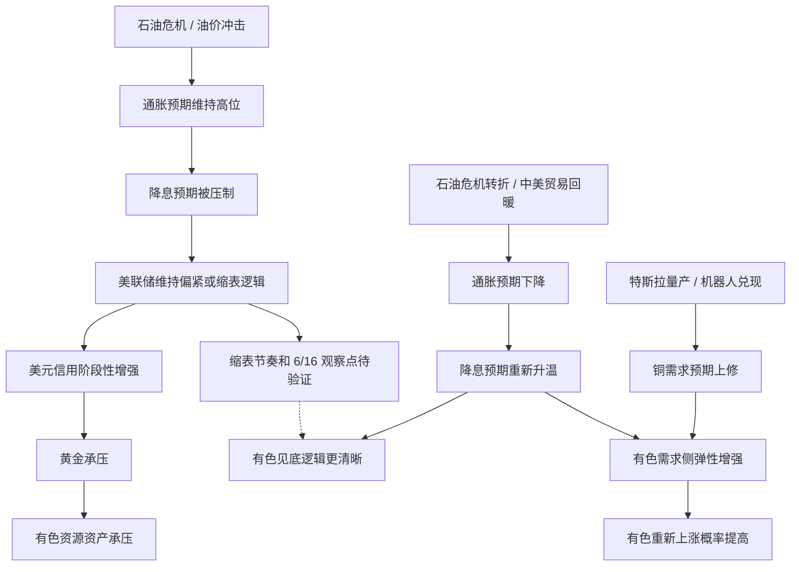
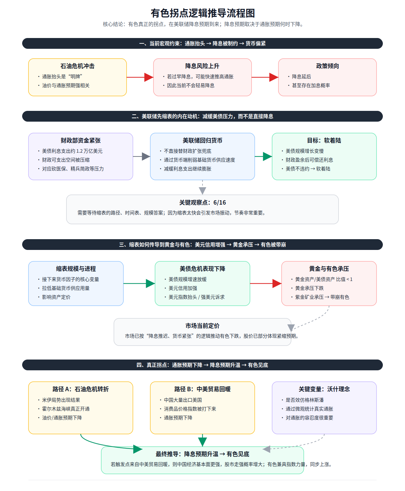

# 有色金属拐点推导

## 核心结论

这条推导认为，有色金属真正的拐点不在于市场已经开始讨论降息，而在于通胀预期何时下降。只有当通胀压力缓和、降息预期重新升温后，有色才更可能从“货币偏紧和黄金承压”的逻辑里走出来；如果这一过程再叠加机器人量产带动的铜需求预期上修，有色更容易从“见底”演化为“重新上涨”。

该判断来自 [[views/冰冰小美：有色拐点取决于通胀预期回落的阶段判断|冰冰小美：有色拐点取决于通胀预期回落的阶段判断]]，来源为用户提供流程图，具体原帖链接待验证。

## 推导前提

- 石油危机会推高或维持通胀预期，油价与通胀预期强相关。
- 通胀预期高企会约束美联储降息，甚至让市场重新考虑加息风险。
- 美债利息支出和财政压力会迫使政策更重视债务可持续性。
- 缩表会降低基础货币供应速度，并可能阶段性强化美元信用。
- 黄金对美元信用、强美元诉求和美债压力变化敏感。
- 有色会被黄金、美元信用、资源资产情绪和指数力量共同影响。
- 机器人量产会影响铜需求预期，进而改变有色内部对需求改善的定价。

## 关键变量

| 变量 | 含义 | 影响 |
|---|---|---|
| 石油危机 | 油价冲击和地缘风险 | 推高通胀预期，压制降息预期 |
| 通胀预期 | 市场对未来物价压力的判断 | 决定降息预期能否升温 |
| 降息预期 | 市场对货币宽松的预期 | 若升温，会改善有色和风险资产环境 |
| 缩表规模与进程 | 美联储减少资产负债表的节奏 | 影响基础货币供应和美元信用 |
| 美债压力 | 利息支出与债务扩张压力 | 影响政策对软着陆和债务稳定的偏好 |
| 黄金承压 | 黄金相对美债或美元信用走弱 | 可能带动有色资源资产承压 |
| 机器人量产 / 铜需求预期 | 机器人产业化是否进入兑现阶段 | 影响铜链条和有色需求侧弹性 |
| 沃什理念 | 图中提到的未来政策风格变量 | 影响对真实通胀和通胀容忍度的判断，待验证 |

## 推导链

1. 石油危机冲击使通胀抬头，油价与通胀预期形成强相关。
2. 通胀预期仍高时，美联储若过早降息，可能再次推高通胀。
3. 因此市场会把政策倾向理解为降息延后，甚至存在加息概率。
4. 财政部资金紧张，美债利息支出扩大，财政可支出空间被压缩。
5. 美联储不直接替财政扩张兜底，而是可能通过缩表减缓基础货币供应。
6. 缩表让美债规模增速放缓，美债危机表现下降，美元信用阶段性增强。
7. 美元信用增强和强美元诉求压制黄金，黄金承压后传导到有色。
8. 市场先按“降息推迟、货币紧张”的逻辑给有色定价，有色下跌部分体现紧缩预期。
9. 只有当石油危机转折、中美贸易回暖，或美国通胀以其他方式下降，降息预期才可能重新升温。
10. 如果通胀下降缓解了“收缩货币危机”的担忧，市场会把货币逻辑从继续收缩切向降息预期。
11. 若 8 月特斯拉量产推动机器人叙事进入兑现阶段，铜需求预期会为有色增加产业侧支撑。
12. 货币端转向降息预期与铜需求上修共振时，有色更容易从见底走向重新上涨。

## Mermaid 推导图

## svg 推导图

## 传导机制

### 1. 石油危机与通胀约束

石油危机通过油价影响通胀预期。若通胀预期没有下降，降息就会被理解为重新刺激通胀，因此政策宽松难以成为稳定预期。

这与 [[views/冰冰小美：短期技术扰动后风险仍锚定美国通胀的阶段判断|冰冰小美：短期技术扰动后风险仍锚定美国通胀的阶段判断]] 相连：风险节奏的关键不在某个日期，而在通胀何时被压制。

### 2. 美联储缩表动机

图中把缩表解释为缓解美债压力的中间路径：财政端资金紧张时，美联储不直接扩张兜底，而是通过货币端削弱基础货币供应速度，以争取美债软着陆。

这一机制属于推测性解释，不能视为已验证事实。真正是否成立，需要看缩表路径、规模和时间表。

### 3. 缩表对黄金与有色的传导

缩表若强化美元信用，会改变黄金与美债之间的相对吸引力。图中进一步认为，黄金承压会通过资源资产情绪和相关权重品种传导到有色。

因此，有色在这条推导里不是单独由供需决定，而是同时受 [[topics/冰冰小美-地缘重估与资源-货币秩序|地缘重估与资源-货币秩序]] 中的美元信用、黄金、美债和资源资产再定价影响。

### 4. 真正拐点的触发条件

真正拐点需要先看到通胀预期下降。图中给出两条路径：

- 石油危机转折：米伊局势出现结果、霍尔木兹海峡真正开通，油价和通胀预期下行。
- 中美贸易回暖：中国大量出口美国，消费品价格指数被压低，通胀预期下降。

若触发点来自中美贸易回暖，图中进一步推测中国经济基本面会更强，股市走强概率增大，有色也会兼具指数力量同步上涨。

用户 2026-05-23 补充的新观点则增加了第三种更偏产业兑现的路径：

- 机器人量产强化：如果 8 月特斯拉量产推动机器人叙事从主题炒作转向产量兑现，市场可能上修铜需求预期。
- 货币逻辑切换：如果同期美国通胀回落，市场对美联储继续收缩的担忧缓解，定价会从“收缩货币危机”转向“降息预期”。

在这个组合里，有色不是只因通胀下行而止跌，而是可能因为“需求侧更强 + 货币侧更松预期”转入重新上涨阶段。

### 5. 机器人与铜需求的加速器作用

新增观点把铜需求放进了这条推导链的后半段。也就是说，通胀回落仍然是货币逻辑松动的必要条件，但如果机器人量产让市场开始交易更具体的铜需求增长，有色内部就会出现比“单纯流动性修复”更强的弹性。

这让推导从“什么时候不跌”进一步延伸到“什么时候能重新涨”：有色重新上涨需要的不只是宏观压力消退，还需要市场相信需求端有新的增长抓手。

[[sources/articles/2025-04-04-冰冰小美：关税对于大宗商品的影响|2025-04-04《关税对于大宗商品的影响》]] 则把这条链条提前到关税冲击阶段：短期金融定价仍会受通胀、债市避险、美元信用和流动性收缩影响；中期若美国制造业回流成功，大宗商品需求和现货价格可能成为新的推动变量。

## 时间节点

| 日期 | 事件 | 影响 |
|---|---|---|
| 2026-05-20 | 用户提供“有色拐点逻辑推导流程图” | 本页据此整理推导链 |
| 2026-05-23 | 用户补充“8月特斯拉量产…那么有色重新上涨” | 为既有推导补入机器人、铜需求与降息预期共振路径 |
| 6/16 | 图中标注为关键观察点 | 等待缩表路径、时间表、规模答案；具体年份和事件来源待验证 |

## 风险触发条件

- 如果缩表路径快于预期，可能引发市场振动，黄金和有色承压可能加剧。
- 如果通胀预期继续上行，降息预期会被进一步推迟，有色见底逻辑延后。
- 如果美元信用继续修复，黄金资产相对美债的吸引力可能下降。
- 如果特斯拉量产不及预期，或机器人主题没有有效传导到铜需求，有色的需求侧支撑会减弱。
- 如果中美贸易回暖压低消费品价格，或石油危机转折压低油价，通胀预期可能下降并推动降息预期回升。

## 反例与不确定性

- 图中没有提供原帖链接、发布时间和完整上下文，观点归属和细节仍需补证。
- 2026-05-23 新补充观点同样缺少原始链接和更完整上下文，只能先按作者短摘录处理。
- 缩表是否一定强化美元信用，取决于缩表规模、节奏、财政配合和市场预期，不能机械外推。
- 黄金承压不一定必然带崩有色，有色还受中国需求、库存、供给约束和产业资本行为影响。
- 机器人量产到铜需求扩张之间存在兑现时滞，不能把主题预期直接写成真实需求。
- `6/16` 的具体政策含义待验证，不能把它写成已确定事件。
- “沃什理念”属于图中提出的政策风格变量，仍需确认其来源和实际政策影响。
- 本页只沉淀推导链，不构成投资建议。

## 相关观点

- [[views/冰冰小美：有色拐点取决于通胀预期回落的阶段判断|冰冰小美：有色拐点取决于通胀预期回落的阶段判断]]
- [[views/冰冰小美：短期技术扰动后风险仍锚定美国通胀的阶段判断|冰冰小美：短期技术扰动后风险仍锚定美国通胀的阶段判断]]
- [[views/冰冰小美：关税推动大宗商品从金融定价切向供需周期的判断框架|关税推动大宗商品从金融定价切向供需周期]]

## 相关主题

- [[topics/冰冰小美-宏观经济|宏观经济]]
- [[topics/冰冰小美-地缘重估与资源-货币秩序|地缘重估与资源-货币秩序]]

## 相关概念

- [[concepts/冰冰小美-汇率、长期利率与流动性|汇率、长期利率与流动性]]

## 相关人物

- [[people/冰冰小美|冰冰小美]]

## 相关页面

- [[people/冰冰小美|冰冰小美]]
- [[views/冰冰小美：有色拐点取决于通胀预期回落的阶段判断|冰冰小美：有色拐点取决于通胀预期回落的阶段判断]]
- [[views/冰冰小美：短期技术扰动后风险仍锚定美国通胀的阶段判断|冰冰小美：短期技术扰动后风险仍锚定美国通胀的阶段判断]]
- [[topics/冰冰小美-宏观经济|宏观经济]]
- [[topics/冰冰小美-地缘重估与资源-货币秩序|地缘重估与资源-货币秩序]]
- [[concepts/冰冰小美-汇率、长期利率与流动性|汇率、长期利率与流动性]]

## 来源

- [[sources/screenshots/2026-05-20-有色拐点逻辑推导流程图|有色拐点逻辑推导流程图]]
- [[sources/assets/有色拐点逻辑推导流程图.svg|有色拐点逻辑推导流程图 SVG]]
- [[sources/manual/2026-05-23-冰冰小美-有色重启上涨触发条件|冰冰小美：有色重启上涨触发条件]]
- [[sources/articles/2025-04-04-冰冰小美：关税对于大宗商品的影响|2025-04-04《关税对于大宗商品的影响》]]
