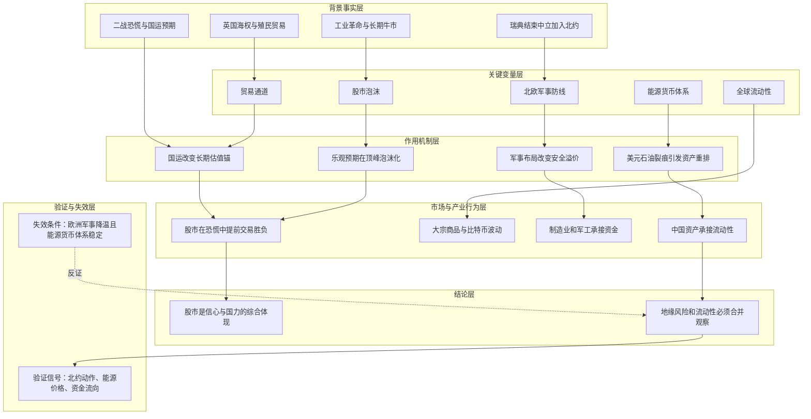

# 冰冰小美-欧洲历史金融与地缘变化如何传导为风险视角

## 核心结论

> 核心命题：作者试图证明「股市涨跌不是孤立的经济晴雨表，而是国运、战争胜负预期、贸易通道、能源体系和流动性争夺共同作用的结果」。

在 [[sources/articles/2022-05-23-冰冰小美：说说不为人知的英国股市|英国股市历史帖]] 中，[[people/冰冰小美|冰冰小美]] 用英国从海权、殖民贸易、工业革命到二战和石油危机的历史，说明金融市场要放回国运阶段中观察。在 [[sources/articles/2024-03-09-冰冰小美：瑞典脱离中立加入北约|瑞典加入北约帖]] 中，她又把北欧军事布局、波罗的海、圣彼得堡、中美博弈、AI 和美元石油体系放到同一张风险图里。

两篇合在一起，形成一条“欧洲历史金融与地缘变化”的风险观察线：股市风险不是单个价格波动，而是贸易通道、战争格局、能源货币体系和流动性承接能力的综合变化。

## 推导前提

- 前提一：英国股市与工业革命、殖民扩张、海上贸易权和金本位等长期变量相关。
- 前提二：作者认为工业革命和殖民贸易带来牛市乐观，但牛市顶峰也会形成泡沫。
- 前提三：二战最恐慌阶段，英国股市反而可能因为同盟国胜利预期和国运判断见底或上涨。
- 前提四：瑞典结束长期中立加入北约，被作者视为北欧和波罗的海军事结构改变。
- 前提五：美元石油体系、比特币蓄水池、AI 金融叙事和大宗商品波动，会共同影响全球流动性争夺。

## 关键变量

| 变量 | 含义 | 影响 |
|---|---|---|
| 海权与贸易通道 | 英国扩张和全球贸易秩序的基础 | 决定金融中心、贸易收益和股市长期国运定价 |
| 股市泡沫 | 牛市乐观在价格中的过度集中 | 提醒乐观逻辑正确也可能在顶峰泡沫化 |
| 战争胜负预期 | 市场对国家未来国运的判断 | 可使股市在表面恐慌中提前反转 |
| 北约防线 | 从芬兰、瑞典到东欧、地中海的军事布局 | 改变欧洲安全结构和俄罗斯后方压力 |
| 波罗的海与圣彼得堡 | 瑞典加入北约后作者强调的地缘支点 | 影响俄罗斯政治经济支点与乌克兰战场侧翼 |
| 全球流动性争夺 | AI、比特币、美元石油、大宗商品和人民币资产之间的资金分流 | 决定地缘风险是否传导为资产价格波动 |

## 推导链

| 层级 | 内容 | 推导关系 | 可信度 | 观察指标 |
|---|---|---|---|---|
| 背景事实 | 英国历史中海权、殖民贸易、工业革命与股市长期表现交织 | 作为作者理解金融市场的历史起点 | 中 | 海权、贸易通道、金融中心地位 |
| 关键变量 | 国运阶段、战争胜负预期、能源货币体系和军事防线变化 | 决定风险资产是恐慌下跌还是提前定价未来 | 中 | 战争进程、能源价格、金融市场承接 |
| 作用机制 | 地缘结构改变资金对安全资产、制造业和战略资源的偏好 | 解释地缘事件如何传导为流动性争夺 | 中 | 大宗商品、美元指数、人民币资产、AI 权重股 |
| 中介环节 | 瑞典加入北约、波罗的海封锁压力、AI 与比特币资金池波动 | 连接欧洲地缘与全球风险资产 | 中 | 北约演习、俄罗斯反应、比特币和纳指波动 |
| 结论 | 欧洲金融史和当代地缘风险必须合并观察 | 推导为宏观风险节点与仓位风控框架 | 中 | 风险节点、流动性方向、指数信心 |

## Mermaid 推导图

## 传导机制

这条推导有两层：

1. 历史层：英国股市不是单纯由当年盈利决定，而是被海权、工业革命、殖民贸易、战争胜负预期和国家地位共同塑造。作者据此强调“投资就是投国运”。
2. 当代层：瑞典加入北约改变北欧与波罗的海安全结构，地缘压力又与美元石油体系、AI 金融叙事、比特币蓄水池和中国资产承接能力相互影响。

因此，当市场看到欧洲地缘事件时，不能只问“战争利空还是利好”，而要继续追问：这是否改变贸易通道、能源锚、军事防线、制造业承接和全球热钱去向。

## 时间节点

| 日期 | 事件 | 影响 |
|---|---|---|
| 1757 年 | 作者回顾英国开始侵占印度 | 作为英国全球贸易扩张起点之一 |
| 1805 年 | 特拉法尔加海战 | 作者用于说明英国海权与贸易权 |
| 1825 年 | 英国股市牛市与泡沫股灾 | 作者将其作为金融市场泡沫案例 |
| 1840 年 | 鸦片战争及全球贸易扩张 | 作者放入英国贸易体系扩张线 |
| 1901 年 | 作者称日不落帝国衰败 | 作为英国国运阶段变化节点 |
| 1940 年 | 敦刻尔克大撤退、丘吉尔上台、股市低点 | 作者用于说明恐慌与国运预期的错位 |
| 1970 年 | 北海油田开始采油 | 连接英国能源与经济结构 |
| 1973 年 | 中东石油危机 | 连接能源冲击和全球风险 |
| 1997 年 | 中国收回香港 | 作者放入英国帝国余波与中国国运变化 |
| 2024-03-09 | 瑞典加入北约 | 作者视为战争形态扩大化和流动性争夺节点 |

## 风险触发条件

- 北约在北欧、波罗的海或东欧方向持续加强军事部署。
- 俄罗斯针对圣彼得堡、波罗的海或乌克兰侧翼压力作出强反应。
- 石油美元体系裂痕扩大，叠加石油减产、战争消耗或页岩油压力。
- 比特币、纳指或 AI 权重股承接的美元流动性快速外泄。
- 中国资产承接全球流动性时，指数信心和制造业实力无法同步提升。

## 反例与不确定性

- 英国历史中的股市表现和当代欧洲地缘事件并非同一结构，不能直接机械类比。
- 作者对地缘军事布局的判断属于宏观推演，存在信息不完整与方向误判风险。
- 若北约与俄罗斯冲突降温，瑞典入约的风险权重需要下调。
- 若 AI 能快速带动生产率提高并稳定美元资产，美元石油裂痕对风险资产的冲击可能弱于作者担忧。

## 相关观点

- [[views/冰冰小美：国运支撑A股与制造业突围的判断框架|国运支撑 A 股与制造业突围]]：承接作者“股市是信心与国力综合体现”的判断。
- [[views/冰冰小美：AI泡沫需要用制约因素与周期视角观察的判断框架|AI泡沫需要用制约因素与周期视角观察]]：补充 AI 金融叙事与生产率验证。

## 相关事件

- 暂无单独事件页；瑞典加入北约后续若继续扩展，可拆为事件页或时间线节点。

## 相关时间线

- [[timelines/冰冰小美-风险节点记录|风险节点记录]]：承接地缘风险、流动性动荡和石油危机节点。

## 相关概念

- [[冰冰小美-宏观信号表|宏观风险信号表]]：用于收纳军事、能源、美元、比特币和 AI 权重股等风险信号。
- [[concepts/冰冰小美-concept-流动性辩证分析|流动性辩证分析]]：解释为什么地缘风险最终仍要看资金承接和交易意愿。
- [[concepts/冰冰小美-concept-风险类型整理|风险类型整理]]：可将地缘、能源、流动性和泡沫风险归类。

## 相关人物

- [[people/冰冰小美|冰冰小美]]：本推导来源作者。

## 相关页面

- [[topics/冰冰小美-地缘重估与资源-货币秩序|地缘重估与资源-货币秩序]]：承接欧洲地缘、能源货币和资源秩序重排。
- [[topics/冰冰小美-宏观风险关键词文章整理清单|宏观风险关键词文章整理清单]]：记录本批风险相关文章逐篇整理状态。

## 来源

- [[sources/articles/2022-05-23-冰冰小美：说说不为人知的英国股市|2022-05-23 说说不为人知的英国股市]]
- [[sources/articles/2024-03-09-冰冰小美：瑞典脱离中立加入北约|2024-03-09 瑞典脱离中立加入北约]]
