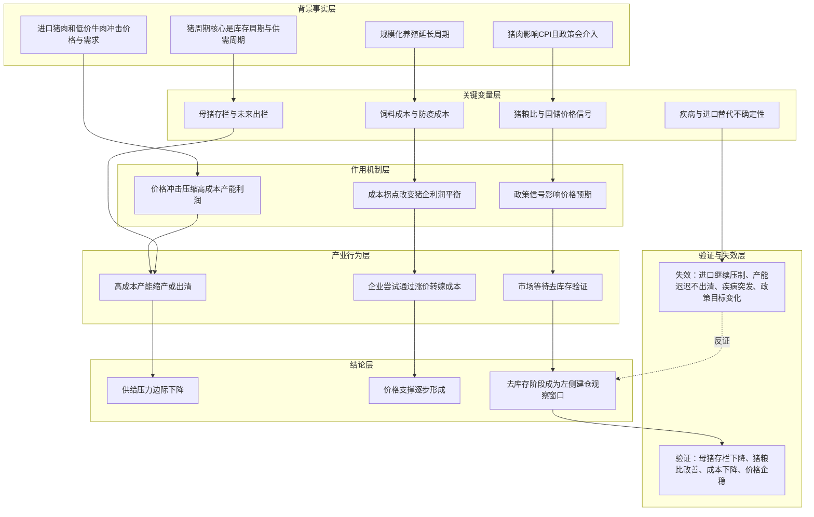

# 冰冰小美-猪周期如何从去库存传导为建仓窗口

## 核心结论

核心命题：作者试图证明「猪周期的投资节点往往不在单纯价格下跌时，而在产能过剩进入去库存、价格支撑开始形成、行业风险释放后的阶段」。

这条推导的结论是：如果西班牙猪肉进口、低价牛肉替代、饲料成本和政策调控共同压低猪肉股预期，但这些压力又推动高成本产能出清，那么下跌本身可能成为左侧建仓的观察窗口。

## 推导前提

- 猪周期仍然由库存周期和供需周期主导。
- 猪肉关乎民生，政策和 CPI 目标会影响猪价调控。
- 规模化养殖延长周期，也让成本控制成为猪企竞争核心。
- 进口猪肉和低价牛肉短期冲击国内价格与消费结构。
- 高成本产能在价格压力下更容易被迫出清。

## 关键变量

| 变量 | 含义 | 影响 |
|---|---|---|
| 母猪存栏 | 未来出栏量的前置供给指标 | 存栏向规划目标收敛，有利于未来供给压力下降 |
| 猪粮比 | 政策收储观察指标 | 低于阈值可能触发收储信号，影响价格预期 |
| 饲料成本 | 玉米、豆粕等投入成本 | 成本下降改善利润，成本上升推动猪企提价诉求 |
| 进口猪肉 | 西班牙等低价猪肉供应 | 短期压制国内价格，长期可能加速高成本产能出清 |
| 低价牛肉替代 | 阿根廷牛肉等肉类替代 | 压制猪肉消费需求，延长猪周期 |
| 疾病风险 | 猪瘟等突发供给扰动 | 可能突然改变供给，不适合稳定预测 |
| CPI 目标 | 政策调控背景 | 决定政策是否更倾向稳定或提振猪价 |

## 推导链

| 层级 | 内容 | 推导关系 | 可信度 | 观察指标 |
|---|---|---|---|---|
| 背景事实 | 作者认为猪周期核心是库存周期与供需周期，且当前周期被规模化养殖拉长 | 作为推导起点 | 中 | 周期长度、存栏、出栏、价格走势 |
| 背景事实 | 进口猪肉和低价牛肉冲击国内猪肉价格与需求 | 加剧行业压力 | 中 | 进口量、进口价格、国内猪价、牛肉价格 |
| 关键变量 | 饲料成本和防疫成本决定猪企成本曲线 | 影响谁能熬过低价阶段 | 中 | 豆粕、玉米价格，企业单位成本 |
| 关键变量 | 母猪存栏高于规划目标，未来规划目标更低 | 暗示供给侧存在收缩方向 | 中低 | 能繁母猪存栏、政策规划、去化速度 |
| 作用机制 | 低价进口和低猪价压缩高成本猪企利润 | 高成本主体更容易退出或缩产 | 中 | 亏损面、资产负债、出栏计划 |
| 作用机制 | 产能出清减少未来供给压力 | 供需从过剩逐步走向平衡 | 中 | 母猪存栏、猪企出栏、行业亏损周期 |
| 中介环节 | 猪粮比和国储动作释放价格信号 | 改善价格预期，但不直接改变全部供需 | 中 | 猪粮比、收储公告、冻肉库存 |
| 结论 | 去库存阶段比单纯下跌更接近周期投资节点 | 作者将环境冲击下跌视作希望看到的建仓节点 | 中低 | 价格止跌、产能去化、成本拐点、政策信号 |

## Mermaid 推导图

## 传导机制

### 1. 价格冲击不是直接利空结束，而是出清压力

西班牙猪肉进口价格较低，会压制国内猪价和猪肉股情绪。但作者的推导不是停在“进口利空”，而是继续看低价冲击是否会把高成本养殖主体逼到出清边缘。

### 2. 成本曲线决定出清顺序

规模化养殖强化薄利多销，低成本企业更容易熬过低价阶段；高成本企业在猪价、饲料和防疫成本共同压力下更容易收缩产能。由此，成本控制成为判断谁能穿越猪周期的重要变量。

### 3. 政策信号影响价格预期

猪肉影响 CPI，因此猪粮比、国储和母猪产能规划不是孤立政策变量。作者认为国储更像释放价格信号，而不一定直接改变供需总量。

### 4. 消费替代会延长周期

低价牛肉进口会对猪肉消费形成替代，可能让去库存更慢，也会提高猪周期投资难度。这个变量让周期判断不能只盯猪肉本身。

## 时间节点

| 日期 | 事件 | 影响 |
|---|---|---|
| 2025-04-19 | 冰冰小美发布《猪周期分析框架》 | 形成猪周期变量框架和“去库存阶段是投资节点”的判断 |
| 2025-04 | 作者提到放开西班牙猪肉进口 | 作为短期价格冲击和供给侧压力变量 |
| 2025 一季度 | 作者提到 CPI 不及预期 | 作为政策可能关注猪价和 CPI 提振的背景 |

## 风险触发条件

- 母猪存栏继续高于规划目标，去库存迟迟不发生。
- 豆粕或玉米成本上升过快，利润修复弱于价格支撑。
- 进口低价猪肉或牛肉继续扩大，消费替代压制需求。
- 国储信号弱于预期，或政策目标转为压低食品价格。
- 猪瘟等疾病扰动导致供给和价格进入非线性波动。

## 反例与不确定性

- 原文中的价格、成本、CPI 权重、母猪存栏和猪粮比数据均未在本次整理中独立核验。
- 地方扶持、融资续命或企业现金流安排可能延缓高成本产能出清。
- 若居民消费偏好、进口牛肉价格和肉类供给结构发生变化，猪周期的传统变量权重可能继续变化。
- 本推导记录作者当时的投资框架，不构成对生猪、猪肉股或相关公司的投资建议。

## 相关观点

- [[views/冰冰小美：猪周期去库存阶段提供左侧建仓窗口的判断框架|冰冰小美：猪周期去库存阶段提供左侧建仓窗口的判断框架]]：本推导支撑的阶段性观点。
- [[views/冰冰小美：行情不等于风险的判断框架|冰冰小美：行情不等于风险的判断框架]]：同样强调行情或价格变化不能直接等同于风险降低。
- [[views/冰冰小美：交易风控先看风险与国运的判断框架|冰冰小美：交易风控先看风险与国运的判断框架]]：提供风险在前、机遇在后的上位方法。

## 相关事件

- 暂无独立事件页。原文提到的西班牙猪肉进口、阿根廷牛肉进口和市场监管整治均暂作为来源中的背景信息保留，后续资料增厚后再考虑单独建 Event Page。

## 相关时间线

- 暂无独立时间线页。若后续继续整理猪周期跟踪资料，可建立猪周期阶段时间线。

## 相关概念

- [[concepts/冰冰小美-猪周期分析框架|冰冰小美-猪周期分析框架]]：本推导依赖的变量框架。
- [[concepts/产业思维|产业思维]]：提供从产业链、成本、约束和企业能力拆行业的上位方法。
- [[concepts/冰冰小美-风险转弱节点框架|风险转弱节点框架]]：提供从风险释放到买入窗口的通用语言。

## 相关人物

- [[people/冰冰小美|冰冰小美]]：该推导的观点来源。

## 相关页面

- [[topics/宏观经济|宏观经济]]：猪肉价格与 CPI、进口、政策调控相关。
- [[topics/概率化决策与风险控制|概率化决策与风险控制]]：该推导体现周期行业左侧建仓前的风险检查。

## 来源

- [[sources/articles/2025-04-19-冰冰小美：猪周期分析框架|冰冰小美：猪周期分析框架]]
