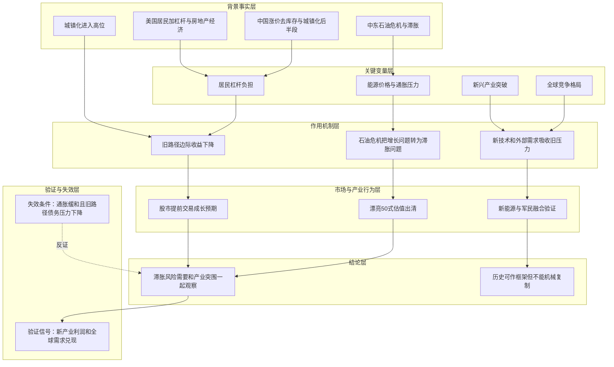

# 冰冰小美-美国历史路径如何传导为滞胀与新兴产业突围

## 核心结论

> 核心命题：作者试图证明「旧增长路径在城镇化后半段会积累债务和通胀压力，石油危机与滞胀会逼迫国家寻找新兴产业和外部竞争格局的突围路径」。

在 [[sources/articles/2022-05-17-冰冰小美：基于美国经济发展路径设想我国路径|2022-05-17 美国经济路径帖]]、[[sources/articles/2022-10-03-冰冰小美：推荐书目1|2022-10-03 推荐书目帖]] 和 [[sources/articles/2025-09-18-冰冰小美：滞胀期确认并持续十年|2025-09-18 滞胀帖]] 中，[[people/冰冰小美|冰冰小美]] 用美国 60-80 年代的居民加杠杆、石油危机、产业转移和科技企业崛起，类比中国在城镇化后半段面临的债务约束、通胀风险与产业突围问题。

这里的重点不是“历史必然重演”，而是把[[concepts/冰冰小美-债务、分配与增长约束|债务、分配与增长约束]]、[[concepts/冰冰小美-通胀对股市的非线性影响|通胀]]、新技术革命和全球竞争格局放在同一张图里观察。

## 推导前提

- 前提一：美国 60-70 年代通过居民加杠杆和房地产经济提振增长，城镇化率进入高位后增长负担加重。
- 前提二：中东石油危机使美国进入滞胀压力区，迫使其寻找更大的需求市场和新技术产业支点。
- 前提三：作者把 PC、苹果、微软、谷歌等科技企业崛起，理解为美国转型成功的一部分。
- 前提四：中国 2016 年涨价去库存也被作者理解为居民加杠杆路径，当前城镇化率进入 60%-65% 后，同样需要观察旧路径负担。
- 前提五：新能源革命、北斗、军民融合和全球新需求增长点，是作者用来观察中国是否跨越中等收入陷阱的变量。

## 关键变量

| 变量 | 含义 | 影响 |
|---|---|---|
| 居民加杠杆 | 通过房地产和信用扩张提前释放需求 | 短期拉动增长，后期形成债务与消费压力 |
| 城镇化率 | 旧增长路径的推进程度 | 高位后边际收益下降，经济负担增加 |
| 石油危机 | 能源供给冲击和通胀压力的集中表现 | 将增长问题转化为滞胀和政策两难 |
| 新兴产业突破 | PC、互联网、新能源、北斗、军民融合等 | 决定旧路径压力能否被新动能吸收 |
| 全球竞争格局 | 他国产业转移、竞争对手衰落或新需求出现 | 影响技术突破能否变成国家级增长空间 |
| 泡沫与漂亮50 | 乐观预期在股市中的集中定价 | 提醒新技术革命也可能伴随高估值出清 |

## 推导链

| 层级 | 内容 | 推导关系 | 可信度 | 观察指标 |
|---|---|---|---|---|
| 背景事实 | 美国曾经历居民加杠杆、房地产经济、石油危机和滞胀 | 作为作者类比中国路径的历史起点 | 中 | 城镇化率、居民杠杆、能源价格、通胀数据 |
| 关键变量 | 旧增长路径负担加重，新兴产业是否形成突破 | 决定滞胀压力能否转化为产业升级压力 | 中 | 新能源、军民融合、科技企业盈利兑现 |
| 作用机制 | 能源冲击压缩旧经济，政策和资本寻找新需求与新技术 | 解释危机如何逼出产业重构 | 中 | 产业资本开支、政策方向、全球需求变化 |
| 中介环节 | 股市会提前交易成长预期，也会出现漂亮50式估值出清 | 连接宏观路径与市场风险 | 中 | 成长股估值、融资拥挤、业绩兑现速度 |
| 结论 | 中国需要在旧路径负担、滞胀风险和新兴产业突围之间同时观察 | 推导为风险识别和仓位控制框架 | 中 | 通胀容忍度、能源价格、新产业利润率 |

## Mermaid 推导图

## 传导机制

作者的核心传导机制是：

1. 居民加杠杆和房地产经济可以在早期拉动需求，但城镇化进入高位后，债务与消费负担会上升。
2. 能源冲击会把旧增长路径的压力显性化，形成[[concepts/冰冰小美-通胀对股市的非线性影响|通胀]]、滞胀和政策两难。
3. 国家若要摆脱旧路径压力，需要找到更大的需求市场、产业转移机会或新技术革命。
4. 资本市场会提前定价这种突围愿景，但如果业绩兑现跟不上，成长股也可能经历泡沫式出清。
5. 因此，风险判断不能只看宏观压力，也要看新产业能否真正提供生产力提升和全球需求。

## 时间节点

| 日期 | 事件 | 影响 |
|---|---|---|
| 1960-1970 年代 | 作者回顾美国居民加杠杆和房地产经济拉动增长 | 作为旧增长路径的历史参照 |
| 1973 年 | 中东石油危机 | 作者将其视为美国滞胀十年的核心事件之一 |
| 1978 年 | 中美建交 | 作者视为美国寻找更大需求市场的节点 |
| 1983 年 | 作者原文写作“83 年广场协议” | 该日期与通常历史记载的 1985 年存在差异，作为作者原文表述保留并标注待验证 |
| 1984 年 | 中国百万裁军、改革开放继续推进 | 作者放入中国长期路径参照 |
| 1991 年 | 苏联解体 | 作者放入全球竞争格局变化背景 |
| 2016 年 | 涨价去库存 | 作者理解为居民加杠杆路径 |
| 2025-09-18 | 滞胀帖提到“滞胀期确认并持续十年” | 将中东石油危机和长期滞胀重新连接 |

## 风险触发条件

- 石油或能源冲击反复，推升输入性通胀和成本压力。
- 居民杠杆继续上升，但消费和收入改善不足。
- 新能源、军民融合、北斗等新动能无法形成足够生产力提升。
- 成长股估值提前透支，但业绩和现金流验证不足。
- 全球竞争格局中，新的需求增长点不足，或竞争对手没有发生可利用的结构性衰落。

## 反例与不确定性

- 美国历史路径只是一种参照，不等于中国路径会按同样顺序展开。
- 作者关于部分历史时间点的表述需要保留“原文观点 / 待验证”边界，不能直接写成外部史实。
- 新技术革命是否能赢，作者本人也强调并非每次都成功。
- 若能源冲击缓和、通胀回落、居民收入改善，滞胀框架需要下调权重。

## 相关观点

- [[views/冰冰小美：AI泡沫需要用制约因素与周期视角观察的判断框架|AI泡沫需要用制约因素与周期视角观察]]：同样关注新技术乐观预期与制约因素。
- [[views/冰冰小美：国运支撑A股与制造业突围的判断框架|国运支撑 A 股与制造业突围]]：承接“突围”落到中国制造和产业竞争。

## 相关事件

- 暂无单独事件页；后续若拆分中东石油危机或中国涨价去库存，可在此回链。

## 相关时间线

- [[timelines/冰冰小美-风险节点记录|风险节点记录]]：用于承接石油危机、滞胀和宏观风险节点。

## 相关概念

- [[concepts/冰冰小美-债务、分配与增长约束|债务、分配与增长约束]]：解释旧增长路径为何到后半段会受约束。
- [[concepts/冰冰小美-通胀对股市的非线性影响|通胀对股市的非线性影响]]：解释通胀不同阶段对股市的影响不同。
- [[concepts/冰冰小美-宏观风险信号表|宏观风险信号表]]：可将石油、通胀和美元信号接入风控检查。

## 相关人物

- [[people/冰冰小美|冰冰小美]]：本推导来源作者。

## 相关页面

- [[topics/冰冰小美-宏观经济|冰冰小美-宏观经济]]：承接宏观路径与经济阶段判断。
- [[topics/冰冰小美-宏观风险关键词文章整理清单|宏观风险关键词文章整理清单]]：记录本批风险相关文章逐篇整理状态。

## 来源

- [[sources/articles/2022-05-17-冰冰小美：基于美国经济发展路径设想我国路径|2022-05-17 基于美国经济发展路径设想我国路径]]
- [[sources/articles/2022-10-03-冰冰小美：推荐书目1|2022-10-03 推荐书目1]]
- [[sources/articles/2025-09-18-冰冰小美：滞胀期确认并持续十年|2025-09-18 滞胀期确认并持续十年]]
