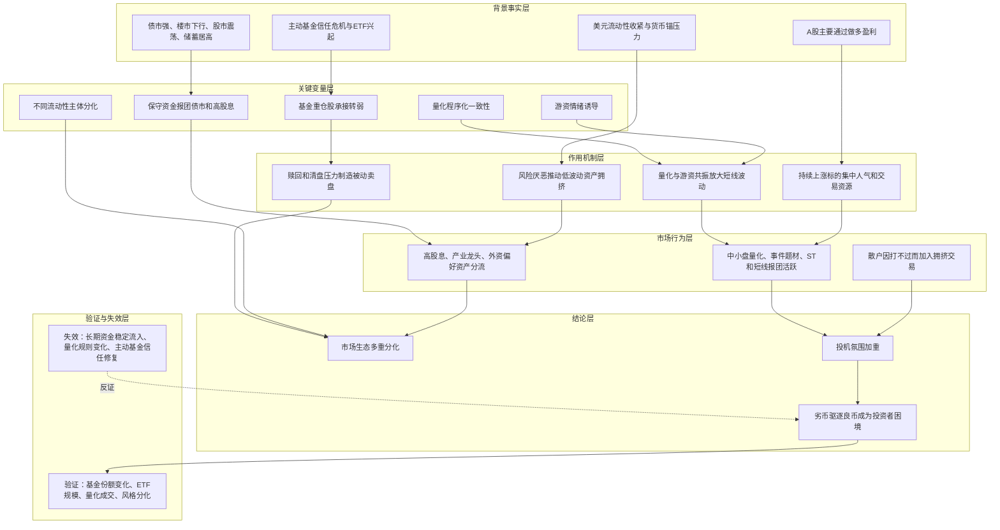

---
title: "冰冰小美-股市投资者困境如何由流动性主体分化与量化报团形成"
aliases:
  - "股市投资者困境推导"
created: 2026-05-28
updated: 2026-05-28
type: reasoning
status: active
tags:
  - "macro/liquidity"
  - "market-structure/a-share"
  - "strategy/risk-control"
sources:
  - "[[sources/articles/2025-05-17-冰冰小美：股市投资者的困境|冰冰小美：股市投资者的困境]]"
related:
  - "[[people/冰冰小美|冰冰小美]]"
  - "[[concepts/冰冰小美-流动性辩证分析|冰冰小美-流动性辩证分析]]"
  - "[[views/冰冰小美：极致报团与投机分化构成股市投资者困境的判断框架|冰冰小美：极致报团与投机分化构成股市投资者困境的判断框架]]"
  - "[[topics/冰冰小美-宏观经济|宏观经济]]"
  - "[[topics/概率化决策与风险控制|概率化决策与风险控制]]"
summary: "本页拆解冰冰小美如何把宏观不确定性、基金供给过剩、量化与游资共振、A股做多结构和流动性主体分化连接为股市投资者困境。"
conclusion: "股市投资者困境来自多类资金主体分化后的生态错配：保守资金、基金、量化、游资、外资、产业资本和散户各自拥挤在不同方向，最终强化报团、投机和短线波动。"
premises:
  - "国内债市、楼市、股市和储蓄状态分化。"
  - "主动基金存在供给过剩、赎回和 ETF 替代压力。"
  - "量化交易与游资互动改变短线生态。"
  - "A 股只能做多盈利的结构强化上涨方向的资源集中。"
key_variables:
  - "宏观不确定性"
  - "保守资金报团"
  - "基金供给过剩"
  - "ETF 替代"
  - "量化程序化一致性"
  - "游资诱导"
  - "流动性主体分化"
confidence: "medium-low"
provenance:
  - "extracted: 0.7"
  - "inferred: 0.22"
  - "ambiguous: 0.08"
base_confidence: 0.35
lifecycle: draft
lifecycle_changed: 2026-05-28
tier: supporting
---

# 冰冰小美-股市投资者困境如何由流动性主体分化与量化报团形成

## 核心结论

核心命题：作者试图证明「当前股市投资者困境并非来自单一行情不佳，而是由宏观不确定性、资金主体分化、基金业结构压力、量化与游资共振共同塑造的市场生态」。

这条推导的结论是：当不同资金主体分别拥挤在高股息、债市、产业龙头、外资偏好资产、中小盘量化、事件题材、对冲工具、ST 和短线报团方向时，普通投资者面对的不是单纯择股问题，而是是否看懂自己进入了哪一种交易生态的问题。

## 推导前提

- 国内债市偏强、楼市下行、股市震荡、储蓄居高，资金选择被分成不同风险偏好。
- 全球美元流动性收紧和国内改革期不确定性，让部分大资金更保守。
- 主动基金扩张后面临供给过剩、赎回压力和 ETF 替代。
- 量化交易通过程序化一致性和大数据反馈影响短线波动。
- 游资追求情绪反复和流动性溢价，会利用量化触发机制强化短线极端。
- A 股主要依赖做多盈利，持续上涨标的更容易集中交易资源和流动性。

## 关键变量

| 变量 | 含义 | 影响 |
|---|---|---|
| 宏观不确定性 | 全球局势、美元流动性、国内改革和货币锚压力 | 推动保守资金转向债市、高股息和保险方向 |
| 基金供给过剩 | 公募基金数量和规模扩张后缺少持续买方 | 让基金重仓股从溢价来源变成潜在卖压来源 |
| ETF 替代 | 被动产品兴起与主动基金信任危机 | 改变资金承接方式，削弱主动基金生态 |
| 量化程序化一致性 | 量化对故事、事实、数据和历史样本的同步反应 | 放大同向交易、恐惧贪婪和短线波动 |
| 游资诱导 | 游资通过情绪引导争取流动性溢价 | 触发量化极致，改变短线生态 |
| 做多盈利结构 | A 股主要通过上涨获利 | 强化人气、资源和流动性向持续上涨标的集中 |
| 流动性主体分化 | 保险、产业资本、外资、量化、游资、散户、庄资等偏好不同 | 造成市场不再是一个统一风格，而是多个拥挤方向并存 |

## 推导链

| 层级 | 内容 | 推导关系 | 可信度 | 观察指标 |
|---|---|---|---|---|
| 背景事实 | 作者判断国内债市强、楼市下行、股市震荡、储蓄居高 | 作为资金分流的起点 | 中低 | 债券收益、房价、股指波动、居民存款 |
| 背景事实 | 全球美元流动性收紧和货币锚压力提高风险厌恶 | 强化保守资金偏好 | 中低 | 美元指数、美债利率、黄金储备、汇率 |
| 关键变量 | 险资和稳健资金报团债市、高股息、银行、保险 | 形成低风险偏好拥挤 | 中 | 高股息估值、险资配置、债市资金 |
| 关键变量 | 主动基金供给过剩、赎回和 ETF 替代 | 让基金重仓股承接变弱 | 中低 | 主动基金份额、ETF 规模、清盘数量 |
| 作用机制 | 基金组合回撤和份额减少迫使卖出优质持仓 | 质量不差的个股也可能成为卖压 | 中低 | 基金持仓、赎回、清盘公告 |
| 作用机制 | 量化交易提高成交活跃度并放大程序化一致性 | 恐惧与贪婪更容易被同步触发 | 中低 | 成交额、量化成交占比、波动率 |
| 中介环节 | 游资诱导短线情绪并触发量化极端 | 短线生态从情绪博弈变成情绪与算法共振 | 中低 | 涨停结构、老妖股活跃、题材扩散 |
| 中介环节 | 做多盈利结构让上涨标的人气和资源继续集中 | 报团上涨被强化，下跌阶段缺少对称承接 | 中 | 连续上涨个股、成交集中度、抱团风格 |
| 结论 | 各类资金主体进入不同拥挤方向，投机氛围加重 | 形成作者所说的投资者困境 | 中低 | 风格分化、成交结构、散户参与、ST/小盘活跃 |

## Mermaid 推导图

## 传导机制

### 1. 宏观不确定性把部分资金推向保守报团

作者先把投资者分成债市、楼市、股市和储蓄几类，再把国内环境概括为债市强、楼市弱、股市震荡、储蓄高。这让稳健资金更容易转向债市、高股息、银行和保险方向。这里的关键不是“这些方向一定好”，而是它们在不确定环境中满足了保守资金的风险偏好。

### 2. 基金生态从溢价来源变成卖压来源

作者认为主动基金在扩张后出现供给过剩，叠加赎回、被动 ETF 兴起和信任危机，使基金重仓股不再天然享有溢价。即使持仓个股质地较好，也可能因为基金组合其他持仓崩溃、总体业绩下降、份额减少或清盘压力而被迫卖出。

### 3. 量化与游资让短线生态更程序化也更极端

量化交易在作者眼中一方面提高成交活跃度，另一方面放大恐惧、贪婪和羊群效应。游资则通过诱导情绪反复争取流动性溢价；当游资行为触发量化模型，短线生态会从单纯的人性博弈变成“人性 + 程序化一致性”的共振。

### 4. 做多结构强化报团上涨

作者认为 A 股主要靠做多盈利，因此持续上涨标的会自然聚集人气、交易资源和流动性。流动性有利的节点更容易制造妖股和极致报团；但当假象破灭时，普通投资者如果只是加入炒作，容易成为波动承接者。

### 5. 流动性主体分化造成多重生态错配

作者最后把市场拆成多个主体：险资偏高股息，产业资本偏产业巨头和龙头，外资偏国际品牌和透明财报，量化偏中小盘，游资偏事件情绪，金融资本偏对冲工具，散户加入报团，庄资扎堆 ST。这个拆法把投资者困境从“看错方向”推进为“进入了不适合自己的生态”。

## 时间节点

| 日期 | 事件 | 影响 |
|---|---|---|
| 2025-05-17 | 冰冰小美发布《股市投资者的困境》 | 形成股市生态分化、量化报团和投机困境判断 |
| 2024-09-24 | 作者提到 `924` 流动性有利节点 | 作为宏观与中观流动性同步有利时妖股出现的案例，具体事件细节待验证 |
| 2025 年初至 2025-05-17 | 作者称持续推荐 HETF 风格 | 作为她对金融国际化和资产配置风格的阶段判断，产品与收益表现待验证 |

## 风险触发条件

- 主动基金继续赎回、清盘或失去新增买方，基金重仓股卖压继续扩大。
- 量化成交占比和同向交易加强，短线波动继续放大。
- 游资利用量化触发机制反复制造极端情绪。
- 宏观流动性节点再次出现，投机报团被重新强化。
- 散户因“打不过就加入”进入不匹配自身能力的短线生态。

## 反例与不确定性

- 原文中关于基金数量、基金供给过剩、量化影响、险资迁移、HETF 推荐和个股案例的事实细节未在本次整理中独立核验。
- 量化交易并非单一主体，本文记录的是作者对量化参与短线生态影响的判断，不能泛化为所有量化策略。
- ETF 承接可能既带来价值风格机会，也可能带来新的拥挤交易，后续需要结合产品结构和资金流向判断。
- 若监管规则、交易制度、量化约束或长期资金入市机制发生变化，该推导的部分环节可能失效。
- 本推导记录作者当时的市场生态判断，不构成对股票、ETF 或短线交易的投资建议。

## 相关观点

- [[views/冰冰小美：极致报团与投机分化构成股市投资者困境的判断框架|冰冰小美：极致报团与投机分化构成股市投资者困境的判断框架]]：本推导支撑的阶段性观点。
- [[views/冰冰小美：金融市场转型服务产业创新的判断框架|冰冰小美：金融市场转型服务产业创新的判断框架]]：同样涉及基金信任危机、白马抱团和金融资源如何服务产业创新。
- [[views/冰冰小美：流动性有利不等于成交放大的判断框架|冰冰小美：流动性有利不等于成交放大的判断框架]]：提供流动性不只看成交量、还要看资金承接结构的相邻观点。
- [[views/冰冰小美：行情不等于风险的判断框架|冰冰小美：行情不等于风险的判断框架]]：提醒行情热度和题材活跃不等于风险降低。

## 相关事件

- 暂无独立事件页。原文提到的 `924` 流动性节点、双成药业案例和 HETF 推荐，目前只作为来源中的案例保留，后续资料增厚后再考虑单独建 Event Page 或 Timeline Page。

## 相关时间线

- [[timelines/冰冰小美-近年来更新脉络时间线|冰冰小美-近年来更新脉络时间线]]：其中已经记录作者对 `2024` 年风格变化和流动性主体变化的自述，本页可作为该线索的后续补充。

## 相关概念

- [[concepts/冰冰小美-流动性辩证分析|冰冰小美-流动性辩证分析]]：本推导把流动性从宏观、中观、微观进一步拆成不同资金主体的偏好与行为。
- [[concepts/冰冰小美-体系三要素|冰冰小美-体系三要素]]：该推导说明流动性和情绪位置如何共同影响交易窗口。
- [[concepts/冰冰小美-情绪体系|冰冰小美-情绪体系]]：该推导中的恐惧、贪婪、羊群效应和情绪标承载与情绪体系相关。

## 相关人物

- [[people/冰冰小美|冰冰小美]]：该推导的观点来源。

## 相关页面

- [[topics/冰冰小美-宏观经济|宏观经济]]：该推导涉及债市、楼市、储蓄、美元流动性和货币锚。
- [[topics/概率化决策与风险控制|概率化决策与风险控制]]：该推导提醒投资者将市场生态理解能力纳入交易前检查。

## 来源

- [[sources/articles/2025-05-17-冰冰小美：股市投资者的困境|冰冰小美：股市投资者的困境]]
