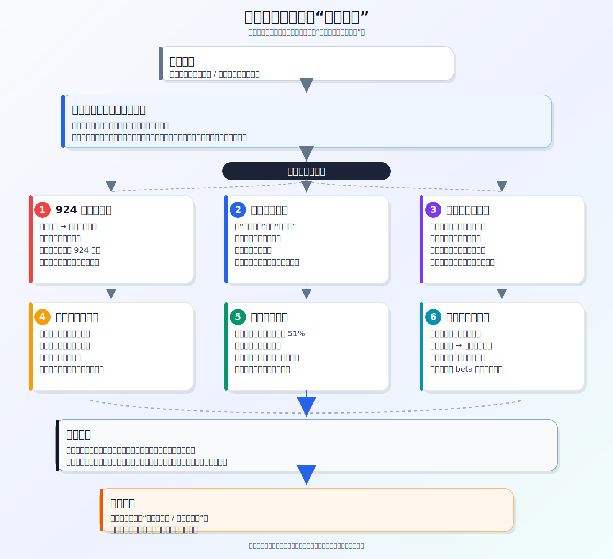

# 冰冰小美-证券牛市逻辑变化推导

## 核心结论

[[people/冰冰小美|冰冰小美]] 的推导结论是：证券板块不能再被机械视为“牛市旗手”。如果买入理由只有“牛市要来了，所以券商会涨”，这个理由是不充分的；更合理的判断顺序应是先检查基本面、流动性情绪和交易窗口是否同时友好。

对应观点页见 [[views/冰冰小美：证券不再机械等同牛市旗手的阶段判断|冰冰小美：证券不再机械等同牛市旗手的阶段判断]]。

## 推导前提

- 前提一：旧经验里，证券 / 券商常被市场视为牛市旗手，容易在牛市预期升温时获得资金追捧。
- 前提二：作者认为当前市场结构、监管目标和证券行业竞争环境已经变化，旧经验不能直接迁移。
- 前提三：证券仍然与流动性周期相关，但这种相关性意味着它会随流动性波动，而不是脱离基本面与监管约束。
- 前提四：原文中的若干事实表述尚未核验，因此本页把它们作为作者推导中的前提，而非已证实事实。

## 关键变量

| 变量 | 含义 | 影响 |
|---|---|---|
| 924行情后的情绪反噬 | 作者认为证券快速拉升激发牛市幻想，但暴涨后容易遭遇做空和回撤 | 说明情绪推动不能自动转成持续牛市 |
| 监管定位 | 作者认为证券从“旗手”变成调节指数的工具 | 改变证券板块的上涨角色和持续性 |
| 稳定币题材 | 作者认为证券曾借美元稳定币题材上涨，但题材被监管否定 | 题材退潮会让交易逻辑失效 |
| 地产债资产质量 | 作者认为券商持有房地产债券，房地产风险可能造成计提和打折 | 财报盈利不一定等于真实质量无忧 |
| 外资金融准入 | 作者认为外资投行进入会挤压国内券商业务 | 行业竞争格局改变，旧盈利模式承压 |
| 流动性周期 | 券商仍是流动性敏感板块 | 流动性配合才可能支撑持续弹性 |

## 推导链

1. 市场旧认知是“牛市买券商”，因为券商过去常被视为牛市旗手。
2. 但作者认为 `924行情` 显示，证券快速拉升可能只是激发热度和牛市幻想，暴涨本身也会制造风险。
3. 如果快速上涨吸引对冲和获利盘，行情就可能从“牛市发动机”变成“情绪反噬节点”。
4. 同时，证券的监管角色被作者解释为从旗手转向指数调节工具；这意味着它的上涨不一定代表行业自身进入强周期。
5. 稳定币题材带来的上涨如果被监管否定，就会从题材催化转为题材失效，价格也可能回到炒作前逻辑。
6. 券商资产端若存在房地产债券和资产计提压力，财报表面盈利就需要进一步穿透质量。
7. 外资金融准入和外资投行进入会改变行业竞争格局，内资券商合并也被作者视为竞争压力的反映。
8. 最后，券商与流动性牛市高度相关；若流动性周期不配合，单靠“牛市叙事”无法支撑持续上涨。
9. 因此，结论不是“证券一定不能涨”，而是“不能再把牛市预期直接等同于券商买入理由”。

## svg 推导图

## 传导机制

这条推导的关键，不在于单个利空，而在于多个约束叠加后改变了证券板块的买入前提：

- 情绪与题材可以推动短期弹性，但也会提高回撤和反噬概率。
- 监管定位会影响证券板块是否能持续承担进攻角色。
- 资产质量会影响券商估值修复的可信度。
- 外资竞争会改变行业利润分配和业务空间。
- 流动性周期决定券商弹性是否有持续燃料。

所以，证券板块的判断应从“牛市旗手”转成“三要素检查”：基本面 / 产业链是否改善，流动性 / 情绪是否配合，交易窗口 / 风险节点是否友好。

## 时间节点

| 日期 | 事件 | 影响 |
|---|---|---|
| 待验证 | 924行情 | 作者认为证券快速拉升激发牛市幻想，但后续回撤显示短期暴涨并不稳定 |
| 待验证 | 稳定币题材上涨与监管否定 | 作者认为题材失效后，证券可能从哪里炒起就跌回哪里 |
| 待验证 | 房地产去年四季度风险暴露 | 作者认为地产债风险可能影响券商资产质量 |
| 待验证 | 海通与国泰君安合并 | 作者将其视为国内券商竞争压力和行业整合的表现 |

## 风险触发条件

- 证券板块短期过快上涨，形成情绪过热和回撤压力。
- 稳定币、比特币或其他题材催化被监管否定，交易逻辑失效。
- 房地产债券风险继续暴露，券商资产质量和计提压力上升。
- 外资投行进入后挤压国内券商业务空间，行业竞争加剧。
- 流动性周期转弱，券商作为流动性敏感资产失去持续弹性。

## 反例与不确定性

- 如果监管明确支持资本市场扩张、居民资产入市和券商业务增长，证券板块仍可能重新获得阶段性进攻角色。
- 如果流动性明显宽松、成交持续放大且风险偏好稳定，券商仍可能作为高弹性板块上涨。
- 原文涉及的港股回撤、对冲基金做空、稳定币违法表述、万科亏损金额、外资金融准入比例、券商房地产债敞口等均需后续事实核验。
- “证券变成工具人”是作者解释，可能过度概括监管意图。

## 相关观点

- [[views/冰冰小美：证券不再机械等同牛市旗手的阶段判断|冰冰小美：证券不再机械等同牛市旗手的阶段判断]]
- [[views/冰冰小美：流动性有利不等于成交放大的判断框架|冰冰小美：流动性有利不等于成交放大的判断框架]]
- [[冰冰小美-concept-体系三要素之竞争格局的比较优势|冰冰小美-concept-竞争格局的比较优势]]

## 相关概念

- [[concepts/冰冰小美-汇率、长期利率与流动性|汇率、长期利率与流动性]]
- [[reasoning/冰冰小美如何判断风险转弱的节点|风险转弱节点框架]]

## 相关人物

- [[people/冰冰小美|冰冰小美]]

## 相关主题

- [[topics/冰冰小美-宏观经济|宏观经济]]

## 来源

- [[sources/articles/2026-05-22-冰冰小美：牛市证券为何和以往不一样|冰冰小美：牛市证券为何和以往不一样]]

## 相关页面

- [[views/冰冰小美：证券不再机械等同牛市旗手的阶段判断|冰冰小美：证券不再机械等同牛市旗手的阶段判断]]：本推导链对应的观点页。
- [[reasoning/冰冰小美如何判断风险转弱的节点|风险转弱节点框架]]：提供买入前风险转弱检查语言。
