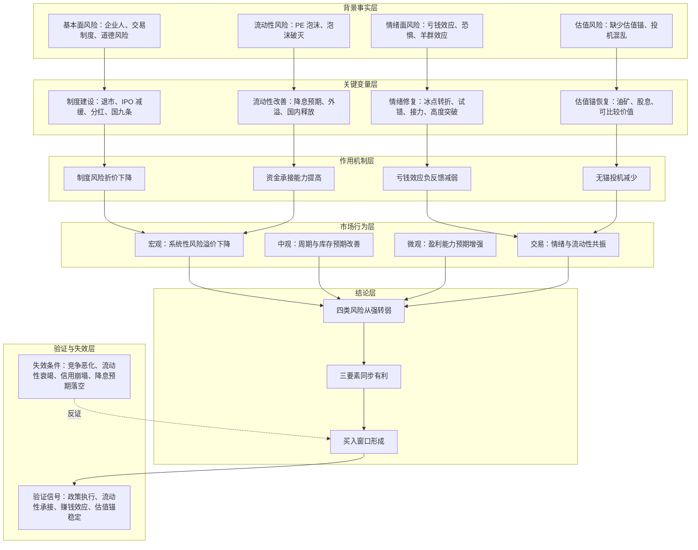
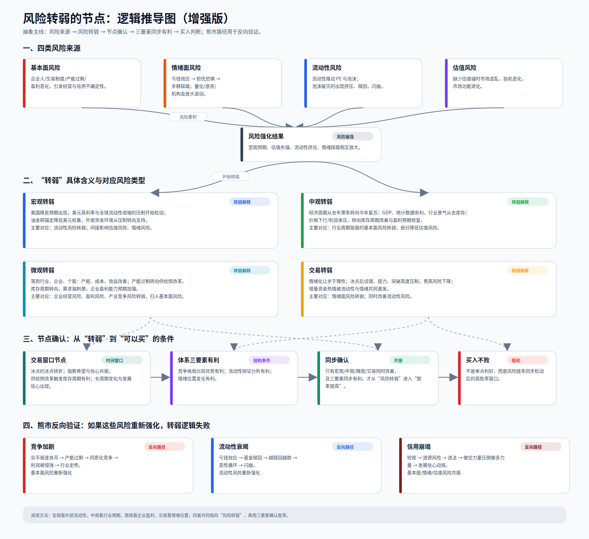

# 风险转弱节点如何形成买入窗口

## 核心结论

> 核心命题：[[people/冰冰小美|冰冰小美]] 试图证明「当基本面风险、情绪面风险、流动性风险和估值风险从强转弱，并且宏观、中观、微观、交易层面同步改善时，市场会从风险扩散状态进入可承接状态；若竞争格局、流动性和情绪位置三要素也同步有利，就形成更适合买入的窗口」。

这里的“买入窗口”不是无风险状态，而是作者认为胜率、赔率、承接环境和发展信心同时改善的状态。“买入不败”是作者的强表达，不能替代仓位控制、止损规则和后续验证。

## 推导前提

- 前提一：市场风险可以拆成四类，即基本面风险、情绪面风险、流动性风险和估值风险。
- 前提二：四类风险不是孤立变量，它们会通过信心、资金、价格和制度预期互相放大。
- 前提三：风险转弱不是单一利好触发，而是制度、周期、盈利预期、流动性、估值锚和交易情绪共同变化的结果。
- 前提四：作者把“竞争格局的比较优势、流动性辩证分析、情绪位置变化”视为交易体系三要素；只有三者同步有利，才接近她所说的“买入不败”窗口。
- 前提五：[[sources/articles/2025-01-25-冰冰小美：行情不等于风险|《行情不等于风险》]] 进一步补充，行情好、消息有利和题材有利不等于风险小；风险减弱带来的容错率，才是交易窗口更重要的来源。
- 前提六：原文没有提供完整数据、发布时间和量化指标，因此本页只记录作者推导，不把结论写成已验证事实。

## 背景事实

- 作者认为，企业主体行为和交易制度缺陷会带来基本面与制度风险。
- 作者认为，持续亏钱效应会从担忧发展为恐惧，再经由羊群效应、量化、游资和机构行为放大波动。
- 作者认为，流动性可以推高 PE 和泡沫，也会在泡沫破灭时形成下跌风险。
- 作者认为，市场缺少估值锚时，容易陷入无锚投机和赌场化环境。
- 原文提到国九条、制度建设、退市、IPO 减缓、鼓励分红、降息预期、流动性外溢、供给侧改革、库存周期和需求刺激等变量，但未提供完整时间和数据出处。

## 关键变量

| 变量 | 含义 | 影响路径 | 观察指标 |
|---|---|---|---|
| 基本面风险 | 企业人、交易制度、道德风险、规则缺陷 | 制度缺陷会提高风险折价；制度修复会降低对资产质量和市场规则的担忧 | 退市执行、IPO 节奏、分红政策、违法违规处罚 |
| 情绪面风险 | 亏钱效应、恐惧、羊群效应、波动放大 | 亏钱效应越强，抛售和观望越强；亏钱效应缓和后，试错和接力资金恢复 | 涨跌家数、连板高度、成交活跃度、基金申赎、风险偏好 |
| 流动性风险 | 流动性推动估值，也可能因衰竭刺破泡沫 | 流动性宽松提高承接能力；流动性衰竭触发赎回和踩踏 | 成交额、融资余额、ETF 申赎、利率预期、央行流动性投放 |
| 估值风险 | 缺少估值锚后的无序投机和估值混乱 | 有锚资产更容易形成定价秩序；无锚市场更容易赌场化 | 股息率、商品价格锚、估值分位、盈利预期 |
| 宏观条件 | 降息预期、流动性外溢、美元权重变化 | 宏观压力下降会降低系统性风险溢价 | 利率路径、美元指数、通胀数据、全球资金流向 |
| 中观条件 | 经济周期、行业库存周期、供给侧改革 | 周期改善会先改变行业盈利预期，再传导到估值 | GDP、库存、产能利用率、行业价格 |
| 微观条件 | 企业产能、成本、效益和盈利能力 | 盈利改善使价格上涨获得基本面承接 | 毛利率、订单、现金流、产能出清 |
| 交易条件 | 情绪理性化、增量资金和流动性共振 | 交易层面改善把风险转弱翻译成价格表现 | 成交结构、热点扩散、指数与个股赚钱效应 |
| 体系三要素 | 竞争格局、流动性、情绪位置 | 用于确认风险转弱是否真的进入可买窗口 | 三个相关观点页的变量是否同步有利 |

## 推导链表

| 层级 | 内容 | 推导关系 | 可信度 | 观察指标 |
|---|---|---|---|---|
| 背景事实 | 市场先承受基本面、情绪、流动性和估值四类风险 | 作为推导起点 | 中 | 制度风险、亏钱效应、流动性压力、估值分化 |
| 关键变量 | 国九条、退市、IPO 减缓、分红等制度变量改善规则预期 | 影响基本面与交易制度风险 | 中 | 政策执行、退市案例、IPO 节奏、分红比例 |
| 关键变量 | 亏钱效应从恐惧转向试错、接力和高度突破 | 影响情绪面风险 | 中 | 连板高度、涨停扩散、成交活跃度、风险偏好 |
| 关键变量 | 降息预期、流动性外溢和国内流动性释放 | 影响流动性风险 | 中 | 利率预期、成交额、ETF 申赎、央行操作 |
| 关键变量 | 油矿、股息等估值锚恢复 | 影响估值风险 | 中 | 商品价格、股息率、估值分位、核心资产定价 |
| 作用机制 | 四类风险缓和后，市场从负反馈转向可承接状态 | 解释风险如何从强转弱 | 中 | 下跌斜率降低、赎回压力缓和、热点持续性提升 |
| 中介环节 | 宏观、中观、微观和交易层面同步改善 | 连接风险转弱与买入窗口 | 中 | 通胀、GDP、库存周期、盈利预期、成交结构 |
| 中介环节 | 竞争格局、流动性和情绪位置三要素同步有利 | 确认风险转弱是否具备交易价值 | 中 | 比较优势、资金承接、情绪位置 |
| 结论 | 买入窗口形成 | 推导结果 | 中 | 胜率、赔率和承接环境同时改善 |

## 推导链

1. 市场原本承受四类风险：基本面风险、情绪面风险、流动性风险、估值风险。
2. 基本面风险来自企业主体和交易制度；若制度建设、退市、IPO 减缓、分红和国九条改善规则环境，市场对道德风险和制度缺陷的折价下降。
3. 情绪面风险来自持续亏钱效应；若亏钱效应缓和，交易者从担忧恐惧转向试错、接力和突破高度压制，情绪负反馈开始变弱。
4. 流动性风险来自泡沫生成后的破灭压力；若降息预期、流动性外溢和国内流动性释放提高承接能力，赎回和踩踏风险下降。
5. 估值风险来自市场缺少定价锚；若油矿、股息等锚恢复，市场减少无锚投机和赌场化定价。
6. 四类风险同时缓和后，宏观、中观、微观和交易层面更容易形成改善共振。
7. 宏观层面看流动性和降息预期，中观层面看经济周期和库存周期，微观层面看产能、成本、效益和盈利预期，交易层面看情绪与增量资金。
8. 如果竞争格局的比较优势、流动性辩证分析、情绪位置变化三者同步有利，风险转弱就从“环境改善”推进到“买入窗口”。
9. 如果只是行情好、消息有利或题材有利，但风险仍在累积，交易者可能看对方向却缺少修正空间。
10. 因此，作者所谓“买入不败”不是无风险，而是指风险收益比、资金承接、容错率和发展信心同时改善。

## Mermaid 推导图

## svg 推导图

## 传导机制

### 1. 基本面风险通过制度预期传导

原文把基本面风险拆到“企业人”和“交易制度”。这意味着风险不只来自企业利润，也来自参与者是否相信规则能约束坏行为。若退市、IPO 节奏、分红和国九条等制度变量改善，市场会降低对劣质资产、道德风险和规则缺陷的折价，优质资产更容易获得资金承接。

### 2. 情绪面风险通过亏钱效应传导

持续亏钱效应会让市场从担忧进入恐惧，恐惧再通过羊群效应、短线资金、量化和机构行为放大波动。若亏钱效应减弱，资金会从观望转向试错；试错成功后，接力情绪上升；高度压制被突破后，市场对上涨的畏惧下降，价格运行更通畅。

### 3. 流动性风险通过估值和赎回传导

流动性充裕时，PE 偏好上升，泡沫可能生成；流动性衰竭时，泡沫破灭会引发赎回、下跌、再赎回的负反馈。若降息预期、流动性外溢和国内流动性释放提高了承接能力，市场不再主要由赎回链条定价，风险偏好就会修复。

### 4. 估值风险通过定价锚传导

缺少估值锚时，市场容易在无序投机中形成两极分化，最后失去资产配置功能。若油矿、股息等锚重新有效，市场至少能比较“现金流、资源、分红、价格”之间的关系，从而减少纯情绪化定价。

### 5. 三要素把环境改善转成交易窗口

四类风险缓和只是环境改善。要变成交易窗口，还要看到三要素同步：

- [[views/冰冰小美：比较优势来自安全与发展再平衡的判断框架|冰冰小美：比较优势来自安全与发展再平衡的判断框架]]：方向本身处在更好的竞争格局里；
- [[views/冰冰小美：流动性有利不等于成交放大的判断框架|冰冰小美：流动性有利不等于成交放大的判断框架]]：资金承接不是表面成交，而是供给、ETF、权重和政策约束共同支持；
- [[views/冰冰小美：情绪合力由市场位置决定的判断框架|冰冰小美：情绪合力由市场位置决定的判断框架]]：情绪位置已经从恐惧压制转向试错和接力。

三者同步，才说明“风险转弱”不只是反弹叙事，而有更完整的买入条件。

## 时间节点

| 日期 | 事件 | 影响 | 确定性 |
|---|---|---|---|
| 2024-05-09 | 原帖《情绪体系认知篇（风险转弱的节点）》发布 | 构成本文推导来源 | 中，依据用户提供的源文件元数据 |
| 待验证 | 原文提及国九条、制度建设与退市 | 作者把它们视为基本面和制度风险改善变量 | 中，具体政策日期未在原文中列出 |
| 待验证 | 原文提及“去年清除泡沫后，央妈释放流动性” | 作者把它作为流动性风险转弱的背景 | 低，相对时间需结合原帖发布时间验证 |
| 待验证 | 原文提及“去年萧条，今年复苏，一季度 GDP 增长” | 作者把它作为中观周期转弱的证据 | 低，年份和数据来源需验证 |
| 待验证 | 原文提及“冰点的冰点转折” | 作者把它作为交易窗口节点之一 | 中，属于交易观察信号而非单一日期 |

## 验证信号

- 制度侧：退市执行是否持续、IPO 是否保持节奏控制、分红是否成为更强约束。
- 情绪侧：亏钱效应是否减弱，个股赚钱效应是否扩散，接力高度是否突破旧压制。
- 流动性侧：成交额、ETF 申赎、融资余额、央行流动性投放和利率预期是否支持风险资产。
- 估值侧：高股息、资源、油矿等锚是否稳定，市场是否减少无锚题材投机。
- 周期侧：库存周期、产能利用率、行业价格和企业盈利预期是否改善。
- 三要素：竞争格局、流动性和情绪位置是否同步有利，而不是只出现其中一个利好。

## 风险触发条件

推导成立的触发条件：

- 基本面与制度风险被制度建设、退市、分红和 IPO 节奏调整吸收；
- 情绪从恐惧和亏钱效应中走出，出现试错、接力和高度突破；
- 宏观流动性预期改善，国内外流动性承接能力增强；
- 估值锚恢复，投机不再完全脱离可比较价值；
- 宏观、中观、微观和交易条件同时改善；
- 竞争格局、流动性和情绪位置三要素同步有利。

推导失效的触发条件：

- 竞争重新恶化，出现劣币驱逐良币、产能过剩、价格竞争和利润侵蚀；
- 基金赎回、成交萎缩或资金迁移造成流动性衰竭；
- 违法、道德风险或信用事件击穿市场信任；
- 降息预期落空或通胀重新上行，导致流动性外溢逻辑失效；
- 估值锚再次失效，市场重新进入无锚投机；
- 三要素只改善其一，不能形成同步确认。

## 反例与不确定性

- 单一情绪反弹不等于风险转弱。如果制度、流动性和估值锚没有改善，反弹可能只是短线修复。
- 单一政策利好不等于买入窗口。如果产业竞争格局仍在恶化，政策可能只能延缓风险释放。
- 流动性改善不一定进入同一批资产。资金可能集中流向核心资产、ETF 权重或有估值锚的方向。
- 作者关于油金铜锚定、美元权重下降和新兴市场受益的判断属于宏观推测，仍需后续数据验证。
- 原文中的“去年”“今年”“一季度”等相对时间需要结合原帖发布时间核验。
- “买入不败”是作者强表达，不能替代仓位、止损、分散和风险预算。

## 相关观点

- [[views/冰冰小美：比较优势来自安全与发展再平衡的判断框架|冰冰小美：比较优势来自安全与发展再平衡的判断框架]]：说明竞争格局比较优势如何筛选方向。
- [[views/冰冰小美：流动性有利不等于成交放大的判断框架|冰冰小美：流动性有利不等于成交放大的判断框架]]：说明流动性判断为什么不能只看成交量。
- [[views/冰冰小美：情绪合力由市场位置决定的判断框架|冰冰小美：情绪合力由市场位置决定的判断框架]]：说明情绪位置变化如何影响试错、接力和高度压制。
- [[views/冰冰小美：宏观服务风险识别与仓位调整的判断框架|冰冰小美：宏观服务风险识别与仓位调整的判断框架]]：说明宏观用于理解风险和调整仓位，而不是生成下单代码。
- [[views/冰冰小美：行情不等于风险的判断框架|冰冰小美：行情不等于风险的判断框架]]：说明为什么行情热度不能替代风险转弱检查。
- [[views/冰冰小美：真正中长期需要底线思维的核心判断|冰冰小美：真正中长期需要底线思维的核心判断]]：说明真正中长期要能承受均值回归和底线压力测试。

## 相关事件

- 原文涉及国九条、制度建设、降息预期和供给侧改革等事件或政策变量，但当前知识库尚未为这些变量拆出独立 Event Page。

## 相关时间线

- [[timelines/冰冰小美-2026一季度宏观阶段时间线|冰冰小美 2026Q1 宏观阶段时间线]]：可作为理解作者如何把宏观事件翻译成仓位动作的背景时间线。

## 相关概念

- [[concepts/冰冰小美-风险转弱节点框架|风险转弱节点框架]]：定义本页推导所依赖的四类风险和三要素框架。
- [[topics/冰冰小美-宏观经济|宏观经济]]：承接本页涉及的宏观流动性、中观周期和风险偏好变化。

## 相关人物

- [[people/冰冰小美|冰冰小美]]：本页推导的观点来源和人物学习线主体。

## 相关页面

- [[people/冰冰小美|冰冰小美]]：本页推导的作者来源。
- [[concepts/冰冰小美-风险转弱节点框架|风险转弱节点框架]]：本页对应的 Concept Page，负责解释框架是什么。
- [[views/冰冰小美：行情不等于风险的判断框架|行情不等于风险]]：补充行情与风险错配时，为什么风险减弱才形成容错率。
- [[topics/冰冰小美-宏观经济|宏观经济]]：本页把宏观流动性、中观周期和交易情绪连接到市场窗口判断。
- [[views/冰冰小美：比较优势来自安全与发展再平衡的判断框架|冰冰小美：比较优势来自安全与发展再平衡的判断框架]]：提供三要素中的方向筛选维度。
- [[views/冰冰小美：流动性有利不等于成交放大的判断框架|冰冰小美：流动性有利不等于成交放大的判断框架]]：提供三要素中的资金承接维度。
- [[views/冰冰小美：情绪合力由市场位置决定的判断框架|冰冰小美：情绪合力由市场位置决定的判断框架]]：提供三要素中的情绪确认维度。
- [[timelines/冰冰小美-2026一季度宏观阶段时间线|冰冰小美 2026Q1 宏观阶段时间线]]：提供作者把宏观事件转成仓位动作的背景线索。

## 来源

- [[sources/articles/2026-05-21-冰冰小美：风险转弱的节点|情绪体系认知篇（风险转弱的节点）]]：本页推导的直接来源，保留作者、链接、来源声明和完整原文。
- [[sources/articles/2025-01-25-冰冰小美：行情不等于风险|冰冰小美：行情不等于风险]]：补充风险减弱、容错率与行情热度不能混同的观点来源。
