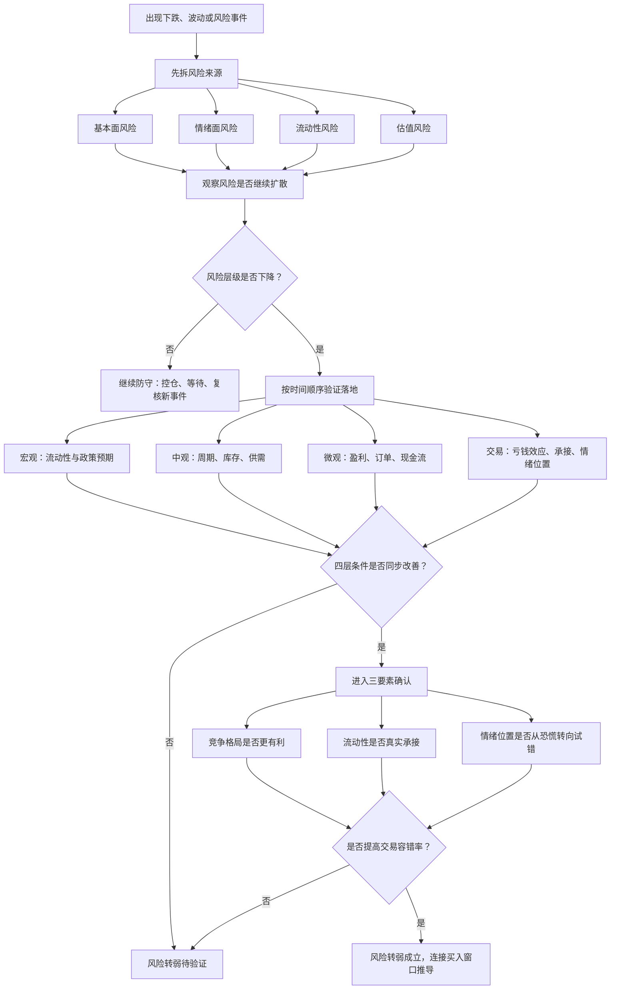

# 冰冰小美如何判断风险转弱的节点？

## 核心结论

[[people/冰冰小美|冰冰小美]] 判断风险转弱，不是先问“能不能买”，而是先问“风险是否已经从扩散状态转向可承接状态”。

她的推导顺序可以压成一句话：先识别风险来自哪里，再观察风险是否继续扩散，接着按时间顺序确认宏观、中观、微观和交易层面的变化是否落地，最后用[[topics/冰冰小美-情绪体系理论篇|体系三要素]]判断这个风险转弱是否足以提高交易容错率。

因此，风险转弱节点不是无风险节点。它只是说明负反馈减弱、承接能力修复、交易者有更大空间修正思考和仓位。是否进入买入窗口，还要继续连接 [[reasoning/冰冰小美-风险转弱节点如何形成买入窗口|风险转弱节点如何形成买入窗口]]。

## 推导前提

- 前提一：交易判断要先看风险，再看机遇。[[sources/articles/2025-01-03-冰冰小美：交易的风控|2025-01-03《交易的风控》]] 把节点变化理解为风险和机遇的变化。
- 前提二：行情强弱不能直接代表风险强弱。[[sources/articles/2025-01-25-冰冰小美：行情不等于风险|2025-01-25《行情不等于风险》]] 强调，行情好不等于风险小，风险减弱才会提高容错率。
- 前提三：风险不是单一变量，而是基本面、情绪、流动性和估值多层风险互相放大。
- 前提四：风险转弱要看时间顺序。[[sources/articles/2025-09-20-冰冰小美：风险变化如何观察|2025-09-20《风险变化如何观察》]] 提供了把宏观、中观、微观事件按时间排列、观察事件密集区如何落地的方法。
- 前提五：风险转弱窗口出现后仍需复核。[[sources/articles/2025-06-15-冰冰小美：当风险突然降临的时候|2025-06-15《当风险突然降临的时候》]] 说明，突发事件会重新改变风险层级、持续性和交易窗口。

## 关键变量

| 变量 | 含义 | 如何影响风险转弱判断 |
|---|---|---|
| 基本面风险 | 企业主体、交易制度、道德风险、供需和盈利风险 | 制度修复、供给改善、盈利预期改善时，基本面负反馈才可能减弱 |
| 情绪面风险 | 亏钱效应、恐惧、羊群行为、短线资金和机构行为 | 情绪从恐慌转向试错、接力和信心恢复时，交易层面的抛压会减弱 |
| 流动性风险 | 泡沫生成、泡沫破灭、赎回和资金承接能力 | 流动性改善并落到市场承接时，风险资产才可能从踩踏转向稳定 |
| 估值风险 | 缺少估值锚、无序投机、定价混乱 | 股息、资源、现金流或产业盈利等估值锚恢复时，市场更容易重新定价 |
| 时间顺序 | 事件先后、风险释放节奏、利好落地节奏 | 用来区分“风险仍在扩散”与“风险已经落地并开始缓和” |
| 风险层级 | 短期扰动、持续风险、系统性风险 | 决定风险转弱是局部修复，还是足以改变仓位和交易窗口 |
| 体系三要素 | 竞争格局、流动性、情绪位置 | 用来确认风险转弱是否进一步变成可执行的交易环境 |

## 推导链

1. 市场出现下跌、混乱或高波动时，不能先用“跌多了”判断机会，而要先拆风险来源。
2. 如果风险主要来自基本面恶化、制度预期失效、企业信用破坏或供需失衡，那么单纯情绪修复不能证明风险转弱。
3. 如果风险主要来自亏钱效应和恐慌扩散，就要看情绪是否从担忧、恐惧、踩踏转向试错、接力和信心恢复。
4. 如果风险主要来自流动性衰竭，就要看成交、ETF、融资、央行流动性、利率预期和资金迁移是否真正形成承接。
5. 如果风险主要来自估值无锚，就要看市场是否重新出现可比较的定价锚，例如股息、资源价格、现金流、盈利预期或产业地位。
6. 四类风险单独改善还不够，需要按时间顺序观察它们是否从互相放大变成互相缓和。
7. 当宏观流动性、中观周期、微观盈利和交易情绪逐步落地，市场会从“风险扩散”转向“风险可观察”。
8. 当新事件不再继续提高风险层级，或者突发事件只构成短期扰动而非持续性风险，市场才接近“风险可承接”。
9. 当竞争格局、流动性和情绪位置三要素同步有利，风险转弱才从环境判断推进到交易判断。
10. 因此，风险转弱节点的本质不是“买点出现”，而是风险收益比、修正空间和容错率开始改善。

## 传导机制

### 1. 基本面风险从规则和盈利端传导

基本面风险不只是企业利润下降，也包括企业主体行为、交易制度和市场规则可信度。制度建设、退市执行、IPO 节奏、分红约束、供给侧改革和盈利预期改善，都会改变市场对资产质量和长期回报的折价。

如果这些变量没有改善，市场即使反弹，也可能只是情绪修复；如果这些变量改善，风险会从“资产质量不可判断”转向“可以重新比较和定价”。

### 2. 情绪面风险从亏钱效应传导

情绪风险的核心是亏钱效应。持续亏钱会让交易者从担忧进入恐惧，再由羊群效应、量化、游资和机构行为放大波动。

风险转弱时，情绪不会直接变成亢奋，而是先出现亏钱效应减弱、试错资金恢复、接力意愿增加和高度压制被突破。[[concepts/冰冰小美-framework-情绪体系|情绪体系]] 在这里承担的是“参与者行为是否停止负反馈”的观察功能。

### 3. 流动性风险从资金承接传导

流动性风险不是成交额大小本身，而是资金是否愿意、能够、持续地承接风险资产。降息预期、央行流动性、ETF 承接、融资余额和全球资金迁移，都可能影响这个链条。

如果流动性只是短暂放大成交，而没有稳定承接，风险可能继续扩散；如果流动性改善能压住赎回、踩踏和价格负反馈，风险才开始转弱。

### 4. 估值风险从定价锚传导

缺少估值锚时，市场容易进入无序投机：上涨没有可解释的现金流，下跌也没有可守的价值边界。冰冰小美把资源、股息、油矿、现金流和产业盈利等对象视作潜在估值锚。

风险转弱并不要求所有资产都低估，而是要求市场重新有一组可比较、可承接、可复盘的定价依据。

### 5. 时间顺序把“利好”变成“节点”

单一利好不是节点。节点来自一组事件的先后关系：风险先释放，政策或流动性再落地，企业和产业变量再验证，最后交易情绪和资金承接发生变化。

这就是为什么风险转弱要按时间顺序看。若利好在风险释放之前出现，可能只是提前消耗预期；若利好在风险充分释放之后落地，才更可能形成容错率修复。

## 判断流程

## 与买入窗口的分工

本页回答的是：冰冰小美如何判断风险是否转弱。

[[reasoning/冰冰小美-风险转弱节点如何形成买入窗口|风险转弱节点如何形成买入窗口]] 回答的是：风险转弱之后，为什么会进一步形成买入窗口。

两者的分工是：

| 页面 | 核心问题 | 重点 |
|---|---|---|
| 本页 | 风险如何从强转弱？ | 风险来源、风险层级、时间顺序、承接修复 |
| [[reasoning/冰冰小美-风险转弱节点如何形成买入窗口|买入窗口推导页]] | 转弱之后为何可买？ | 胜率、赔率、三要素同步有利、仓位容错率 |

## 风险触发条件

风险转弱成立，通常需要同时看到：

- 基本面风险不再继续放大，规则、供需、盈利或信用预期开始修复；
- 情绪风险不再以亏钱效应和恐惧为主导，市场开始出现可持续试错；
- 流动性风险不再表现为赎回、踩踏和无承接下跌；
- 估值风险不再完全无锚，市场能重新比较现金流、资源、股息、产业地位或盈利预期；
- 新事件没有继续抬高风险层级；
- 宏观、中观、微观和交易层面的变化能按时间顺序互相验证；
- 竞争格局、流动性和情绪位置三要素同步有利。

风险转弱失效，通常来自：

- 新风险事件把短期扰动升级为持续性风险；
- 流动性改善只停留在预期，未落到市场承接；
- 情绪修复只是反弹，亏钱效应和赎回压力没有真正缓和；
- 估值锚重新失效，市场再次进入无锚投机；
- 产业竞争、企业盈利或信用风险继续恶化；
- 三要素只改善其中一项，无法形成同步确认。

## 反例与不确定性

- 单日反弹不是风险转弱。反弹可能只是超跌修复，不能替代风险层级下降。
- 单一政策利好不是风险转弱。政策需要落到流动性、盈利、信用或情绪承接上才有意义。
- 情绪变暖不是风险转弱。若流动性和估值锚没有恢复，情绪修复可能很短。
- 流动性宽松不必然流入同一类资产。资金可能只承接 ETF、核心权重或高股息资产。
- 原文中的部分相对时间、政策变量和宏观判断需要结合当时市场数据继续验证。
- “买入不败”等强表达应理解为作者对高容错率窗口的强调，不应写成无风险承诺。

## 相关观点

- [[views/冰冰小美：交易风控先看风险与国运的判断框架|交易风控先看风险与国运]]：提供“风险在前，机遇在后”的上位顺序。
- [[views/冰冰小美：行情不等于风险的判断框架|行情不等于风险]]：说明行情热度不能替代风险转弱检查。
- [[views/冰冰小美：突发风险降临时先重估风险层级与交易窗口的判断框架|突发风险降临时先重估风险层级与交易窗口]]：说明风险转弱窗口出现后仍要复核新事件。
- [[views/冰冰小美：风险变化观察依赖时间顺序与流动性落地的判断框架|风险变化观察依赖时间顺序与流动性落地]]：说明为什么风险观察要按事件顺序和流动性落地来判断。

## 相关概念

- [[topics/冰冰小美-情绪体系理论篇|冰冰小美-体系三要素]]：用于确认风险转弱是否进入可执行交易状态。
- [[concepts/冰冰小美-framework-情绪体系|冰冰小美-情绪体系]]：用于观察情绪风险是否从亏钱效应转向试错和接力。
- [[concepts/冰冰小美-波动风险|波动风险]]：用于识别风险尚未转弱前的事件集合、杠杆退散和流动性压力。
- [[concepts/冰冰小美-时间窗口|时间窗口]]：与风险转弱节点相邻，强调宏观波动之后的可承接阶段。

## 相关人物

- [[people/冰冰小美|冰冰小美]]：本页推导的观点来源和人物学习线主体。

## 相关页面

- [[topics/冰冰小美-风险提示系列|冰冰小美-风险提示系列]]：本页属于风险提示系列中的风险转弱判断部分。
- [[topics/冰冰小美-宏观经济|宏观经济]]：本页把宏观流动性、中观周期、微观盈利和交易情绪放在同一风险判断链中。
- [[reasoning/冰冰小美-风险转弱节点如何形成买入窗口|风险转弱节点如何形成买入窗口]]：承接本页，解释风险转弱如何进一步形成买入窗口。
- [[reasoning/冰冰小美-波动风险如何由事件集合与杠杆退散传导为流动性不利|波动风险如何由事件集合与杠杆退散传导为流动性不利]]：展示风险尚未转弱时的扩散链条。

## 来源

- [[sources/articles/2025-01-03-冰冰小美：交易的风控|2025-01-03《交易的风控》]]：提供风险在前、机遇在后的上位风控顺序。
- [[sources/articles/2025-01-25-冰冰小美：行情不等于风险|2025-01-25《行情不等于风险》]]：提供行情强弱与风险强弱分离的判断。
- [[sources/articles/2025-06-15-冰冰小美：当风险突然降临的时候|2025-06-15《当风险突然降临的时候》]]：提供风险转弱窗口被突发事件重新评估的案例。
- [[sources/articles/2025-09-20-冰冰小美：风险变化如何观察|2025-09-20《风险变化如何观察》]]：提供按时间顺序观察风险变化的方法。
- [[sources/articles/2026-05-21-冰冰小美：风险转弱的节点|2024-05-09《情绪体系认知篇（风险转弱的节点）》]]：提供四类风险与风险转弱节点的直接来源。
