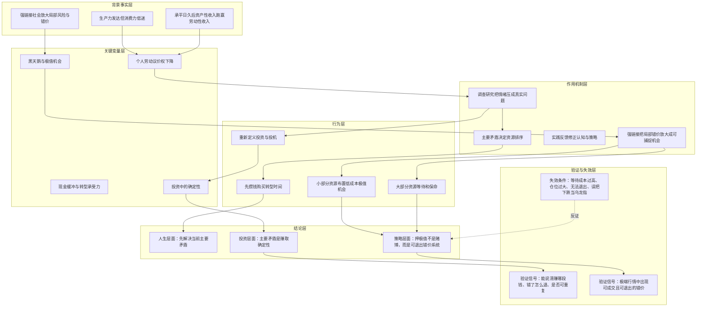

# 碧树西风-调查矛盾实践如何推导为赚取确定性与押极值策略

## 核心命题

核心命题：[[people/碧树西风|碧树西风]] 试图证明，个人改变命运不能靠抱怨、口号或流派崇拜，而要先用 [[concepts/碧树西风-framework-调查矛盾实践|调查矛盾实践]] 找到世界和自身的主要矛盾；进入投资后，这个主要矛盾表现为“赚取确定性”，而在强链接时代，围绕极值、错价和黑天鹅放大的策略，比单纯押中间值更符合他的执行条件。

## 核心结论

这条推导最终得到三层结论：

1. 人生层面：改变命运的起点不是追求抽象财务自由，而是找到当前阶段最卡住自己的主要矛盾，例如早期职场人的现金缓冲和转型承受力。
2. 投资层面：投资与投机的分界不在于长短线、杠杆高低，而在于是否能讲清楚自己赚哪一段钱、错了如何退出、能否重复执行。
3. 策略层面：如果强链接社会会放大局部黑天鹅和错价，那么大部分资源应保留生存和等待能力，小部分资源布置低成本、高赔率、可退出的极值机会。

## 推导前提

- 前提一：人类社会在承平日久后，资产性收入更容易跑赢劳动性收入，劳动议价权下降。
- 前提二：债务可以暂时填补消费力不足，但不能根本解决生产力发达与消费力低迷之间的不平衡。
- 前提三：普通人无法直接解决世界主要矛盾，只能先识别自己所处阶段的主要矛盾。
- 前提四：投资的关键不是外观标签，而是是否知道自己为什么赚、为什么亏，以及能否重复。
- 前提五：强链接社会会让局部事件、恐慌、错价和黑天鹅更容易被放大。

## 关键变量

| 变量 | 含义 | 影响 |
|---|---|---|
| 生产力与消费力缺口 | 机器、AI 和资本提高供给能力，但劳动者收入和消费能力跟不上 | 构成作者对世界主要矛盾的判断起点 |
| 资产性收入与劳动性收入差距 | 用钱赚钱长期快于用劳动赚钱 | 推动个人不能只依靠劳动性收入，需要寻找投资或策略系统 |
| 现金缓冲 | 支撑转型、学习和试错的资金储备 | 决定普通人能否从被动打工转向主动选择 |
| 主要矛盾 | 当前阶段最卡住行动的变量 | 决定资源排序，避免把目标写成无边界愿望 |
| 确定性 | 对收益来源、规则、退出和得失原因的掌握 | 成为投资的真正主要矛盾 |
| 强链接程度 | 市场、行业、政策、平台和情绪之间的连接密度 | 决定局部风险是否容易放大为全局冲击 |
| 极值机会 | 错单、错价、流动性踩踏、黑天鹅放大中的异常机会 | 成为作者替代传统中间值策略的目标 |

## 推导链表

| 层级 | 内容 | 推导关系 | 可信度 | 观察指标 |
|---|---|---|---|---|
| 背景事实 | 承平日久后，资产性收入持续跑赢劳动性收入，生产力与消费力出现不平衡 | 作为世界主要矛盾的起点 | 中 | 劳动收入占比、资产价格、债务扩张、消费疲弱 |
| 关键变量 | 普通人的劳动议价权下降，单靠工资难以获得足够选择权 | 受到世界主要矛盾影响 | 中 | 工资增长、就业稳定性、AI/自动化替代、行业裁员 |
| 作用机制 | 个人无法直接改变世界主要矛盾，因此要先找到自身阶段性的主要矛盾 | 把宏观矛盾转译为个人行动排序 | 高 | 是否能把焦虑转成具体约束和行动清单 |
| 中介环节 | 早期职场人的主要矛盾被作者定义为攒出转型期现金缓冲 | 现金缓冲把“想转型”变成“能转型” | 中 | 储蓄率、可支撑月数、降薪承受期、学习试错时间 |
| 结论 | 改变命运依赖调查、抓主次、实践反馈，而不是抽象财务自由愿望 | 人生层面的推导结果 | 中 | 是否能持续实践、复盘并修正目标 |
| 背景事实 | 市场上流行用持仓长短和杠杆高低区分投资与投机 | 作为投资定义重估的起点 | 高 | 投资者常见叙事、交易身份混用 |
| 关键变量 | 是否讲得清入场、出场、适用范围和收益来源 | 决定行为是否具备系统性 | 高 | 交易计划、退出规则、复盘记录、收益来源说明 |
| 作用机制 | 能讲清且可重复，意味着掌握一定确定性；讲不清，则只是结果驱动 | 把投资从外观标签转为系统能力 | 中 | 规则稳定性、错误解释能力、可重复样本 |
| 结论 | 投资的主要矛盾不是赚钱，而是赚取确定性 | 投资层面的推导结果 | 中 | 投资者是否知道自己因何赚钱和因何亏钱 |
| 背景事实 | 强链接社会中，局部事件可能更快放大成全局黑天鹅 | 作为策略切换的起点 | 中 | 跨市场波动、流动性踩踏、平台联动、政策冲击 |
| 关键变量 | 中间值策略承受黑天鹅放大压力，极值策略可利用错价放大 | 改变策略收益风险结构 | 中 | 极端行情、错单、跨平台价差、可退出成交 |
| 作用机制 | 大部分资源等待和保命，小部分资源布置低成本极值机会 | 把不可测风险转为有限成本暴露 | 中 | 仓位占比、等待成本、保证金兜底、退出路径 |
| 结论 | 押极值不是无脑赌博，而是围绕确定性、低成本和可退出错价布置策略 | 策略层面的推导结果 | 中 | 成交后能否立刻兑现、是否有对手盘、失败是否可承受 |

## 推导链

1. 作者先观察世界层面的主要矛盾：生产力越来越强，但消费力不足，劳动性收入相对资产性收入持续弱化。
2. 由于普通人无法直接解决世界主要矛盾，行动要转向个人层面：自己当前最卡住命运改变的主要矛盾是什么。
3. 在职业场景中，作者用调查研究把“财务自由”这种无边界愿望压回具体问题：转型时是否有足够现金承受收入下降期。
4. 因此，早期职场人的主要矛盾不是立刻暴富，而是攒出能买来试错、学习和转型时间的现金缓冲。
5. 在投资场景中，作者继续使用同一方法，重新调查“投资 / 投机”的定义。
6. 他发现持仓长短、是否加杠杆只是外观，真正区别在于是否知道自己赚什么钱、适用范围是什么、错了怎么退、能否重复。
7. 由此，投资的主要矛盾从“赚钱”被重定义为“赚取确定性”。
8. 再进入策略选择时，作者比较传统押中间值模式和强链接时代的现实结构。
9. 如果强链接社会会放大局部黑天鹅，那么重仓押中间值就会承受更大的尾部压力。
10. 反过来，如果大部分资源保留等待和生存能力，小部分资源布置在低成本、可退出的极值机会中，就可以把黑天鹅放大变成机会来源。
11. 因此，作者推导出“小仓位押极值，大部分资源守株待兔”的策略版本。

## Mermaid 推导图

## 传导机制

### 1. 宏观矛盾如何传导到个人行动

生产力和消费力的不平衡，使劳动者的议价权承压；劳动者如果只依赖工资，就很难在资产性收入扩张的世界里获得足够选择权。

但普通人不能直接解决宏观矛盾，所以作者把问题转成个人阶段性主要矛盾：自己是否拥有足够现金缓冲，能否承受转型、学习和试错的成本。

### 2. 职业问题如何传导到财富观

如果一个人的生活开支完全吃掉收入，他即使知道旧职业会衰退，也很难转型。现金缓冲因此不是单纯储蓄，而是购买选择权和时间。

这条机制接入 [[topics/碧树西风-人生观与财富观|人生观与财富观]]：财富首先不是无限自由，而是减少“不得不”，增加可实践空间。

### 3. 投资定义如何传导到确定性

作者不接受“持仓久就是投资”的外观定义。真正能形成确定性的，是规则、收益来源、退出路径和复盘能力。

所以投资系统的目标不是单次赚钱，而是形成一套能解释自己为何得失、能重复、能修正的系统。

### 4. 强链接社会如何传导到押极值策略

在弱链接社会中，一个局部黑天鹅未必能破坏整体中间值回归；但在强链接社会中，局部风险可能通过市场、平台、情绪、杠杆和流动性迅速放大。

如果策略押中间值，黑天鹅放大会成为压力；如果策略押极值，黑天鹅放大反而可能制造错价、错单和流动性机会。

## 时间节点

| 日期 | 事件 | 影响 |
|---|---|---|
| 2000 年初 | 作者自述年轻时向前辈调查人生与职业得失 | 形成“人生两阶段”和“转型需要现金缓冲”的早期认知 |
| 2006 年 | 作者自述进入职场，从码农做起 | 职业实践开始验证调查研究和主要矛盾排序 |
| 2008 年 | 作者自述开始投资 | 投资实践成为后续认知迭代的重要来源 |
| 2010-2011 年 | 作者自述投资开始稳定盈利 | 使“攒钱为了实践、实践改写认知”的路径得到强化 |
| 2014 年 | 作者自述退出职场 | 职业与投资主次发生切换 |
| 2025-11-01 | 文章发布 | 将调查、矛盾、实践系统化连接到世界判断、职业转型和投资策略 |

## 风险触发条件

推导更可能成立的条件：

- 个人确实能把抽象焦虑转成调查数据和具体约束；
- 现金缓冲足以支撑真实转型或试错，而不是只提供心理安慰；
- 投资策略能写清楚入场、出场、收益来源、适用范围和失效条件；
- 极值机会具备真实成交、对手盘、退出路径和失败兜底；
- 大部分资源没有被高成本等待、债务或生活压力吞噬。

推导可能失效的条件：

- 把“押极值”误用成高杠杆赌反弹；
- 只有账面异动，没有可兑现对手盘；
- 仓位过大，导致小概率失败直接击穿生活或系统；
- 等待成本过高，长期消耗本金和耐心；
- 没有持续实践，只是听懂后复述概念。

## 反例与不确定性

- 反例一：有些人具备深度研究、长期现金流和极强持有能力，传统押中间值模式仍可能比押极值更适合他们。
- 反例二：并非所有强链接都会制造可利用错价，有些强链接只会放大风险并恶化成交条件。
- 反例三：极端价格不等于乌龙指。若不能同一时间高价卖出或完成交割，只是在赌反弹。
- 不确定性一：文中关于世界主要矛盾的宏观推导有解释力，但并非严格数据模型，仍需结合经济数据验证。
- 不确定性二：“十分之一 / 十分之九”更像仓位结构比喻，不应机械当作固定比例。
- 待验证信息：哪些历史案例最能验证“强链接社会放大错价，押极值策略更有利”的判断。

## 相关观点

- [[topics/碧树西风的策略|碧树西风的策略]]：承接本推导的策略主题页。
- [[topics/碧树西风-人生观与财富观|人生观与财富观]]：承接现金缓冲、转型选择权和财富目标函数。

## 相关概念

- [[concepts/碧树西风-framework-调查矛盾实践|调查矛盾实践]]：本推导的底层方法论。
- [[concepts/碧树西风-rule-仓位承受力|仓位承受力规则]]：约束押极值时的仓位和失败承受力。
- [[concepts/碧树西风-rule-资产准入与退出路径|资产准入与退出路径规则]]：检查极值机会是否具备真实退出路径。
- [[concepts/谁负债赚谁的钱|谁负债赚谁的钱]]：用于审计极值机会中的收益来源和最终买单者。

## 相关人物

- [[people/碧树西风|碧树西风]]：该推导的观点来源人物。

## 相关页面

- [[topics/碧树西风的策略|碧树西风的策略]]：本推导的主题归属页。
- [[topics/碧树西风-投资系统建模|碧树西风-投资系统建模]]：提供市场端、主体端、策略端三要素检查。
- [[topics/碧树西风-概率化决策|碧树西风-概率化决策]]：提供不可测世界、正期望、试错成本和复盘纪律框架。
- [[topics/碧树西风-人生观与财富观|人生观与财富观]]：提供人生目标、财富目标和真实承受力框架。

## 来源

- [[sources/articles/2025-11-01-碧树西风-阿川开启下半场？个人如何打赢这场命运之战|2025-11-01《阿川开启下半场？个人如何打赢这场命运之战？》]]
