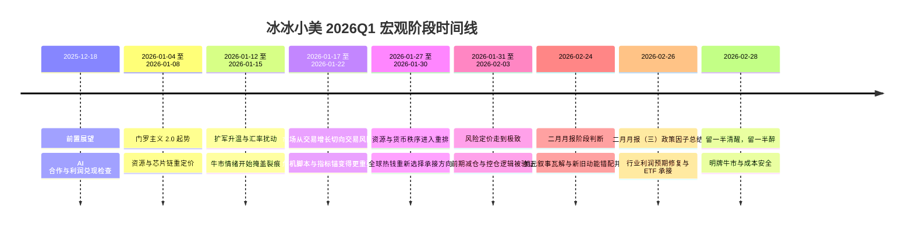

# 冰冰小美 2026Q1 宏观阶段时间线

## 总观点

这批材料最值得保留的，不是某一条单独的市场判断，而是 [[people/冰冰小美|冰冰小美]] 如何先在 2025 年末给出 2026 年一季度前置检查表，再在 2026 年一季度把宏观事件翻译成一条连续的“事件 -> 资产主线 -> 仓位动作”链条。

她不是单纯把地缘事件当新闻点评，而是持续把：

- 美国战略收缩与门罗主义回摆
- 汇率、流动性与全球风险定价
- 资源争夺、产业链重组与国产替代
- 题材抱团、指数韧性与个股分化
- AI 合作、铜价成本、设备利润、出海利润和十五五开局

放进同一张图里理解，并据此把仓位从进攻逐步切到防守、兑现与等待极端波动。

## 时间线

| 时间范围 | 阶段 | 核心变化 | 对应正文 |
|---|---|---|---|
| 2025-12-18 | 前置展望 | 从 AI 合作切向利润兑现和成本压力检查 | 见下文第 0 阶段 |
| 2026-01-04 至 2026-01-08 | 门罗主义 2.0 起势 | 风险先在资源与芯片链重定价 | 见下文第 1 阶段 |
| 2026-01-12 至 2026-01-15 | 扩军升温与汇率扰动 | 牛市情绪开始掩盖裂痕 | 见下文第 2 阶段 |
| 2026-01-17 至 2026-01-22 | 市场从交易增长切向交易风险 | 危机脚本与指标锚变得更重要 | 见下文第 3 阶段 |
| 2026-01-27 至 2026-01-30 | 资源与货币秩序进入重排 | 全球热钱重新选择承接方向 | 见下文第 4 阶段 |
| 2026-01-31 至 2026-02-03 | 风险定价走到极致 | 前期减仓与控仓逻辑被验证 | 见下文第 5 阶段 |
| 2026-02-24 | 二月月报阶段判断 | 美元叙事瓦解与新旧动能错配并行 | 见下文第 6 阶段 |
| 2026-02-26 | 二月月报（三）政策因子总结 | 顺周期与通胀预期转向行业利润预期修复 | 见下文第 7 阶段 |
| 2026-02-28 | 留一半清醒，留一半醉 | 明牌牛市与风险成本安全并行 | 见下文第 8 阶段 |

## 竖向时间线

### 0. 前置展望，从 AI 合作切向利润兑现

在 [[sources/articles/2025-12-18-冰冰小美：2026年一季度展望|2026年一季度展望]] 中，作者已经把 2026 年一季度的观察重点提前压成一张检查表：

- AI 合作会推动需求端变化，但也会同步推高铜等战略金属需求；
- 铜价上涨可能变成下游 AI 设备链成本压力，尤其是同质化、缺少技术壁垒的企业；
- 一季度财报若出现营收增长但利润停滞，高估值和高增长预期就需要重新验证；
- 联储换届、扩表条件、十五五开局、内需优先和出海利润兑现，会共同决定资产从流动性拉升切向利润推动的速度。

因此，这个节点不是已经发生的 Q1 复盘，而是后续 2026 年一季度材料的前置验证框架。相关观点见 [[views/冰冰小美：2026年一季度从AI合作切向利润兑现的展望|2026 年一季度从 AI 合作切向利润兑现的展望]]。

### 1. 门罗主义 2.0 起势，风险先在资源与芯片链重定价

这一阶段的主轴是“美国在南美方向的强势动作，如何通过资源、石油美元和地缘再分工，传导到全球资本市场”。

按 [[sources/articles/2026-03-25-冰冰小美-2026一季度宏观子帖抓取（已完成41篇）|冰冰小美 - 2026Q1 宏观子帖抓取（已完成 41 篇）]] 里已抓到的前 12 篇原文，[[people/冰冰小美|冰冰小美]] 的判断大致是：

- 南美资源与石油链条不只是局部地缘冲突，而是美国重新绑定后花园、争夺资源与制造业回流的一部分
- 韩国访华、中日韩关系与外贸法变化，会进一步把市场主线推向芯片设备、光刻胶、半导体国产替代
- 人民币升值与汇率预期会在一季度继续支撑资产，但这条线不会无条件单边延续

这时她的动作不是全线梭哈，而是保留资源链和芯片链核心仓，同时更重视兑现和防守。

### 2. 扩军升温与汇率扰动，牛市情绪开始掩盖裂痕

这一阶段，她明显把重点从“主线是什么”推进到“主线还能不能继续顺滑演绎”。

根据这一阶段已抓到的原文，她认为：

- 国际局势和军事扩张让宏观不确定性快速抬升
- 顺周期并不是长逻辑结束，而是短期阻力和波动开始增大
- 卫星通信、商业航天等抱团题材在透支预期，指数韧性并不代表赚钱效应仍然健康

所以仓位层面的对应动作是减仓和收缩，而不是继续机械追涨。

### 3. 市场从交易增长切向交易风险

这一阶段在补抓完成后，可以看到她的表达比母页摘要还多了一层“危机脚本与指标锚”的味道。

结合这一阶段的原文，她大致在做三件事：

- 借历史泡沫破灭案例强调，危机不会机械重复，但治理红线、政策约束和风险处置经验会不断改写新一轮泡沫的展开方式
- 把白银、黄金再涨解释成全球割裂和立场重估，而不只是单一品种行情
- 把特朗普、联储、美元信用货币与黄金货币形态的对决放进同一张图里，同时反复强调要先做“底线思维”，推演最坏情形

因此，这一阶段她并不是简单转空，而是开始把“如何在全球风险演绎中保住仓位和机动性”摆到比追逐局部热点更高的位置。

### 4. 资源与货币秩序进入重排

补抓回来的月报和月底帖子让这一阶段更清楚了：她在 1 月底已经把主线从“局部题材轮动”推进到“全球热钱从哪里撤、又往哪里去”。

这几篇原文的共同点是：

- 用白银资产历史周期、比特币见顶回落和热钱转移，解释为何贵金属、大宗和石油链突然承接了更多注意力
- 不再把波动理解成单纯情绪，而是把它放进全球通胀预期、货币秩序竞争和资本再配置里看
- 在持仓层面更强调“哪些仓位只是阶段使命，哪些仓位必须回到长期主义初心”
- [[views/冰冰小美：白银货币史映射日本国运与工业约束的判断框架|《白银与经济危机以及日本野心》]] 将白银放回银本位、日本工业化和当代工业用银约束；[[views/冰冰小美：货币安全性与全球热钱迁移的判断框架|《货币体系变迁与全球资本热钱涌动的背后安全性的考量》]] 则把门罗主义 2.0、欧美裂痕、美债安全性和热钱迁移压成同一组货币安全性判断。

这里最关键的不是继续找下一个热题材，而是确认旧主线正在被更大级别的资源与货币秩序重排所重写。

### 5. 风险定价走到极致，前期减仓被证明是对的

补抓完成后，这一阶段的核心不再只是“市场很危险”，而是她已经明确给出了一套观察风险释放是否真正升级的锚点。

从这一阶段的原文看，她重点在看：

- `标普500 / gold` 这类比值是否继续指向危机到来
- 白银动荡、股指期货做空和舆论恐慌，是否只是情绪冲击，还是一次蓄谋已久的做空计划
- 人民币汇率、A50 成分权重、高端装备出海等结构线索，能否说明“指数受压”和“真实产业逻辑”其实在分化

所以她最后的落点仍然不是激进抄底，而是再次确认：

- 前面连续减仓和控仓是必要动作
- 高位题材的兑现、踩踏和波动会比指数表面更剧烈
- 真正的机会往往来自前面半年早已完成的建仓，而不是危机最响的时候才临时起意

也就是说，她的一季度复盘不是“预测故事”，而是在验证一套仓位管理、风险监测和等待时机的逻辑。

### 6. 二月月报阶段判断，美元叙事瓦解与新旧动能错配并行

2 月 24 日两篇月报把一季度阶段判断从“风险释放与仓位验证”继续推进到两条并行链。

第一条链见 [[sources/articles/2026-02-24-冰冰小美：2026年二月月报|2026年二月月报]]：作者把比特币和 AI 视为美元吸纳全球资金的叙事载体，认为当这两条叙事转弱时，热钱会重新寻找安全性与回报率，先流向贵金属、大宗和资源资产，再观察中国资产是否具备承接条件。相关观点见 [[views/冰冰小美：美元叙事瓦解推动资源货币与中国资产重估的判断框架|美元叙事瓦解推动资源货币与中国资产重估]]，对应推导见 [[reasoning/冰冰小美-美元叙事瓦解如何传导为资源货币重排与中国资产重估|美元叙事瓦解如何传导为资源货币重排与中国资产重估]]。

第二条链见 [[sources/articles/2026-02-24-冰冰小美：2026年二月月报（二）|2026年二月月报（二）]]：作者把京东、美团、阿里等旧平台流量竞争，和 AI 新入口、技术改造、出海、高附加值企业重估放在同一组结构性行情里，强调市场并非无差别反弹，而是在新旧动能错配中寻找更能兑现利润和确定性的企业。相关观点见 [[views/冰冰小美：新旧动能错配推动高质量企业重估的判断框架|新旧动能错配推动高质量企业重估]]，对应推导见 [[reasoning/冰冰小美-新旧动能错配如何传导为结构性行情与仓位调整|新旧动能错配如何传导为结构性行情与仓位调整]]。

这一阶段仍属于作者阶段判断，涉及美元信用、比特币、AI、资源资产、中国资产和具体企业样本的内容，均需按观点和待验证变量处理，不应写成已验证结论。

### 7. 二月月报（三），政策因子推动顺周期和通胀预期行情

2 月 26 日的 [[sources/articles/2026-02-26-冰冰小美：2026年二月月报（三）|2026年二月月报（三）]] 把二月行情进一步压到“政策因子如何改善行业未来利润预期”。作者列出的行业覆盖有色金属、稀有金属、石油化工与运输、化工新材料、钾肥磷肥、电池材料、光伏建材、AI 上游材料、存储芯片和半导体材料设备。

这一阶段的新增价值在于，它把前两篇月报中的宏观和结构性判断继续落到行业层面：反内卷、出口退税、战略资源规划、贸易协定、十五五传统产业转型、地产放松、国际合作、AI 上游需求、关税反复和人民币流动性修复，共同指向顺周期或通胀预期主导的行业预期修复。相关观点见 [[views/冰冰小美：政策因子推动顺周期与通胀预期行情的判断框架|政策因子推动顺周期与通胀预期行情]]，对应推导见 [[reasoning/冰冰小美-政策因子如何传导为行业利润预期修复与ETF承接|政策因子如何传导为行业利润预期修复与ETF承接]]。

这条链的验证点不在“品种是否被点名”，而在涨价、期货突破、库存底部和政策预期能否真正转成行业利润率修复；作者也提示一季度报可能因为“有价无市”或利润兑现不足而出现分化。

### 8. 留一半清醒，留一半醉：明牌牛市与风险成本安全并行

2 月 28 日的 [[sources/articles/2026-02-28-冰冰小美：留一半清醒|《留一半清醒，留一半醉》]] 把前面几篇二月月报继续压成阶段总判断：上半年密集事件、重大人事调整和地缘节点让宏观路径更明牌，资金流速趋同，容易形成共识性上涨；但这条牛市线必须同时保留风险意识。

作者把门罗主义 2.0、米伊局势、石油美元、AI基础设施和电力约束、比特币监管、热钱迁移、日韩台牛市、全球通胀、国内反内卷和再通胀放进同一条链。相关观点见 [[views/冰冰小美：明牌牛市中风险与机遇交织的判断框架|明牌牛市中风险与机遇交织]]，对应推导见 [[reasoning/冰冰小美-明牌宏观如何传导为热钱迁移再通胀与成本安全|明牌宏观如何传导为热钱迁移再通胀与成本安全]]。

这一阶段的仓位含义更明确：牛市会强化投机性，但作者强调真正的优势来自行情到来前的低成本和仓位配置，最好能在金融危机传导时仍然全身而退。

## 方法论含义

这批材料对知识库最有价值的，是补全了 [[people/冰冰小美|冰冰小美]] 的一个稳定特征：

- 她会把宏观事件拆成阶段，而不是孤立判断
- 每个阶段都同时回答“发生了什么”“哪些资产先反应”“仓位该怎么调”
- 她的宏观分析最终总会落回市场结构与仓位控制，而不是停在抽象叙事
- `2026-01` 材料中的“四大方向”和 `2026-05-27` 复盘中的“三大配置”，构成同一套交易风格的前后验证：先在宏观阶段中确定战略资源、支柱产业、新兴产业等配置线，再用后续行情复盘检验不同主线的轮动兑现。

这让她与单纯做宏观评论的作者不同，也让这批材料可以稳定挂接到 [[topics/宏观经济|宏观经济]]。

对应概念见 [[concepts/冰冰小美-三大配置|冰冰小美-三大配置]]。

对应仓位推导见 [[reasoning/冰冰小美-2026年1月宏观风险如何传导为仓位控制|冰冰小美-2026年1月宏观风险如何传导为仓位控制]]。

## 当前边界

- 截至 `2026-04-23`，母页里列出的 `41` 篇子帖已全部抓取完成，首轮触发风控与补抓过程记录保留在 [[sources/articles/2026-03-25-冰冰小美-2026一季度宏观子帖补抓记录|冰冰小美 - 2026Q1 宏观子帖补抓记录]]。
- [[sources/articles/2025-12-18-冰冰小美：2026年一季度展望|2026年一季度展望]] 是事前判断，后续 2026 年一季度子帖和复盘材料是事后演绎；本页保留二者差异，不把前瞻直接写成已验证结论。
- 即便原文已经补齐，这份页面仍然首先是阶段地图和方法论入口，而不是把 41 篇帖子逐条拆开的细粒度观点库。
- 后续如果要继续深化，最自然的动作不是再扩写本页，而是从这里面继续筛出最稳定的几条判断，拆成新的 `view` 或补厚现有 `topic`。
