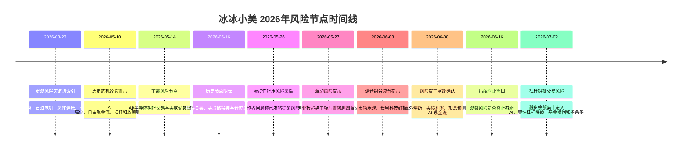

# 冰冰小美-2026年风险节点时间线

## 页面定位

[[冰冰小美-风险节点记录|冰冰小美-风险节点记录]] 用来记录 [[people/冰冰小美|冰冰小美]] 在 2026 年风险提示系列中的关键时间顺序。2026-03-23 节点来自外部整理者的链接索引，不等同于冰冰小美本人在当日发布的风险判断。

本页只处理“先后顺序”和“阶段位置”：哪些节点先出现，哪些节点是风险提示，哪些节点是减仓提示，哪些节点是后续验证窗口。完整因果传导见 [[reasoning/冰冰小美-6月8日风险如何由流动性挤压扩散为宏观危机|6月8日风险如何由流动性挤压扩散为宏观危机]]。

---

## 核心问题

> 2026 年 3 月至 7 月，冰冰小美相关材料如何把宏观风险关键词、历史危机经验、宏观时间窗口、流动性挤压、指数与个股波动、海外熔断、仓位动作和 AI 杠杆拥挤串成一条风险提示链？

---

## 阶段总览

| 阶段 | 时间范围 | 核心特征 | 当前状态 |
|---|---|---|---|
| 核心仓压力前史 | 2025-11-21 | 核心仓首次遭遇冲击，中芯国际 H、西部矿业、江淮汽车、化工 ETF 等出现箱体和恐慌波动 | 已补入前史节点 |
| 宏观风险索引 | 2026-03-23 | 外部整理者按全球局势、石油危机、恶性通胀和军事冲突抓取 40 个冰冰小美链接 | 已归档，原帖待逐篇核验 |
| 历史经验预警 | 2026-05-10 | 用历史危机、AI 高位、自由现金流、杠杆和政策错配提示泡沫风险边界 | 已整理 |
| 宏观节点预警 | 2026-05-14 至 2026-05-16 | 中美关系、美联储、美国财政与历史节点阴云共同提高仓位风险 | 已整理 |
| 流动性挤压识别 | 2026-05-26 | 作者称意识到流动性挤压风险来临，并发帖提醒风险 | 来源回溯中 |
| 波动风险提示 | 2026-05-27 | 创业板超越主板时提示波动风险，警惕乐观情绪和个股剧烈波动 | 来源部分已整理 |
| 减仓提示 | 2026-06-03 | 市场再次乐观、长电科技封板时，通过调仓组合减仓表达风险升高 | 来源回溯中 |
| 风险提前演绎确认 | 2026-06-08 | 作者认为风险从单一市场因子扩散到美债、海外熔断、加息预期、汇率贸易和 AI 现金流 | 已整理 |
| 后续验证窗口 | 2026-06-16 前后 | 原文认为 6/16 节点尚未到来，风险不能视为解除，需要等待风险减弱 | 待验证 |
| 杠杆拥挤交易风险 | 2026-07-02 | 从融资余额突破、AI 相关新增融资集中、杠杆爆破、基金赎回和获利盘卖出识别多杀多流动性踩踏 | 已整理，数据待核验 |

---

## 时间线索引

| 日期 | 节点 | 阶段 | 详情 |
|---|---|---|---|
| 2025-11-21 | 核心仓首次遭遇冲击 | 核心仓压力前史 | [[#2025-11-21｜核心仓首次遭遇冲击]] |
| 2026-03-23 | 宏观风险关键词文章索引 | 宏观风险索引 | [[#2026-03-23｜宏观风险关键词文章索引]] |
| 2026-05-10 | 历史危机经验警示 AI 高位风险 | 历史经验预警 | [[#2026-05-10｜历史危机经验警示 AI 高位风险]] |
| 2026-05-14 | 前置风险节点推导 | 宏观节点预警 | [[#2026-05-14｜前置风险节点推导]] |
| 2026-05-16 | 历史节点阴云与仓位风险 | 宏观节点预警 | [[#2026-05-16｜历史节点阴云与仓位风险]] |
| 2026-05-26 | 流动性挤压风险来临 | 流动性挤压识别 | [[#2026-05-26｜流动性挤压风险来临]] |
| 2026-05-27 | 创业板超越主板后的波动风险提示 | 波动风险提示 | [[#2026-05-27｜创业板超越主板后的波动风险提示]] |
| 2026-06-03 | 长电科技封板时调仓组合减仓 | 减仓提示 | [[#2026-06-03｜长电科技封板时调仓组合减仓]] |
| 2026-06-08 | 风险提前到来与流动性危机 | 风险提前演绎确认 | [[#2026-06-08｜风险提前到来与流动性危机]] |
| 2026-06-16 | 风险是否减弱的验证窗口 | 后续验证窗口 | [[#2026-06-16｜风险是否减弱的验证窗口]] |
| 2026-07-02 | 杠杆拥挤交易风险提示 | 杠杆拥挤交易风险 | [[#2026-07-02｜杠杆拥挤交易风险提示]] |

---

## 竖向时间线

---

## 时间线正文

### 2025-11-21｜核心仓首次遭遇冲击

- **节点类型**：流动性辩证分析 / 风险节点
- **阶段位置**：核心仓压力前史
- **事实记录**：
  - [[sources/articles/2025-11-21-冰冰小美：本周总结|2025-11-21《本周总结》]] 中，作者记录“核心仓第一次遭遇冲击”，并提到中芯国际 H 跌破 72、西部矿业冲击 24 失败、江淮汽车冲击 50 失败、化工 ETF 受恐慌情绪剧烈波动。
- **作者观点**：
  - 该帖更像一次交易复盘：不是宏观危机定性，而是记录核心仓、T 出、ETF 波动和价值投机大波动同时出现后的账户压力。
- **我的推断**：
  - 这个节点可作为后续风险线的前史：当核心仓也开始承受冲击时，风险不再只停留在小盘题材或边缘交易，而开始进入作者的核心持仓和风险承受力检查。
- **影响说明**：
  - 它提醒后续复盘不能只看指数或外部宏观变量，还要看核心仓是否破位、箱体震荡下轨是否失守、ETF 是否受到恐慌情绪拖累。
- **后续验证**：
  - 观察核心仓冲击是否只是箱体内波动，还是进一步传导为融资盘、基金赎回或主线逻辑变化。
- **证据 / 来源**：
  - [[sources/articles/2025-11-21-冰冰小美：本周总结|2025-11-21《本周总结》]]
- **关联页面**：
  - [[concepts/冰冰小美-concept-风险类型整理|风险类型整理]]
  - [[concepts/冰冰小美-framework-复盘|复盘]]

### 2026-03-23｜宏观风险关键词文章索引

- **节点类型**：流动性辩证分析 / 风险节点
- **阶段位置**：宏观风险索引
- **事实记录**：
  - 投资相声口儿在雪球发布 [[sources/articles/2026-03-23-投资相声口儿：冰冰小美宏观风险关键词文章|2026-03-23《冰冰小美宏观风险关键词文章》]]，按“全球局势 宏观风险”“石油危机”“恶性通胀”“军事冲突”抓取 40 个冰冰小美相关链接。
  - 该帖子是外部索引帖，不是冰冰小美本人原帖。
- **作者观点**：
  - 外部整理者认为雪球搜索对多个关键词匹配不精准，因此手动整理风险关键词文章入口。
- **我的推断**：
  - 这个节点可作为 2026 年 1-3 月宏观风险材料的回溯入口，尤其适合补查石油危机、恶性通胀和军事冲突如何进入 [[冰冰小美-宏观信号表|宏观风险信号表]]。
- **影响说明**：
  - 它不直接构成风险结论，但能把分散在多篇冰冰小美帖中的宏观风险变量聚合起来，方便后续补齐具体来源。
- **后续验证**：
  - 逐篇打开索引中的冰冰小美原帖，确认每篇的发布时间、完整上下文和观点边界。
  - 检查重复链接，如 `370990492` 和 `380181997`，避免在正式知识页中重复计数。
- **证据 / 来源**：
  - [[sources/articles/2026-03-23-投资相声口儿：冰冰小美宏观风险关键词文章|2026-03-23《冰冰小美宏观风险关键词文章》]]
- **关联页面**：
  - [[topics/冰冰小美-风险提示系列|冰冰小美-风险提示系列]]
  - [[冰冰小美-宏观信号表|宏观风险信号表]]
  - [[topics/冰冰小美-宏观经济|宏观经济]]

### 2026-05-10｜历史危机经验警示 AI 高位风险

- **节点类型**：流动性辩证分析 / 风险节点
- **阶段位置**：历史经验预警
- **事实记录**：
  - 知识库已整理 [[sources/articles/2026-05-10-冰冰小美：历史危机的经验与警示|2026-05-10《历史危机的经验与警示》]]。
- **作者观点**：
  - 作者用历史危机经验提示 AI 和半导体高位风险，重点观察自由现金流、资本开支、杠杆、估值和政策错配。
- **我的推断**：
  - 这个节点更像 6 月风险提示的“历史参照系”：先建立危机经验，再在后续市场波动中寻找相似变量。
- **影响说明**：
  - 为后续观察 AI 资本开支、融资需求和科技股估值压力提供背景。
- **后续验证**：
  - 观察 AI 巨头资本开支是否继续扩大，自由现金流是否恶化，融资需求是否反常增加。
- **证据 / 来源**：
  - [[sources/articles/2026-05-10-冰冰小美：历史危机的经验与警示|2026-05-10《历史危机的经验与警示》]]
- **关联页面**：
  - [[views/冰冰小美：历史危机经验提示AI高位风险边界的判断框架|历史危机经验提示 AI 高位风险边界]]
  - [[reasoning/冰冰小美-历史危机经验如何传导为AI资本开支风险预警|历史危机经验如何传导为 AI 资本开支风险预警]]

### 2026-05-14｜前置风险节点推导

- **节点类型**：流动性辩证分析 / 风险节点
- **阶段位置**：宏观节点预警
- **事实记录**：
  - 知识库已有 [[reasoning/冰冰小美-5月14日风险节点推导|5月14日风险节点推导]]。
- **作者观点**：
  - 该节点将 AI/半导体拥挤交易、资本开支融资现实、美联储数据、中美科技外交结果和情绪流动性共振压成风险节点。
- **我的推断**：
  - 5 月中旬已经形成“风险窗口”意识，6 月 8 日文章则是在回看 5 月下旬到 6 月上旬的风险演绎。
- **影响说明**：
  - 使后续 5/26、5/27、6/3、6/8 的提示不是孤立喊风险，而是同一风险窗口的连续展开。
- **后续验证**：
  - 检查后续作者是否继续把美联储、AI 资本开支、流动性和仓位控制放在同一组变量中。
- **证据 / 来源**：
  - [[reasoning/冰冰小美-5月14日风险节点推导|5月14日风险节点推导]]
- **关联页面**：
  - [[topics/冰冰小美-情绪体系理论篇|体系三要素]]
  - [[冰冰小美-宏观信号表|宏观风险信号表]]

### 2026-05-16｜历史节点阴云与仓位风险

- **节点类型**：流动性辩证分析 / 风险节点
- **阶段位置**：宏观节点预警
- **事实记录**：
  - 知识库已整理 [[sources/articles/2026-05-16-冰冰小美：历史节点总是阴云密布|2026-05-16《历史节点总是阴云密布》]]。
- **作者观点**：
  - 作者把历史节点、中美关系、美联储换帅、美国债务压力和仓位风险放在同一判断框架中。
- **我的推断**：
  - 这一步把风险从市场风格问题抬升到宏观制度与货币政策层面。
- **影响说明**：
  - 为后续“风险从单一市场因子扩散到大宏观因子”的说法提供前置语境。
- **后续验证**：
  - 观察美联储政策、美债利率、美元指数和中美关系是否继续构成风险压力。
- **证据 / 来源**：
  - [[sources/articles/2026-05-16-冰冰小美：历史节点总是阴云密布|2026-05-16《历史节点总是阴云密布》]]
- **关联页面**：
  - [[views/冰冰小美：历史节点阴云下中美实用主义与风险仓位的判断框架|历史节点阴云下中美实用主义与风险仓位]]
  - [[reasoning/冰冰小美-历史节点如何由中美关系与美联储换帅传导为仓位风险控制|历史节点如何由中美关系与美联储换帅传导为仓位风险控制]]

### 2026-05-26｜流动性挤压风险来临

- **节点类型**：流动性辩证分析 / 风险节点
- **阶段位置**：流动性挤压识别
- **事实记录**：
  - 2026-06-08 原文回顾称：`5-26，意识到流动性挤压风险来临。回来发帖提醒风险。`
- **作者观点**：
  - 作者认为流动性挤压风险已经开始出现，需要提醒风险。
- **我的推断**：
  - 这是本轮 6 月风险线的启动节点，风险从“宏观可能性”进入“交易层需要处理”的阶段。
- **影响说明**：
  - 后续指数巨大波动、个股剧烈波动和单边下跌，都被作者视为这一流动性挤压风险的验证。
- **后续验证**：
  - 回溯 2026-05-26 原帖，确认当日作者具体观察了哪些市场信号。
- **证据 / 来源**：
  - [[sources/articles/2026-06-08-冰冰小美：风险提前到来与流动性危机|2026-06-08《风险提前到来与流动性危机》]]
- **关联页面**：
  - [[views/冰冰小美：流动性挤压风险提前演绎的判断框架|流动性挤压风险提前演绎]]
  - [[concepts/冰冰小美-波动风险|波动风险]]

### 2026-05-27｜创业板超越主板后的波动风险提示

- **节点类型**：流动性辩证分析 / 风险节点
- **阶段位置**：波动风险提示
- **事实记录**：
  - 2026-06-08 原文回顾称：`5-27，创业板超越主板，提示波动风险，罕见的用“死”。希望敲响警钟。`
- **作者观点**：
  - 当创业板相对主板表现更强时，作者提示波动风险，并用强烈措辞提醒风险。
- **我的推断**：
  - 作者不是把成长风格占优直接视为买入信号，而是把它放在情绪位置、流动性和拥挤交易中检查。
- **影响说明**：
  - 该节点把“行情强”与“风险低”区分开来，接近 [[reasoning/冰冰小美如何判断风险转弱的节点|风险转弱节点框架]] 中“行情不等于风险转弱”的逻辑。
- **后续验证**：
  - 回溯 2026-05-27 原帖，确认“死”对应的具体语境和风险对象。
- **证据 / 来源**：
  - [[sources/articles/2026-06-08-冰冰小美：风险提前到来与流动性危机|2026-06-08《风险提前到来与流动性危机》]]
  - [[sources/articles/2026-05-27-冰冰小美：本轮行情的一些遗憾|2026-05-27《本轮行情的一些遗憾》]]
- **关联页面**：
  - [[views/冰冰小美：流动性挤压风险提前演绎的判断框架|流动性挤压风险提前演绎]]
  - [[concepts/冰冰小美-波动风险|波动风险]]
  - [[reasoning/冰冰小美如何判断风险转弱的节点|风险转弱节点框架]]

### 2026-06-08｜风险提前到来与流动性危机

- **节点类型**：流动性辩证分析 / 风险节点
- **阶段位置**：风险提前演绎确认
- **事实记录**：
  - 冰冰小美在雪球发布风险提示长文，用户补充当日背景包括韩国熔断、纳指大幅下跌等。
  - 来源页已标注：韩国 KOSPI 熔断已初步公开核验；纳指“约 5%”按用户背景保存，但公开检索暂核验为约 4.18%，待正式行情源复核。
- **作者观点**：
  - 作者认为风险已经从流动性挤压扩散到美债利率、美国融资、韩国熔断、美联储政策、非农数据、加息预期、贸易冲突、日元美元流动性、AI 资本开支和自由现金流验证。
  - 6/16 节点尚未到来，因此风险不能视为解除。
- **我的推断**：
  - 这是本轮时间线的“阶段确认点”：前面多个提示被作者合并解释为同一条流动性危机演绎链。
- **影响说明**：
  - 交易含义从“识别风险”升级为“以风险减弱节点视角交易，保住本金，等待下一次机会”。
- **后续验证**：
  - 复核美债收益率、美元指数、韩国市场、纳指跌幅、AI 巨头融资与自由现金流数据。
  - 观察 6/16 前后风险是否真正减弱。
- **证据 / 来源**：
  - [[sources/articles/2026-06-08-冰冰小美：风险提前到来与流动性危机|2026-06-08《风险提前到来与流动性危机》]]
- **关联页面**：
  - [[views/冰冰小美：流动性挤压风险提前演绎的判断框架|流动性挤压风险提前演绎]]
  - [[reasoning/冰冰小美-6月8日风险如何由流动性挤压扩散为宏观危机|6月8日风险如何由流动性挤压扩散为宏观危机]]
  - [[topics/冰冰小美-风险提示系列|冰冰小美-风险提示系列]]

### 2026-06-16｜风险减弱节点的验证窗口

- **节点类型**：流动性辩证分析 / 风险节点
- **阶段位置**：后续验证窗口
- **事实记录**：
  - 2026-06-08 原文称：`时间表6/16的节点，风险提前到来。但是6/16并没有到来，这种风险并没有解除。`
- **作者观点**：
  - 风险提前演绎，不等于风险提前解除；交易应以风险减弱节点视角保持谨慎。
- **我的推断**：
  - 6/16 在本时间线里不是买卖指令，而是观察风险是否从扩散转向收敛的验证窗口。
- **影响说明**：
  - 若到 6/16 前后美债、美元、海外波动、A 股流动性和 AI 现金流风险仍未缓和，则风险提示仍应保持有效。
- **后续验证**：
  - 是否出现风险减弱信号：海外波动收敛、美债收益率回落、美元流动性压力缓和、A 股亏钱效应减弱、核心资产不再无差别下跌。
- **证据 / 来源**：
  - [[sources/articles/2026-06-08-冰冰小美：风险提前到来与流动性危机|2026-06-08《风险提前到来与流动性危机》]]
- **关联页面**：
  - [[reasoning/冰冰小美如何判断风险转弱的节点|风险转弱节点框架]]
  - [[concepts/冰冰小美-rule-减仓|冰冰小美减仓规则]]

### 2026-07-02｜杠杆拥挤交易风险提示

- **节点类型**：流动性辩证分析 / 风险节点
- **阶段位置**：杠杆拥挤交易风险
- **事实记录**：
  - 用户提供 [[sources/articles/2026-07-02-冰冰小美：这是什么风险|2026-07-02《这是什么风险》]]，原文讨论融资余额突破 3 万亿、新增融资余额高度涌入 AI 相关、极端走势下杠杆爆破、基金赎回、获利盘卖出和多杀多。
  - 知识库已将该风险整理为 [[concepts/冰冰小美-杠杆拥挤交易风险|杠杆拥挤交易风险]]。
- **作者观点**：
  - 作者认为极端走势下杠杆爆破是确定性风险之一，杠杆资金会同时放大上涨波动和向下波动。
  - 当新增融资余额高度集中到 AI 相关方向时，市场会弱化资产配置功能，并可能在下跌时触发场外基金赎回和获利盘卖出，形成多杀多的流动性踩踏。
  - 全面恐慌下跌也可能让部分因偏见和流动性衰竭而下跌的个股进入观察视野，但这仍取决于恐慌是否充分、承接是否出现以及长期资金是否愿意介入。
- **我的推断**：
  - 这是 5 月至 6 月“宏观流动性挤压”之后，风险线向“交易结构拥挤”和“AI 方向杠杆集中”延伸的节点。
  - 它把此前的 AI 高位、自由现金流、流动性危机、风险转弱观察，进一步落到融资余额集中度、基金赎回和获利盘兑现这组可观察变量上。
- **影响说明**：
  - 交易含义不是机械做空 AI，而是识别热门方向的杠杆脆弱性：上涨越由杠杆和一致预期推动，下跌时越容易从回调升级为踩踏。
  - 恐慌后的观察对象也要区分“被流动性错杀”与“缺少长期资金承接”，不能把下跌本身直接等同于机会。
- **后续验证**：
  - 核验“融资余额突破 3 万亿”和“新增融资余额 95% 涌入 AI 相关”的数据口径。
  - 观察 AI 相关方向是否出现融资盘被动降杠杆、基金赎回、获利盘集中兑现、跌停扩散和成交承接减弱。
  - 观察老登方向是否有长期资金介入，而不是只有短线热钱避险或低位轮动。
- **证据 / 来源**：
  - [[sources/articles/2026-07-02-冰冰小美：这是什么风险|2026-07-02《这是什么风险》]]
- **关联页面**：
  - [[concepts/冰冰小美-杠杆拥挤交易风险|杠杆拥挤交易风险]]
  - [[concepts/冰冰小美-concept-流动性辩证分析|流动性辩证分析]]
  - [[concepts/冰冰小美-波动风险|波动风险]]
  - [[topics/冰冰小美-AI产业趋势|AI产业趋势]]

---

## 事实、观点、推断分离

### 事实

- `2026-06-08`：用户提供冰冰小美雪球原文，原文明确回顾 5/26、5/27、6/3、6/8 四个风险提示或减仓提示节点。
- `2026-03-23`：投资相声口儿发布冰冰小美宏观风险关键词索引帖，正文抓取到 40 个冰冰小美链接，分属全球局势/宏观风险、石油危机、恶性通胀、军事冲突四组。
- `2026-06-08`：用户补充韩国熔断、纳指大幅下跌等当天背景；来源页已将韩国熔断和纳指跌幅分别标注核验状态。
- `2026-07-02`：用户提供冰冰小美雪球原文，原文明确讨论融资余额集中进入 AI 后的杠杆爆破、基金赎回、获利盘卖出和多杀多风险。

### 作者观点

- `2026-05-26`：作者称意识到流动性挤压风险来临。
- `2026-05-27`：作者称创业板超越主板后提示波动风险。
- `2026-06-03`：作者称市场再次乐观、长电科技封板时，通过调仓组合减仓提示风险。
- `2026-06-08`：作者认为风险已经从单一市场因子扩散到大宏观因子，6/16 未到来前风险不能视为解除。
- `2026-07-02`：作者认为极端走势下杠杆爆破、场外基金赎回和获利盘卖出可能共同触发多杀多流动性踩踏。

### 我的推断

- 5/26 是本轮流动性挤压风险的启动识别点。
- 3/23 外部索引帖适合作为宏观风险材料回溯入口，但不能替代冰冰小美原帖本身。
- 5/27 是“强行情也可能对应高风险”的波动风险提示点。
- 6/3 是风险识别落到仓位暴露调整的执行节点。
- 6/8 是作者对前序风险提示的阶段性合并解释。
- 7/2 是风险线从宏观流动性挤压延伸到交易结构拥挤、AI 杠杆集中和多杀多踩踏的节点。

### 待验证

- 2026-05-26、2026-05-27、2026-06-03 对应原帖仍需继续回溯，当前主要依据 2026-06-08 原文回顾。
- 2026-03-23 索引帖中的 40 个链接仍需逐篇核验，当前只保存链接和可见摘要。
- 2026-06-08 当日纳指跌幅、10 年美债收益率、AI 巨头融资等市场数据需要继续用正式行情和新闻源复核。
- 2026-06-16 是否构成风险转弱节点，必须等待后续市场行为验证。
- 2026-07-02 原文中的融资余额突破 3 万亿、新增融资余额 95% 涌入 AI 相关等数据口径需要继续核验。

---

## 后续验证点

- **2026-06-16 前后**：观察风险是否真正减弱，而不是只出现弱势反弹。
- **美债收益率**：10 年美债收益率是否继续维持高位或突破关键压力。
- **美元与日元**：美元指数和日元贬值是否继续放大全球美元流动性压力。
- **海外市场**：韩国、美股科技股和高估值资产波动是否收敛。
- **A 股内部**：是否仍是“无论什么板块都下跌”的多杀多状态。
- **AI 资本开支**：AI 巨头是否继续用融资维持高资本开支，自由现金流是否被市场重新审视。
- **融资余额集中度**：新增融资余额是否仍高度集中到 AI 相关方向。
- **基金赎回和获利盘**：场外基金赎回和高位获利盘兑现是否继续放大下跌。
- **仓位动作**：作者后续组合是否继续减仓、防守，或开始提示风险转弱。

---

## 相关观点

- [[views/冰冰小美：流动性挤压风险提前演绎的判断框架|流动性挤压风险提前演绎]]：记录 2026-06-08 风险提示的阶段判断。
- [[views/冰冰小美：历史危机经验提示AI高位风险边界的判断框架|历史危机经验提示 AI 高位风险边界]]：提供 5 月历史危机预警背景。
- [[views/冰冰小美：历史节点阴云下中美实用主义与风险仓位的判断框架|历史节点阴云下中美实用主义与风险仓位]]：提供 5 月中旬历史节点和宏观仓位背景。

## 相关推导

- [[reasoning/冰冰小美-6月8日风险如何由流动性挤压扩散为宏观危机|6月8日风险如何由流动性挤压扩散为宏观危机]]：解释 6/8 风险扩散链条。
- [[reasoning/冰冰小美-5月14日风险节点推导|5月14日风险节点推导]]：提供前置风险节点。
- [[reasoning/冰冰小美-历史危机经验如何传导为AI资本开支风险预警|历史危机经验如何传导为 AI 资本开支风险预警]]：解释历史危机经验如何映射到 AI 资本开支。

## 相关概念

- [[reasoning/冰冰小美如何判断风险转弱的节点|风险转弱节点框架]]：判断风险是否从扩散进入可承接状态。
- [[concepts/冰冰小美-波动风险|波动风险]]：解释风险未转弱时指数和个股剧烈波动。
- [[concepts/冰冰小美-杠杆拥挤交易风险|杠杆拥挤交易风险]]：解释融资余额集中、AI 拥挤、基金赎回、获利盘卖出和多杀多之间的风险链条。
- [[concepts/冰冰小美-rule-减仓|冰冰小美减仓规则]]：把风险提示落实到仓位暴露调整。
- [[冰冰小美-宏观信号表|宏观风险信号表]]：用于复核美债、美元、汇率、AI 现金流和海外市场风险。

## 相关主题

- [[topics/冰冰小美-风险提示系列|冰冰小美-风险提示系列]]：本时间线所属主题。
- [[topics/冰冰小美-宏观经济|冰冰小美-宏观经济]]：承接利率、流动性、汇率和宏观变量。
- [[topics/冰冰小美-知识地图|冰冰小美-知识地图]]：冰冰小美相关页面总入口。

---

## 不确定性

- 本页当前主要整理“最近风险提示”的时间骨架，5/26、5/27、6/3 的详细原帖仍需后续补抓或回溯。
- 6/16 是原文提出的后续时间窗口，截至 2026-06-08 尚未发生，不能写成已验证结论。
- 用户补充的实时市场背景属于高变动金融信息，已在来源页中标注待正式行情源复核。
- 7/2 节点中的融资余额总量和新增融资流向属于高变动市场数据，当前按作者原文观点保存，尚未做独立数据核验。

---

## 来源

- [[sources/articles/2026-06-08-冰冰小美：风险提前到来与流动性危机|2026-06-08《风险提前到来与流动性危机》]]
- [[sources/articles/2026-03-23-投资相声口儿：冰冰小美宏观风险关键词文章|2026-03-23《冰冰小美宏观风险关键词文章》]]
- [[sources/articles/2026-05-10-冰冰小美：历史危机的经验与警示|2026-05-10《历史危机的经验与警示》]]
- [[sources/articles/2026-05-16-冰冰小美：历史节点总是阴云密布|2026-05-16《历史节点总是阴云密布》]]
- [[sources/articles/2026-07-02-冰冰小美：这是什么风险|2026-07-02《这是什么风险》]]

---

## 一句话总结

> 这条时间线记录了冰冰小美相关材料如何在 2026 年 3 月至 7 月把宏观风险关键词、历史危机警示、宏观风险窗口、流动性挤压、市场波动、减仓动作和 AI 杠杆拥挤连成一条风险演绎链，并把风险是否减弱、融资拥挤是否退潮、多杀多是否形成作为后续观察重点。
