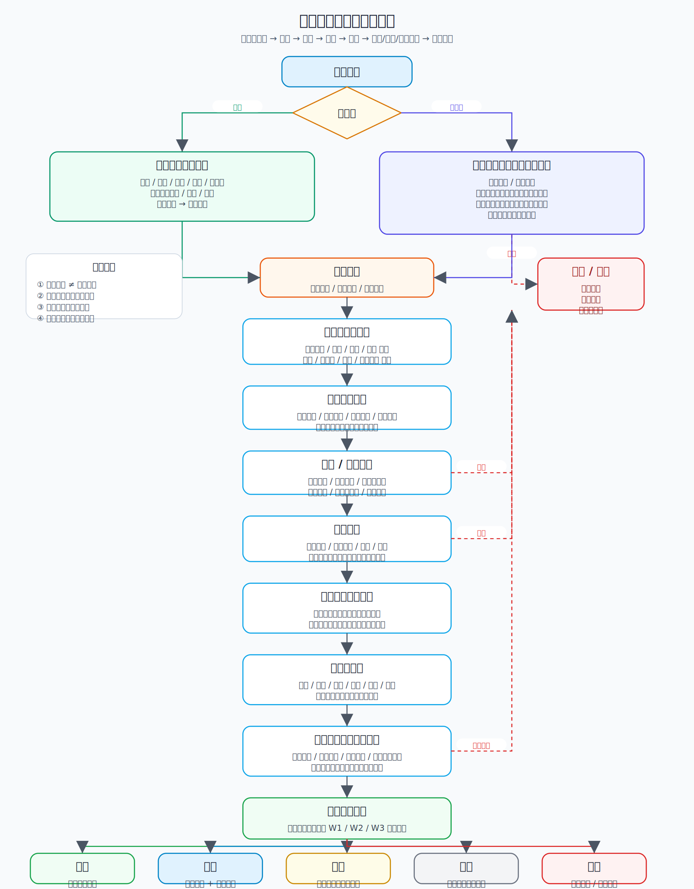
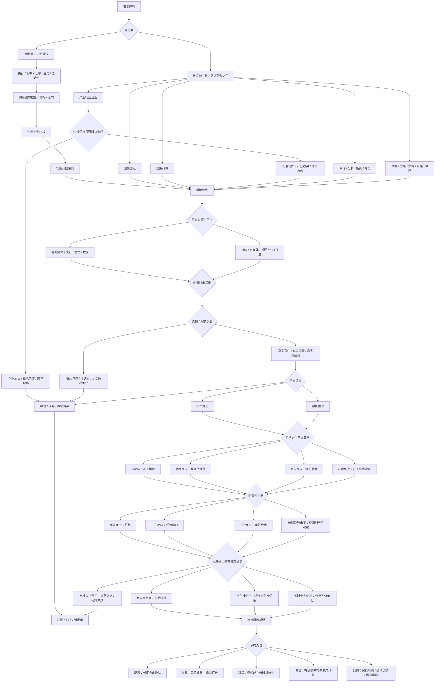

# 冰冰小美-信息的金融意义系列

## 1. 系列总论

- 核心命题：[[people/冰冰小美|冰冰小美]] 在“信息的金融意义”系列中，讨论的不是如何从一条消息直接推出一只股票，而是如何判断一条信息是否值得进入交易体系。
- 适用范围：本页适用于宏观、政策、产业、企业、媒体、传播、来源信用、信息评级和时效性等交易前置判断；不替代单篇 View Page，也不直接给出个股结论。
- 解决的问题：市场信息太多，本系列把信息先分层、再评级、再判断时效性，最后才进入风险识别、仓位、配置或回避。

本系列的总逻辑是：

```text
信息出现
-> 分类
-> 判断来源可信度
-> 判断传播对象和发布动机
-> 信息评级
-> 判断时效性
-> 识别风险是否减弱
-> 决定交易、配置或回避
```

## 2. 分篇索引

| 篇章  | 主题                | 页面链接                                   | 核心问题                     | 核心结论                                |
| --- | ----------------- | -------------------------------------- | ------------------------ | ----------------------------------- |
| 一   | 金融信息总论            | [[冰冰小美：金融信息优先级的判断框架]]       | 金融信息判断的优先级               | 金融信息首要贴近钱，央行、利率、汇率和流动性最重要。          |
| 二   | 金融信息归纳            | [[views/冰冰小美：金融信息归纳服务风险识别的判断框架]]       | 如何识别风险节点                 | 金融信息归纳的核心用途，是服务风控.先是识别风险，再寻找风险减弱节点。 |
| 三   | 非金融信息总论           | [[views/冰冰小美：非金融信息看有形之手目标传导的判断框架]]     | 如何理解国情、国策、产业、企业          | 一国 二策 三业 四界 五略                      |
| 四   | 隐学                | [[views/冰冰小美：隐学信息需要警惕功利性的判断框架]]        | 如何警惕信息差、内幕和功利性传播         | 隐学型信息需要优先检查功利性、受益方、价格反映程度和退出条件。     |
| 五   | 显学                | [[views/冰冰小美：显学以事件落地和历史影响为基础的判断框架]]    | 普通人如何依靠真实事件和历史周期建立方向判断\| | 普通人更应依靠真实事件、政策文件、历史节点和公开事实。         |
| 六   | 国情国运              | [[views/冰冰小美：国情国运与产业转型决定A股长期机会的判断框架]]  | 如何理解中国市场的长期底色            | 金融活动依托国情，长期机会来自时代转型和产业升级。           |
| 七   | 国策政策              | [[views/冰冰小美：国策高于政策用于理解长期方向的判断框架]]     | 用国策理解政策，避免被短期政策扰动误导      | 用长期国策理解短期政策，政策要回到战略方向上判断。           |
| 八   | 产业行业企业            | [[views/冰冰小美：中观产业信息要服从宏观的判断框架]]        | 识别产业真相与概念假象              | 中观信息要自上而下看，警惕概念炒作和预期差陷阱。            |
| 九   | 评论 / 分析 / 新闻 / 吃瓜 | [[views/冰冰小美：媒体信息更多影响情绪而非真相的判断框架]]     | <br>媒体信息更多影响情绪           | 媒体信息多影响情绪，真正要看话语权、立场和事实。            |
| 十   | 五略                | [[views/冰冰小美：五略归纳信息服务大局风控的判断框架]]       | 用五略服务大局风控                | 用战略、方略、策略、计略、谋略处理复杂信息和风控。           |
| 十一  | 信息来源              | [[views/冰冰小美：信息来源以官方原文和央行为最高可信度的判断框架]] | 信息来源决定可信度                | 第一手官方信息优先，央行信息是最高可信度来源。             |
| 十二  | 信息传播对象            | [[views/冰冰小美：信息传播对象决定信息动机与接收状态的判断框架]]  |                          | 判断发布者动机、目标受众，以及自己是否只是被动接收者。         |
| 十三  | 信息评级              | [[views/冰冰小美：信息评级区分投资投机与来源信用的判断框架]]    |                          | 信息需要按可信度、投资 / 投机属性和发布者信用评级。         |
| 十四  | 信息时效性             | [[views/冰冰小美：信息时效性判断框架]]               |                          | 信息反应需要时间，交易窗口来自事实、传播、交易、兑现和验证的阶段定位。 |
| 十五  | 信息无用性             | [[views/冰冰小美：信息无用性揭示微观价值等待使用的判断框架]]    |                          | 信息和资产价值需要使用场景，已被透支的信息会转为无用。         |
框架结构:

一，金融相关信息的归纳。
二，非金融相关信息的归纳。
三，信息的来源。
四，信息的传播对象。
五，信息的评级。
六，信息的时效性。
七，信息的无用性。

八，金融经济的信息的服从性。（对应，国情需求。）

九，信息的时间表。（对应，历史与节点）
十，如何利用信息差。（对应，交易与认知匹配）

章节十对应方法页：[[concepts/冰冰小美-framework-产业链财报旁证法|产业链财报旁证法]]，用于把“信息差”落到财报披露时间差、产业链旁证、目标公司价格反应和后续财报验证。


## 3. 信息分类框架

### 3.1 金融信息

[[concepts/冰冰小美-concept-金融信息|冰冰小美-concept-金融信息]] 的第一标准是是否贴近“钱”。作者把金融信息压回价值流通、资源配置、风险定价与转移，优先观察保证金、印花税、准备金率、基准利率、国债收益率、汇率、信用和流动性。

```text
金融信息
-> 是否贴近钱
-> 是否影响流动性
-> 是否改变资金主体行为
-> 是否改变风险偏好
-> 是否引发市场波动
```

金融信息不是用来直接预测个股，而是判断市场处在什么资金环境、什么风险偏好和什么风控状态。

### 3.2 非金融信息

非金融信息的第一标准是是否贴近“有形之手”。作者把非金融信息分成国情国运、国策政策、产业行业企业、评论分析新闻吃瓜、五略五类。

```text
金融信息看钱
非金融信息看目标如何达成
```

在 A 股语境下，不能只看自由市场定价，还要看国家要解决什么问题、政策如何推动、产业如何承接、企业是否形成正循环。

### 3.3 显学与隐学

- 显学：以公开事实、政策文件、真实事件、历史节点和长期影响为基础，普通人可以长期跟踪和复盘。
- 隐学：包含内幕、信息管制、利益博弈、逻辑包装和时间差优势；它不一定完全无用，但一旦进入金融市场，就要优先检查发布动机、受益方、价格反映程度、可验证性和退出条件。

显学更适合普通人建立底层判断；隐学更容易制造先手吃后手、价值投资话术包装投机、以及看似高级但无法验证的交易诱导。

### 3.4 宏观、中观、微观、情绪信息

- 宏观信息：
	- 国情国运
		- 金融活动最终依托于国情，投资机会的长期来源来自国运、产业转型和国家发展阶段。理解中国市场，不能只看短期股价波动，还要理解国家处在什么发展阶段、资源配置正在转向哪里、哪些产业承接未来使命。（如何做到？怎么判断国情？）
	- 国策与政策
		- 政策多变且复杂，普通人应站在国策和国情的高维度理解政策，把单条政策放进长期战略、现实问题、产业转型和国家发展路径中判断，最终识别哪些变化只是短期扰动，哪些变化会形成长期方向和产业机会。
- 中观信息
	- 产业、行业、企业属于中观信息，研究顺序应从产业到行业，再到企业；但这类信息专业门槛高、滞后性强、容易被包装成概念炒作，所以普通人归纳中观信息的首要目的，是识别真相与假象，规避投机陷阱，而非直接寻找买入目标。

- 微观信息
	- 企业公告、经营节点、跨界转型、订单、产能和业绩变化，需要警惕滞后性、概念叠加和预期差包装。凡中观以下的信息，都应该谨慎。用我的观点，只相信央妈，其他一概不信。
- 情绪信息：
	- 评论、分析、新闻、吃瓜信息主要影响话语权、认知和情绪，容易制造偏见、流量、时效错觉和交易冲动；普通人应带着怀疑态度识别其立场与动机，回到事实、产业、竞争格局和风险状态中判断信息是否真正有金融意义

## 4. 信息可信度框架

### 4.1 第一手信息

第一手信息包括官方原文、央行报告、政府工作报告、中央经济工作会议、五年规划、财政预算、统计局数据和正式会议文件。它们最适合做底层判断。

作者尤其强调央行信息，因为央行材料背后往往连接货币、信用、利率、流向、流速和周期变化。

### 4.2 次级信息

次级信息是对第一手信息的整理、解释和分析，包括作者自己的解读、机构分析、研究员报告和部分深度文章。它可以辅助理解，但不能替代原文。

次级信息的使用方式是：先看事实依据，再看立场和推导，最后看结论是否被原文和后续数据验证。

### 4.3 三级信息

三级信息是对次级信息的再转述、再汇总和再传播，例如别人把作者观点再整理成册、短视频切片、媒体标题、社群二次传播和聊天截图。

三级信息离事实更远，适合作为线索或情绪观察，不适合作为底层判断。

### 4.4 发布者信用评级

发布者信用需要长期观察。广告商、流量受益者、带货者、投顾、自媒体大 V、知识变现者和马后炮分析者，都可能有明确商业动机。

信用评级至少要看四点：

- 过往判断是否可追踪；
- 是否经常改变口径却不复盘；
- 是否把观点包装成确定性结论；
- 是否从传播、带货、咨询或流量中直接受益。

## 5. 信息传播框架

### 5.1 发布者动机

看到一条信息，先问发布者为什么要发布。它可能是政策传递、预期管理、商业推广、流量获取、投顾销售、情绪动员，也可能只是普通分享。

动机越强，越不能只看文本结论，要看谁受益、谁行动、谁接盘。

### 5.2 传播对象

信息不是抽象存在，而是发给某类人看的。金融市场尤其受场外信息影响，因此很多信息都有明确目标受众。

| 类型 | 特征 | 处理方式 |
|---|---|---|
| 普通传播 | 没有明显商业动机 | 可观察，但仍需过滤 |
| 定向传播 | 有明确目标受众 | 警惕被塑造认知 |
| 普遍传播 | 重大政策、五年规划、国策 | 适合长期跟踪 |

### 5.3 受众状态

同一条信息，对不同受众的作用不同。有人只看一小时，有人跟踪一天，有人跟踪一年，有人看完整五年。真正理解政策反复性和周期性的，通常是长期跟踪者。

交易前要问：我是主动思考者，还是被动接收者？我是提前跟踪，还是在信息扩散后才被推送到？

### 5.4 是否形成羊群效应

评论、分析、新闻和吃瓜信息最容易形成羊群效应。它们会把个体判断变成群体情绪，把复杂事实压成标题，把未验证推导压成“市场共识”。

羊群效应强时，信息未必更真实，反而可能说明交易窗口正在变短、后手风险正在升高。

## 6. 信息评级框架

### 6.1 投资信息

投资信息能支持长期方向、风险收益比和安全性判断。典型来源包括国情国运、五年规划、国策、央行货币与信用方向、产业转型、企业经营主体真实变化。

投资信息要长期跟踪，不追求单日反应，而是观察它是否持续改变资金环境、产业承接和企业经营。

### 6.2 投机信息

投机信息主要解释短期波动、情绪扩散和筹码博弈。题材、概念、预期差、新闻流量、短期舆论发酵都属于这一类。

投机信息不是完全不能用，但必须按投机属性管理仓位、时间和退出，不能误当长期投资依据。

### 6.3 融资信息

融资信息容易被包装成产业发展。例如机器人 IPO、借壳上市、概念跨界和资本运作，可能更多服务融资需求，而不是证明企业经营已经兑现。

处理融资信息时，要区分“公司需要钱”“产业需要资本市场支持”和“经营主体已经发生真实变化”。

### 6.4 噪音与误导信息

噪音与误导信息包括媒体标题、吃瓜评论、投顾诱导、内幕传闻、概念叠加、自媒体预测、无来源截图和情绪化判断。

这类信息的用途通常不是决策，而是过滤或归档：记录它如何影响情绪，但不让它直接进入仓位判断。

## 7. 信息时效性框架

### 7.1 未被重视

信息尚未被市场重视时，适合跟踪。这个阶段重点不是立刻交易，而是确认来源、等级、传播对象、潜在影响路径和后续验证节点。

### 7.2 正在扩散

信息正在扩散时，可能形成观察窗口。此时要判断扩散是否伴随资金环境变化、风险偏好变化、产业承接变化和市场尚未充分反应。

### 7.3 事件落地

事件落地后，要看它是否形成可确认的金融反应。政策、会议、数据、企业经营节点、央行态度和市场价格反应之间，需要互相印证。

### 7.4 充分反应

信息充分反应后，可能已经兑现。大众认知越广，反应越快，市场高度可能越高，交易窗口越短。

### 7.5 已经过度反应

信息过度反应后，要警惕后手风险。热门信息、新闻流量和情绪扩散可能把短期价格推到不再具备安全边际的位置。

## 8.信息分析框架
目的：是简化复盘内容的前提。
 

## 8. 交易应用（待删除）

### 8.1 风险识别

本系列首先服务风险识别。信息不是直接导向买入，而是先回答：风险在哪里、风险是否增强、哪些信息只是情绪噪音、哪些信息会改变资金环境。

### 8.2 风险减弱节点

风险减弱节点来自高等级信息持续跟踪后的变化，例如央行流动性、政策方向、信用环境、产业承接、市场情绪和事件落地共同改善。

它与 [[reasoning/冰冰小美如何判断风险转弱的节点|风险转弱节点框架]] 相连：先识别风险，再观察风险是否真正从强转弱。

### 8.3 买入窗口

买入窗口不是由一条利好直接产生，而是由信息等级、时效性、风险变化和市场反应程度共同确认。

典型情形包括：

- 高等级信息尚未被充分反应；
- 正在反应但仍有验证空间；
- 事件落地后形成可确认金融反应；
- 长期趋势未变，短期利空反而提供观察窗口。

### 8.4 回避条件

需要回避的情况包括：

- 信息来源低级且无法验证；
- 媒体和自媒体情绪已经高度扩散；
- 投资信息被包装成短线概念；
- 融资信息被误当成经营兑现；
- 信息已经充分或过度反应；
- 风险尚未减弱，但价格已先行透支。

### 8.5 复盘问题

复盘时重点问：

- 当时依据的是第一手信息、次级信息还是三级信息？
- 我把投资信息、投机信息、融资信息和噪音分清了吗？
- 信息发布者想让谁行动？
- 我是在信息未被重视时跟踪，还是在充分扩散后追随？
- 交易动作是否真的等到了风险减弱？
- 仓位、工具和退出是否匹配信息等级？

### 信息过滤流程图





## 9. 相关页面

- [[冰冰小美：金融信息优先级的判断框架|冰冰小美：金融信息优先级的判断框架]]
- [[views/冰冰小美：非金融信息看有形之手目标传导的判断框架|冰冰小美：非金融信息看有形之手目标传导的判断框架]]
- [[views/冰冰小美：隐学信息需要警惕功利性的判断框架|冰冰小美：隐学信息需要警惕功利性的判断框架]]
- [[views/冰冰小美：显学以事件落地和历史影响为基础的判断框架|冰冰小美：显学以事件落地和历史影响为基础的判断框架]]
- [[views/冰冰小美：中观产业信息要服从宏观的判断框架|冰冰小美：中观产业信息要服从宏观的判断框架]]
- [[views/冰冰小美：媒体信息更多影响情绪而非真相的判断框架|冰冰小美：媒体信息更多影响情绪而非真相的判断框架]]
- [[views/冰冰小美：五略归纳信息服务大局风控的判断框架|冰冰小美：五略归纳信息服务大局风控的判断框架]]
- [[views/冰冰小美：信息来源以官方原文和央行为最高可信度的判断框架|冰冰小美：信息来源以官方原文和央行为最高可信度的判断框架]]
- [[views/冰冰小美：信息传播对象决定信息动机与接收状态的判断框架|冰冰小美：信息传播对象决定信息动机与接收状态的判断框架]]
- [[views/冰冰小美：信息评级区分投资投机与来源信用的判断框架|冰冰小美：信息评级区分投资投机与来源信用的判断框架]]
- [[views/冰冰小美：信息时效性判断框架|冰冰小美：信息时效性判断框架]]
- [[views/冰冰小美：信息无用性揭示微观价值等待使用的判断框架|冰冰小美：信息无用性揭示微观价值等待使用的判断框架]]
- [[冰冰小美-concept-流动性辩证分析|冰冰小美-concept-流动性辩证分析]]：解释金融信息为何要优先看资金环境和承接结构。
- [[concepts/冰冰小美-framework-产业思维|产业思维]]：解释中观产业信息如何自上而下过滤企业机会。
- [[reasoning/冰冰小美如何判断风险转弱的节点|冰冰小美-风险转弱节点框架]]：连接信息识别与风险减弱观察。
- [[concepts/冰冰小美-分仓|冰冰小美-分仓]]：连接信息过滤后的仓位和风控执行。
- [[concepts/冰冰小美-framework-产业链财报旁证法|产业链财报旁证法]]：对应章节十“如何利用信息差”，把信息差落到财报披露时间差与产业链需求旁证。
