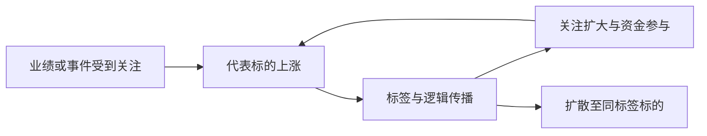

# 冰冰小美-投机

## 主题说明

本页按问题聚合冰冰小美关于投机对象、短线窗口、资金承接、仓位买卖、亏钱效应与交易心理的知识。与[[wiki/topics/冰冰小美-情绪体系交易篇|情绪体系交易篇]]的逐篇目录互补：这里回答先理解什么、再检查什么，具体方法继续阅读已有页面。

阅读主线：分清投机对象 → 检查风险与三要素 → 观察标的和承接 → 制定仓位与退出条件 → 复盘纠偏。此顺序为整理者归纳，历史个股、金额和日期案例不直接作为通用交易规则。

## 投机理解框架

**理解主线：先分清交易性质，再辨认投机对象；用三要素解释机会，用传播过程辨认自己所处的位置，最后以风险和自身能力决定是否参与。**

### 一、交易性质：先说明这笔交易依靠什么获利

**原文要点：**[[sources/articles/2025-09-05-冰冰小美：心智夺取与交易决策|《心智夺取与交易决策》]]要求参与个股前先分清投资与投机，再采用对应的交易思维；[[sources/articles/2025-07-25-冰冰小美：交易理念之争|《交易理念之争》]]强调投资投机并存，并明确说“不要觉得追涨就是投机”。

**整理理解：**判断交易性质，要说明收益主要依靠企业经营、价值创造与分红，还是阶段性的情绪、资金聚集和价格溢价。同一标的可能同时包含这些因素；需要识别本次交易主要依赖哪一种，以及依据改变后是否仍然成立。

- 检查问题：即使热点降温，我原来的持有理由是否仍成立？依据是经营事实，还是仍有人愿意以更高价格参与？
- 易错之处：用买入后涨跌替自己定义交易；亏损后临时换成另一套持有理由。后者是由“先分清性质”推导出的执行检查。

### 二、投机对象：辨认自己正在参与哪一种效应

**原文依据：**[[sources/manual/体系及案例分析/四、投资认知与感悟类/2、散户避坑指南/296_投机三层核心逻辑|《投机三层核心逻辑》]]列出三组对象及其能力要求。

| 原文列出的对象 | 原文强调的要求 | 整理者提出的检查问题 |
|---|---|---|
| 挣钱效应／反亏钱效应 | 两者都需要耐心，挣钱效应更需要耐心 | 看到的是已有盈利反馈，还是亏钱状态可能改变的迹象？是否把一次反弹当成持续转变？ |
| 假象／假象的预期 | 两者都要快人一步，假象的预期更要快人一步 | 自己依据的是已传播的表象，还是对它将被相信的预期？所谓先手是否已有证据？ |
| 流动性溢价／流动性报团溢价 | 两者都需要格局，报团溢价更需要格局 | 资金为何愿意支付溢价，又为何集中到这个标的？ |

**边界：**原文没有完整定义“假象”“反亏钱效应”和两类流动性溢价，也没有说明这三组对象是依次升级的阶段。此处把它们作为分析一笔交易的三个角度；不能把“格局”直接解释为长期持有，也不能把“快人一步”解释为无依据地抢跑。详细概念入口为[[wiki/concepts/冰冰小美-framework-投机三层核心逻辑|投机三层核心逻辑]]。

### 三、机会形成：情绪、流动性与比较优势共同解释溢价

**原文要点：**[[sources/articles/2023-03-15-冰冰小美-短线投机的流动性溢价与竞争格局核心|《短线投机的流动性溢价与竞争格局核心》]]从当天情绪环境出发，观察情绪位置变化引发的流动性变化；个股层面体现为局部报团溢价，同题材中竞争格局凸显者可能获得龙头溢价。

| 观察角度 | 需要解释的问题 | 对应概念 |
|---|---|---|
| 情绪位置 | 恐惧、贪婪、亏钱与挣钱效应如何改变参与意愿？ | [[wiki/concepts/冰冰小美-concept-体系三要素之情绪位置的变化\|情绪位置的变化]] |
| 流动性 | 参与意愿是否形成实际资金聚集和溢价？ | [[wiki/concepts/冰冰小美-concept-体系三要素之流动性辩证分析\|流动性辩证分析]] |
| 竞争格局 | 同一方向里，为什么是这个标的承载资金和人气？ | [[wiki/concepts/冰冰小美-concept-体系三要素之竞争格局的比较优势\|竞争格局的比较优势]] |

**整理理解：**这是解释市场行为的三个角度，不是固定先后顺序。只知道题材好、价格涨或成交活跃，都不足以单独说明机会成立；也不能将短线中的比较优势直接等同于企业长期护城河。

### 四、传播位置：看清自己怎样被卷入行情

**原文要点：**[[sources/manual/体系及案例分析/一、核心体系/5、仓位管理与交易策略/119_情绪体系认知篇第三期：投机过程中的传播学|《投机过程中的传播学》]]用合成生物案例说明：企业业绩与上涨样板吸引注意，概念标签、自媒体和业务传播扩大关注，同标签企业也获得盈利预期，随后更多投机资金参与。

可将该案例归纳为下面的反馈关系；它不是所有投机行情必经的顺序：

**整理检查：**上涨是否先于自己看到的解释？标签是否对应真实业务与盈利？最初承载盈利信心的标的是否仍然有支撑？自己是在观察行情，还是因为传播越来越热而越来越相信？

作者用“人人皆知已经是传播的极限”提醒风险。它提示检查后续参与空间，不能单凭传播热度就确定顶部日期或卖点。案例中关于券商、自媒体、量化与游资的描述属于作者的市场解释，不应推成每次行情都存在共同操纵的事实。

### 五、参与选择：理解机制后，还要判断是否适合自己

**原文要点：**[[sources/manual/体系及案例分析/一、核心体系/5、仓位管理与交易策略/119_情绪体系认知篇第三期：投机过程中的传播学|《投机过程中的传播学》]]明确提出：参与要知道挣什么钱，不参与要知道行情对持仓有什么影响。作者同时明确反对套利和题材概念炒作，说明写作目的是帮助辨别炒作及其风险，并强调自己的盈利不代表读者也能做到。

**整理理解：**“投机有其市场作用”“投机机制可以分析”和“个人适合参与”是三个不同判断。即使能解释行情，也仍需检查性格、能力与风险承受力。

- 参与检查：获利依据是什么？自己具备所需的耐心、先手判断或比较能力吗？什么变化会使理由失效？
- 不参与检查：这类行情会如何影响已有持仓的资金关注、价格波动和自身心态？
- 执行边界：五篇原文未提供统一的仓位比例、止损幅度或买卖阈值。本框架只能帮助提出问题，具体执行继续查阅[[wiki/concepts/冰冰小美-concept-交易策略|交易策略]]及下方执行类来源。

### 六、风险复盘：检查市场条件与自身认知是否已经改变

**原文要点：**[[sources/articles/2025-07-25-冰冰小美：交易理念之争|《交易理念之争》]]把风险思考、本金保护与保留下一次机会联系起来；[[sources/articles/2025-09-05-冰冰小美：心智夺取与交易决策|《心智夺取与交易决策》]]描述“上涨获利—寻找有利逻辑—信心膨胀—反复参与”的心理过程，并提醒周期、流动性、参与人群和制度变化会改变旧有交易环境。

据此可形成两组复盘问题，以下为整理推导：

- **市场条件：**原先的挣钱效应是否延续？资金为何还会聚集？标的比较优势是否仍在？传播扩散是否已超过业务证据所能支持的范围？
- **自身认知：**我是否把环境有利带来的盈利归功于能力？是否只搜集支持持仓的信息？是否因为踏空、比较或不甘而改变初衷？下一次机会出现时，本金与判断能力是否还在？

### 框架的最简使用顺序

**这笔交易是什么性质 → 投的是什么效应 → 三要素如何支持它 → 我处于传播的哪一环 → 我是否适合参与 → 什么变化说明原来的理由需要重审。**

这是一条阅读与复盘顺序。识别出机会机制之后，仍可能得出等待或不参与的判断；认识投机的作用，也不等于认同高频交易或把历史盈利路径外推到新的市场环境。

### 二、交易窗口：风险与三要素

- [[冰冰小美-RiskHot架构设计|风险体系]]：先认识风险及承受边界，再讨论参与。
- [[wiki/topics/冰冰小美-情绪体系认知篇|情绪体系认知篇]]：理解宏观仓位约束与三要素交易窗口的关系。
- [[wiki/concepts/冰冰小美-concept-体系三要素之竞争格局的比较优势|竞争格局的比较优势]]：比较方向与标的地位，不能只看涨幅。
- [[wiki/concepts/冰冰小美-concept-体系三要素之流动性辩证分析|流动性辩证分析]]：观察资金是否集中、承接是否持续。
- [[wiki/concepts/冰冰小美-concept-体系三要素之情绪位置的变化|情绪位置的变化]]：观察恐惧、贪婪、信心与市场合力的变化。
- [[wiki/concepts/冰冰小美-情绪冰点转势|情绪冰点判断]]：从亏钱效应、恐慌核心、指数和市场广度检查冰点；冰点观察不等于转势确认。
- [[wiki/concepts/冰冰小美-等|等]]、[[wiki/concepts/冰冰小美-借势|借势]]：等待条件形成，再跟随已出现的市场行为。

### 三、选择对象：情绪标与持续承接

- [[wiki/concepts/冰冰小美-concept-情绪标|情绪标]]：辨认承载阶段信心和市场需求的标的，区分情绪标与套利标。
- [[wiki/concepts/冰冰小美-个股情绪与整体情绪|个股情绪与整体情绪]]：把个股强势放回指数、板块与整体信心中检验。
- [[wiki/concepts/冰冰小美-行情持续性来自让利|行情持续性来自让利]]：关注核心标的、板块接力与参与者获利空间。

### 四、执行：仓位、买卖与空仓

| 环节 | 阅读入口 | 需要回答的问题 |
|---|---|---|
| 行动安排 | [[wiki/concepts/冰冰小美-concept-交易策略\|交易策略]] | 当前适合等待、参与、持有、调整还是退出？ |
| 仓位表达 | [[wiki/concepts/冰冰小美-分仓\|分仓]] | 仓位是否匹配市场状态、标的角色和自身承受能力？ |
| 买入与退出 | [[wiki/concepts/冰冰小美-买卖\|买卖]] | 参与理由是什么，何种变化说明理由失效？ |
| 主动防守 | [[wiki/concepts/冰冰小美-空仓\|空仓]] | 承接或交易条件不适配时，是否应减少参与？ |
| 做T与训练 | [[wiki/topics/冰冰小美-情绪体系交易篇#短线交易\|短线交易与做T讨论]] | 频繁交易是否造成情绪失控，能力未经验证时是否过早扩大资金？ |

## 来源与推荐阅读顺序

### 投机逻辑、传播与投资边界

以下说明为整理者对原文内容的导读。建议先读前两篇理解投机逻辑，再读第三篇理解热点传播，最后两篇用于辨别交易理念与决策思维。

1. [[sources/manual/体系及案例分析/四、投资认知与感悟类/2、散户避坑指南/296_投机三层核心逻辑|2022-07-29《投机三层核心逻辑》]]：集中回答“投机到底在投什么”，将挣钱效应／反亏钱效应、假象／假象预期、流动性溢价／流动性报团溢价分别对应耐心、快人一步与格局。
2. [[sources/articles/2023-03-15-冰冰小美-短线投机的流动性溢价与竞争格局核心|2023-03-15《短线投机的流动性溢价与竞争格局核心》]]：情绪、局部报团、流动性溢价与比较优势。
3. [[sources/manual/体系及案例分析/一、核心体系/5、仓位管理与交易策略/119_情绪体系认知篇第三期：投机过程中的传播学|2024-05-11《情绪体系认知篇第三期：投机过程中的传播学》]]：讨论概念标签、热点传播、自媒体与资金如何推动投机；参与前先想清楚挣什么钱，不参与也需判断行情对持仓的影响。
4. [[sources/articles/2025-07-25-冰冰小美：交易理念之争|2025-07-25《交易理念之争》]]：讨论投资与投机并存的市场、交易目标和风险思考，明确提出不要把追涨直接等同于投机。
5. [[sources/articles/2025-09-05-冰冰小美：心智夺取与交易决策|2025-09-05《心智夺取与交易决策》]]：讨论投机活跃市场与投资夯实指数信心的作用，强调参与个股前先理清投机或投资的性质，再选择对应的交易思维。

### 仓位、执行与复盘

1. [[sources/articles/2023-08-14-冰冰小美：情绪体系交易篇第一期分仓|2023-08-14《分仓》]]：市场状态与仓位安排。
2. [[sources/articles/2023-08-15-冰冰小美：情绪体系交易篇第二期借势|2023-08-15《借势》]]、[[sources/articles/2023-08-18-冰冰小美：情绪体系交易篇第三期等|2023-08-18《等》]]：参与时机与等待纪律。
3. [[sources/articles/2023-10-09-冰冰小美：情绪体系交易篇第九期买卖|2023-10-09《买卖》]]、[[sources/articles/2023-11-11-冰冰小美：情绪体系交易篇第十期空仓|2023-11-11《空仓》]]：具体动作和退出防守。
4. [[sources/articles/2023-10-17-冰冰小美：情绪体系交易篇交割单的认知|2023-10-17《交割单的认知》]]：以亏损和执行偏差复核体系。
