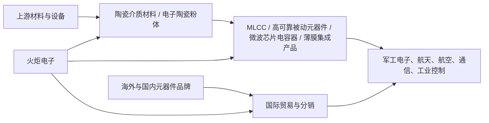

# 火炬电子（603678.SH）机构级决策研报

## 报告封面与结论摘要

### 0.1 标的身份

- 公司名称：福建火炬电子科技股份有限公司
- 证券代码：603678.SH
- 上市地点：上海证券交易所主板
- 所属产业链：军工电子 / 高可靠电子元器件 / 陶瓷材料 / 电子元器件贸易
- 报告日期：2026-07-23
- 主要来源：[[sources/webpages/2026-07-23-火炬电子法定财报与经营数据快照|法定财报与经营数据快照]]、[[sources/webpages/2026-07-23-火炬电子行情估值与催化剂快照|行情估值与催化剂快照]]

### 0.2 一句话结论

火炬电子的产业位置不是单纯“军工电子龙头”一句话可以概括：它一端是高毛利的自产高可靠元器件和陶瓷材料，一端是收入占比很高但毛利率较低的国际贸易业务；2025 年收入与利润恢复，但 2026Q1 出现“收入高增、利润大降、经营现金流继续转负”的背离，叠加 2026 年 6-7 月股价和龙虎榜剧烈波动，当前更像“产业逻辑有看点、交易价格已透支、现金流证伪尚未解除”的观察标的，而不是安全买点。

### 0.3 结论表

| 维度 | 当前判断 | 证据强度 | 说明 |
|---|---|---:|---|
| 基本面状态 | 证据不足 | 中 | 2025 年恢复，但 2026Q1 利润和经营现金流恶化，与收入高增背离。 |
| 估值状态 | 高估 | 中高 | 2026-07-23 延时价 46.21 元，对应 TTM PE 约 85-90 倍，明显高于未验证现金流质量的基本面。 |
| 风险方向 | 风险增强 | 中 | 高换手、异常波动、龙虎榜密集、Q1 利润下滑共同出现。 |
| 资金状态 | 结构性流出 / 高波动 | 中低 | 公开资金流和龙虎榜显示强交易性，不足以证明长期资金稳定承接。 |
| BBXM 三要素 | 未形成有利共振 | 中 | 竞争格局有产业价值，但流动性和情绪位置不配合。 |
| 最终动作 | 观望 / 不新增现金 | 中高 | 等半年报验证利润、现金流和自产业务订单质量。 |

### 0.4 如果今天必须给一个操作答案

- 新开仓：不买。
- 已持有且成本较高：把 34 元以上区域视为估值压力区，若 2026 半年报仍是利润承压、现金流未转正，应考虑逢反弹降低仓位。
- 已持有且成本较低：可以继续观察，但不把 6-7 月的高波动当成“机构持续买入”的证据。
- 重新评估触发点：2026 半年报、Q3 订单利润率、经营现金流、自产元器件收入占比、贸易业务毛利率。

## 1. 研究对象定义

### 1.1 公司做什么

火炬电子主营电子元器件、新材料及相关产品的研发、生产、销售、检测及服务。按 2025 年收入结构，它不是纯自产元器件公司，而是“自产高可靠元器件 + 陶瓷材料 + 国际贸易”的组合体。

### 1.2 产业链位置



更直白地说，火炬电子在产业链里有三层身份：

1. 自产高可靠电子元器件供应商：这是利润池核心，2025 年元器件业务毛利率 54.29%。
2. 陶瓷材料供应商：规模较小，但毛利率高，2025 年陶瓷材料毛利率 55.78%。
3. 电子元器件贸易商 / 分销商：收入规模最大，2025 年国际贸易业务收入 25.31 亿元，占产品收入约 61.8%，但毛利率仅 10.12%。

### 1.3 研究边界

本报告回答的是“以当前公开信息和价格，火炬电子是否值得配置”。不把军工、商业航天、低空经济等主题标签直接等同于公司利润兑现；所有未能落到收入、毛利、现金流或订单质量的数据，均只作为待验证线索。

## 2. 资料来源与可靠性矩阵

| 信息类别 | 来源 | 时间口径 | 可靠性 | 用途 |
|---|---|---|---:|---|
| 年报与一季报 | 交易所披露页及公开财报摘录 | 2025 年、2026Q1 | 高 | 财务、业务结构、现金流 |
| 公司档案 | 准上市公司档案页 | 2026-07 | 中 | 上市身份、主营描述 |
| 行情估值 | Investing.com、Yahoo、iGu888、准上市公司 | 2026-07-22 / 2026-07-23 | 中 | 当前估值和波动状态 |
| 龙虎榜 | 同花顺、东方财富摘录 | 2026-06 至 2026-07 | 中 | 交易结构和情绪状态 |
| 券商研报摘录 | 长江证券等公开摘录 | 2026-04 | 中 | 业务进展线索 |
| 三要素框架 | [[wiki/topics/冰冰小美-情绪体系理论篇|冰冰小美情绪体系]]、[[wiki/concepts/冰冰小美-concept-体系三要素之竞争格局的比较优势|竞争格局]]、[[wiki/concepts/冰冰小美-concept-体系三要素之流动性辩证分析|流动性]]、[[wiki/concepts/冰冰小美-concept-体系三要素之情绪位置的变化|情绪位置]] | 知识库框架 | 中 | 操作决策翻译 |

未获取到或未完整获取的数据：

- 2021 年完整利润表细项；
- 2021-2023 年合并口径资本开支完整序列；
- 2026 年一致预期目标价分布；
- 订单分行业、分军民口径、分客户集中度的最新明细。

这些缺口会降低 DCF 精度，因此本报告使用“估值区间 + 反向 DCF + 触发条件”而不是伪精确目标价。

## 3. 生意模式与收入拆解

### 3.1 2025 年收入结构

| 业务 | 收入 | 收入占产品收入比例 | 毛利率 | 经营含义 |
|---|---:|---:|---:|---|
| 元器件 | 13.63 亿元 | 约 33.3% | 54.29% | 利润池核心，决定公司质量。 |
| 陶瓷材料 | 2.04 亿元 | 约 5.0% | 55.78% | 高毛利小体量，偏期权属性。 |
| 国际贸易 | 25.31 亿元 | 约 61.8% | 10.12% | 收入放大器，但稀释综合毛利和估值质量。 |
| 合计 | 40.99 亿元 | 100% | 约 27.1% | 高毛利自产业务被低毛利贸易业务显著摊薄。 |

### 3.2 利润池判断

真正支撑估值的不是营业收入 41.21 亿元，而是自产元器件和陶瓷材料能不能持续贡献高毛利、高现金转化的利润。贸易业务收入大，但 10% 左右毛利率决定它不应享受和军工高可靠元器件同样的估值倍数。

### 3.3 关键矛盾

2025 年看起来是“收入 +47%、归母净利 +64%”的恢复年；但 2026Q1 变成“收入 +77%、归母净利 -63%、经营现金流 -3.22 亿元”。这意味着增长质量还没有被证明，尤其需要检查：

- 贸易收入增长是否拉低利润率；
- 自产元器件订单是否只是交付节奏恢复，而非持续景气；
- 供应商付款增加是否会继续压制现金流；
- 并购资产是否带来利润，还是带来资本占用。

## 4. 行业与产业链位置

### 4.1 所在行业

火炬电子横跨军工电子、电子元器件分销、陶瓷材料三类业务。若只用一个行业标签，最接近的是“高可靠电子元器件”，但财务上不能忽略国际贸易业务。

### 4.2 上游

- 陶瓷粉体、介质材料、金属材料、封装材料；
- 精密制造设备、检测设备；
- 海外和国内电子元器件品牌供应体系。

### 4.3 中游

- MLCC 等被动元器件；
- 微波芯片电容器、薄膜集成产品；
- 陶瓷材料；
- 元器件检测和贸易分销服务。

### 4.4 下游

- 军工电子；
- 航空航天；
- 通信与工业控制；
- 民用电子元器件需求；
- 可能涉及商业航天、低空经济等主题场景，但本报告不把主题映射当作收入确认。

### 4.5 产业链位置结论

火炬电子不是产业链最上游的基础材料平台，也不是最下游的整机系统厂商，而是处在“高可靠元器件制造 + 材料配套 + 分销服务”的中游偏上位置。它的优势需要通过自产高毛利业务体现；如果收入主要由贸易扩张推动，市场应给予的估值应更接近“分销 + 制造混合体”，而不是纯军工电子成长股。

## 5. 竞争格局与护城河

### 5.1 可见优势

1. 高可靠元器件资质与客户积累：军工电子客户对认证、可靠性和交付稳定性要求高，进入门槛高于普通消费电子。
2. 自产元器件毛利率高：2025 年元器件毛利率 54.29%，说明高可靠业务具备较强利润弹性。
3. 陶瓷材料协同：陶瓷材料业务虽小，但毛利率 55.78%，有向上游材料延伸的意义。
4. 并购与产品扩张：公开研报摘录提到四川中星、福建毫米、天极科技等方向，为薄膜电容器、微波芯片电容器、薄膜集成产品提供扩展线索。

### 5.2 可见弱点

1. 收入结构被低毛利贸易业务主导：2025 年国际贸易业务占产品收入约 61.8%，但毛利率仅 10.12%。
2. 现金流波动大：2025 年经营现金流转负，2026Q1 继续为 -3.22 亿元。
3. 2026Q1 利润未跟随收入增长：说明收入放量不一定转化为股东利润。
4. 市场给的是成长股估值，但财务呈现的是混合业务模型。

### 5.3 竞争格局结论

在 [[wiki/concepts/冰冰小美-concept-体系三要素之竞争格局的比较优势|竞争格局]] 维度，火炬电子“产业方向有利，但财务兑现不足”。它有高毛利业务和军工电子门槛，但当前收入和现金流结构不足以支持纯粹高端制造龙头的估值叙事。

## 6. 管理层、治理与资本配置

### 6.1 治理与股本

- 总股本约 4.76 亿股。
- 2026-06-27 公开摘录显示实际控制人部分股份质押、解除质押及延期购回，合计质押约 200 万股，占总股本约 0.42%。该比例不高，但在高波动阶段仍应跟踪。

### 6.2 分红

2025 年分红方案为每 10 股派发现金红利 0.80 元。按 46.21 元股价计算，静态股息率约 0.17%，不构成股息资产定价逻辑。

### 6.3 并购与资本支出

2025 年投资活动现金流净额为 -8.39 亿元，公开摘录提到收购融科热控、四川中星和购买理财产品等因素。资本配置是否创造价值，需要看并购资产后续能否带来利润和现金流。

### 6.4 资本配置评价

目前资本配置的核心风险是：公司在收入恢复期同时出现经营现金流转负和投资现金流大幅流出。如果后续利润不能转化为现金，估值就需要折价。

## 7. 五年财务复盘

### 7.1 核心财务表

| 年度 | 营业收入 | 归母净利润 | 扣非归母净利润 | 经营现金流 | ROE | 备注 |
|---|---:|---:|---:|---:|---:|---|
| 2021 | 47.34 亿元 | 未获取到 | 未获取到 | 5.94 亿元 | 22.41% | 本次未完整获取利润明细。 |
| 2022 | 35.59 亿元 | 8.01 亿元 | 7.70 亿元 | 9.26 亿元 | 16.22% | 盈利高点。 |
| 2023 | 35.04 亿元 | 3.18 亿元 | 3.10 亿元 | 8.67 亿元 | 5.97% | 利润显著下台阶。 |
| 2024 | 28.02 亿元 | 1.95 亿元 | 1.69 亿元 | 6.54 亿元 | 3.57% | 收入和利润继续承压。 |
| 2025 | 41.21 亿元 | 3.20 亿元 | 2.97 亿元 | -2.35 亿元 | 5.41% | 收入利润恢复，但现金流转负。 |

### 7.2 现金流质量

| 年度 | 经营现金流 | 已获取资本开支 | 自由现金流观察 |
|---|---:|---:|---|
| 2021 | 5.94 亿元 | 未获取到合并口径 | 待验证 |
| 2022 | 9.26 亿元 | 未获取到合并口径 | 待验证 |
| 2023 | 8.67 亿元 | 未获取到合并口径 | 待验证 |
| 2024 | 6.54 亿元 | 3.34 亿元左右 | 正向，约 3.20 亿元 |
| 2025 | -2.35 亿元 | 2.22 亿元左右 | 负向，约 -4.57 亿元 |

自由现金流的方向比净利润更刺眼：2025 年公司账面利润恢复，但自由现金流转为明显负值。这是当前估值不能只看 PE 的主要原因。

### 7.3 财务复盘结论

火炬电子的盈利能力从 2021-2022 年高位回落，2025 年有恢复迹象，但还不是高质量复苏。2026Q1 又出现收入与利润背离，说明投资者需要等“收入增长 → 毛利率稳定 → 净利润恢复 → 经营现金流转正”的闭环，而不能只看收入增速。

## 8. 最新季度与边际变化

### 8.1 2026Q1 关键数据

| 指标 | 2026Q1 | 同比 |
|---|---:|---:|
| 营业收入 | 13.50 亿元 | +77.16% |
| 归母净利润 | 0.40 亿元 | -62.82% |
| 扣非归母净利润 | 0.30 亿元 | -70.72% |
| 经营现金流 | -3.22 亿元 | -316.23% |
| EPS | 0.08 元 | 下降 |
| 加权 ROE | 0.65% | 下降 |

### 8.2 边际变化判断

最重要的边际变化不是“收入高增”，而是“收入高增没有带来利润高增”。这通常意味着三个可能性：

1. 收入结构偏低毛利业务；
2. 费用、成本或交付节奏压制利润；
3. 回款与付款节奏导致现金流压力。

公司解释经营现金流下降与支付供应商款项增加有关。这个解释并不等于风险解除，因为供应链付款压力本身就是现金转化质量的一部分。

### 8.3 半年报观察点

2026 半年报预约披露日期为 2026-08-22。半年报需要重点看：

- 自产元器件收入增速是否高于贸易业务；
- 元器件毛利率是否维持 50% 以上；
- 贸易业务毛利率是否继续压缩；
- 经营现金流是否转正；
- 存货、应收、预付和合同负债是否出现异常变化；
- 并购资产是否贡献利润。

## 9. 可比公司与相对估值

### 9.1 可比公司

| 公司 | 业务相似点 | 公开估值摘录 | 可比性说明 |
|---|---|---:|---|
| 振华科技 | 军工电子元器件平台 | TTM PE 约 22.10 倍 | 更偏军工电子平台，估值可作为成熟军工电子参考。 |
| 宏达电子 | 钽电容、军工电子元器件 | TTM PE 约 46-50 倍 | 业务属性更接近高可靠被动元器件。 |
| 鸿远电子 | MLCC / 军工电子元器件 | TTM PE 约 73 倍 | 估值较高，反映弹性预期，但同样需要利润验证。 |

### 9.2 火炬电子当前估值

按 2026-07-23 延时价 46.21 元、总股本约 4.756 亿股估算，市值约 219.8 亿元。

TTM 归母净利润估算：

```text
2025 归母净利润 3.20 亿元
+ 2026Q1 归母净利润 0.40 亿元
- 2025Q1 归母净利润约 1.07 亿元
= TTM 归母净利润约 2.53 亿元
```

对应 TTM PE 约 87 倍，与公开行情页 82.77-83.00 倍口径接近。差异来自延时价、EPS 口径和四舍五入。

### 9.3 相对估值结论

如果把火炬电子当作纯高可靠元器件成长股，市场可能愿意给 40-60 倍 PE；但如果把它还原为“高毛利自产业务 + 低毛利贸易业务 + 现金流转负”的混合体，合理估值应明显低于当前 80 倍以上 TTM PE。

相对估值给出的基本结论是：当前价格已经包含强复苏和高弹性预期，但公开财务数据尚未验证这种预期。

## 10. DCF 与反向估值

### 10.1 DCF 输入假设

由于本次未完整获取 2021-2023 年合并口径资本开支序列，DCF 不做伪精确预测，而采用三情景自由现金流恢复模型。

| 假设 | 熊市情景 | 基准情景 | 牛市情景 |
|---|---:|---:|---:|
| 2026-2030 收入 CAGR | 3% | 8% | 12% |
| 稳态净利率 | 5%-6% | 8%-9% | 11%-12% |
| 自由现金流转化率 | 低 | 中 | 高 |
| WACC | 9.5% | 9.0% | 8.5% |
| 永续增长率 | 1.5% | 2.0% | 2.5% |

### 10.2 DCF 估值区间

| 情景 | 股权价值估算 | 每股价值估算 | 解释 |
|---|---:|---:|---|
| 熊市 | 55-75 亿元 | 12-16 元 | 贸易扩张但利润和现金流持续偏弱。 |
| 基准 | 105-145 亿元 | 22-30 元 | 自产业务恢复，现金流逐步修复。 |
| 牛市 | 170-220 亿元 | 36-46 元 | 自产元器件高增、材料业务放量、现金流显著改善。 |

### 10.3 反向 DCF

以 46.21 元股价估算，市场隐含的是接近牛市上沿的情景：公司需要在未来几年持续证明自产高毛利业务扩张，并把净利润和经营现金流同步修复。若 2026 半年报或三季报仍是“收入增长、利润下滑、现金流为负”，当前价格的反向 DCF 假设就会被削弱。

### 10.4 DCF 结论

DCF 并不支持在 46 元附近把火炬电子当成安全配置。它更像一个需要等验证的高弹性标的：若基本面兑现，当前价格可以解释；若兑现不足，估值回落空间很大。

## 11. 分部估值与产业价值量

### 11.1 分部估值框架

| 分部 | 估值方法 | 合理倍数 / 参数 | 估值含义 |
|---|---|---:|---|
| 自产元器件 | 利润倍数 | 30-40 倍归属利润 | 高毛利、军工属性，核心价值来源。 |
| 陶瓷材料 | 利润倍数 / 期权 | 25-35 倍归属利润 | 小体量高毛利，取决于放量。 |
| 国际贸易 | PS 或低 PE | 0.3-0.5 倍收入 | 低毛利业务，不应给高成长制造估值。 |
| 并购与新业务 | 期权折价 | 待验证 | 需看利润贡献和现金流。 |

### 11.2 SOTP 粗估

- 国际贸易业务：25.31 亿元收入，按 0.3-0.5 倍 PS，约 8-13 亿元。
- 自产元器件与材料：若归属净利润恢复到 3-4 亿元，并给予 30-40 倍，约 90-160 亿元。
- 新业务和并购资产：在未确认利润贡献前，给予有限期权价值。

综合看，火炬电子更合理的中性股权价值区间约 115-165 亿元，对应每股约 24-35 元。若当前价格 46.21 元，已经高于中性估值区间。

### 11.3 价值量与利润池

这里的“价值量”指公司在产业链中能捕获多少收入和利润；“利润池”指能长期转化为股东利润和现金流的业务位置。火炬电子的价值量由贸易业务放大，但利润池主要在自产元器件和陶瓷材料。因此，市场如果只看 41 亿元收入，容易高估；如果只看军工元器件标签，也容易忽略贸易业务对估值质量的稀释。

## 12. 冰冰小美三要素映射

### 12.1 三要素评分

| 三要素 | 当前状态 | 证据 | 操作含义 |
|---|---|---|---|
| 竞争格局 | 中性 | 高毛利自产元器件和陶瓷材料具备门槛，但贸易业务收入占比过高，现金流未验证。 | 有产业观察价值，但不构成单独买入条件。 |
| 流动性 | 不利 | 2026 年 6-7 月异常波动、龙虎榜密集、高换手，资金流结构不稳定。 | 不能把短线成交活跃误判为长期资金共识。 |
| 情绪位置 | 不利 | 从高位快速回落，连续涨跌停和异常波动公告显示情绪拥挤后退潮。 | 不适合在情绪高波动阶段追买。 |

### 12.2 三要素共振判断

根据 [[wiki/topics/冰冰小美-情绪体系理论篇|冰冰小美情绪体系]]，好的交易点通常不是“故事最热的时候”，而是竞争格局、流动性、情绪位置出现正向共振时。火炬电子目前只有竞争格局存在可讨论的产业价值，流动性和情绪位置都不配合，因此没有形成有利共振。

### 12.3 对应动作

- 买入：否。
- 观察：是。
- 等待：是，等半年报和现金流。
- 减仓 / 复盘：若已有仓位且成本高，应把反弹看作风险管理窗口，而不是自动加仓信号。

## 13. 风险识别与风险方向

### 13.1 风险清单

| 风险 | 当前状态 | 说明 |
|---|---|---|
| 估值风险 | 高 | TTM PE 约 80 倍以上，已计入强复苏预期。 |
| 现金流风险 | 高 | 2025 年经营现金流转负，2026Q1 继续大幅为负。 |
| 利润质量风险 | 中高 | 2026Q1 收入 +77%，归母净利 -63%。 |
| 业务结构风险 | 中高 | 贸易收入占比较高，低毛利业务稀释估值质量。 |
| 情绪交易风险 | 高 | 近期涨跌幅、龙虎榜、异常波动公告密集。 |
| 并购整合风险 | 中 | 并购资产是否贡献利润和现金流仍待验证。 |
| 客户与订单风险 | 中 | 军工订单节奏、验收节奏和预算节奏可能影响收入确认。 |

### 13.2 风险方向

风险方向判断为：风险增强。

理由：

1. 当前价格相对中性估值区间仍偏高；
2. 2026Q1 没有验证利润和现金流；
3. 2026 年 6-7 月交易波动显著放大；
4. 龙虎榜资金只能证明交易活跃，不能证明基本面确认。

### 13.3 反证条件

如果后续出现以下证据，风险判断可以下修：

- 2026 半年报经营现金流转正；
- 自产元器件收入和毛利率同步改善；
- 贸易业务收入占比下降或毛利率回升；
- 存货、应收、预付没有异常扩张；
- 股价回到 24-30 元并且交易换手降温。

## 14. 催化剂与跟踪清单

### 14.1 正向催化剂

- 2026 半年报利润恢复；
- 经营现金流转正；
- 自产元器件订单持续增长；
- 陶瓷材料和 SiC 纤维等新材料业务放量；
- 并购资产贡献明确利润；
- 军工电子行业订单恢复。

### 14.2 负向催化剂

- 半年报继续“收入高增、利润下滑”；
- 经营现金流继续为负；
- 贸易业务占比继续提升、综合毛利率下降；
- 应收账款、存货、预付款异常扩张；
- 大股东质押比例扩大；
- 股价高位继续异常波动。

### 14.3 跟踪表

| 跟踪指标 | 观察阈值 | 含义 |
|---|---|---|
| 经营现金流 | 半年报转正 | 证明利润有现金含量。 |
| 自产元器件毛利率 | 维持 50% 以上 | 证明核心利润池稳定。 |
| 贸易业务收入占比 | 下降或毛利率提升 | 降低估值稀释。 |
| 扣非净利润 | 连续两个季度改善 | 证明复苏不是一次性。 |
| 换手率 | 明显降温 | 情绪风险释放。 |
| 股价区间 | 24-30 元 | 进入可重新评估区。 |

## 15. 投资结论与操作方案

### 15.1 估值结论

综合相对估值、DCF 和分部估值，火炬电子当前合理价值中枢更接近 24-35 元 / 股；46.21 元附近属于偏高估区域。若按更严格的现金流折价，安全边际还要更低。

### 15.2 操作方案

| 投资者状态 | 建议 |
|---|---|
| 没有持仓 | 观望，不追买。 |
| 小仓观察 | 保留观察仓可以，但不加仓。 |
| 高成本持仓 | 半年报前后重点复盘，若现金流未改善，逢反弹降风险。 |
| 短线交易 | 不把龙虎榜净买入当作基本面买点，需严格止损。 |

### 15.3 买入条件

只有同时满足以下条件，才值得重新考虑：

1. 股价回到 24-30 元，或估值回到 35-45 倍可验证利润；
2. 2026 半年报或三季报显示扣非利润恢复；
3. 经营现金流转正；
4. 自产元器件和陶瓷材料收入占比提升；
5. 情绪换手降温，不再主要由异常波动驱动。

### 15.4 最终评级

- 评级：观察。
- 操作：等待。
- 风险方向：风险增强。
- 当前是否买入：否。

## 16. 附录：关键数据与来源链接

### 16.1 关键数据汇总

| 指标 | 数值 |
|---|---:|
| 2025 营业收入 | 41.21 亿元 |
| 2025 归母净利润 | 3.20 亿元 |
| 2025 扣非归母净利润 | 2.97 亿元 |
| 2025 经营现金流 | -2.35 亿元 |
| 2026Q1 营业收入 | 13.50 亿元 |
| 2026Q1 归母净利润 | 0.40 亿元 |
| 2026Q1 经营现金流 | -3.22 亿元 |
| 2026-07-23 延时价 | 46.21 元 |
| 估算市值 | 约 220 亿元 |
| 估算 TTM PE | 约 85-90 倍 |
| 中性估值区间 | 24-35 元 / 股 |

### 16.2 来源页

- [[sources/webpages/2026-07-23-火炬电子法定财报与经营数据快照|火炬电子法定财报与经营数据快照]]
- [[sources/webpages/2026-07-23-火炬电子行情估值与催化剂快照|火炬电子行情估值与催化剂快照]]
- 上海证券交易所：https://www.sse.com.cn/
- 公司官网：https://www.torch.cn/
- 准上市公司档案：https://zhunshangshi.com/index.php/stock/603678
- Investing.com 中文行情：https://cn.investing.com/
- Yahoo Finance 台湾行情：https://tw.stock.yahoo.com/
- 东方财富公告日历：https://data.eastmoney.com/
- 同花顺龙虎榜：https://data.10jqka.com.cn/

### 16.3 不确定性声明

本报告基于截至 2026-07-23 可获取的公开资料和网页摘录生成，不构成投资建议。实时行情、完整 PDF 年报细项、一致预期和订单数据可能变化；若用于真实交易，应在下单前再次核对交易所公告、最新行情和自身仓位约束。
